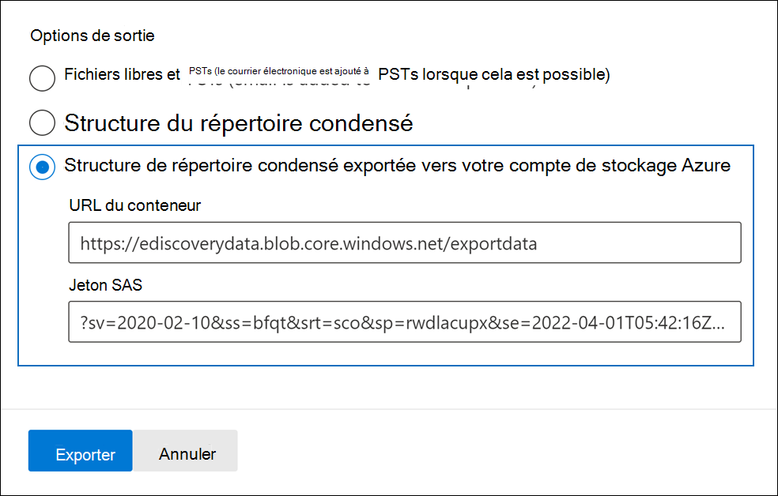
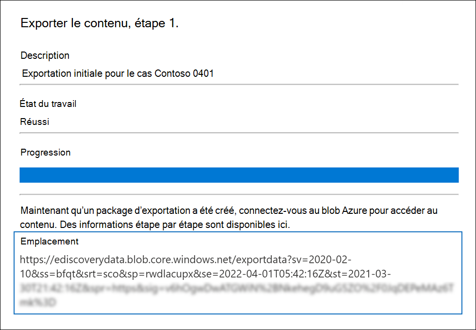
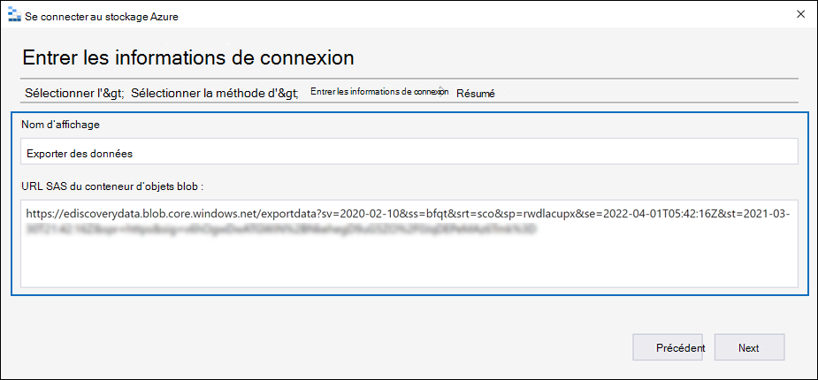
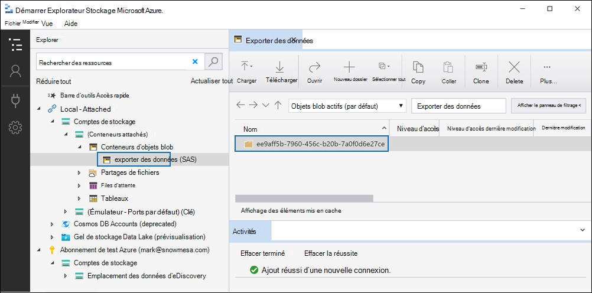

# Exporter des documents dans un jeu à réviser vers un compte stockage Azure client

Lorsque vous exportez des documents à partir d’un groupe de révision dans un cas Advanced eDiscovery, vous avez la possibilité de les exporter vers un compte stockage Azure géré par votre organisation. Si vous utilisez cette option, les documents sont téléchargés vers stockage Azure emplacement. Une fois exportés, vous pouvez accéder aux documents (et les télécharger sur un ordinateur local ou un autre emplacement) à l’aide de la Explorateur Stockage Azure. Cet article fournit des instructions sur la façon d’exporter des documents vers votre compte stockage Azure et l’utilisation du Explorateur Stockage Azure pour se connecter à un emplacement stockage Azure pour télécharger les documents exportés. Pour plus d’informations sur Explorateur Stockage Azure, voir [Utiliser Explorateur Stockage Azure](/azure/storage/blobs/storage-quickstart-blobs-storage-explorer).

## Avant d’exporter des documents à partir d’un jeu à réviser

- Vous devez fournir un jeton SAS (Shared Access Signature) pour votre compte stockage Azure et l’URL d’un conteneur spécifique dans le compte de stockage pour exporter des documents à partir d’un jeu à réviser. Assurez-vous de les avoir à disposition (par exemple, copiés dans un fichier texte) lorsque vous effectuez l’étape 2

  - **Jeton SAS**: assurez-vous d’obtenir le jeton SAS pour votre compte stockage Azure (et non pour le conteneur). Vous pouvez générer un jeton SAS pour votre compte dans stockage Azure. Pour ce faire, accédez au compte stockage Azure, puis sélectionnez Partager la **signature** d’accès sous **les paramètres Paramètres** dans le blade du compte de stockage. Utilisez les paramètres par défaut et autorisez tous les types de ressources lorsque vous générez le jeton SAS.

  - **URL du conteneur**: vous devez créer un conteneur vers qui télécharger les documents du jeu à réviser, puis obtenir une copie de l’URL du conteneur. par exemple, `https://ediscoverydata.blob.core.windows.net/exportdata` . Pour obtenir l’URL, go to the container in stockage Azure, and select **Properties** under the **Paramètres** section in the container blade.

- Téléchargez et installez le Explorateur Stockage Azure. Pour obtenir des instructions, [voir Explorateur Stockage Azure’outil.](https://go.microsoft.com/fwlink/p/?LinkId=544842) Vous utilisez cet outil pour vous connecter au conteneur dans votre compte stockage Azure et télécharger les documents que vous avez exportés à l’étape 1.

## Étape 1 : Exporter les documents à partir d’un jeu à réviser

La première étape consiste à créer une tâche d’exportation pour exporter des documents hors d’un groupe de révision. Pour obtenir des instructions plus détaillées sur toutes les options d’exportation, voir [Exporter des documents à partir d’un jeu à réviser.](export-documents-from-review-set.md) La procédure suivante met en évidence les paramètres pour exporter des documents vers le compte stockage Azure de votre organisation.

1. Dans la Centre de conformité Microsoft 365, ouvrez le cas Advanced eDiscovery,  sélectionnez l’onglet Ensembles de révision, puis sélectionnez le jeu à réviser à exporter.

2. Dans le jeu à réviser, cliquez sur **Exporter l’action.**  >  

3. Dans la page **volant des options** d’exportation, tapez un nom (obligatoire) et une description (facultatif) pour l’exportation.

4. Configurez les paramètres dans les sections documents, métadonnées, contenu et options. Pour plus d’informations sur ces paramètres, voir [Exporter des documents à partir d’un jeu à réviser.](export-documents-from-review-set.md)

5. Dans la section **Options de** sortie, sélectionnez la structure du répertoire **condensé exportée** vers votre stockage Azure de sortie.

6. Collez l’URL du conteneur et le jeton SAS de votre compte de stockage dans les champs correspondants.

   

7. Cliquez **sur Exporter** pour créer la tâche d’exportation.

## Étape 2 : Obtenir l’URL SAS à partir de la tâche d’exportation

L’étape suivante consiste à obtenir l’URL SAS générée après la création de la tâche d’exportation à l’étape 1. Vous utilisez l’URL SAS pour vous connecter au conteneur dans votre compte stockage Azure vers qui vous avez exporté les documents du jeu à réviser.

1. Dans la page **Advanced eDiscovery,** cliquez sur le cas, puis cliquez sur **l’onglet** Exportation.

2. Dans l'onglet **Exportations** cliquez sur la tâche d'exportation que vous souhaitez télécharger. Il s’agit du travail d’exportation que vous avez créé à l’étape 1.

3. Dans la page volante, sous **Emplacements,** copiez l’URL SAS qui s’affiche. Si nécessaire, vous pouvez l’enregistrer dans un fichier texte pour y accéder à l’étape 3.

   

   > [!TIP]
   > L’URL SAS qui s’affiche dans la tâche d’exportation est une concatenation de l’URL du conteneur et du jeton SAS pour votre compte stockage Azure client. Vous pouvez la copier à partir de la tâche d’exportation ou la créer vous-même en combinant l’URL et le jeton SAS.

## Étape 3 : Connecter au conteneur stockage Azure’accès

La dernière étape consiste à utiliser les Explorateur Stockage Azure et l’URL SAS pour se connecter au conteneur dans votre compte stockage Azure et télécharger les documents exportés sur un ordinateur local.

1. Démarrez la Explorateur Stockage Azure que vous avez téléchargée et installée.

2. Cliquez sur **l’icône ouvrir Connecter dialogue.**

   

3. Dans la **page Connecter à stockage Azure,** cliquez **sur Conteneur d’objets blob.**

4. Dans la page **Sélectionner une** méthode d’authentification, sélectionnez l’option signature d’accès **partagé (SAS),** puis cliquez sur **Suivant.**

5. Dans la page Entrer les **informations** de connexion, collez l’URL SAS (obtenue dans la tâche d’exportation à l’étape 2) dans la zone URL SAS du conteneur **Blob.**

    

    Notez que le nom du conteneur s’affiche dans la zone Nom **complet.** Vous pouvez modifier ce nom.

6. Cliquez **sur Suivant** pour afficher la page **récapitulatif,** puis cliquez **sur Connecter**.

    Le **nœud conteneurs Blob** (sous Stockage Comptes (conteneurs **attachés)**  >   \> est ouvert.

    

    Il contient un conteneur nommé avec le nom complet de l’étape 5. Ce conteneur contient un dossier pour chaque tâche d’exportation que vous avez téléchargée vers le conteneur dans stockage Azure compte. Ces dossiers sont nommés avec un ID qui correspond à l’ID de la tâche d’exportation. Vous pouvez trouver ces ID d’exportation (et  le nom de l’exportation) sous les informations  de support sur la page volante pour chaque tâche de préparation de l’exportation répertoriée sous l’onglet Travaux dans le cas Advanced eDiscovery. 

7. Double-cliquez sur le dossier du travail d’exportation pour l’ouvrir.

   Une liste de dossiers et de rapports d’exportation s’affiche.

    

8. Pour exporter tout le contenu de  la tâche d’exportation, cliquez sur la flèche vers le haut pour revenir au dossier du travail d’exportation, puis cliquez sur **Télécharger.**

9. Indiquez l'endroit où vous souhaitez télécharger les fichiers exportés, puis cliquez sur Sélectionnez le dossier.

    Le Explorateur Stockage Azure démarre le processus de téléchargement. L’état du téléchargement des éléments exportés s’affiche dans **le volet** Activités. Un message s’affiche lorsque le téléchargement est terminé.

> [!NOTE]
> Au lieu de télécharger l’intégralité de la tâche d’exportation dans Explorateur Stockage Azure, vous pouvez sélectionner des éléments spécifiques à télécharger et à afficher.

## Plus d’informations

- Le dossier du travail d’exportation contient les éléments suivants. Les éléments réels dans le dossier d’exportation sont déterminés par les options d’exportation configurées lors de la création de la tâche d’exportation. Pour plus d’informations sur ces options, voir [Exporter des documents à partir d’un jeu à réviser.](export-documents-from-review-set.md)

  - Export_load_file.csv : ce fichier CSV est un rapport d’exportation détaillé qui contient des informations sur chaque document exporté. Le fichier se compose d’une colonne pour chaque propriété de métadonnées d’un document. Pour obtenir la liste et la description des métadonnées incluses dans ce rapport, consultez la colonne Nom de champ exporté dans la table des champs de métadonnées de document [dans Advanced eDiscovery](document-metadata-fields-in-advanced-ediscovery.md). 

  - Summary.txt : fichier texte qui contient un résumé de l’exportation, y compris les statistiques d’exportation.

  - Extracted_text_files : ce dossier contient une version de fichier texte de chaque document exporté.

  - NativeFiles : ce dossier contient une version native de chaque document exporté.

  - Error_files : ce dossier inclut les éléments suivants lorsque la tâche d’exportation contient des fichiers d’erreur :

    - ExtractionError.csv : ce fichier CSV contient les métadonnées disponibles pour les fichiers qui n’ont pas été correctement extraits de leur élément parent.

    - ProcessingError : ce dossier contient des documents contenant des erreurs de traitement. Ce contenu est au niveau de l’élément, ce qui signifie que si une pièce jointe a une erreur de traitement, le document qui contient la pièce jointe est également inclus dans ce dossier.
