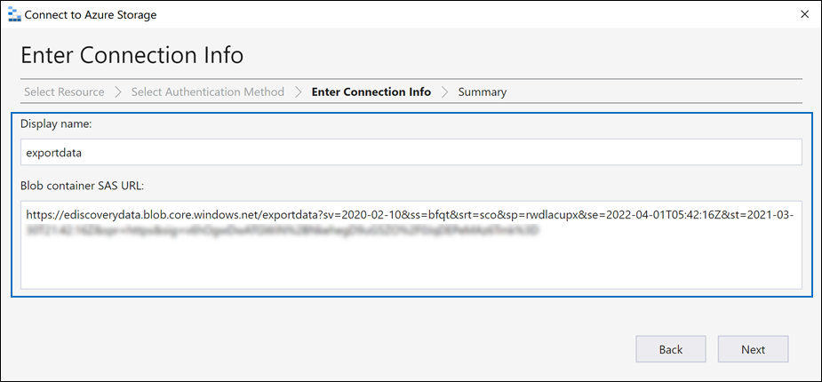

# Exporter des documents dans un ensemble de révisions vers un compte stockage Azure

Lorsque vous exportez des documents à partir d’un ensemble de révisions dans un cas eDiscovery (Premium), vous avez la possibilité de les exporter vers un compte stockage Azure géré par votre organisation. Si vous utilisez cette option, les documents sont chargés à votre emplacement stockage Azure. Une fois exportés, vous pouvez accéder aux documents (et les télécharger sur un ordinateur local ou à un autre emplacement) à l’aide de la Explorateur Stockage Azure. Cet article fournit des instructions sur l’exportation de documents vers votre compte stockage Azure et l’utilisation du Explorateur Stockage Azure pour vous connecter à un emplacement stockage Azure pour télécharger les documents exportés. Pour plus d’informations sur Explorateur Stockage Azure, consultez [Utiliser Explorateur Stockage Azure](/azure/storage/blobs/storage-quickstart-blobs-storage-explorer).

## Avant d’exporter des documents à partir d’un ensemble de révisions

- Vous devez fournir un jeton de signature d’accès partagé (SAP) pour votre compte stockage Azure et l’URL d’un conteneur spécifique dans le compte de stockage pour exporter des documents à partir d’un jeu de révision. Veillez à les avoir à portée de main (par exemple, copiés dans un fichier texte) lorsque vous effectuez l’étape 2

  - **Jeton SAS** : veillez à obtenir le jeton SAS pour votre compte stockage Azure (et non pour le conteneur). Vous pouvez générer un jeton SAS pour votre compte dans stockage Azure. Pour ce faire, accédez au compte stockage Azure, puis sélectionnez **Partager la signature d’accès** sous les paramètres **Paramètres** dans le panneau du compte de stockage. Utilisez les paramètres par défaut et autorisez tous les types de ressources lorsque vous générez le jeton SAS.

  - **URL** du conteneur : vous devez créer un conteneur dans lequel charger les documents du jeu de révision, puis obtenir une copie de l’URL du conteneur ; par exemple, `https://ediscoverydata.blob.core.windows.net/exportdata`. Pour obtenir l’URL, accédez au conteneur dans stockage Azure, puis sélectionnez **Propriétés** sous la section **Paramètres** dans le panneau conteneur.

- Téléchargez et installez le Explorateur Stockage Azure. Pour obtenir des instructions, consultez [Explorateur Stockage Azure outil](https://go.microsoft.com/fwlink/p/?LinkId=544842). Vous utilisez cet outil pour vous connecter au conteneur dans votre compte stockage Azure et télécharger les documents que vous avez exportés à l’étape 1.

## Étape 1 : Exporter les documents à partir d’un ensemble de révisions

La première étape consiste à créer un travail d’exportation pour exporter des documents à partir d’un ensemble de révisions. Pour obtenir des instructions plus détaillées sur toutes les options d’exportation, consultez [Exporter des documents à partir d’un ensemble de révisions](export-documents-from-review-set.md). La procédure suivante met en évidence les paramètres d’exportation de documents vers le compte stockage Azure de votre organisation.

1. Dans le portail de conformité Microsoft Purview, ouvrez le cas eDiscovery (Premium), sélectionnez l’onglet **Ensembles** de révision, puis sélectionnez l’ensemble de révisions à exporter.

2. Dans le jeu de révision, cliquez sur **ActionExport** > .

3. Dans la page de menu volant **Options d’exportation** , tapez un nom (obligatoire) et une description (facultatif) pour l’exportation.

4. Configurez les paramètres dans les sections documents, métadonnées, contenu et options. Pour plus d’informations sur ces paramètres, consultez [Exporter des documents à partir d’un ensemble de révisions](export-documents-from-review-set.md).

5. Dans la section **Options de sortie**, sélectionnez la **structure de répertoire condensée exportée vers votre option de compte stockage Azure**.

6. Collez l’URL du conteneur et le jeton SAS de votre compte de stockage dans les champs correspondants.

   

7. Cliquez sur **Exporter** pour créer le travail d’exportation.

## Étape 2 : Obtenir l’URL SAS à partir du travail d’exportation

L’étape suivante consiste à obtenir l’URL SAS générée après la création du travail d’exportation à l’étape 1. Vous utilisez l’URL SAS pour vous connecter au conteneur dans votre compte stockage Azure vers lequel vous avez exporté les documents du jeu de révisions.

1. Dans la page **eDiscovery (Premium),** accédez au cas, puis cliquez sur l’onglet **Exportations**.

2. Dans l'onglet **Exportations** cliquez sur la tâche d'exportation que vous souhaitez télécharger. Il s’agit du travail d’exportation que vous avez créé à l’étape 1.

3. Dans la page de menu volant, sous **Emplacements**, copiez l’URL SAS affichée. Si nécessaire, vous pouvez l’enregistrer dans un fichier texte pour y accéder à l’étape 3.

   

   > [!TIP]
   > L’URL SAS affichée dans le travail d’exportation est une concaténation de l’URL du conteneur et du jeton SAS pour votre compte stockage Azure. Vous pouvez le copier à partir du travail d’exportation ou le créer vous-même en combinant l’URL et le jeton SAS.

## Étape 3 : Connecter au conteneur stockage Azure

La dernière étape consiste à utiliser la Explorateur Stockage Azure et l’URL SAS pour vous connecter au conteneur de votre compte stockage Azure et télécharger les documents exportés sur un ordinateur local.

1. Démarrez la Explorateur Stockage Azure que vous avez téléchargée et installée.

2. Cliquez sur l’icône **Ouvrir Connecter Boîte de dialogue**.

   

3. Dans la **Connecter de stockage Azure** page, cliquez sur **Conteneur d’objets blob**.

4. Dans la page **Sélectionner la méthode d’authentification** , sélectionnez l’option **signature d’accès partagé (SAP),** puis cliquez sur **Suivant**.

5. Dans la page **Entrer les informations de connexion** , collez l’URL SAS (que vous avez obtenue dans le travail d’exportation à l’étape 2) dans la zone **URL SAS du conteneur d’objets blob** .

    

    Notez que le nom du conteneur s’affiche dans la zone **Nom d’affichage** . Vous pouvez modifier ce nom.

6. Cliquez sur **Suivant** pour afficher la page **récapitulative**, puis cliquez sur **Connecter**.

    Le nœud **conteneurs d’objets blob** (sous **Stockage Comptes** >  **(conteneurs attachés)** \> est ouvert.

    

    Il contient un conteneur nommé avec le nom complet de l’étape 5. Ce conteneur contient un dossier pour chaque tâche d’exportation que vous avez téléchargée dans le conteneur de votre compte stockage Azure. Ces dossiers sont nommés avec un ID qui correspond à l’ID du travail d’exportation. Vous trouverez ces ID d’exportation (et le nom de l’exportation) sous **les informations de support** sur la page de menu volant pour chaque **tâche de préparation des données pour l’exportation** répertoriée sous l’onglet **Travaux** dans le cas eDiscovery (Premium).

7. Double-cliquez sur le dossier du travail d’exportation pour l’ouvrir.

   Une liste de dossiers et de rapports d’exportation s’affiche.

    

8. Pour exporter tout le contenu du travail d’exportation, cliquez sur la flèche **Haut** pour revenir au dossier du travail d’exportation, puis cliquez sur **Télécharger**.

9. Indiquez l'endroit où vous souhaitez télécharger les fichiers exportés, puis cliquez sur Sélectionnez le dossier.

    Le Explorateur Stockage Azure démarre le processus de téléchargement. L’état du téléchargement des éléments exportés s’affiche dans le volet **Activités** . Un message s’affiche lorsque le téléchargement est terminé.

> [!NOTE]
> Au lieu de télécharger l’intégralité du travail d’exportation dans Explorateur Stockage Azure, vous pouvez sélectionner des éléments spécifiques à télécharger et à afficher.

## Plus d’informations

- Le dossier du travail d’exportation contient les éléments suivants. Les éléments réels dans le dossier d’exportation sont déterminés par les options d’exportation configurées lors de la création du travail d’exportation. Pour plus d’informations sur ces options, consultez [Exporter des documents à partir d’un ensemble de révisions](export-documents-from-review-set.md).

  - Export_load_file.csv : ce fichier CSV est un rapport d’exportation détaillé qui contient des informations sur chaque document exporté. Le fichier se compose d’une colonne pour chaque propriété de métadonnées d’un document. Pour obtenir la liste et la description des métadonnées incluses dans ce rapport, consultez la colonne **Nom du champ Exporté** dans la table dans [les champs de métadonnées document dans eDiscovery (Premium).](document-metadata-fields-in-advanced-ediscovery.md)

  - Summary.txt : fichier texte qui contient un résumé de l’exportation, y compris les statistiques d’exportation.

  - Extracted_text_files : ce dossier contient une version de fichier texte de chaque document exporté.

  - NativeFiles : ce dossier contient une version de fichier native de chaque document exporté.

  - Error_files : ce dossier inclut les éléments suivants lorsque le travail d’exportation contient des fichiers d’erreur :

    - ExtractionError.csv : ce fichier CSV contient les métadonnées disponibles pour les fichiers qui n’ont pas été correctement extraits de leur élément parent.

    - ProcessingError : ce dossier contient des documents contenant des erreurs de traitement. Ce contenu se trouve au niveau de l’élément, ce qui signifie que si une pièce jointe a rencontré une erreur de traitement, le document qui contient la pièce jointe sera également inclus dans ce dossier.
