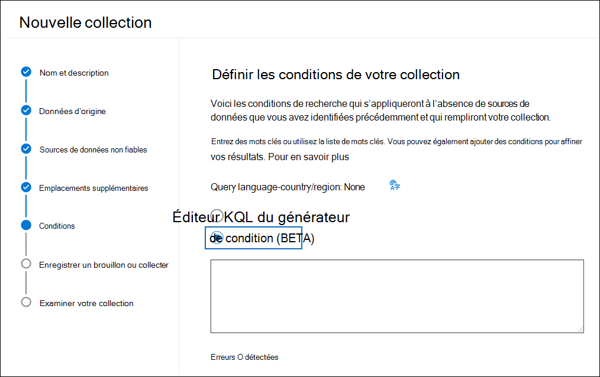

# Utiliser l’éditeur KQL pour générer des requêtes de recherche

[!include[Purview banner](../includes/purview-rebrand-banner.md)]

La nouvelle expérience de requête KQL dans Microsoft 365 recherche d’outils eDiscovery fournit des commentaires et des conseils lorsque vous créez des requêtes de recherche dans recherche de contenu, Microsoft Purview eDiscovery (Standard) et eDiscovery (Premium). Lorsque vous tapez des requêtes dans l’éditeur, elle fournit l’autocomplétion pour les propriétés et conditions pouvant faire l’objet d’une recherche prises en charge et fournit des listes de valeurs prises en charge pour les propriétés et conditions standard. Par exemple, si vous spécifiez la `kind` propriété de messagerie dans votre requête, l’éditeur présente une liste de valeurs prises en charge que vous pouvez sélectionner. L’éditeur KQL affiche également les erreurs de requête potentielles en temps réel que vous pouvez corriger avant d’exécuter la recherche. Mieux encore, vous pouvez coller des requêtes complexes directement dans l’éditeur sans avoir à générer manuellement des requêtes à l’aide des mots clés et des cartes de conditions dans le générateur de conditions standard.
  
Voici les principaux avantages de l’utilisation de l’éditeur KQL :

- Fournit des conseils et vous aide à créer des requêtes de recherche à partir de zéro.

- Vous permet de coller rapidement des requêtes longues et complexes directement dans l’éditeur. Par exemple, si vous recevez une requête complexe de l’avocat opposé, vous pouvez le coller dans l’éditeur KQL au lieu d’avoir à utiliser le générateur de conditions.

- Identifie rapidement les erreurs potentielles et affiche des conseils sur la façon de résoudre les problèmes.

L’éditeur KQL est également disponible lorsque vous créez des conservations basées sur des requêtes dans eDiscovery (Standard) et eDiscovery (Premium).

## Affichage de l’éditeur KQL

Lorsque vous créez ou modifiez une recherche eDiscovery, l’option permettant d’afficher et d’utiliser l’éditeur KQL se trouve sur la page **Conditions** de l’Assistant Recherche ou Collections.

### éditeur KQL dans recherche de contenu et eDiscovery (Standard)

### éditeur KQL dans eDiscovery (Premium)

## Utilisation de l’éditeur de KQL

Les sections suivantes montrent des exemples de la façon dont l’éditeur de KQL fournit des suggestions et détecte les erreurs potentielles.

### Autocomplétion des propriétés et des opérateurs de recherche

Lorsque vous commencez à taper une requête de recherche dans l’éditeur KQL, l’éditeur affiche la saisie semi-automatique suggérée des propriétés de recherche prises en charge (également appelées *restrictions de propriétés*) que vous pouvez sélectionner. Vous devez taper au moins deux caractères pour afficher une liste des propriétés prises en charge qui commencent par ces deux caractères. Par exemple, la capture d’écran suivante montre les propriétés de recherche suggérées qui commencent par `Se`.

En outre, l’éditeur suggère également de fournir une liste d’opérateurs pris en charge (tels que `:`, `=` et `<>`) lorsque vous tapez un nom de propriété complet. Par exemple, la capture d’écran suivante montre les opérateurs suggérés pour la `Date` propriété.

Pour plus d’informations sur les propriétés et opérateurs de recherche pris en charge, consultez [requêtes de mots clés et conditions de recherche pour eDiscovery](keyword-queries-and-search-conditions.md).

### Suggestions de valeur de propriété

L’éditeur KQL fournit des suggestions pour les valeurs possibles de certaines propriétés. Par exemple, la capture d’écran suivante montre les valeurs suggérées pour la `Kind` propriété.

L’éditeur suggère également une liste d’utilisateurs (au format UPN) lorsque vous tapez les propriétés du destinataire de l’e-mail, telles que `From`, `To``Recipients` et `Participants`.

### Détection d’erreurs potentielles

L’éditeur KQL détecte les erreurs potentielles dans les requêtes de recherche et fournit un indicateur de la cause de l’erreur pour vous aider à résoudre l’erreur. L’éditeur indique également une erreur potentielle lorsqu’une propriété n’a pas d’opération ou de valeur correspondante. Les erreurs potentielles dans la requête sont mises en surbrillance en texte rouge, et les explications et les correctifs possibles pour l’erreur sont affichés dans la section **déroulante Erreurs potentielles** . Par exemple, si vous avez collé la requête suivante dans l’éditeur KQL, quatre erreurs potentielles sont détectées.

Dans ce cas, vous pouvez utiliser les indicateurs d’erreur potentiels pour résoudre et corriger la requête.

## Plus d’informations

- Vous pouvez basculer entre le générateur de conditions et l’éditeur KQL. Par exemple, si vous utilisez le générateur de conditions pour configurer une requête à l’aide de la zone Mots clés et de plusieurs cartes de condition, vous pouvez afficher la requête résultante dans l’éditeur KQL. Toutefois, si vous créez une requête complexe (avec des mots clés et des conditions) dans l’éditeur KQL, la requête résultante s’affiche uniquement dans la zone Mots clés lorsque vous l’affichez dans le générateur de conditions.

- Si vous collez une requête complexe dans l’éditeur KQL, l’éditeur détecte les erreurs potentielles et suggère des solutions possibles pour résoudre les erreurs.
