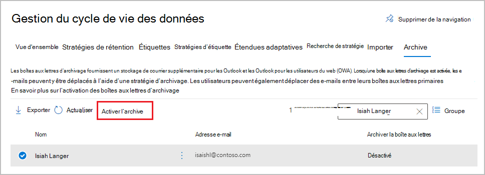

# <a name="enable-archive-mailboxes-for-microsoft-365"></a>Activer les boîtes aux lettres d’archivage pour Microsoft 365

>*[Guide de sécurité et conformité pour les licences Microsoft 365](/office365/servicedescriptions/microsoft-365-service-descriptions/microsoft-365-tenantlevel-services-licensing-guidance/microsoft-365-security-compliance-licensing-guidance).*

L’archivage dans Microsoft 365 (également appelé *Archivage local*) fournit aux utilisateurs de l’espace de stockage de boîtes aux lettres supplémentaire. Pour plus d’informations, consultez [En savoir plus sur les boîtes aux lettres d’archivage](archive-mailboxes.md).

Utilisez les informations de cet article pour activer ou désactiver une boîte aux lettres d’archivage à l’aide d’un portail d’administration ou de PowerShell. Découvrez également comment exécuter une vérification de diagnostic automatisée sur la boîte aux lettres d’archivage d’un utilisateur pour identifier les problèmes et suggestions de résolution.

Actuellement, vous pouvez utiliser le [portail de conformité Microsoft Purview](microsoft-365-compliance-center.md) ou le [nouveau Centre d’administration Exchange (EAC)](/exchange/exchange-admin-center) pour activer ou désactiver les boîtes aux lettres d’archivage.

## <a name="get-the-necessary-permissions"></a>Obtenir les autorisations nécessaires

Le rôle Destinataires du courrier doit vous être attribué dans Exchange Online pour activer ou désactiver les boîtes aux lettres d’archivage. Par défaut, ce rôle est attribué aux groupes de rôles Gestion des destinataires et Gestion de l’organisation sur la page **Autorisations** du <a href="https://go.microsoft.com/fwlink/p/?linkid=2059104" target="_blank">Centre d’administration Exchange</a>. 


## <a name="how-to-enable-an-archive-mailbox"></a>Comment activer une boîte aux lettres d’archivage

La configuration permettant de gérer les boîtes aux lettres d’archivage passe du portail de conformité Microsoft 365 Purview au nouveau centre d’administration Exchange.

### <a name="use-the-new-exchange-admin-center-to-enable-an-archive-mailbox"></a>Utiliser le nouveau centre d’administration Exchange pour activer une boîte aux lettres d’archivage

> [!NOTE]
> Lorsque vous activez la boîte aux lettres d’archivage, les éléments de la boîte aux lettres de l’utilisateur qui sont antérieurs à la stratégie d’archivage affectée à la boîte aux lettres sont déplacés vers la nouvelle boîte aux lettres d’archivage. La stratégie d’archivage par défaut qui fait partie de la stratégie de rétention affectée aux boîtes aux lettres Online déplace les éléments vers la boîte aux lettres d’archivage deux ans après la date à laquelle ils ont été remis à la boîte aux lettres ou créés par l’utilisateur. Pour plus d’informations, consultez [En savoir plus sur les boîtes aux lettres d’archivage](archive-mailboxes.md).

1. Dans le nouveau CENTRE, accédez aux **boîtes aux lettres** **des destinataires**\>.

2. Dans la liste des boîtes aux lettres, sélectionnez l’utilisateur pour activer sa boîte aux lettres pour l’archivage.

3. Dans le volet de menu volant, sélectionnez **Autres**, puis sous Archive de boîte **aux lettres**, **sélectionnez Gérer l’archive de boîte aux lettres** : 
    
   

4. Dans le volet **Gérer l’archive de boîte aux lettres** , activez l’archive de boîte **aux lettres**, puis **enregistrez**.

La création de la boîte aux lettres d’archivage peut prendre un certain temps. Lors de sa création, **Active** s’affiche dans la colonne **d’état Archive** pour l’utilisateur sélectionné, même si vous devrez peut-être actualiser la page pour voir le changement d’état.

### <a name="use-the-purview-compliance-portal-to-enable-an-archive-mailbox"></a>Utiliser le portail de conformité Purview pour activer une boîte aux lettres d’archivage

1. Accédez à <a href="https://go.microsoft.com/fwlink/p/?linkid=2077149" target="_blank">portail de conformité Microsoft Purview</a> et connectez-vous.

2. Dans le volet gauche du portail de conformité, sélectionnez **Gestion du** >  cycle de vie des données **Microsoft 365** > **Archive**.

   La page **Archive** s’affiche. La colonne **Boîte aux lettres d’archivage** indique si une boîte aux lettres d’archivage est activée ou désactivée pour chaque utilisateur.

   > [!NOTE]
   > La page **Archive** affiche au maximum 500 utilisateurs. Utilisez la zone de recherche si vous ne pouvez pas voir immédiatement le nom de l’utilisateur souhaité.

3. Dans la liste des boîtes aux lettres, sélectionnez l’utilisateur pour lequel vous voulez activer la boîte aux lettres d’archivage, puis sélectionnez l’option **Activer l’archivage** :
    
   
    
   Un avertissement s’affiche, qui vous signale que, si vous activez la boîte aux lettres d’archivage, les éléments de la boîte aux lettres de l’utilisateur plus anciens que la stratégie d’archivage affectée à la boîte aux lettres seront déplacés vers la nouvelle boîte aux lettres d’archivage. La stratégie d’archivage par défaut qui fait partie de la stratégie de rétention affectée aux boîtes aux lettres Online déplace les éléments vers la boîte aux lettres d’archivage deux ans après la date à laquelle ils ont été remis à la boîte aux lettres ou créés par l’utilisateur. Pour plus d’informations, consultez [En savoir plus sur les boîtes aux lettres d’archivage](archive-mailboxes.md).

5. Sélectionnez **Activer** pour confirmer.

   La création de la boîte aux lettres d’archivage peut prendre un certain temps. Lors de sa création, **Activé** s’affiche dans la colonne **Archiver la boîte aux lettres** de l’utilisateur sélectionné, même si vous devrez peut-être actualiser la page pour voir le changement d’état.

## <a name="how-to-disable-an-archive-mailbox"></a>Comment désactiver une boîte aux lettres d’archivage

De la même façon que vous activez une boîte aux lettres d’archivage, vous pouvez utiliser la même configuration dans le centre d’administration ou le portail de conformité pour désactiver la boîte aux lettres d’archivage d’un utilisateur. Cette fois- ci, désactivez l’archive de boîte **aux lettres** dans le centre d’administration exchange ou sélectionnez l’option **Désactiver l’archivage** après avoir sélectionné l’utilisateur dans le portail de conformité.

Après avoir désactivé une boîte aux lettres d’archivage, vous pouvez la reconnecter à la boîte aux lettres principale de l’utilisateur dans les 30 jours suivant sa désactivation. Dans ce cas, le contenu d’origine de la boîte aux lettres d’archivage est restauré. Après 30 jours, le contenu de la boîte aux lettres d’archivage d’origine est définitivement supprimé et ne peut pas être récupéré. Par conséquent, si vous réactivez l’archive plus de 30 jours après sa désactivation, une nouvelle boîte aux lettres d’archivage est créée.

La stratégie d’archivage par défaut affectée aux boîtes aux lettres des utilisateurs déplace les éléments vers la boîte aux lettres d’archivage deux ans après la date de remise de l’élément. Si vous désactivez la boîte aux lettres d’archivage d’un utilisateur, aucune action ne sera effectuée sur les éléments de boîte aux lettres et ils resteront dans la boîte aux lettres principale de l’utilisateur.

## <a name="use-exchange-online-powershell-to-enable-or-disable-archive-mailboxes"></a>Utiliser Exchange Online PowerShell pour activer ou désactiver les boîtes aux lettres d’archivage

Vous pouvez également utiliser Exchange Online PowerShell pour activer les boîtes aux lettres d’archivage. La principale raison d'utiliser PowerShell est que vous pouvez activer rapidement la boîte aux lettres d'archivage pour tous les utilisateurs de votre organisation.

La première étape consiste à se connecter à Exchange Online PowerShell. Pour obtenir des instructions, voir [Connexion à Exchange Online PowerShell](/powershell/exchange/connect-to-exchange-online-powershell).

Une fois que vous êtes connecté à Exchange Online, vous pouvez exécuter les commandes décrites dans les sections suivantes pour activer ou désactiver les boîtes aux lettres d’archivage.

### <a name="enable-archive-mailboxes"></a>Activer les boîtes aux lettres d’archivage

Pour activer la boîte aux lettres d’archivage pour un seul utilisateur, exécutez la commande suivante.

```powershell
Enable-Mailbox -Identity <username> -Archive
```

Pour activer la boîte aux lettres d’archivage pour tous les utilisateurs au sein de votre organisation (dont la boîte aux lettres d’archivage n’est pas activée), exécutez la commande suivante.

```powershell
Get-Mailbox -Filter {ArchiveGuid -Eq "00000000-0000-0000-0000-000000000000" -AND RecipientTypeDetails -Eq "UserMailbox"} | Enable-Mailbox -Archive
```

### <a name="disable-archive-mailboxes"></a>Désactiver les boîtes aux lettres d’archivage

Pour désactiver la boîte aux lettres d’archivage pour un seul utilisateur, exécutez la commande suivante.

```powershell
Disable-Mailbox -Identity <username> -Archive
```

Pour désactiver la boîte aux lettres d’archivage pour tous les utilisateurs au sein de votre organisation (dont la boîte aux lettres d’archivage est activée), exécutez la commande suivante.

```powershell
Get-Mailbox -Filter {ArchiveGuid -Ne "00000000-0000-0000-0000-000000000000" -AND RecipientTypeDetails -Eq "UserMailbox"} | Disable-Mailbox -Archive
```

## <a name="run-diagnostics-on-archive-mailboxes"></a>Exécuter des diagnostics sur des boîtes aux lettres d’archivage

Vous pouvez exécuter une vérification de diagnostic automatisée sur la boîte aux lettres d’archivage d’un utilisateur pour identifier les problèmes et les résolutions suggérées.

Pour exécuter la vérification de diagnostic, cliquez sur le bouton ci-dessous. 

> [!div class="nextstepaction"]
> [Exécuter des tests : boîte aux lettres d’archivage](https://aka.ms/PillarArchiveMailbox)


Une page volante s’ouvre dans le Centre d'administration Microsoft 365. Entrez l’adresse e-mail de la boîte aux lettres que vous souhaitez vérifier, puis cliquez sur **Exécuter les tests.**

> [!NOTE]
> Vous devez être un administrateur Microsoft 365 pour utiliser la vérification de diagnostic de boîte aux lettres d’archivage. En outre, cette fonctionnalité n’est pas disponible dans les clouds Microsoft 365 Administration, Microsoft 365 gérés par 21Vianet ou Microsoft 365 Germany.

## <a name="instructions-for-end-users"></a>Instructions pour les utilisateurs finaux

Expliquez aux utilisateurs comment fonctionne leur boîte aux lettres d’archivage et comment ils peuvent interagir avec elle dans Outlook sur Windows, macOS et sur le Web. La documentation la plus efficace sera personnalisée pour votre organisation. Mais pour obtenir des instructions de base, consultez [Gérer le stockage des e-mails avec des boîtes aux lettres d’archivage en ligne](https://prod.support.services.microsoft.com/en-us/office/manage-email-storage-with-online-archive-mailboxes-1cae7d17-7813-4fe8-8ca2-9a5494e9a721).

## <a name="next-steps"></a>Prochaines étapes

Envisagez d’activer [l’archivage à extension automatique](autoexpanding-archiving.md) pour un espace de stockage supplémentaire. Pour obtenir des instructions, voir [Activer l’archivage à extension automatique](enable-autoexpanding-archiving.md).
