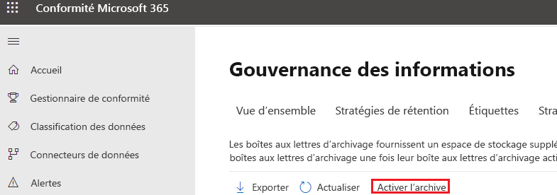
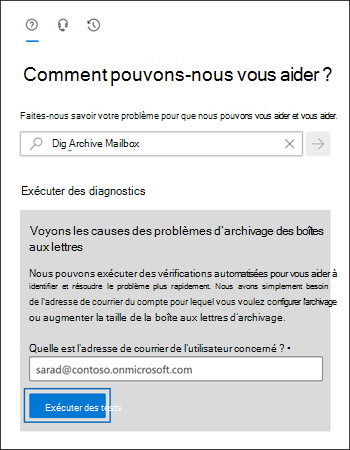

# <a name="enable-archive-mailboxes-in-the-compliance-center"></a>Activer des boîtes aux lettres d’archivage dans le Centre conformité

L’archivage dans Microsoft 365 (également appelé *Archivage inaltérable*) fournit aux utilisateurs de l’espace de stockage de boîtes aux lettres supplémentaire. Une fois que vous avez activé les boîtes aux lettres d’archivage, les utilisateurs peuvent consulter et stocker des messages dans leurs boîtes aux lettres d’archivage à l’aide de Microsoft Outlook et d’Outlook sur le web (autrefois appelé Outlook Web App). Les utilisateurs peuvent également déplacer ou copier des messages entre leurs boîtes aux lettres principale et d’archivage. Ils peuvent également récupérer les éléments supprimés du dossier Éléments récupérables dans leur boîte aux lettres d’archivage à l’aide de l’outil Récupérer les éléments supprimés.

> [!NOTE]
> La fonctionnalité d’archivage à extension automatique fournit, dans Microsoft 365, un espace de stockage complémentaire dans les boîtes aux lettres d’archivage. Lorsque l’archivage à développement automatique est activé et que le quota de stockage initial de la boîte aux lettres d’archivage d’un utilisateur est atteint, Microsoft 365 ajoute automatiquement un espace de stockage supplémentaire. Cela signifie que les utilisateurs ne tombent pas à cours d’espace de stockage de boîte aux lettres et que vous n’avez plus besoin de gérer quoi que ce soit après l’activation initiale de la boîte aux lettres d’archivage et de l’archivage à développement automatique pour votre organisation. Pour plus d’informations, voir [Vue d’ensemble d’un archivage à développement automatique](autoexpanding-archiving.md).

## <a name="get-the-necessary-permissions"></a>Obtenir les autorisations nécessaires

Pour activer ou désactiver les boîtes aux lettres d’archivage, vous devez être affecté au rôle Destinataires du courrier dans Exchange Online. Par défaut, ce rôle est attribué aux groupes de rôles Gestion des destinataires et Gestion de l’organisation sur la page **Autorisations** du <a href="https://go.microsoft.com/fwlink/p/?linkid=2059104" target="_blank">Centre d’administration Exchange</a>. Si vous ne voyez pas la page **Archive** dans le Centre de conformité Microsoft 365, demandez à votre administrateur de vous attribuer les autorisations nécessaires.

## <a name="enable-an-archive-mailbox"></a>Activer une boîte aux lettres d’archivage

1. Accédez au <a href="https://go.microsoft.com/fwlink/p/?linkid=2077149" target="_blank">Centre de conformité Microsoft 365</a>, puis connectez-vous.

2. Dans le volet gauche du Centre de conformité Microsoft 365, cliquez sur **Gouvernance des informations**, puis sur l’onglet **Archive**.

   La page **Archive** s’affiche. La colonne **Boîte aux lettres d’archivage** indique si une boîte aux lettres d’archivage est activée ou désactivée pour chaque utilisateur.

   > [!NOTE]
   > La page **Archive** affiche au maximum 500 utilisateurs.

3. Dans la liste des boîtes aux lettres, sélectionnez l’utilisateur pour lequel vous voulez activer la boîte aux lettres d’archivage.

   

4. Dans le volet d’informations de l’utilisateur sélectionné, cliquez sur **Activer**.

   Un avertissement s'affiche indiquant que si vous activez la boîte aux lettres d'archivage, les éléments de la boîte aux lettres de l'utilisateur qui sont plus anciens que la stratégie d'archivage attribuée à la boîte aux lettres seront déplacés vers la nouvelle boîte aux lettres d'archivage. La stratégie d'archivage par défaut qui fait partie de la stratégie de rétention attribuée aux boîtes aux lettres Exchange Online déplace les éléments vers la boîte aux lettres d'archivage deux ans après la date à laquelle l'élément a été remis à la boîte aux lettres ou créé par l'utilisateur. Pour plus d'informations, consultez la section **Plus d'informations** de cet article.

5. Cliquez sur **Oui** pour activer la boîte aux lettres d’archivage.

   La création de la boîte aux lettres d'archivage peut prendre quelques instants. Lorsqu'il est créé, **Archiver la boîte aux lettres : activé** s'affiche dans le volet de détails pour l'utilisateur sélectionné. Vous devrez peut-être cliquer sur **Actualiser**  pour mettre à jour les informations dans le volet de détails.

> [!TIP]
> Vous pouvez également activer des boîtes aux lettres d’archivage en bloc en sélectionnant plusieurs utilisateurs dont les boîtes aux lettres sont désactivées (à l’aide de la touche Maj ou Ctrl). Une fois les boîtes aux lettres sélectionnées, cliquez sur **Activer** dans le volet des détails.

## <a name="disable-an-archive-mailbox"></a>Désactiver une boîte aux lettres d’archivage

Vous pouvez également utiliser la page **Archiver** dans le centre de conformité Microsoft 365 pour désactiver la boîte aux lettres d'archivage d'un utilisateur. Après avoir désactivé une boîte aux lettres d'archivage, vous pouvez la reconnecter à la boîte aux lettres principale de l'utilisateur dans les 30 jours suivant sa désactivation. Dans ce cas, le contenu d'origine de la boîte aux lettres d'archivage est restauré. Après 30 jours, le contenu de la boîte aux lettres d'archive d'origine est définitivement supprimé et ne peut pas être récupéré. Ainsi, si vous réactivez l'archive plus de 30 jours après l'avoir désactivée, une nouvelle boîte aux lettres d'archive est créée.

La stratégie d’archivage par défaut affectée aux boîtes aux lettres des utilisateurs déplace les éléments dans la boîte aux lettres d’archivage deux ans après la date de remise de l’élément. Si vous désactivez la boîte aux lettres d’archivage d’un utilisateur, aucune action n’est effectuée sur les éléments de boîte aux lettres et ceux-ci resteront dans la boîte aux lettres principale de l’utilisateur.

Pour désactiver une boîte aux lettres d’archivage :

1. Accédez au <a href="https://go.microsoft.com/fwlink/p/?linkid=2077149" target="_blank">Centre de conformité Microsoft 365</a>, puis connectez-vous.

2. Dans le volet gauche du Centre de conformité Microsoft 365, cliquez sur **Gouvernance des informations**, puis sur l’onglet **Archive**.

   La page **Archive** s’affiche. La colonne **Boîte aux lettres d’archivage** indique si une boîte aux lettres d’archivage est activée ou désactivée pour chaque utilisateur.

   > [!NOTE]
   > La page **Archive** affiche au maximum 500 utilisateurs.

3. Dans la liste des boîtes aux lettres, sélectionnez l’utilisateur pour lequel vous voulez désactiver la boîte aux lettres d’archivage.

4. Dans le volet des détails, cliquez sur **Désactiver**.

   Un message d’avertissement s’affiche, indiquant que vous avez 30 jours pour réactiver la boîte aux lettres d’archivage et qu’à l’issue de ce délai, toutes les informations contenues dans l’archive seront définitivement supprimées.

5. Cliquez sur **Oui** pour désactiver la boîte aux lettres d’archivage.

   La désactivation de la boîte aux lettres d'archivage peut prendre quelques instants. Lorsqu'il est désactivé, **Archiver la boîte aux lettres : désactivé** s'affiche dans le volet de détails pour l'utilisateur sélectionné. Vous devrez peut-être cliquer sur **Actualiser**  pour mettre à jour les informations dans le volet de détails.

> [!TIP]
> Vous pouvez également désactiver des boîtes aux lettres d’archivage en bloc en sélectionnant plusieurs utilisateurs dont les boîtes aux lettres sont activées (à l’aide de la touche Maj ou Ctrl). Une fois les boîtes aux lettres sélectionnées, cliquez sur **Désactiver** dans le volet des détails.

## <a name="use-exchange-online-powershell-to-enable-or-disable-archive-mailboxes"></a>Utiliser Exchange Online PowerShell pour activer ou désactiver les boîtes aux lettres d’archivage

Vous pouvez également utiliser Exchange Online PowerShell pour activer les boîtes aux lettres d’archivage. La principale raison d'utiliser PowerShell est que vous pouvez activer rapidement la boîte aux lettres d'archivage pour tous les utilisateurs de votre organisation.

La première étape consiste à se connecter à Exchange Online PowerShell. Pour obtenir des instructions, voir [Connexion à Exchange Online PowerShell](/powershell/exchange/connect-to-exchange-online-powershell).

Une fois que vous êtes connecté à Exchange Online, vous pouvez exécuter les commandes décrites dans les sections suivantes pour activer ou désactiver les boîtes aux lettres d’archivage.

### <a name="enable-archive-mailboxes"></a>Activer les boîtes aux lettres d’archivage

Pour activer la boîte aux lettres d’archivage pour un seul utilisateur, exécutez la commande suivante.

```powershell
Enable-Mailbox -Identity <username> -Archive
```

Pour activer la boîte aux lettres d’archivage pour tous les utilisateurs au sein de votre organisation (dont la boîte aux lettres d’archivage n’est pas activée), exécutez la commande suivante.

```powershell
Get-Mailbox -Filter {ArchiveGuid -Eq "00000000-0000-0000-0000-000000000000" -AND RecipientTypeDetails -Eq "UserMailbox"} | Enable-Mailbox -Archive
```

### <a name="disable-archive-mailboxes"></a>Désactiver les boîtes aux lettres d’archivage

Pour désactiver la boîte aux lettres d’archivage pour un seul utilisateur, exécutez la commande suivante.

```powershell
Disable-Mailbox -Identity <username> -Archive
```

Pour désactiver la boîte aux lettres d’archivage pour tous les utilisateurs au sein de votre organisation (dont la boîte aux lettres d’archivage est activée), exécutez la commande suivante.

```powershell
Get-Mailbox -Filter {ArchiveGuid -Ne "00000000-0000-0000-0000-000000000000" -AND RecipientTypeDetails -Eq "UserMailbox"} | Disable-Mailbox -Archive
```

## <a name="run-diagnostics-on-archive-mailboxes"></a>Exécuter des diagnostics sur des boîtes aux lettres d’archivage

Vous pouvez exécuter une vérification de diagnostic automatisée sur la boîte aux lettres d’archivage d’un utilisateur pour identifier les problèmes et les résolutions suggérées.

Pour exécuter la vérification de diagnostic, cliquez sur le bouton ci-dessous. 

> [!div class="nextstepaction"]
> [Exécuter des tests : boîte aux lettres d’archivage](https://aka.ms/PillarArchiveMailbox)



Une page volante s’ouvre dans le Centre d'administration Microsoft 365. Entrez l’adresse e-mail de la boîte aux lettres que vous souhaitez vérifier, puis cliquez sur **Exécuter les tests.**

> [!NOTE]
> Vous devez être un administrateur Microsoft 365 pour utiliser la vérification de diagnostic de boîte aux lettres d’archivage. En outre, cette fonctionnalité n’est pas disponible dans les clouds Microsoft 365 Administration, Microsoft 365 gérés par 21Vianet ou Microsoft 365 Germany.

## <a name="more-information"></a>Plus d’informations

- Quand une boîte aux lettres d’archivage est activé, les utilisateurs peuvent y stocker des messages. Les utilisateurs peuvent accéder à leur boîte aux lettres d’archivage à l’aide de Microsoft Outlook et d’Outlook sur le web. À l’aide de l’une de ces applications clientes, les utilisateurs peuvent afficher les messages dans leur boîte aux lettres d’archivage et déplacer ou copier des messages entre leur boîte aux lettres principale et la boîte aux lettres d’archivage. Les utilisateurs peuvent également récupérer les éléments supprimés du dossier Éléments récupérables dans leur boîte aux lettres d’archivage à l’aide de l’outil de récupération des éléments supprimés.

  Pour obtenir la liste des licences Outlook qui prennent en charge l’archivage inaltérable, voir [Conditions de licence Outlook requises pour les fonctionnalités Exchange](https://support.microsoft.com/office/46b6b7c5-c3ca-43e5-8424-1e2807917c99).

- Les boîtes aux lettres d’archivage vous aident à répondre aux exigences de rétention, d’eDiscovery et de conservation des messages de votre organisation. Par exemple, vous pouvez utiliser la stratégie de rétention Exchange de votre organisation pour déplacer le contenu de boîtes aux lettres vers la boîte aux lettres d’archivage des utilisateurs. Lorsque vous utilisez l'outil de recherche de contenu dans le centre de conformité Microsoft 365 pour rechercher un contenu spécifique dans la boîte aux lettres d'un utilisateur, la boîte aux lettres d'archives de l'utilisateur sera également recherchée. Lorsque vous définissez une Conservation pour litige ou appliquez une stratégie de rétention à la boîte aux lettres d’un utilisateur, les éléments contenus dans la boîte aux lettres d’archivage sont également conservés.

- Lorsque les boîtes aux lettres d’archivage sont activées, votre organisation peut tirer parti de la stratégie de rétention par défaut Exchange (également appelée stratégie de Gestion des enregistrements de messagerie ou MRM) automatiquement affectée à chaque boîte aux lettres. Quand une boîte aux lettres d’archivage est activée, la stratégie de rétention par défaut Exchange effectue automatiquement les opérations suivantes :

  - Elle déplace les éléments datant de deux ans ou plus de la boîte aux lettres principale d’un utilisateur à sa boîte aux lettres d’archivage.

  - Elle déplace les éléments datant de 14 jours ou plus du dossier Éléments récupérables dans la boîte aux lettres principale de l’utilisateur vers le dossier Éléments récupérables dans la boîte aux lettres d’archivage.

- Pour plus d’informations sur les boîtes aux lettres d’archivage et les stratégies de rétention Exchange, voir:

  - [Balises et stratégies de rétention dans Exchange Online](/exchange/security-and-compliance/messaging-records-management/retention-tags-and-policies)

  - [Stratégie de rétention par défaut dans Exchange Online](/exchange/security-and-compliance/messaging-records-management/default-retention-policy)

  - [Configurer une stratégie d’archivage et de suppression pour les boîtes aux lettres de votre organisation](set-up-an-archive-and-deletion-policy-for-mailboxes.md)
