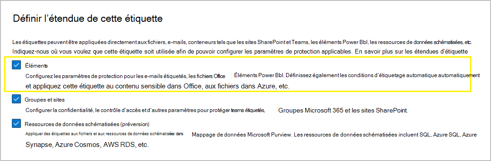
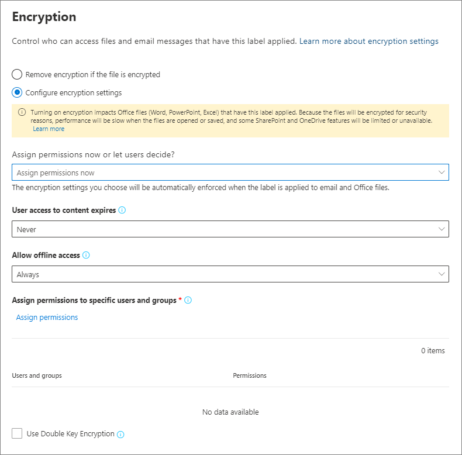

# Restreindre l'accès au contenu grâce à la mise en place d'un chiffrement par les étiquettes de confidentialité

>*[Guide de sécurité et conformité pour les licences Microsoft 365](/office365/servicedescriptions/microsoft-365-service-descriptions/microsoft-365-tenantlevel-services-licensing-guidance/microsoft-365-security-compliance-licensing-guidance).*

Lorsque vous créez une étiquette de sensibilité, vous pouvez restreindre l’accès au contenu auquel l’étiquette sera appliquée. Par exemple, avec les paramètres de chiffrement d’une étiquette de sensibilité, vous pouvez protéger le contenu comme suit :

- Seuls les utilisateurs de votre organisation peuvent ouvrir un document ou un e-mail confidentiel.
- Seuls les utilisateurs du département marketing peuvent modifier et imprimer le document ou l’e-mail d’annonce de promotion, alors que tous les autres utilisateurs de votre organisation peuvent uniquement le lire.
- Les utilisateurs ne peuvent pas transférer un e-mail ou y copier tout contenu relatif à une réorganisation interne.
- La liste de prix à jour envoyée aux partenaires ne peut pas être ouverte après une date spécifiée.

Lorsqu’un document ou un e-mail est chiffré, l’accès à son contenu est restreint de l’une des façons suivantes :

- Il peut uniquement être déchiffré par les utilisateurs autorisés par les paramètres de chiffrement de l’étiquette.
- Il reste chiffré quel que soit son emplacement, interne ou externe à votre organisation, même si le fichier est renommé.
- Il est chiffré lorsqu’il est inactif (par exemple dans un compte OneDrive) et en transit (par exemple, courrier pendant qu’il traverse Internet).

Enfin, en tant qu’administrateur, lorsque vous configurez une étiquette de confidentialité pour appliquer le chiffrement, vous pouvez choisir d’effectuer l’une des opérations suivantes :

- **Attribuer des autorisations maintenant**, afin de déterminer précisément les utilisateurs autorisés à accéder au contenu associé à cette étiquette.
- **Permettre aux utilisateurs d'attribuer des autorisations** lorsqu’ils appliquent l’étiquette au contenu. De cette façon, vous pouvez proposer aux membres de votre organisation la souplesse nécessaire pour mieux collaborer et accomplir leur travail.

Les paramètres de chiffrement sont disponibles lorsque vous [créez une étiquette de confidentialité](create-sensitivity-labels.md) dans le Centre de conformité Microsoft 365. Vous pouvez également utiliser l’ancien portail, le Centre de sécurité et conformité.

## Comprendre comment fonctionne le chiffrement

Le chiffrement utilise le service Azure Rights Management (Azure RMS) à partir d’Azure Information Protection. Cette solution de protection utilise les stratégies de chiffrement, d’identité et d’autorisation. Pour plus d’informations, consultez [Qu’est-ce que Azure Rights Management ?](/azure/information-protection/what-is-azure-rms) dans la documentation Azure Information Protection. 

Lorsque vous utilisez cette solution de chiffrement, la fonctionnalité **super utilisateur** s'assurer que les personnes et services autorisés peuvent toujours consulter et examiner les données qui ont été cryptées pour votre organisation. Le chiffrement peut ensuite être supprimé ou modifié si nécessaire. Pour plus d’informations, consultez la [Configuration de super utilisateurs pour les services Azure Information Protection et les services de découverte ou de la récupération de données](/azure/information-protection/configure-super-users).

## Conditions préalables importantes

Pour utiliser le chiffrement, vous devrez peut-être effectuer des tâches de configuration. Lorsque vous configurez les paramètres de chiffrement, il n’est pas vérifié que ces conditions préalables sont remplies.

- Activer la protection à partir d’Azure Information Protection
    
    Pour que le chiffrement soit appliqué par les étiquettes de confidentialité, le service de protection (Azure Rights Management) à partir d’Azure Information Protection doit être activé pour votre client. Chez les nouveaux clients, il s’agit du paramètre par défaut, mais vous devrez peut-être activer manuellement le service. Pour plus d’informations, consultez [Activation du service de protection à partir d’Azure Information Protection](/azure/information-protection/activate-service).

- Vérifier la configuration réseau requise
    
    Vous devrez peut-être apporter quelques modifications sur vos appareils réseau tels que les pare-feux. Pour obtenir des détails, voir [Pare-feu et infrastructure réseau](/azure/information-protection/requirements#firewalls-and-network-infrastructure) dans la documentation Azure Information Protection.

- Configurer Exchange pour Azure Information Protection
    
    Il n’est pas indispensable de configurer Exchange pour Azure Information Protection pour que les utilisateurs puissent appliquer des étiquettes dans Outlook afin de chiffrer leurs e-mails. Toutefois, aussi longtemps que Exchange n’est pas configuré pour Azure Information Protection, vous ne bénéficiez pas de toutes les fonctionnalités d’utilisation de la protection d’Azure Rights Management avec Exchange.
    
    Par exemple, les utilisateurs ne peuvent pas afficher les e-mails chiffrés sur des téléphones mobiles ou avec Outlook sur le web, les messages e-mails chiffrés ne peuvent pas être indexés pour la recherche et vous ne pouvez pas configurer la protection contre la perte de données (DLP) Exchange Online pour la protection Rights Management. 
    
    Pour vous assurer qu’Exchange est en mesure de prendre en charge ces scénarios supplémentaires, reportez-vous aux rubriques suivantes :
    
    - Pour Exchange Online, consultez les instructions de la section [Exchange Online : configuration de la gestion des droits relatifs à l’information](/azure/information-protection/configure-office365#exchangeonline-irm-configuration).
    - Pour Exchange en local, vous devez déployer le [connecteur RMS et configurer vos serveurs Exchange](/azure/information-protection/deploy-rms-connector). 

## La configuration d’une étiquette pour le chiffrement

1. Suivez les instructions générales pour [créer ou modifier une étiquette de confidentialité](create-sensitivity-labels.md#create-and-configure-sensitivity-labels) et assurez-vous de sélectionner **Fichiers et e-mails** pour l’étendue de l’étiquette : 
    
    

2. Sur la page **Choisir les paramètres de protection pour les fichiers et les e-mails**, assurez-vous de sélectionner **Chiffrer les fichiers et les e-mails**.
    
    

4.  Sur la page **Chiffrement**, sélectionnez l’une des options suivantes :
    
    - **Supprimer le chiffrement si le fichier est chiffré** l’option est uniquement prise en charge par le client de l’étiquetage unifié d’Azure Information Protection. Lorsque vous sélectionnez cette option et que vous utilisez l'étiquetage intégré, il se peut que l'étiquette ne s'affiche pas dans les applications, ou qu'elle s'affiche et n'effectue aucune modification de chiffrement.
        
        Pour plus d’informations sur ce scénario, voir la section [Qu’advient-il du chiffrement lorsqu’une nouvelle étiquette est appliquée ?](#what-happens-to-existing-encryption-when-a-labels-applied). Il est important de comprendre que ce paramètre peut engendrer une étiquette de confidentialité que les utilisateurs ne pourront peut-être pas appliquer s’ils ne disposent pas des autorisations suffisantes.
    
    - **Configurer les paramètres de chiffrement** : active le chiffrement et rend les paramètres de chiffrement visibles :
        
        
        
        Vous trouverez des instructions pour ces paramètres dans la section [Configurer les paramètres de chiffrement](#configure-encryption-settings).

### Qu’advient-il du chiffrement existant lorsqu’une nouvelle étiquette est appliquée ?

Si une étiquette de confidentialité est appliquée à du contenu non chiffré, le résultat des options de chiffrement que vous pouvez sélectionner est explicite. Par exemple, si vous n’avez pas sélectionné **Chiffrer les fichiers et les e-mails**, le contenu reste non chiffré.

Toutefois, il est possible que le contenu soit déjà chiffré. Par exemple, un autre utilisateur peut avoir appliqué :

- Ses propres autorisations, y compris les autorisations définies par l’utilisateur lorsqu'il y est invité par une étiquette, les autorisations personnalisées par le client Azure Information Protection et la protection de documents par l'**Accès restreint** dans une application Office.
- Un modèle de protection Azure Rights Management chiffrant le contenu d’une étiquette de manière individuelle. Cette catégorie inclut les règles de flux de courrier qui appliquent le chiffrement à l’aide de la protection des droits.
- Une étiquette appliquant le chiffrement par le biais des autorisations attribuées par l’administrateur.

Le tableau ci-après précise ce qu’il advient du chiffrement existant lorsqu’une étiquette de niveau de confidentialité est appliquée à ce contenu :

| | Chiffrement : non sélectionné | Chiffrement : configuré | Chiffrement : Supprimer\* |
|:-----|:-----|:-----|:-----|
|**Autorisations spécifiées par l'utilisateur**|Le chiffrement d’origine est conservé|Le nouveau chiffrement d'étiquettes est appliqué|Le chiffrement d’origine est supprimé|
|**Modèle de protection**|Le chiffrement d’origine est conservé|Le nouveau chiffrement d'étiquettes est appliqué|Le chiffrement d’origine est supprimé|
|**Étiquette incluant les autorisations définies par l’administrateur**|Le chiffrement d’origine est supprimé|Le nouveau chiffrement d'étiquettes est appliqué|Le chiffrement d’origine est supprimé|

**Note de bas de page :**

\* Prise en charge par le client de l’étiquetage unifié d’Azure Information Protection.

Dans le cas où le nouveau chiffrement d’étiquettes est appliqué ou si le chiffrement d’origine est supprimé, cela se produit uniquement si l’utilisateur appliquant l’étiquette dispose d'un droit ou d'un rôle qui prend en charge cette action :

- Le [droit d'utilisation](/azure/information-protection/configure-usage-rights#usage-rights-and-descriptions) Exportation ou Contrôle total.
- Rôle du [propriétaire ou de l'émetteur des Rights Management](/azure/information-protection/configure-usage-rights#rights-management-issuer-and-rights-management-owner) ou du [super utilisateur](/azure/information-protection/configure-super-users).

Si l’utilisateur ne dispose pas de ces droits ou rôles, l’étiquette ne peut pas être appliquée et le chiffrement d’origine est préservé. L’utilisateur voit le message suivant : **Vous n’êtes pas autorisé à effectuer cette modification dans l’étiquette de confidentialité. Veuillez contacter le propriétaire du contenu.**

Par exemple, la personne appliquant Ne pas transférer à un courrier électronique peut étiqueter de nouveau le thread afin de remplacer ou de supprimer le chiffrement, car elle est propriétaire des Rights Management de cet e-mail. À l’exception des super utilisateurs, les destinataires de ce message ne peuvent pas lui attribuer une nouvelle étiquette, car ils disposent pas des droits d’utilisation requis.

#### Pièces jointes des courriers électroniques chiffrés

Lorsqu’un courrier électronique est chiffré par une quelconque méthode, les documents Office non chiffrés joints au message héritent automatiquement des mêmes paramètres de chiffrement.

Les documents déjà chiffrés, puis ajoutés sous forme de pièces jointes, conservent leur chiffrement d’origine.

## Configurer les paramètres du chiffrement

Lorsque vous sélectionnez **Configurer les paramètres de confidentialité** sur la page **Chiffrement** pour créer ou modifier une étiquette de confidentialité, choisissez l’une des options suivantes :

- **Attribuer des autorisations maintenant**, afin de déterminer précisément les utilisateurs autorisés à accéder au contenu auquel l'étiquette est appliquée. Pour plus d’informations, voir la section suivante [Attribuer des autorisations maintenant](#assign-permissions-now).
- **Permettre aux utilisateurs d'attribuer des autorisations** lorsque vos utilisateurs appliquent l’étiquette au contenu. Grâce à cette option, vous permettez aux membres de votre organisation de bénéficier d'une certaine souplesse pour mieux collaborer et accomplir leur travail. Pour plus d’informations, voir la section ci-dessous [Permettre aux utilisateurs d’attribuer des autorisations](#let-users-assign-permissions).

Par exemple, si vous avez une étiquette de confidentialité appelée **Hautement confidentiel** qui sera appliquée à votre contenu le plus sensible, vous souhaiterez peut-être choisir le type d’autorisations qui lui sont associées.

Par ailleurs, si vous avez une étiquette de confidentialité appelée **Contrats professionnels** et que le flux de travail de votre organisation exige que vos collègues collaborent sur ce contenu avec d'autres personnes de façon ponctuelle, vous souhaiterez peut-être autoriser vos utilisateurs à décider qui obtient les autorisations lorsqu’ils attribuent l’étiquette. Cette flexibilité permet à la fois à vos utilisateurs de gagner en productivité et de réduire les demandes aux administrateurs de mise à jour ou de création de nouvelles étiquettes de confidentialité pour résoudre des scénarios spécifiques.

Choisissez d’attribuer des autorisations maintenant ou de permettre aux utilisateurs d’affecter des autorisations :

## Attribuer des autorisations maintenant

Utilisez les options suivantes pour contrôler les utilisateurs autorisés à accéder aux e-mails ou aux documents auxquels cette étiquette est appliquée. Vous pouvez :

- **Autoriser l’expiration des accès au contenu portant l’étiquette**, à une date spécifique ou au bout d’un certain nombre de jours après l’application de l’étiquette. Après cette période, les utilisateurs ne sont plus en mesure d’ouvrir l’élément étiqueté. Si vous spécifiez une date, elle prend effet le jour choisi à minuit dans votre fuseau horaire actuel. (Notez que certains clients de messagerie pourraient ne pas imposer l’expiration et ne pas afficher les e-mails dont la date d’expiration est dépassée, en raison de leurs mécanismes de mise en cache).

- **Autoriser l’accès hors connexion** : Jamais, Toujours ou pendant un nombre de jours déterminé après que l’étiquette a été appliquée. Si vous limitez l’accès hors connexion sur Jamais ou sur un nombre de jours, lorsque ce seuil est atteint, les utilisateurs doivent s’authentifier à nouveau et leur accès est journalisé. Pour plus d’informations, reportez-vous à la section suivante sur la licence d’utilisation de Rights Management.

Paramètres de contrôle d’accès pour du contenu chiffré :

### Licence d’utilisation de Rights Management pour l’accès en mode hors connexion

Lorsqu’un utilisateur ouvre un document ou un e-mail protégé par chiffrement à partir du service Azure Rights Management, il reçoit une licence d’utilisation Azure Rights Management sur ce contenu. Cette licence d’utilisation est un certificat qui contient les droits d’utilisation de l’utilisateur sur le document ou l’e-mail, ainsi que la clé de chiffrement qui a été utilisée pour chiffrer le contenu. La licence d’utilisation contient également une date d’expiration si celle-ci a été définie, ainsi que la durée de validité de la licence.

Si aucune date d’expiration n’a été configurée, la période de validité par défaut de la licence d’utilisation est de 30 jours. Pendant la durée de la licence, l’utilisateur n’a pas besoin d’être authentifié ou autorisé à nouveau pour accéder au contenu. Ce procédé permet à l'utilisateur de continuer à ouvrir le document ou l’e-mail protégé sans connexion à Internet. Lorsque la période de validité de la licence d’utilisation a expiré, l’utilisateur doit à nouveau s’authentifier ou être autorisé lorsqu’il souhaite accéder au document ou à l’e-mail protégé.

Outre la réauthentification, les paramètres de chiffrement et l’appartenance au groupe d’utilisateurs sont réévalués. Autrement dit, les utilisateurs peuvent constater des résultats d’accès différents au même document ou au même e-mail si des modifications ont été apportées aux paramètres de chiffrement ou à l’appartenance au groupe depuis leur dernier accès au contenu.

Pour savoir comment modifier le paramètre de 30 jours par défaut, reportez-vous à [Licence d’utilisation Rights Management](/azure/information-protection/configure-usage-rights#rights-management-use-license).

### Attribuer des autorisations à des utilisateurs ou des groupes spécifiques

Vous pouvez accorder des autorisations à des personnes spécifiques, de manière à ce qu’elles soient les seules à pouvoir interagir avec le contenu étiqueté :

1. Ajoutez tout d’abord les utilisateurs ou les groupes qui vont recevoir les autorisations sur le contenu étiqueté.

2. Choisissez ensuite les autorisations que les utilisateurs doivent avoir sur le contenu étiqueté.

Attribution d'autorisations :

#### Ajouter des utilisateurs ou des groupes

Lorsque vous attribuez des autorisations, vous pouvez choisir :

- Tous les membres de votre organisation (tous les membres du client). Ce paramètre exclut les comptes Invité.

- Assurez-vous de bien comprendre la [configuration requise et les limitations](#requirements-and-limitations-for-add-any-authenticated-users) de ce paramètre avant de le sélectionner.

- Tout utilisateur spécifique ou groupe de sécurité à extension messagerie, groupe de distribution ou groupe Microsoft 365 ([auparavant groupe Office 365](https://techcommunity.microsoft.com/t5/microsoft-365-blog/office-365-groups-will-become-microsoft-365-groups/ba-p/1303601)) dans Azure AD. Le groupe Microsoft 365 peut avoir un abonnement [dynamique](/azure/active-directory/users-groups-roles/groups-create-rule). Notez qu’il n’est pas possible d’utiliser un [groupe de distribution dynamique d’Exchange](/Exchange/recipients/dynamic-distribution-groups/dynamic-distribution-groups), car ce type de groupe n’est pas synchronisé avec Azure AD et vous ne pouvez pas utiliser de groupe de sécurité non activé par e-mail.
    
    Bien que vous puissiez spécifier des groupes contenant des contacts de courrier comme méthode pratique pour accorder l’accès à plusieurs personnes extérieures à votre organisation, il existe actuellement un problème connu avec cette configuration. Pour plus d’informations, voir [Les contacts de messagerie dans les groupes ont un accès intermittent au contenu chiffré](/office365/troubleshoot/sensitivity-labels/mail-contacts-lose-access-encrypted-content).

- Tout domaine ou adresse de courrier. Utilisez cette option pour définir tous les utilisateurs d’une autre organisation qui utilisent Azure Active Directory, en entrant un nom de domaine dans cette organisation. Vous pouvez également utiliser cette option pour les fournisseurs de réseaux sociaux en entrant leur nom de domaine tel que, par exemple, **gmail.com**, **hotmail.com** ou **outlook.com**.

    > [!NOTE]
    > Si vous indiquez le domaine d’une organisation qui utilise Azure Active Directory, vous ne pouvez pas limiter l’accès à ce domaine spécifique. Au lieu de cela, tous les domaines vérifiés dans Azure Active Directory sont automatiquement inclus pour le client possédant le nom de domaine indiqué.

Lorsque vous choisissez tous les utilisateurs et groupes dans votre organisation ou parcourez l’annuaire, les utilisateurs ou les groupes doivent avoir une adresse e-mail.

Nous vous recommandons d’utiliser des groupes plutôt que des utilisateurs. En effet, avec cette stratégie, votre configuration reste plus simple.

##### Configuration requise et restrictions pour « Ajouter des utilisateurs authentifiés »

Ce paramètre ne limite pas les personnes autorisées à accéder au contenu chiffré par l’étiquette, même s'il chiffre le contenu et vous propose des options permettant de limiter la façon dont le contenu peut être utilisé (autorisations) ou consulté (expiration et accès en mode hors connexion). Toutefois, l’application ouvrant le contenu chiffré doit pouvoir prendre en charge l’authentification utilisée. C'est la raison pour laquelle les fournisseurs sociaux fédérés comme Google, et l'authentification par numéro de code unique conviennent seulement pour la messagerie électronique, et ce uniquement lorsque vous utilisez Exchange Online. Les comptes Microsoft peuvent être utilisés avec les applications Office 365 et le [visionneur Azure Information Protection](https://portal.azurerms.com/#/download).

> [!NOTE]
> Envisagez d’utiliser ce paramètre avec [l’intégration de SharePoint et OneDrive à azure AD B2B](/sharepoint/sharepoint-azureb2b-integration-preview) lorsque les étiquettes de critère de [sont activées pour les fichiers Office dans SharePoint et OneDrive](sensitivity-labels-sharepoint-onedrive-files.md).

Voici des scénarios classiques pour les paramètres des utilisateurs authentifiés :

- Peu vous importe la personne qui affiche le contenu, mais vous souhaitez limiter son utilisation. Par exemple, vous ne voulez pas que le contenu soit modifié, copié ou imprimé.
- Vous n’avez pas besoin de restreindre l’accès au contenu, mais vous voulez être en mesure d'approuver la personne qui l'ouvre.
- Vous exigez que le contenu soit chiffré au repos et en transit, mais il ne nécessite pas de contrôle d’accès.

#### Choisir les autorisations

Lorsque vous choisissez les autorisations à attribuer à ces utilisateurs ou ces groupes, vous pouvez sélectionner :

- Un [niveau d’autorisation prédéfini](/azure/information-protection/configure-usage-rights#rights-included-in-permissions-levels) avec un groupe de droits prédéfini, par exemple, Co-auteur ou Réviseur.
- Autorisations personnalisées dans lesquelles vous choisissez un ou plusieurs droits d’utilisation.

Pour obtenir plus d'informations sur la sélection des autorisations pertinentes, consultez les [Droits d'utilisation et descriptions](/azure/information-protection/configure-usage-rights#usage-rights-and-descriptions).  

Notez qu’une même étiquette peut accorder différentes autorisations à différents utilisateurs. Par exemple, une étiquette unique peut affecter à certains utilisateurs des droits de réviseur et à un autre utilisateur des droits de co-auteur, comme illustré sur la capture d'écran suivante.

Pour ce faire, ajoutez des utilisateurs ou groupes, attribuez-leur des autorisations et enregistrez ces paramètres. Répétez ensuite ces étapes : ajoutez des utilisateurs, attribuez-leur des autorisations et enregistrez les paramètres à chaque fois. Vous pouvez répéter cette configuration autant de fois que nécessaire, afin de définir différentes autorisations pour différents utilisateurs.

#### L’émetteur de Rights Management (celui qui applique l’étiquette de sensibilité) bénéficie toujours d’un contrôle total.

Le chiffrement d'une étiquette de confidentialité utilise le service Azure Rights Management d'Azure Information Protection. Lorsqu'un utilisateur applique une étiquette de confidentialité pour protéger un document ou un e-mail en utilisant le chiffrement, cet utilisateur devient l'émetteur de la gestion des droits pour ce contenu.

L’émetteur Rights Management bénéficie continuellement d’autorisations en contrôle total sur le document ou l’e-mail et, par ailleurs :

- Si les paramètres de chiffrement comportent une date d’expiration, l’émetteur Rights Management peut toujours ouvrir et modifier le document ou l’e-mail après cette date.
- L’émetteur Rights Management peut toujours accéder au document ou à l’e-mail hors connexion.
- L’émetteur Rights Management peut toujours ouvrir un document après sa révocation.

Pour plus d’informations, reportez-vous à [Émetteur Rights Management et propriétaire Rights Management](/azure/information-protection/configure-usage-rights#rights-management-issuer-and-rights-management-owner).

### Chiffrement à double clé

> [!NOTE]
> Cette fonctionnalité est actuellement prise en charge uniquement par le client de l’étiquetage unifié de la Protection d’Information Azure.

Ne sélectionnez cette option qu'après avoir configuré le service de cryptage à double clé et que vous devez utiliser ce cryptage à double clé pour les fichiers auxquels ce label sera appliqué. Une fois l'étiquette configurée et enregistrée, vous ne pourrez plus la modifier.

Pour consulter des informations supplémentaires, la configuration requise et des instructions de configuration, voir [Chiffrement à double clé](double-key-encryption.md).

## Permettre aux utilisateurs d’attribuer des autorisations

> [!IMPORTANT]
> Tous les clients d’étiquetage ne prennent pas en charge toutes les options qui permettent aux utilisateurs d’attribuer leurs propres autorisations. Pour en savoir plus, consultez cette section.

Vous pouvez utiliser les options suivantes pour autoriser les utilisateurs à attribuer des autorisations lorsqu’ils appliquent manuellement une étiquette de confidentialité au contenu :

- Dans Outlook, un utilisateur peut sélectionner des restrictions équivalentes à l’option [Ne pas transférer](/azure/information-protection/configure-usage-rights#do-not-forward-option-for-emails) ou [Chiffrer uniquement](/azure/information-protection/configure-usage-rights#encrypt-only-option-for-emails) pour les destinataires sélectionnés.
    
    L’option Ne pas transférer est prise en charge par tous les clients de messagerie électronique qui prennent en charge les étiquettes de confidentialité. Toutefois, l’application de l’option **Chiffrer uniquement** avec une étiquette de confidentialité est une nouveauté prise en charge uniquement par l’étiquetage intégré et non par le client d’étiquetage unifié Azure Information Protection. Pour les clients de messagerie électronique qui ne prennent pas cette fonctionnalité en charge, l’étiquette n’est pas visible.
    
    Pour consulter les versions minimales des applications Outlook qui utilisent l’étiquetage intégré pour en prendre en charge l’application de l’option Chiffrer uniquement avec une étiquette de confidentialité, utilisez le [tableau des fonctionnalités pour Outlook](sensitivity-labels-office-apps.md#sensitivity-label-capabilities-in-outlook) et la ligne **Permettre aux utilisateurs d’attribuer des autorisations : – Chiffrer uniquement**.

- Dans Word, PowerPoint et Excel, l’utilisateur est invité à sélectionner ses propres niveaux d’autorisation pour des utilisateurs, des groupes ou des organisations spécifiques.

    Cette option est prise en charge par le client d’étiquetage unifié Azure Information Protection et par certaines applications qui utilisent un étiquetage intégré. Pour les applications qui ne supportent pas cette fonctionnalité, l’étiquette n’est pas visible pour les utilisateurs, ou peut l’être pour des raisons de cohérence, mais elle ne peut pas être appliquée avec un message explicatif aux utilisateurs.
    
    Pour vérifier quelles applications utilisant l’étiquetage intégré prennent en charge cette option, utilisez le [tableau des fonctionnalités pour Word, Excel et PowerPoint](sensitivity-labels-office-apps.md#sensitivity-label-capabilities-in-word-excel-and-powerpoint) et la ligne **Permettre aux utilisateurs d’attribuer des autorisations : – Invitez les utilisateurs**.

Lorsque les options sont prises en charge, utilisez le tableau suivant pour déterminer le moment où les utilisateurs voient l’étiquette de confidentialité :

|Paramètres |Étiquette visible dans Outlook|Étiquette visible dans Word, Excel et PowerPoint|
|:-----|:-----|:-----|:-----|
|**Dans Outlook, appliquez des restrictions avec l’option Ne pas transférer ou Chiffrer uniquement**|Oui |Non |
|**Dans Word, PowerPoint et Excel, inviter les utilisateurs à spécifier des autorisations**|Non |Oui|

Lorsque les deux paramètres sont sélectionnés, l’étiquette est par conséquent visible dans Outlook et dans Word, Excel et PowerPoint.

Une étiquette de niveau permettant aux utilisateurs d’attribuer des autorisations doit être appliquée manuellement au contenu par les utilisateurs. Elle ne peut pas être appliquée automatiquement ou utilisée comme étiquette recommandée.

Configuration d'autorisations attribuées par utilisateur :

### Restrictions Outlook

Dans Outlook, quand un utilisateur applique une étiquette de confidentialité qui lui permet d’attribuer des autorisations à un message, vous pouvez choisir l’**option Ne pas transférer** ou **Chiffrer uniquement**. L’utilisateur voit le nom et la description de l’étiquette dans la partie supérieure du message, ce qui indique que le contenu est protégé. Contrairement à Word, PowerPoint et Excel (voir la [section suivante](#word-powerpoint-and-excel-permissions)), les utilisateurs ne sont pas invités à sélectionner des autorisations spécifiques.

Lorsque l’une de ces options est appliquée à un e-mail, celui-ci est chiffré et les destinataires doivent être authentifiés. Les destinataires ont automatiquement des droits d’utilisation limités :

- **Ne pas transférer**: les destinataires ne peuvent pas transférer l'e-mail, l'imprimer ou le copier. Par exemple, dans le client Outlook, le bouton transférer n’est pas disponible, les options du menu enregistrer sous et imprimer ne sont pas disponibles, et vous ne pouvez pas ajouter ou modifier des destinataires dans les zones à, CC ou CCI.
    
    Pour plus d’informations sur le fonctionnement de cette option, consultez l’[option Ne pas transférer pour les e-mail](/azure/information-protection/configure-usage-rights#do-not-forward-option-for-emails).

- **Chiffrer uniquement** : les destinataires ont tous les droits d’utilisation à l’exception des commandes Enregistrer sous, Exporter et Contrôle total. Cette combinaison de droits d’utilisation signifie que les destinataires n’ont aucune restriction, mais ils ne peuvent pas supprimer la protection. Par exemple, un destinataire peut copier à partir de l’e-mail, l’imprimer et le transférer.
    
    Pour plus d’informations sur le fonctionnement de cette option, consultez l’[option Chiffrer uniquement pour les e-mails](/azure/information-protection/configure-usage-rights#encrypt-only-option-for-emails).

Les documents Office non chiffrés joints à un e-mail héritent automatiquement des mêmes restrictions. Pour Ne pas transférer, les droits d’utilisation appliqués à ces documents sont Modifier le contenu, Modifier, Enregistrer, Afficher, Ouvrir, Lire, et Autoriser les macros. Si l’utilisateur souhaite appliquer des droits d’utilisation différents pour une pièce jointe, ou si la pièce jointe n’est pas un document Office qui prend en charge cette protection héritée, l’utilisateur doit chiffrer le fichier avant de le joindre à l’e-mail.

### Autorisations Word, PowerPoint et Excel

Dans Word, PowerPoint et Excel, lorsqu’un utilisateur applique une étiquette de confidentialité qui lui permet d’attribuer des autorisations à un document, il est invité à préciser son choix en matière d'utilisateurs et d'autorisations au moment où le chiffrement est appliqué.

Par exemple, avec le client d’étiquetage unifié Azure Information Protection, sauf si le [co-auteur](sensitivity-labels-coauthoring.md)est activé, les utilisateurs peuvent :

- Sélectionner un niveau d’autorisation, tel que visionneuse (qui attribue l’autorisation Afficher uniquement) ou co-auteur (qui affecte les autorisations afficher, modifier, copier et imprimer).
- Sélectionner les utilisateurs, les groupes ou les organisations. Cela peut inclure des personnes à l’intérieur ou à l’extérieur de votre organisation.
- Sélectionnez une date d’expiration, après laquelle les utilisateurs sélectionnés ne pourront pas accéder au contenu. Pour plus d’informations, voir la section ci-dessus [licence d'utilisation de la gestion des droits pour l’accès hors connexion](#rights-management-use-license-for-offline-access).

Pour l’étiquetage intégré et pour le client d’étiquetage unifié Azure Information Protection lorsque le [co-auteur](sensitivity-labels-coauthoring.md)est activé, les utilisateurs voient la même boîte de dialogue que s’ils sélectionnaient les informations suivantes :

- Windows : onglet **Fichier** > **Informations** > **Protéger le document** > **Restreindre l'accès** > **Accès restreint**

- macOS : onglet **Révision** > **Protection** > **Autorisations** > **Accès restreint**

> [!TIP]
> Si les utilisateurs étaient familiarisés avec la configuration des autorisations personnalisées avec le client d’étiquetage unifié Azure Information Protection avant que la [co-création](sensitivity-labels-coauthoring.md)ne soit activée, il peut vous être utile de passer en revue le mappage des niveaux d’autorisation aux droits d’utilisation individuels : droits inclus dans les [niveaux](/azure/information-protection/configure-usage-rights#rights-included-in-permissions-levels)d’autorisation.

## Exemples de configurations pour les paramètres de chiffrement

Pour chaque exemple décrit ci-dessous, effectuez la configuration à partir de la page **Chiffrement** lorsque **Configurer les paramètres de chiffrement** est sélectionné :

### Exemple 1 : étiquette appliquant Ne pas transférer pour envoyer un courrier électronique chiffré vers un compte Gmail

Cette étiquette s'affiche uniquement dans Outlook et Outlook sur le web. Vous devez de plus utiliser Exchange Online. Avisez les utilisateurs de sélectionner cette étiquette lorsqu’ils doivent envoyer un courrier électronique chiffré à des personnes utilisant un compte Gmail (ou tout autre compte de messagerie extérieur à celui de votre organisation).

Vos utilisateurs tapent l’adresse de courrier Gmail dans la zone **À**.  Ils sélectionnent ensuite l’étiquette et l’option Ne pas transférer est automatiquement ajoutée au message. Les destinataires ne peuvent par conséquent pas transférer le courrier électronique ou l’imprimer, en faire une copie, ou enregistrer le message à l’extérieur de leur boîte aux lettres à l’aide de l’option **Enregistrer sous**.

1. Sur la page de **Chiffrement** : pour **Attribuer des autorisations maintenant ou autoriser les utilisateurs à choisir ?** sélectionnez **Autoriser les utilisateurs à attribuer des autorisations lorsqu’ils appliquent l’étiquette**.

2. Sélectionnez la case à cocher : **Dans Outlook, appliquer des restrictions similaires à l’option Ne pas transférer**.

3. Si elle est sélectionnée, désactivez la case à cocher : **Dans Word, PowerPoint et Excel, inviter les utilisateurs à spécifier des autorisations**.

4. Sélectionnez **Suivant** et terminez la configuration.

### Exemple 2 : étiquette restreignant l’accès en lecture seule à l'ensemble des utilisateurs d’une autre organisation

Cette étiquette convient au partage de documents très sensibles en lecture seule. Une connexion internet doit toujours être utilisée pour afficher les documents.

Cette étiquette ne peut pas être utilisée pour des courriers électroniques.

1. Sur la page de **Chiffrement** : pour **Attribuer maintenant des autorisations ou autoriser les utilisateurs à choisir ?** sélectionnez **Attribuer maintenant des autorisations**.

2. Pour l'option **Autoriser l’accès en mode hors connexion**, sélectionnez **Jamais**.

3. Sélectionnez **Attribuer des autorisations**.

4. Dans le volet **Attribuer des autorisations**, sélectionnez **Ajouter des adresses de courrier ou des domaines spécifiques**.

5. Dans la zone de texte, entrez le nom de domaine de l’autre organisation, par exemple, **fabrikam.com**. Puis sélectionnez **Ajouter**.

6. Sélectionnez **Choisir les autorisations**.

7. Dans le volet **Choisir les autorisations**, sélectionnez la zone déroulante, puis sélectionnez **Visionneuse** et **Enregistrer**.

8. De nouveau dans le volet **Attribuer des autorisations**, sélectionnez **Enregistrer**.

9. Dans la page **Chiffrement**, sélectionnez **Suivant** et terminez la configuration.

### Exemple 3 : ajouter des utilisateurs externes à une étiquette existante qui chiffre du contenu

Les nouveaux utilisateurs que vous ajoutez pourront ouvrir des documents et des messages électroniques déjà protégés par cette étiquette. Les autorisations accordées à ces utilisateurs peuvent être différentes de celles des utilisateurs existants.

1. Sur la page de **Chiffrement** : pour **Attribuer des autorisations maintenant ou autoriser les utilisateurs à choisir ?** assurez-vous que l'option **Attribuer maintenant des autorisations est sélectionnée**.

2. Sélectionnez **Attribuer des autorisations**.

3. Dans le volet **Attribuer des autorisations**, sélectionnez **Ajouter des adresses de courrier ou des domaines spécifiques**.

4. Dans la zone de texte, entrez l’adresse de courrier du premier utilisateur (ou groupe) à ajouter, puis sélectionnez **Ajouter**.

5. Sélectionnez **Choisir les autorisations**.

6. Dans le volet **Choisir les autorisations**, sélectionnez les autorisations pour cet utilisateur (ou ce groupe), puis sélectionnez **Enregistrer**.

7. De nouveau dans le volet **Attribuer des autorisations**, répétez les étapes 3 à 6 pour chaque utilisateur (ou groupe) que vous souhaitez ajouter à cette étiquette. Puis cliquez sur **Enregistrer**.

8. Dans la page **Chiffrement**, sélectionnez **Suivant** et terminez la configuration.

### Exemple 4 : étiquette qui chiffre du contenu, mais qui ne limite pas les personnes pouvant y accéder

Cette configuration présente l’avantage de ne pas avoir à spécifier des utilisateurs, groupes ou domaines pour chiffrer un courrier électronique ou un document. Le contenu reste chiffré et vous pouvez spécifier les droits d’utilisation, la date d’expiration et l’accès hors connexion.

Utilisez seulement cette configuration lorsque vous n’avez pas besoin de restreindre les utilisateurs autorisés à ouvrir le document ou le courrier protégé. [Plus d’informations sur ce paramètre](#requirements-and-limitations-for-add-any-authenticated-users)

1. Sur la page de **Chiffrement** : pour **Attribuer des autorisations maintenant ou autoriser les utilisateurs à choisir ?** assurez-vous que l'option **Attribuer maintenant des autorisations est sélectionnée**.

2. Configurez les paramètres pour l'**Accès utilisateur au contenu expire** et **Autoriser l’accès hors connexion**, au besoin.

3. Sélectionnez **Attribuer des autorisations**.

4. Dans le volet **Attribuer des autorisations**, sélectionnez **Ajouter des utilisateurs authentifiés**.

    Dans le cas des **Utilisateurs et groupes**, vous remarquez que **Utilisateurs authentifiés** est automatiquement ajouté. Cette valeur ne peut pas être modifiée, mais vous pouvez la supprimer, ce qui annule la sélection **Ajouter des utilisateurs authentifiés**.

5. Sélectionnez **Choisir les autorisations**.

6. Dans le volet **Choisir les autorisations**, sélectionnez la zone déroulante, puis sélectionnez les autorisations souhaitées et **Enregistrer**.

7. De nouveau dans le volet **Attribuer des autorisations**, sélectionnez **Enregistrer**.

8. Dans la page **Chiffrement**, sélectionnez **Suivant** et terminez la configuration.

## Considérations relatives au contenu chiffré

Le chiffrement de vos documents et messages électroniques les plus confidentiels permet de s’assurer que seules les personnes autorisées peuvent accéder à ces données. Il existe toutefois des éléments dont vous devez tenir compte :

- Si votre organisation n'a pas [activé les étiquettes de confidentialité pour les fichiers Office dans SharePoint et OneDrive](sensitivity-labels-sharepoint-onedrive-files.md) :

  - Recherche, eDiscovery et Delve ne seront pas opérationnels avec les fichiers chiffrés.
  - Les stratégies de protection contre la perte de données DLP fonctionnent avec les métadonnées de ces fichiers chiffrés (notamment les informations de l'étiquette de rétention), mais pas avec leur contenu (comme des numéros de carte de crédit dans des fichiers).
  - Lorsque des étiquettes de confidentialité sont activées pour les fichiers Office dans SharePoint et OneDrive, les utilisateurs peuvent se servir d’Office sur le web pour ouvrir des fichiers chiffrés, avec certaines [restrictions](sensitivity-labels-sharepoint-onedrive-files.md#limitations) qui incluent le chiffrement appliqué avec une clé locale (HYOK, Hold Your Own Key), le [chiffrement à double clé](#double-key-encryption) et le chiffrement appliqué indépendamment d’une étiquette de confidentialité.

- Si vous partagez des documents chiffrés avec des personnes extérieures à votre organisation, vous devrez peut-être créer des comptes invités et modifier les stratégies d’accès conditionnel. Pour plus d’informations, voir le [partage de documents chiffrés avec des utilisateurs externes](sensitivity-labels-office-apps.md#support-for-external-users-and-labeled-content).

- Lorsque les utilisateurs autorisés ouvrent des documents chiffrés dans leurs applications Office, ils voient le nom et la description de l’étiquette dans une barre de messages jaune en haut de leur application. Lorsque les autorisations de chiffrement s’étendent à des personnes extérieures à votre organisation, examinez attentivement les noms d’étiquettes et les descriptions qui seront visibles dans cette barre de messages lors de l’ouverture du document.

- Pour que plusieurs utilisateurs modifient un fichier chiffré en même temps, ils doivent tous utiliser Microsoft Office sur le web ou vous avez activé la [co-création pour les fichiers chiffrés avec des étiquettes de confidentialité](sensitivity-labels-coauthoring.md) et tous les utilisateurs disposent [d’applications Office qui la prise en charge](sensitivity-labels-coauthoring.md#prerequisites). Si ce n’est pas le cas, mais que les fichiers sont déjà ouverts :

  - Dans les applications Office (Windows, Mac, Android et iOS), les utilisateurs remarquent le message **Fichier en cours d'utilisation** incluant le nom de la personne ayant extrait le fichier. Ils peuvent ensuite afficher une copie en lecture seule, enregistrer et modifier une copie du fichier, et recevoir une notification lorsque le fichier est disponible.
  - Dans Office pour le web, les utilisateurs remarquent un message d’erreur indiquant qu’ils ne peuvent pas modifier le document avec d’autres personnes. Puis, ils peuvent sélectionner **Ouvrir en Mode Lecture**.

- La fonctionnalité [d'enregistrement automatique](https://support.office.com/article/what-is-autosave-6d6bd723-ebfd-4e40-b5f6-ae6e8088f7a5) dans les applications Office pour iOS et Android est désactivée pour les fichiers cryptés. Cette fonctionnalité est également désactivée pour les fichiers chiffrés sur Windows et Mac si vous n’avez pas activé la [co-auteur pour les fichiers chiffrés avec des étiquettes de sensibilité](sensitivity-labels-coauthoring.md). Un message s'affiche indiquant aux utilisateurs que le fichier dispose d'autorisations restreintes qui doivent être supprimées avant que l’Enregistrement automatique puisse être activé.

- L’ouverture des fichiers chiffrés peut être plus longue dans les applications Office (Windows, Mac, Android et iOS).

- Si une étiquette qui applique le chiffrement est ajoutée à l’aide d’une application Office lorsque le document est [extrait dans SharePoint](https://support.microsoft.com/office/check-out-check-in-or-discard-changes-to-files-in-a-library-7e2c12a9-a874-4393-9511-1378a700f6de)et que l’utilisateur annule alors l’extraction, le document reste étiqueté et chiffré.

- Sauf si vous avez [activé la co-création pour les fichiers chiffrés avec des étiquettes de confidentialité](sensitivity-labels-coauthoring.md), les actions suivantes pour les fichiers chiffrés ne sont pas prises en charge à partir des applications Office (Windows, Mac, Android et iOS) et les utilisateurs voient un message d’erreur indiquant qu’un problème s’est produit. Cependant, la fonctionnalité SharePoint peut être utilisée comme alternative :

  - Les utilisateurs peuvent également effectuer ces actions à l’aide d’Office sur le web lorsque vous [activez et configurez le contrôle de version d'une liste ou d'une bibliothèque](https://support.office.com/article/enable-and-configure-versioning-for-a-list-or-library-1555d642-23ee-446a-990a-bcab618c7a37).
  - Les utilisateurs peuvent également [renommer un fichier, un dossier ou un lien dans une bibliothèque de documents](https://support.microsoft.com/office/rename-a-file-folder-or-link-in-a-document-library-bc493c1a-921f-4bc1-a7f6-985ce11bb185) dans SharePoint.

Pour bénéficier d’une expérience de collaboration optimale en ce qui concerne les fichiers chiffrés par une étiquette de confidentialité, nous vous recommandons d’utiliser les [étiquettes de confidentialité pour les fichiers Office dans SharePoint et OneDrive](sensitivity-labels-sharepoint-onedrive-files.md) et Office pour le web.

## Prochaines étapes

Vous avez besoin de partager vos documents étiquetés et chiffrés avec des personnes extérieures à votre organisation ?  Consultez [Partage de documents chiffrés avec des utilisateurs externes dans](sensitivity-labels-office-apps.md#sharing-encrypted-documents-with-external-users).
