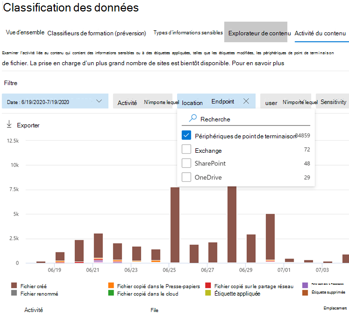

# Prise en main de la protection contre la perte de données de point de terminaison

La protection contre la perte de données de point de terminaison Microsoft (DLP de point de terminaison) fait partie de la suite de fonctionnalités de protection contre la perte de données Microsoft 365 que vous pouvez utiliser pour découvrir et protéger les éléments sensibles dans les services Microsoft 365. Si vous souhaitez en savoir plus sur toutes les offres DLP de Microsoft, consultez l’article [Présentation de la protection contre la perte de données](data-loss-prevention-policies.md). Si vous souhaitez en savoir plus sur la DLP de point de terminaison, consultez l’article [Découvrir la protection contre la perte de données de point de terminaison](endpoint-dlp-learn-about.md)

La DLP de point de terminaison Microsoft vous permet de surveiller les appareils Windows 10 et de détecter le partage et l’utilisation des éléments sensibles. Cela vous donne la visibilité et le contrôle dont vous avez besoin pour vous assurer qu’ils sont correctement utilisés et protégés, et pour éviter les comportements à risque qui pourraient les compromettre.

## Avant de commencer

### Licences SKU / abonnements

Avant de commencer avec la DLP de point de terminaison, vous devez confirmer votre [abonnement Microsoft 365](https://www.microsoft.com/microsoft-365/compare-microsoft-365-enterprise-plans?rtc=1) et tous les modules complémentaires. Pour accéder et utiliser la fonctionnalité de DLP de point de terminaison, vous devez disposer de l’un de ces abonnements ou modules complémentaires.

- Microsoft 365 E5
- Microsoft 365 A5 (EDU)
- Microsoft 365 E5 Conformité
- Microsoft 365 A5 Conformité
- Microsoft 365 E5, Protection des informations et gouvernance
- Microsoft 365 A5, Protection des informations et gouvernance

### Autorisations

Pour activer la gestion des appareils, le compte que vous utilisez doit être membre de l’un de ces rôles :

- Administrateur global
- Administrateur de la sécurité
- Administrateur de mise en conformité

Si vous voulez utiliser un compte personnalisé pour afficher les paramètres de gestion des appareils, celui-ci doit se trouver dans l’un de ces rôles :

- Administrateur global
- Administrateur de mise en conformité
- Administrateur des données de mise en conformité
- Lecteur général

Si vous voulez utiliser un compte personnalisé pour accéder à la page d’intégration/déclassement, celui-ci doit se trouver dans l’un de ces rôles :

- Administrateur global
- Administrateur de mise en conformité

Si vous voulez utiliser un compte personnalisé pour activer/désactiver la surveillance de l’appareil, celui-ci doit se trouver dans l’un de ces rôles :

- Administrateur global
- Administrateur de mise en conformité

Les données de la DLP de point de terminaison peuvent être affichées dans l’[explorateur d’activités](data-classification-activity-explorer.md). Il y a quatre rôles qui accordent l’autorisation à l’explorateur d’activités. Le compte que vous utilisez pour accéder aux données doit être membre de l’un d’entre eux.

- Administrateur général
- Administrateur de mise en conformité
- Administrateur de la sécurité
- Administrateur des données de mise en conformité

### Préparer vos points de terminaison

Assurez-vous que les appareils Windows 10 pour lesquels vous envisagez de déployer le point de terminaison DLP répondent à ces exigences.

1. Vous devez disposer de la version 1809 de Windows 10 x64 ou d’une version ultérieure.

2. Vous devez disposer de la version 4.18.2009.7 du client anti-programme malveillant ou une version plus récente. Vérifiez votre version actuelle en ouvrant l’application de sécurité Windows, en sélectionnant l’icône Paramètres, puis À propos de. Le numéro de version est indiqué sous Version du client anti-programme malveillant. Effectuez une mise à jour vers la dernière version du client antimalware en installant Windows Update KB4052623. Remarque : aucun des composants de sécurité Windows ne doit être actif. Vous pouvez exécuter la DLP de point de terminaison indépendamment de l’état de la sécurité Windows.

3. Les mises à jour Windows suivantes sont installées. Remarque : ces mises à jour ne sont pas une condition préalable à l’intégration d’un appareil à la DLP de point de terminaison, mais contiennent des correctifs pour des problèmes importants et doivent donc être installées avant d’utiliser le produit.

    - Pour la version 1809 de Windows 10 : KB4559003, KB4577069, KB4580390
    - Pour Windows 10 version 1903 ou 1909 : KB4559004, KB4577062, KB4580386
    - Pour Windows 10 version 2004 : KB4568831, KB4577063
    - Pour les appareils exécutant Office 2016 (et non aucune autre version d’Office) : KB4577063 

4. Tous les appareils doivent être [joints à Azure Active Directory (Azure AD)](https://docs.microsoft.com/azure/active-directory/devices/concept-azure-ad-join) ou à Azure AD Hybride.

5. Installez le navigateur Microsoft Chromium Edge sur l’appareil final afin d’appliquer des actions de stratégie pour l’activité de téléchargement vers le cloud. Consultez l’article [Télécharger le nouveau Microsoft Edge basé sur Chromium](https://support.microsoft.com/help/4501095/download-the-new-microsoft-edge-based-on-chromium).

6. Si vous utilisez le Canal Entreprise mensuel des versions 2004 à 2008 de Microsoft 365 Apps, il existe un problème connu avec la DLP de point de terminaison classifiant le contenu Office. Vous devez effectuer une mise à jour vers la version 2009 ou une version ultérieure. Consultez l’article [Historique des mises à jour pour Microsoft 365 Apps (répertoriées par date)](https://docs.microsoft.com/officeupdates/update-history-microsoft365-apps-by-date) pour les versions actuelles. Si vous souhaitez en savoir plus sur ce problème, consultez la section Suite Office des [Notes de publication pour les versions du Canal actuel en 2020](https://docs.microsoft.com/officeupdates/current-channel#version-2010-october-27).

## Intégrer les appareils dans la gestion des appareils

Vous devez activer la surveillance des appareils et intégrer vos points de terminaison avant de pouvoir surveiller et protéger les éléments sensibles sur un appareil. Ces deux actions sont effectuées dans le portail de conformité Microsoft 365.

Lorsque vous souhaitez intégrer des appareils qui n’ont pas encore été intégrés, vous téléchargez le script approprié et le déployez sur ces appareils. Suivez la procédure pour [Intégrer des appareils](endpoint-dlp-getting-started.md#onboarding-devices).

Si vous avez déjà des appareils intégrés dans [Microsoft Defender pour point de terminaison](https://docs.microsoft.com/windows/security/threat-protection/), ils apparaîtront déjà dans la liste des appareils gérés. Suivez la procédure [Avec les appareils intégrés à Microsoft Defender pour point de terminaison](endpoint-dlp-getting-started.md#with-devices-onboarded-into-microsoft-defender-for- endpoint).

### Intégrer les appareils

Dans ce scénario de déploiement, vous allez intégrer des appareils qui n’ont pas encore été intégrés, et vous voulez simplement contrôler et protéger les éléments sensibles contre le partage involontaire sur les appareils Windows 10.

1. Ouvrez le [Centre de conformité Microsoft](https://compliance.microsoft.com).

2. Ouvrez la page Paramètres du centre de conformité et sélectionnez **Appareils intégrés**. 

   > [!div class="mx-imgBorder"]
   > 

   > [!NOTE]
   > L’activation de l’intégration des appareils prend généralement environ 60 secondes. Toutefois, patientez jusqu’à 30 minutes avant de contacter le support Microsoft.

3. Sélectionnez **Gestion des appareils** pour ouvrir la liste des **Appareils**. La liste sera vide tant que vous n’aurez pas intégré d’appareils.

4. Sélectionnez **Intégration** pour lancer le processus d’intégration.

5. Choisissez la manière dont vous voulez déployer ces autres appareils à partir de la liste **Méthode de déploiement** , puis **Télécharger le package**.

   > [!div class="mx-imgBorder"]
   > 
   
6. Suivez les procédures appropriées décrites dans l’article [Outils et méthodes d’intégration pour les ordinateurs Windows 10](https://docs.microsoft.com/windows/security/threat-protection/microsoft-defender-atp/configure-endpoints). Ce lien vous dirige vers une page de destination dans laquelle vous pouvez accéder aux procédures Microsoft Defender pour point de terminaison qui correspondent au package de déploiement que vous avez sélectionné à l’étape 5 :

    - Intégrer des ordinateurs Windows 10 avec une stratégie de groupe
    - Intégrer les ordinateurs Windows à l’aide du gestionnaire de configuration de point de terminaison Microsoft
    - Intégrer les ordinateurs Windows 10 à l’aide des outils de gestion des appareils mobiles
    - Intégrer les ordinateurs Windows 10 utilisant un script local
    - Intégrer les ordinateurs virtuels d’infrastructure de bureau virtuel (VDI) non persistants.

Une fois l’opération effectuée et le point de terminaison intégré, celui-ci doit être visible dans la liste des appareils et doit commencer à créer des rapports d’activité d’audit dans l’Explorateur d’activités.

> [!NOTE]
> Cette expérience est soumise à l’application de la licence. Sans la licence requise, les données ne seront ni visibles ni accessibles.

### Avec des appareils intégrés dans Microsoft Defender pour point de terminaison

Dans ce scénario, Microsoft Defender pour point de terminaison est déjà déployé et des points de terminaison effectuent des rapports. Tous ces points de terminaison apparaîtront dans la liste des appareils gérés. Vous pouvez continuer à intégrer de nouveaux appareils dans la DLP pour point de terminaison pour étendre la couverture à l’aide de la [Procédure d’intégration des appareils](endpoint-dlp-getting-started.md#onboarding-devices).

1. Ouvrez le [Centre de conformité Microsoft](https://compliance.microsoft.com).

2. Ouvrez la page Paramètres du Centre de conformité et sélectionnez **Activer la surveillance des appareils**.

3. Sélectionnez **Gestion des appareils** pour ouvrir la liste des **Appareils**. Vous devriez voir la liste des appareils qui effectuent déjà des rapports à Microsoft Defender pour point de terminaison.

   > [!div class="mx-imgBorder"]
   > 
   
4. Sélectionnez **Intégration** si vous avez besoin d’intégrer d’autres appareils.

5. Choisissez la manière dont vous souhaitez déployer ces autres appareils dans la liste **Méthode de déploiement** , puis **Télécharger le package**.

6. Suivez les procédures appropriées décrites dans l’article [Outils et méthodes d’intégration pour les ordinateurs Windows 10](https://docs.microsoft.com/windows/security/threat-protection/microsoft-defender-atp/configure-endpoints). Ce lien vous dirige vers une page de destination dans laquelle vous pouvez accéder aux procédures Microsoft Defender pour point de terminaison qui correspondent au package de déploiement que vous avez sélectionné à l’étape 5 :

    - Intégrer des ordinateurs Windows 10 avec une stratégie de groupe
    - Intégrer les ordinateurs Windows à l’aide du gestionnaire de configuration de point de terminaison Microsoft
    - Intégrer les ordinateurs Windows 10 à l’aide des outils de gestion des appareils mobiles
    - Intégrer les ordinateurs Windows 10 utilisant un script local
    - Intégrer les ordinateurs virtuels d’infrastructure de bureau virtuel (VDI) non persistants.

Une fois l’opération effectuée et le point de terminaison intégré, celui-ci doit être visible dans le tableau des **Appareils** et doit commencer à créer des rapports d’activité d’audit dans l’ **Explorateur d’activités**.

> [!NOTE]
>Cette expérience est soumise à l’application de la licence. Sans la licence requise, les données ne seront ni visibles ni accessibles.

### Afficher les alertes de la DLP de point de terminaison dans le tableau de bord de Gestion des alertes DLP

1. Ouvrez la page de protection contre la perte de données dans le Centre de conformité Microsoft 365, puis sélectionnez Alertes.

2. Reportez-vous aux procédures décrites dans [Comment configurer et afficher les alertes pour les stratégies DLP](dlp-configure-view-alerts-policies.md) pour afficher les alertes relatives à vos stratégies DLP de point de terminaison.

### Affichage de données DLP de point de terminaison dans l’Explorateur d’activités

1. Ouvrez la [Page classification des données](https://compliance.microsoft.com/dataclassification?viewid=overview) pour votre domaine dans le centre de conformité Microsoft 365, puis sélectionnez Explorateur d’activités.

2. Reportez-vous aux procédures décrites dans [Prise en main de l’Explorateur d’activités](data-classification-activity-explorer.md) pour accéder aux données de vos appareils de point de terminaison et les filtrer.

   > [!div class="mx-imgBorder"]
   > 

## Étapes suivantes
Maintenant que vous disposez d’appareils intégrés et que vous pouvez afficher les données d’activité dans l’Explorateur d’activités, vous êtes prêt à passer à l’étape suivante dans laquelle vous créez des stratégies DLP qui protègent vos éléments sensibles.

- [Utilisation des points de terminaison de protection contre la perte de données (aperçu)](endpoint-dlp-using.md)

## Voir aussi

- [En savoir plus sur les points de terminaison de protection contre la perte de données (Preview)](endpoint-dlp-learn-about.md)
- [Utilisation des points de terminaison de protection contre la perte de données (aperçu)](endpoint-dlp-using.md)
- [Vue d’ensemble de la protection contre la perte de données](data-loss-prevention-policies.md)
- [Création, test et réglage d’une stratégie DLP](create-test-tune-dlp-policy.md)
- [Prise en main de l’explorateur d’activités](data-classification-activity-explorer.md)
- [Microsoft Defender pour point de terminaison](https://docs.microsoft.com/windows/security/threat-protection/)
- [Outils et méthodes d’intégration pour les appareils Windows 10](https://docs.microsoft.com/windows/security/threat-protection/microsoft-defender-atp/configure-endpoints).
- [Abonnement Microsoft 365](https://www.microsoft.com/microsoft-365/compare-microsoft-365-enterprise-plans?rtc=1)
- [Azure AD appareils joints](https://docs.microsoft.com/azure/active-directory/devices/concept-azure-ad-join)
- [Télécharger le nouveau Microsoft Edge sur la base de chrome](https://support.microsoft.com/help/4501095/download-the-new-microsoft-edge-based-on-chromium)
