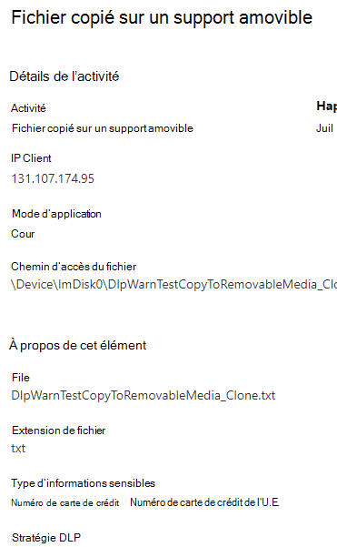

# Découvrir la protection contre la perte de données des point de terminaison de Microsoft 365

Vous pouvez utiliser la protection contre la perte de données (DLP) de Microsoft 365 pour surveiller les actions entreprises sur les éléments que vous jugez sensibles et pour éviter le partage involontaire de ces éléments. Si vous souhaitez en savoir plus sur la DLP, consultez l’article [Présentation de la protection contre la perte de données](data-loss-prevention-policies.md).

La **protection contre la perte de données des point de terminaison** (DLP des points de terminaison) étend les capacités de surveillance et de protection de l’activité de la DLP aux éléments sensibles qui se trouvent sur les appareils Windows 10. Une fois les appareils intégrés dans les solutions de conformité Microsoft 365, les informations relatives à l’utilisation des éléments sensibles par les utilisateurs sont rendues visibles dans l’ [explorateur d’activités](data-classification-activity-explorer.md). Vous pouvez appliquer des actions de protection sur ces éléments via des [stratégies DLP](create-test-tune-dlp-policy.md).

## Activités des points de terminaison que vous pouvez surveiller et sur lesquels vous pouvez agir

La protection contre la perte de données des point de terminaison Microsoft vous permet d’auditer et de gérer les types d’activités suivants, que les utilisateurs utilisent sur des éléments sensibles sur des appareils fonctionnant sous Windows 10. Cela comprend :

|activité sur l’élément |auditable/restreint  |
|---------|---------|
|créé    | auditable      |
|renommé    |  auditable       |
|copié sur un support amovible ou créé sur celui-ci     |     auditable/restreint|
|copié sur le partage réseau, par exemple, \\My-server\fileshare   |     auditable/restreint    |
|imprimé |    auditable/restreint       |
|copier vers le Cloud via Chromium Edge    |   auditable/restreint        |
|consulté par une application ou navigateur non autorisé    |  auditable/restreint       |

## Différences avec Endpoint DLP

Vous devez tenir compte d’un certain nombre de concepts supplémentaires avant d’approfondir le point de terminaison DLP.

### Activer la gestion des appareils

La Gestion des appareils est la fonctionnalité qui permet la collecte des données de télémétrie à partir des appareils et qui les intègre dans les solutions de conformité Microsoft 365 telles que la protection contre la perte de données des point de terminaison et la [Gestion des risques internes](insider-risk-management.md). Vous devrez intégrer tous les appareils que vous souhaitez utiliser comme emplacements dans les stratégies DLP.

> [!div class="mx-imgBorder"]
> 

L’intégration et la désactivation sont gérées via des scripts que vous téléchargez à partir du centre de gestion des appareils. Le centre dispose de scripts personnalisés pour chacune de ces méthodes de déploiement :

- script local (jusqu’à 10 ordinateurs)
- Stratégie de groupe
- System Center Configuration Manager, Version 1610 ou ultérieure
- Gestion des périphériques mobiles/Microsoft Intune
- Scripts d’intégration VDI pour les machines non persistantes

> [!div class="mx-imgBorder"]
> 

 Utilisez les procédures décrites dans [Prise en main des points de terminaison Microsoft 365 DLP](endpoint-dlp-getting-started.md) vers les appareils intégrés.

Si vous avez des appareils intégrés via [Microsoft Defender pour point de terminaison](https://docs.microsoft.com/windows/security/threat-protection/), ces derniers apparaissent automatiquement dans la liste des appareils.

> [!div class="mx-imgBorder"]
> 

### Afficher les données de DLP des points de terminaison

 La DLP des points de terminaison surveille l’activité en fonction du type MIME. Les activités seront donc capturées même si l’extension de fichier est modifiée. Dans la préversion publique, elle observe tous les :

- fichiers Word
- Fichiers PowerPoint
- Fichiers Excel
- Fichiers .pdf
- Fichiers .csv
- Fichiers .tsv
- fichiers .txt
- Fichiers RTF
- fichiers c
- fichiers de classe
- fichiers CPP
- fichiers cs
- fichiers h
- fichiers .java

> [!NOTE]
> La DLP des points de terminaison évalue les fichiers des types indiqués ci-dessus par rapport à la stratégie DLP et applique les actions de protection en conséquence. Tous les fichiers qui correspondent à une stratégie DLP sont audités pour toutes les actions prises en charge, même s’ils ne sont pas bloqués. De plus, l’activité des fichiers effectuée sur les fichiers Word, PowerPoint, Excel, PDF et .csv est auditée par défaut, indépendamment du fait qu’une stratégie DLP existe ou corresponde à ces fichiers.

Une fois qu’un appareil est intégré, les informations relatives aux activités auditées sont transmises dans l’Explorateur d’activités, avant même de configurer et déployer des stratégies DLP qui ont des périphériques comme emplacement.

> [!div class="mx-imgBorder"]
> 

Point de terminaison DLP recueille de nombreuses informations sur l’activité auditée.

Par exemple, si un fichier est copié sur un support USB amovible, les attributs suivants apparaissent dans les détails de l’activité :

- type d’activité
- IP Client
- Chemin d’accès du fichier
- horodatage arrivé
- nom du fichier
- utilisateur
- extension du fichier
- taille du fichier
- type d’informations sensibles (le cas échéant)
- valeur SHA1
- valeur SHA256
- nom de fichier précédent
- emplacement
- parent
- chemin d’accès
- type d’emplacement source
- platform
- nom du périphérique
- type d’emplacement de destination
- application ayant effectué la copie
- ID de l’appareil Microsoft Defender pour point de terminaison (le cas échéant)
- fabricant de l’appareil multimédia amovible
- modèle d’appareil multimédia amovible
- numéro de série de l’appareil multimédia amovible

> [!div class="mx-imgBorder"]
> 

## Prochaines étapes

Maintenant que vous en savez plus sur les points de terminaison DLP, vos prochaines étapes sont les suivantes :

1) [Prise en main des points de terminaison de protection contre la perte de données Microsoft (Preview)](endpoint-dlp-getting-started.md)
2) [Utilisation des points de terminaison de protection contre la perte de données Microsoft (Preview)](endpoint-dlp-using.md)

## Voir aussi

- [Prise en main des points de terminaison de protection contre la perte de données Microsoft (Preview)](endpoint-dlp-getting-started.md)
- [Utilisation des points de terminaison de protection contre la perte de données Microsoft (Preview)](endpoint-dlp-using.md)
- [Vue d’ensemble de la protection contre la perte de données](data-loss-prevention-policies.md)
- [Création, test et réglage d’une stratégie DLP](create-test-tune-dlp-policy.md)
- [Prise en main de l’explorateur d’activités](data-classification-activity-explorer.md)
- [Microsoft Defender pour point de terminaison](https://docs.microsoft.com/windows/security/threat-protection/)
- [Gestion des risques internes](insider-risk-management.md)
