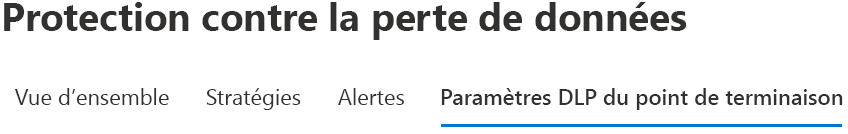
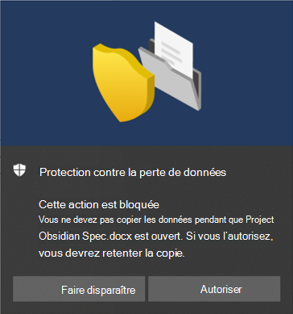

# Utilisation de la protection contre la perte de données de point de terminaison

Cet article décrit trois scénarios dans lesquels vous créez et modifiez une stratégie DLP qui utilise des appareils comme emplacement.

## Paramètres DLP

Avant de commencer, vous devez configurer vos paramètres DLP appliqués à toutes les stratégies DLP pour les appareils. Vous devez les configurer si vous envisagez de créer des stratégies qui appliquent :

- restrictions de sortie dans le Cloud
- restrictions relatives aux applications non autorisées

Ou

- Si vous souhaitez exclure l’analyse des chemins d’accès aux fichiers bruyants

  > [!div class="mx-imgBorder"]
  > 

### Exclusions de chemin d’accès de fichier

Vous pouvez exclure certains chemins de la surveillance DLP, des alertes DLP et de l’application de stratégie DLP sur vos appareils, car ils sont trop bruyants ou ne contiennent pas les fichiers qui vous intéressent. Les fichiers stockés dans ces emplacements ne seront pas audités et tous les fichiers créés ou modifiés dans ces emplacements ne seront pas soumis à l’application de stratégie DLP. Vous pouvez configurer les exclusions de chemin d’accès dans les paramètres DLP.

Vous pouvez utiliser cette logique pour construire vos chemins d’exclusion :

- Chemin d’accès de fichier valide se terminant par « \ », ce qui signifie uniquement les fichiers directement sous dossier.  Par exemple: C:\Temp\

- Chemin d’accès de fichier valide se terminant par « \* », ce qui signifie uniquement les sous-dossiers directement sous dossier.  Par exemple: C:\Temp\*

- Chemin d’accès de fichier valide se terminant par « \ » ou «\*», ce qui signifie uniquement les fichiers directement sous dossier et tous les sous-dossiers.  Par exemple: C:\Temp

- Un chemin d’accès avec un caractère générique entre' \ 'de chaque côté.  Par exemple : C:\Users\*\Desktop\

- Un chemin d’accès comportant le caractère générique entre « \» de chaque côté et «(nombre)» pour indiquer le nombre exact de sous-dossiers.  Par exemple : C:\Users\*(1) \Downloads\

- Un chemin d’accès avec des variables d’environnement système.  Par exemple :%SystemDrive%\Test\*

- Un mélange de tous les éléments ci-dessus.  Par exemple :%SystemDrive%\Users\*\Documents\*(2) \Sub\

### Applications non autorisées

Lorsque le paramètre **Accès par des applications et des navigateurs non autorisés** d’une stratégie est activé, et que les utilisateurs tentent d’utiliser ces applications pour accéder à un fichier protégé, l’activité est autorisée, bloquée, ou bloquée mais les utilisateurs peuvent annuler la restriction. Toutes les activités sont auditées et disponibles pour révision dans l’Explorateur d’activités.

> [!IMPORTANT]
> N’incluez pas le chemin d’accès du fichier exécutable, mais uniquement le nom du fichier exécutable (par exemple, browser.exe).

### Restrictions de navigateur et de domaine :
Empêchez les fichiers sensibles, qui correspondent à vos stratégies, d’être partagés avec des domaines de service cloud sans restriction.

#### Domaines de service

Vous pouvez déterminer si les fichiers sensibles protégés par vos stratégies peuvent être téléchargés vers des domaines de service spécifiques à partir de Microsoft Edge.

Si le mode de liste est paramétré sur **Bloquer**, l’utilisateur ne peut pas télécharger des éléments sensibles dans ces domaines. Lorsqu’une action de téléchargement est bloquée parce qu’un élément correspond à une stratégie DLP, DLP génère un avertissement ou bloque le téléchargement de l’élément sensible.

Si le mode liste est défini sur **Autoriser**, les utilisateurs pourront charger des éléments sensibles **_uniquement_** vers ces domaines, et l’accès au chargement vers tous les autres domaines n’est pas autorisé.

> [!IMPORTANT]
> Lorsque le mode de restriction de service est configuré sur « Autoriser », vous devez configurer au moins un domaine de service avant l’application des restrictions.

#### Navigateurs non autorisés

Vous ajoutez des navigateurs, identifiés par leurs noms de exécutables, qui ne peuvent pas accéder à des fichiers qui remplissent les conditions d’une stratégie DLP appliquée dans laquelle la restriction de chargement vers les services Cloud est définie sur bloquer ou annuler le blocage. Lorsque ces navigateurs ne peuvent pas accéder à un fichier, les utilisateurs finaux voient s’afficher une notification leur demandant d’ouvrir le fichier via le Chromium Edge.

### Justification métier dans les conseils de stratégie

Vous pouvez contrôler l’interaction des utilisateurs avec l’option de justification métier dans les notifications de conseil de stratégie DLP. Cette option s’affiche lorsque les utilisateurs effectuent une activité protégée par le paramètre **Bloquer avec remplacement** dans une stratégie DLP. Vous pouvez choisir l’une des options suivantes :

- Par défaut, les utilisateurs peuvent sélectionner une justification intégrée ou entrer leur propre texte.
- Les utilisateurs ne peuvent sélectionner qu’une justification intégrée.
- Les utilisateurs ne peuvent entrer que leur propre justification.

## Lier les paramètres DLP ensemble

Avec les points de terminaison DLP et le navigateur Chromium Edge, vous pouvez limiter le partage involontaire des éléments sensibles aux applications et services Cloud non autorisés. Le Chromium Edge comprend les conditions dans lesquelles un élément est limité par une stratégie DLP de point de terminaison et applique les restrictions d’accès.

Lorsque vous utilisez la fonctionnalité point de terminaison DLP comme emplacement dans une stratégie DLP correctement configurée et le navigateur Chromium Edge, les navigateurs non autorisés que vous avez définis dans ces paramètres ne pourront pas accéder aux éléments sensibles qui correspondent à vos contrôles de stratégie DLP. Au lieu de cela, les utilisateurs seront redirigés vers le Chromium Edge et le Chromium Edge, avec sa compréhension des restrictions imposées par DLP, peut bloquer ou restreindre les activités lorsque les conditions de la stratégie DLP sont réunies.

Pour utiliser cette restriction, vous devez configurer trois éléments importants :

1. Spécifier les emplacements ,services, domaines, adresses IP, avec lesquels vous ne souhaitez pas partager les éléments sensibles.

2. Ajoutez les navigateurs qui ne sont pas autorisés à accéder à certains éléments sensibles lorsqu’une correspondance de la stratégie DLP se produit.

3. Configurez les stratégies DLP pour définir les types d’éléments sensibles pour lesquels le téléchargement doit être limité à ces emplacements en activant **Télécharger vers les services Cloud** et **Accès à partir d’un navigateur non autorisé**.

Vous pouvez continuer à ajouter de nouveaux services, applications et stratégies pour développer et augmenter vos restrictions afin de répondre aux besoins de votre entreprise et de protéger les données sensibles. 

Cette configuration vous permet de garantir la sécurité de vos données tout en évitant les restrictions inutiles qui empêchent les utilisateurs d’accéder aux éléments non sensibles et de les empêcher de les partager.

## Scénarios de stratégie DLP pour les points de terminaison

Pour vous familiariser avec les fonctionnalités de point de terminaison DLP et la manière dont elles se trouvent dans les stratégies DLP, nous avons rassemblé certains scénarios que vous pouvez suivre.

> [!IMPORTANT]
> Ces scénarios de points de terminaison DLP ne sont pas les procédures officielles pour la création et le réglage des stratégies DLP. Reportez-vous aux rubriques ci-dessous lorsque vous devez utiliser les stratégies DLP dans les situations générales suivantes :

>- [En savoir plus sur la prévention des pertes de données](dlp-learn-about-dlp.md)
>- [Prise en main de la stratégie DLP par défaut](get-started-with-the-default-dlp-policy.md)
>- [Création d’une stratégie DLP à partir d’un modèle](create-a-dlp-policy-from-a-template.md)
>- [Création, test et réglage d’une stratégie DLP](create-test-tune-dlp-policy.md)

### Scénario 1 : créer une stratégie à partir d’un modèle, audit uniquement

Ces scénarios nécessitent que les appareils soient déjà intégrés et reportés dans l’Explorateur d’activités. Si vous n’avez pas encore intégré d’appareils, consultez l’article [Prise en main de la protection contre la perte de données de point de terminaison](endpoint-dlp-getting-started.md).

1. Ouvrez la [page de protection contre la perte de données](https://compliance.microsoft.com/datalossprevention?viewid=policies).

2. Sélectionnez **Créer une stratégie**.

3. Dans le cadre de ce scénario, sélectionnez **Confidentialité**, **Données d’informations d’identification personnelles (PII) pour les États-Unis** puis sélectionnez **Suivant**.

4. Désactivez la case à cocher **État** pour tous les emplacements, sauf pour les **Appareils**. Cliquez sur **Suivant**.

5. Acceptez la sélection par défaut **Vérifier et personnaliser les paramètres du modèle**, puis sélectionnez **Suivant**.

6. Acceptez les valeurs par défaut **Actions de protection** et choisissez **Suivant**.

7. Sélectionnez **Audit ou restreindre les activités sur les appareils Windows** et laissez **Audit uniquement**. Cliquez sur **Suivant**.

8. Accepter la valeur par défaut **Je veux tester le contenu tout d’abord** et choisir **Afficher les conseils de stratégie en mode test**. Cliquez sur **Suivant**.

9. Passez en revue vos paramètres, puis sélectionnez **Envoyer**.

10. La nouvelle stratégie DLP s’affiche dans la liste de stratégies.

11. Consultez l’Explorateur d’activités pour les données des points de terminaison monitorés. Configurez le filtre d’emplacement pour les appareils et ajoutez la stratégie, puis filtrez par nom de stratégie pour afficher l’impact de cette stratégie. Pour plus d’informations, voir [Prise en main de l’Explorateur d’activités](data-classification-activity-explorer.md) si nécessaire.

12. Essayez de partager un test qui contient du contenu qui déclenchera la condition de données d’informations d’identification personnelle (PII) américaine avec une personne extérieure à votre organisation. Cette opération doit déclencher la stratégie.

13. Consultez l’Explorateur d’activités pour l’événement.

### Scénario 2 : modifier la stratégie existante, créer une alerte

1. Ouvrir[Page de protection contre la perte de données](https://compliance.microsoft.com/datalossprevention?viewid=policies).

2. Sélectionnez la stratégie **Données d’informations d’identification personnelle (PII) pour les États-Unis** que vous avez créées dans le scénario 1.

3. Sélectionnez **Modifier la stratégie**.

4. Accédez à la page **Règles DLP avancées** et modifiez la **Faible quantité de contenu détectée pour les informations d’identification personnelle**.

5. Faites défiler vers le bas jusqu’à la section **Rapports d’incident** et configurez **Envoyer une alerte aux administrateurs lorsqu’une correspondance de règle se produit** sur **Activé**. Les alertes par courrier électronique sont envoyées automatiquement à l’administrateur et à toute autre personne que vous ajoutez à la liste des destinataires. 

   > [!div class="mx-imgBorder"]
   > 
   
6. Dans le cadre de ce scénario, sélectionnez **Envoyer une alerte chaque fois qu’une activité correspond à la règle**.

7. Cliquez sur **Enregistrer**.

8. Conservez tous vos paramètres précédents en choisissant **suivant** puis **Envoyer** les modifications apportées à la stratégie.

9. Essayez de partager un test qui contient du contenu qui déclenchera la condition de données d’informations d’identification personnelle (PII) américaine avec une personne extérieure à votre organisation. Cette opération doit déclencher la stratégie.

10. Consultez l’Explorateur d’activités pour l’événement.

### Scénario 3 : modifier la stratégie existante, bloquer l’action avec l’option autoriser le remplacement

1. Ouvrir[Page de protection contre la perte de données](https://compliance.microsoft.com/datalossprevention?viewid=policies).

2. Sélectionnez la stratégie **Données d’informations d’identification personnelle (PII) pour les États-Unis** que vous avez créées dans le scénario 1.

3. Sélectionnez **Modifier la stratégie**.

4. Accédez à la page **Règles DLP avancées** et modifiez la **Faible quantité de contenu détectée pour les informations d’identification personnelle**.

5. Faites défiler vers le bas jusqu’à la section **Audit ou restreindre les activités sur les appareils Windows** et pour chaque activité définissez l’action correspondante sur **Bloquer avec remplacement**.

   > [!div class="mx-imgBorder"]
   > 
   
6. Cliquez sur **Enregistrer**.

7. Répétez les étapes 4-7 pour **Quantité de contenu élevé détectée le fichier INF (INF) US**.

8. Conservez tous vos paramètres précédents en choisissant **suivant** puis **Envoyer** les modifications apportées à la stratégie.

9. Essayez de partager un test qui contient du contenu qui déclenchera la condition de données d’informations d’identification personnelle (PII) américaine avec une personne extérieure à votre organisation. Cette opération doit déclencher la stratégie.

   Une fenêtre contextuelle semblable à celle-ci s’affiche sur l’appareil client :

   > [!div class="mx-imgBorder"]
   > 

10. Consultez l’Explorateur d’activités pour l’événement.

## Voir aussi

- [Découvrir la protection contre la perte de données de point de terminaison](endpoint-dlp-learn-about.md)
- [Prise en main la protection contre la perte de données de point de terminaison](endpoint-dlp-getting-started.md)
- [En savoir plus sur la prévention des pertes de données](dlp-learn-about-dlp.md)
- [Création, test et réglage d’une stratégie DLP](create-test-tune-dlp-policy.md)
- [Prise en main de l’explorateur d’activités](data-classification-activity-explorer.md)
- [Microsoft Defender pour point de terminaison](/windows/security/threat-protection/)
- [Outils et méthodes d’intégration pour les appareils Windows 10](/windows/security/threat-protection/microsoft-defender-atp/configure-endpoints).
- [Abonnement Microsoft 365](https://www.microsoft.com/microsoft-365/compare-microsoft-365-enterprise-plans?rtc=1)
- [Azure Active Directory (ADD) adhésion](/azure/active-directory/devices/concept-azure-ad-join)
- [Télécharger le nouveau Microsoft Edge sur la base de chrome](https://support.microsoft.com/help/4501095/download-the-new-microsoft-edge-based-on-chromium)
- [Prise en main de la stratégie DLP par défaut](get-started-with-the-default-dlp-policy.md)
- [Création d’une stratégie DLP à partir d’un modèle](create-a-dlp-policy-from-a-template.md)