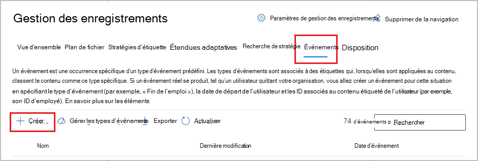
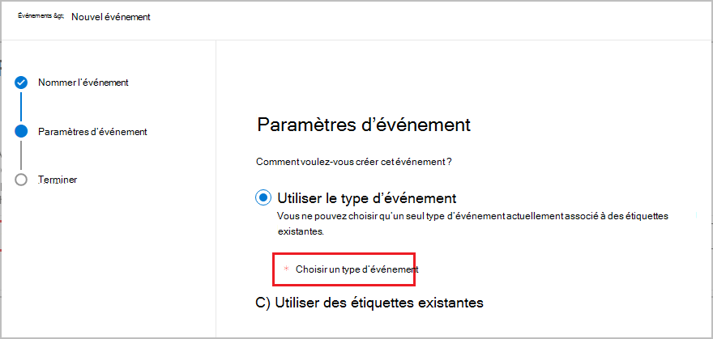
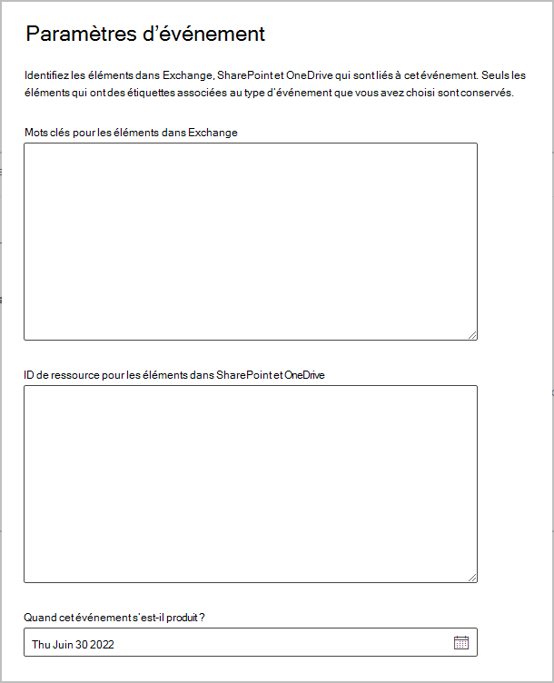
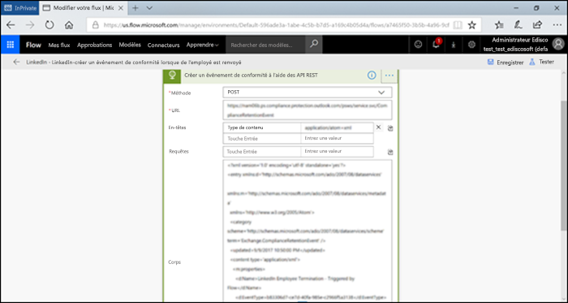

# <a name="start-retention-when-an-event-occurs"></a>Débuter la rétention lorsqu’un événement se produit

>*[Guide de sécurité et conformité pour les licences Microsoft 365](/office365/servicedescriptions/microsoft-365-service-descriptions/microsoft-365-tenantlevel-services-licensing-guidance/microsoft-365-security-compliance-licensing-guidance).*

Lorsque vous conservez du contenu, la période de rétention est souvent basée sur l’ancienneté du contenu. Par exemple, vous pouvez conserver des documents pendant sept ans à compter de leur création, puis les supprimer. Cependant, lorsque vous configurez [étiquettes de rétention](retention.md#retention-labels), vous pouvez baser une période de rétention sur l’occurrence d’un type spécifique d’événement. L’événement déclenche le début de la période de rétention, et les actions de rétention d’une étiquette sont appliquées sur tout le contenu portant l’étiquette en question pour ce type d’événement.
  
Exemples d'utilisation de la rétention basée sur les événements :
  
- **Employés quittant l'organisation** Supposons que les enregistrements d’un employé doivent être conservés 10 ans à compter de son départ de l’organisation. Une fois les 10 ans écoulés, tous les documents concernant l’embauche, les résultats et le départ de cet employé doivent être supprimés. L’événement qui déclenche la période de rétention de 10 ans est le départ de l’employé de l’organisation. 
    
- **Expiration du contrat** Supposons que tous les enregistrements liés aux contrats doivent être conservés pendant cinq ans après l’expiration du contrat. L’événement qui déclenche la période de rétention de cinq ans est l’expiration du contrat. 
    
- **Durée de vie des produits** Votre organisation a peut-être des exigences de rétention liées à la dernière date de fabrication de produits pour le contenu tel que des spécifications techniques. Dans ce cas, la dernière date de fabrication est l’événement qui déclenche la période de rétention. 
    
La rétention basée sur les événements est généralement utilisée dans le cadre d'un processus de gestion des documents. Cela signifie que :
  
- Les étiquettes de rétention basées sur les événements marquent aussi généralement les articles comme un enregistrement, dans le cadre d'une solution de gestion des documents. Pour plus d’informations, consultez [En savoir plus sur la gestion des enregistrements](records-management.md).

- Un document qui a été déclaré comme un enregistrement mais dont l'événement déclencheur n'a pas encore eu lieu est conservé indéfiniment (les enregistrements ne peuvent pas être supprimés définitivement), jusqu'à ce qu'un événement déclenche la période de rétention de ce document.
    
- Les étiquettes de rétention basées sur des événements déclenchent généralement une révision avant destruction à la fin de la période de rétention, ce qui permet à un gestionnaire d’enregistrements de manuellement passer en revue puis supprimer le contenu. Si vous souhaitez en savoir plus, consultez la page [Destruction de contenu](disposition.md).
    

Les étiquettes de rétention basées sur un événement possèdent les mêmes fonctionnalités que les étiquettes de rétention dans Microsoft 365. Pour plus d’informations, voir [En savoir plus sur les stratégies et les étiquettes de rétention](retention.md).

## <a name="understanding-the-relationship-between-event-types-labels-events-and-asset-ids"></a>Compréhension de la relation entre les types d’événements, les étiquettes, les événements et les ID d’élément

Pour utiliser avec succès la rétention basée sur les événements, il est important de comprendre la relation entre les types d'événements, les étiquettes de rétention, les événements et les identifications d'actifs comme l'illustrent les diagrammes et l'explication qui suit : 
  

  

  
1. Vous créez des étiquettes de rétention pour différents types de contenu et vous les associez à un type d’événement. Par exemple, les étiquettes pour différents types de fichiers et d’enregistrements de produit sont associées à un type d’événement nommé Durée de vie des produits, car ces enregistrements doivent être conservés pendant 10 ans à compter de la fin de vie du produit.
    
2. Les utilisateurs (généralement les gestionnaires de documents) appliquent ces étiquettes de rétention au contenu et (pour les documents dans SharePoint et OneDrive) saisissent un identifiant d'actif pour chaque élément. Dans cet exemple, l’ID d’actif est un nom de produit ou un code utilisé par l’organisation. Ensuite, une étiquette de rétention est attribuée aux enregistrements de chaque produit, et chaque enregistrement possède une propriété qui contient un numéro d'identification de l'actif. Le diagramme représente **l'ensemble du contenu** de tous les enregistrements de produits dans une organisation, et chaque article porte l'ID de l'actif du produit dont il est l'enregistrement. 
    
3. La fin de vie d’un produit est un « événement ». La durée de vie de ce produit est un « type d’événement ». Lorsqu’un événement (« fin de vie ») se produit pour un type d’événement (« durée de vie du produit »), vous devez créer un événement qui spécifie :
    
   - Un ID d’élément (pour les documents SharePoint et OneDrive).
    
   - Mots-clés (pour les articles d'échange). Dans cet exemple, l'organisation utilise un code produit dans les messages contenant des fiches produits, de sorte que le mot clé pour les articles Exchange est fonctionnellement le même que l'ID d'actif pour les documents SharePoint et OneDrive.
    
   - La date à laquelle l’événement s'est produit. Cette date est utilisée comme point de départ de la période de rétention. Cette date peut être la date actuelle, passée ou une date future.

4. Lorsque vous avez créé un événement, sa date est synchronisée avec tout le contenu portant l’étiquette de rétention du type d’événement correspondant et contenant l’ID d’élément ou le mot clé spécifié. Comme pour toute étiquette de rétention, cette synchronisation peut prendre jusqu’à 7 jours. Dans le diagramme précédent, la période de rétention de tous les éléments encerclés en rouge est déclenchée par cet événement. En d’autres termes, lorsque ce produit atteint sa fin de vie, cet événement déclenche la période de rétention pour les enregistrements de ce produit.

Il est important de comprendre que si vous ne spécifiez pas d'identifiant ou de mots clés pour un événement, **tout contenu** avec une étiquette de rétention de ce type d'événement aura sa période de rétention déclenchée par l'événement. Cela signifie que, dans le diagramme précédent, tout le contenu commencera à être conservé. Ce n’est peut-être pas ce que vous voulez faire.

Enfin, rappelez-vous que chaque étiquette de rétention possède ses propres paramètres de rétention. Dans cet exemple, ils indiquent tous 10 ans, mais un événement peut très bien déclencher des étiquettes de rétention dont chacune possède sa propre période de rétention.
  
## <a name="how-to-set-up-event-driven-retention"></a>Configuration des rétentions basées sur des événements

Flux de travail général pour la rétention basée sur un événement :
  

  
> [!TIP]
> Consultez [Gérer le cycle de vie des documents sauvegardés sur SharePoint avec des étiquettes de rétention](auto-apply-retention-labels-scenario.md) pour un scénario détaillé sur l’utilisation de propriétés gérées dans SharePoint afin d'appliquer automatiquement des étiquettes de rétention et exécuter la rétention basée sur un événement.

### <a name="step-1-create-a-label-whose-retention-period-is-based-on-an-event"></a>Étape 1 : créer une étiquette dont la période de rétention est basée sur des événements

Pour créer et configurer votre étiquette de rétention, utilisez les instructions pour [Créer des étiquettes de rétention](./create-apply-retention-labels.md#step-1-create-retention-labels). Mais pour ce qui est de la rétention basée sur un événement, sur la **page Définir les paramètres de  rétention** de l'assistant Créer une étiquette de rétention, après **Démarrer la période de rétention basée sur**, sélectionnez un des types d'événements par défaut dans la liste déroulante, ou créez le vôtre en sélectionnant **Créer un nouveau type d'événement**:


Un type d’événement est simplement une description générale d’un événement auquel vous voulez associer une étiquette de rétention.

Les types d’événements par défaut ont **(type d’événement)** après leur nom dans la liste déroulante afin de faciliter l’identification, et vous pouvez également afficher et créer un type d’événement à partir de la **gestion des enregistrements** > **Événements** > **gérer les types d’événements**.

La rétention basée sur un événement nécessite des paramètres de rétention qui :
  
- Conservent le contenu.
    
- suppriment automatiquement le contenu ou déclenchent une révision de destruction à la fin de la période de rétention.
  
La rétention basée sur un événement est généralement utilisée pour les contenus classés sous la forme d’un enregistrement, c’est le moment idéal pour vérifier si vous avez également besoin de sélectionner l’option qui marque du contenu comme [enregistrement](records-management.md#records).

Si vous utilisez un type d’événement existant plutôt que de créer un nouveau type d’événement, passez à l’étape 3.

> [!NOTE]
> Une fois que vous avez sélectionné un type d’événement et enregistré l’étiquette de rétention, le type d’événement ne peut pas être modifié.

### <a name="step-2-create-a-new-event-type-for-your-label"></a>Étape 2 : Créer un nouveau type d’événement pour votre étiquette

Pour les paramètres de rétention, si vous avez sélectionné **Créer un nouveau type d’événement**, entrez un nom et une description pour votre type d’événement. Sélectionnez ensuite **Suivant**, **Envoyer**, puis **Terminé**.

Une fois de retour dans la page **Définir les paramètres de rétention**, pour **Démarrer la période de rétention sur la base de**, utilisez la liste déroulante pour sélectionner le type d’événement que vous avez créé.

  
### <a name="step-3-publish-or-auto-apply-the-event-based-retention-labels"></a>Étape 3 : publier ou appliquer automatiquement les étiquettes de rétention basées sur les événements

Comme pour n’importe quelle étiquette de rétention, vous devez publier ou appliquer automatiquement une étiquette basée sur un événement, de sorte qu’elle soit appliquée au contenu de façon manuelle ou automatique :
- [Créer des étiquettes de rétention et les appliquer dans les applications](create-apply-retention-labels.md)
- [Appliquer automatiquement une étiquette de rétention au contenu](apply-retention-labels-automatically.md)

### <a name="step-4-enter-an-asset-id"></a>Étape 4 : saisissez un ID d’élément

Une fois qu’une étiquette basée sur un événement a été appliquée au contenu, vous pouvez entrer un ID d’élément pour chaque élément. Par exemple, votre organisation peut utiliser :
  
- Des codes de produit que vous pouvez utiliser pour conserver le contenu relatif à un produit spécifique.
    
- Des codes de projet que vous pouvez utiliser pour conserver le contenu relatif à un projet spécifique.
    
- ID d’employé à utiliser pour conserver uniquement le contenu d’une personne spécifique.
    
L’ID d’élément constitue simplement une autre propriété de document qui est disponible dans SharePoint et OneDrive. Votre organisation utilise peut-être déjà d’autres ID et propriétés de document pour classer le contenu. Le cas échéant, vous pouvez également utiliser ces propriétés et valeurs lorsque vous créez un événement (voir l’étape 6, plus bas). L’essentiel est que vous utilisez une combinaison *propriété:valeur* dans les propriétés du document pour associer cet élément à un type d’événement.
  

  
### <a name="step-5-create-an-event"></a>Étape 5 : créer un événement

Lorsqu’une instance précise de ce type d’événement se produit (par exemple, un produit arrive en fin de vie), accédez à la page **Gestions des enregistrements** > **Événements** dans le Centre de conformité Microsoft 365, et sélectionnez **+ Créer** pour créer un événement. Vous devez déclencher un événement en le créant en cliquant ici..



Jusqu’à un million d’événements sont pris en charge par client.

### <a name="step-6-choose-the-same-event-type-used-by-the-label-in-step-2"></a>Étape 6 : Choisir le même type d’événement utilisé par l’étiquette à l’étape 2

Lorsque vous créez l’événement, choisissez le même type d'événement que celui spécifié dans les paramètres de l’étiquette de rétention à l’étape 2. Par exemple, si vous avez sélectionné **Durée de vie du produit** comme type d'événement pour les paramètres de l’étiquette, sélectionnez **Durée de vie du produit** lorsque vous créez l'événement. La période de rétention sera déclenchée uniquement pour le contenu auquel sont appliquées des étiquettes de rétention de ce type d’événement.



Par ailleurs, si vous devez créer un événement pour plusieurs étiquettes de rétention qui ont différents types d'événements, sélectionnez l'option **Choisir les étiquettes existantes**. Sélectionnez ensuite les étiquettes configurées pour les types d’événements que vous voulez associer à cet événement.

### <a name="step-7-enter-keywords-or-an-asset-id"></a>Étape 7 : saisir des mots clés ou un ID d’élément

Vous réduisez à présent l’étendue du contenu en spécifiant des ID d’élément pour le contenu SharePoint et OneDrive ou des mots clés pour le contenu Exchange. Pour les ID d’élément, la rétention sera appliquée uniquement au contenu comportant la paire *propriété:valeur* spécifiée. Si vous n’entrez pas d’ID d’élément, tout le contenu portant des étiquettes de ce type d’événement se voit appliquer la même date de rétention.

Par exemple : Si vous utilisez la propriété ID d’élément, vous entrez `ComplianceAssetID:<value>` dans la zone réservée aux ID d’élément illustrée ci-dessous.
  
Votre organisation a peut-être appliqué d’autres propriétés et ID aux documents associés à ce type d’événement. Par exemple, si vous avez besoin de détecter les enregistrements d’un produit spécifique, l’ID peut être une combinaison de la propriété personnalisée ProductID et de la valeur « XYZ ». Vous entrerez dans ce cas `ProductID:XYZ` dans la zone réservée aux ID d’élément illustrée dans l’image suivante.
  
Pour les éléments Exchange, utilisez des mots clés. Vous pouvez utiliser une requête en utilisant des opérateurs de recherche tels que ET, OU et NON. Si vous souhaitez en savoir plus, consultez la page [Requêtes par mots-clés et conditions de recherche pour la recherche de contenu](keyword-queries-and-search-conditions.md).
  
Enfin, sélectionnez la date à laquelle l’événement s’est produit. cette date est utilisée comme début de la période de rétention. Une fois que vous avez créé un événement, la date de l’événement est synchronisée avec tout le contenu avec une étiquette de rétention de ce type d’événement, de l’ID d’actif et des mots clés. Comme pour toute étiquette de rétention, cette synchronisation peut prendre jusqu’à sept jours.
  


Une fois que vous avez créé un événement, les paramètres de rétention prennent effet pour le contenu déjà étiqueté et indexé. Si l’étiquette de rétention est ajoutée au nouveau contenu une fois l’événement créé, vous devez créer un événement avec les mêmes détails.

La suppression d’un événement n’annule pas les paramètres de rétention qui sont désormais appliqués pour le contenu qui est déjà étiqueté. Pour ce faire, créez un événement avec les mêmes détails, mais laissez la date vide. 

## <a name="use-content-search-to-find-all-content-with-a-specific-label-or-asset-id"></a>Utilisation de la recherche de contenu pour rechercher tout le contenu portant une étiquette ou un ID d’élément spécifique

Une fois que les étiquettes de rétention sont attribuées au contenu, vous pouvez utiliser la recherche de contenu pour rechercher tout le contenu classé avec une étiquette de rétention spécifique ou qui contient un ID d’élément spécifique :
  
- Pour trouver tout le contenu portant une étiquette de rétention spécifique, sélectionnez la condition **Étiquette de rétention**, puis saisissez le nom d’étiquette en partie ou en intégralité et utilisez un caractère générique. 
    
- Pour trouver tout le contenu portant un ID d’élément spécifique, saisissez la propriété **ComplianceAssetID** et une valeur, telle que `ComplianceAssetID:<value>`. 
    
Si vous souhaitez en savoir plus, consultez la page [Requêtes par mots-clés et conditions de recherche pour la recherche de contenu](keyword-queries-and-search-conditions.md).

## <a name="automate-events-by-using-powershell"></a>Automatisation des événements à l’aide de PowerShell

Vous pouvez utiliser un script PowerShell pour automatiser une rétention basée sur un événement à partir de vos applications métier. Les cmdlets PowerShell disponibles pour les rétentions basées sur des événements :
  
- [Get-ComplianceRetentionEventType](/powershell/module/exchange/get-complianceretentioneventtype)
    
- [New-ComplianceRetentionEventType](/powershell/module/exchange/new-complianceretentioneventtype)
    
- [Remove-ComplianceRetentionEventType](/powershell/module/exchange/remove-complianceretentioneventtype)
    
- [Set-ComplianceRetentionEventType](/powershell/module/exchange/set-complianceretentioneventtype)
    
- [Get-ComplianceRetentionEvent](/powershell/module/exchange/get-complianceretentionevent)
    
- [New-ComplianceRetentionEvent](/powershell/module/exchange/new-complianceretentionevent)
    

## <a name="automate-events-by-using-a-rest-api"></a>Automatisation des événements à l’aide de l’API REST

Vous pouvez utiliser une API REST pour créer automatiquement les événements qui déclenchent la période de rétention.

Une API REST est un point de terminaison de service prenant en charge les ensembles d’opérations HTTP (méthodes) qui fournissent les droits d’accès de création/récupération/mise à jour/suppression aux ressources du service. Si vous souhaitez en savoir plus, veuillez consulter la section [Composants d’une demande/réponse d’API REST](/rest/api/gettingstarted/#components-of-a-rest-api-requestresponse). L’API REST de Microsoft 365 vous permet de créer et d’extraire des événements à l’aide des méthodes POST et GET.

Vous pouvez utiliser l’API REST de deux manières :

- Avec **Microsoft Power Automate ou une application similaire** pour déclencher automatiquement l’occurrence d’un événement. Microsoft Power Automate est un orchestrateur permettant de se connecter à d'autres systèmes, vous n'avez donc pas besoin d'écrire une solution personnalisée. Si vous souhaitez en savoir plus, veuillez consulter le [site web de Power automate](https://flow.microsoft.com/fr-FR/).

- Avec **PowerShell ou un client HTTP pour appeler l’API REST** pour créer des événements à l’aide de PowerShell (version 6 ou ultérieure), dans le cadre d’une solution personnalisée.

Avant d’utiliser l’API REST, en tant qu’administrateur général, confirmez l’URL à utiliser pour l’appel d’événement de rétention. Pour ce faire, exécutez un appel d’événement de rétention GET à l’aide de l’URL de l’API REST :

```http
https://ps.compliance.protection.outlook.com/psws/service.svc/ComplianceRetentionEvent
```

Vérifiez le code de réponse. S’il est 302, récupérez l’URL redirigée à partir de la propriété Location de l’en-tête de réponse, puis utilisez cette URL au lieu de `https://ps.compliance.protection.outlook.com/psws/service.svc/ComplianceRetentionEvent` dans les instructions qui suivent.

Les événements qui sont créés automatiquement peuvent être confirmés en les affichant dans le Centre de conformité Microsoft 365 > **Gestion des enregistrements** >  **Événements**.

### <a name="use-microsoft-power-automate-to-create-the-event"></a>Utiliser Microsoft Power Automate pour créer l’événement

Créez un flux qui crée un événement en utilisant l’API REST Microsoft 365 :




#### <a name="create-an-event"></a>Créer un événement

Utilisation du code d’exemple pour appeler des API REST :

- **Method** : PUBLIER
- **URL** :`https://ps.compliance.protection.outlook.com/psws/service.svc/ComplianceRetentionEvent`
- **Headers** : Clé = Type de contenu, Valeur = application/atom+xml
- **Body** :
    
    ```xml
    <?xml version='1.0' encoding='utf-8' standalone='yes'?>
    
    <entry xmlns:d='http://schemas.microsoft.com/ado/2007/08/dataservices'
    
    xmlns:m='http://schemas.microsoft.com/ado/2007/08/dataservices/metadata'
    
    xmlns='http://www.w3.org/2005/Atom'>
    
    <category scheme='http://schemas.microsoft.com/ado/2007/08/dataservices/scheme' term='Exchange.ComplianceRetentionEvent' />
    
    <updated>9/9/2017 10:50:00 PM</updated>
    
    <content type='application/xml'>
    
    <m:properties>
    
    <d:Name>Employee Termination </d:Name>
    
    <d:EventType>99e0ae64-a4b8-40bb-82ed-645895610f56</d:EventType>
    
    <d:SharePointAssetIdQuery>1234</d:SharePointAssetIdQuery>
    
    <d:EventDateTime>2018-12-01T00:00:00Z </d:EventDateTime>
    
    </m:properties>
    
    </content>
    
    </entry>
    ```
    
- **Authentification** : de base
- **Nom d’utilisateur** : « Complianceuser »
- **Password** : « Compliancepassword »


##### <a name="available-parameters"></a>Paramètres disponibles


|Paramètres|Description|Notes|
|--- |--- |--- |
|<d:Name></d:Name>|Entrez un nom unique pour la base de données,|Ne peut pas contenir les espaces ou les caractères suivants : % * \ & < \> \| # ? , : ;|
|<d:EventType></d:EventType>|Entrez le nom de l’événement (ou Guid),|Exemple : « Fin de contrat d’un employé ». Le type d’événement doit être associé à une étiquette de rétention.|
|<d:SharePointAssetIdQuery></d:SharePointAssetIdQuery>|Entrez « ComplianceAssetId : » suivi de l’ID de l’employé|Example: "ComplianceAssetId:12345"|
|<d:EventDateTime></d:EventDateTime>|Date et heure de l’événement.|Format : AAAA-MM-jjTHH : mm : ssZ ; exemple : 2018-12-01T00:00:00Z
|

###### <a name="response-codes"></a>Codes de réponse

| Code de réponse | Description       |
| ----------------- | --------------------- |
| 302               | Rediriger              |
| 201               | Créé               |
| 403               | Autorisation échouée  |
| 401               | Message d’échec d’authentification |

##### <a name="get-events-based-on-a-time-range"></a>Obtenir des événements en fonction de l’intervalle de temps

- **Méthode**: GET

- **URL** :`https://ps.compliance.protection.outlook.com/psws/service.svc/ComplianceRetentionEvent?BeginDateTime=2019-01-11&EndDateTime=2019-01-16`

- **Headers** : Clé = Type de contenu, Valeur = application/atom+xml

- **Authentification** : de base

- **Nom d’utilisateur** : « Complianceuser »

- **Password** : « Compliancepassword »


###### <a name="response-codes"></a>Codes de réponse

| Code de réponse | Description                   |
| ----------------- | --------------------------------- |
| 200               | OK, une liste d’événements dans atome + xml |
| 404               | Introuvable                         |
| 302               | Rediriger                          |
| 401               | Autorisation échouée              |
| 403               | Message d’échec d’authentification             |

##### <a name="get-an-event-by-id"></a>Obtenir un événement par ID

- **Méthode**: GET

- **URL** :`https://ps.compliance.protection.outlook.com/psws/service.svc/ComplianceRetentionEvent('174e9a86-74ff-4450-8666-7c11f7730f66')`

- **Headers** : Clé = Type de contenu, Valeur = application/atom+xml

- **Authentification** : de base

- **Nom d’utilisateur** : « Complianceuser »

- **Password** : « Compliancepassword »

###### <a name="response-codes"></a>Codes de réponse

| Code de réponse | Description                                      |
| ----------------- | ---------------------------------------------------- |
| 200               | OK, le corps du message de réponse contient l’événement dans atome + xml |
| 404               | Introuvable                                            |
| 302               | Rediriger                                             |
| 401               | Autorisation échouée                                 |
| 403               | Message d’échec d’authentification                                |

##### <a name="get-an-event-by-name"></a>Obtenir un événement par le nom

- **Méthode**: GET

- **URL** :`https://ps.compliance.protection.outlook.com/psws/service.svc/ComplianceRetentionEvent`

- **Headers** : Clé = Type de contenu, Valeur = application/atom+xml

- **Authentification** : de base

- **Nom d’utilisateur** : « Complianceuser »

- **Password** : « Compliancepassword »


###### <a name="response-codes"></a>Codes de réponse

| Code de réponse | Description                                      |
| ----------------- | ---------------------------------------------------- |
| 200               | OK, le corps du message de réponse contient l’événement dans atome + xml |
| 404               | Introuvable                                            |
| 302               | Rediriger                                             |
| 401               | Autorisation échouée                                 |
| 403               | Message d’échec d’authentification                                |

### <a name="use-powershell-or-any-http-client-to-create-the-event"></a>Utiliser PowerShell ou n’importe quel client HTTP pour créer l’événement

Vous devez utiliser au moins la version 6 de PowerShell.

Dans une session PowerShell, exécutez le script suivant :

```powershell
param([string]$baseUri)

$userName = "UserName"

$password = "Password"

$securePassword = ConvertTo-SecureString $password -AsPlainText -Force

$credentials = New-Object System.Management.Automation.PSCredential($userName, $securePassword)

$EventName="EventByRESTPost-$(([Guid]::NewGuid()).ToString('N'))"

Write-Host "Start to create an event with name: $EventName"

$body = "<?xml version='1.0' encoding='utf-8' standalone='yes'?>

<entry xmlns:d='http://schemas.microsoft.com/ado/2007/08/dataservices'

xmlns:m='http://schemas.microsoft.com/ado/2007/08/dataservices/metadata'

xmlns='http://www.w3.org/2005/Atom'>

<category scheme='http://schemas.microsoft.com/ado/2007/08/dataservices/scheme' term='Exchange.ComplianceRetentionEvent' />

<updated>7/14/2017 2:03:36 PM</updated>

<content type='application/xml'>

<m:properties>

<d:Name>$EventName</d:Name>

<d:EventType>e823b782-9a07-4e30-8091-034fc01f9347</d:EventType>

<d:SharePointAssetIdQuery>'ComplianceAssetId:123'</d:SharePointAssetIdQuery>

</m:properties>

</content>

</entry>"

$event = $null

try

{

$event = Invoke-RestMethod -Body $body -Method 'POST' -Uri "$baseUri/ComplianceRetentionEvent" -ContentType "application/atom+xml" -Authentication Basic -Credential $credentials -MaximumRedirection 0

}

catch

{

$response = $_.Exception.Response

if($response.StatusCode -eq "Redirect")

{

$url = $response.Headers.Location

Write-Host "redirected to $url"

$event = Invoke-RestMethod -Body $body -Method 'POST' -Uri $url -ContentType "application/atom+xml" -Authentication Basic -Credential $credentials -MaximumRedirection 0

}

}

$event | fl *

```
