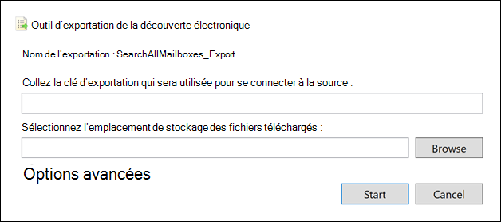

# Exporter un rapport de recherche de contenu

Au lieu d’exporter l’ensemble complet des résultats de recherche à partir d’une recherche de contenu dans le Centre de conformité Microsoft 365 (ou à partir d’une recherche associée à un cas core eDiscovery), vous pouvez exporter les mêmes rapports qui sont générés lorsque vous exportez les résultats de recherche réels.
  
Lorsque vous exportez un rapport, les fichiers de rapport sont téléchargés dans un dossier de votre ordinateur local qui porte le même nom que la recherche de contenu, mais qui est également _ReportsOnly *.* Par exemple, si la recherche de contenu est nommée  *ContosoCase0815*, le rapport est téléchargé dans un dossier nommé *ContosoCase0815_ReportsOnly*. Pour obtenir la liste des documents inclus dans le rapport, voir Ce qui [est inclus dans le rapport.](#whats-included-in-the-report)

## Avant d’exporter un rapport de recherche

- Pour exporter un rapport de recherche, vous devez avoir le rôle de gestion de recherche de conformité dans Centre de conformité Microsoft 365. Ce rôle est attribué par défaut au Gestionnaire eDiscovery intégré et aux groupes de rôles Gestion de l’organisation. Pour plus d'informations, voir [Attribution d'autorisations eDiscovery](assign-ediscovery-permissions.md).

- Lorsque vous exportez un rapport, les données sont stockées temporairement dans un emplacement stockage Azure dans le cloud Microsoft avant d’être téléchargées sur votre ordinateur local. Assurez-vous que votre organisation peut se connecter au point de terminaison dans Azure, qui est **\* .blob.core.windows.net** (le caractère générique représente un identificateur unique pour votre exportation). Les données des résultats de la recherche sont supprimées de l’emplacement stockage Azure deux semaines après leur création.

- L’ordinateur que vous utilisez pour exporter les résultats de recherche doit répondre aux exigences système suivantes :

  - Dernière version de Windows (32 bits ou 64 bits)

  - Microsoft .NET Framework 4.7.

- Vous devez utiliser l’un des navigateurs pris en charge suivants pour exécuter l’outil d’exportation eDiscovery1:

  - Microsoft Edge 2

    OU

  - Microsoft Internet Explorer 10 et versions ultérieures

  > [!NOTE]
  > 1 Microsoft ne fabrique pas d’extensions ou d’extensions tierces pour ClickOnce applications. L’exportation des résultats de recherche à l’aide d’un navigateur non pris en charge avec des extensions ou extensions tierces n’est pas prise en charge. 
  > 2 Suite aux modifications récentes apportées à Microsoft Edge, ClickOnce prise en charge de la recherche n’est plus activée par défaut. Pour obtenir des instructions sur l’activation ClickOnce prise en charge dans Edge, voir Utiliser l’outil d’exportation [eDiscovery dans Microsoft Edge](configure-edge-to-export-search-results.md).

- Si la taille totale estimée des résultats renvoyés par la recherche dépasse 2 To, l’exportation des rapports échoue. Pour exporter correctement les rapports, essayez de restreindre l’étendue et réexécutez la recherche afin que la taille estimée des résultats soit inférieure à 2 To.

- Si les résultats d’une recherche ont plus de 7 jours et que vous soumettez un travail de rapport d’exportation, un message d’erreur s’affiche vous invite à réexécuter la recherche pour mettre à jour les résultats de la recherche. Si cela se produit, annulez l’exportation, réexécutez la recherche, puis recommencez l’exportation.

- L’exportation de rapports de recherche est comptabilisée par rapport au nombre maximal d’exportations en cours d’exécution en même temps et au nombre maximal d’exportations qu’un seul utilisateur peut exécuter. Pour plus d’informations sur les limites d’exportation, voir Exporter les résultats [de recherche de contenu.](export-search-results.md#export-limits)
  
## Étape 1 : Générer le rapport pour l’exportation

La première étape consiste à préparer le rapport pour le téléchargement vers l’exportation de votre ordinateur. Lorsque vous exportez le rapport, les documents de rapport sont téléchargés vers une stockage Azure dans le cloud Microsoft.
  
1. Dans la Centre de conformité Microsoft 365, sélectionnez la recherche de contenu à partir de qui vous souhaitez exporter le rapport.
  
2. Dans le menu **Actions** en bas de la page de menu volant de recherche, cliquez sur **Exporter le rapport.**

   

   La page **de présentation** du rapport d’exportation s’affiche. Les options de rapport d’exportation disponibles pour exporter des informations sur la recherche varient selon que les résultats de la recherche sont situés dans des boîtes aux lettres ou des sites ou une combinaison des deux.
  
3. Sous **Options de sortie,** choisissez l’une des options suivantes :
  
   

    - Tous les éléments, à l’exception de ceux dont le format n’est pas reconnu, sont chiffrés ou n’ont pas été **indexés pour d’autres raisons.** Cette option exporte uniquement les informations sur les éléments indexés.
  
    - Tous les éléments, y compris ceux dont le format n’est pas reconnu, sont chiffrés ou n’ont pas été indexés pour **d’autres raisons.** Cette option exporte des informations sur les éléments indexés et non indexés.
  
    - Seuls les éléments qui ont un format non reconnu, sont chiffrés ou n’ont pas été indexés pour **d’autres raisons.** Cette option exporte uniquement les informations sur les éléments nonndex.

4. Configurez **l’option Activer la déplication pour Exchange contenu.**
  
   - Si vous sélectionnez cette option, le nombre de messages en double (avant la déplication et après la déplication) est inclus dans le rapport récapitulatif d’exportation. En outre, une seule copie d’un message sera incluse dans le fichier manifest.xml' Toutefois, le rapport des résultats de l’exportation contient une ligne pour chaque copie d’un message en double afin que vous pouvez identifier les boîtes aux lettres qui contiennent une copie du message en double. Pour plus d’informations sur les rapports exportés, voir Ce qui [est inclus dans le rapport.](#whats-included-in-the-report)

   - Si vous ne sélectionnez pas cette option, les rapports d’exportation contiennent des informations sur tous les messages renvoyés par la recherche, y compris les doublons.

     Pour plus d’informations sur la dédoplication et la façon dont les éléments dupliqués sont identifiés, voir Dédoplication dans les résultats de recherche [eDiscovery](de-duplication-in-ediscovery-search-results.md).

5. Cliquez **sur Générer un rapport.**

   Les rapports de recherche sont préparés pour le téléchargement, ce qui signifie que les documents de rapport sont téléchargés vers un emplacement stockage Azure dans le cloud Microsoft. L'opération peut prendre plusieurs minutes.

Consultez la section suivante pour obtenir des instructions sur le téléchargement des rapports de recherche exportés.
  
## Étape 2 : Télécharger le rapport

L’étape suivante consiste à télécharger le rapport à partir de la stockage Azure sur votre ordinateur local.

1. Dans la page **Recherche de** contenu de la Centre de conformité Microsoft 365, sélectionnez **l’onglet** Exportation
  
   Vous de devez peut-être cliquer sur **Actualiser** pour mettre à jour la liste des tâches d’exportation afin qu’elle affiche la tâche d’exportation que vous avez créée. Les travaux de rapport d’exportation ont le même nom que la recherche correspondante avec **_ReportsOnly** au nom de recherche.
  
2. Sélectionnez la tâche d’exportation que vous avez créée à l’étape 1.

3. Dans la page **volant du rapport** d’exportation sous la clé **d’exportation,** cliquez **sur Copier dans le Presse-papiers.** Vous utilisez cette clé à l’étape 6 pour télécharger les résultats de la recherche.
  
   > [!IMPORTANT]
   > Étant donné que tout le monde peut installer et démarrer l’outil d’exportation eDiscovery, puis utiliser cette clé pour télécharger le rapport de recherche, prenez toutes les précautions nécessaires pour protéger cette clé comme vous le feriez pour protéger les mots de passe ou d’autres informations de sécurité.

4. En haut de la page volante, cliquez sur **Télécharger les résultats.**

5. Si vous êtes invité à installer l’outil **d’exportation eDiscovery,** cliquez sur **Installer.**

6. Dans **l’outil d’exportation eDiscovery,** faites les choses suivantes :

   

   1. Collez la clé d’exportation que vous avez copiée à l’étape 3 dans la zone appropriée.
  
   2. Cliquez **sur Parcourir** pour spécifier l’emplacement où vous souhaitez télécharger les fichiers de rapport de recherche.

7. Cliquez sur **Démarrer** pour télécharger les résultats de recherche sur votre ordinateur.
  
    L’**outil d’exportation de découverte électronique** affiche l’état du processus d’exportation, ainsi qu’une estimation du nombre (et de la taille) d’éléments qui doivent encore être téléchargés. Lorsque le processus d’exportation est terminé, vous pouvez accéder aux fichiers à l’emplacement où ils ont été téléchargés.
  
## Ce qui est inclus dans le rapport

Lorsque vous générez et exportez un rapport sur les résultats d’une recherche de contenu, les documents suivants sont téléchargés :
  
- **Résumé de l’exportation :** Un Excel qui contient un résumé de l’exportation. Cela inclut des informations telles que le nombre de sources de contenu qui ont fait l’objet d’une recherche, le nombre de résultats de recherche à partir de chaque emplacement de contenu, le nombre estimé d’éléments, le nombre réel d’éléments à exporter et la taille estimée et réelle des éléments à exporter.

   Si vous incluez des éléments nonndes lors de l’exportation du rapport, le nombre d’éléments nonndex est inclus dans le nombre total de résultats de recherche estimés et dans le nombre total de résultats de recherche téléchargés (si vous de étiez pour exporter les résultats de recherche) répertoriés dans le rapport récapitulatif d’exportation. En d’autres termes, le nombre total d’éléments qui seraient téléchargés est égal au nombre total de résultats estimés et au nombre total d’éléments nonndex.
  
- **Manifeste :** Fichier manifeste (au format XML) qui contient des informations sur chaque élément inclus dans les résultats de la recherche. Si vous avez activé l’option de déplication, les messages en double ne sont pas inclus dans le fichier manifeste.

- **Résultats :** Un Excel qui contient une ligne contenant des informations sur chaque élément indexé qui serait exporté avec les résultats de la recherche. Pour le courrier électronique, le journal des résultats contient des informations sur chaque message, y compris : 

  - l’emplacement du message dans la boîte aux lettres source (notamment si le message est dans la boîte aux lettres principale ou d’archivage) ;

  - la date à laquelle le message a été envoyé ou reçu ;

  - l’objet du message ;

  - l’expéditeur et les destinataires du message.

  Pour les documents provenant SharePoint sites OneDrive Entreprise sites web, le journal des résultats contient des informations sur chaque document, notamment :

  - l’URL du document ;

  - l’URL de la collection de sites qui héberge le document ;

  - la date à laquelle le document a été modifié pour la dernière fois ;

  - le nom du document (qui se trouve dans la colonne Objet du journal des résultats).

  > [!NOTE]
  > Le nombre de lignes  dans le rapport résultats doit être égal au nombre total de résultats de recherche moins le nombre total d’éléments répertoriés dans le rapport Éléments **nonndes.**
  
- **Trace.log :** journal de suivi qui contient des informations de journalisation détaillées sur le processus d’exportation et peut vous aider à découvrir les problèmes pendant l’exportation. Si vous ouvrez un ticket avec le Support Microsoft à propos d’un problème lié à l’exportation de rapports de recherche, vous pouvez être invité à fournir ce journal de suivi.

- **Éléments nonndexés :** Un Excel qui contient des informations sur les éléments non nonndes inclus dans les résultats de la recherche. Si vous n’incluez pas d’éléments nonndex lorsque vous générez le rapport de résultats de recherche, ce rapport sera toujours téléchargé, mais il sera vide.
