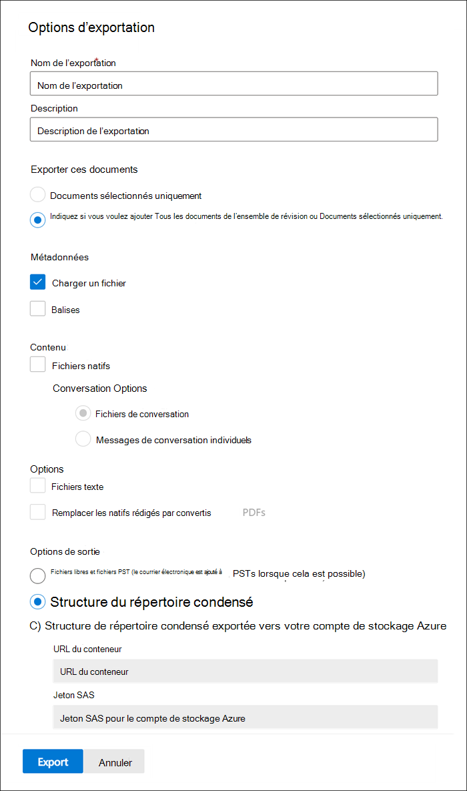

# Exporter des documents à partir d’un ensemble de révisions dans eDiscovery (Premium)

L’exportation permet aux utilisateurs de personnaliser le contenu inclus dans le package de téléchargement lorsque vous exportez le document à partir d’un ensemble de révisions dans eDiscovery (Premium).

Exporter les documents d’un jeu à réviser :

1. Dans le portail de conformité Microsoft Purview, ouvrez le cas eDiscovery (Premium), sélectionnez l’onglet **Ensembles** de révision, puis sélectionnez l’ensemble de révisions à exporter.

2. Dans le jeu de révision, cliquez sur **Exportation d’action** > .

   L’outil Exporter affiche la page de menu volant avec les paramètres pour configurer l’exportation. Certaines options sont sélectionnées par défaut, mais vous pouvez les modifier. Consultez la section suivante pour obtenir des descriptions des options d’exportation que vous pouvez configurer.

   

3. Après avoir configuré l’exportation, cliquez sur **Exporter** pour démarrer le processus d’exportation. Selon l’option que vous avez sélectionnée dans la section **Options de sortie** , vous pouvez accéder aux fichiers d’exportation par téléchargement direct ou dans le compte stockage Azure de votre organisation.

> [!NOTE]
> Les travaux d’exportation sont conservés pendant toute la durée de vie du cas. Toutefois, vous devez télécharger le contenu à partir d’une tâche d’exportation dans les 30 jours suivant la fin de la tâche d’exportation.

## Options d’exportation

Utilisez les options suivantes pour configurer l’exportation. Certaines options ne sont pas autorisées pour certaines options de sortie, notamment l’exportation de fichiers texte et les fichiers PDF redépliqués ne sont pas autorisés lors de l’exportation au format PST.

- **Nom de** l’exportation : nom du travail d’exportation. Il sera utilisé pour nommer les fichiers ZIP qui seront téléchargés.

- **Description** : Champ de texte libre pour vous permettre d’ajouter une description.

- **Exporter ces documents**

  - Documents sélectionnés uniquement : cette option exporte uniquement les documents actuellement sélectionnés. Cette option est disponible uniquement lorsque des éléments sont sélectionnés dans un ensemble de révisions.
  
  - Tous les documents filtrés : cette option exporte les documents dans un filtre actif. Cette option est disponible uniquement lorsqu’un filtre est appliqué au jeu de révision.
  
  - Tous les documents de l’ensemble de révision : cette option exporte tous les documents de l’ensemble de révision.

- **Options de sortie** : le contenu exporté est disponible en téléchargement directement via un navigateur web ou peut être envoyé à un compte de stockage Azure. Les deux premières options permettent le téléchargement direct.
  
  - Rapports uniquement : seuls le résumé et le fichier de chargement sont créés.
  
  - Fichiers libres et fichiers PST (l’e-mail est ajouté aux fichiers PST lorsque cela est possible) : les fichiers sont exportés dans un format qui ressemble à la structure d’annuaire d’origine vue par les utilisateurs dans leurs applications natives.  Pour plus d’informations, consultez la section [Relative aux fichiers libres et à la structure d’exportation PST](#loose-files-and-pst-export-structure) .
  
  - Structure de répertoire condensée : les fichiers sont exportés et inclus dans le téléchargement.
  
  - Structure d’annuaire condensée exportée vers votre compte de stockage Azure : les fichiers sont exportés vers le compte de stockage Azure de votre organisation. Pour cette option, vous devez fournir l’URL du conteneur dans votre compte de stockage Azure vers lequel exporter les fichiers. Vous devez également fournir le jeton de signature d’accès partagé (SAP) pour votre compte de stockage Azure. Pour plus d’informations, consultez [Exporter des documents dans une révision définie sur un compte de stockage Azure](download-export-jobs.md).

- **Include**
  
  - Balises : quand elles sont sélectionnées, les informations de balisage sont incluses dans le fichier de chargement.
  
  - Fichiers texte : cette option inclut les versions de texte extraites des fichiers natifs dans l’exportation.
  
  - Remplacez les fichiers natifs expurgés par des fichiers PDF convertis : si des fichiers PDF supprimés sont générés lors de la révision, ces fichiers sont disponibles pour l’exportation. Vous pouvez choisir d’exporter uniquement les fichiers natifs qui ont été supprimés (en ne sélectionnant pas cette option) ou vous pouvez sélectionner cette option pour exporter les fichiers PDF qui contiennent les actions réelles.

  - Fichiers PDF de conversation au lieu de messages de conversation individuels : activez cette case à cocher pour exporter les conversations de conversation dans un fichier PDF. Tous les messages de conversation de la même conversation sont exportés dans le même fichier PDF. Si vous ne cochez pas cette case, chaque message unique d’une conversation de conversation est exporté en tant qu’élément autonome. Le fichier est exporté au même format qu’il a été enregistré dans la boîte aux lettres. Pour une conversation spécifique, vous recevez plusieurs fichiers .msg.

Les sections suivantes décrivent la structure des dossiers pour les fichiers libres et les options de structure de répertoire condensé. Les exportations sont partitionnées en fichiers ZIP avec une taille maximale de contenu non compressé de 75 Go. Si la taille d’exportation est inférieure à 75 Go, l’exportation se compose d’un fichier récapitulatif et d’un fichier ZIP unique. Pour les exportations supérieures à 75 Go de données non compressées, plusieurs fichiers ZIP sont créés. Une fois téléchargés, les fichiers ZIP peuvent être décompressés dans un emplacement unique pour recréer l’exportation complète.

### Fichiers libres et structure d’exportation PST

Si vous sélectionnez cette option d’exportation, le contenu exporté est organisé dans la structure suivante :

- Summary.csv : inclut un résumé du contenu exporté à partir du jeu de révision

- Dossier racine : ce dossier nommé [Nom d’exportation] x de z.zip est répété pour chaque partition de fichier ZIP. Le dossier racine contient les éléments suivants :
  
  - Export_load_file_x de z.csv : fichier de métadonnées.
  
  - Avertissements et erreurs x de z.csv : ce fichier contient des informations sur les erreurs rencontrées lors de la tentative d’exportation à partir du jeu de révision.
  
  - Exchange : ce dossier contient tout le contenu d’Exchange stocké dans des fichiers PST. Les fichiers PDF expurgés ne peuvent pas être inclus avec cette option. Si une pièce jointe est sélectionnée dans le jeu de révision, l’e-mail parent est exporté avec la pièce jointe.
  
    Le dossier Exchange peut également contenir un sous-dossier nommé mailboxname_loosefiles.zip, qui contient les éléments suivants :

    - Messages protégés par la Gestion des droits relatifs à l’information (IRM) qui ont été décodés.
    - Messages corrigés d’erreur.
    - Pièces jointes ou liens modernes référencés dans les messages.
    - Éléments chiffrés (qui ne sont pas inclus dans les fichiers PST dans le dossier Exchange).
  
  - SharePoint : ce dossier contient tout le contenu natif de SharePoint dans un format de fichier natif. Les fichiers PDF expurgés ne peuvent pas être inclus avec cette option.

### Structure de répertoire condensée

- Summary.csv : inclut un résumé du contenu exporté à partir du jeu de révision

- Dossier racine : ce dossier nommé [Nom d’exportation] x de z.zip est répété pour chaque partition de fichier ZIP.
  
  - Export_load_file_x de z.csv : fichier de métadonnées et inclut également l’emplacement de chaque fichier stocké dans le fichier ZIP.
  
  - Avertissements et erreurs x de z.csv : ce fichier contient des informations sur les erreurs rencontrées lors de la tentative d’exportation à partir du jeu de révision.

  - NativeFiles : ce dossier contient tous les fichiers natifs qui ont été exportés. Les fichiers natifs sont remplacés par des fichiers PDF expurgés si vous avez sélectionné l’option *Remplacer les fichiers natifs supprimés par des fichiers PDF convertis* .
  
  - Error_files : ce dossier contient des fichiers qui ont subi une extraction ou une autre erreur de traitement. Les fichiers seront placés dans des dossiers distincts, ExtractionError ou ProcessingError. Ces fichiers sont répertoriés dans le fichier de chargement.

  - Extracted_text_files : ce dossier contient tous les fichiers texte extraits qui ont été générés lors du traitement.

### Structure d’annuaire condensée exportée vers votre compte de stockage Azure

Cette option utilise la même structure générale que la *structure de répertoire condensé*, mais le contenu n’est pas compressé et les données sont enregistrées dans votre compte de stockage Azure. Cette option est généralement utilisée lors de l’utilisation d’un fournisseur eDiscovery tiers. Pour plus d’informations sur l’utilisation de cette option, consultez [Exporter des documents dans une révision définie sur un compte de stockage Azure](download-export-jobs.md).
