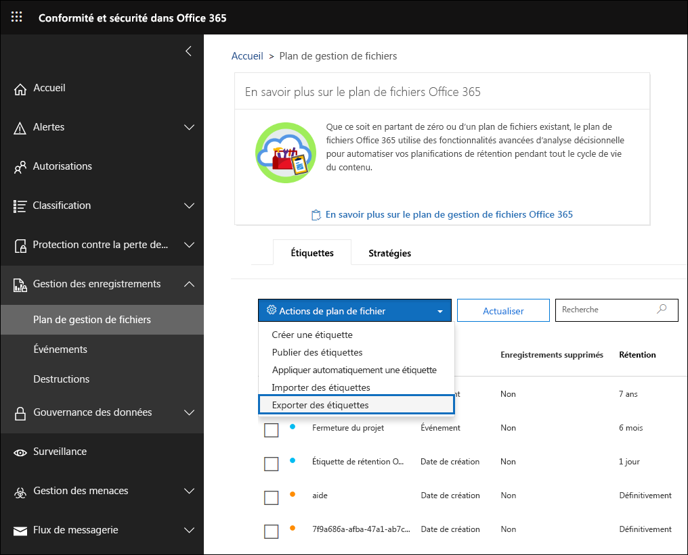
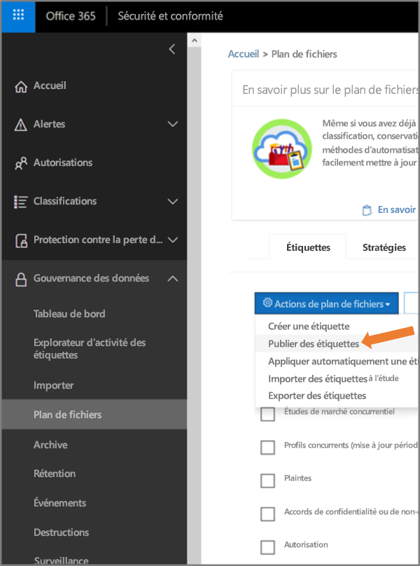

# Vue d’ensemble du gestionnaire de plan de gestion de fichiers

>*[Guide de sécurité et conformité pour les licences Microsoft 365](https://aka.ms/ComplianceSD).*

Le gestionnaire de plan de gestion de fichiers offre des fonctionnalités de gestion avancées pour les étiquettes et les stratégies de conservation, et fournit un moyen intégré de parcourir l’activité d’étiquette et d’étiquette vers le contenu pour l’intégralité du cycle de vie de votre contenu, de la création à la destruction finale, en passant par la collaboration, la déclaration d’enregistrement et la conservation. 

Pour accéder au gestionnaire du plan de gestion des fichiers dans le centre de sécurité et conformité, allez sur **Gestion des enregistrements** > **plan de gestion des fichiers**.

## Accès au gestionnaire de plan de fichiers

Pour accéder au gestionnaire de plan de fichiers, vous devez posséder l’un des rôles d’administrateur suivants :
    
- Gestionnaire de conservation

- Gestionnaire de conservation en lecture seule

## Étiquettes de rétention par défaut et stratégie d’étiquette

S’il n’existe aucune des étiquettes de rétention dans le centre de sécurité et conformité, la première fois que vous sélectionnez **Offre Fichier** dans le volet de navigation gauche, cela crée une stratégie d’étiquette appelée **Stratégie de Publication de Gouvernance des Données par défaut**. 

Cette stratégie d’étiquette contient trois étiquettes de rétention :

- **Processus opérationnels**
- **Entreprise générale**
- **Accord Contrat**

Ces étiquettes de rétention sont uniquement configurées pour conserver le contenu, et non supprimer le contenu. Cette stratégie d’étiquette peut être publiée dans l’ensemble de votre organisation et peut être désactivée ou supprimée. 

Vous pouvez déterminer qui a ouvert le Gestionnaire d’Offre de fichiers et désactivé l’expérience de première exécution en passant en revue le journal d’audit pour les activités **Créé la stratégie de rétention** et **Créé la configuration de rétention pour une stratégie de rétention**.

> [!NOTE]
> En raison des commentaires des clients, nous avons supprimé cette fonctionnalité qui crée les étiquettes de rétention par défaut et la stratégie d’étiquette de rétention mentionnées ci-dessus. Vous ne verrez que ces étiquettes de rétention et la stratégie d’étiquette de rétention si vous avez ouvert le gestionnaire de plan de gestion des fichiers avant le 11 avril 2019.

## Navigation dans votre plan de gestion de fichiers

Le gestionnaire de plan de gestion de fichiers permet d’afficher tous les paramètres de vos étiquettes et stratégies de conservation sur un même écran, en toute simplicité.

Notez que les étiquettes de conservation créées en dehors du plan de gestion de fichiers seront disponibles dans le plan de gestion de fichiers, et inversement.

Sur l’onglet **Etiquettes** du plan de gestion de fichiers, les informations et fonctionnalités supplémentaires suivantes sont disponibles :

### Colonnes de paramètres des étiquettes

- **Basé sur** identifie le type de déclencheur qui marque le début de la période de conservation. Les valeurs valides sont :
    - Événement
    - Date de création
    - Dernière modification
    - Date d’étiquetage
- **Enregistrement** identifie si l’élément devient un enregistrement déclaré lorsque l’étiquette est appliquée. Les valeurs valides sont les suivantes :
    - Non
    - Oui
    - Oui (réglementaire)
- **Conservation** identifie le type de conservation. Les valeurs valides sont les suivantes :
    - Conserver
    - Conserver et supprimer
    - Supprimer
- **Destination** détermine ce qu’il advient du contenu à la fin de la période de conservation. Les valeurs valides sont les suivantes :
    - null
    - Aucune action
    - Suppression automatique
    - Examen requis (également appelé Examen de destination)

### Colonnes des descripteurs de plan de gestion de fichiers pour les étiquettes

Vous pouvez désormais inclure plus d’informations dans la configuration de vos étiquettes de rétention. L’insertion de descripteurs de plan de gestion de fichiers dans les étiquettes de rétention améliore la facilité de gestion et l’organisation de votre plan de gestion des fichiers.

Pour vous aider à démarrer, le gestionnaire de plan de gestion de fichiers fournit des valeurs prédéfinies prêtes à être utilisées pour : Fonction/service, Catégorie, Type d’autorité et Mise en service/citation. Vous pouvez ajouter de nouvelles valeurs de descripteur de plan de gestion des fichiers lors de la création ou de la modification d’une étiquette de conservation. Vous pouvez également spécifier des descripteurs de plan de gestion de fichiers lorsque vous importez des étiquettes de rétention dans votre plan de fichiers. 

Voici une vue de l’étape des descripteurs de plan de gestion des fichiers lors de la création ou de la modification d’une étiquette de conservation.

Voici une vue des colonnes de descripteurs du plan de gestion de fichiers dans l’onglet **Etiquettes** du gestionnaire de plan gestion de fichiers.

## Exporter toutes les étiquettes de rétention existantes pour analyser et/ou effectuer des révisions en mode hors connexion

Depuis le gestionnaire de plan de gestion de fichiers, vous pouvez exporter les détails de toutes les étiquettes de conservation dans un fichier .csv pour vous aider à fournir des évaluations périodiques de conformité aux responsables de la gouvernance des données de votre organisation.

Pour exporter toutes les étiquettes de conservation : page **gestionnaire de plan de gestion de fichiers**, **Actions de plan de gestion de fichiers** \> **Exporter les étiquettes**.

Un fichier *.csv contenant toutes les étiquettes de conservation existantes s’ouvre.

## Import d’étiquettes de rétention dans votre plan de gestion de fichiers

Dans le gestionnaire de plan de gestion de fichiers, vous pouvez importer de nouvelles étiquettes de rétention en bloc et modifier des étiquettes de rétention existantes.

Pour importer de nouvelles étiquettes de rétention et modifier des étiquettes de rétention existantes : 

1. Dans la page **Plan de gestion de fichiers**, accédez à **Actions du plan de gestion de fichiers** > **Importer des étiquettes**.

   

   

2. Télécharger un modèle vierge pour importer les nouvelles étiquettes de rétention. Vous pouvez également commencer avec le fichier .csv exporté lorsque vous exportez les étiquettes de rétention existantes au sein de votre organisation.

   

3. Complétez le modèle. Les éléments suivants décrivent les propriétés et les valeurs valides pour chaque propriété du modèle de plan de gestion de fichiers. 

   |**Property**|**Type**|**Valeurs admises**|
   |:-----|:-----|:-----|
   |LabelName|Chaîne|Cette propriété spécifie le nom de l’étiquette de rétention.|
   |Commentaire|Chaîne|Utilisez cette propriété pour ajouter une description de l’étiquette de rétention pour les administrateurs. Cette description s’affiche uniquement pour les administrateurs qui gèrent l’étiquette dans le centre de sécurité et conformité.|
   |Notes|Chaîne|Utilisez cette propriété pour ajouter une description de l’étiquette de rétention pour les utilisateurs. Cette description s’affiche lorsque les utilisateurs pointent sur l’étiquette dans les applications telles que Outlook, SharePoint et OneDrive. Si vous laissez cette propriété vide, une description est affichée par défaut, qui décrit les paramètres de rétention de l’étiquette. |
   |IsRecordLabel|Chaîne|Cette propriété indique si l’étiquette est une étiquette d’enregistrement. Les éléments marqués avec une étiquette d’enregistrement sont déclarés comme enregistrements. Les valeurs valides sont les suivantes : **TRUE** : l’étiquette est une étiquette d’enregistrement. Notez que les éléments déclarés comme enregistrements ne peuvent pas être supprimés.  **FALSE** : l’intitulé n’est pas un intitulé d’enregistrement. Il s’agit de la valeur par défaut.|
   |RetentionAction|Chaîne|Cette propriété spécifie l’action à effectuer une fois que la valeur spécifiée par la propriété RetentionDuration expire. Les valeurs valides sont les suivantes : **Delete** : les éléments antérieurs à la valeur spécifiée par la propriété RetentionDuration sont supprimés. **Keep** : conserver les éléments pour la durée spécifiée par la propriété RetentionDuration et ne rien faire à l’expiration de la période.  **KeepAndDelete** : conserver les éléments pour la durée spécifiée par la propriété RetentionDuration et les supprimer à l’expiration de la période.   |
   |RetentionDuration|Chaîne|Cette propriété spécifie la durée de rétention du contenu en nombre de jours. Les valeurs valides sont les suivantes : **Unlimited** : les éléments sont conservés indéfiniment.  ***n*** : un entier positif ; par exemple, **365**. 
   |RetentionType|Chaîne|Cette propriété indique si la durée de rétention est calculée à partir de la date de création de contenu, de la date de l’événement, de la date étiquetée (marquée) ou de la date de la dernière modification. Les valeurs valides sont les suivantes : **CreationAgeInDays** **EventAgeInDays** **TaggedAgeInDays** **ModificationAgeInDays** |
   |ReviewerEmail|SmtpAddress|Lorsque cette propriété est remplie, une révision avant destruction est déclenchée à l’expiration de la durée de la rétention. Cette propriété spécifie l’adresse électronique d’un réviseur pour les actions de rétention **Delete** et **KeepAndDelete**. Vous pouvez inclure l’adresse de courrier des utilisateurs individuels, des groupes de distribution ou de sécurité. Vous pouvez spécifier plusieurs adresses e-mail séparées par des points-virgules.|
   |ReferenceId|Chaîne|Cette propriété spécifie la valeur affichée dans **l’ID de référence** du descripteur du plan de gestion de fichiers.| 
   |Departmentname|Chaîne|Cette propriété spécifie la valeur affichée dans les **Fonction/service** du descripteur du plan de gestion de fichiers.|
   |Catégorie|String|Cette propriété spécifie la valeur affichée dans la **Catégorie** du descripteur du plan de gestion de fichiers.|
   |Sous-catégorie|Chaîne|Cette propriété spécifie la valeur affichée dans la **Sous-catégorie** du descripteur du plan de gestion de fichiers.|
   |AuthorityType|Chaîne|Cette propriété spécifie la valeur affichée dans le **Type d’autorité** du descripteur du plan de gestion de fichiers.|
   |CitationName|Chaîne|Cette propriété spécifie le nom de la citation affichée dans la **Clause/citation** du descripteur du plan de fichiers ; par exemple, « Sarbanes-Oxley Act ou 2002 ». |
   |CitationUrl|Chaîne|Cette propriété spécifie l’URL affichée dans la **Clause/citation** du descripteur du plan de gestion de fichiers.|
   |CitationJurisdiction|Chaîne|Cette propriété spécifie la juridiction ou l’agence qui apparaît dans la **Clause/citation** du descripteur du plan de fichiers ; par exemple, « U.S. Securities and Exchange Commission (SEC) ».|
   |Réglementaire|Chaîne|Laisser la zone vierge. Cette propriété n’est pas utilisée pour le moment.|
   |EventType|Chaîne|Cette propriété spécifie la règle de rétention associée à l’étiquette. Vous pouvez utiliser une valeur quelconque qui identifie distinctement la règle. Par exemple : **Name** **Nom unique (DN)** **GUID**  Vous pouvez utiliser l'applet de commande [Get-RetentionComplianceRule](https://docs.microsoft.com/powershell/module/exchange/policy-and-compliance-retention/get-retentioncompliancerule?view=exchange-ps) pour afficher les règles de rétention disponibles. Notez que si vous exportez des étiquettes d’une seule organisation Office 365, vous ne pouvez pas utiliser les valeurs de la propriété EventType de cette organisation lorsque vous importez des étiquettes vers une autre organisation Office 365. Car les valeurs EventType sont uniques à chaque organisation. |
   |||

   Voici un exemple de modèle contenant les informations sur les étiquettes de rétention.

   

4. Sous l’étape 3, sur la page de l’assistant d’importation du plan de gestion de fichiers, cliquer sur **Rechercher des fichiers** pour charger le modèle rempli. 

   Le gestionnaire de plan de gestion de fichiers validera les entrées et affichera les statistiques d’importation.

   

   En cas d’erreur de validation, l’importation de plan de fichiers continuera à valider chaque entrée dans le fichier d’importation et affichera toutes les erreurs faisant référence aux numéros de ligne/ligne dans le fichier d’importation, copiera les résultats d’erreur affichés afin de pouvoir facilement revenir au fichier d’importation et corriger les erreurs.

5. Une fois l’importation terminée, accédez à nouveau au gestionnaire de plan de gestion de fichiers pour attribuer de nouvelles étiquettes de rétention aux stratégies de rétention nouvelles ou existantes.

   
