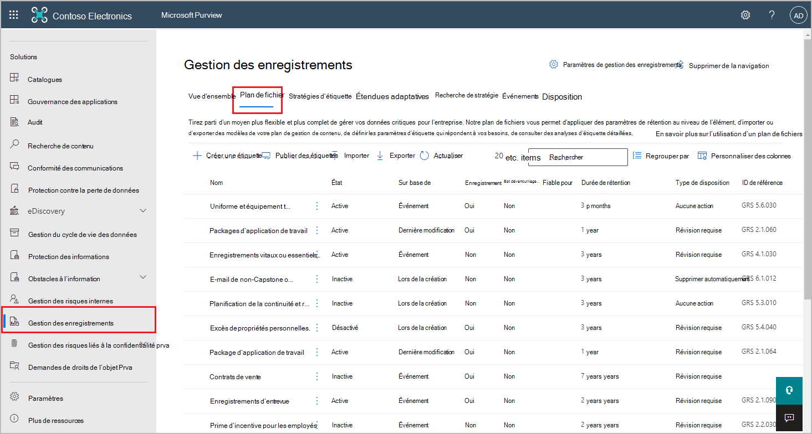
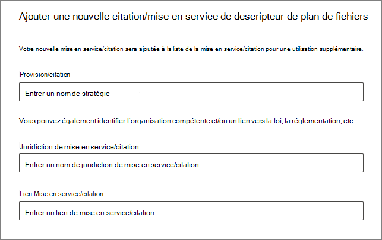
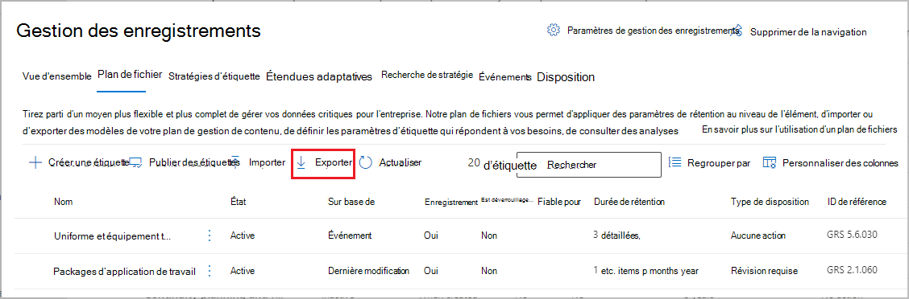
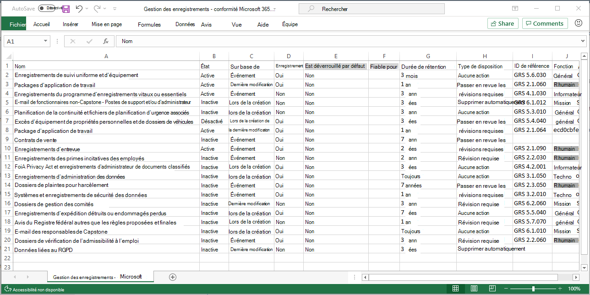
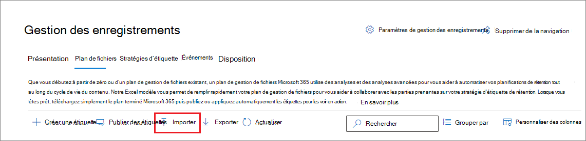
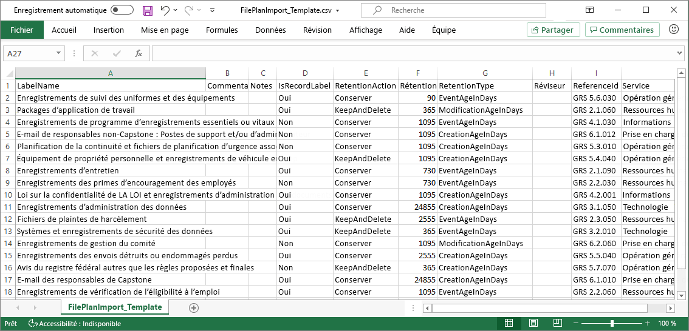

# Utiliser le plan de gestion de fichiers pour créer et gérer des étiquettes de rétention

>*[Guide de sécurité et conformité pour les licences Microsoft 365](/office365/servicedescriptions/microsoft-365-service-descriptions/microsoft-365-tenantlevel-services-licensing-guidance/microsoft-365-security-compliance-licensing-guidance).*

Bien que vous puissiez créer et gérer les étiquettes de rétention à partir de **Gouvernance des informations** dans le centre de conformité Microsoft 365, le plan de gestion de fichiers de **Gestion des enregistrements** dispose de fonctionnalités de gestion supplémentaires :

- Vous pouvez créer des étiquettes de rétention en bloc en important les informations pertinentes à partir d’une feuille de calcul.

- Vous pouvez exporter les informations à partir d’étiquettes de rétention existantes à des fins d’analyse et de collaboration hors connexion.

- Des informations supplémentaires sur les étiquettes de rétention s’affichent pour vous permettre de voir plus facilement les paramètres de toutes les étiquettes de rétention à partir d’une même vue.

- Les descripteurs de plan de gestion de fichiers prennent en charge des informations supplémentaires et facultatives pour chaque étiquette.

Le plan de gestion de fichiers peut être utilisé pour toutes les étiquettes de rétention, même s’ils ne marquent pas le contenu comme un enregistrement.

Pour plus d’informations sur les étiquettes de rétention et leur utilisation, voir [Découvrir les stratégies et les étiquettes de rétention](retention.md).

## Accès au plan de gestion de fichiers

Pour accéder au plan de gestion de fichiers, vous devez posséder l’un des rôles d’administrateur suivants :
    
- Gestionnaire de conservation

- Gestionnaire de conservation en lecture seule

Dans le Centre de conformité Microsoft 365, accédez à **Solutions** > **Gestion des enregistrements** > **Plan de gestion de fichiers** :

. 

Si **Gouvernance des informations** ne s’affiche pas dans le volet de navigation, faites défiler la liste vers le bas, puis sélectionnez **Tout afficher**.

## Navigation dans votre plan de gestion de fichiers

Si vous avez déjà créé des étiquettes de rétention à partir de **Gouvernance des informations** dans le centre de conformité Microsoft 365, celles-ci s’affichent automatiquement dans votre plan de gestion de fichiers. 

De même, si vous créez des étiquettes de rétention dans le plan de gestion de fichiers, celles-ci sont également disponibles dans **Gouvernance des informations** si elles ne sont pas configurées pour marquer le contenu comme un enregistrement.

Sur la page **Plan de gestion de fichiers**, vous pouvez voir toutes vos étiquettes avec leur état et leurs paramètres, les descripteurs de plan de gestion de fichiers facultatifs, une option d’exportation pour analyser ou activer les révisions de vos étiquettes en mode hors connexion, ainsi qu’une option d’importation pour créer des étiquettes de rétention. 

### Colonnes de paramètres des étiquettes

Toutes les colonnes à l’exception du **Nom** de l’étiquette peuvent être affichées ou masquées en sélectionnant l’option **Personnaliser les colonnes**. Par défaut, les premières colonnes affichent des informations sur l’état de l’étiquette et ses paramètres : 

- **État** indique si l’étiquette est incluse dans une stratégie d’étiquette ou une stratégie d’application automatique (**Active**) ou non (**Inactive**).

- **Sur la base de** identifie la date de début ou la façon dont la période de rétention débute. Valeurs valides :
    - Événement
    - Date de création
    - Dernière modification
    - Date d’étiquetage

- **Est un enregistrement** identifie si l’élément est marqué comme enregistrement lorsque l’étiquette est appliquée. Valeurs valides :
    - Non
    - Oui
    - Oui (réglementaire)

- **Durée de rétention** identifie la période de rétention. Valeurs valides :
    - Jours
    - Mois
    - Années
    - Pour toujours
    - Aucune

- **Type de destruction** détermine ce qu’il advient du contenu à la fin de la période de rétention. Valeurs valides :
    - Aucune action
    - Suppression automatique
    - Révision requise

### Colonnes des descripteurs de plan de gestion de fichiers

Le plan de gestion de fichiers vous permet d’inclure davantage d’informations dans le cadre de vos étiquettes de rétention. Ces descripteurs de plan de gestion de fichiers fournissent davantage d’options pour améliorer la gestion et l’organisation du contenu que vous devez étiqueter.

Par défaut, à partir d’**ID de référence**, les quelques colonnes suivantes affichent ces descripteurs de plan de gestion de fichiers facultatifs que vous pouvez spécifier lorsque vous créez une étiquette de rétention ou modifiez une étiquette existante. 

Pour commencer, il existe des valeurs prêtes à l’emploi pour les descripteurs de plan de gestion de fichiers suivants : 
- Fonction/Service
- Catégorie
- Type d’autorité
- Clause/citation 

Exemple de descripteurs de plan de gestion de fichiers lorsque vous créez ou modifiez une étiquette de rétention :

Lorsque vous sélectionnez **Choisir** pour chacun de ces descripteurs facultatifs, vous pouvez sélectionner l’une des valeurs out-of-box, ou créer les vôtres, puis les sélectionner. Par exemple : 

## Créer des étiquettes de rétention

1. Dans la page **Plan de fichiers**, sélectionnez **+ Créer une étiquette** >  **Étiquette de rétention**

2. Suivez les invites pour le processus de configuration. Faites attention au nom que vous choisissez, car il ne peut pas être modifié après l’enregistrement de l’étiquette.
    
    Pour plus d’informations sur les paramètres de rétention, voir Paramètres pour [conserver et supprimer du contenu.](retention-settings.md#settings-for-retaining-and-deleting-content)
    
    Pour utiliser l’étiquette de rétention pour déclarer des enregistrements, sélectionnez **Marquer les éléments comme enregistrements**, ou **Marquer les éléments comme enregistrements réglementaires**. Pour plus d’information, voir [Configuration d’étiquettes de rétention pour déclarer des enregistrements](declare-records.md#configuring-retention-labels-to-declare-records).

3. Une fois l’étiquette créée, les options permettant de la publier s’affichent. Appliquez automatiquement l’étiquette, ou enregistrez-la simplement : sélectionnez **Enregistrez simplement l’étiquette pour l'instant**, puis sélectionnez **Terminé**.

4. Répétez ces étapes pour créer d’autres étiquettes.

## Modifier les étiquettes de rétention

Pour modifier une étiquette de rétention existante, sélectionnez-la dans la page **Plan de gestion de fichiers**, puis sélectionnez l’option **Modifier l’étiquette** pour démarrer le processus de rétention de modification qui vous permet de modifier la description de l’étiquette et tous les paramètres éligibles.

Certains paramètres ne peuvent pas être modifiés après la création et l’enregistrement de l’étiquette, notamment :
- Nom de l’étiquette de rétention et paramètres de rétention à l’exception de la période de rétention. Cependant, vous ne pouvez pas modifier la période de rétention lorsque la période de rétention est basée sur la période d’étiquetage des éléments.
- Option de marquage des éléments comme enregistrement.

## Supprimer des étiquettes de rétention

Vous pouvez supprimer les étiquettes de conservation qui ne sont pas actuellement incluses dans les politiques d'étiquettes de conservation [publiées](create-apply-retention-labels.md) ou [appliquées](apply-retention-labels-automatically.md) automatiquement, qui ne sont pas configurées pour la conservation basée sur des événements, ou marquer les éléments comme des documents réglementaires.

Pour les étiquettes de rétention que vous pouvez supprimer, si elles ont été appliquées à des éléments, la suppression échoue et un lien vers l’explorateur de contenu permettant d’identifier les éléments étiquetés s’affiche.

Toutefois, l’affichage des éléments étiquetés par l’explorateur de contenu peut prendre deux jours maximum. Dans ce scénario, l’étiquette de rétention pourrait être supprimée sans l’affichage du lien vers l’explorateur de contenu.

## Exporter toutes les étiquettes de rétention pour analyse ou activer les révisions en mode hors connexion

Depuis le plan de gestion de fichiers, vous pouvez exporter les détails de toutes les étiquettes de conservation dans un fichier .csv pour vous aider à fournir des évaluations périodiques de conformité aux responsables de la gouvernance des données de votre organisation.

Pour exporter toutes les étiquettes de rétention : sur la page **Plan de gestion de fichiers**, cliquez sur **Exporter** :

Un fichier *.csv contenant toutes les étiquettes de rétention existantes s’ouvre. Par exemple :

## Import d’étiquettes de rétention dans votre plan de gestion de fichiers

Dans le plan de gestion de fichiers, vous pouvez importer en bloc de nouvelles étiquettes de rétention à l’aide d’un fichier .csv avec un format spécifique : 

1. Sur la page **Plan de gestion de fichiers**, cliquez sur **Importer** : 

2. Dans le volet **Remplir et importer votre plan de gestion de fichiers**, sélectionnez **Télécharger un modèle vide** :

   

3. Une fois le modèle téléchargé, ajoutez une ligne pour chaque étiquette, puis enregistrez le fichier. Consultez [la section suivante](#information-about-the-label-properties-for-import) pour obtenir des informations qui décrivent les propriétés et les valeurs valides de chaque propriété.
    
    Exemple de modèle rempli :
    
    

4. Sélectionnez **Télécharger fichier** pour télécharger le modèle rempli.
    
   Le plan de gestion de fichiers charge le fichier et valide les entrées.

5. En fonction des résultats de validation :
    
    - Si la validation échoue : notez le numéro de ligne et le nom de colonne à corriger dans le fichier d’importation. Corrigez les erreurs dans le fichier, puis enregistrez-le, enfin répétez l’étape 4.
    
    - Si la validation réussit : vous voyez **Vous avez correctement importé un plan de gestion de fichiers** et les entrées sont correctement converties en étiquettes de rétention. Sélectionnez **Terminé** pour fermer le volet et actualiser automatiquement la page **Plan de gestion de fichiers** pour afficher vos nouvelles étiquettes.

Vous pouvez désormais publier vos nouvelles étiquettes de rétention ou les appliquer automatiquement. Vous pouvez effectuer les deux opérations à partir de l’onglet **Stratégies d’étiquette** en sélectionnant **Publier des étiquettes** ou **Appliquer automatiquement une étiquette**.

### Informations sur les propriétés d’étiquette à importer

Utilisez les informations suivantes pour vous aider à remplir le modèle téléchargé afin d’importer de nouvelles étiquettes de rétention. Certaines valeurs ont une longueur maximale pour l’importation :

- **LabelName**: longueur maximale de 64 caractères
- **Commentaires** et **Notes** : longueur maximale de 1 024 caractères
- Toutes les autres valeurs : longueur illimitée
 

|Propriété|Type|Requis|Valeurs admises|
|:-----|:-----|:-----|:-----|
|LabelName|Chaîne|Oui|Cette propriété spécifie le nom de l’étiquette de rétention et doit être unique dans votre client. Caractères pris en charge pour l’importation : a-z, A-Z, 0-9, tiret (-) et espace.|
|Commentaire|Chaîne|Non|Utilisez cette propriété pour ajouter une description de l’étiquette de rétention pour les administrateurs. Cette description s’affiche uniquement pour les administrateurs qui gèrent l’étiquette de rétention dans le centre de conformité.|
|Notes|Chaîne|Non|Utilisez cette propriété pour ajouter une description de l’étiquette de rétention pour les utilisateurs. Cette description s’affiche lorsque les utilisateurs pointent sur l’étiquette dans les applications telles que Outlook, SharePoint et OneDrive. Si vous laissez cette propriété vide, une description est affichée par défaut, qui décrit les paramètres de rétention de l’étiquette. |
|IsRecordLabel|Chaîne|Non, sauf si **Réglementaire** est **TRUE**|Cette propriété indique si l’étiquette marque le contenu comme un enregistrement. Les valeurs valides sont les suivantes : **VRAI** : l’étiquette marque l’élément comme un enregistrement qui ne peut donc pas être supprimé.  **FALSE** : l’étiquette ne marque pas le contenu comme un enregistrement. Il s’agit de la valeur par défaut.    Dépendances de groupe : lorsque cette propriété est spécifiée, RetentionAction, RetentionDuration et RetentionType doivent également être spécifiés.|
|RetentionAction|Chaîne|Non, sauf si **RetentionDuration**, **RetentionType** ou **ReviewerEmail** sont spécifiés|Cette propriété spécifie l’action à effectuer après l’expiration de la valeur spécifiée par la propriété RetentionDuration (si spécifiée). Les valeurs valides sont les suivantes :  **Delete** : les éléments antérieurs à la valeur spécifiée par la propriété RetentionDuration sont supprimés. **Keep** : conserver les éléments pour la durée spécifiée par la propriété RetentionDuration et ne rien faire à l’expiration de la période.  **KeepAndDelete** : conserver les éléments pour la durée spécifiée par la propriété RetentionDuration et les supprimer à l’expiration de la période.     Dépendances de groupe : lorsque cette propriété est spécifiée, RetentionDuration et RetentionType doivent également être spécifiés. |
|RetentionDuration|Chaîne|Non, sauf si **RetentionAction** ou **RetentionType** sont spécifiés|Cette propriété spécifie le nombre de jours pendant lesquels conserver le contenu. Les valeurs valides sont les suivantes :  **Unlimited** : les éléments sont conservés indéfiniment.  **_n_*: entier positif en jours ; par exemple, **365**. Le nombre maximal pris en charge est de 24 855, soit 68 ans. Si vous avez besoin de plus de temps que ce maximum, utilisez Illimité à la place.    Dépendances de groupe : lorsque cette propriété est spécifiée, RetentionAction et RetentionType doivent également être spécifiés.
|RetentionType|Chaîne|Non, sauf si **RetentionAction** ou **RetentionDuration** sont spécifiés|Cette propriété spécifie si la durée de rétention (si spécifiée) est calculée à partir de la date de création du contenu, de la date de l’événement, de la date d’étiquetage ou de la date de dernière modification. Les valeurs valides sont les suivantes :  **CreationAgeInDays** **EventAgeInDays** **TaggedAgeInDays** **ModificationAgeInDays**     Dépendances de groupe : lorsque cette propriété est spécifiée, RetentionAction et RetentionDuraction doivent également être spécifiés.|
|ReviewerEmail|SmtpAddress|Non|Lorsque cette propriété est spécifiée, une révision avant destruction est déclenchée à l’expiration de la durée de la rétention. Cette propriété spécifie l’adresse électronique d’un réviseur dans votre client pour l’action de rétention **KeepAndDelete**.     Vous pouvez inclure l’adresse e-mail des utilisateurs individuels, des groupes de distribution ou des groupes de sécurité dans votre client. Spécifiez plusieurs adresses e-mail en les séparant par des points-virgules.     Dépendances de groupe : lorsque cette propriété est spécifiée, **RetentionAction** (doit être **KeepAndDelete**), **RetentionDuration** et **RetentionType** doivent également être spécifiés.|
|ReferenceId|Chaîne|Non|Cette propriété spécifie la valeur affichée dans l’**ID de référence** du descripteur du plan de gestion de fichiers que vous pouvez utiliser comme valeur unique pour votre organisation.| 
|Departmentname|Chaîne|Non|Cette propriété spécifie la valeur affichée dans les **Fonction/service** du descripteur du plan de gestion de fichiers.|
|Catégorie|String|Non|Cette propriété spécifie la valeur affichée dans la **Catégorie** du descripteur du plan de gestion de fichiers.|
|Sous-catégorie|Chaîne|Non|Cette propriété spécifie la valeur affichée dans la **Sous-catégorie** du descripteur du plan de gestion de fichiers.|
|AuthorityType|Chaîne|Non|Cette propriété spécifie la valeur affichée dans le **Type d’autorité** du descripteur du plan de gestion de fichiers.|
|CitationName|Chaîne|Non|Cette propriété spécifie le nom de la citation affichée dans la **Clause/citation** du descripteur du plan de fichiers ; par exemple, « Loi Sarbanes-Oxley ou 2002 ». |
|CitationUrl|Chaîne|Non|Cette propriété spécifie l’URL affichée dans la **Clause/citation** du descripteur du plan de gestion de fichiers.|
|CitationJurisdiction|Chaîne|Non|Cette propriété spécifie la juridiction ou l’agence qui apparaît dans la **Clause/citation** du descripteur du plan de fichiers. Par exemple, « U.S. Securities and Exchange Commission (SEC) ».|
|Réglementaire|Chaîne|Non|Cette propriété spécifie si l’étiquette marque le contenu comme un enregistrement réglementaire, ce qui est [plus restrictif](records-management.md#compare-restrictions-for-what-actions-are-allowed-or-blocked) qu’un enregistrement. Pour utiliser cette configuration d’étiquette, votre client doit être configuré pour [afficher l’option permettant de marquer le contenu comme un enregistrement réglementaire](declare-records.md#how-to-display-the-option-to-mark-content-as-a-regulatory-record), sinon la validation de l’importation échouera. Les valeurs valides sont les suivantes :  **TRUE**: l’étiquette marque l’élément comme un enregistrement réglementaire. Vous devez également définir la propriété **IsRecordLabel** sur TRUE. **FALSE** : l’étiquette ne marque pas le contenu comme un enregistrement réglementaire. Il s’agit de la valeur par défaut.|
|EventType|Chaîne|Non, sauf si **RetentionType** est **EventAgeInDays**|Cette propriété spécifie un type d’événement utilisé pour la [rétention basée sur les événements](event-driven-retention.md). Spécifiez un type d’événement existant qui s’affiche dans **Gestion des enregistrements** > **Événements** > **Gérer les types d’événements**. Vous pouvez également utiliser l’applet de commande [Get-ComplianceRetentionEventType](/powershell/module/exchange/get-complianceretentioneventtype) pour afficher les types d’événements disponibles. Bien qu’il existe certains types d’événements intégrés, tels que **Activité de l’employé** et **Durée de vie du produit**, vous pouvez également créer vos propres types d’événements.     Si vous spécifiez votre propre type d’événement, il doit exister avant l’importation, car le nom est validé dans le cadre du processus d’importation.|
|||

## Prochaines étapes

Maintenant que vous avez créé des étiquettes de rétention, elles sont prêtes à être ajoutées aux éléments en les publiant ou en les appliquant automatiquement :
- [Publier des étiquettes de rétention et les appliquer dans les applications](create-apply-retention-labels.md)
- [Appliquer automatiquement une étiquette de rétention au contenu](apply-retention-labels-automatically.md)