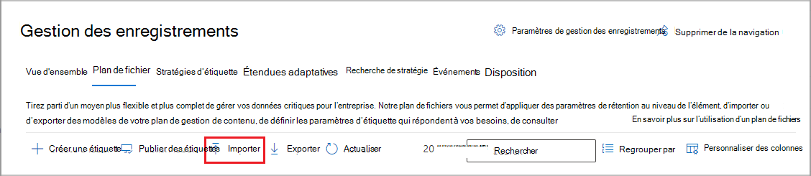
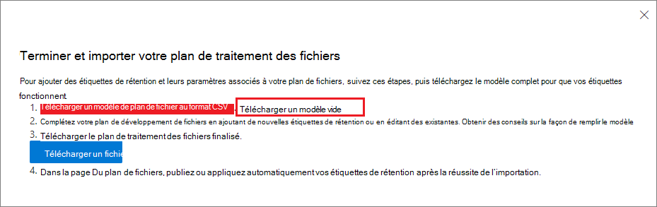

# Utiliser le plan de gestion de fichiers pour gérer les étiquettes de rétention

>*[Guide de sécurité et conformité pour les licences Microsoft 365](https://aka.ms/ComplianceSD).*

Bien que vous puissiez créer et gérer les étiquettes de rétention à partir de **Gouvernance des informations** dans le centre de conformité Microsoft 365, le plan de gestion de fichiers de **Gestion des enregistrements** dispose de fonctionnalités de gestion supplémentaires :

- Vous pouvez créer des étiquettes de rétention en bloc en important les informations pertinentes à partir d’une feuille de calcul.

- Vous pouvez exporter les informations à partir d’étiquettes de rétention existantes pour l’analyse et la collaboration hors connexion, ou pour la modification en bloc.

- Des informations supplémentaires sur les étiquettes de rétention s’affichent pour vous permettre de voir plus facilement les paramètres de toutes les étiquettes de rétention à partir d’une même vue.

- Les descripteurs de plan de gestion de fichiers prennent en charge des informations supplémentaires et facultatives pour chaque étiquette.

Le plan de gestion de fichiers peut être utilisé pour toutes les étiquettes de rétention, même s’ils ne marquent pas le contenu comme un enregistrement.

Pour plus d’informations sur les étiquettes de rétention et leur utilisation, voir [Découvrir les stratégies et les étiquettes de rétention](retention.md).

## Accès au plan de gestion de fichiers

Pour accéder au plan de gestion de fichiers, vous devez posséder l’un des rôles d’administrateur suivants :
    
- Gestionnaire de conservation

- Gestionnaire de conservation en lecture seule

Dans le centre de conformité Microsoft 365, accédez à **Solutions** > **Gestion des enregistrements** > **Plan de gestion de fichiers**. 

Si **Gouvernance des informations** ne s’affiche pas dans le volet de navigation, faites défiler la liste vers le bas, puis sélectionnez **Tout afficher**.

## Navigation dans votre plan de gestion de fichiers

Si vous avez déjà créé des étiquettes de rétention à partir de **Gouvernance des informations** dans le centre de conformité Microsoft 365, celles-ci s’affichent automatiquement dans votre plan de gestion de fichiers. 

De même, si vous créez des étiquettes de rétention dans le plan de gestion de fichiers, celles-ci sont également disponibles dans **Gouvernance des informations** si elles ne sont pas configurées pour marquer le contenu comme un enregistrement.

Sur la page **Plan de gestion de fichiers**, vous pouvez voir toutes vos étiquettes avec leur état et leurs paramètres, les descripteurs de plan de gestion de fichiers facultatifs, une option d’exportation pour analyser ou activer les révisions de vos étiquettes en mode hors connexion, ainsi qu’une option d’importation pour créer des étiquettes de rétention. 

### Colonnes de paramètres des étiquettes

Toutes les colonnes à l’exception du **Nom** de l’étiquette peuvent être affichées ou masquées en sélectionnant l’option **Personnaliser les colonnes**. Par défaut, les premières colonnes affichent des informations sur l’état de l’étiquette et ses paramètres : 

- **État** indique si l’étiquette est incluse dans une stratégie d’étiquette ou une stratégie d’application automatique (**Active**) ou non (**Inactive**).

- **Basée sur** identifie la date de début de la période de rétention ou la façon dont la période de rétention débute. Valeurs valides :
    - Événement
    - Date de création
    - Dernière modification
    - Date d’étiquetage

- **Est un enregistrement** identifie si l’élément est marqué comme enregistrement lorsque l’étiquette est appliquée. Valeurs valides :
    - Non
    - Oui
    - Oui (réglementaire)

- **Durée de rétention** identifie la période de rétention. Valeurs valides :
    - Jours
    - Mois
    - Années
    - Pour toujours
    - Aucune

- **Type de destruction** détermine ce qu’il advient du contenu à la fin de la période de rétention. Valeurs valides :
    - Aucune action
    - Suppression automatique
    - Révision requise

### Colonnes des descripteurs de plan de gestion de fichiers

Le plan de gestion de fichiers vous permet d’inclure davantage d’informations dans le cadre de vos étiquettes de rétention. Ces descripteurs de plan de gestion de fichiers fournissent davantage d’options pour améliorer la gestion et l’organisation du contenu que vous devez étiqueter.

Par défaut, à partir d’**ID de référence**, les quelques colonnes suivantes affichent ces descripteurs de plan de gestion de fichiers que vous pouvez spécifier lorsque vous créez une étiquette de rétention ou modifiez une étiquette existante. 

Pour commencer, il existe des valeurs prêtes à l’emploi pour les descripteurs de plan de gestion de fichiers suivants : 
- Fonction/Service
- Catégorie
- Type d’autorité
- Clause/citation 

Exemple de descripteurs de plan de gestion de fichiers lorsque vous créez ou modifiez une étiquette de rétention :

Exemple de vue des colonnes des descripteurs de plan de gestion de fichiers :

## Exporter toutes les étiquettes de rétention pour analyse ou activer les révisions en mode hors connexion

Depuis le plan de gestion de fichiers, vous pouvez exporter les détails de toutes les étiquettes de conservation dans un fichier .csv pour vous aider à fournir des évaluations périodiques de conformité aux responsables de la gouvernance des données de votre organisation.

Pour exporter toutes les étiquettes de rétention : sur la page **Plan de gestion de fichiers**, cliquez sur **Exporter** :

Un fichier *.csv contenant toutes les étiquettes de rétention existantes s’ouvre. Par exemple :

## Import d’étiquettes de rétention dans votre plan de gestion de fichiers

Dans le plan de gestion de fichiers, vous pouvez importer en bloc de nouvelles étiquettes de rétention et utiliser la même méthode pour modifier en bloc les étiquettes de rétention existantes.

Pour importer de nouvelles étiquettes de rétention et modifier des étiquettes de rétention existantes : 

1. Sur la page **Plan de gestion de fichiers**, cliquez sur **Importer** pour utiliser la page **Remplir et importer votre plan de gestion de fichiers** :

   

   

2. Télécharger un modèle vierge pour importer les nouvelles étiquettes de rétention. Vous pouvez également commencer avec le fichier .csv exporté lorsque vous exportez les étiquettes de rétention existantes au sein de votre organisation.

   

3. Renseignez le modèle à l’aide des informations suivantes qui décrivent les propriétés et les valeurs valides pour chaque d’entre elles. Pour l’importation, chaque valeur a une longueur maximale de 64 caractères.  

   |Propriété|Type|Valeurs admises|
   |:-----|:-----|:-----|
   |LabelName|Chaîne|Cette propriété spécifie le nom de l’étiquette de rétention.|
   |Commentaire|Chaîne|Utilisez cette propriété pour ajouter une description de l’étiquette de rétention pour les administrateurs. Cette description s’affiche uniquement pour les administrateurs qui gèrent l’étiquette de rétention dans le centre de conformité.|
   |Notes|Chaîne|Utilisez cette propriété pour ajouter une description de l’étiquette de rétention pour les utilisateurs. Cette description s’affiche lorsque les utilisateurs pointent sur l’étiquette dans les applications telles que Outlook, SharePoint et OneDrive. Si vous laissez cette propriété vide, une description est affichée par défaut, qui décrit les paramètres de rétention de l’étiquette. |
   |IsRecordLabel|Chaîne|Cette propriété indique si l’étiquette marque le contenu comme un enregistrement. Les valeurs valides sont les suivantes :  **VRAI** : l’étiquette marque l’élément comme un enregistrement qui ne peut donc pas être supprimé.  **FAUX** : l’étiquette ne marque pas le contenu comme un enregistrement. Il s’agit de la valeur par défaut.|
   |RetentionAction|Chaîne|Cette propriété spécifie l’action à effectuer une fois que la valeur spécifiée par la propriété RetentionDuration expire. Les valeurs valides sont les suivantes :  **Delete** : les éléments antérieurs à la valeur spécifiée par la propriété RetentionDuration sont supprimés. **Keep** : conserver les éléments pour la durée spécifiée par la propriété RetentionDuration et ne rien faire à l’expiration de la période.  **KeepAndDelete** : conserver les éléments pour la durée spécifiée par la propriété RetentionDuration et les supprimer à l’expiration de la période.   |
   |RetentionDuration|Chaîne|Cette propriété spécifie la durée de rétention du contenu en nombre de jours. Les valeurs valides sont les suivantes :  **Unlimited** : les éléments sont conservés indéfiniment.  ***n*** : un entier positif ; par exemple, **365**. 
   |RetentionType|Chaîne|Cette propriété indique si la durée de rétention est calculée à partir de la date de création de contenu, de la date de l’événement, de la date d’étiquetage ou de la date de la dernière modification. Les valeurs valides sont les suivantes :  **CreationAgeInDays** **EventAgeInDays** **TaggedAgeInDays** **ModificationAgeInDays** |
   |ReviewerEmail|SmtpAddress|Lorsque cette propriété est remplie, une révision avant destruction est déclenchée à l’expiration de la durée de la rétention. Cette propriété spécifie l’adresse électronique d’un réviseur pour l’action de rétention **KeepAndDelete**. Vous pouvez inclure l’adresse de courrier des utilisateurs individuels, ainsi que celle des groupes de distribution ou de sécurité. Vous pouvez spécifier plusieurs adresses e-mail séparées par des points-virgules.|
   |ReferenceId|Chaîne|Cette propriété spécifie la valeur affichée dans l’**ID de référence** du descripteur du plan de gestion de fichiers que vous pouvez utiliser comme valeur unique pour votre organisation.| 
   |Departmentname|Chaîne|Cette propriété spécifie la valeur affichée dans les **Fonction/service** du descripteur du plan de gestion de fichiers.|
   |Catégorie|String|Cette propriété spécifie la valeur affichée dans la **Catégorie** du descripteur du plan de gestion de fichiers.|
   |Sous-catégorie|Chaîne|Cette propriété spécifie la valeur affichée dans la **Sous-catégorie** du descripteur du plan de gestion de fichiers.|
   |AuthorityType|Chaîne|Cette propriété spécifie la valeur affichée dans le **Type d’autorité** du descripteur du plan de gestion de fichiers.|
   |CitationName|Chaîne|Cette propriété spécifie le nom de la citation affiché dans le descripteur de plan de gestion de fichiers **Clause/citation**. Par exemple, « Loi Sarbanes-Oxley de 2002 ». |
   |CitationUrl|Chaîne|Cette propriété spécifie l’URL affichée dans la **Clause/citation** du descripteur du plan de gestion de fichiers.|
   |CitationJurisdiction|Chaîne|Cette propriété spécifie la juridiction ou l’agence affichée dans le descripteur de plan de gestion de fichiers **Clause/citation**. Par exemple, « Securities and Exchange Commission (SEC) ».|
   |Réglementaire|Chaîne|Laisser la zone vierge. Cette propriété n’est pas utilisée pour le moment.|
   |EventType|Chaîne|Cette propriété spécifie la règle de rétention associée à l’étiquette. Vous pouvez utiliser une valeur quelconque qui identifie distinctement la règle. Par exemple : **Name** **Nom unique (DN)** **GUID**  Vous pouvez utiliser l'applet de commande [Get-RetentionComplianceRule](https://docs.microsoft.com/powershell/module/exchange/get-retentioncompliancerule) pour afficher les règles de rétention disponibles. Notez que, les valeurs EventType étant uniques pour chaque organisation, si vous exportez des étiquettes d’une seule organisation, vous ne pouvez pas utiliser les valeurs de la propriété EventType de cette organisation lorsque vous importez des étiquettes vers une autre organisation.|
   |||

   Voici un exemple du modèle contenant les informations sur les étiquettes de rétention.

   

4. Sous l’étape 3 sur la page **Remplir et importer votre plan de gestion de fichiers**, cliquer sur **Rechercher des fichiers** pour charger le modèle rempli. 

   Le plan de gestion de fichiers valide les entrées et affiche les statistiques d’importation.

   

   En cas d’erreur de validation, l’importation de plan de gestion de fichiers continue de valider chaque entrée du fichier d’importation et affiche toutes les erreurs en faisant référence aux numéros de ligne et de colonne dans le fichier d’importation. Copiez les résultats d’erreur affichés afin de pouvoir les corriger lorsque vous revenez au fichier d’importation.

Une fois l’importation terminée, vous pouvez désormais ajouter les étiquettes de rétention à une nouvelle stratégie d’étiquette de rétention ou les appliquer automatiquement. Vous pouvez faire cela directement à partir de la page **Plan de gestion de fichiers** en sélectionnant la liste déroulante dans **+ Créer une étiquette**, puis **Stratégie de publication des étiquettes** ou **Stratégie d’application automatique d’une étiquette**.

## Étapes suivantes

Pour plus d’informations sur la création et la modification des étiquettes de rétention et sur leurs stratégies, voir les documents suivants :
- [Créer des étiquettes de rétention et les appliquer dans les applications](create-apply-retention-labels.md)
- [Appliquer automatiquement une étiquette de rétention au contenu](apply-retention-labels-automatically.md)
