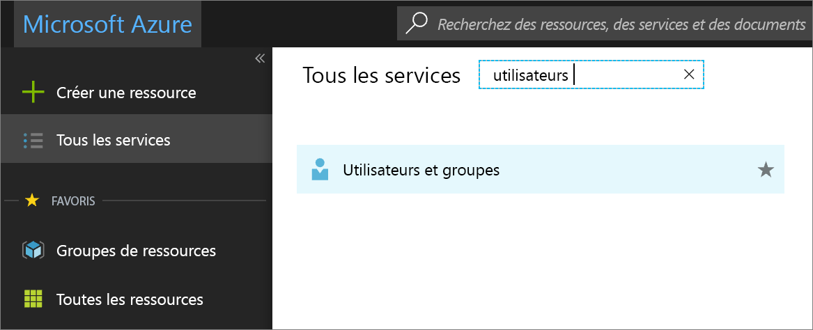
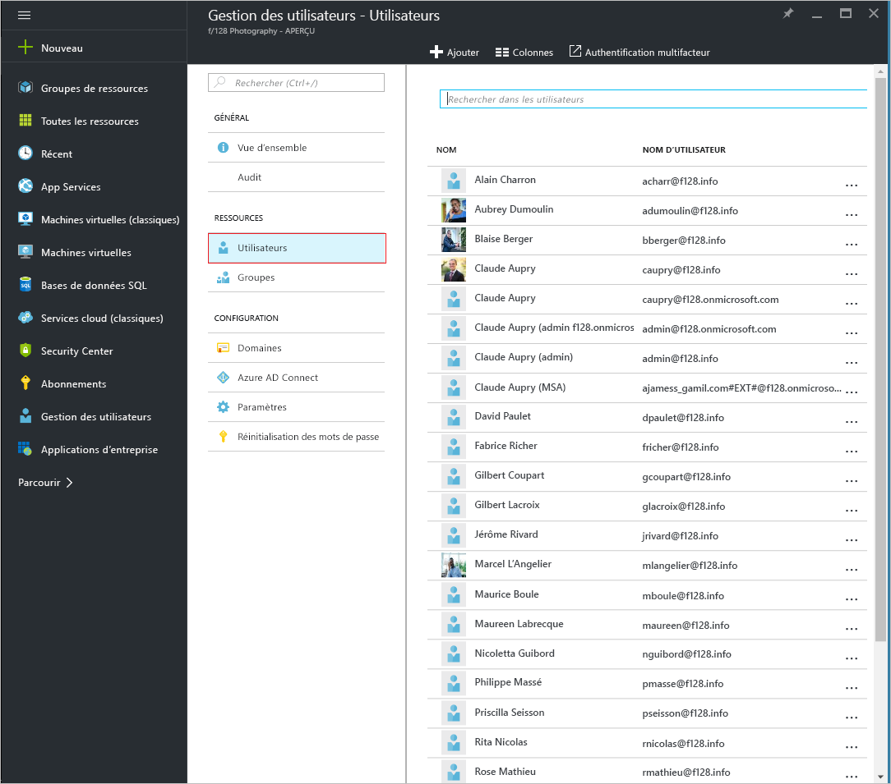
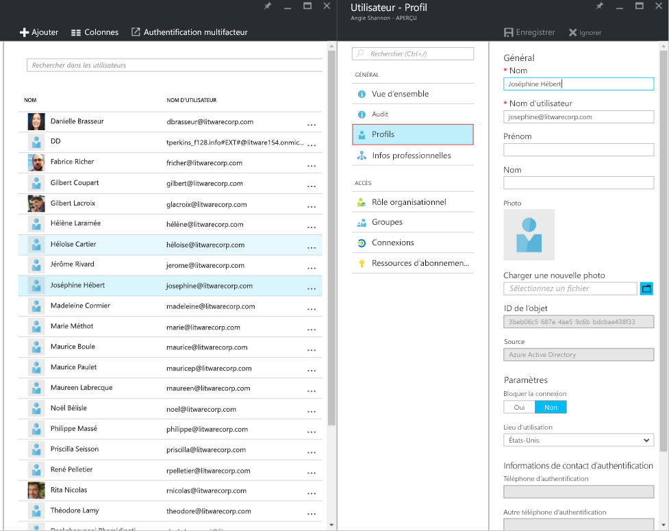
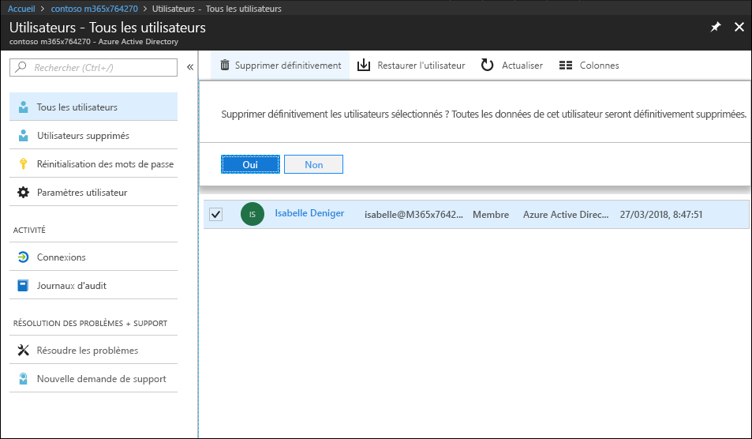
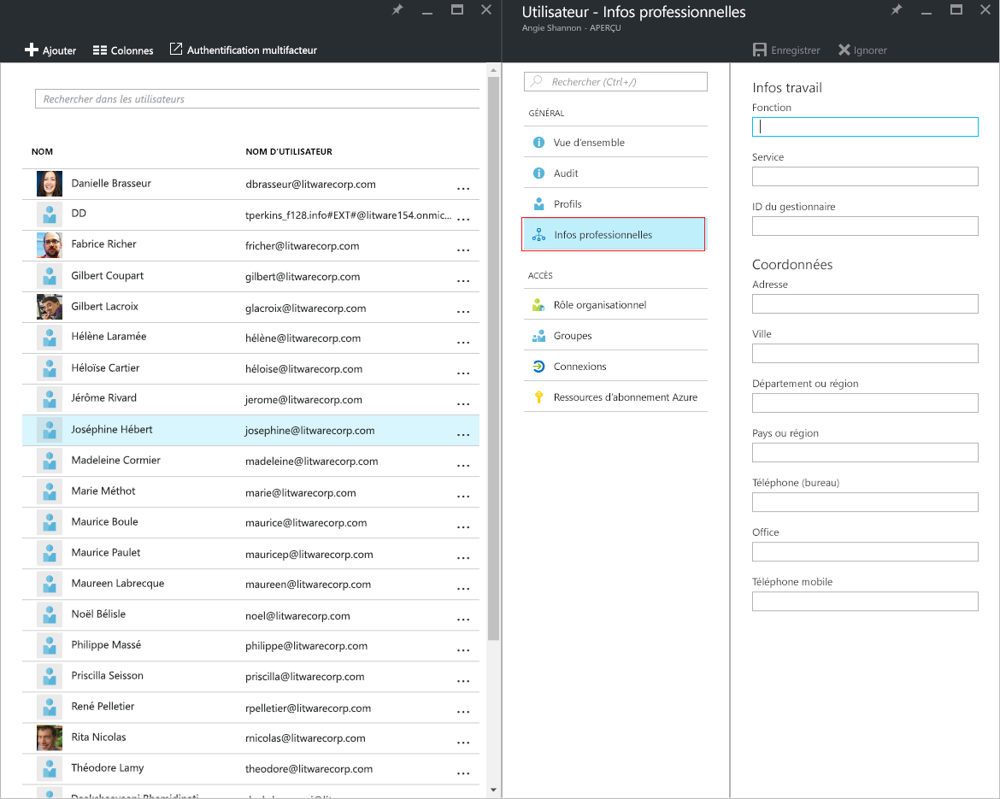
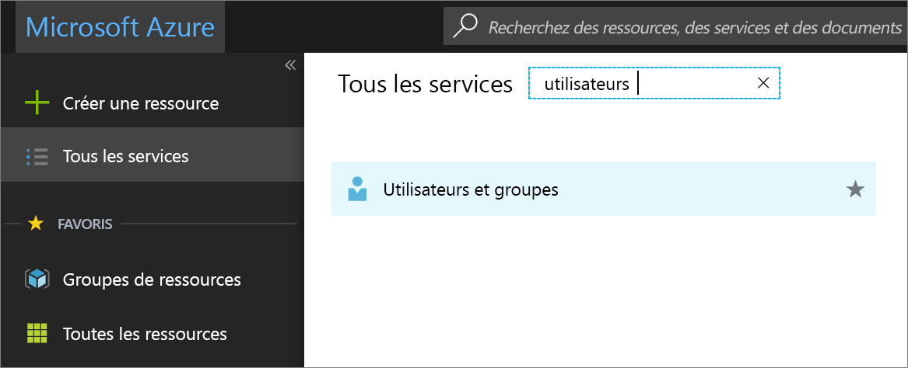
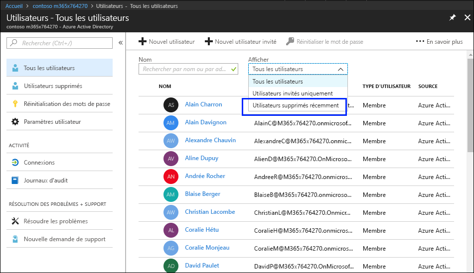
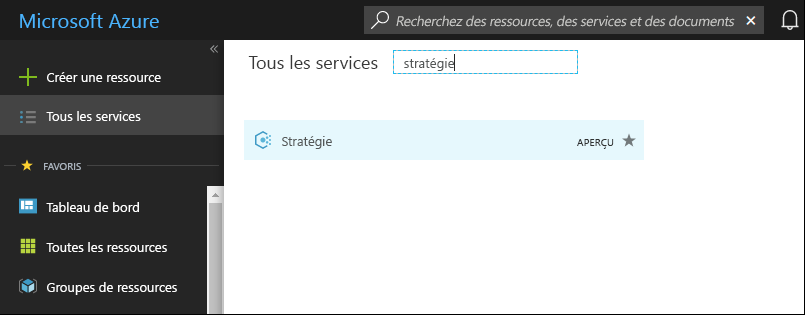
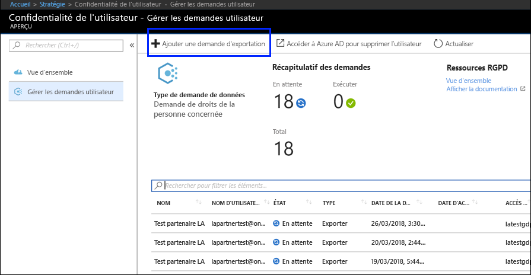
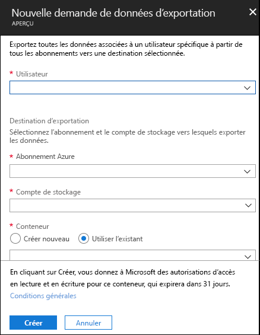

# Demandes des personnes concernées pour Azure concernant le RGPD

## Présentation des demandes des personnes concernées (DSR)

Le Règlement général sur la protection des données (RGPD) de l’UE permet aux utilisateurs (désignés dans le règlement comme étant les *personnes concernées*) de gérer les données personnelles collectées par un employeur ou tout autre type d’agence ou organisation (le *contrôleur des données* ou le *contrôleur* uniquement). Les données personnelles sont définies de manière générale dans le cadre du RGPD comme correspondant aux données associées à une personne physique identifiée ou identifiable. Le RGPD octroie aux personnes concernées des droits spécifiques sur leurs données personnelles. Ces droits incluent l’obtention de copies des données personnelles, les demandes de corrections de ces dernières, la restriction de leur traitement, leur suppression ou leur réception dans un format électronique afin de les transférer à un autre contrôleur. Toute demande formelle effectuée par une personne concernée à un contrôleur au sujet de la prise de mesure sur ses données personnelles est appelée *demande de personne concernée* ou DSR. 

Le guide explique comment utiliser les outils d’administration, les services et les produits Microsoft pour aider nos clients contrôleurs à rechercher des données personnelles et à agir dessus pour répondre à des DSR. Plus précisément, il décrit comment rechercher des données personnelles stockées dans le cloud Microsoft, y accéder et agir dessus. Voici un bref aperçu des processus décrits dans ce guide :

1.  ***Découvrir*** : utilisez les outils de recherche et de découverte pour rechercher plus facilement des données client qui peuvent être l’objet d’une DSR. Une fois que vous avez collecté les documents pouvant être utiles, vous pouvez effectuer une ou plusieurs des actions DSR décrites dans les étapes suivantes pour répondre à la demande. Par ailleurs, vous pouvez déterminer que la demande ne respecte pas les instructions de votre organisation pour répondre à des DSR.

2.  ***Accéder*** : récupérez des données personnelles qui résident dans le cloud Microsoft et, si nécessaire, effectuez-en une copie pour la personne concernée.

3.  ***Rectifier*** : modifiez ou mettez en œuvre d’autres actions demandées sur les données personnelles, le cas échéant.

4.  ***Limiter*** : limitez le traitement des données personnelles, soit en supprimant des licences pour différents services Azure, soit en désactivant les services souhaités, lorsque cela est possible. Vous pouvez également supprimer des données du cloud Microsoft et les conserver en local ou à un autre emplacement.

5.  ***Supprimer*** : supprimez définitivement des données personnelles qui résidaient dans le cloud Microsoft.

6.  ***Exporter*** : fournissez une copie électronique (dans un format lisible par une machine) des données personnelles à la personne concernée.

Chaque section de ce guide décrit les procédures techniques qu’une organisation de contrôleur des données peut suivre pour répondre à une DSR pour des données personnelles dans le cloud Microsoft.

### Terminologie

Vous trouverez ci-dessous des définitions de termes utilisés dans ce guide.

-   *Contrôleur* : la personne physique ou morale, l’autorité publique, le service ou tout autre organisme qui, seul ou conjointement avec d’autres, détermine les finalités et les moyens du traitement des données personnelles ; lorsque les finalités et les moyens du traitement sont déterminés par la législation de l’Union ou des États membres, le contrôleur peut être désigné, ou les critères spécifiques relatifs à sa nomination peuvent être définis, par la législation de l’Union ou des États membres.

-   *Données personnelles* et *personne concernée* : elles correspondent aux informations relatives à une personne naturelle identifiée ou identifiable (« la personne concernée ») ; une personne naturelle identifiable est une personne qui peut être identifiée, directement ou indirectement, notamment par référence à un identificateur par exemple, un nom, un numéro d’identification, des données de localisation, un identificateur en ligne, ou un ou plusieurs facteurs spécifiques de l’identité physique, physiologique, génétique, mentale, économique, culturelle ou sociale de cette personne naturelle.

-   *Sous-traitant* : la personne physique ou morale, l’autorité publique, le service ou tout autre organisme qui traite des données personnelles pour le compte du contrôleur.

-   *Données client* : l’intégralité des données (textes, son, vidéo ou fichiers images, et logiciels) qui sont fournies à Microsoft par un client ou pour le compte d’un client par le biais du service d’entreprise. Les données client incluent à la fois les (1) informations d’identification personnelle des utilisateurs finaux (par exemple, les noms d’utilisateur et les informations de contact dans Azure Active Directory) et le contenu client chargé ou créé par un client dans des services spécifiques (par exemple, le contenu client dans un compte de stockage Azure, le contenu client d’un Azure SQL Database ou l’image de la machine virtuelle d’un client dans des machines virtuelles Azure).

-   *Journaux générés par le système* : les journaux et les données connexes générés par Microsoft qui aident Microsoft à fournir des services d’entreprise aux utilisateurs. Les journaux générés par le système contiennent principalement des données de pseudonymes comme des identificateurs uniques : généralement, un numéro généré par le système qui ne peut pas, en soi, identifier une personne individuelle, mais est utilisé pour fournir les services d’entreprise aux utilisateurs. Les journaux générés par le système peuvent aussi contenir des informations d’identification personnelle sur les utilisateurs finaux comme, par exemple, un nom d’utilisateur.

### Comment utiliser ce guide

Ce guide est composé de deux parties :

**Partie 1 : Répondre aux demandes de personne concernée pour des données client** : la première partie de ce guide explique comment rectifier, limiter, supprimer et exporter des données dans des applications dans lesquelles vous avez créé des données, et comment y accéder. Cette section explique en détail comment exécuter des DSR par rapport à un contenu client et des informations d’identification personnelle d’utilisateurs finaux.

**Partie 2 : Répondre aux demandes de personne concernée pour les journaux générés par le système** : lorsque vous utilisez les services d’entreprise de Microsoft, Microsoft génère des informations appelées Journaux générés par le système, pour fournir le service. La deuxième partie de ce guide explique comment supprimer et exporter ces informations pour Azure, et comment y accéder.

### Présentation des DSR pour les comptes de service Microsoft et Azure Active Directory

Lorsqu’il est question des services fournis aux clients d’entreprise, l’exécution des DSR doit toujours être comprise dans le contexte d’un client Azure Active Directory (AAD) spécifique. Ces DSR sont notamment toujours exécutées dans un client AAD donné. Si un utilisateur participe à plusieurs clients, il est important de souligner qu’une DSR donnée est exécutée *uniquement* dans le contexte du client spécifique dans lequel la demande a été reçue. Il est essentiel de le comprendre car cela signifie que l’exécution d’une DSR par un client d’entreprise n’aura **pas** d’impact sur les données d’un client d’entreprise adjacent.

Il en est de même pour les comptes de service Microsoft dans le contexte des services fournis à un client d’entreprise : l’exécution d’une DSR par rapport à un compte de service Microsoft *associé à un client AAD* **concernera uniquement** les données du client. Par ailleurs, il est important de comprendre les éléments suivants lors de la gestion de comptes de service Microsoft dans un client :

-   Si l’utilisateur d’un compte de service Microsoft crée un abonnement Azure, l’abonnement sera géré comme s’il s’agissait d’un client AAD. Par conséquent, les DSR sont limitées au client, comme décrit ci-dessus.

-   Si un abonnement Azure créé via un compte de service Microsoft est supprimé, **il n’affectera pas** le compte de service Microsoft réel. Encore une fois, comme noté précédemment, les DSR exécutées dans l’abonnement à Azure sont limitées à l’étendue du client lui-même.

Les DSR par rapport à un compte de service Microsoft lui-même, **en dehors d’un client donné**, sont exécutées via le tableau de bord de confidentialité du consommateur. Consultez le Guide des demandes des personnes concernées de Windows pour plus d’informations.

## Partie 1 : Guide des DSR pour les données client

## Exécution des DSR par rapport aux données client

Microsoft permet de supprimer et d’exporter certaines données client, et d’y accéder, via le portail Azure et directement aussi via des interfaces de programmation d’applications (API) ou des interfaces utilisateur (UI) préexistantes pour des services spécifiques (également appelées *expériences intégrées au produit*). Vous trouverez des informations sur ces expériences intégrées au produit dans la documentation de référence des services respectifs.

>[Important]  
> Les services qui prennent en charge les DSR intégrées au produit requièrent l’utilisation directe de l’API ou de l’UI du service, décrivant les applications CRUD (créer, lire, mettre à jour, supprimer) applicables. Par conséquent, l’exécution des DSR dans un service donné doit être effectuée en plus de l’exécution d’une DSR dans le portail Azure afin d’effectuer une demande complète pour une personne concernée donnée. Consultez la documentation de référence des services spécifiques pour plus d’informations.

## Étape 1 : Découvrir

La première étape de la réponse à une DSR consiste à rechercher les données personnelles qui font l’objet de la demande. Cette première étape (recherche et passer en revue les données personnelles en question) vous aidera à déterminer si une DSR répond aux besoins de votre organisation pour accepter ou refuser une DSR. Par exemple, après avoir recherché et passé en revue les données personnelles en question, vous pouvez déterminer que la demande ne répond pas aux exigences de votre organisation, car cette action peut affecter défavorablement les droits et libertés d’autres personnes.

Une fois que vous avez trouvé les données, vous pouvez ensuite effectuer l’action spécifique pour satisfaire la demande par la personne concernée.

### Azure Active Directory

[Azure Active Directory](https://azure.microsoft.com/services/active-directory/) est le service d’annuaire et de gestion des identités mutualisé de Microsoft basé sur le cloud. Vous pouvez localiser les informations d’identification personnelle des utilisateurs finaux, telles que les profils utilisateur d’un client et d’un employé et les informations professionnelles d’un utilisateur qui contiennent des données personnelles dans votre environnement [Azure Active Directory](https://azure.microsoft.com/services/active-directory/) (AAD) à l’aide du [ portail Azure](https://portal.azure.com/).

Ceci est particulièrement utile si vous souhaitez rechercher ou modifier des données personnelles pour un utilisateur spécifique. Vous pouvez aussi ajouter ou modifier le profil utilisateur et les informations professionnelles. Vous devez vous connecter avec un compte Administrateur général pour l’annuaire.

#### Comment localiser ou afficher le profil utilisateur et les informations professionnelles ?

1. Connectez-vous au [portail Azure](https://portal.azure.com/) avec un compte Administrateur général pour l’annuaire.

1. Sélectionnez **Tous les services**, entrez **Utilisateurs et groupes** dans la zone de texte, puis sélectionnez **Entrée**.

     

3. Sur le volet **Utilisateurs et groupes**, sélectionnez **Utilisateurs**.

     

4.  Sur le volet **Utilisateurs et groupes - Utilisateurs**, sélectionnez un utilisateur dans la liste, puis, sur le volet de l’utilisateur choisi, sélectionnez **Profil** pour afficher les informations de profil utilisateur pouvant contenir des données personnelles.

    

5. Si vous devez ajouter ou modifier les informations de profil utilisateur, vous pouvez le faire, puis sélectionnez **Enregistrer** dans la barre de commandes.

<!-- steps 6 and 7 not in original 
6. On the blade for the selected user, select **Work Info** to view user work information that may contain personal data.

     

7. If you need to add or change user work information, you can do so, and then, in the command bar, select **Save.**

end of text to isolate -->

### Interfaces propres au service

Microsoft permet de découvrir des données client directement via des interfaces de programmation d’applications (API) ou des interfaces utilisateur (UI) préexistantes pour des services spécifiques. Vous trouverez des détails dans la documentation de référence des services respectifs, décrivant les opérations CRUD (créer, lire, mettre à jour, supprimer) applicables.

## Étape 2 : Accéder

Une fois que vous avez trouvé les données client contenant des données personnelles répondant potentiellement à une DSR, vous et votre organisation devez décider quelles données fournir à la personne concernée. Vous pouvez les fournir avec une copie du document réel, une version correctement rédigée ou une capture d’écran des parties que vous considérez pouvoir partager. Pour chacune de ces réponses à une demande d’accès, vous devrez récupérer une copie du document ou de tout autre élément contenant les données pertinentes.

Lorsque vous fournissez une copie à la personne concernée, il se peut que vous deviez supprimer ou rédiger des informations personnelles sur d’autres personnes concernées et des informations confidentielles.

La section suivante explique comment obtenir une copie de données pour répondre à la demande d’accès d’une DSR.

### Azure Active Directory

Microsoft offre un portail et des expériences intégrées au produit qui permettent à l’administrateur client du client d’entreprise de gérer les demandes d’accès d’une DSR. Les demandes d’accès d’une DSR permettent d’accéder aux données personnelles de l’utilisateur, ainsi qu’aux : (a) informations d’identification personnelle concernant un utilisateur final et (b) journaux générés par le système.

### Interfaces propres au service

Microsoft permet de découvrir des données client directement via des interfaces de programmation d’applications (API) ou des interfaces utilisateur (UI) préexistantes pour des services spécifiques. Vous trouverez des détails dans la documentation de référence des services respectifs, décrivant les opérations CRUD (créer, lire, mettre à jour, supprimer) applicables.

## Étape 3 : Rectifier

Si une personne concernée vous a demandé de rectifier les données personnelles qui résident dans les données de votre organisation, vous et votre organisation devrez déterminer s’il convient d’accepter et de répondre à la demande. Rectifier les données peut éventuellement signifier prendre des mesures comme modifier, rédiger ou supprimer des données personnelles d’un document ou d’un autre type ou élément. La méthode la plus indiquée pour effectuer cette opération pour les données du Support Microsoft et FastTrack est décrite ci-dessous.

### Azure Active Directory

Les clients d’entreprise peuvent gérer les demandes de rectification d’une DSR, y compris les fonctionnalités d’édition limitées par la nature d’un service Microsoft donné. En tant que processeur de données, Microsoft ne permet pas de corriger les journaux générés par le système car il reflète les activités factuelles et constitue un enregistrement historique des événements au sein des services Microsoft. Par rapport à Azure Active Directory, des fonctionnalités d’édition limitées permettent de rectifier les informations d’identification personnelle concernant un utilisateur final, comme décrit plus loin ci-dessous.

#### Azure Active Directory : rectifier/corriger des données personnelles inexactes ou incomplètes

Vous pouvez corriger, mettre à jour ou supprimer des informations d’identification personnelle concernant des utilisateurs finaux, comme par exemple les profils utilisateur du client et de l’employé et les informations professionnelles de l’utilisateur qui contiennent des données personnelles, comme par exemple, le nom d’un utilisateur, son poste, son adresse ou son numéro de téléphone, dans votre environnement [Azure Active Directory](https://azure.microsoft.com/services/active-directory/) (AAD) à l’aide du [portail Azure](https://portal.azure.com/). Vous devez vous connecter avec un compte Administrateur général pour l’annuaire.

##### Comment corriger ou mettre à jour les informations de profil utilisateur et les informations professionnelles dans Azure Active Directory ?

1.  Connectez-vous au [portail Azure](https://portal.azure.com/) avec un compte Administrateur général pour l’annuaire.

2.  Sélectionnez **Tous les services**, entrez **Utilisateurs et groupes** dans la zone de texte, puis sélectionnez **Entrée**.

    

3.  Sur le volet **Utilisateurs et groupes**, sélectionnez **Utilisateurs**.
         
    

4.  Sur le volet **Utilisateurs et groupes - Utilisateurs**, sélectionnez un utilisateur dans la liste, puis, sur le volet de l’utilisateur sélectionné, sélectionnez **Profil** pour afficher les informations de profil utilisateur à corriger ou mettre à jour.

    

5.  Corrigez ou mettez à jour les informations puis, dans la barre de commandes, sélectionnez **Enregistrer.**

6.  Sur le volet de l’utilisateur sélectionné, sélectionnez **Informations professionnelles** pour afficher les informations professionnelles à corriger ou mettre à jour.

    

7.  Corrigez ou mettez à jour les informations professionnelles de l’utilisateur puis, dans la barre de commandes, sélectionnez **Enregistrer.**

### Interfaces propres au service

Microsoft permet de découvrir des données client directement via des interfaces de programmation d’applications (API) ou des interfaces utilisateur (UI) préexistantes pour des services spécifiques. Vous trouverez des détails dans la documentation de référence des services respectifs, décrivant les opérations CRUD (créer, lire, mettre à jour, supprimer) applicables.

## Étape 4 : Limiter

Les personnes concernées peuvent vous demander de limiter le traitement de leurs données personnelles. Nous fournissons le portail Azure et les interfaces de programmation d’applications (API) ou interfaces utilisateur (UI) préexistantes. Ces expériences permettent à l’administrateur client du client d’entreprise de gérer ces DSR via une combinaison d’exportation de données et de suppression de données. Un client peut (1) exporter une copie électronique des données personnelles de l’utilisateur, y compris des (a) comptes, (b) journaux générés par le système et (c) journaux associés, puis (2) supprimer le compte et les données associées résidant dans les systèmes Microsoft.

## Étape 5 : Supprimer

Le « droit à l’effacement » par la suppression des données personnelles dans les données client d’une organisation est une protection clé dans le RGPD. La suppression des données personnelles inclut la suppression de toutes les données personnelles et des journaux générés par le système à l’exception des informations du journal d’audit. Lorsqu’un utilisateur est **supprimé de façon irréversible** (voir les détails ci-dessous), le compte est désactivé pendant 30 jours. Si aucune action supplémentaire n’est considérée pendant cet intervalle de 30 jours, l’utilisateur est **supprimé définitivement** (voir les détails ci-dessous). Après une **suppression définitive**, le compte de l’utilisateur, les données personnelles et les journaux générés par le système sont vidés dans un délai de 30 jours supplémentaire. Si un administrateur client décide d’une **suppression définitive**, le compte de l’utilisateur, les données personnelles et les journaux générés par le système sont vidés dans les 30 jours qui suivent la décision.

>[Important] Vous devez être un administrateur client pour supprimer un utilisateur du client.

### Supprimer un utilisateur et les données associées via le portail Azure

Une fois que vous recevez une demande de suppression pour une personne concernée, vous pouvez utiliser le portail Azure pour supprimer un utilisateur et les informations personnelles associées ainsi que les journaux générés par le système.

La suppression de ces données implique également celle de l’utilisateur du client. Les utilisateurs sont initialement supprimés de façon réversible, ce qui signifie que le compte peut être récupéré par un administrateur client dans un délai de 30 jours après avoir été marqué pour une suppression réversible. Au bout de 30 jours, le compte est supprimé du client de façon automatique et définitive. Avant ces 30 jours, vous pouvez supprimer manuellement un utilisateur supprimé de façon réversible dans la corbeille.

Voici le processus de haut niveau permettant de supprimer des utilisateurs de votre client.

1.  Accédez au portail Azure et localisez l’utilisateur.

2.  Supprimez l’utilisateur. Lorsque vous supprimez initialement l’utilisateur, le compte de l’utilisateur est envoyé à la corbeille. **À ce stade, l’utilisateur est supprimé de façon réversible, ce qui signifie que le compte est désactivé, mais pas vidé d’Azure Active Directory.**

3.  Accédez à la liste des utilisateurs récemment supprimés et supprimez définitivement l’utilisateur. **À ce stade, l’utilisateur est supprimé définitivement (suppression définitive), ce qui signifie que le compte a été vidé d’Azure Active Directory**

##### Pour supprimer un utilisateur d’un client Azure

1.  Ouvrez le portail Azure, sélectionnez le volet **Azure Active Directory**, puis **Utilisateurs**.

    Le volet **Utilisateurs - Tous les utilisateurs** s’affiche.

    

2.  Cochez la case en regard de l’utilisateur à supprimer, sélectionnez **Supprimer l’utilisateur**, puis **Oui** dans la zone vous demandant si vous souhaitez supprimer l’utilisateur.

    

3.  Dans la zone déroulante **Afficher**, sélectionnez **Utilisateurs supprimés récemment**.

    

4.  Sélectionnez de nouveau le même utilisateur, sélectionnez **Supprimer définitivement**, puis **Oui** dans la zone vous demandant de confirmer la suppression définitive.

>[Important]  
>N’oubliez pas qu’en cliquant sur **Oui** vous supprimez (de façon définitive et irrévocable) l’utilisateur, toutes les données associées et les journaux générés par le système. Si cela se produit par erreur, vous devrez ajouter manuellement l’utilisateur au client. Les données associées et les journaux générés par le système ne sont pas récupérables.

   

### Interfaces propres au service

Microsoft permet de découvrir des données client directement via des interfaces de programmation d’applications (API) ou des interfaces utilisateur (UI) préexistantes pour des services spécifiques. Vous trouverez des détails dans la documentation de référence des services respectifs, décrivant les opérations CRUD (créer, lire, mettre à jour, supprimer) applicables.

## Étape 6 : Exporter

Le « Droit à la portabilité des données » permet à une personne concernée de demander une copie de ses données personnelles dans un format électronique (c’est-à-dire un « format structuré, fréquemment utilisé, lisible par une machine et interopérable ») qui peut être transmis à un autre contrôleur des données. Azure prend cela en charge en permettant à votre organisation d’exporter les données au format JSON natif, vers votre conteneur de stockage Azure spécifié.

>[Important] Vous devez être un administrateur client pour exporter des données utilisateur à partir du client.

### Azure Active Directory

Pour des données client, Microsoft offre un portail et des expériences intégrées au produit permettant à l’administrateur client du client d’entreprise de gérer les demandes d’exportation pour des informations d’identification d’un utilisateur final.

### Interfaces propres au service

Microsoft permet de découvrir des données client directement via des interfaces de programmation d’applications (API) ou des interfaces utilisateur (UI) préexistantes pour des services spécifiques. Vous trouverez des détails dans la documentation de référence des services respectifs, décrivant les opérations CRUD (créer, lire, mettre à jour, supprimer) applicables.

## Partie 2 : Journaux générés par le système

Microsoft vous permet de supprimer et d’exporter certains journaux générés par le système associés à l’utilisation d’Azure d’un utilisateur, et d’y accéder.

>[!Important]
> Il n’est pas possible de limiter ni de rectifier les journaux générés par le système. Les journaux générés par le système forment des actions factuelles effectuées dans le cloud Microsoft et les données de diagnostic, et des modifications apportées à ces données compromettraient l’enregistrement historique des actions, augmentant ainsi les risques de fraude et de sécurité.

## Exécution de DSR par rapport aux journaux générés par le système

Microsoft permet de supprimer et d’exporter certains journaux générés par le système, et d’y accéder, via le portail Azure et aussi directement via les interfaces de programmation ou les interfaces utilisateur des services spécifiques. Vous trouverez des détails dans la documentation de référence des services respectifs.

>[!Important]  
> Les services qui prennent en charge les DSR intégrées au produit requièrent l’utilisation directe de l’API ou de l’UI du service. Par conséquent, l’exécution des DSR intégrées dans un produit **doit être effectuée en plus de l’exécution d’une DSR dans le portail Azure afin d’effectuer une demande complète pour une personne concernée donnée. Consultez la documentation de référence des services spécifiques pour plus d’informations.**

## Étape 1 : Accéder 

L’administrateur client est la seule personne au sein de votre organisation qui peut accéder aux journaux générés par le système associés à l’utilisation d’Azure d’un utilisateur particulier. Les données récupérées pour une demande d’accès seront fournies dans un format lisible par un ordinateur et dans des fichiers qui permettront à l’utilisateur de savoir à quels services sont associées les données. Comme indiqué ci-dessus, les données récupérées n’incluront pas les données pouvant compromettre la sécurité du service.

### Azure Active Directory

Microsoft offre un portail et des expériences intégrées au produit qui permettent à l’administrateur client du client d’entreprise de gérer les demandes d’accès. Les demandes d’accès permettent d’accéder aux données personnelles de l’utilisateur, ainsi qu’aux : (a) informations d’identification personnelle concernant un utilisateur final et (b) journaux générés par le service. Le processus est identique à celui décrit dans la section Azure Active Directory de la Partie 1, Étape 2 : Accéder.

### Interfaces propres au service

Microsoft permet de découvrir des données client directement via des interfaces de programmation d’applications (API) ou des interfaces utilisateur (UI) préexistantes pour des services spécifiques. Vous trouverez des détails dans la documentation de référence des services respectifs, décrivant les opérations CRUD (créer, lire, mettre à jour, supprimer) applicables.

## Étape 2 : Supprimer

L’administrateur client est la seule personne au sein de votre organisation qui peut exécuter la demande de suppression d’une DSR pour un utilisateur particulier dans un client Azure.

### Azure Active Directory

Microsoft offre un portail et des expériences intégrées au produit qui permettent à l’administrateur client du client d’entreprise de gérer les demandes de suppression d’une DSR. Les demandes de suppression d’une DSR suivent le même processus que celui décrit dans la section Supprimer un utilisateur et les données associées dans la section du portail Azure de la Partie 1, Étape 5 : Supprimer.

### Interfaces propres au service

Microsoft permet de découvrir des données client directement via des interfaces de programmation d’applications (API) ou des interfaces utilisateur (UI) préexistantes pour des services spécifiques. Vous trouverez des détails dans la documentation de référence des services respectifs, décrivant les opérations CRUD (créer, lire, mettre à jour, supprimer) applicables.

## Étape 3 : Exporter

L’administrateur client est la seule personne au sein de votre organisation qui peut accéder aux journaux générés par le système associés à l’utilisation d’Azure d’un utilisateur particulier. Les données récupérées pour une demande d’exportation seront fournies dans un format lisible par un ordinateur et dans des fichiers qui permettront à l’utilisateur de savoir à quels services sont associées les données. Comme indiqué ci-dessus, les données récupérées n’incluront pas les données pouvant compromettre la sécurité ou la stabilité du service.

### Exporter les journaux générés par le système à l’aide du portail Azure

Une fois que vous recevez une demande d’exportation pour une personne concernée, vous pouvez utiliser le portail Azure pour exporter les journaux générés par le système associés à un utilisateur donné.

Voici le processus de haut niveau permettant d’exporter des données à partir de votre client.

1.  Accédez au portail Azure et créez une demande d’exportation pour le compte de l’utilisateur.

2.  Exportez les données et envoyez le fichier à l’utilisateur.

##### Exporter les informations d’un utilisateur à partir d’un client Azure

1.  Ouvrez le portail Azure, sélectionnez **Tous les services**, tapez *stratégie* dans le filtre, puis sélectionnez **Stratégie**.

     

2.  Dans le volet **Stratégie**, sélectionnez **Confidentialité de l’utilisateur**, **Gérer les demandes utilisateur**, puis **Ajouter une demande d’exportation**.

    

3.  Terminez la **demande d’exportation des données** :

    

-   **Utilisateur.** Tapez l’adresse e-mail de l’utilisateur Azure Active Directory qui a demandé l’exportation.

-   **Abonnement.** Sélectionnez le compte que vous utilisez pour générer le rapport sur l’utilisation des ressources et facturer les services. C’est également l’emplacement de votre compte de stockage Azure.

-   **Compte de stockage.** Sélectionnez l’emplacement de votre espace de stockage Azure (Blob). Pour plus d’informations, reportez-vous à l’article sur la [présentation du Stockage Microsoft Azure – Stockage Blob](https://docs.microsoft.com/azure/storage/common/storage-introduction#blob-storage).

-   **Conteneur.** Créez un conteneur (ou sélectionnez un conteneur existant) comme emplacement de stockage pour les données confidentielles exportées de l’utilisateur.

4.  Sélectionnez **Créer**.

L’état de la demande d’exportation est **En attente**. Vous pouvez afficher l’état du rapport sur le volet **Confidentialité de l’utilisateur - Vue d’ensemble**.
>
>[Important]  
>Étant donné que les données personnelles peuvent provenir de plusieurs systèmes, il est possible que le processus d’exportation dure un mois.

### Interfaces propres au service

Microsoft permet de découvrir des données client directement via des interfaces de programmation d’applications (API) ou des interfaces utilisateur (UI) pré-existantes pour des services spécifiques. Vous trouverez des détails dans la documentation de référence des services respectifs, décrivant les opérations CRUD (créer, lire, mettre à jour, supprimer) applicables.

## Notification des problèmes d’exportation ou de suppression
Si vous rencontrez des problèmes lorsque vous exportez ou supprimez des données sur le portail Azure, accédez au panneau **Aide + Support** du portail Azure et envoyez un nouveau ticket sous **Gestion des abonnements > Autre demande de conformité et de sécurité > Confidentialité et demandes dans le cadre du RGPD**.

#### En savoir plus
[Centre de gestion de la confidentialité Microsoft](https://www.microsoft.com/TrustCenter/Privacy/gdpr/default.aspx)