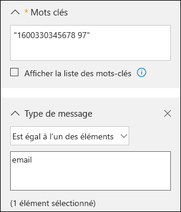

# <a name="office-365-data-subject-requests-for-the-gdpr"></a>Demandes des personnes concernées pour Office 365 concernant le RGPD

## <a name="introduction-to-dsrs"></a>Présentation des DPC

Le [Règlement général sur la protection des données de l’Union Européenne (RGPD)](https://ec.europa.eu/justice/data-protection/reform/index_en.htm) permet aux utilisateurs (désignés dans le règlement comme étant les *personnes concernées*) de gérer les données personnelles collectées par un employeur ou tout autre type d’agence ou organisation (le *contrôleur des données*ou le *contrôleur* uniquement). Les données personnelles sont définies de manière générale dans le cadre du RGPD comme correspondant aux données associées à une personne physique identifiée ou identifiable. Le RGPD octroie aux personnes concernées des droits spécifiques sur leurs données personnelles. Ces droits incluent l’obtention de copies des données, les demandes de modification de ces dernières, la restriction de leur traitement, leur suppression ou leur réception dans un format électronique afin de les transférer à un autre contrôleur. Toute demande formelle effectuée par une personne concernée à un contrôleur au sujet de la prise de mesure sur ses données personnelles est appelée *Demande des personnes concernées* ou DSR. Le contrôleur est obligé de prendre rapidement en compte chaque DSR et de fournir une réponse substantielle en prenant la mesure demandée ou en fournissant une explication s’il n’a pas la capacité de le faire. Un contrôleur doit consulter son conseiller juridique ou en matière de conformité à propos des dispositions appropriées pour toute DSR donnée.

Le guide explique comment utiliser les outils d’administration, les services et les produits Office 365 pour vous aider à rechercher et à traiter des données personnelles pour répondre à des DPC. Plus précisément, il explique comment rechercher, consulter et traiter des données personnelles stockées dans le cloud Microsoft. Voici un aperçu des processus décrits dans ce guide :

- **Découvrir** : utilisez les outils de recherche et de découverte pour rechercher plus facilement des données client qui peuvent être l’objet d’une DPC. Une fois que vous avez collecté les documents pouvant être utiles, vous pouvez effectuer une ou plusieurs des actions DPC décrites dans les étapes suivantes pour répondre à la demande. Par ailleurs, vous pouvez déterminer que la demande ne respecte pas les instructions de votre organisation pour répondre à des DPC.
- **Accéder :** récupérez des données à caractère personnel qui résident dans le cloud Microsoft et, si nécessaire, effectuez-en une copie pour la personne concernée.
- **Rectifier :** modifiez ou mettez en œuvre d’autres actions demandées sur les données à caractère personnel, le cas échéant.
- **Limiter :** limitez le traitement des données à caractère personnel, soit en supprimant des licences pour différents services Azure, soit en désactivant les services souhaités, lorsque cela est possible. Vous pouvez également supprimer des données du cloud Microsoft et les conserver localement ou ailleurs.
- **Supprimer :** supprimez définitivement des données à caractère personnel qui résidaient dans le cloud Microsoft.
- **Exporter :** fournissez une copie électronique (dans un format lisible par un ordinateur) des données à caractère personnel à la personne concernée.

### <a name="terminology"></a>Terminologie

Voici des définitions de termes du RGPD utilisés dans ce guide.

- **Entité de contrôle :** la personne physique ou morale, l’autorité publique, le service ou tout autre organisme qui, seul ou conjointement avec d’autres, détermine les finalités et les moyens du traitement des données à caractère personnel ; lorsque les finalités et les moyens du traitement sont déterminés par la législation de l’Union ou des États membres, le responsable du traitement peut être désigné, ou les critères spécifiques relatifs à sa nomination être définis, par la législation de l’Union ou des États membres.
- **Données personnelles et personne concernée par le traitement des données :** informations relatives à une personne physique identifiée ou identifiable (« la personne concernée par le traitement des données ») ; une personne physique identifiable est une personne qui peut être identifiée, directement ou indirectement, notamment par référence à un identificateur par exemple, un nom, un numéro d’identification, des données de localisation, un identificateur en ligne, ou un ou plusieurs facteurs spécifiques de l’identité physique, physiologique, génétique, mentale, économique, culturelle ou sociale de cette personne physique.
- **Sous-traitant de données :** la personne physique ou morale, l’autorité publique, le service ou tout autre organisme qui traite des données à caractère personnel pour le compte du responsable du traitement.
- **Données client :** toutes les données, y compris tous les fichiers texte, son, vidéo ou image et les logiciels qui ont été fournis à Microsoft par le client ou pour son compte dans le cadre du service d’entreprise. Les données client incluent à la fois les (1) informations d’identification personnelle des utilisateurs finaux (par exemple, les noms d’utilisateur et les informations de contact dans Azure Active Directory) et le contenu client chargé ou créé par un client dans des services spécifiques (par exemple, le contenu client dans un compte de stockage Azure, le contenu client d’une base de données Azure SQL ou l’image de la machine virtuelle d’un client dans des machines virtuelles Azure).
- **Journaux générés par le système :** journaux et données associées générés par Microsoft qui permettent à Microsoft de fournir des services d’entreprise aux utilisateurs. Les journaux générés par le système contiennent essentiellement des données pseudonymes, généralement un numéro généré par le système qui ne permet pas, en soi, d’identifier une personne individuelle, mais qui est utilisé pour fournir les services d’entreprise aux utilisateurs. Les journaux générés par le système peuvent également contenir des informations d’identification personnelle sur les utilisateurs finaux, telles qu’un nom d’utilisateur.

### <a name="how-to-use-this-guide"></a>Comment utiliser ce guide

Pour vous aider à trouver des informations pertinentes pour votre cas d’utilisation, ce guide est divisé en quatre parties.

- **[Partie 1: réponse aux DSR pour les données client](#part-1-responding-to-dsrs-for-customer-data):** *les données client* sont des données produites et stockées dans Office 365 dans le cadre des opérations quotidiennes de l’exécution de votre entreprise. Voici quelques exemples des applications Office 365 les plus fréquemment utilisées qui vous permettent de créer des données : Word, Excel, PowerPoint, Outlook et OneNote. Office 365 comprend également des applications telles que SharePoint Online, Teams et Forms qui vous permettent de mieux collaborer avec d’autres personnes. La première partie de ce guide explique comment découvrir, rectifier, supprimer et exporter des données à partir d’applications Office 365 qui ont été utilisées pour créer et stocker des données dans les services Online Office 365. Elle présente des produits et services pour lesquels Microsoft agit comme un processeur de données pour votre organisation, par conséquent, les fonctionnalités DSR sont mises à la disposition de l’administrateur de votre client.
- **[Partie 2: répondre au DSR par rapport aux informations générées par Office 365](#part-2-responding-to-dsrs-with-respect-to-insights-generated-by-office-365):** Office 365 fournit certaines informations via les services tels que Delve, MyAnalytics et Workplace Analytics. La manière dont ces informations sont générées et la manière de répondre aux DSRs qui y sont associés sont décrites dans la partie 2 de ce guide.
- **[Partie 3: répondre aux DSRS pour les journaux générés par le système](#part-3-responding-to-dsrs-for-system-generated-logs):** lorsque vous utilisez les services Office 365 pour les entreprises, Microsoft génère des informations, telles que les journaux de service, qui enregistrent l’utilisation ou les performances des fonctionnalités dans les services en ligne. La plupart des données générées par le service contiennent des identificateurs avec pseudonyme généré par Microsoft et cette catégorie est donc généralement désignée dans ce document comme des *journaux générés par le système*. Bien que ces données ne puissent pas être affectées à un sujet de données spécifique sans utiliser d’informations supplémentaires, certaines d’entre elles peuvent être considérées comme personnelles dans le cadre de la définition de RGPD pour les «données personnelles». La troisième partie de ce guide explique comment consulter, supprimer et exporter des journaux générés par le système.
- **[Partie 4 : Ressources supplémentaires pour vous aider avec des DPC](#part-4-additional-resources-to-assist-you-with-dsrs):** la partie 4 de ce guide répertorie les scénarios limités dans lesquels Microsoft est l’entité de contrôle des données lorsque certains produits et services Office 365 sont utilisés.

> [!NOTE]
> Dans la plupart des cas, lorsque les utilisateurs de votre organisation utilisent les produits et les services Microsoft Office 365, vous êtes l’entité de contrôle des données et Microsoft est le responsable de leur traitement. En tant qu’entité de contrôle des données, vous êtes tenu de répondre directement à la personne concernée par le traitement des données. Pour vous aider dans cette tâche, les parties 1 à 3 de ce guide expliquent le détail des fonctionnalités techniques disponibles pour votre organisation afin de répondre à une DPC. Cependant, dans certains cas de figure plus rares, Microsoft agit en qualité d’entité de contrôle des données lorsque les clients utilisent certains produits et services Office 365. Dans ce cas, les informations indiquées dans la partie 4 fournissent des instructions sur la manière dont les personnes concernées par le traitement des données peuvent envoyer des DPC à Microsoft.

### <a name="office-365-national-clouds"></a>Clouds nationaux Office 365

Les services Microsoft Office 365 sont également disponibles dans les environnements de cloud national suivants : [Office 365 Allemagne](https://support.office.com/article/learn-about-office-365-germany-8a5a4bbc-667a-4cac-8769-d8ac9015db4c), [Office 365 géré par 21Vianet (Chine)](https://support.office.com/article/Learn-about-Office-365-operated-by-21Vianet-A8AB5061-3346-4DA0-BB7C-5260822B53AE) et [Office 365 Secteur Public](https://technet.microsoft.com/library/mt774581.aspx). La plupart des instructions relatives à la gestion des demandes des personnes concernées décrites dans ce document s’applique à ces environnements de cloud national. Cependant, en raison de la nature isolée de ces environnements, il existe quelques exceptions. Quand il y a lieu pour une sous-section donnée, ces exceptions sont mises en évidence dans une note correspondante.

### <a name="hybrid-deployments"></a>Déploiements hybrides

Votre organisation Office 365 se compose peut-être d’offres Microsoft qui sont une association de services informatiques et de produits serveur locaux. En règle générale, un déploiement hybride correspond normalement au partage des comptes d’utilisateur (gestion des identités) et des ressources (par exemple, les boîtes aux lettres, les sites web et les données) figurant dans le cloud et en local. Voici les scénarios hybrides communs :

- Les déploiements Exchange hybrides, où certains utilisateurs ont des boîtes aux lettres locales et d’autres utilisateurs ont des boîtes aux lettres Exchange Online.
- Les déploiements SharePoint hybrides, où les serveurs de sites et de fichiers sont en local et les comptes OneDrive Entreprise sont dans Office 365.
- Le système local de gestion des identités (Active Directory) synchronisé avec Azure Activity Directory, correspondant au service d’annuaire sous-jacent dans Office 365.

Lorsque vous répondez à une demande de DSR, vous devez parfois déterminer si les données répondant à une demande de DSR figurent dans le cloud de Microsoft ou en local dans votre organisation, puis suivre la procédure appropriée pour répondre à la demande en question. Le guide sur les demandes des personnes concernées Office 365 fournit des instructions pour répondre aux données informatiques. Pour obtenir des instructions relatives aux données figurant en local dans votre organisation, consultez l’article [RGPD pour les serveurs Office locaux](https://docs.microsoft.com/Office365/Enterprise/gdpr-for-office-servers).

## <a name="part-1-responding-to-dsrs-for-customer-data"></a>Partie 1 : Répondre à des DPC pour les données client

Les instructions pour répondre aux DPC pour les données client sont divisées dans les quatre sections suivantes :

- [Utilisation de l’outil de recherche de contenu eDiscovery pour répondre aux DPC](#using-the-content-search-ediscovery-tool-to-respond-to-dsrs)
- [Utilisation des fonctionnalités intégrées à l’application pour répondre aux DSR](#using-in-app-functionality-to-respond-to-dsrs)
- [Réponse aux demandes de rectification de DSR](#responding-to-dsr-rectification-requests)
- [Réponse aux demandes de restriction de DSR](#responding-to-dsr-restriction-requests)

### <a name="how-to-determine-the-office-365-applications-that-may-be-in-scope-for-a-dsr-for-customer-data"></a>Comment identifier les applications Office 365 qu’il est possible d’utiliser pour une DPC pour les données client

Pour vous aider à déterminer où rechercher des données personnelles ou ce qu’il convient de rechercher, il est utile d’identifier les applications Office 365 que les membres de votre organisation peuvent utiliser pour créer et stocker des données dans Office 365. Le fait de savoir ceci permet d’identifier les applications Office 365 dans le cadre d’un DSR et vous permet de déterminer comment rechercher et accéder aux données personnelles relatives à un DSR. Plus précisément, cela signifie que vous pouvez utiliser l’outil recherche de contenu ou que vous devrez utiliser la fonctionnalité dans l’application de l’application dans laquelle les données ont été créées.

Une méthode rapide pour identifier les applications Office 365 que les membres de votre organisation utilisent pour créer des données client consiste à connaître les applications incluses dans l’abonnement Office 365 de votre organisation. Pour ce faire, vous pouvez accéder aux comptes d’utilisateurs dans le portail d’administration Office 365 et examiner les informations de licence du produit. Consultez la section [Attribuer des licences aux utilisateurs dans Office 365 pour les entreprises](https://docs.microsoft.com/office365/admin/subscriptions-and-billing/assign-licenses-to-users).

## <a name="using-the-content-search-ediscovery-tool-to-respond-to-dsrs"></a>Utilisation de l’outil de recherche de contenu eDiscovery pour répondre aux DSR

Lorsque vous recherchez des données personnelles dans l’ensemble de données le plus volumineux que votre organisation crée et stocke à l’aide d’Office 365, il convient peut-être d’abord de réfléchir aux applications les plus fréquemment utilisées pour créer les données que vous recherchez. Microsoft estime que plus de 90 % des données d’une organisation stockées dans Office 365 sont créées dans Word, Excel, PowerPoint, OneNote et Outlook. Les documents créés dans ces applications Office, même si ces applications ont été achetées avec Office 365 ProPlus ou une licence perpétuelle Office, sont généralement stockés sur un site SharePoint Online, sur un compte utilisateur OneDrive Entreprise ou dans la boîte aux lettres Exchange Online d’un utilisateur. Cela signifie que vous pouvez utiliser l’outil de recherche de contenu eDiscovery pour effectuer une recherche (et effectuer d’autres actions liées aux DPC) sur des sites SharePoint Online, des comptes OneDrive Entreprise et dans des boîtes aux lettres Exchange Online (y compris les sites et boîtes aux lettres associés aux Groupes Office 365, Microsoft Teams, Affectations EDU et StaffHub) pour rechercher des éléments dans des documents et des boîtes aux lettres qui peuvent être pertinents pour les DPC que vous étudiez. Vous pouvez également utiliser l’outil de recherche de contenu pour découvrir les données client créées dans d’autres applications Office 365.

Le tableau suivant répertorie les applications Office 365 que les personnes utilisent pour créer du Contenu créé par le client et qui peut être découvert à l’aide de la Recherche de contenu. Cette section du guide DSR fournit des instructions sur la découverte, l’accès, l’exportation et la suppression de données créées avec ces applications Office 365.

***Tableau 1 : Applications permettant l’utilisation de la recherche de contenu pour trouver des données client***

| | |
| :---: | :---:|
 <br> Calendrier |  <br> SharePoint  |
|  <br> Excel |  <br> Skype Entreprise |
|  <br> Office Lens |  <br> Tâches |
|  <br> OneDrive Entreprise | <br> Teams |
|  <br> OneNote|  <br> Action |
|  <br> Outlook/Exchange |  <br> Vidéo |
|  <br> Contacts |  <br> Visio |
|  <br> PowerPoint |  <br> Word
||

> [!NOTE]
> L’outil eDiscovery de recherche de contenu n’est pas disponible dans [Office 365 géré par 21Vianet (Chine)](https://support.office.com/article/Learn-about-Office-365-operated-by-21Vianet-A8AB5061-3346-4DA0-BB7C-5260822B53AE). Cela signifie que vous ne pouvez pas utiliser cet outil pour rechercher et exporter des données client dans les applications Office 365 indiquées dans le tableau 1. Toutefois, vous pouvez utiliser l’outil de découverte électronique inaltérable dans Exchange Online pour rechercher du contenu dans les boîtes aux lettres utilisateur. Vous pouvez également utiliser le centre eDiscovery dans SharePoint Online pour rechercher du contenu dans les sites SharePoint et les comptes OneDrive. Par ailleurs, vous pouvez demander au propriétaire du document de vous aider à rechercher, à modifier ou à supprimer du contenu, ou à l’exporter, le cas échéant. Pour obtenir plus d’informations, consultez les articles suivants :</br><br> • [Créer une recherche de découverte électronique inaltérable](https://technet.microsoft.com/library/dd353189(v=exchg.150).aspx)<br> • [Configurer un centre eDiscovery dans SharePoint Online](https://support.office.com/article/Set-up-an-eDiscovery-Center-in-SharePoint-Online-A18F8975-AA7F-43B4-A7D6-001D14744D8E)

### <a name="using-content-search-to-find-personal-data"></a>Utilisation de la recherche de contenu pour rechercher des données personnelles

La première étape pour répondre à un DPC consiste à trouver les données personnelles faisant l’objet de la demande. Cela consiste à utiliser les outils d’eDiscovery Office 365 pour rechercher des données personnelles (parmi toutes les données de votre organisation dans Office 365) ou accéder directement à l’application native dans laquelle les données ont été créées. Cette première étape, rechercher et réviser les données personnelles en cause, vous permet de déterminer si un DPC répond aux besoins de votre organisation en matière de respect ou de refus d’un DPC. Par exemple, après avoir trouvé et consulté les données personnelles en cause, vous pouvez déterminer si la demande ne respecte pas les exigences de votre organisation, car cela peut nuire aux droits et libertés d’autres personnes ou parce que les données personnelles figurent dans un dossier professionnel que votre organisation souhaite conserver pour des raisons professionnelles.

Comme indiqué précédemment, Microsoft estime que plus de 90 % des données d’une organisation sont créées avec les applications Office, telles que Word et Excel. Cela signifie que vous pouvez utiliser la recherche de contenu dans le Centre de sécurité et conformité pour rechercher la plupart des données liées aux DPC.

Ce guide part du principe que vous ou la personne recherchant des données personnelles pouvant répondre à une demande de DSR êtes familiarisés avec l’outil de recherche de contenu dans le Centre de sécurité et conformité ou savez vous en servir. Pour obtenir des instructions générales sur l’utilisation de la recherche de contenu, consultez l’article [Recherche de contenu dans Office 365](https://support.office.com/article/content-search-in-office-365-53390468-eec6-45cb-b6cd-7511f9c909e4). Veillez à ce que la personne qui lance les recherches ait reçu les autorisations nécessaires dans le Centre de sécurité et conformité. Cette personne doit être ajoutée en tant que membre du groupe de rôles de gestionnaire eDiscovery dans le Centre de sécurité et conformité Office 365 ; consultez l’article [Attribuer des autorisations eDiscovery dans le centre de sécurité et conformité Office 365](https://support.office.com/article/Assign-eDiscovery-permissions-in-the-Office-365-Security-Compliance-Center-5b9a067b-9d2e-4aa5-bb33-99d8c0d0b5d7). Songez à ajouter d’autres personnes dans votre organisation qui sont concernées par l’examen de DSR au groupe de rôles de gestionnaire eDiscovery afin qu’elles puissent effectuer les actions nécessaires dans l’outil de recherche de contenu telles que la consultation préalable et l’exportation des résultats de recherche. Toutefois, sauf si vous définissez des limites de conformité (comme décrit [ici](#set-up-compliance-boundaries-to-limit-the-scope-of-content-searches)), n’oubliez pas qu’un gestionnaire eDiscovery peut effectuer des recherches dans tous les emplacements de contenu de votre organisation, y compris ceux qui ne sont pas liés à l’examen d’une DSR.

Une fois que vous avez trouvé les données, vous pouvez ensuite effectuer l’action spécifique pour satisfaire la demande par la personne concernée.

> [!NOTE]
> Dans Office 365 Allemagne, le Centre de sécurité et conformité se trouve à l’adresse https://protection.office.de.

#### <a name="searching-content-locations"></a>Recherche d’emplacements de contenu

Vous pouvez rechercher les types d’emplacements de contenu suivants avec l’outil de recherche de contenu :

- Boîtes aux lettres Exchange Online. Cela inclut les boîtes aux lettres liées aux Groupes Office 365 et Microsoft Teams
- Dossiers publics Exchange Online
- Sites SharePoint Online. Cela inclut les sites liées aux Groupes Office 365 et Microsoft Teams
- Les comptes OneDrive Entreprise

> [!NOTE]
> Ce guide part du principe que toutes les données susceptibles d’être pertinentes pour l’examen d’une DSR sont stockées dans Office 365. En d’autres termes, stockées dans le cloud Microsoft. Les données stockées sur l’ordinateur local d’un utilisateur ou en local sur les serveurs de fichiers de votre organisation ne rentrent pas dans le champ d’application de l’examen d’une DSR pour les données stockées dans Office 365. Pour obtenir des instructions expliquant comment répondre à des demandes de DSR pour les données contenues dans des organisations locales, consultez l’article [RGPD pour les serveurs Office locaux](https://docs.microsoft.com/Office365/Enterprise/gdpr-for-office-servers).

#### <a name="tips-for-searching-content-locations"></a>Conseils de recherche d’emplacements de contenu

- Commencez par rechercher tous les emplacements de contenu de votre organisation (que vous pouvez rechercher en effectuant une seule recherche) pour identifier rapidement les emplacements de contenu qui contiennent les éléments correspondant à votre requête de recherche. Vous pouvez ensuite relancer la recherche et limiter l’étendue de recherche aux emplacements précis qui contiennent les éléments pertinents.
- Utilisez les statistiques de recherche pour identifier les principaux emplacements qui contiennent les éléments correspondant à votre requête de recherche. Consultez l’article [Afficher les statistiques de mot clé pour les résultats de recherche de contenu](https://support.office.com/article/View-keyword-statistics-for-Content-Search-results-9701a024-c52e-43f0-b545-9a53478aec04).
- Effectuez une recherche dans le journal d’audit Office 365 pour les activités récentes des fichiers et dossiers effectués par l’utilisateur qui fait l’objet du DSR. La recherche dans le journal d’audit renvoie la liste des dossiers d’audit qui contiennent le nom et l’emplacement des ressources avec lesquelles l’utilisateur a récemment interagit. Vous pourrez peut-être utiliser ces informations pour créer une requête de recherche de contenu. Voir[Effectuer des recherches dans le journal d’audit depuis le Centre de sécurité et conformité Office 365](https://support.office.com/article/Search-the-audit-log-in-the-Office-365-Security-Compliance-Center-0d4d0f35-390b-4518-800e-0c7ec95e946c).

#### <a name="building-search-queries-to-find-personal-data"></a>Création des requêtes de recherche pour trouver des données personnelles

Le DSR sur lequel vous enquêtez contient probablement des identificateurs que vous pouvez utiliser dans la requête de recherche par mot clé pour rechercher les données personnelles. Voici quelques identificateurs courants qui peuvent être utilisés dans une requête de recherche pour trouver des données personnelles :

- Adresse e-mail ou alias
- Numéro de téléphone
- Adresse postale
- Numéro d’identification d’employé
- Numéro d’identification national ou version membre de l’UE d’un numéro de sécurité sociale

La DPC que vous examinez comporte probablement un identificateur et d’autres informations sur les données personnelles concernant la demande que vous pouvez utiliser dans une requête de recherche.

La recherche d’une adresse de courrier ou d’un ID d’employé peut probablement renvoyer plusieurs résultats. Pour limiter l’étendue de votre recherche afin qu’elle renvoie le contenu le plus pertinent au DSR, vous pouvez ajouter des conditions à la requête de recherche. Lorsque vous ajoutez une condition, le mot clé et une condition de recherche sont connectés logiquement par**ET** l’opérateur booléen. Cela signifie que seuls les éléments qui correspondent *à la fois* au mot clé et la condition sont renvoyés dans les résultats de la recherche.

Le tableau suivant répertorie certaines conditions que vous pouvez utiliser pour limiter l’étendue d’une recherche. Le tableau répertorie également les valeurs que vous pouvez utiliser pour chaque condition afin de rechercher des types de documents spécifiques et des éléments de boîte aux lettres.

***Tableau 2 : limiter l’étendue de recherche en utilisant des conditions***

||||
| :--- | :--- |:--- |
|**Condition**|**Description** |**Exemple de valeurs de condition**|
| Type de fichier | Extension d’un document ou d’un fichier. Utilisez cette condition pour rechercher des documents Office et des fichiers créés par les applications Office 365. Utilisez cette condition pour rechercher des documents sur des sites SharePoint Online et des comptes OneDrive Entreprise.<br/>Notez que la propriété du document correspondante est filetype. <br/>Pour obtenir une liste complète des extensions de fichiers que vous pouvez rechercher, consultez l’article relatif aux extensions de nom de fichier analysées par défaut et types de fichiers étudiés dans SharePointhttps://technet.microsoft.com/library/jj219530.aspx).|&nbsp;&bull;&nbsp;&nbsp;csv : recherches de fichiers de valeurs séparées par virgule (CSV) ; les fichiers Excel peuvent être enregistrés au format CSV et le fichier CSV peut facilement être importé dans Excel<br><br>&bull;&nbsp;&nbsp;docx : recherches de fichiers Word <br><br>&bull;&nbsp;&nbsp;mpp : recherches de fichiers Project<br/><br>&bull;&nbsp;&nbsp;one : recherches de fichiers OneNote <br><br>&bull;&nbsp;&nbsp;pdf : recherches de fichiers enregistrés au format PDF <br><br>&bull;&nbsp;&nbsp;pptx : recherches de fichiers PowerPoint <br><br>&bull;&nbsp;&nbsp;xlxs : recherches de fichiers Excel <br><br>&bull;&nbsp;&nbsp;vsd : recherches de fichiers Visio <br><br>&bull;&nbsp;&nbsp;wmv : recherches de fichiers vidéo Windows Media <br>|
| Type de message | Type de message à rechercher. Utilisez cette condition pour effectuer des recherches dans les boîtes aux lettres de contacts (contacts), de tâches de réunions (calendrier) ou de conversations Skype Entreprise. La propriété de courrier correspondante est*Type*.|&bull;&nbsp;&nbsp;*contacts : recherches dans la liste Mes contacts (Contacts) d’un message de<br><br>&bull;&nbsp;&nbsp;* boîte aux lettres : Recherches messages <br><br>&bull;&nbsp;&nbsp;*messagerie instantanée : recherche des conversations Skype Entreprise<br>&bull;<br>&nbsp;&nbsp;* réunions : recherches de rendez-vous et de demandes de réunion (calendrier) <br><br>&bull;&nbsp;&nbsp;*tâches : recherches dans la liste Mes tâches (Tâches) ; utiliser cette valeur permet également de renvoyer des tâches créées dans Microsoft To-Do.<br>|
| Balise de conformité |L’étiquette affectée à un message électronique ou à un document. Les étiquettes sont utilisées pour classer les e-mails et les documents dans le cadre de la gouvernance des données et pour appliquer des règles de rétention basées sur la classification définie par l’étiquette. Utilisez cette condition pour rechercher des éléments auxquels une étiquette a été manuellement ou automatiquement affectée.<br/>Il s’agit d’une condition utile pour examiner des DSR, car votre organisation utilise peut-être des étiquettes pour classer du contenu relatif à la confidentialité des données ou qui contient des données personnelles ou des informations sensibles. Consultez la section « Recherche de contenu pour trouver tous les éléments portant une étiquette spécifique » dans [Vue d’ensemble des étiquettes dans Office 365.](https://support.office.com/article/overview-of-labels-af398293-c69d-465e-a249-d74561552d30)|compliancetag="personal data"|
||||

Il existe de nombreuses autres propriétés de messagerie et de document et des conditions de recherche que vous pouvez utiliser pour créer des requêtes de recherche plus complexes. Consultez les sections suivantes dans la rubrique d’aide [Requêtes par mots clés et conditions de recherche pour la recherche de contenu](https://support.office.com/article/Keyword-queries-and-search-conditions-for-Content-Search-c4639c2e-7223-4302-8e0d-b6e10f1c3be3) pour obtenir plus d’informations.

- [Propriétés de messagerie utilisables dans une requête](https://support.office.com/article/Keyword-queries-and-search-conditions-for-Content-Search-c4639c2e-7223-4302-8e0d-b6e10f1c3be3)
- [Propriétés de site (document) utilisables dans une requête](https://support.office.com/article/Keyword-queries-and-search-conditions-for-Content-Search-c4639c2e-7223-4302-8e0d-b6e10f1c3be3)
- [Conditions de recherche](https://support.office.com/article/Keyword-queries-and-search-conditions-for-Content-Search-c4639c2e-7223-4302-8e0d-b6e10f1c3be3)

#### <a name="searching-for-personal-data-in-sharepoint-lists-discussions-and-forms"></a>Recherche de données personnelles dans des listes, des discussions et des formulaires SharePoint

En plus de rechercher des données personnelles dans des documents, vous pouvez également utiliser la recherche de contenu pour rechercher d’autres types de données créées à l’aide des applications SharePoint Online natives. Cela inclut les données créées à l’aide de listes, de discussions et de formulaires SharePoint. Lorsque vous lancez une recherche de contenu et consultez des sites SharePoint Online (ou des comptes OneDrive Entreprise), des données provenant de listes, de discussions et de formulaires qui répondent aux critères de recherche seront renvoyées dans les résultats de recherche.

##### <a name="examples-of-search-queries"></a>Exemples de requêtes de recherche

Voici quelques exemples d’interrogations de recherche qui utilisent des mots clés et des conditions pour rechercher des données personnelles en réponse à un DSR. Les exemples illustrent deux versions de la requête : l’une montrant la syntaxe du mot clé (où la condition est incluse dans la zone de mot clé), l’autre affichant la version basée sur l’interface utilisateur de la requête avec des conditions.

##### <a name="example-1"></a>Exemple 1

Cet exemple renvoie les fichiers Excel situés sur des sites SharePoint Online et des comptes OneDrive Entreprise qui contiennent l’adresse de messagerie spécifiée. Des fichiers peuvent être renvoyés si l’adresse de messagerie apparaît dans les métadonnées de fichier.

***Syntaxe de mot clé***

```
pilar@contoso.com AND filetype="xlxs"
```

***Interface utilisateur graphique***


##### <a name="example-2"></a>Exemple 2

Cet exemple renvoie les fichiers Excel ou Word situés sur des sites SharePoint Online et des comptes OneDrive Entreprise qui contiennent l’ID ou la date de naissance de l’employé spécifié.

(98765 OR "01-20-1990") AND (filetype="xlxs" OR filetype="docx")

***Interface utilisateur graphique***


##### <a name="example-3"></a>Exemple 3

Cet exemple renvoie les messages électroniques qui contiennent le numéros d’identification spécifié, c’est-à-dire un numéro de sécurité sociale français (INSEE)

```
"1600330345678 97" AND kind="email"
```

***Interface utilisateur graphique***



#### <a name="working-with-partially-indexed-items-in-content-search"></a>Utilisation des éléments partiellement indexés dans la recherche de contenu

Les éléments partiellement indexés (également appelés *éléments non indexés*) sont des éléments de boîte aux lettres et des documents Exchange Online sur des sites SharePoint Online et OneDrive Entreprise qui, pour une raison quelconque, n’ont pas été indexés pour la recherche, ce qui signifie qu’ils ne sont pas accessibles à l’aide de la recherche de contenu. La plupart des courriers électroniques et des documents de site sont indexés parce qu’ils sont inclus dans les[limites d’indexation pour Office 365](https://support.office.com/article/limits-for-content-search-in-the-office-365-security-compliance-center-78fe3147-1979-4c41-83bb-aeccf244368d??). Les raisons pour lesquelles des courriers électroniques ou des fichiers ne sont pas indexés pour la recherche sont les suivantes :

- Le type de fichier n’est pas[pris en charge ou est désactivé pour l’indexation](https://support.office.com/article/partially-indexed-items-in-content-search-in-office-365-d1691de4-ca0d-446f-a0d0-373a4fc8487b??). Le type de fichier est parfois pris en charge pour l'indexation, mais une erreur d'indexation s'est produite pour un fichier spécifique.
- Les messages électroniques ont un fichier joint sans gestionnaire valide, tel que le fichier image (c’est la cause la plus courante d’éléments de messagerie partiellement indexés)
- Les fichiers joints aux messages électroniques sont trop volumineux ou il y a trop de fichiers joints

Nous vous recommandons de vous renseigner sur les éléments partiellement indexés afin que vous puissiez les utiliser lorsque vous répondez à des demandes de DSR. Pour obtenir plus d’informations, consultez les articles suivants :

- [Éléments partiellement indexés dans la recherche de contenu dans Office 365](https://support.office.com/article/partially-indexed-items-in-content-search-in-office-365-d1691de4-ca0d-446f-a0d0-373a4fc8487b??)
- [Examen d’éléments partiellement indexés dans eDiscovery Office 365](https://support.office.com/article/investigating-partially-indexed-items-in-office-365-ediscovery-4e8ff113-6361-41e2-915a-6338a7e2a1ed)
- [L’exportation d’éléments non indexés](https://support.office.com/article/Export-Content-Search-results-from-the-Office-365-Security-Compliance-Center-ed48d448-3714-4c42-85f5-10f75f6a4278#unidexeditems)

#### <a name="tips-for-working-with-partially-indexed-items"></a>Conseils pour utiliser des éléments partiellement indexés

Il est possible que les données répondant à l’examen d’une DPC se trouvent dans un élément partiellement indexé. Voici quelques suggestions permettant d’utiliser les éléments partiellement indexés :

- Une fois que vous avez effectué une recherche, le nombre d’éléments partiellement estimés s’affiche dans les statistiques de recherche. Cette estimation n’inclut pas les éléments partiellement indexés dans SharePoint Online et OneDrive Entreprise. Exportez les rapports pour une recherche de contenu pour obtenir des informations sur les éléments partiellement indexés. Le rapport **éléments non indexés.csv** contient des informations sur les éléments non indexés, y compris l’emplacement de l’élément, l’URL si l’élément est dans SharePoint Online ou OneDrive Entreprise, et la ligne d’objet (pour les messages) ou le nom du document. Pour plus d’informations, voir [Exporter des résultats de recherche](https://support.office.com/article/Export-a-Content-Search-report-5c8c1db6-d8ac-4dbb-8a7a-f65d452169b9).

- Les statistiques et la liste d’éléments partiellement indexés renvoyés avec les résultats d’une recherche de contenu sont tous les éléments partiellement indexés à partir d’emplacements de contenu consultés.

- Pour récupérer les éléments partiellement indexés pouvant répondre à l’examen d’une DPC, vous pouvez effectuer l’une des actions suivantes :

##### <a name="export-all-partially-indexed-items"></a>Exporter tous les éléments partiellement indexés

Vous exportez les résultats d’une recherche de contenu et les éléments partiellement indexés à partir de l’emplacement de contenu qui a fait l’objet d’une recherche. Vous pouvez également exporter uniquement les éléments partiellement indexés. Vous pouvez ensuite les ouvrir dans leur application native et examiner le contenu. Vous devez utiliser cette option pour exporter des éléments à partir de SharePoint Online et OneDrive Entreprise. Reportez-vous à la rubrique relative à [l’exportation des résultats de la recherche de contenu du Centre de sécurité et de conformité Office 365](https://support.office.com/article/Export-Content-Search-results-from-the-Office-365-Security-Compliance-Center-ed48d448-3714-4c42-85f5-10f75f6a4278).

##### <a name="export-a-specific-set-of-partially-indexed-items-from-mailboxes"></a>Exporter un ensemble spécifique d’éléments partiellement indexés à partir des boîtes aux lettres

Au lieu d’exporter tous les éléments de boîte aux lettres partiellement indexés à partir d’une recherche, vous pouvez réexécuter une recherche de contenu pour rechercher une liste spécifique d’éléments partiellement indexés, puis les exporter. Vous pouvez effectuer cette opération uniquement pour les éléments de boîte aux lettres. Voir[Préparer un fichier CSV pour une recherche de contenu ciblée dans Office 365](https://support.office.com/article/prepare-a-csv-file-for-a-targeted-content-search-in-office-365-82c97bb4-2b64-4edc-804d-cedbda525d22).

### <a name="next-steps"></a>Étapes suivantes

Une fois que vous avez trouvé les données personnelles relatives au DSR, assurez-vous de conserver la recherche de contenu spécifique que vous avez utilisée pour rechercher les données. Vous pourrez utiliser cette recherche pour effectuer d’autres étapes du processus de réponse DSR, par exemple [pour en obtenir une copie](#providing-a-copy-of-personal-data), [l’exporter](#exporting-personal-data)ou [la supprimer définitivement](#deleting-personal-data).

### <a name="additional-considerations-for-selected-applications"></a>Considérations supplémentaires pour les applications sélectionnées

Les sections suivantes décrivent les choses à garder à l’esprit lorsque vous recherchez des données dans les applications Office 365 suivantes :

- [Office Lens](#office-lens)
- [OneDrive Entreprise et Paramètres d’expérience SharePoint](#onedrive-for-business-and-sharepoint-online-experience-settings)
- [Microsoft Teams pour l’éducation](#microsoft-teams-for-education)
- [Microsoft To-Do](#microsoft-to-do)
- [Skype Entreprise](#skype-for-business)

#### <a name="office-lens"></a>Office Lens

Une personne qui utilise Office Lens (une application caméra prise en charge par les appareils exécutant iOS, Android et Windows) peut prendre une photo de tableaux blancs, de documents papier, de cartes de visite et d’autres éléments qui contiennent beaucoup de texte. Office Lens utilise une technologie de reconnaissance optique des caractères qui extrait le texte d’une image et l’enregistre dans un document Office tel qu’un Word, PowerPoint et OneNote, ou un fichier PDF. Les utilisateurs peuvent alors télécharger le fichier qui contient le texte de l’image vers leur compte OneDrive Entreprise dans Office 365. Vous pouvez ainsi utiliser l’outil recherche de contenu pour rechercher, consulter, supprimer et exporter des données dans des fichiers créés à partir d’une image d’Office Lens. Pour plus d’informations sur Office Lens, voir :

- [Office Lens pour iOS](https://support.office.com/article/Office-Lens-for-iOS-fbdca5f4-1b1b-4391-a931-dc1c2582397b)
- [Office Lens pour Android](https://support.office.com/article/Office-Lens-for-Android-ec124207-0049-4201-afaf-b5874a8e6f2b)
- [Office Lens pour Windows](https://support.office.com/article/Office-Lens-for-Windows-577ec09d-8da2-4029-8bb7-12f8114f472a)

#### <a name="onedrive-for-business-and-sharepoint-online-experience-settings"></a>OneDrive Entreprise et Paramètres d’expérience SharePoint Online

En plus des fichiers créés par l’utilisateur stockés sur les comptes OneDrive Entreprise et les sites SharePoint Online, ces services stockent des informations concernant l’utilisateur qui sont utilisées pour permettre différentes expériences. Les utilisateurs toujours présents dans votre organisation peuvent accéder à la majorité de ces informations en utilisant les fonctionnalités intégrées au produit. Les informations suivantes fournissent des instructions sur la façon de consulter, d’afficher et d’exporter des données d’application OneDrive Entreprise et SharePoint Online.

##### <a name="sharepoint-user-profiles"></a>Profils utilisateur SharePoint

Le Profil Delve de l’utilisateur permet aux utilisateurs de conserver les propriétés stockées dans le profil utilisateur SharePoint Online, y compris les anniversaires, les numéros de téléphone portable (et d’autres informations de contact), à propos de moi, des projets, des qualifications et des spécialisations, des établissements scolaires et de l’éducation, des centres d’intérêt et des loisirs.

###### <a name="end-users"></a>Utilisateurs finals

Les utilisateurs finals peuvent découvrir, consulter et rectifier les données de profil utilisateur SharePoint Online à l’aide de l’expérience de profil Delve. Consultez l’article [Afficher et mettre à jour votre profil dans Office Delve](https://support.office.com/article/view-and-update-your-profile-in-office-delve-4e84343b-eedf-45a1-aeb9-8627ccca14ba) pour obtenir plus d’informations.

Un autre moyen pour les utilisateurs de consulter leurs données de profil SharePoint est d’accéder à la **page Modifier le profil** dans leur compte OneDrive Entreprise, accessible en accédant au chemin d’accès **EditProfile.aspx** sous l’URL de compte OneDrive Entreprise.  Par exemple, le compte OneDrive Entreprise de l’utilisateur <strong>user1@contoso.com</strong> se trouve à l’emplacement suivant :

```
`https://contoso-my.sharepoint.com/personal/user1\_contoso\_com/\_layouts/15/OneDrive.aspx`
```

L’URL de la page Modifier le profil serait la suivante :

```
`https://contoso-my.sharepoint.com/personal/user1\_contoso\_com/\_layouts/15/EditProfile.aspx`
```

Les propriétés provenant d’Azure Active Directory ne peuvent pas être modifiées dans SharePoint Online. Toutefois, les utilisateurs peuvent accéder à leur page**Compte** en sélectionnant leur** photo** dans l’en-tête Office 365,puis en sélectionnant **mon compte**. Le fait de modifier les propriétés ici peut obliger les utilisateurs à travailler avec leurs administrateurs pour découvrir, consulter ou rectifier une propriété de profil utilisateur.

###### <a name="admins"></a>Administrateurs

Un administrateur peut accéder aux propriétés de profil et les rectifier dans le centre d’administration SharePoint. Dans le **Centre d’administration SharePoint**, cliquez sur l' onglet **Profils utilisateur**, cliquez sur**gérer les profils utilisateur**, entrez le nom d’un utilisateur, puis cliquez sur **Rechercher**. L’administrateur peut cliquer avec le bouton droit sur n' importe quel utilisateur et sélectionner **Modifier mon profil**. Les propriétés provenant d’Azure Active Directory ne peuvent pas être modifiées dans SharePoint Online.

Un administrateur peut exporter toutes les propriétés de profil utilisateur d’un utilisateur à l’aide de la cmdlet **Export-SPOUserProfile** dans SharePoint Online PowerShell. Consultez l’article [Export-SPOUserProfile](https://docs.microsoft.com/powershell/module/sharepoint-online/export-spouserprofile?view=sharepoint-ps).

Pour obtenir plus d’informations sur les profils utilisateur, consultez l’article [Gérer les profils utilisateur dans le Centre d’administration SharePoint](https://support.office.com/article/Manage-user-profiles-in-the-SharePoint-admin-center-494bec9c-6654-41f0-920f-f7f937ea9723).

##### <a name="user-information-list-on-sharepoint-online-sites"></a>Liste d’informations utilisateur sur des sites SharePoint Online

Un sous-ensemble du profil utilisateur SharePoint d’un utilisateur est synchronisé avec la liste d’informations utilisateur de tous les sites visités ou dont il dispose des autorisations d’accès. Ceci est utilisé par les expériences SharePoint Online, telles que les colonnes contacts dans les bibliothèques de documents, pour afficher des informations de base sur l’utilisateur, telles que le nom du créateur d’un document. Les données d’une liste d’informations utilisateur correspondent aux informations stockées dans le profil de l’utilisateur SharePoint et sont automatiquement corrigées en cas de modification de la source. Pour les utilisateurs supprimés, ces données restent dans les sites avec lesquels ils interagissent pour l’intégrité référentielle des champs de colonne SharePoint. 

Les administrateurs peuvent contrôler les propriétés réplicables au sein du Centre d’administration SharePoint. Pour ce faire, procédez comme suit :

1. Accédez à **Centre d’administration SharePoint** et cliquez sur l’onglet **Profils utilisateur**.
2. Cliquez sur **Gérer les propriétés utilisateur** pour obtenir la liste des propriétés.
3. Faites un clic droit sur une propriété, sélectionnez **Modifier** et modifiez les différents paramètres.
4. En vertu des **Paramètres de stratégie**, la propriété réplicable contrôle l’affichage de la propriété dans la liste d’informations utilisateur.  Notez que les propriétés ne permettent pas toutes d’effectuer cette modification.

Un administrateur peut exporter toutes les propriétés des informations utilisateur d’un utilisateur sur un site donné à l’aide de la cmdlet **Export-SPOUserInfo** dans SharePoint Online PowerShell. Consultez l’article [Export-SPOUserInfo](https://docs.microsoft.com/powershell/module/sharepoint-online/export-spouserinfo?view=sharepoint-ps).

##### <a name="onedrive-for-business-experience-settings"></a>Paramètres d’expérience OneDrive Entreprise

L’interface OneDrive Entreprise d’un utilisateur stocke des informations pour l’aider à trouver et à parcourir le contenu qu’il recherche. La plupart de ces informations sont accessibles aux utilisateurs finaux via les fonctionnalités intégrées au produit. Un administrateur peut exporter des informations à l’aide d’un script [PowerShell](https://docs.microsoft.com/powershell/scripting/powershell-scripting?view=powershell-6) et des commandes du [modèle objet côté client SharePoint (CSOM)](https://docs.microsoft.com/sharepoint/dev/sp-add-ins/complete-basic-operations-using-sharepoint-client-library-code).

Consultez l’article [Exportation des paramètres d’expérience OneDrive Entreprise](https://docs.microsoft.com/sharepoint/export-odfb-lists) pour obtenir plus d’informations sur les paramètres, leur stockage et leur exportation.

##### <a name="onedrive-for-business-and-sharepoint-online-search"></a>Recherche OneDrive Entreprise et SharePoint Online

L’expérience de recherche intégrée à l’application dans OneDrive Entreprise et SharePoint Online stocke les requêtes de recherche d’un utilisateur pendant 30 jours afin d’augmenter la pertinence des résultats de recherche. Un administrateur peut exporter des requêtes de recherche pour un utilisateur à l’aide de la cmdlet **Export-SPOQueryLogs** dans SharePoint Online PowerShell. Consultez l’article [Export-SPOQueryLogs](https://docs.microsoft.com/powershell/module/sharepoint-online/export-spoquerylogs?view=sharepoint-ps).

#### <a name="microsoft-teams-for-education"></a>Microsoft Teams pour l’éducation

Microsoft Teams pour l’éducation propose deux fonctionnalités de collaboration supplémentaires qui permettent aux enseignants et aux étudiants de créer et de stocker des données personnelles : Devoirs et bloc-notes OneNote pour la classe. Vous pouvez utiliser la recherche de contenu pour découvrir des données dans ces deux fonctionnalités.

##### <a name="assignments"></a>Affectations

Les fichiers des étudiants associés à un devoir sont stockés dans une bibliothèque de documents dans le site Microsoft Teams SharePoint Online correspondant. Les administrateurs informatiques peuvent utiliser l’outil recherche de contenu pour rechercher des fichiers d’étudiants liés aux devoirs. Par exemple, un administrateur peut effectuer une recherche dans tous les sites SharePoint Online de l’organisation et utiliser le nom et la classe de l’étudiant ou le nom d’un devoir dans la requête de recherche pour trouver des données pertinentes pour une DSR.

Voici d’autres données liées aux devoirs qui ne sont pas enregistrées dans le site SharePoint Online de l’équipe de la classe, ce qui signifie qu’elles ne sont pas détectables avec la recherche de contenu. Elles incluent :

- Fichiers que l’enseignant attribue aux étudiants dans le cadre du devoir
- Notes des étudiants et appréciations de l’enseignant
- Liste des documents envoyés par chaque étudiant pour un devoir
- Métadonnées des devoirs

Pour ce type de données, un administrateur informatique ou le propriétaire des données (par exemple, un enseignant) devra peut-être accéder à Devoir dans l’équipe de la classe pour trouver les données pertinentes pour une DSR.

##### <a name="onenote-class-notebook"></a>Bloc-notes OneNote pour la classe

Le bloc-notes OneNote pour la classe est stocké sur le site SharePoint Online de l’équipe de classe. Chaque étudiant d’une classe dispose d’un bloc-notes privé partagé avec l’enseignant. Il existe aussi une bibliothèque de contenu permettant à l’enseignant de partager des documents avec les étudiants, et un espace de collaboration pour tous les étudiants de la classe. Les données relatives à ces fonctionnalités sont accessibles à l’aide de la recherche de contenu.

Voici des instructions spécifiques pour rechercher un bloc-notes pour la classe :

1. Exécutez une recherche de contenu à l’aide des critères de recherche suivants :

   - Rechercher tous les sites SharePoint Online.

   - Inclure le nom de l’équipe de classe comme mot clé de recherche : par exemple, « 9C Biologie ».

2. Affichez un aperçu des résultats de la recherche et recherchez l’élément correspondant au bloc-notes pour la classe.
3. Sélectionnez cet élément, puis copiez le chemin d’accès du dossier qui s’affiche dans le volet d’informations. Il s’agit du dossier racine du bloc-notes pour la classe.
4. Modifiez la recherche créée à l’étape 1 et remplacez le nom de la classe dans la requête de mot clé par le chemin d’accès du dossier du bloc-notes OneNote pour la classe et faites précéder le chemin d’accès du dossier avec la propriété de site **path** ; par exemple, **path:<https://contosoedu.onmicrosoft.com/sites/9C> Biologie/Éléments de site/Bloc-notes 9C Biologie/**. N’oubliez pas d’inclure les guillemets et la barre oblique de fin.
5. Ajouter une condition de recherche et sélectionner la condition type de fichier et en utiliser une pour la valeur du type de fichier. Cette opération renvoie tous les fichiers OneNote figurant dans les résultats de la recherche. La syntaxe des mots clés résultants ressemblerait à ce qui suit :[](#building-search-queries-to-find-personal-data)
    ```
   path:"<https://contosoedu.onmicrosoft.com/sites/9C> Biology/SiteAssets/9C Biology Notebook/" AND filetype="one"
   ```
6.  Relancez la recherche de contenu. Les résultats de la recherche doivent inclure tous les fichiers OneNote du bloc-notes pour la classe de l’équipe de classe.

#### <a name="microsoft-to-do"></a>Microsoft To-Do

Les *tâches* (sauvegardées dans les *listes de tâches*) dans Microsoft To-Do sont sauvegardées en tant que tâches dans la boîte aux lettres Exchange Online d’un utilisateur. Cela signifie que vous pouvez utiliser l’outil de recherche de contenu pour rechercher, consulter, supprimer et exporter des tâches. Pour plus d’informations, consultez [Configurer Microsoft To-Do](https://support.office.com/article/Set-up-Microsoft-To-Do-490c1a8c-2333-4952-8125-841afadb9620).

#### <a name="skype-for-business"></a>Skype Entreprise

Voici quelques informations supplémentaires expliquant comment consulter, afficher et exporter des données personnelles dans Skype Entreprise.

- Les fichiers joints à une réunion sont conservés dans la réunion en question pendant 180 jours, puis ils deviennent inaccessibles. Pour accéder à ces fichiers, les participants de la réunion doivent accepter la demande de réunion, puis afficher ou télécharger le fichier joint. Consultez la section « Utilisation des pièces jointes dans la réunion » dans [Préchargement des pièces jointes pour une réunion Skype Entreprise](https://support.office.com/article/preload-attachments-for-a-skype-for-business-meeting-fd3d9f9d-b448-4754-b813-02e49393f251).
- Les conversations dans Skype Entreprise sont conservées dans le dossier Historique des conversations dans les boîtes aux lettres utilisateur. Vous pouvez utiliser la recherche de contenu pour rechercher des données de conversations Skype dans les boîtes aux lettres.
- Une personne concernée peut exporter ses contacts dans Skype Entreprise. Pour ce faire, elle doit cliquer avec le bouton droit sur un groupe de contacts dans Skype Entreprise et cliquer sur **Copier**. Ensuite, elle peut coller la liste d’adresses e-mail dans un document texte ou Word.
- Si la boîte aux lettres Exchange Online d’un participant à une réunion est placée en conservation pour litige ou attribuée à une stratégie de rétention Office 365, les fichiers joints à cette réunion sont conservés dans la boîte aux lettres du participant. Vous pouvez utiliser la recherche de contenu pour rechercher ces fichiers dans la boîte aux lettres du participant si la période de rétention du fichier n’a pas expiré. Pour obtenir plus d’informations relatives à la conservation des fichiers, consultez l’article [Conserver des fichiers volumineux associés à une réunion](https://docs.microsoft.com/skypeforbusiness/set-up-policies-in-your-organization/retaining-large-files-attached-to-a-meeting).

## <a name="providing-a-copy-of-personal-data"></a>Fourniture d’une copie des données personnelles

Une fois que vous avez trouvé les données personnelles pouvant répondre à une DSR, vous et votre organisation devez décider quelles données fournir à la personne concernée. Par exemple, vous pouvez les fournir avec une copie du document en question, une version correctement rédigée ou une capture d’écran des parties que vous jugez approprié de partager. Pour chacune de ces réponses à une demande d’accès, vous devrez récupérer une copie du document ou de tout autre élément contenant les données pertinentes.

Lorsque vous fournissez une copie à la personne concernée, vous devrez peut-être supprimer ou modifier des informations personnelles sur d’autres personnes concernées et des informations confidentielles.

### <a name="using-content-search-to-get-a-copy-of-personal-data"></a>Utilisation de la recherche de contenu pour obtenir une copie des données personnelles

Il y a deux façons d’utiliser l’outil de recherche de contenu pour obtenir une copie d’un document ou d’un élément de boîte aux lettres trouvé après avoir lancé une recherche.

- Afficher un aperçu des résultats de la recherche, puis télécharger une copie du document ou de l’élément. C’est un bon moyen pour télécharger plusieurs éléments ou fichiers.
- Exportez les résultats de la recherche, puis téléchargez une copie de tous les éléments renvoyés par la recherche. Cette méthode est plus complexe, mais c’est un bon moyen de télécharger de nombreux éléments qui répondent au DSR. Des rapports utiles sont également inclus dans les résultats de la recherche. Vous pouvez utiliser ces rapports pour obtenir des informations supplémentaires sur chaque élément. Le rapport** résultats.csv** est utile, car il contient de nombreuses informations sur les éléments exportés, tels que l’emplacement exact de l’élément (par exemple, la boîte aux lettres pour les courriers électroniques ou l’URL de documents ou de listes dans les sites SharePoint Online et OneDrive Entreprise). Ces informations vous aident à identifier le propriétaire de l’élément, au cas où vous devriez le contacter pendant le processus d’enquête sur le DSR. Pour plus d’informations sur les rapports inclus lorsque vous exportez des résultats de recherche, voir [exporter un rapport de recherche de contenu](https://support.office.com/article/Export-a-Content-Search-report-5c8c1db6-d8ac-4dbb-8a7a-f65d452169b9).

#### <a name="preview-and-download-items"></a>Afficher un aperçu et télécharger des éléments

Une fois que vous avez effectué une nouvelle recherche ou ouvert une recherche existante, vous pouvez afficher un aperçu de chaque élément qui correspond à la requête de recherche pour vérifier qu’il est lié au DSR que vous recherchez. Cela inclut également les listes et pages Web SharePoint qui sont renvoyées dans les résultats de recherche. Vous pouvez également télécharger le fichier d’origine si vous devez le fournir à la personne concernée. Dans les deux cas, vous pouvez effectuer une capture d’écran pour répondre à la demande de l’objet de données d’obtenir les informations.

Certains types d’éléments ne peuvent pas être prévisualisés. Si l’affichage d’un élément ou d’un type de fichier n’est pas pris en charge, vous pouvez télécharger un élément individuel sur votre ordinateur local, un lecteur réseau mappé ou un autre emplacement réseau.  Vous pouvez afficher un aperçu uniquement des [types de fichiers pris en charge](https://support.office.com/article/content-search-in-office-365-53390468-eec6-45cb-b6cd-7511f9c909e4).

Pour afficher un aperçu et télécharger les éléments, procédez comme suit :

1. Ouvrez la recherche de contenu dans le Centre de conformité et sécurité.
2. Si les résultats ne sont pas affichés, cliquez sur **Afficher un aperçu des résultats**.
3. Cliquez sur un élément pour l’afficher.
4. Cliquez sur **Télécharger le fichier d’origine** pour télécharger l’élément sur votre ordinateur local. Vous devrez également télécharger les éléments qui ne peuvent pas être prévisualisés.

Pour obtenir plus d’informations sur l’aperçu des résultats de recherche, consultez l’article [Afficher un aperçu des résultats de recherche](https://support.office.com/article/content-search-in-office-365-53390468-eec6-45cb-b6cd-7511f9c909e4).

#### <a name="export-and-download-items"></a>Exporter et télécharger des éléments

Vous pouvez également exporter les résultats d’une recherche de contenu pour obtenir une copie des messages électroniques, des documents, des listes et des pages web contenant les données personnelles, même si cette méthode est plus complexe qu’afficher un aperçu des éléments. Consultez la section suivante pour obtenir plus d’informations sur l’[exportation de résultats d’une recherche de contenu](#export-and-download-content-using-content-search).

## <a name="exporting-personal-data"></a>Exportation de données personnelles

Le « droit à la portabilité des données » permet à la personne concernée par le traitement des données de demander une copie électronique des données personnelles dans un « format lisible par machine, fréquemment utilisé et structuré » et demander à votre organisation de transmettre ces fichiers électroniques à une autre entité de contrôle des données. Microsoft prend en charge ce droit de deux façons :

- Offre d’applications Office 365 qui enregistrent les données dans un format électronique natif, lisible par l’ordinateur. Pour plus d’informations sur les formats de fichiers Office, voir [formats de fichier Office-documents techniques](https://msdn.microsoft.com/library/office/cc313105(v=office.12).aspx).
- Permettre à votre organisation d’exporter les données au format de fichier natif ou dans un format (par exemple, CSV, TXT et JSON) qui peut être facilement importé dans une autre application.

Pour répondre à une demande d’exportation de DSR, vous pouvez exporter des documents Office dans leur format de fichier natif et exporter les données à partir d’autres applications Office 365.

### <a name="export-and-download-content-using-content-search"></a>Exporter et télécharger du contenu avec la recherche de contenu

Lorsque vous exportez les résultats d’une recherche de contenu, des éléments de messagerie peuvent être téléchargés sous forme de fichiers PST ou en tant que messages individuels (fichiers .msg). Lorsque vous exportez des documents et des listes à partir de sites SharePoint Online et OneDrive Entreprise, les copies existantes dans les formats de fichier natif sont exportées. Par exemple, des listes SharePoint sont exportées sous forme de fichiers CSV et des pages Web sont exportées sous forme de fichiers .aspx ou html.

> [!NOTE]
> Pour exporter des éléments de boîte aux lettres depuis la boîte aux lettres d’un utilisateur à l’aide de la recherche de contenu, l’utilisateur (à qui appartient la boîte aux lettres depuis laquelle vous exportez des éléments) se voit attribuer une licence Exchange Online Plan 2. 

Pour exporter et télécharger des éléments, procédez comme suit :

1. Ouvrez la recherche de contenu dans le Centre de conformité et sécurité.
2. Sur la page volante de recherche, cliquez sur  **Plus**, puis cliquez sur **Exporter les résultats**.  Vous pouvez également exporter un rapport.
3. Complétez les sections sur la page volante **Exporter les résultats**. Veillez à utiliser la barre de défilement pour afficher toutes les options d’exportation.
4. Revenez à la page de recherche de contenu dans le Centre de sécurité et conformité, puis cliquez sur l’onglet **Exporter**.
5. Cliquez sur **Actualiser** pour mettre à jour la page.
6. Sous la colonne**Nom**, cliquez sur la tâche d’exportation que vous avez créée. Le nom de la tâche d’exportation est le nom de la recherche de contenu ajoutée à **\_Exportation**.
7. Dans la page exporter, sous**exporter la clé**, cliquez sur **copier dans le presse-papiers**. Cette clé vous permet de télécharger les résultats de recherche à l’étape 10.
8. En haut de la page volante, cliquez sur  **Télécharger les résultats**.
9. Si vous êtes invité à installer l’**outil d’exportation de découverte électronique Microsoft Office 365**, cliquez sur **Installer**.
10. Dans l’**outil d’exportation de découverte électronique**, collez la clé d’exportation que vous avez copiée à l’étape 7 dans la zone appropriée.
11. Cliquez sur **Parcourir** pour spécifier l’emplacement de téléchargement du fichier des résultats de recherche.
12. Cliquez sur **Démarrer** pour télécharger les résultats de recherche sur votre ordinateur.

Une fois le processus d’exportation terminé, vous pouvez accéder aux fichiers dans l’emplacement de téléchargement sur votre ordinateur local. Les résultats d’une recherche de contenu sont téléchargés vers un dossier portant le nom de la recherche de contenu. Les documents provenant de sites sont copiés dans un sous-dossier nommé **SharePoint**. Les éléments de boîte aux lettres sont copiés vers un sous-dossier nommé **Exchange**.

Pour obtenir des instructions détaillées étape par étape, consultez l’article relatif à l’[exportation des résultats de la recherche de contenu du Centre de sécurité et conformité Office 365](https://support.office.com/article/Export-Content-Search-results-from-the-Office-365-Security-Compliance-Center-ed48d448-3714-4c42-85f5-10f75f6a4278).

### <a name="downloading-documents-and-lists-from-sharepoint-online-and-onedrive-for-business"></a>Téléchargement de documents et de listes à partir de SharePoint Online et OneDrive Entreprise

Une autre méthode pour exporter des données à partir de SharePoint Online et OneDrive Entreprise consiste à télécharger des documents et des listes directement à partir d’un site SharePoint Online ou d’un compte OneDrive Entreprise. Vous devrez obtenir les autorisations pour accéder à un site, puis accéder au site en question et télécharger le contenu. Consultez les articles suivants :

- [Télécharger des fichiers et dossiers à partir de OneDrive ou SharePoint](https://support.office.com/article/download-files-and-folders-from-onedrive-or-sharepoint-5c7397b7-19c7-4893-84fe-d02e8fa5df05)
- [Exporter vers Excel à partir de SharePoint](https://support.office.com/article/export-to-excel-from-sharepoint-bfb2ea48-6118-4fa9-abb6-cced9424e5d9)

Pour certaines requêtes d’exportation de DSR, il est préférable d’autoriser la personne concernée à télécharger le contenu elle-même. Cela lui permet d’accéder à un site ou à un dossier partagé SharePoint Online et de cliquer sur **Synchroniser** pour synchroniser tout le contenu de la bibliothèque de documents ou des dossiers sélectionnés. Consultez les articles suivants :

- [Permettre aux utilisateurs de synchroniser des fichiers SharePoint avec le nouveau client de synchronisation OneDrive](https://support.office.com/article/Enable-users-to-sync-SharePoint-files-with-the-new-OneDrive-sync-client-22e1f635-fb89-49e0-a176-edab26f69614)
- [Synchroniser des fichiers SharePoint avec le nouveau client de synchronisation OneDrive](https://support.office.com/article/sync-sharepoint-files-with-the-new-onedrive-sync-client-6de9ede8-5b6e-4503-80b2-6190f3354a88)

## <a name="deleting-personal-data"></a>Suppression de données personnelles

Le « droit à l’effacement » moyennant la suppression des données personnelles des données client d’une organisation est une protection essentielle du RGPD. La suppression des données personnelles inclut la suppression de documents ou de fichiers entiers ou la suppression de données spécifiques contenues dans un document ou un fichier (une action et un processus semblables à ceux décrits dans la section Rectifier de ce guide).

Voici quelques points importants à comprendre sur le fonctionnement de la suppression (et la rétention) de données dans Office 365 lorsque vous examinez des données personnelles ou que vous vous préparez à les supprimer en réponse à une DPC.

- **Suppression temporaire vs suppression définitive :** les services Office 365 tels que Exchange Online, SharePoint Online et OneDrive Entreprise intègrent le concept de *suppression temporaire* et *suppression définitive*, qui associe un élément supprimé à la récupération (généralement pour une période limitée) avant que celui-ci soit supprimé définitivement à partir du cloud Microsoft, sans possibilité de récupération. Dans ce contexte, un élément de menu supprimé peut être récupéré par un utilisateur et/ou un administrateur pour une durée limitée avant la suppression de son disque. Lorsqu’un élément a été supprimé définitivement, il a été marqué comme une suppression permanente et éliminé lorsqu’il est traité par le service Office 365 correspondant. Voici comment la suppression souple et la suppression de disque fonctionnent pour les éléments de boîtes aux lettres et les sites (que ce soit le propriétaire de données ou l’administrateur qui supprime un élément) :

    - **Boîtes aux lettres :** un élément est supprimé temporairement lorsqu’il est supprimé du dossier éléments supprimés ou lorsqu’un utilisateur supprime un élément en appuyant sur **MAJ + SUPPR**. Lorsque l’élément est supprimé temporairement, il est déplacé vers le dossier éléments récupérables dans la boîte aux lettres. À ce stade, l’élément peut être récupéré par l’utilisateur jusqu'à l’expiration de la période de rétention des éléments supprimés (dans Office 365, la période de rétention des éléments supprimés est de 14 jours, mais peut être accrue de 30 jours par un administrateur). Après expiration de la période de rétention, l’élément est supprimé définitivement et déplacé vers un dossier masqué (appelé le dossier*Purges*). L’élément est définitivement supprimé (ainsi effacé) d’Office 365 la prochaine fois que la boîte aux lettres est traitée ( les boîtes aux lettres sont traitées tous les 7 jours).

    - **SharePoint Online et sites OneDrive Entreprise**: lorsqu’un fichier ou un élément documenté est supprimé, il est déplacé vers la Corbeille du site (également appelé lz *première Corbeille* (qui revient à la Corbeille de Windows). L’élément restera dans la Corbeille pour 93 jours (la période de rétention d’élément supprimé pour les sites dans Office 365). Après cette période, l’élément est automatiquement déplacé vers la Corbeille pour la collection de sites, également appelée *la Corbeille second niveau*. (Notez que les utilisateurs ou les administrateurs--disposant des autorisations appropriées--peuvent également supprimer des éléments de la première Corbeille de Recyclage). À ce stade, l’élément devienne temporairement supprimé ; Il peut toujours être récupéré par un administrateur de collection de sites dans SharePoint Online ou par l’utilisateur ou administrateur dans OneDrive Entreprise). Lorsqu’un élément est supprimé de la Corbeille secondaire (manuellement ou automatiquement) il devient supprimé définitivement et n’est pas accessible par un utilisateur ou un administrateur. La période de rétention est de 93 jours pour les corbeilles de recyclage de première et de second niveau. Cela signifie que la rétention de la Corbeille de second niveau démarre lorsque l’élément est d’abord supprimé. Par conséquent, la durée de conservation maximale total est de 93 jours pour les deux corbeilles.

> [!NOTE]
> Comprendre les actions qui entraînent la suppression réversible ou définitive d’un élément vous aide à déterminer comment supprimer des données de manière à répondre aux exigences du RGPD lorsque vous répondez à une demande de suppression.

- **Stratégies de conservation et de conservation juridiques :** dans Office 365, une « conservation » peut être placée dans des boîtes aux lettres et des sites. En bref, cela signifie qu’aucun élément n’est définitivement supprimé (suppression définitive) si une boîte aux lettres ou un site est suspendu, jusqu’à la fin de la période de rétention d’un élément ou jusqu’à sa suppression. Cet aspect est important dans le contexte de la suppression de contenu client en réponse à un DSR : si un élément est supprimé d’un emplacement de contenu qui est suspendu, celui-ci n’est pas supprimé définitivement d’Office 365. Cela signifie qu’il est possible de le récupérer de façon concevable par un administrateur informatique. Si votre organisation a une obligation ou une stratégie selon laquelle les données sont définitivement supprimées et ne peuvent pas être récupérées dans Office 365 en réponse au DSR, la conservation doit être supprimée d’une boîte aux lettres ou d’un site pour supprimer définitivement les données dans Office 365. Il est possible que les instructions de votre organisation pour répondre aux DSRs soient en place afin de déterminer si une demande spécifique de suppression ou de conservation du DSR a priorité. Si une conservation est supprimée pour supprimer des éléments, elle peut être réimplémentée une fois l’élément supprimé.

### <a name="deleting-documents-in-sharepoint-online-and-onedrive-for-business"></a>Suppression de documents dans SharePoint Online et OneDrive Entreprise

Lorsque vous avez trouvé le document situé sur un site SharePoint Online ou dans un compte OneDrive Entreprise (en suivant les instructions indiquées dans la section Découvrir de ce guide) qui doit être supprimé, un responsable de confidentialité des données ou un administrateur informatique doit recevoir les autorisations nécessaires pour accéder au site et supprimer le document.  Le cas échéant, le propriétaire du document peut également être invité à supprimer le document.

Voici le processus de haut niveau permettant de supprimer des documents de sites :

1. Accédez au site et recherchez le document.
2. Supprimez le document. Lorsque vous supprimez un document d’un site, il est envoyé vers la Corbeille premier niveau.
3. Accédez à la première Corbeille premier niveau (la Corbeille du site) et supprimez le même document que vous avez supprimé à l’étape précédente. Le document est envoyé vers la Corbeille second niveau. **À ce stade, le document est supprimé (récupérable)**.
4. Accédez à la Corbeille second niveau (la Corbeille de collection de sites) et supprimez le document que vous avez supprimé de la Corbeille premier niveau. **À ce stade, le document est supprimé définitivement.**

> [!IMPORTANT]
> Vous ne pouvez pas supprimer un document qui se trouve sur un site placé en conservation (avec l’une des fonctionnalités de conservation légale ou de rétention dans Office 365). Dans le cas où une demande de suppression DSR prévaudrait sur une conservation légale, la conservation doit être éliminée du site avant de pouvoir définitivement supprimer un document.

Consultez les rubriques suivantes pour obtenir des procédures détaillées.

- [Supprimer un fichier, un dossier ou un lien à partir d’une bibliothèque de documents SharePoint](https://support.office.com/article/Delete-a-file-folder-or-link-from-a-SharePoint-document-library-71f3c90a-0d24-4d80-8b66-f88234b79a52#ID0EAADAAA=Online)
- [Supprimer des éléments où vider la Corbeille d’un site SharePoint](https://support.office.com/article/delete-items-or-empty-the-recycle-bin-of-a-sharepoint-site-2e713599-d13e-40d6-96dc-66f0a366f74e#ID0EAADAAA=Online)
- [Supprimer des éléments de la Corbeille de collection de sites](https://support.office.com/article/Delete-items-from-the-site-collection-Recycle-Bin-dd5c00c2-aef6-4458-9d04-80b185077653#ID0EAADAAA=Online)
- Section « Obtenir l’accès aux documents OneDrive Entreprise de l’ancien employé » dans l’article relatif à la [consultation et à la sauvegarde des données d’un ancien utilisateur](https://support.office.com/article/get-access-to-and-back-up-a-former-user-s-data-a6f7f9ad-e3f5-43de-ade5-e5a0d7531604)
- [Supprimer des fichiers ou des dossiers dans OneDrive Entreprise](https://support.office.com/article/Delete-files-or-folders-in-OneDrive-21fe345a-e488-4fa7-932b-f053c1bebe8a)
- [Supprimer une liste dans SharePoint](https://support.office.com/article/delete-a-list-in-sharepoint-2a7bca5b-b8fd-4e5b-8f4b-2ac034f3070d#ID0EAADAAA=Online)
- [Supprimer des éléments de liste dans SharePoint Online](https://support.office.com/article/delete-list-items-in-sharepoint-online-db722233-4a38-4889-a6cf-4b33fe5c60c0)

### <a name="deleting-a-sharepoint-site"></a>Suppression d’un site SharePoint

Vous pouvez décider que la meilleure façon de répondre à une demande de suppression de DSR est de supprimer un site SharePoint tout entier, permettant de supprimer toutes les données situées dans le site. Pour y parvenir, exécutez des cmdlets dans SharePoint Online PowerShell.

- Utilisez la cmdlet [Remove-SPOSite](https://docs.microsoft.com/powershell/module/sharepoint-online/remove-sposite?view=sharepoint-ps) pour supprimer le site et le déplacer vers la Corbeille SharePoint Online (suppression réversible).
- Utilisez la cmdlet [Remove-SPODeletedSit](https://docs.microsoft.com/powershell/module/sharepoint-online/remove-spodeletedsite?view=sharepoint-ps) pour supprimer définitivement le site (suppression définitive).

Vous ne pouvez pas supprimer un site placé sur une conservation eDiscovery ou affecté à une stratégie de rétention. Les sites doivent être supprimés d’une conservation ou d’une stratégie de rétention eDiscovery avant de pouvoir être supprimés.

### <a name="deleting-a-onedrive-for-business-site"></a>Suppression d’un site OneDrive Entreprise

De même, vous pouvez décider de supprimer le site OneDrive Entreprise d’un utilisateur en réponse à une demande de suppression de DSR. Si vous supprimez le compte Office 365 de l’utilisateur, son site OneDrive Entreprise est conservé (et peut être restauré) pendant 30 jours. Après 30 jours, il est déplacé vers la Corbeille SharePoint Online (suppression réversible), puis après 93 jours, il est définitivement supprimé (suppression définitive). Pour accélérer ce processus, vous pouvez utiliser la cmdlet [Remove-SPOSite](https://docs.microsoft.com/powershell/module/sharepoint-online/remove-sposite?view=sharepoint-ps) pour déplacer le site OneDrive Entreprise vers la Corbeille, puis utiliser la cmdlet [Remove-SPODeletedSite](https://docs.microsoft.com/powershell/module/sharepoint-online/remove-spodeletedsite?view=sharepoint-ps) pour le supprimer définitivement. Comme pour les sites dans SharePoint Online, vous ne pouvez pas supprimer le site OneDrive Entreprise d’un utilisateur s’il a été placé en conservation eDiscovery ou rattaché à une stratégie de rétention avant que le compte de l’utilisateur ne soit supprimé.

### <a name="deleting-onedrive-for-business-and-sharepoint-online-experience-settings"></a>Suppression de paramètres d’expérience OneDrive Entreprise et SharePoint Online

Outre les fichiers créés par l’utilisateur stockés sur des comptes OneDrive Entreprise et des sites SharePoint Online, ces services stockent des informations concernant l’utilisateur, qui sont utilisées pour permettre diverses expériences. Celles-ci étaient précédemment présentées dans ce document. Pour plus d’informations sur la procédure d’accès, de consultation et d’exportation de données d’application OneDrive Entreprise et SharePoint Online, dans la rubrique [Utilisation de l’outil de recherche de contenu eDiscovery pour répondre aux DSR](#using-the-content-search-ediscovery-tool-to-respond-to-dsrs), voir la section [Considérations supplémentaires pour les applications sélectionnées](#additional-considerations-for-selected-applications).

#### <a name="deleting-a-sharepoint-user-profile"></a>Suppression d’un profil utilisateur SharePoint

Le profil utilisateur SharePoint est définitivement supprimé 30 jours après la suppression du compte d’utilisateur dans Azure Active Directory. Toutefois, vous pouvez supprimer définitivement le compte d’utilisateur, ce qui permet de supprimer le profil utilisateur SharePoint. Pour obtenir plus d’informations, consultez la section [Suppression d’un utilisateur de ce guide](#deleting-a-user).

Un administrateur peut accélérer la suppression du profil utilisateur d’un utilisateur à l’aide de la cmdlet **Remove-SPOUserProfile** dans SharePoint Online PowerShell. Consultez l’article [Remove-SPOUserProfile](https://docs.microsoft.com/powershell/module/sharepoint-online/remove-spouserprofile?view=sharepoint-ps). Pour y parvenir, l’utilisateur doit au moins avoir été supprimé (suppression réversible) dans Azure Active Directory.

#### <a name="deleting-user-information-lists-on-sharepoint-online-sites"></a>Suppression de listes d’informations utilisateur sur des sites SharePoint Online

Pour les utilisateurs ayant quitté l’organisation, ces données restent dans les sites qu’ils utilisaient afin d’assurer l’intégrité référentielle des champs de colonne SharePoint. Un administrateur peut supprimer toutes les propriétés des informations utilisateur d’un utilisateur sur un site donné à l’aide de la commande **Remove-SPOUserInfo** dans SharePoint Online PowerShell. Consultez l’article [Remove-SPOUserInfo](https://docs.microsoft.com/powershell/module/sharepoint-online/remove-spouserinfo?view=sharepoint-ps) pour obtenir plus d’informations relatives à l’exécution de cette cmdlet PowerShell.

Par défaut, cette commande conserve le nom d’affichage de l’utilisateur et supprime les propriétés telles que le numéro de téléphone, l’adresse e-mail, les qualifications et l’expertise, ou d’autres propriétés qui ont été copiées à partir du profil utilisateur SharePoint Online. Un administrateur peut utiliser le paramètre**RedactUser** pour spécifier un autre nom complet pour l’utilisateur dans la liste d’informations utilisateur. Cela affecte plusieurs parties de l’expérience utilisateur et entraîne une perte d’informations lors de la consultation de l’historique des fichiers du site.

Enfin, la fonctionnalité de rédaction ne permet pas de supprimer toutes les métadonnées ou tout le contenu faisant référence à un utilisateur dans les documents. La façon de modifier le contenu et les métadonnées du fichier est décrite dans la section [Apporter des modifications au contenu dans OneDrive Entreprise et SharePoint Online](#making-changes-to-content-in-onedrive-for-business-and-sharepoint-online) de ce guide. Cette méthode consiste à télécharger, à supprimer et à charger une copie modifiée du fichier.

#### <a name="deleting-onedrive-for-business-experience-settings"></a>Suppression des paramètres d’expérience OneDrive Entreprise

La méthode recommandée pour supprimer l’ensemble des paramètres et des informations de l’interface OneDrive Entreprise consiste à supprimer le site OneDrive Entreprise de l’utilisateur, après avoir réattribué tous les fichiers conservés à d’autres utilisateurs. Un administrateur peut supprimer ces listes à l’aide d’un script [PowerShell](https://docs.microsoft.com/powershell/scripting/powershell-scripting?view=powershell-6) et des commandes du [modèle objet côté client SharePoint (CSOM)](https://docs.microsoft.com/sharepoint/dev/sp-add-ins/complete-basic-operations-using-sharepoint-client-library-code). Consultez l’article [Suppression des paramètres d’expérience OneDrive Entreprise](https://docs.microsoft.com/sharepoint/delete-odfb-lists) pour obtenir plus d’informations sur les paramètres, leur stockage et leur suppression.

#### <a name="onedrive-for-business-and-sharepoint-online-search-queries"></a>Requêtes de recherche OneDrive Entreprise et SharePoint Online

Les requêtes de recherche d’un utilisateur créées dans l’expérience de recherche OneDrive Entreprise et SharePoint Online sont automatiquement supprimées 30 jours après que l’utilisateur a créé la requête.

### <a name="deleting-items-in-exchange-online-mailboxes"></a>Suppression des éléments dans les boîtes aux lettres Exchange Online

Vous devrez peut-être supprimer des éléments dans les boîtes aux lettres Exchange Online pour répondre à une demande de suppression de DSR. Il existe deux façons pour un administrateur informatique de supprimer des éléments dans une boîte aux lettres, selon que les éléments cibles doivent être supprimés ou supprimés de façon irréversible. À l’instar des documents sur des sites SharePoint Online ou OneDrive Entreprise, les éléments d’une boîte aux lettres en attente ne peuvent pas être supprimés définitivement d’Office 365. La suspension doit être supprimée pour que l’élément puisse être supprimé. Là encore, vous devez déterminer si la suspension de la demande de suppression sur la boîte aux lettres ou la suppression de la demande DSR a priorité.

#### <a name="soft-delete-mailbox-items"></a>Supprimer des éléments de boîte aux lettres (récupération possible)

Vous pouvez utiliser la fonctionnalité action recherche de contenu pour supprimer par logiciel des éléments renvoyés par une recherche de contenu. Lorsque l’élément est supprimé temporairement, il est déplacé vers le dossier éléments récupérables dans la boîte aux lettres.

Voici un aperçu du processus :

1. Créez et exécutez une recherche de contenu pour rechercher les éléments que vous voulez supprimer de la boîte aux lettres d’utilisateur. Il se peut que vous deviez relancer la recherche pour restreindre les résultats de la recherche de sorte que seuls les éléments que vous voulez supprimer soient renvoyés dans les résultats de la recherche.
2. Utilisez la commande **New-ComplianceSearchAction** **-Purge** dans Office 365 PowerShell pour supprimer (récupération possible) l’élément renvoyé par la recherche de contenu créée à l’étape précédente.

Pour obtenir des instructions détaillées, consultez l’article [Recherche et suppression de messages électroniques dans votre organisation Office 365](https://support.office.com/article/Search-for-and-delete-email-messages-in-your-Office-365-organization-Admin-Help-3526fd06-b45f-445b-aed4-5ebd37b3762a).

#### <a name="hard-delete-mailbox-items"></a>Supprimer définitivement des éléments de boîte aux lettres

Si vous devez supprimer définitivement des éléments de boîte aux lettres en réponse à la demande de suppression de DSR, vous pouvez utiliser la commande **Search-Mailbox -DeleteContent** dans Exchange Online PowerShell. Si vous utilisez cette méthode, pensez à utiliser la recherche de contenu pour développer et affiner une requête de recherche afin que seuls les éléments à supprimer soient renvoyés dans la recherche. Vous pouvez ensuite utiliser cette syntaxe de requête lorsque vous exécutez la commande **Search-Mailbox -DeleteContent**.

Pour obtenir des instructions détaillées, consultez l’article [Recherche et suppression de messages](https://technet.microsoft.com/library/ff459253(v=exchg.150).aspx).

#### <a name="hard-delete-items-in-a-mailbox-on-hold"></a>Supprimer définitivement des éléments d’une boîte aux lettres placée en conservation

Comme indiqué précédemment, si vous supprimez définitivement des éléments d’une boîte aux lettres placée en conservation, les éléments ne sont pas éliminés de la boîte aux lettres. Ceux-ci sont déplacés vers un dossier masqué dans le dossier Éléments récupérables (le dossier **Purges**) et y sont conservés jusqu’à l’expiration de la durée de conservation pour l’élément ou jusqu’à ce que la conservation soit retirée de la boîte aux lettres. Si l’un de ces événements se produit, les éléments seront purgés d’Office 365 lors du prochain traitement de la boîte aux lettres.

Votre organisation peut décider que les éléments supprimés définitivement à l’issue de la durée de conservation répondent aux exigences d’une demande de suppression de DSR. Toutefois, si vous choisissez que les éléments de boîte aux lettres doivent être immédiatement purgés d’Office 365, vous devez retirer la conservation appliquée sur la boîte aux lettres, puis supprimer définitivement les éléments de la boîte aux lettres. Pour obtenir des instructions détaillées, consultez l’article relatif à la [suppression d’éléments dans le dossier Éléments récupérables des boîtes aux lettres sur le cloud placées en conservation](https://support.office.com/article/Delete-items-in-the-Recoverable-Items-folder-of-cloud-based-mailboxes-on-hold-Admin-Help-a85e1c87-a48e-4715-bfa9-d5275cde67b0).

> [!NOTE]
> Pour supprimer définitivement des éléments de boîte aux lettres afin de satisfaire une demande de suppression de DSR en suivant la procédure décrite dans la rubrique précédente, vous devrez peut-être supprimer (récupération possible) ces éléments pendant que la boîte aux lettres est toujours placée en conservation afin que ceux-ci soient déplacés vers le dossier Éléments récupérables.

## <a name="deleting-a-user"></a>Suppression d’un utilisateur

En plus de supprimer des données personnelles en réponse à une demande de suppression de DSR, le « droit à être oublié » de la personne concernée peut aussi être respecté en supprimant son compte d’utilisateur Office 365. Voici quelques raisons pour lesquelles vous souhaiterez peut-être supprimer un utilisateur :

- La personne concernée a quitté votre organisation (ou est sur le point de partir).
- La personne concernée a demandé la suppression des journaux générés par le système collectés à son sujet. Les exemples de données contenues dans les journaux générés par le système incluent les données relatives à l’utilisation de services et d’applications Office 365, les informations sur les requêtes de recherche effectuées par la personne concernée et les données générées par les produits et les services comme étant un produit des fonctionnalités du système et de l’interaction par les utilisateurs ou d’autres systèmes. Pour obtenir plus d’informations, consultez la section [Partie 3 : Répondre aux DSR pour les journaux générés par le système](#part-3-responding-to-dsrs-for-system-generated-logs) de ce guide.
- Empêcher définitivement la personne concernée de consulter ou de traiter des données dans Office 365 (par opposition à restreindre temporairement l’accès par les méthodes décrites dans la section [Réponse aux demandes de restriction de DSR](#responding-to-dsr-restriction-requests)).

Après avoir supprimé un compte d’utilisateur Office 365 :

- L’utilisateur ne peut plus se connecter à Office 365 ou accéder aux ressources Office 365 de votre organisation, comme son compte OneDrive Entreprise, les sites SharePoint Online ou sa boîte aux lettres Exchange Online.
- Les données personnelles, telles que l’adresse e-mail, l’alias, le numéro de téléphone et l’adresse postale associés au compte d’utilisateur sont supprimés.
- Certaines applications Office 365 suppriment des informations sur l’utilisateur. Par exemple, dans Microsoft Flow, l’utilisateur supprimé est supprimé de la liste des propriétaires d’un flux partagé.
- Les journaux générés par le système relatifs à la personne concernée par le traitement des données sont supprimés 30 jours après la suppression du compte d’utilisateur. Pour obtenir plus d’informations, consultez la section [Suppression des journaux générés par le système](#deleting-system-generated-logs) de ce guide.

> [!IMPORTANT]
> Une fois que vous supprimez le compte d’un utilisateur, cette personne perd la possibilité de se connecter à Office 365 ou à des produits ou à des services dont elle dépendait antérieurement pour un compte professionnel ou scolaire. Cette personne n’est également plus en mesure de créer des demandes de DSR auprès de Microsoft directement dans les instances où Microsoft agit en qualité de responsable du traitement des données. Pour obtenir plus d’informations, consultez la section [Produits et services authentifiés avec un ID d’organisation pour lesquels Microsoft est responsable du traitement des données](#product-and-services-authenticated-with-an-org-id-for-which-microsoft-is-a-data-controller) dans la partie 4 de ce guide.

> [!NOTE]
> Si vous êtes un client actuellement engagé dans des migrations FastTrack, la suppression du compte d’utilisateur Office 365 n’entraîne pas la suppression de la copie des données détenue par l’équipe Microsoft FastTrack, conservée dans le seul but d’exécuter la migration. Si, lors de la migration, vous souhaitez que l’équipe Microsoft FastTrack supprime également la copie des données, vous pouvez [envoyer une demande](https://go.microsoft.com/fwlink/?linkid=874544). Dans le cours normal des activités, Microsoft FastTrack supprimera toutes les copies de données une fois la migration terminée.

Tout comme pour la suppression réversible et la suppression définitive de données décrites dans la section précédente sur la suppression des données personnelles, il existe aussi un état de suppression réversible et de suppression définitive lorsque vous supprimez un compte d’utilisateur.

- Lorsque vous supprimez initialement un compte d’utilisateur (en supprimant l’utilisateur dans le Centre d’administration ou dans le portail Azure), le compte d’utilisateur est supprimé (récupérable) et déplacé de la Corbeille dans Azure pendant 30 jours maximum.  À ce stade, le compte d’utilisateur peut être restauré.
- Si vous avez supprimé définitivement le compte d’utilisateur, celui-ci est supprimé définitivement et supprimé de la Corbeille dans Azure. À ce stade, le compte d’utilisateur ne peut pas être restauré et toutes les données associées au compte d’utilisateur sont supprimées définitivement du cloud Microsoft. Les journaux générés par le système relatifs à la personne concernée par le traitement des données sont supprimés une fois que le compte d’utilisateur est supprimé définitivement.

Voici le processus de haut niveau permettant de supprimer un utilisateur de votre organisation Office 365 :

1. Accédez au Centre d’administration ou au Portail Azure et localisez l’utilisateur.

2. Supprimez l’utilisateur. Lorsque vous supprimez initialement l’utilisateur, le compte d’utilisateur est envoyé vers la Corbeille. À ce stade, l’utilisateur est supprimé (récupérable). Le compte est conservé pendant 30 jours, ce qui vous permet de restaurer le compte. Après 30 jours, le compte est automatiquement et définitivement supprimé. Pour obtenir des instructions spécifiques, consultez la section [Supprimer des utilisateurs d’Azure AD](https://docs.microsoft.com/azure/active-directory/add-users-azure-active-directory).<br><br> Vous pouvez également supprimer un compte d’utilisateur dans le centre d’administration. Voir[Supprimer un utilisateur de votre organisation](https://support.office.com/article/Delete-a-user-from-your-organization-D5155593-3BAC-4D8D-9D8B-F4513A81479E).

3. Si vous ne souhaitez pas attendre 30 jours avant la suppression définitive du compte d’utilisateur, vous pouvez le supprimer manuellement. Pour ce faire dans le portail Azure, accédez à la liste utilisateurs récemment supprimés et supprimez définitivement l’utilisateur. À ce stade, l’utilisateur est supprimé de façon irréversible. Pour plus d’informations, voir [Comment supprimer définitivement un utilisateur récemment supprimé](https://docs.microsoft.com/azure/active-directory/active-directory-users-restore).

Vous ne pouvez pas supprimer définitivement un utilisateur dans le portail d’administration Office 365.

> [!NOTE]
> Dans Office 365 géré par 21Vianet (Chine), vous ne pouvez pas supprimer définitivement un utilisateur comme décrit précédemment. Pour supprimer définitivement un utilisateur, vous pouvez envoyer une demande via le portail d’administration Office 365 à cette [URL](https://portal.partner.microsoftonline.cn/AdminPortal/Home#/homepage). Accédez à **Commerce**, puis sélectionnez **Abonnement** -> **Confidentialité** ->  **RGPD** et saisissez les informations requises.

### <a name="removing-exchange-online-data"></a>Suppression de données Exchange Online

Lorsque vous supprimez un utilisateur, il est important de comprendre ce qu’il advient de la boîte aux lettres Exchange Online de l’utilisateur. Une fois que le compte d’utilisateur a été supprimé de manière définitive (à l’étape 3 du processus précédent), la boîte aux lettres de l’utilisateur supprimé n’est pas automatiquement purgée d’Office 365. L’opération peut prendre jusqu’à 60 jours après la suppression définitive du compte d’utilisateur pour le supprimer définitivement d’Office 365. Voici le cycle de vie de la boîte aux lettres après la suppression du compte d’utilisateur et une description de l’état des données de la boîte aux lettres :

- **Jour 1 à jour 30** : la boîte aux lettres peut être entièrement restaurée en récupérant le compte d’utilisateur supprimé (récupérable).
- **Jour 31 à jour 60** : pendant 30 jours à l’issue de la suppression définitive du compte d’utilisateur, un administrateur de votre organisation peut récupérer les données dans la boîte aux lettres et les importer dans une autre boîte aux lettres. Cela permet aux organisations Office 365 de récupérer les données de boîte aux lettres, le cas échéant.
- **Jour 61 à jour 90** : aucun administrateur ne peut plus récupérer les données dans la boîte aux lettres. Les données de boîte aux lettres sont marquées pour la suppression permanente et vous devrez patienter jusqu’à 30 jours de plus pour qu’elles soient purgées d’Office 365.

Si vous déterminez que ce cycle de vie de boîte aux lettres ne répond pas aux exigences de votre organisation dans le cadre du processus de réponse à une demande de suppression de DSR, vous pouvez [contacter le Support Microsoft](https://support.microsoft.com/) *après* avoir supprimé définitivement le compte d’utilisateur, et demandez à Microsoft de déclencher manuellement le processus pour supprimer définitivement les données de boîte aux lettres.  Notez que cette procédure pour supprimer définitivement les données de boîte aux lettres démarre automatiquement après le jour 61 du cycle de vie. Il n’y a donc aucune raison de contacter Microsoft après cette date dans le cycle de vie.

## <a name="using-in-app-functionality-to-respond-to-dsrs"></a>Utilisation des fonctionnalités intégrées à l’application pour répondre aux DPC

Tandis que la plupart des données client sont créées et produites à l’aide des applications décrites dans la section précédente, Office 365 propose aussi de nombreuses autres applications que les clients peuvent utiliser pour produire et stocker des données client. Toutefois, la recherche de contenu n’est actuellement pas en mesure de trouver des données créées dans les autres applications Office 365. Pour rechercher des données générées par ces applications, vous ou le propriétaire des données devez utiliser des fonctionnalités intégrées au produit pour trouver les données pertinentes pour une DSR. Le tableau suivant répertorie ces applications Office 365. Cliquez sur l’icône d’application pour accéder à la section de ce guide qui explique comment répondre aux demandes de DSR pour les données créées dans l’application.

***Tableau 3 : Applications dont les fonctionnalités intégrées permettent de trouver des données client***

||||
|:-----:|:-----:|:-----:|:-----:|
|  <br> [Access](#access) |  <br> [Applications professionnelles<br> pour Office 365](#business-apps-for-office-365) |  <br> [Enseignement](#education)|
|  <br> [Flow](#flow) |  <br> [Forms](#forms) | <br> [Kaizala](#kaizala) |
|  <br> [Planner](#planner) | <br> [Power Apps](#powerapps) | <br> [Power BI](#power-bi) |
| <br> [Project](#project-online) | <br> [Publisher](#publisher) | <br> [StaffHub](#staffhub) |
| <br> [Stream](#stream) | <br> [Sway](#sway) |  <br> [Tableau blanc collaboratif](#whiteboard) |
|| <br> [Yammer](#yammer) |
|||

### <a name="access"></a>Access

Les sections suivantes expliquent comment utiliser les fonctionnalités intégrées à l’application Microsoft Access pour rechercher, consulter, exporter et supprimer des données personnelles.

##### <a name="discover"></a>Découvrir

Il existe plusieurs méthodes qui vous permettent de rechercher des enregistrements dans une base de données Access pouvant répondre à une demande de DSR. Dans le cadre d’un examen de DSR, vous pouvez rechercher des enregistrements liés à la personne concernée ou rechercher des enregistrements qui contiennent des données spécifiques. Par exemple, vous pouvez rechercher ou consulter un enregistrement qui correspond à la personne concernée, ou rechercher des enregistrements qui contiennent des données spécifiques, telles que des données personnelles sur la personne concernée. Pour obtenir plus d’informations, consultez les articles suivants :

- [Rechercher des enregistrements dans une base de données Access](https://support.office.com/article/find-records-in-an-access-database-705220b7-0255-4ef9-9349-6bd7442d1b7e) 
- [Créer une requête sélection simple](https://support.office.com/article/create-a-simple-select-query-de8b1c8d-14e9-4b25-8e22-70888d54de59)

##### <a name="access"></a>Access

Lorsque vous avez trouvé les enregistrements ou les champs pertinents à la demande de DSR, vous pouvez faire une capture d’écran des données ou les exporter vers un fichier Excel, Word ou un fichier texte. Vous pouvez également créer et imprimer un rapport créé à partir d’une source d’enregistrements ou d’une requête de sélection créée pour trouver les données. Consultez les articles suivants :

- [Présentation des rapports dans Access](https://support.office.com/article/introduction-to-reports-in-access-e0869f59-7536-4d19-8e05-7158dcd3681c)
- [Exporter des données vers Excel](https://support.office.com/article/export-data-to-excel-64e974e6-ae43-4301-a53e-20463655b1a9)
- [Exporter des données dans un document Word](https://support.office.com/article/export-access-data-to-a-word-document-6e954c8e-2243-4cb9-8544-607e5b7bfc12)
- [Exporter des données vers un fichier texte](https://support.office.com/article/export-data-to-a-text-file-f72dfc38-a8a0-4c5b-8c2c-bf2950814140)

##### <a name="export"></a>Exporter

Comme indiqué précédemment, vous pouvez exporter des données à partir d’une base de données Access vers différents formats de fichier. Le format de fichier d’exportation que vous choisissez peut être déterminé par la demande d’exportation DSR spécifique d’un objet de données. Pour consulter la liste des rubriques qui décrivent comment exporter des données Access dans différents formats de fichier, voir [importer et exporter](https://support.office.com/article/import-and-export-c060505b-d8ac-4499-8879-733e56c6106f).

##### <a name="delete"></a>Supprimer

Vous pouvez supprimer un dossier entier ou uniquement un champ d’une base de données Access. La méthode la plus rapide pour supprimer un dossier d’une base de données Access consiste à ouvrir le tableau en mode feuille de données, à sélectionner le dossier (ligne) ou uniquement les données d’un champ que vous voulez supprimer, puis à appuyer sur SUPPR. Vous pouvez également utiliser une requête sélection que vous avez créée pour rechercher des données, puis la convertir en requête suppression. Voir :

- [Supprimer un ou plusieurs enregistrements d’une base de données](https://support.office.com/article/delete-one-or-more-records-from-a-database-002b850d-1efa-473d-9297-0994ce46c66a)
- [Créer et exécuter une requête Suppression](https://support.office.com/article/create-and-run-a-delete-query-6da65fe1-0fc7-4a64-8ef0-c052cd4c3ec5)

### <a name="business-apps-for-office-365"></a>Applications professionnelles pour Office 365

Cette section explique comment utiliser les fonctionnalités intégrées de chacune des applications professionnelles suivantes pour Office 365 afin de répondre aux DPC.

- [Réservations](#bookings)
- [Référencements](#listings)
- [Connexions](#connections)
- [Outlook Customer Manager](#outlook-customer-manager)
- [Facturation](#invoicing)

#### <a name="bookings"></a>Réservations

Les sections suivantes expliquent comment utiliser les fonctionnalités intégrées à l’application Microsoft Bookings pour rechercher, consulter, exporter et supprimer des données personnelles. Cela s’applique à la fois à l’application Bookings autonome et aux réservations lors de l’accès via le centre d’affaires.

Microsoft Bookings permet aux administrateurs et aux utilisateurs/employés disposant d’une licence Bookings dans leur organisation de configurer les pages de réservation afin que les clients puissent fixer des rendez-vous et les modifier, recevoir des e-mails de confirmation, des mises à jour, ainsi que des e-mails d’annulation et de rappel. Les chefs d’entreprise et leurs employés peuvent également réserver des événements pour leurs clients avec Bookings. 

Voici les types de données créés par les clients, les administrateurs ou les employés :

- **Coordonnées des clients, des partenaires et des amis** : ces données contiennent le nom, le numéro de téléphone, l’adresse e-mail, l’adresse et des notes.

    - Les contacts peuvent être créés manuellement en utilisant les clients Bookings Web, iOS et Android.
    
    - Les contacts peuvent être importés de l’appareil mobile de C1 dans Bookings avec les clients Bookings iOS et Android.
    
    - Les contacts sont également créés automatiquement au moment de la création de la réservation via le flux de travail de réservation pour toute personne programmée : si la réservation est créée par un utilisateur au nom d’un client ou si elle est créée par le client à l’aide de la page de réservation du propriétaire.

- **Événements de réservation** : il s’agit des réunions entre le chef d’entreprise ou ses employés désignés et un client, qui sont créées par le chef d’entreprise ou le client via la page de réservation publique du chef d’entreprise. Ces données incluent le nom, l’adresse, l’adresse e-mail, le numéro de téléphone et d’autres informations collectées par le chef d’entreprise auprès du client au moment de la réservation.

- **Confirmations/annulations/mises à jour par e-mail** : il s’agit des e-mails générés et envoyés par le système concernant des événements spécifiques de réservation. Ils contiennent des données personnelles sur les employés chargés de fournir le service approprié, ainsi que des données personnelles sur le client qui ont été entrées par le chef d’entreprise ou le client au moment de la réservation.

Tout le contenu du client est stocké dans la boîte aux lettres Exchange Online qui héberge les réservations de l’organisation. Ce contenu est conservé tant que le propriétaire de l’entreprise et le client sont actifs dans le service, sauf s’ils demandent explicitement que les données soient supprimées ou qu’elles quittent le service. Ce contenu peut être supprimé avec une interface utilisateur dans le produit, une applet de commande ou la suppression de la boîte aux lettres de réservation correspondante. Une fois l’action supprimée, les données sont supprimées pendant la période fixée par le propriétaire de l’entreprise. 

Si un client décide de quitter le service, son contenu client est supprimé après 90 jours. Pour plus d’informations sur la suppression du contenu d’une boîte aux lettres après la suppression d’un compte d'utilisateur, voir [Suppression de données Exchange Online](#removing-exchange-online-data).

#### <a name="end-user-identifiable-information"></a>Informations d’identification personnelle utilisateur final

Les informations d’identification personnelle utilisateur final (EUII) incluent des informations personnelles et des coordonnées sur les employés programmés dans Bookings. Elles sont ajoutées aux pages de détails des employés lorsque le chef d’entreprise configure Bookings et fait des mises à jour après la configuration. Elles contiennent le nom, les initiales, l’adresse e-mail et le numéro de téléphone de l’employé. Ces données sont stockées dans la boîte aux lettres Exchange Online qui héberge Bookings.

Ces données sont conservées aussi longtemps que l’employé est actif dans le service, sauf si le chef d’entreprise ou l’administrateur est explicitement supprimé à l’aide de l’interface utilisateur intégrée à l’application ou en supprimant la boîte aux lettres de réservation concernée. Lorsque l’administrateur lance la suppression des informations de l’employé, ou si l’employé quitte le service, ses informations sont supprimées conformément aux stratégies de rétention du contenu de la boîte aux lettres Exchange Online définies par le chef d’entreprise ou un administrateur.

##### <a name="discoveraccess"></a>Découvrir/Consulter

Bookings recueille et stocke les types de données suivants :

- **Informations de profil métier**: le contenu d’utilisateur concernant l’entreprise utilisant Bookings est collecté via le formulaire d’informations professionnelles de Bookings, et synchronisé avec le profil métier du Business center si un client utilise Bookings conjointement avec le Business center. Les seules EUII associées à ces données sont une adresse e-mail de C1. Cette adresse est l’adresse destinataire des e-mails de notifications des nouvelles réservations et de mises à jour.
- **Contacts clients** : des contacts peuvent être créés manuellement dans les clients Android, iOS et Bookings Web, ou importés à partir d’un appareil mobile. Des contacts sont aussi créés automatiquement lors de l’utilisation de la page de réservation libre-service. Ils contiennent des EUII et sont stockés dans la boîte aux lettres Bookings.
- **Détails du personnel** : le contenu d’utilisateur inclut des données sur les employés chargés de fournir les services créés à partir des clients Bookings Web, iOS ou Android. Les détails du personnel peuvent contenir le nom, l’adresse de courrier et le numéro de téléphone.
- **Événements de réservation** : il s’agit des réunions client et du contenu client connexe créés par l’entreprise à l’aide d’un client web ou d’une application iOS/Android, ou créés par le client à l’aide d’une page de réservation publique (ou d’une page Facebook). Ces événements peuvent inclure nom, adresse, adresse de courrier, numéro de téléphone et détails du rendez-vous.
- **Demandes de réunion, confirmations/annulations/mises à jour et rappels par e-mail** : il s’agit des e-mails liés aux réservations envoyés par le système. Ils contiennent des données sur les employés et les données client saisies au moment de la réservation.

##### <a name="export"></a>Exporter

Pour exporter des données correspondant au chef d’entreprise, aux employés et aux clients, utilisez le portail de confidentialité du Business center. Consultez l’article relatif à l’[exportation ou à la suppression des données utilisateur à l’aide du portail de confidentialité du Business center](https://support.office.com/article/export-or-delete-user-data-using-business-center-privacy-portal-eb48e2c1-4c91-4421-988d-5de497d1e8d8).

##### <a name="delete"></a>Supprimer

Vous pouvez supprimer les types de données Bookings suivants en réponse à une demande de suppression de DSR :

- **Informations de profil métier et contacts** : vous pouvez supprimer la boîte aux lettres Bookings dans le Centre d’administration. Après avoir supprimé la boîte aux lettres, vous pouvez la restaurer pendant 30 jours. Passé ce délai, le compte et la boîte aux lettres correspondante sont supprimés définitivement. Pour plus d’informations sur la suppression d’un compte d’utilisateur, voir la section [Suppression d’un utilisateur](#deleting-a-user).
- **Détails du personnel** : vous pouvez supprimer des employés du tableau de bord Bookings. Pour détailler définitivement les membres du personnel, vous pouvez supprimer leur compte Office 365.
- **Événements de réservation** : vous pouvez supprimer des événements de réservation du calendrier Bookings, ce qui entraîne la suppression des informations du client.
- **Demandes de réunion, confirmations/annulations/mises à jour et rappels par e-mail** : vous pouvez supprimer ces informations du calendrier Bookings, ce qui entraîne la suppression des informations du client.

Les chefs d’entreprise et les administrateurs peuvent également supprimer les données de leurs clients via le portail de confidentialité du Business center. Consultez l’article relatif à l’[exportation ou à la suppression des données utilisateur à l’aide du portail de confidentialité du Business center](https://support.office.com/article/export-or-delete-user-data-using-business-center-privacy-portal-eb48e2c1-4c91-4421-988d-5de497d1e8d8).

De plus, pour supprimer les données des chefs d’entreprise et des employés, supprimez le compte d’utilisateur Office 365 correspondant. Consultez la rubrique [Suppression d’un utilisateur](#deleting-a-user).

#### <a name="listings"></a>Référencements

Les sections suivantes expliquent comment utiliser les fonctionnalités intégrées de Référencements Microsoft pour rechercher, consulter, exporter et supprimer des données personnelles.

##### <a name="discover"></a>Découvrir

Le propriétaire de Référencements peut connecter son entreprise à Google, Bing, Yelp et Facebook pour afficher une vue d’ensemble des évaluations et des commentaires.  Référencements collecte et stocke les types de données suivants :

- Commentaires et évaluations Google
- Commentaires et évaluations Bing
- Commentaires et évaluations Yelp
- Commentaires et évaluations Facebook

##### <a name="access"></a>Access
Le propriétaire de Référencements peut se connecter au tableau de bord Référencements pour découvrir ses commentaires et évaluations.

##### <a name="export"></a>Exporter

Pour exporter les données du chef d’entreprise, des employés et des clients, utilisez le portail de confidentialité du Business center. Consultez l’article relatif à l’[exportation ou à la suppression des données utilisateur à l’aide du portail de confidentialité du Business center](https://support.office.com/article/export-or-delete-user-data-using-business-center-privacy-portal-eb48e2c1-4c91-4421-988d-5de497d1e8d8).

##### <a name="delete"></a>Supprimer

Si le propriétaire de Référencements souhaite supprimer ses informations Référencements, il peut se déconnecter du fournisseur sur la page Référencements. Une fois qu’il est déconnecté, ses informations Référencements sont supprimées.

#### <a name="connections"></a>Connexions

Les sections suivantes expliquent comment utiliser les fonctionnalités intégrées de Connexions Microsoft pour rechercher, consulter, exporter et supprimer des données personnelles.

##### <a name="discover"></a>Découvrir

Connexions collecte et stocke les types de données suivants : 

- Les clients/contacts sont créés par l’entreprise à l’aide du client Web ou de l’application mobile (iOS, Android), ou à l’aide de l’application lorsqu’un contact professionnel est envoyé à une campagne marketing par courrier électronique. Les données client incluent le nom, l’adresse, l’adresse e-mail et les numéros d’identification de TVA. Les contacts sont partagés au sein du Business center.
- Les clients peuvent s’inscrire sur la page d’inscription Connexions et enregistrer leurs informations personnelles.
- Liens de campagnes par e-mail

##### <a name="access"></a>Access

Un propriétaire de Connexions peut se connecter au tableau de bord Connexions et voir les campagnes par e-mail qu’il a envoyées.

##### <a name="export"></a>Exporter

Pour exporter les données du chef d’entreprise, des employés et des clients, utilisez le portail de confidentialité du Business center. Consultez l’article relatif à l’[exportation ou à la suppression des données utilisateur à l’aide du portail de confidentialité du Business center](https://support.office.com/article/export-or-delete-user-data-using-business-center-privacy-portal-eb48e2c1-4c91-4421-988d-5de497d1e8d8).

##### <a name="delete"></a>Supprimer

Lorsqu’un propriétaire de Connexions envoie une campagne par e-mail, il ne peut plus la supprimer. S’il existe des projets de campagne qu’il souhaite supprimer, il peut se connecter au tableau de bord Connexions et supprimer les projets de campagne.

#### <a name="outlook-customer-manager"></a>Outlook Customer Manager

Les sections suivantes expliquent comment utiliser les fonctionnalités intégrées d’Outlook Customer Manager pour rechercher, consulter, exporter et supprimer des données personnelles.

##### <a name="discover"></a>Découvrir

Outlook Customer Manager collecte et stocke des informations utilisateur pour le propriétaire Outlook Customer Manager et leurs clients et contacts professionnels.

- Données propriétaire. Il s’agit, entre autres, du nom, de l’adresse et de l’adresse e-mail. Les documents et les fichiers partagés par un propriétaire avec un client sont stockés dans OneDrive Entreprise, SharePoint Online et sous forme de tâches dans Outlook.
- Données des clients et des contacts professionnels. Les données client peuvent inclure le nom, l’adresse et l’adresse e-mail. Les données client et de contact sont créées par l’entreprise dans Outlook ou l’application web Outlook. Les contacts sont partagés au sein du Business center. Les documents et les fichiers partagés par un client avec une entreprise sont stockés dans OneDrive Entreprise, SharePoint Online et sous forme de tâches dans Outlook.

Outlook Customer Manager stocke également les activités et les informations concernant les clients dans Exchange.

##### <a name="access"></a>Access

Les propriétaires Outlook Customer Manager peuvent se connecter à Outlook ou à l’application web Outlook, puis accéder au tableau de bord Outlook Customer Manager pour consulter les interactions qu’ils ont eues avec leurs clients.

##### <a name="export"></a>Exporter

Pour exporter les données client et du chef d’entreprise, utilisez le portail de confidentialité Outlook Customer Manager. Pour obtenir plus d’informations, consultez l’article sur [l’exportation ou la suppression des données utilisateur à l’aide du portail de confidentialité Outlook Customer Manager](https://support.office.com/article/export-or-delete-user-data-using-business-center-privacy-portal-eb48e2c1-4c91-4421-988d-5de497d1e8d8).

##### <a name="delete"></a>Supprimer

Pour supprimer les données client, utilisez le portail de confidentialité Outlook Customer Manager. Consultez l’article sur [l’exportation ou la suppression des données utilisateur à l’aide du portail de confidentialité Outlook Customer Manager](https://support.office.com/article/export-or-delete-user-data-using-business-center-privacy-portal-eb48e2c1-4c91-4421-988d-5de497d1e8d8).

#### <a name="invoicing"></a>Invoicing

Les sections suivantes expliquent comment utiliser les fonctionnalités intégrées de Microsoft Invoicing pour rechercher, consulter, exporter et supprimer des données personnelles.

##### <a name="discover"></a>Découvrir

Invoicing collecte et stocke les types de données suivants :

- **Contacts** : les contacts sont créés par l’entreprise lors de la création d’une facture ou d’un devis pour un client/contact professionnel. Les contacts sont partagés au sein du Business center. Les données client incluent le nom, l’adresse, l’adresse e-mail et les numéros d’identification de TVA.
- **Factures** : les factures sont créées et envoyées aux clients et représentent à la fois une dette et une obligation fiscale.
- **Estimations** : l’entreprise peut également envoyer des estimations aux clients. Si un client accepte une estimation, celle-ci est convertie en facture. Une estimation est convertie en facture après que le client l’a acceptée. Les enregistrements des estimations ne sont pas conservés une fois qu’ils ont été convertis en facture.

##### <a name="access"></a>Access

Les utilisateurs peuvent accéder au tableau de bord Invoicing dans le Business center pour afficher des brouillons des factures qu’ils ont créées et les factures envoyées aux clients.

##### <a name="export"></a>Exporter

Pour exporter les données de facturation client, utilisez le portail de confidentialité du Business center. Consultez l’article relatif à l’[exportation ou à la suppression des données utilisateur à l’aide du portail de confidentialité du Business center](https://support.office.com/article/export-or-delete-user-data-using-business-center-privacy-portal-eb48e2c1-4c91-4421-988d-5de497d1e8d8).

##### <a name="delete"></a>Supprimer

Une fois créée et envoyée, une facture ne peut pas être supprimée en raison des lois sur la comptabilité. Le propriétaire de Invoicing peut demander à Microsoft de supprimer certaines ou l’intégralité de leurs informations d’Office 365.

Par ailleurs, vous pouvez supprimer le compte d’utilisateur propriétaire de facturation dans Office 365. Consultez la rubrique [Suppression d’un utilisateur](#deleting-a-user).

### <a name="education"></a>Éducation

Cette section explique comment utiliser les fonctionnalités intégrées de Microsoft Éducation suivantes afin de répondre aux DPC.

- Affectations
- Bloc-notes pour la classe

#### <a name="assignments"></a>Affectations

Les sections suivantes expliquent comment utiliser les fonctionnalités intégrées d’Affectations pour rechercher, consulter, exporter et supprimer des données personnelles.

##### <a name="discoveraccess"></a>Découvrir/Consulter

Affectations stocke des informations générées par les enseignants et les étudiants. Certaines de ces informations sont stockées dans SharePoint et certaines sont stockées dans un autre emplacement.

##### <a name="finding-assignments-data-stored-in-sharepoint"></a>Recherche des données Affectations stockées dans SharePoint

Les fichiers des étudiants associés à une Soumission pour affectation sont stockés dans une bibliothèque de documents (appelée **Travaux des étudiants**) et les fichiers associés aux Affectations créés par les enseignants et accessibles par les étudiants sont stockés dans une autre bibliothèque de documents (appelée **Fichiers de la classe**). Les deux bibliothèques de documents figurent dans le site SharePoint d’équipe de la classe correspondant.

Un administrateur peut utiliser l’outil recherche de contenu dans le centre de sécurité et conformité Office 365 pour rechercher des fichiers d’étudiants (dans les bibliothèques de travaux des étudiants et de fichiers de classe) qui sont liés à des affectations et des fichiers liés à des affectations. Par exemple, un administrateur peut effectuer une recherche dans tous les sites SharePoint de l’organisation et utiliser le nom de l’étudiant et le nom de la classe ou de l’affectation dans la requête de recherche pour trouver des données pertinentes pour une demande DSR.

De même, un administrateur peut rechercher les fichiers des enseignants liés aux affectations de fichiers distribuées par un enseignant aux étudiants. Par exemple, un administrateur peut rechercher tous les sites SharePoint de l’organisation et utiliser le nom de l’enseignant et le nom de la classe ou de l’affectation dans la requête de recherche pour trouver des données pertinentes pour une DPC.

Consultez la section[Utilisation de l’outil de recherche de contenu eDiscovery pour répondre aux DSR](#using-the-content-search-ediscovery-tool-to-respond-to-dsrs) de ce guide.

##### <a name="finding-assignments-data-not-stored-in-sharepoint"></a>Recherche des données Affectations non stockées dans SharePoint

Les types suivants de données Affectations ne sont pas stockés dans le site SharePoint d’équipe de la classe et, par conséquent, ne sont pas détectables à l’aide de la recherche de contenu.  Cela inclut les options suivantes :

- Notes des étudiants et appréciations de l’enseignant
- Liste des documents envoyés par chaque étudiant pour un devoir
- Détails de l’affectation, tels que la date d’échéance de l’affectation

Pour rechercher des données, un administrateur ou un enseignant doit accéder à l’affectation dans le site d’équipe de la classe pour trouver des données pouvant être pertinentes pour une DPC. Un administrateur peut s’ajouter en tant que propriétaire pour la classe et afficher toutes les affectations pour cette équipe de la classe.

Même si un étudiant ne fait plus partie d’une classe, ses données peuvent rester dans la classe et marqué comme «plus inscrit». Dans ce cas, un étudiant qui envoie une demande DSR doit fournir à l’administrateur la liste des classes qu’il a été inscrites.

##### <a name="export"></a>Exporter

Vous pouvez exporter les données Affectations d’un étudiant spécifique pour toutes les classes dans lesquelles l’étudiant est actuellement inscrit à l’aide d’un script PowerShell.  Voir :

- [Utilisation des scripts pour exporter et supprimer des données utilisateur d’Affectations](https://support.office.com/article/04473375-6c00-4dda-bfe5-b55a772958fe).
- [Exporter les données d’étudiants et d’enseignants à partir d’Affectations](https://support.office.com/article/e8c36e0e-fb6e-42c5-97fd-66f90f92a13a).

Si l’étudiant a été supprimé du site d’équipe de la classe, l’administrateur peut réintégrer l’étudiant au site avant d’exécuter le script d’exportation. Sinon, l’administrateur peut utiliser le fichier d’entrée du script afin d’identifier chaque classe à laquelle l’étudiant n’a jamais été inscrit. Vous pouvez également utiliser le script d’exportation d’affectation pour exporter des données soumissions pour toutes les affectations auxquelles un enseignant a accès.

##### <a name="delete"></a>Supprimer

Vous pouvez supprimer les données Affectations d’un étudiant spécifique pour toutes les classes dans lesquelles l’étudiant est actuellement inscrit à l’aide d’un script PowerShell.  Vous devez effectuer cette opération avant de supprimer l’étudiant de la classe. Voir :

- [Utilisation des scripts pour exporter et supprimer des données utilisateur d’Affectations](https://support.office.com/article/04473375-6c00-4dda-bfe5-b55a772958fe).

- [Supprimer des données étudiant d’Affectations](https://support.office.com/article/a368853a-9565-4320-8e86-2f9423e932a4).

Si l’étudiant a été supprimé du site d’équipe de la classe, l’administrateur peut réintégrer l’étudiant au site avant d’exécuter le script d’exportation. Sinon, l’administrateur peut utiliser le fichier d’entrée du script pour identifier chaque classe à laquelle l’étudiant n’a jamais été inscrit. Vous ne pouvez pas utiliser le script de suppression Affectation pour supprimer les données des enseignants, car toutes les affectations sont partagées au sein du site d’équipe de la classe. Un administrateur peut également s’ajouter au site d’équipe de la classe, puis supprimer une affectation spécifique.

**Bloc-notes**: la recherche de contenu dans le bloc-notes OneNote pour la classe est décrite précédemment dans ce guide. Ouvrir la section [OneNote Class Notebook](#onenote-class-notebook). Vous pouvez également utiliser l’outil recherche de contenu pour exporter des données à partir d’un bloc-notes OneNote pour la classe. Autrement, un administrateur ou un sujet de données peut exporter des données à partir d’un bloc-notes OneNote pour la classe. Voir [enregistrer une copie d’un bloc-notes pour la classe](https://support.office.com/article/44733e18-0ef1-4d4b-be51-fc2ac5bfe9ec).

### <a name="flow"></a>Flow

Les sections suivantes expliquent comment utiliser les fonctionnalités intégrées à l’application dans Microsoft Flow pour rechercher, consulter, exporter et supprimer des données personnelles.

#### <a name="discover"></a>Découvrir

Il est possible d’utiliser Flow pour effectuer des tâches liées aux données telles que la synchronisation de fichiers entre les applications, la copie de fichiers d’un service Office 365 vers un autre service, la collecte de données d’une application Office 365 et leur stockage dans une autre application. Par exemple, un utilisateur peut configurer un flux pour enregistrer des pièces jointes de courrier électronique Outlook sur son compte OneDrive Entreprise. Dans cet exemple, vous pouvez utiliser l’outil de recherche de contenu pour consulter la boîte aux lettres de l’utilisateur afin de rechercher le courrier électronique qui contient la pièce jointe ou consulter son compte OneDrive Entreprise pour rechercher le fichier. Ceci est un exemple où les données gérées par Flow peuvent être détectables dans les services Office 365 connectés à un flux de travail Flow.

En outre, il est possible d’utiliser Microsoft Flow pour copier ou charger des fichiers à partir d’Office 365 sur un service externe, tel que Dropbox. Dans ce cas, les DPC concernant les données dans un service externe doivent être envoyées au service externe chargé du traitement des données dans ce type de scénario.

Si un administrateur reçoit une demande DPC, il peut s’ajouter comme propriétaire des flux d’un utilisateur dans le centre d’administration des flux. Cela permet à un administrateur d’effectuer des fonctions, notamment exporter des définitions de flux, exécuter des historiques et effectuer des réaffectations d’autorisations de flux. Voir [gérer Flows dans le centre d’administration](https://flow.microsoft.com/blog/managing-flow-resources-in-the-admin-center/).

Pour être en mesure de s’ajouter en tant que propriétaire d’un flux, l’administrateur a besoin d’un compte disposant des autorisations suivantes :

- Licence Flow/PowerApps Plan 2 (payante ou d’évaluation)

- [Administrateur général Office 365\ ](https://support.office.com/article/assign-admin-roles-in-office-365-for-business-eac4d046-1afd-4f1a-85fc-8219c79e1504)

    ou

- [Administrateur général Azure Active Directory](https://docs.microsoft.com/azure/active-directory/active-directory-assign-admin-roles-azure-portal)

Ces privilèges permettent à l’administrateur d’utiliser le Centre d’administration Flow pour accéder à tous les flux de l’organisation.

Pour vous ajouter en tant que propriétaire d’un flux, procédez comme suit :

1. Allez à <https://admin.flow.microsoft.com>.
2. Connectez-vous avec vos identifiants Office 365.
3. Dans la page**environnements**, cliquez sur l’environnement des flux auxquels vous voulez accéder. Les organisations Office 365 disposent d’un environnement par défaut.
4. Sur la page de l’environnement que vous avez sélectionné, cliquez sur **Ressources**, puis cliquez sur **Flux.** Une liste de tous les flux figurant dans l’environnement s’affiche.
5. Cliquez sur **Afficher les détails** pour le flux que vous voulez ajouter vous-même en tant que membre.
6. Sous **Propriétaires**, cliquez sur **Gérer le partage**.
7. Sur le menu volant **Partager**, ajoutez-vous en tant que membre, puis enregistrez les modifications.

Une fois que vous êtes le propriétaire, allez à **Flux** , consultez\>** Mes flux**\> **Flux d’équipes** pour y accéder. À partir de là, vous pouvez télécharger l’historique d’exécution ou exporter le flux. Voir :

- [Télécharger l’historique d’exécution de flux](https://flow.microsoft.com/blog/download-history-recurrence/)
- [Exporter et importer vos flux au sein des environnements à l’aide de l’empaquetage](https://flow.microsoft.com/blog/import-export-bap-packages/)

#### <a name="access"></a>Access

Un utilisateur peut accéder aux définitions et exécuter les historiques de ses flux.

- **Définitions de flux** : un utilisateur peut exporter la définition d’un flux (exportée sous la forme d’un package de flux, au format JSON dans un fichier zippé).  Consultez l’article [Exporter et importer vos flux au sein des environnements à l’aide de l’empaquetage](https://flow.microsoft.com/blog/import-export-bap-packages/).
- **Historiques d’exécution de flux** : un utilisateur peut télécharger l’historique d’exécution de chacun de ses flux. Un historique d’exécution de flux est téléchargé sous la forme d’un fichier CSV, lequel peut être ouvert dans Excel pour filtrer ou Rechercher. Les utilisateurs peuvent également télécharger l’historique d’exécution de plusieurs flux. Voir[Télécharger l’historique d’exécution de flux](https://flow.microsoft.com/blog/download-history-recurrence/).

#### <a name="delete"></a>Supprimer

Un administrateur peut s’ajouter comme propriétaire des flux d’un utilisateur dans le centre d’administration des flux. Si un utilisateur quitte votre organisation et que son compte Office 365 est supprimé, les flux dont il est l’unique propriétaire sont conservés. Cette opération permet à votre organisation de migrer les flux vers les nouveaux propriétaires et d’éviter toute perturbation de votre activité pour les flux qui peuvent être utilisés pour les processus métier partagés. Un administrateur a ensuite besoin de déterminer s’il faut supprimer les flux détenus par l’utilisateur, ou simplement les réattribuer à de nouveaux propriétaires, et effectuer cette action.

Pour les flux partagés, lorsqu’un utilisateur est supprimé de votre organisation, son nom est supprimé de la liste des propriétaires.

#### <a name="export"></a>Exporter

Un administrateur peut exporter la définition et l’historique d’exécution des flux d’un utilisateur. Pour ce faire, un administrateur doit s’ajouter en tant que propriétaire du flux de l’utilisateur dans le Centre d’administration Flow.

- **Définitions de flux** : après qu’un administrateur s’est ajouté comme propriétaire d’un flux, il peut accéder à **Flux** \> **Mes flux** \> **Flux d’équipes** pour exporter la définition du flux (exportée sous la forme d’un package de flux, au format JSON dans un fichier zippé).  Consultez l’article [Exporter et importer vos flux au sein des environnements à l’aide de l’empaquetage](https://flow.microsoft.com/blog/import-export-bap-packages/).

- **Historiques d’exécution de flux** : de même, un administrateur doit s’ajouter en tant que propriétaire d’un flux pour exporter son historique d’exécution de flux. Un historique d’exécution de flux est téléchargé sous la forme d’un fichier CSV, ce qui signifie que vous pouvez utiliser Excel pour filtrer ou rechercher. Les utilisateurs peuvent également télécharger l’historique d’exécution de plusieurs flux, tant qu’ils en sont les propriétaires. Voir[Télécharger l’historique d’exécution de flux](https://flow.microsoft.com/blog/download-history-recurrence/).

#### <a name="connections-and-custom-connectors-in-flow"></a>Connexions et connecteurs personnalisés dans Flow

Connexions obligent les utilisateurs à fournir des informations d’identification pour se connecter à des API, des applications SaaS et des systèmes développés personnalisés. Ces connexions sont détenues par l’utilisateur qui a établi la connexion et peut être [gérée](https://docs.microsoft.com/flow/add-manage-connections) dans le produit. Une fois Flows réattribué, un administrateur peut utiliser les cmdlets PowerShell pour répertorier et supprimer ces connexions dans le cadre de la suppression des données utilisateur.

Les connecteurs personnalisés permettent aux organisations d’étendre les fonctionnalités de Flow en se connectant à des systèmes sur lesquels un connecteur non intégré est disponible. Un auteur de connecteur personnalisé peut[partager](https://docs.microsoft.com/flow/register-custom-api)son connecteur avec d’autres membres d’une organisation. Une fois que vous avez reçu une demande de suppression de DSR, un administrateur doit envisager de réattribuer la propriété de ces connecteurs afin d’éviter toute perturbation de l’activité. Pour accélérer ce processus, un administrateur peut utiliser les cmdlets PowerShell pour répertorier, réattribuer ou supprimer des connecteurs personnalisés.

### <a name="forms"></a>Formulaires

Les sections suivantes expliquent comment utiliser les fonctionnalités intégrées à l’application dans Microsoft Forms pour rechercher, consulter, exporter et supprimer des données personnelles.

#### <a name="discover"></a>Découvrir

Les utilisateurs de Forms peuvent aller sur <https://forms.office.com> et sélectionner **Mes formulaires** pour afficher les formulaires qu’ils ont créés. Ils peuvent également sélectionner **Partagés avec moi** pour afficher les formulaires que d’autres personnes ont partagés via un lien. S’il y a beaucoup de formulaires à trier, les utilisateurs peuvent utiliser la barre de recherche intégrée au produit pour rechercher des formulaires par titre ou par auteur. Pour déterminer si Microsoft Forms détient des données personnelles pertinentes pour votre DSR, vous pouvez demander à la personne concernée d’effectuer une recherche dans sa liste **Partagés avec moi** afin d’identifier les utilisateurs (« propriétaires de formulaires ») qui ont envoyé des formulaires à la personne concernée. Vous pouvez ensuite demander aux propriétaires des formulaires de sélectionner **Partager** dans la barre de navigation supérieure et de vous envoyer le lien vers un formulaire spécifique afin de pouvoir l’afficher et de déterminer s’il s’agit d’un support pertinent pour votre DSR.

#### <a name="access"></a>Access

Une fois les formulaires appropriés détectés, vous pouvez accéder aux réponses au formulaire en cliquant sur l’onglet **Réponses**. En savoir plus sur la [vérification des résultats questionnaires](https://support.office.com/article/c4a9b45c-d62f-4eb7-b5db-ad81892c7c07) ou [résultats de formulaire](https://support.office.com/article/02859424-341d-406f-b32a-9a0fbaf357af). Pour examiner les résultats des réponses dans Excel, sélectionnez l’onglet **réponses**, puis cliquez sur **Ouvrir dans Excel**. Si vous voulez envoyer à la personne concernée une copie du formulaire, vous pouvez soit prendre des captures d’écran des questions et réponses pertinentes qui apparaissent dans l’application au format RTF, soit envoyer à la personne concernée une copie Excel des résultats. Si vous utilisez Excel et que vous voulez partager avec la personne concernée uniquement une partie du résultat de l’enquête, vous pouvez supprimer certaines lignes ou colonnes, ou biffer les sections restantes avant de partager les résultats. Vous pouvez également accéder à **partager \> obtenir un lien à dupliquer** (sous partager en tant que modèle) pour fournir à la personne concernée une réplique de la totalité du formulaire.

#### <a name="delete"></a>Supprimer

Chaque enquête, questionnaire ou sondage peut être définitivement supprimé par son propriétaire. Si vous voulez respecter la demande « m’oublier » de DSR et supprimer un formulaire dans son intégralité, recherchez le formulaire dans la liste connexe, sélectionnez la série de points (ellipse) dans le coin supérieur droit de la fenêtre d’aperçu du formulaire, puis cliquez sur **Supprimer**. Une fois que le formulaire a été supprimé, il n’est pas possible de le récupérer. Pour obtenir plus d’informations, consultez l’article [Supprimer un formulaire](https://support.office.com/article/delete-a-form-2207e468-ce1b-4c4a-a256-caf631d87af0).

#### <a name="export"></a>Exporter

Pour exporter les questions et les réponses d’un formulaire vers un fichier Excel, ouvrez le formulaire, sélectionnez l’onglet **Réponses**, puis sélectionnez **Ouvrir dans Excel**.

### <a name="kaizala"></a>Kaizala

Les sections suivantes expliquent comment utiliser les fonctionnalités intégrées de Microsoft Kaizala pour rechercher, consulter, exporter et supprimer des données personnelles.

#### <a name="discover"></a>Découvrir

Les données organisationnelles d’un utilisateur, c’est-à-dire les données partagées dans les groupes organisationnels, sont accessibles par un administrateur à partir du portail de gestion Kaizala. Les données organisationnelles sont conservées pendant une durée déterminée par les stratégies de rétention de votre organisation. En plus des données utilisateur, les serveurs Kaizala stockent les types de données organisationnelles suivants :

- Liste des membres faisant partie des groupes de l’organisation
- Données des messages des groupes de l’organisation, correspondant aux messages et aux réponses partagés au sein de groupes organisationnels
- Une liste des utilisateurs au sein des organisations
- Données d’utilisation des produits et des services capturées pour tous les utilisateurs de l’organisation
- Actions Kaizala créées par l’organisation
- Données des connecteurs Kaizala

Les données consommateur d’un utilisateur sont accessibles par la personne concernée à l’aide de l’application mobile Kaizala pour les données consommateur. Les données consommateur incluent les types de données suivants :

- Données appartenant à des groupes privés sur Kaizala (stockées sur des serveurs Kaizala pendant 90 jours)
- Informations d’un profil utilisateur, ainsi que les contacts de l’utilisateur
- Liste des membres faisant partie des mêmes groupes que l’utilisateur
- Messages de groupes et les réponses partagés au sein des groupes
- Liste de contacts de l’utilisateur (stockée sur le service Kaizala)
- Transactions effectuées par l’utilisateur sur Kaizala (s’applique aux utilisateurs Kaizala en Inde uniquement)
- Données d’utilisation des produits et des services de l’utilisateur

#### <a name="access"></a>Access

Les utilisateurs Kaizala peuvent accéder à leur appareil mobile pour afficher le contenu Kaizala qu’ils ont créé sur leur appareil. Pour déterminer si les applications mobiles Kaizala contiennent peut-être des données personnelles répondant à une DSR, vous pouvez demander à la personne concernée de rechercher les informations demandées dans leur application Kaizala.

#### <a name="export"></a>Exporter

Quand les utilisateurs de votre organisation utilisent Kaizala, des données consommateur sont générées et les données organisationnelles peuvent être générées si l’utilisateur participe à un groupe de l’organisation. Les administrateurs peuvent exporter les données organisationnelles d’un utilisateur à partir du portail de gestion Kaizala. Les utilisateurs Kaizala peuvent exporter leurs données privées à partir de l’application mobile Kaizala. Dans les deux cas, notez que les données d’utilisation des produits et des services sont également exportées lorsqu’un administrateur ou un utilisateur exporte les données Kaizala. Pour obtenir plus d’informations, consultez les articles suivants :

- [Exporter ou supprimer les données organisationnelles d’un utilisateur dans Kaizala](https://support.office.com/article/export-or-delete-a-user-s-organizational-data-in-kaizala-150ec214-a070-4e8a-8509-82f46d84bbb6)
- [Exporter ou supprimer vos données dans l’application mobile Kaizala](https://support.office.com/article/export-or-delete-your-data-in-the-kaizala-mobile-app-65f83dbc-4f10-4644-9b2d-9945c967684e)

#### <a name="delete"></a>Supprimer

Un administrateur Kaizala peut supprimer le compte d’un utilisateur Kaizala dans le portail de gestion Kaizala. Après la suppression d’un compte d’utilisateur, l’utilisateur est supprimé de tous les groupes appartenant à votre organisation et les données organisationnelles sont supprimées de son appareil. 

Pour supprimer toutes les données privées de l’appareil mobile de l’utilisateur, l’utilisateur Kaizala peut supprimer son compte Kaizala. Une fois le compte supprimé, tout le contenu Kaizala, notamment les conversations, les photos et autres données, est supprimé de l’appareil.

Pour obtenir des informations détaillées, voir :

- [Exporter ou supprimer les données organisationnelles d’un utilisateur dans Kaizala](https://support.office.com/article/export-or-delete-a-user-s-organizational-data-in-kaizala-150ec214-a070-4e8a-8509-82f46d84bbb6)
- [Exporter ou supprimer vos données dans l’application mobile Kaizala](https://support.office.com/article/export-or-delete-your-data-in-the-kaizala-mobile-app-65f83dbc-4f10-4644-9b2d-9945c967684e)

### <a name="planner"></a>Planificateur

Les sections suivantes expliquent comment utiliser les fonctionnalités intégrées à l’application dans Microsoft Planner pour rechercher, consulter, exporter et supprimer des données personnelles.

#### <a name="discover"></a>Découvrir

Les plans du planificateur sont associés à un groupe Office 365 et les fichiers pour les groupes Office 365 sont stockés dans un site SharePoint Online associé au groupe. Ainsi, vous pouvez utiliser la recherche de contenu pour rechercher des fichiers du planificateur en recherchant le groupe Office 365 dans le site. Pour ce faire, vous devez disposer de l’URL du groupe Office 365. Pour [consulter des informations sur Microsoft Teams et les groupes Office 365](https://support.office.com/article/content-search-in-office-365-53390468-eec6-45cb-b6cd-7511f9c909e4) qui vous aideront à rechercher des fichiers dans le centre de données SharePoint Online, voir recherche de documents dans les groupes Office 365 dans la rubrique d’aide «recherche de contenu dans Office 365». 

#### <a name="access"></a>Access

Comme indiqué précédemment, vous pouvez effectuer une recherche sur le site et la boîte aux lettres SharePoint Online sous-jacents associés à un plan. Vous pouvez ensuite afficher un aperçu des résultats de recherche connexes ou les télécharger afin d’accéder aux données.

#### <a name="delete"></a>Supprimer

Vous pouvez supprimer manuellement les informations personnelles d’un utilisateur en vous octroyant les autorisations pour accéder aux plans auxquels l’utilisateur participe, ou en vous connectant en tant que l’utilisateur pour apporter des modifications. Consultez l’article [Supprimer des données utilisateur dans Microsoft Planner](https://support.office.com/article/delete-user-data-in-microsoft-planner-4349ded2-1891-4896-8e27-05fd40f3929f).

#### <a name="export"></a>Exporter

Vous pouvez utiliser un script PowerShell pour exporter les données d’un utilisateur de Planner. Lorsque vous exportez les données, un fichier JSON distinct est exporté pour chaque plan auquel l’utilisateur participe. Consultez l’article [Exporter des données utilisateur de Microsoft Planner](https://support.office.com/article/export-user-data-from-microsoft-planner-91258c96-b353-4da1-b6d9-d78e4809cf08).

### <a name="power-bi"></a>Power BI

Les sections suivantes expliquent comment utiliser les fonctionnalités intégrées à l’application dans Microsoft Power BI pour rechercher, consulter, exporter et supprimer des données personnelles.

#### <a name="discover"></a>Découvrir
Vous pouvez rechercher du contenu dans les différents espaces de travail dans Power BI, y compris les tableaux de bord, les rapports, les classeurs et les ensembles de données. Chaque type d’espace de travail contient un champ de recherche que vous pouvez utiliser pour rechercher cet espace de travail. Consultez l’article [Navigation : recherche et tri de votre contenu dans le service Power BI](https://docs.microsoft.com/power-bi/service-navigation-search-filter-sort).

#### <a name="access"></a>Access

Vous pouvez imprimer des tableaux de bord, des rapports et des visuels à partir de rapports dans Power BI pour produire une copie physique. Vous ne pouvez pas imprimer des rapports entiers ; vous ne pouvez imprimer qu’une page à la fois. Pour ce faire, accédez à un rapport, utilisez le champ de recherche pour trouver des données spécifiques, puis imprimez cette page. Voir [impression à partir du service Power BI](https://docs.microsoft.com/power-bi/service-print).

#### <a name="delete"></a>Supprimer

Pour supprimer des tableaux de bord, des rapports et des classeurs, consultez l’article relatif à [la suppression de presque tout élément dans le service Power BI](https://docs.microsoft.com/power-bi/service-delete).

La suppression d’un tableau de bord, d’un rapport ou d’un classeur n’entraîne pas la suppression de l’ensemble de données sous-jacent. Étant donné que Power BI repose sur une connexion directe vers des données sources sous-jacentes complètes et précises, la suppression des données personnelles doit être effectuée ici (par exemple, si vous avez créé un rapport Power BI qui est connecté à Dynamics 365 for Sales comme source de données directe, vous devrez apporter toutes les corrections aux données dans Dynamics 365 for Sales).

Une fois que les données sont supprimées, vous pouvez utiliser les fonctionnalités d’[actualisation planifiée des données](https://docs.microsoft.com/power-bi/refresh-scheduled-refresh) dans Power BI pour mettre à jour l’ensemble de données stocké dans Power BI. Par la suite, les données supprimées n’apparaissent plus dans les rapports Power BI ou les tableaux de bord ayant exploité ces données. Pour vous aider à répondre aux exigences RGPD, vous devez mettre en place des stratégies pour vous assurer que vous actualisez vos données à une bonne fréquence.

#### <a name="export"></a>Exporter

Pour faciliter une demande de portabilité des données, vous pouvez exporter des tableaux de bord et des rapports dans Power BI :

- Vous pouvez exporter les données sous-jacentes des tableaux de bord et des rapports vers un fichier Excel statique. Visionnez la vidéo dans l’article relatif à l’[impression à partir du service Power BI](https://docs.microsoft.com/power-bi/service-print). En utilisant Excel, vous pouvez ensuite modifier les données personnelles à inclure dans la demande de portabilité, et les enregistrer dans un format lisible par machine et fréquemment utilisé tel que le format .csv ou .xml.
- Vous pouvez exporter (télécharger) un rapport à partir du service Power BI dans Office 365 vers un fichier .pbix s’il a été initialement publié à l’aide de Power BI Desktop. Vous pouvez ensuite importer ce fichier dans Power BI Desktop et le publier (l’exporter) vers le service Power BI d’une autre organisation. Consultez l’article relatif à l’[exportation d’un rapport du service Power BI vers Power BI Desktop](https://docs.microsoft.com/power-bi/service-export-to-pbix).

### <a name="powerapps"></a>PowerApps

Les sections suivantes expliquent comment utiliser les fonctionnalités intégrées à l’application dans Microsoft Power Apps pour rechercher, consulter, exporter et supprimer des données personnelles. Les étapes suivantes décrivent comment un administrateur peut migrer les applications et leurs ressources dépendantes vers les nouveaux propriétaires afin de limiter les perturbations de l’activité.

#### <a name="discover"></a>Découvrir

PowerApps est un service permettant de créer des applications pouvant être partagées et utilisées au sein de votre organisation. Dans le cadre du processus de création ou d’exécution d’une application, un utilisateur finit par stocker plusieurs types de ressources et de données dans le service PowerApps, y compris les applications, les environnements, les connexions, les connecteurs personnalisés et les autorisations.

Pour contribuer à faciliter une DPC liée à PowerApps, vous pouvez exploiter les opérations d’administration exposées dans le [Centre d’administration PowerApps](https://admin.powerapps.com/) et les [cmdlets PowerApps Admin PowerShell](https://go.microsoft.com/fwlink/?linkid=871804).  L’accès à ces outils nécessite un compte disposant des autorisations suivantes :

- Une licence de la version d’évaluation PowerApps Plan 2 ou une licence PowerApps Plan 2 payante. Vous pouvez vous inscrire à une licence d’essai de 30 jours [ici](http://web.powerapps.com/trial).
- [Administrateur général Office 365](https://support.office.com/article/assign-admin-roles-in-office-365-for-business-eac4d046-1afd-4f1a-85fc-8219c79e1504) ou
- [Administrateur général Azure Active Directory](https://docs.microsoft.com/azure/active-directory/active-directory-assign-admin-roles-azure-portal)

Pour obtenir plus d’informations sur la recherche de données personnelles, consultez la section [Découverte des données personnelles PowerApps](https://go.microsoft.com/fwlink/?linkid=871880).

Le service PowerApps inclut également le service de données commun pour les applications, qui permet aux utilisateurs de stocker des données dans des entités standard et personnalisées au sein d’une base de données de service de données commune. Vous pouvez afficher les données stockées dans ces entités à partir [du portail PowerApps Maker](https://web.powerapps.com), et utiliser les fonctionnalités de recherche de produit de la [recherche avancée](https://docs.microsoft.com/dynamics365/customer-engagement/basics/save-advanced-find-search)pour rechercher des données spécifiques dans l’entité. Pour plus d’informations sur la découverte de données personnelles dans le service de données commun, voir [découvrir les données personnelles des services de données courants](https://go.microsoft.com/fwlink/?linkid=871881).

#### <a name="access"></a>Access

Les administrateurs ont la possibilité de s’attribuer des privilèges afin de consulter et d’exécuter des applications et les ressources connexes (y compris les flux, les connexions et les connecteurs personnalisés) à l’aide du [Centre d’administration PowerApps](https://admin.powerapps.com/) ou des [cmdlets PowerApps Admin PowerShell](https://go.microsoft.com/fwlink/?linkid=871804).

Une fois que vous avez accès à l’application de l’utilisateur, vous pouvez utiliser un navigateur web pour ouvrir l’application. Après avoir ouvert l’application, vous pouvez prendre une capture d’écran des données. Consultez la section relative à l’[utilisation de PowerApps dans un navigateur web](https://docs.microsoft.com/powerapps/run-app-browser).

#### <a name="delete"></a>Supprimer

Étant donné que les PowerApps permettent aux utilisateurs de créer des applications métier susceptibles de constituer un élément essentiel des opérations quotidiennes de votre organisation, lorsqu’un utilisateur quitte votre organisation et que son compte Office 365 est supprimé, l’administrateur doit déterminer s’il souhaite supprimer les applications appartenant à l’utilisateur ou réassigner aux nouveaux propriétaires. Cette opération permet à votre organisation de migrer les apps vers les nouveaux propriétaires et d’éviter toute perturbation de votre activité pour les apps qui peuvent être utilisées pour les processus métier partagés.

Pour les données partagées, telles que des applications, les administrateurs doivent décider s’ils souhaitent supprimer définitivement les données partagées de l’utilisateur en question ou les garder en les réattribuant à eux-mêmes ou à quelqu’un d’autre au sein de leur organisation.  Consultez la section relative à la [suppression des données personnelles PowerApps](https://go.microsoft.com/fwlink/?linkid=871883).

Toutes les données stockées par un utilisateur d’une entité dans une base de données Common Data Service For Apps doivent être examinées et, le cas échéant, supprimées par un administrateur à l’aide des fonctionnalités intégrées au produit. Consultez la section relative à la [suppression des données personnelles Common Data Service](https://go.microsoft.com/fwlink/?linkid=871886).

#### <a name="export"></a>Exporter

Les administrateurs ont la possibilité d’exporter des données personnelles stockées pour un utilisateur dans le service PowerApps à l’aide du [Centre d’administration PowerApps](https://admin.powerapps.com/) et des [cmdlets PowerApps Admin PowerShell](https://go.microsoft.com/fwlink/?linkid=871804). Consultez la section relative à l’[exportation des données personnelles PowerApps](https://go.microsoft.com/fwlink/?linkid=871883).

Vous pouvez également utiliser les fonctionnalités de [Recherche avancée](https://docs.microsoft.com/dynamics365/customer-engagement/basics/save-advanced-find-search) intégrées au produit pour rechercher les données personnelles d’un utilisateur dans toutes les entités. Pour obtenir plus d’informations sur l’exportation des données personnelles dans Common Data Service, consultez la section [Exporter des données personnelles Common Data Service](https://go.microsoft.com/fwlink/?linkid=871889).

#### <a name="connections-and-custom-connectors-in-powerapps"></a>Connexions et connecteurs personnalisés dans PowerApps

Connexions obligent les utilisateurs à fournir des informations d’identification pour se connecter à des API, des applications SaaS et des systèmes développés personnalisés. Ces connexions sont détenues par l’utilisateur qui a établi la connexion et peut être [gérée](https://docs.microsoft.com/powerapps/maker/canvas-apps/add-data-connection) dans le produit. Une fois PowerApps réattribué, un administrateur peut utiliser les cmdlets PowerShell pour répertorier et supprimer ces connexions dans le cadre de la suppression des données utilisateur.

Les connecteurs personnalisés permettent aux organisations d’étendre les fonctionnalités de PowerApps en se connectant à des systèmes sur lesquels un connecteur non intégré est disponible. Un auteur de connecteur personnalisé peut[partager](https://docs.microsoft.com/connectors/custom-connectors/use-custom-connector-powerapps)son connecteur avec d’autres membres d’une organisation. Une fois que vous avez reçu une demande de suppression de DSR, un administrateur doit envisager de réattribuer la propriété de ces connecteurs afin d’éviter toute perturbation de l’activité. Pour accélérer ce processus, un administrateur peut utiliser les cmdlets PowerShell pour répertorier, réattribuer ou supprimer des connecteurs personnalisés.

### <a name="project-online"></a>Project Online

Les sections suivantes expliquent comment utiliser les fonctionnalités intégrées à l’application dans Microsoft Project Online pour rechercher, consulter, exporter et supprimer des données personnelles.

#### <a name="discover-and-access"></a>Découvrir et consulter

Vous pouvez utiliser la recherche de contenu pour rechercher dans le site SharePoint Online associé à un Projet (lors de la création d’un projet, une option de création d’un site SharePoint Online associé est disponible). La recherche de contenu ne recherche pas dans les données d’un projet réel dans Project Online, uniquement le site associé. Bien que la recherche de contenu recherche des métadonnées relatives aux projets, telles que les personnes mentionnées dans l’objet, ceci peut toutefois vous aider à trouver (et accéder) au projet qui contient les données relatives au DSR.

> [!TIP]
> L’URL de la collection de sites de votre organisation où se trouvent les sites associés aux projets est **https://\<votre organisation\>.sharepoint.com/sites/pwa** ; par exemple, **https://contoso.sharepoint.com/pwa**. Vous pouvez utiliser cette collection de sites spécifique comme emplacement de votre recherche de contenu, puis utiliser le nom du projet dans la requête de recherche. En outre, un administrateur informatique peut utiliser la page Collections de sites dans le Centre d’administration SharePoint pour obtenir la liste des collections de sites Project Web App dans l’organisation.

#### <a name="delete"></a>Supprimer

Vous pouvez supprimer les informations relatives à un utilisateur à partir de votre environnement Project Online. Consultez l’article [Supprimer des données utilisateur de Microsoft Project Online](https://support.office.com/article/delete-user-data-from-project-online-252fa593-9c25-47ed-b861-643fe8bf1cb7).

#### <a name="export"></a>Exporter

Vous pouvez exporter le contenu d’un utilisateur spécifique à partir de votre environnement Project Online. Ces données sont exportées vers plusieurs fichiers au format JSON. Pour obtenir des instructions par étape, consultez l’article [Exporter des données utilisateur à partir de Project Online](https://support.office.com/article/export-user-data-from-project-online-27f3838d-3dbe-4b98-80dc-df55f851154d). Pour obtenir plus d’informations détaillées sur les fichiers exportés, consultez l’article relatif aux [définitions des objets JSON de l’exportation Microsoft Project Online](https://support.office.com/article/project-online-export-json-object-definitions-ce5faeae-9af4-4696-b847-a1f4f20327c7).

### <a name="publisher"></a>Publisher

Les sections suivantes expliquent comment utiliser les fonctionnalités intégrées à l’application dans Microsoft Publisher pour rechercher, consulter, exporter et supprimer des données personnelles.

#### <a name="discover"></a>Découvrir

Vous pouvez utiliser la fonctionnalité de recherche intégrée dans l’application pour rechercher du texte dans un fichier Publisher de la même manière que dans la plupart des applications Office. Voir [Rechercher et remplacer du texte](https://support.office.com/article/find-and-replace-text-bfe54275-b7c7-4d0f-904d-a2f38d322268).

#### <a name="access"></a>Access

Après avoir trouvé les données, vous pouvez en prendre une capture d’écran ou les copier-coller dans un fichier Word ou un fichier texte, puis les fournir à la personne concernée. Vous pouvez également enregistrer une publication sous forme de fichier Word, PDF ou XPS. Voir :

  - [Enregistrer une publication en tant que document Word](https://support.office.com/article/save-a-publication-as-a-word-document-b5eaaae5-6f1b-48c1-bebc-44460376b693)
  - [Enregistrer sous ou convertir une composition en fichier .pdf ou .xps à l’aide de Publisher](https://support.office.com/article/657332d0-d2c2-464a-9870-e9b3d22e6469)

#### <a name="export"></a>Exporter

Vous pouvez fournir à une personne concernée le fichier Publisher ou, comme expliqué précédemment, vous pouvez enregistrer une publication au format de fichier Word, PDF ou XPS. Voir :

  - [Enregistrer une publication en tant que document Word](https://support.office.com/article/save-a-publication-as-a-word-document-b5eaaae5-6f1b-48c1-bebc-44460376b693)
  - [Enregistrer sous ou convertir une composition en fichier .pdf ou .xps à l’aide de Publisher](https://support.office.com/article/657332d0-d2c2-464a-9870-e9b3d22e6469)

#### <a name="delete"></a>Supprimer

Vous pouvez supprimer le contenu d’une publication, supprimer des pages entières ou supprimer un fichier Publisher entier. Voir [Ajouter ou supprimer des pages](https://support.office.com/article/add-or-delete-pages-daf71e39-86e0-4bbc-a186-d5ec70450b08).

### <a name="staffhub"></a>StaffHub

Les sections suivantes expliquent comment utiliser les fonctionnalités intégrées à l’application dans Microsoft StaffHub pour rechercher, consulter, exporter et supprimer des données personnelles.

#### <a name="discover"></a>Découvrir

La plupart des données contenues dans StaffHub sont disponibles pour tous les responsables et les membres d’équipe de StaffHub. Pour examiner des données dans StaffHub, demandez à un responsable ou à un membre d’équipe d’accéder à <https://staffhub.office.com> pour rechercher des données potentiellement pertinentes pour la demande de DSR ou demandez-lui de vous ajouter en tant que membre de son équipe afin que vous puissiez directement examiner les informations de StaffHub pour rechercher les données susceptibles d’être pertinentes.

#### <a name="access"></a>Access

Après avoir trouvé du contenu pertinent dans StaffHub, vous pouvez afficher les données et prendre des captures d’écran des données pertinentes que vous souhaitez fournir à la personne concernée par le traitement des données depuis l’application, ou les télécharger.

- **Informations sur la planification :** L’onglet**Planification** dans StaffHub offre à la fois un **affichage des personnes** et un affichage des **emplois du temps**qui vous permet d’afficher les emplois du temps tous les jours, toutes les semaines et mois pour les membres de l’équipe ou par équipes de travail. Ces affichages peuvent être imprimés ou téléchargés vers Excel en sélectionnant les trois points (points de suspension) dans le coin supérieur gauche de l’application Web StaffHub et en cliquant sur**Exporter l’échéancier**.
- **Fichiers partagés** : tous les fichiers contenus dans StaffHub sont stockés sur SharePoint Online. Par conséquent, ils peuvent être découverts, consultés et exportés à l’aide de la recherche de contenu comme décrit précédemment.  Ils peuvent également être affichés dans StaffHub sous l’onglet **Fichiers**.
- **Messagerie:** pour l’instant, les messages sont accessibles en suivant les étapes qui s’appliquent à l’accès aux données spécifiques à l’utilisateur dans l’élément suivant. Par la suite, tous les messages de StaffHub seront stockés dans Microsoft Teams, ce qui signifie que vous pouvez utiliser l’outil recherche de contenu pour y accéder.
- **Données spécifiques à l’utilisateur** : les données spécifiques à l’utilisateur sont composées de paramètres utilisateur, de flux d’activité des utilisateurs et de l’historique des demandes de décalage d’utilisateur, qui ne peuvent pas être affichés par les membres de l’équipe ou par les administrateurs. Pour accéder à des données spécifiques à l’utilisateur ou les exporter, demandez-leur de se connecter à leur compte StaffHub pour les obtenir. Par ailleurs, si la personne concernée a quitté votre organisation, vous pouvez obtenir ces données en faisant en sorte que votre administrateur réinitialise le mot de passe d’utilisateur de la personne concernée pour vous permettre, ou l’administrateur, de vous connecter à son compte.
- **Kronos:** StaffHub prend en charge les connexions à [Kronos](http://www.kronos.com/), l’outil de gestion des employés tiers. StaffHub et Kronos sont des processeurs indépendants et traitent les données de votre organisation sous des conditions individuelles que vous avez signées avec chaque partie. Si votre DSR a trait aux données détenues par Kronos, vous devez contacter Kronos pour obtenir de l’aide sur le DSR et vice-versa.

#### <a name="delete"></a>Supprimer

- La majorité des données intégrées à l’application gérées dans StaffHub peuvent être supprimées par un responsable d’équipe à partir de l’application elle-même. Comme indiqué précédemment dans la section Découvrir de Staffhub, vous pouvez vous ajouter à une équipe comme responsable d’équipe et supprimer les données.
- Lorsqu’un compte d’utilisateur est supprimé définitivement, StaffHub rédige le nom, le numéro de téléphone, l’adresse de messagerie électrique et l’image de profil de l’utilisateur dans les 30 jours du compte étant supprimé.

#### <a name="export"></a>Exporter

Voir la section[Accès](#access-12) de Staffhub.

### <a name="stream"></a>Stream

Les sections suivantes expliquent comment utiliser les fonctionnalités intégrées de Microsoft Stream pour rechercher, consulter, exporter et supprimer des données personnelles.

#### <a name="discover"></a>Découvrir

Pour découvrir du contenu généré ou téléchargé dans un flux pouvant être utile à une demande de sujet de données, un administrateur de flux peut exécuter un rapport d’utilisateur pour déterminer les vidéos, les descriptions, les groupes, les canaux ou les commentaires qu’un utilisateur de flux peut avoir téléchargé, créé ou publié par un utilisateur. Pour obtenir des instructions sur la génération d’un rapport, voir[gestion des données utilisateur dans Microsoft Stream](https://docs.microsoft.com/stream/managing-user-data). La sortie du rapport est au format HTML et contient des liens hypertexte qui peuvent être utilisés pour accéder aux vidéos présentant un intérêt potentiel. Si vous souhaitez afficher une vidéo qui comporte un ensemble d’autorisations personnalisé et que vous ne faites pas partie des utilisateurs d’origine pour lesquels la vidéo a été prévue, vous pouvez afficher en mode administrateur, voir [ fonctionnalités d'administration de Microsoft Stream](https://docs.microsoft.com/stream/manage-content-permissions).  

#### <a name="access"></a>Access

Selon la nature de la demande de la personne concernée, une copie du rapport décrit ci-dessus peut être utilisée pour aider à satisfaire une demande de personne concernée. Le rapport utilisateur inclut le nom et l’ID unique de l’utilisateur Stream, une liste de vidéos chargées par l’utilisateur, une liste de vidéos auxquelles l’utilisateur a accès, une liste des canaux créés par l’utilisateur, une liste de tous les groupes dont fait partie l’utilisateur et une liste de tous les commentaires laissés par l’utilisateur sur les vidéos. Le rapport indique aussi si l’utilisateur a consulté chaque vidéo indiqué dans le rapport utilisateur. Si vous voulez fournir à la personne concernée l’accès à une vidéo afin de satisfaire une demande de DSR, vous pouvez partager la vidéo.

#### <a name="export"></a>Exporter

Reportez-vous à la section Access pour Stream. 

#### <a name="delete"></a>Supprimer

Pour supprimer ou modifier des vidéos ou tout autre contenu Stream, un administrateur Stream peut sélectionner l’affichage en mode administrateur pour effectuer la fonction nécessaire. Consultez l’article [Fonctionnalités d’administration dans Microsoft Stream](https://docs.microsoft.com/stream/manage-content-permissions). Si un utilisateur a quitté l’organisation et souhaite que son nom situé en regard des vidéos qu’il a chargées soit retiré, supprimez son nom ou remplacez-le par un autre. Consultez l’article [Gérer les utilisateurs supprimés dans Microsoft Stream](https://docs.microsoft.com/stream/managing-deleted-users).

### <a name="sway"></a>Sway

Les sections suivantes expliquent comment utiliser les fonctionnalités intégrées à l’application dans Microsoft Sway pour rechercher, consulter, exporter et supprimer des données personnelles.

#### <a name="discover"></a>Découvrir

Le contenu créé à l’aide de Sway (trouvé sur[www.Sway.com](http://www.sway.com)) est visible uniquement par le propriétaire et ceux que l’auteur a autorisés à afficher le Sway. Voir [Paramètres de confidentialité dans Sway](https://support.office.com/article/privacy-settings-in-sway-394b551c-be6f-4bd7-a70a-f318d72bf217). Pour déterminer si Sway est un emplacement où les données personnelles répondant à votre DSR sont susceptibles de résider, vous pouvez demander à la personne concernée et aux utilisateurs de l’organisation susceptibles d’avoir généré ce contenu sur la personne concernée de rechercher dans leurs Sways et de partager avec vous tous les Sways susceptibles de contenir des données personnelles répondant à la demande de l’objet de données. Pour plus d’informations sur le partage d’un Sway, voir «partager un Sway à partir de votre compte professionnel» dans cet article [partager votre Sway](https://support.office.com/article/share-your-sway-1cf853b8-ef7e-46b0-b704-003e58d28998).

#### <a name="access"></a>Access

Si vous avez trouvé des données personnelles dans un Sway que vous voulez partager avec la personne concernée, vous pouvez fournir à la personne concernée l’accès aux données par l’intermédiaire d’une des manières suivantes. Vous pouvez fournir à la personne concernée une copie de la version en ligne de Sway (comme décrit ci-dessus) ; vous pouvez effectuer des captures d’écran de la partie appropriée du Sway que vous voulez partager ; vous pouvez également imprimer ou télécharger le Sway dans Word ou le convertir au format PDF. Le téléchargement d’un Sway est décrit plus en détail dans la section «exporter» ci-dessous.

#### <a name="delete"></a>Supprimer

Pour découvrir comment supprimer un Sway, accédez à la section « Comment puis-je supprimer mon Sway ? » dans l’article [Paramètres de confidentialité dans Sway](https://support.office.com/article/privacy-settings-in-sway-394b551c-be6f-4bd7-a70a-f318d72bf217).

#### <a name="export"></a>Exporter

Pour exporter un Sway, ouvrez le Sway que vous voulez télécharger, sélectionnez la série de points (ellipse) dans le coin supérieur droit, sélectionnez **Exporter,** puis **Word** ou **PDF**.

### <a name="whiteboard"></a>Tableau blanc collaboratif

Les sections suivantes expliquent comment utiliser les fonctionnalités intégrées à l’application dans Microsoft Whiteboard pour rechercher, consulter, exporter et supprimer des données personnelles.

- [Whiteboard 2016 sur Surface Hub](#whiteboard-2016-on-surface-hub)
- [Tableau blanc collaboratif sur d’autres plateformes](#whiteboard-for-pc-surface-hub-and-other-platforms)

#### <a name="whiteboard-2016-on-surface-hub"></a>Whiteboard 2016 sur Surface Hub

Cette section explique comment répondre aux demandes de DSR pour des données créées à l’aide de l’application intégrée Tableau blanc collaboratif 2016 sur Surface Hub.

##### <a name="discover"></a>Découvrir

Les fichiers Tableau blanc collaboratif (fichiers .wbx) sont stockés dans le compte OneDrive Entreprise de l’utilisateur. Vous pouvez demander à la personne concernée ou à d’autres utilisateurs si les tableaux blancs qu’ils ont créés contiennent des données personnelles répondant à une demande de DSR. Ils peuvent partager un tableau blanc avec vous, ou vous pouvez acquérir une copie de celui-ci pour la donner à la personne concernée.

Pour consulter et transférer les tableaux blancs, procédez comme suit : 

1. Accordez-vous l’accès au compte OneDrive Entreprise de l’utilisateur. Consultez la section « Obtenir l’accès aux documents OneDrive Entreprise de l’ancien employé » dans l’article relatif à la [consultation et à la sauvegarde des données d’un ancien utilisateur](https://support.office.com/article/get-access-to-and-back-up-a-former-user-s-data-a6f7f9ad-e3f5-43de-ade5-e5a0d7531604).
2. Accédez au dossier des données de l’application Tableau blanc collaboratif dans le compte OneDrive Entreprise de l’utilisateur et copiez les fichiers .wbx des tableaux blancs que vous voulez transférer.
3. Accordez-vous l’accès aux données du compte OneDrive Entreprise de la personne concernée, puis accédez au dossier des données de l’application Tableau blanc collaboratif.
4. Collez les fichiers .wbx que vous avez copiés à l’étape précédente.

##### <a name="access"></a>Access

Si vous trouvez des données personnelles dans un tableau blanc répondant à une demande d’accès de DSR, vous pouvez accorder à la personne concernée l’accès à un tableau blanc de différentes façons :

- Prenez des captures d’écran des parties pertinentes d’un tableau blanc.
- Importez une copie du fichier .wbx sur le compte OneDrive Entreprise de la personne concernée. Consultez la section précédente pour obtenir la procédure expliquant comment consulter et transférer des fichiers .wbx.
- Exportez une copie du tableau blanc dans un fichier .png.

##### <a name="export"></a>Exporter

Si vous avez obtenu une copie d’un tableau blanc, vous pouvez l’exporter. 

1. Lancer Tableau blanc collaboratif sur Surface Hub.
2. Appuyez sur le bouton Partager, puis sélectionnez Exporter une copie. Vous pouvez exporter un tableau blanc vers un fichier OneNote (.one) ou vers un fichier image (.png).

##### <a name="delete"></a>Supprimer

Vous pouvez vous accorder l’accès au compte OneDrive Entreprise de l’utilisateur, puis supprimer les tableaux blancs.

1. Accordez-vous l’accès au compte OneDrive Entreprise de la personne concernée. Consultez la section « Obtenir l’accès aux documents OneDrive Entreprise de l’ancien employé » dans l’article relatif à la [consultation et à la sauvegarde des données d’un ancien utilisateur](https://support.office.com/article/get-access-to-and-back-up-a-former-user-s-data-a6f7f9ad-e3f5-43de-ade5-e5a0d7531604).
2. Accédez au dossier des données de l’application Tableau blanc collaboratif, puis supprimez le contenu de ce dossier.

#### <a name="whiteboard-for-pc-surface-hub-and-other-platforms"></a>Tableau blanc collaboratif pour PC, Surface Hub et autres plateformes

Si un administrateur reçoit une demande de DSR pour les données dans la nouvelle application Tableau blanc collaboratif, il peut utiliser Whiteboard PowerShell pour s’ajouter (ou ajouter d’autres utilisateurs) en tant que propriétaire de tableaux blancs d’un utilisateur. Cela permet à un administrateur d’effectuer des actions telles que consulter, exporter et supprimer des tableaux blancs. Utilisez soit la cmdlet **Set-WhiteboardOwner** pour vous ajouter ou ajouter un autre utilisateur en tant que propriétaire d’un tableau blanc, soit la cmdlet **Invoke-TransferAllWhiteboards** pour transférer la propriété de tous les tableaux blancs d’un utilisateur spécifique à un nouveau propriétaire. Pour obtenir plus d’informations sur l’utilisation de ces cmdlets et l’installation du module Whiteboard PowerShell, consultez l’article de référence des cmdlets Tableau blanc collaboratif Microsoft. Une fois que vous ou une autre personne avez obtenu la propriété d’un tableau blanc, consultez l’article de [référence des cmdlets Tableau blanc collaboratif Microsoft](https://docs.microsoft.com/powershell/module/whiteboard/?view=whiteboard-ps).

Une fois que vous ou une autre personne avez obtenu la propriété d’un tableau blanc, consultez l’article du [support technique Tableau blanc collaboratif](https://go.microsoft.com/fwlink/?linkid=872780) pour obtenir des instructions détaillées sur l’accès aux tableaux blancs, leur exportation et leur suppression.

### <a name="yammer"></a>Yammer

Les sections suivantes expliquent comment utiliser les fonctionnalités intégrées à l’application dans Microsoft Yammer pour rechercher, consulter, exporter et supprimer des données personnelles.

#### <a name="discover"></a>Découvrir

Dans le centre d’administration Yammer, un administrateur vérifié Yammer (administrateur général Office 365 ou administrateur vérifié configuré dans Yammer) peut exporter des données appartenant à un utilisateur donné. L’exportation inclut les messages et fichiers publiés et modifiés par l’utilisateur, ainsi que des informations sur les sujets et groupes créés par l’utilisateur. Lors de l’exécution d’une exportation de données propre à l’utilisateur, l’administrateur reçoit également un message de boîte de réception contenant les données d’activité de compte de l’utilisateur qu’il peut fournir à l’utilisateur, le cas échéant. Pour obtenir des instructions détaillées, voir [Yammer entreprise : confidentialité](https://support.office.com/article/enterprise-privacy-yammer-eae49f12-4661-4ba5-aa72-01248f0709bf).

Les exportations spécifiques de l’utilisateur sont destinées à un seul réseau. Par conséquent, si l’utilisateur figure dans un réseau externe Yammer, l’administrateur doit exporter les données pour ce réseau externe, mais également pour le réseau domestique.

Pour accéder aux données non incluses dans l’exportation de données, il est possible de faire des captures d’écran du profil de l’utilisateur, des paramètres, des appartenances aux groupes, des messages ajoutés à un signet, des utilisateurs suivis et des sujets suivis.  Les utilisateurs ou les administrateurs peuvent collecter ces informations.  Pour obtenir plus d’informations, consultez l’article [Yammer Enterprise : confidentialité](https://support.office.com/article/enterprise-privacy-yammer-eae49f12-4661-4ba5-aa72-01248f0709bf).

#### <a name="access"></a>Access

Vous pouvez afficher des données dans les fichiers exportés, notamment le texte complet des messages et du contenu des fichiers. Vous pouvez également cliquer sur les liens contenus dans les fichiers exportés pour accéder directement aux messages publiés et aux fichiers dans Yammer, aux groupes, aux rubriques créées par l’utilisateur, aux messages aimés par l’utilisateur, aux messages où l’utilisateur est identifié, aux sondages auxquels l’utilisateur a voté et les liens ajoutés par l’utilisateur.

L’exportation des données par utilisateur n’inclut pas les éléments suivants :

- Profil de l’utilisateur :
    - Si l’utilisateur a une identité Yammer, il a le contrôle total de son profil. Pour obtenir des informations expliquant comment afficher et modifier le profil, consultez l’article [Modifier mon profil et mes paramètres Yammer](https://support.office.com/article/change-my-yammer-profile-and-settings-a3aeca0e-de34-4897-9b59-de6516542851).
    
    - Si l’utilisateur a une identité Office 365, le profil utilisateur Yammer est extrait automatiquement d’Office 365, qui reçoit les informations de profil à partir d’Azure Active Directory (AAD). Les utilisateurs de Yammer peuvent provisoirement modifier leur profil dans Yammer, mais ces modifications sont remplacées lorsque des modifications sont apportées dans AAD. Par conséquent, vous devez afficher et modifier des données de l’annuaire dans AAD. Consultez les articles [Gérer les utilisateurs Yammer tout au long de leur cycle de vie Office 365](https://support.office.com/article/Manage-Yammer-users-across-their-life-cycle-from-Office-365-6c4c8fff-6444-404a-bffc-f9da0bcc3039) et [Ajouter ou modifier les informations de profil utilisateur dans Azure Active Directory](https://docs.microsoft.com/azure/active-directory/active-directory-users-profile-azure-portal).

-   Paramètres de l’utilisateur :

- L’utilisateur peut afficher et modifier ses propres paramètres. Pour obtenir des informations expliquant comment afficher et modifier les paramètres utilisateur, consultez l’article [Modifier mon profil et mes paramètres Yammer](https://support.office.com/article/change-my-yammer-profile-and-settings-a3aeca0e-de34-4897-9b59-de6516542851). Un administrateur peut afficher ces informations et prendre des captures d’écran, mais ne peut pas les modifier. Accédez aux paramètres Yammer \> **Contacts**, puis cliquez sur le nom de l’utilisateur.<br/>
    - L’appartenance à un groupe de l’utilisateur, les messages ajoutés à un signet, les utilisateurs suivis et les sujets suivis.
    
    - L’utilisateur peut afficher ces informations. Pour obtenir des informations expliquant comment les afficher, consultez l’article [Conseils pour rester organisé dans Yammer](https://support.office.com/article/tips-for-staying-organized-in-yammer-40ae9666-75c0-4254-a84c-d87a9542f380). Un administrateur peut afficher ces informations et prendre des captures d’écran, mais ne peut pas les modifier. Accédez aux paramètres Yammer \> **Contacts**, puis cliquez sur le nom de l’utilisateur.

#### <a name="export"></a>Exporter

Pour obtenir des instructions sur l’exportation des données, consultez la page [Gérer les demandes de personnes concernées par des données liées au RGPD dans Yammer Entreprise](https://support.office.com/article/enterprise-privacy-yammer-eae49f12-4661-4ba5-aa72-01248f0709bf). Vous devez exécuter une exportation pour chaque réseau Yammer dont l’utilisateur est membre.

Yammer contient des paramètres de rétention des données qui suppriment provisoirement ou suppriment de façon irréversible lorsque l’utilisateur supprime un message ou un fichier. Si ce n’est pas le cas, les données supprimées par un utilisateur sont incluses dans l’exportation. Si le paramètre de rétention des données Yammer est défini sur supprimer définitivement, les informations supprimées ne sont plus stockées dans Yammer ; par conséquent, elles ne seront pas incluses dans l’exportation.

#### <a name="delete"></a>Supprimer

Yammer permet aux administrateurs vérifiés d’exécuter une suppression conformément au RGDP via le Centre d’administration Yammer. Cette option est appelée Effacer l’utilisateur. Elle bloque l’utilisateur pendant 14 jours, puis supprime toutes ses données personnelles, à l’exception des fichiers et des messages. Si l’utilisateur est un utilisateur invité, cela doit être effectué pour chaque réseau externe dont il est membre.

> [!NOTE]
> Si un administrateur souhaite supprimer les fichiers et messages d’un utilisateur pendant la fenêtre de 14 jours, il doit effectuer une exportation au niveau de l’utilisateur afin d’identifier les fichiers et les messages, puis décider lesquels sont à supprimer par l’intermédiaire de la suppression intégrée au produit ou à l’aide d’un script PowerShell. À l’issue de la période de 14 jours, l’administrateur ne peut plus associer l’utilisateur à ses fichiers ou messages.

Lorsqu’un utilisateur est supprimé avec l’option Effacer l’utilisateur, une notification est envoyée dans la boîte de réception Yammer de tous les administrateurs réseau et administrateurs vérifiés. L’option Effacer l’utilisateur supprime le profil Yammer de l’utilisateur, mais pas son profil Office 365 ou Azure Active Directory.

Pour la procédure détaillée supprimer un utilisateur, voir [demandes d’objet RGPD gérer les données dans Yammer Enterprise](https://support.office.com/article/enterprise-privacy-yammer-eae49f12-4661-4ba5-aa72-01248f0709bf).

## <a name="responding-to-dsr-rectification-requests"></a>Réponse aux demandes de rectification corrélatives aux DPC

Si un objet de données vous a demandé de rectifier les données personnelles qui résident dans les données de votre organisation stockées dans Office 365, vous et votre organisation devez déterminer s’il est approprié d’honorer la demande. Si vous choisissez d’honorer la demande, la rectification des données peut inclure la prise d’actions telles que la modification, rédaction ou la suppression de données personnelles d’un document ou d’un autre type ou élément. La manière la plus simple de procéder consiste à demander au propriétaire de l’application Office 365 d’utiliser l’application Office appropriée pour effectuer la modification demandée. Une autre solution consiste à demander à l’administrateur informatique de votre organisation d’apporter les modifications. Cela nécessitera probablement que l’administrateur informatique (ou les autres membres de votre organisation disposant des privilèges appropriés, tels qu’un administrateur de collection de sites SharePoint Online) de s’attribuer eux-mêmes ou un autre utilisateur travaillant sur le DSR, les autorisations nécessaires pour accéder au document ou à l’emplacement de contenu où se trouve le document pour apporter la modification directement dans le document.

### <a name="requesting-that-the-data-owner-to-make-the-approved-change"></a>Demander au propriétaire des données d’apporter les modifications approuvées

La façon la plus directe de rectifier des données personnelles est de demander au propriétaire des données d’effectuer les modifications. Après avoir localisé les données faisant l’objet d’une DPC, vous pouvez fournir les informations suivantes pour que le propriétaire puisse effectuer les modifications :

- L’emplacement et le nom de fichier (pour les documents et autres fichiers) de l’élément qui doivent être modifiés. La localisation des données en question fait partie du[processus de découverte](#using-content-search-to-find-personal-data) qui a été expliqué précédemment.
- Les modifications approuvées que le propriétaire des données doit apporter

Il convient peut-être de mettre en œuvre un processus de confirmation pendant lequel vous, ou une autre personne concernée par l’examen de la DSR, vérifiez que les modifications demandées ont bien été apportées.

### <a name="gaining-access-to-a-sharepoint-online-site-or-onedrive-for-business-account-to-make-changes"></a>Obtenir l’accès à un site SharePoint Online ou à un compte OneDrive Entreprise pour apporter des modifications

Si le propriétaire des données ne peut pas exécuter la demande de rectification de la personne concernée, un administrateur informatique ou l’administrateur SharePoint de votre organisation peut obtenir l’accès à l’emplacement du contenu et apporter les modifications requises. Un administrateur peut également vous attribuer, ou attribuer à un autre responsable de confidentialité des données, les autorisations nécessaires.

#### <a name="sharepoint-online"></a>SharePoint Online

Pour attribuer à un administrateur ou à un propriétaire les autorisations pour un site SharePoint Online afin que vous, ou une autre personne, puissiez consulter et modifier le document en question, consultez les articles suivants :

- [Gérer les administrateurs pour une collection de sites](https://support.office.com/article/Manage-administrators-for-a-site-collection-9A7E46F9-3FC4-4297-955A-82CB292A5BE0)

- [Modifier et gérer les autorisations pour une liste ou une bibliothèque SharePoint](https://support.office.com/article/Edit-and-manage-permissions-for-a-SharePoint-list-or-library-02d770f3-59eb-4910-a608-5f84cc297782)

#### <a name="onedrive-for-business"></a>OneDrive Entreprise

Un administrateur général Office 365 peut accéder au compte OneDrive Entreprise d’un utilisateur par l’intermédiaire du.

1. Connectez-vous à Office 365 avec vos identifiants d’administrateur général.
2. Accédez au centre d’administration.
3. Accédez à **Activer les utilisateurs** et sélectionnez l’utilisateur.
4. Développez **Paramètres OneDrive Entreprise** dans le volet d’informations, puis cliquez sur **Accéder aux fichiers**.
5. Cliquez sur l’URL pour accéder au compte OneDrive Entreprise de l’utilisateur.

### <a name="gaining-access-to-an-exchange-online-mailbox-to-make-changes-to-data"></a>Obtenir l’accès à une boîte aux lettres Exchange Online pour modifier des données

Un administrateur général Office 365 peut s’attribuer les autorisations nécessaires afin d’ouvrir et de modifier (ou de supprimer) les éléments figurant dans la boîte aux lettres d’un autre utilisateur, comme s’il était le propriétaire de la boîte aux lettres. Un administrateur général peut également attribuer ces autorisations à un autre utilisateur. Il a notamment besoin d’ajouter l’autorisation **Lire et gérer**, correspondant à l’autorisation d’accès total dans Exchange Online. Pour obtenir des informations détaillées, consultez les articles suivants :

- [Accorder des autorisations de boîte aux lettres à un autre utilisateur dans Office 365](https://support.office.com/article/Give-mailbox-permissions-to-another-user-in-Office-365-Admin-Help-1DBCF12F-A9DE-4D1D-B0B3-A227F8A736D8)
- [Accéder à la boîte aux lettres d’un autre utilisateur](https://support.office.com/article/Access-another-person-s-mailbox-A909AD30-E413-40B5-A487-0EA70B763081)

Si la boîte aux lettres de l’utilisateur est placée sur une conservation légale ou a été affectée à une stratégie de rétention, toutes les versions d’une boîte aux lettres sont conservées jusqu’à l’expiration de la période de rétention ou la suspension de la boîte aux lettres. Ainsi, si un élément de boîte aux lettres est modifié suite à une demande de rectification DSR, une copie de l’élément d’origine (avant la modification) est conservée et stockée dans un dossier masqué dans le dossier éléments récupérables de la boîte aux lettres de l’utilisateur.

### <a name="making-changes-to-content-in-onedrive-for-business-and-sharepoint-online"></a>Modification du contenu dans OneDrive Entreprise et SharePoint Online

Les administrateurs ou les propriétaires des données peuvent modifier les documents, les listes et les pages SharePoint Online. Lorsque vous apportez des modifications au contenu SharePoint, gardez les points suivants à l’esprit :

- La mise à jour d’un document permet d’enregistrer une nouvelle version du document, laquelle contient la révision. Les versions antérieures du document ne sont pas mises à jour. Par conséquent, il est possible que les données faisant l’objet d’une demande de rectification DSR soient conservées dans les versions antérieures de la rubrique. Les versions antérieures d’un sujet peuvent être supprimées et supprimées de manière définitive d’Office 365. Voir la section [Suppression de documents dans SharePoint Online et OneDrive Entreprise](#deleting-documents-in-sharepoint-online-and-onedrive-for-business)de ce guide.
- Pour modifier entièrement un fichier SharePoint afin de supprimer du fichier toutes traces de la personne concernée par le traitement des données, y compris toutes les versions du fichier et toutes les activités enregistrées et effectuées par la personne concernée par le traitement des données, vous devez suivre les étapes suivantes :

    1. Télécharger une copie du fichier sur votre ordinateur local.
    2. Supprimez définitivement le fichier de SharePoint Online en supprimant le fichier, puis en le supprimant des corbeilles premier et second niveau. Consultez la section [Suppression de documents dans SharePoint Online et OneDrive Entreprise](#deleting-documents-in-sharepoint-online-and-onedrive-for-business) de ce guide.
    3. Apportez des modifications à la copie du document sur votre ordinateur local.
    4. Chargez le fichier révisé sur l’emplacement d’origine SharePoint Online.

- Les données contenues dans les listes SharePoint peuvent être modifiées. Consultez l’article [Ajouter, modifier ou supprimer des éléments de liste](https://support.office.com/article/add-edit-or-delete-list-items-a4b31f53-f044-470e-9823-4526594bacde).

Les administrateurs informatiques peuvent également corriger certaines propriétés personnelles associées à un document :

Les informations utilisateur figurant sur le profil utilisateur SharePoint ou dans Office 365 sont souvent associées aux documents OneDrive Entreprise et SharePoint Online pour représenter cette personne. Par exemple, le nom d’un utilisateur dans la colonne Créé par ou Modifié par pour un élément de document ou de liste. Ces informations utilisateur peuvent être rectifiées de plusieurs façons, en fonction de la source : 

- Rectifiez les propriétés de l’utilisateur dans son propre Active Directory local. Pour les clients qui synchronisent des propriétés d’utilisateur telles que nom de l’utilisateur, prénom, etc. à partir d’un AD local, ces propriétés doivent y être corrigées. Les propriétés mappées de façon appropriée sont transmises dans Office 365, puis OneDrive Entreprise et SharePoint Online.
- Rectifiez les propriétés de l’utilisateur dans le centre d’administration. Les modifications apportées aux informations de compte sont répercutées automatiquement dans OneDrive Entreprise et SharePoint Online. Pour plus d’informations, voir[Ajouter ou modifier les informations de profil pour un utilisateur dans Azure Active Directory](https://go.microsoft.com/fwlink/?linkid=864809). Pour les propriétés source dans Office 365, aucune modification ne peut être apportée du côté SharePoint.
- Rectifier les propriétés utilisateur dans l’expérience de profil utilisateur SharePoint du Centre d’administration SharePoint. Dans l’onglet des profils utilisateur du Centre d’administration SharePoint, les administrateurs peuvent cliquer sur **Gérer les profils utilisateur**et découvrir les propriétés de tous les utilisateurs. Ensuite, ils peuvent choisir de modifier les propriétés de l’utilisateur.
- Rectifier les propriétés utilisateur dans une source personnalisée. Les propriétés du profil SharePoint personnalisé se synchronisent peut-être à partir d’une source personnalisée via Microsoft Identity Manager (MIM) ou une autre méthode.

Cela n’affecte pas toutes les expériences, qui peuvent conserver les informations plus anciennes. Par exemple, le nom de l’utilisateur en tant que texte dans le document.

### <a name="making-changes-to-content-in-power-bi"></a>Apporter des modifications au contenu dans Power BI

Étant donné que Power BI s’attend à ce que la source de données sous-jacente utilisée dans ses tableaux de bord et ses rapports soit complète et précise, la correction des données sources incorrectes ou incomplètes doit être effectuée ici. Par exemple, si vous avez créé un rapport Power BI connecté à Dynamics 365 for Sales comme source de données en direct, vous devez apporter les corrections aux données dans Dynamics 365 for Sales.

Après avoir apporté ces modifications, vous pouvez exploiter les fonctionnalités [Actualisation programmée des données](https://docs.microsoft.com/power-bi/refresh-scheduled-refresh) pour mettre à jour l’ensemble de données stocké dans Power BI afin que les données révisées soient reflétées dans les composants dépendants de Power BI. Pour vous aider à répondre aux exigences du RGPD, vous devez mettre en place des stratégies pour vous assurer que vous actualisez vos données à une fréquence appropriée.

### <a name="making-changes-to-content-in-yammer"></a>Apporter des modifications au contenu dans Yammer

Pour les messages, un utilisateur peut modifier un message donné pour corriger toutes les imprécisions. Il peut demander une liste de tous ses messages à un administrateur vérifié Yammer, puis cliquer sur un lien dans le fichier pour examiner chaque message.

En ce qui concerne les fichiers, un utilisateur peut modifier un fichier donné pour corriger toutes les imprécisions. Il peut demander une liste de tous les fichiers qu’il a publiés à un administrateur vérifié de Yammer, puis accéder aux fichiers dans Yammer. Les fichiers sont exportés vers le dossier Fichiers et peuvent être affichés en recherchant le numéro du fichier. Par exemple, pour un fichier nommé 12345678.ppx dans l’exportation, utilisez la zone de recherche dans Yammer pour rechercher 1235678.ppx, ou consultez la page <strong>https://www.yammer.com/\<network\_name\>/\#/files/\<file\_number\></strong> ; par exemple, <strong>https://www.yammer.com/contosomkt.onmicrosoft.com/\#/files/12345678</strong>.

En ce qui concerne les données auxquelles l’utilisateur peut accéder via son profil et ses paramètres, l’utilisateur peut y apporter les modifications nécessaires.

- Profil de l’utilisateur :

    - Si l’utilisateur a une identité Yammer, il a le contrôle total de son profil. Pour obtenir des informations expliquant comment afficher et modifier le profil, consultez l’article [Modifier mon profil et mes paramètres Yammer](https://support.office.com/article/change-my-yammer-profile-and-settings-a3aeca0e-de34-4897-9b59-de6516542851).
    - Si l’utilisateur a une identité Office 365, le profil d’utilisateur Yammer est extrait automatiquement d’Office 365, lequel obtient les informations de profil d’Azure Active Directory (AAD). Les utilisateurs de Yammer peuvent modifier temporairement leur profil dans Yammer, mais ces modifications sont remplacées en cas de modification dans AAD ; par conséquent, il est préférable d’afficher et de modifier les données d’annuaire dans AAD. L’utilisateur doit demander la mise à jour de AAD. Voir [gérer les utilisateurs de Yammer tout au long de leur cycle de vie à partir d’Office 365](https://support.office.com/article/Manage-Yammer-users-across-their-life-cycle-from-Office-365-6c4c8fff-6444-404a-bffc-f9da0bcc3039)et [ajouter ou modifier les informations de profil d’un utilisateur dans Azure Active Directory](https://docs.microsoft.com/azure/active-directory/active-directory-users-profile-azure-portal).

- Paramètres de l’utilisateur :

    - L’utilisateur peut modifier ses propres paramètres. Pour obtenir plus d’informations expliquant comment afficher et modifier les paramètres utilisateur, consultez l’article [Modifier mon profil Yammer et mes paramètres](https://support.office.com/article/change-my-yammer-profile-and-settings-a3aeca0e-de34-4897-9b59-de6516542851).
    - L’appartenance à un groupe de l’utilisateur, les messages ajoutés à un signet, les utilisateurs suivis et les sujets suivis. L’utilisateur peut modifier ces informations ; consultez l’article [Conseils pour rester organisé dans Yammer](https://support.office.com/article/tips-for-staying-organized-in-yammer-40ae9666-75c0-4254-a84c-d87a9542f380).

## <a name="responding-to-dsr-restriction-requests"></a>Réponse aux demandes de restriction de DSR

Voici les méthodes pour limiter le traitement de données dans Office 365 :

- Supprimer une licence d’application Office 365 pour empêcher les utilisateurs d’accéder aux données via une application
- Empêcher les utilisateurs d’accéder à leur compte OneDrive Entreprise
- Désactiver un service Office 365 de traitement des données
- Supprimer temporairement les données de SharePoint Online et OneDrive Entreprise et les conserver en local
- Limiter temporairement tout accès à un site SharePoint Online
- Empêcher un utilisateur de se connecter à Office 365

Si votre organisation détermine ultérieurement qu’une restriction ne s’applique plus, vous pouvez mettre fin à celle-ci en effectuant à rebours les étapes suivies pour appliquer la restriction, par exemple, réattribuer des licences, réactiver un service ou autoriser un utilisateur à se connecter à Office 365.

### <a name="removing-the-license-for-an-office-365-application"></a>Retrait de la licence pour une application Office 365

Comme indiqué précédemment, les licences pour toutes les applications Office 365 incluses dans l’abonnement Office 365 de votre organisation sont affectées par défaut à tous les utilisateurs. Si cela s’avère nécessaire pour restreindre l’accès aux données sujettes à un DSR, un administrateur informatique peut utiliser le portail d’administration Office 365 pour désactiver temporairement la licence d’un utilisateur pour une application. Si un utilisateur tente d’utiliser cette application, il reçoit une notification produit sans licence ou un message indiquant qu’il n’a plus accès. Pour plus de détails, voir[Retirer des licences à des utilisateurs dans Office 365 pour les entreprises](https://support.office.com/article/Remove-licenses-from-users-in-Office-365-for-business-9B497C85-D0A4-4735-80FA-D3565BC05BD1).

**Remarques :**

- Pour empêcher un utilisateur d’accéder à Yammer, vous devez d’abord [appliquer l’identité Office 365 d’un utilisateur Yammer](https://support.office.com/article/Enforce-office-365-identity-for-Yammer-users-008f940b-6bec-47fc-bcc6-9c6133467562), puis supprimer la licence de l’utilisateur Yammer.

- Pour les scénarios qui exploitent Power BI Embedded, vous pouvez restreindre l’accès à l’application du fournisseur de logiciels indépendants où figure le contenu.

### <a name="preventing-users-from-accessing-their-onedrive-for-business-account"></a>Empêcher les utilisateurs d’accéder à leur compte OneDrive Entreprise

La suppression de la licence SharePoint Online d’un utilisateur ne les empêchera pas d’accéder à son compte OneDrive Entreprise, le cas échéant. Vous devez supprimer les autorisations des utilisateurs sur leur compte OneDrive Entreprise. Pour ce faire, vous pouvez supprimer l’utilisateur en tant que propriétaire de la collection de sites de son compte OneDrive Entreprise. Plus précisément, vous devez supprimer l’utilisateur des groupes principal administrateur de collection de sites et administrateurs de collection de sites dans son profil utilisateur. Consultez la section «Ajouter et supprimer des administrateurs dans un compte OneDrive Entreprise» dans [gérer les profils utilisateur dans le centre d’administration SharePoint](https://support.office.com/article/Manage-user-profiles-in-the-SharePoint-admin-center-494bec9c-6654-41f0-920f-f7f937ea9723).

### <a name="turning-off-an-office-365-service"></a>Désactiver un service Office 365

Une autre méthode pour traiter une demande DSR pour restreindre le traitement des données consiste à désactiver un service Office 365. Cela a un impact sur tous les utilisateurs de l’ensemble de votre organisation et empêche tout le monde d’utiliser le service ou d’accéder aux données du service.

Pour désactiver un service, la meilleure façon consiste à utiliser Office 365 PowerShell et à supprimer la licence utilisateur correspondante de tous les utilisateurs de l’organisation. Cela aura pour effet de restreindre l’accès aux données de ce service pour tout le monde. Pour obtenir des instructions détaillées, consultez l’article [Désactiver l’accès aux services Office 365 PowerShell](https://docs.microsoft.com/office365/enterprise/powershell/disable-access-to-services-with-office-365-powershell) et suivez les procédures pour désactiver les services Office 365 pour les utilisateurs appartenant à un même plan de licence.

> [!NOTE]
> Pour Yammer, en plus de supprimer la licence Yammer des comptes d’utilisateur, vous devez également désactiver la capacité des utilisateurs à se connecter à Yammer avec les identifiants Yammer (en appliquant l’utilisation de leurs identifiants Office 365 lors de la connexion). Pour obtenir des instructions détaillées, consultez l’article [Désactiver l’accès à Yammer pour des utilisateurs Office 365](https://support.office.com/article/Turn-off-Yammer-access-for-Office-365-users-1f79bfad-f713-4143-aa5d-5584985ce53a).

### <a name="temporarily-removing-data-from-sharepoint-online-or-onedrive-for-business-sites"></a>Suppression temporaire des données des sites SharePoint Online ou OneDrive Entreprise

Une autre méthode pour restreindre le traitement des données personnelles consiste à les supprimer temporairement d’Office 365 en réponse à une DPC. Lorsque votre organisation décide que la restriction ne s’applique plus, vous pouvez réimporter les données dans Office 365.

Étant donné que la plupart des documents Office sont situés sur un site SharePoint Online ou OneDrive Entreprise, voici un processus pour supprimer des documents de sites, puis les réimporter.

1. Faites une copie du document faisant l’objet d’une demande de restriction. Vous devrez peut-être demander l’accès au site ou contacter un administrateur général Office 365 ou un administrateur de collection de sites pour obtenir une copie du document.
2. Stockez le document dans un emplacement local (par exemple, un serveur de fichiers ou un partage de fichiers) ou dans un emplacement autre que votre client Office 365 dans le cloud Microsoft.
3. Supprimez définitivement (purge) le document d’origine d’Office 365. Il s’agit d’un processus en 3 étapes :

    a.  Supprimez la copie d’origine du document. Lorsque vous supprimez un document d’un site, il est envoyé à la Corbeille du site (également appelée *Corbeille premier niveau*).

    b.  Accédez à la Corbeille du site et supprimez cette copie du document. Lorsque vous supprimez un document de la Corbeille du site, elle est envoyée vers la Corbeille de collection de sites (également appelée *Corbeille second niveau*). Consultez l’article [Supprimer un fichier, un dossier ou un lien d’une bibliothèque de documents SharePoint](https://support.office.com/article/Delete-a-file-folder-or-link-from-a-SharePoint-document-library-71f3c90a-0d24-4d80-8b66-f88234b79a52).

    c.  Accédez à la Corbeille de collection de sites et supprimez cette copie du document, ce qui la supprime définitivement d’Office 365. Consultez [Supprimer des éléments de la Corbeille de collection de sites](https://support.office.com/article/Delete-items-from-the-site-collection-Recycle-Bin-dd5c00c2-aef6-4458-9d04-80b185077653).

4. Lorsque la restriction ne s’applique plus, la copie du document stocké en local peut être rechargée sur le site dans Office 365.

> [!IMPORTANT]
> La procédure précédente ne fonctionnera pas si le document se trouve sur un site placé en conservation (avec l’une des fonctionnalités de rétention ou de conservation légale dans Office 365). Dans le cas où une demande de restriction pour une DSR est prioritaire sur une conservation légale, la conservation doit être retirée du site avant qu’un document ne puisse être supprimé définitivement. Par ailleurs, l’historique des documents pour les documents supprimés est éliminé définitivement.

### <a name="temporarily-restricting-access-to-sharepoint-online-sites"></a>Restreindre temporairement tout accès aux sites SharePoint Online

Un administrateur SharePoint Online peut empêcher temporairement tous les utilisateurs d’accéder à une collection de sites SharePoint Online en verrouillant la collection de sites ( à l’aide de la commande **Set-SPOSite -LockState** dans SharePoint Online PowerShell) . Cela empêche les utilisateurs d’accéder à la collection de sites, ainsi que le contenu ou les données qui se trouvent sur le site. Si vous déterminez ensuite que les utilisateurs doivent pouvoir accéder au site, l’administrateur peut déverrouiller le site. Pour plus d’informations sur l’exécution de cette applet de commande PowerShell, voir [Set-SPOSite](https://docs.microsoft.com/powershell/module/sharepoint-online/set-sposite).

### <a name="preventing-a-user-from-signing-in-to-office-365"></a>Empêcher un utilisateur de se connecter à Office 365

Un administrateur informatique peut également empêcher un utilisateur de se connecter à Office 365, ce qui empêcherait l’utilisateur d’accéder aux services en ligne Office 365 ou de traiter des données stockées dans Office 365. Consultez la section [Bloquer l’accès d’un ancien employé aux données Office 365](https://support.office.com/article/Remove-a-former-employee-from-Office-365-44d96212-4d90-4027-9aa9-a95eddb367d1).

## <a name="part-2-responding-to-dsrs-with-respect-to-insights-generated-by-office-365"></a>Partie 2 : Répondre aux DSR relatives aux informations générées par Office 365

La suite de services Office 365 Microsoft inclut des services en ligne qui fournissent des informations aux utilisateurs et aux organisations ayant choisi de les utiliser.

- Delve et MyAnalytics fournissent des informations à des utilisateurs individuels.
- Workplace Analytics fournit des informations aux organisations.

Ces services sont décrits dans les sections suivantes :

### <a name="delve"></a>Delve

Dans Delve, les utilisateurs peuvent gérer leur profil Office 365 et découvrir des personnes et des documents susceptibles de les intéresser. Les autres utilisateurs ne verront que les documents auxquels ils ont accès. Pour consulter une série d’articles utiles sur Delve, voir [Office Delve](https://support.office.com/article/What-is-Office-Delve-1315665a-c6af-4409-a28d-49f8916878ca).

#### <a name="access-and-export"></a>Consulter et exporter

Les administrateurs ne peuvent pas consulter ou exporter des données des utilisateurs Delve. Cela signifie que les utilisateurs doivent consulter et exporter les données Delve eux-mêmes. La plupart des types de données peuvent être consultés et exportés directement à partir de Delve, mais certains types de données sont uniquement disponibles via d’autres services.

##### <a name="data-available-in-the-delve-user-interface"></a>Données disponibles dans l’interface utilisateur Delve

- **Données de profil** : il s’agit des informations de profil de la liste d’adresses globale de votre organisation dans Azure Active Directory, ainsi que des informations facultatives que les utilisateurs ont choisi d’ajouter sur eux. Pour accéder aux données de profil ou les exporter dans Delve, un utilisateur peut cliquer sur **Moi** \> **mettre à jour le profil**. Il peut copier le contenu directement à partir de la page
- **Données de blog** : il s’agit des billets de blog publiés par un utilisateur. Pour consulter ou exporter des données de blog, l’utilisateur peut cliquer sur **Moi** \> **Tous les billets**. Il peut copier le contenu directement à partir de la page ou prendre une capture d’écran.
- **Données de contacts récents** : il s’agit des membres de l’organisation qui, selon Delve, sont les plus pertinents pour l’utilisateur à un moment donné. Lorsqu’un utilisateur clique sur **Moi** \> **Afficher tout** dans le volet « Cliquez sur une personne pour voir sur quoi elle travaille », Delve affiche les personnes les plus pertinentes pour l’utilisateur en question à un moment donné.

##### <a name="data-available-through-an-export-link-in-delve"></a>Données disponibles via un lien d’exportation dans Delve

- **Données de liste de contacts :** il s’agit des personnes que l’utilisateur a consultées dans Delve. La liste **Contacts** apparaît dans le volet gauche sur la page d’accueil. Les utilisateurs peuvent exporter la liste des personnes qu’ils ont consultées en dernier dans Delve.
- **Données des favoris** : il s’agit des tableaux et des documents que l’utilisateur a ajoutés à ses favoris. La page **Favoris** affiche les tableaux et les documents que l’utilisateur a ajoutés à ses favoris. Les utilisateurs peuvent exporter une liste de leurs tableaux et documents favoris actuels.
- **Données des paramètres des fonctionnalités** : il s’agit des configurations ou actions Delve résultant de l’utilisation de Delve par un utilisateur. Les utilisateurs peuvent exporter la liste complète de ces paramètres.

Pour consulter ou exporter les données susmentionnées, l’utilisateur peut cliquer sur l’icône d’engrenage située dans le coin supérieur droit dans Delve, puis sur **Paramètres des fonctionnalités** > **Exporter des données**. Les informations sont exportées au format JSON.

##### <a name="data-thats-available-through-other-services"></a>Données disponibles via d’autres services

- **Données des documents populaires** : il s’agit des documents et pièces jointes de courrier pouvant être pertinents pour l’utilisateur. Delve organise ces documents et courriers de façon dynamique en fonction des activités de l’utilisateur et des personnes avec qui il travaille dans Office 365. Quand un utilisateur ouvre Delve ou clique sur **Accueil**, Delve affiche les documents ou pièces jointes les plus pertinents pour l’utilisateur à un moment donné. Pour consulter ou exporter les documents et les pièces jointes en question, l’utilisateur peut accéder au service Office 365 ayant mis à disposition le document ou la pièce jointe (par exemple, Office.com, SharePoint Online, OneDrive Entreprise ou Exchange Online).
- **Données des pièces jointes de courrier et documents récents** : il s’agit des documents et pièces jointes de courrier les plus récents que l’utilisateur a modifiés. Quand un utilisateur clique sur **Moi** \> **Afficher tout** dans le volet « Revenir à vos documents récents et à vos pièces jointes de courrier », Delve affiche les documents et pièces jointes de courrier les plus récents que l’utilisateur a modifiés à un moment donné. Pour consulter ou exporter les documents et pièces jointes en question, l’utilisateur peut accéder au service Office 365 qui les a mis à disposition, tel qu’Office.com, SharePoint Online, OneDrive Entreprise ou Exchange Online.
- **Données des documents des personnes qui vous entourent** : il s’agit des documents qui, selon Delve, sont les plus pertinents pour l’utilisateur à un moment donné. Quand un utilisateur clique sur **Moi** \> **Afficher tout** dans le volet « Découvrir des documents des personnes qui vous entourent », Delve affiche les documents les plus pertinents pour l’utilisateur à un moment donné. Pour consulter ou exporter les documents en question, l’utilisateur peut accéder au service Office 365 qui les a mis à disposition, tel qu’Office.com, SharePoint Online, OneDrive Entreprise ou Exchange Online.

#### <a name="rectify"></a>Rectifier

Les utilisateurs peuvent modifier les informations suivantes dans Delve :

- **Informations de profil** : un utilisateur peut cliquer sur **Moi**\>**Mettre à jour le profil** pour mettre à jour ses informations. Selon les paramètres de votre organisation dans la liste d’adresses globale, il se peut que les utilisateurs ne puissent pas modifier toutes les informations de leur profil, telles que leur nom ou leur fonction.
- **Paramètres de fonctionnalité** : un utilisateur peut cliquer sur l’icône d’engrenage dans l’angle supérieur droit dans Delve, puis cliquer sur **Paramètres de fonctionnalité** \>pour modifier les paramètres souhaités.

#### <a name="restrict"></a>Restreindre

Pour restreindre le traitement dans Delve pour votre organisation, vous pouvez désactiver Office Graph. Pour en savoir plus, cliquez [ici](https://support.office.com/article/office-delve-for-office-365-admins-54f87a42-15a4-44b4-9df0-d36287d9531b#bkmk_delveonoff).

#### <a name="delete"></a>Supprimer

Les utilisateurs peuvent supprimer les informations suivantes dans Delve :

- **Informations de profil** : pour supprimer des informations de profil, un utilisateur doit cliquer sur **Moi**\>**Mettre à jour le profil**, puis supprimer du texte libre. Selon les paramètres de votre organisation dans la liste d’adresses globale, il se peut que les utilisateurs ne puissent pas supprimer toutes les informations de leur profil, telles que leur nom ou leur fonction.
- **Documents et pièces jointes de courrier** : pour supprimer un document ou une pièce jointe, les utilisateurs doivent accéder au service qui les contient (par exemple, SharePoint Online, OneDrive Entreprise ou Exchange Online) et les en supprimer.

### <a name="myanalytics"></a>MyAnalytics

MyAnalytics fournit des statistiques aux utilisateurs pour les aider à comprendre la manière dont ils organisent leur temps de travail. Pour aider vos utilisateurs à mieux comprendre les données qui leur sont présentées dans leur tableau de bord personnel et comment ces données sont calculées, orientez vos utilisateurs vers la rubrique d’aide [tableau de bord personnel MyAnalytics](https://docs.microsoft.com/workplace-analytics/myanalytics/use/dashboard).

#### <a name="access-and-export"></a>Consulter et exporter

Si votre organisation utilise MyAnalytics, Microsoft génère des informations pour tous les utilisateurs. Toutes les analyses MyAnalytics sont dérivées des messages et des en-têtes de réunion dans la boîte aux lettres de l’utilisateur. Les utilisateurs peuvent accéder [au tableau de bord MyAnalytics](https://delve.office.com) lorsque vous êtes connecté à leur compte Office 365 pour afficher des informations sur la manière dont ils passent leur temps de travail. Ils peuvent prendre des captures d’écran de MyAnalytics s’ils souhaitent disposer de copies permanentes de leurs informations.

#### <a name="rectify"></a>Rectifier

Toutes les informations générées par MyAnalytics sont extraites des éléments de courrier et de calendrier de l’utilisateur. Par conséquent, il n’y a rien d’autre à rectifier que les éléments de courrier et de calendrier sources.

#### <a name="restrict"></a>Restreindre

Pour limiter le traitement pour un utilisateur spécifique, vous pouvez choisir de le déconnecter de MyAnalytics. Pour découvrir comment procéder, consultez la section relative à la [configuration des paramètres utilisateur MyAnalytics](https://docs.microsoft.com/workplace-analytics/myanalytics/setup/configure-mya-user-settings).

#### <a name="delete"></a>Supprimer

Tout le contenu de la boîte aux lettres, y compris les données de MyAnalytics, est purgé lorsqu’un compte d’utilisateur est «supprimé définitivement» d’Active Directory. Pour obtenir plus d’informations, consultez la section [Suppression d’un utilisateur](#deleting-a-user) de ce guide.

### <a name="workplace-analytics"></a>Workplace Analytics

Workplace Analytics permet aux organisations d’enrichir les données Office 365 avec leurs propres données métiers pour obtenir des informations sur la productivité organisationnelle, les modèles de collaboration et l’implication des employés. [Cet article](https://docs.microsoft.com/workplace-analytics/overview/privacy-and-data-access) décrit le contrôle détenu par votre organisation sur les données traitées par Workplace Analytics et ceux qui ont accès à ces données.

Pour vous aider avec les DSR dans Workplace Analytics : 

1. Déterminez d’abord si votre organisation utilise Workplace Analytics. Pour obtenir plus d’informations sur la façon de procéder, consultez l’article [Attribuer des licences aux utilisateurs dans Office 365 pour les entreprises](https://docs.microsoft.com/office365/admin/subscriptions-and-billing/assign-licenses-to-users). Si votre organisation n’utilise pas Workplace Analytics, il n’existe aucune action supplémentaire.

2. Si votre organisation utilise Workplace Analytics, identifiez les membres de votre organisation ayant reçu le rôle d’administrateur de Workplace Analytics.  Vous devez également déterminer si la boîte aux lettres de la personne concernée fait l’objet d’une licence pour Workplace Analytics. Le cas échéant, demandez à l’administrateur de Workplace Analytics de contacter le Support Microsoft lors du traitement des DSR suivantes : 

#### <a name="access-and-export"></a>Consulter et exporter

Les rapports Workplace Analytics créés par vous-même peuvent ou non contenir des données personnelles des utilisateurs que votre organisation a sous licence pour l’entreprise, en fonction des informations utilisées par votre organisation pour compléter les données Office 365. L’administrateur de votre Workplace Analytics doit examiner ces rapports pour déterminer s’ils contiennent les données personnelles d’un utilisateur. Si un rapport contient les données personnelles d’un utilisateur, vous devez décider si vous voulez fournir une copie de ce rapport à l’utilisateur. Workplace Analytics vous permet d’exporter le rapport. 

#### <a name="rectify"></a>Rectifier

Comme indiqué ci-dessus, Workplace Analytics utilise les données Office 365 avec les données organisationnelles que vous fournissez pour générer des rapports qui vous intéressent. Les données Office 365 ne peuvent pas être corrigées ; elles sont basées sur les activités de courrier électronique et de calendrier d’un utilisateur. Toutefois, les données organisationnelles que vous avez téléchargées dans Workplace Analytics pour générer le rapport peuvent être corrigées. Pour ce faire, vous devez corriger les données sources, les télécharger et réexécuter le rapport afin de générer un nouveau rapport sur l’analyse de l’espace de travail.

#### <a name="restrict"></a>Restreindre

Pour limiter le traitement pour un utilisateur spécifique, vous pouvez supprimer sa licence Workplace Analytics.

#### <a name="delete"></a>Supprimer

Si une personne concernée souhaite être supprimée d’un rapport Workplace Analytics ou d’un ensemble de rapports, supprimez le rapport. Il est de votre responsabilité de supprimer les utilisateurs de toutes les données organisationnelles que vous avez utilisées pour générer le rapport, et de recharger les données. Toutes les données relatives à l’utilisateur sont supprimées lorsqu’un compte d’utilisateur est « supprimé définitivement » d’Azure Active Directory. 

Pour supprimer les données personnelles d’une personne concernée par le traitement des données, un administrateur général Office 365 peut procéder comme suit : 

1. Supprimer la licence Workplace Analytique à partir de l’objet de données.
2. Supprimer l’entrée Azure Active Directory (AAD) pour l’objet de données. (Pour plus d’informations, voir [supprimer un utilisateur](https://docs.microsoft.com/azure/active-directory/fundamentals/add-users-azure-active-directory#delete-a-user).)
3. Contacter le support technique pour qu’ils ouvrent un ticket pour une demande de droit de suppression données utilisateur (DSR). Dans ce ticket, identifier l’objet de données à l’aide de leur nom d’utilisateur principal (UPN).
4. Exportez une copie des données RH à partir du système RH de l’entreprise (voir [Exporter des données](https://docs.microsoft.com/workplace-analytics/setup/prepare-organizational-data#step-three--export-data)), supprimer les informations de l’objet de données de ce fichier de données RH, puis charger le fichier de données RH modifié au format .csv dans Workplace Analytics (voir [Charger données organisationnelles](https://docs.microsoft.com/workplace-analytics/setup/upload-organizational-data)).

## <a name="part-3-responding-to-dsrs-for-system-generated-logs"></a>Partie 3 : Répondre aux demandes d’accès aux données des personnes concernées pour les journaux générés par le système

Microsoft permet également de consulter, d’exporter et de supprimer les journaux générés par le système qui peuvent être considérés personnels en vertu de la définition large des « données personnelles » du RGPD. Voici des exemples de journaux générés par le système qui peuvent être considérés comme personnels en vertu du RGPD :

- Données relatives à l’utilisation de produits et de services tels que les journaux d’activité des utilisateurs
- Requêtes de recherche et données de requête des utilisateurs
- Données générées par les produits et services comme étant un produit des fonctionnalités du système et de l’interaction par les utilisateurs ou d’autres systèmes

La possibilité de restreindre ou de rectifier des données dans des journaux générés par le système n’est pas prise en charge. Les données contenues dans des journaux générés par le système forment des actions factuelles effectuées dans le cloud Microsoft et les données de diagnostic, et des modifications apportées à ces données compromettraient l’enregistrement historique des actions, augmentant ainsi les risques de fraude et de sécurité.

### <a name="accessing-and-exporting-system-generated-logs"></a>Consultation et exportation des journaux générés par le système

Les administrateurs peuvent accéder aux journaux générés par le système associés à une utilisation particulière d’un utilisateur des applications et des services Office 365. Pour consulter et exporter les journaux générés par le système, procédez comme suit :

1. Accédez au [Microsoft Service Trust Portal](https://servicetrust.microsoft.com/) et connectez-vous en utilisant les identifiants d’un administrateur général Office 365.

2. Dans la liste déroulante **Confidentialité** en haut de la page, cliquez sur **Demande des personnes concernées**.

3. Sur la page **Demande des personnes concernées**, sous **Journaux générés par le système**, cliquez sur **Exportation des journaux de données**.

    L'**exportation de journal de données** s’affiche. Notez que la liste des demandes de données d’exportation transmises par votre organisation s’affiche.

4. Pour créer une demande pour un utilisateur, cliquez sur **Créer une demande d’exportation de données**.

Une fois que vous avez créé une demande, celle-ci apparaît dans la page**exportation de journal des données** dans laquelle vous pouvez suivre son état. Une fois la demande terminée, vous pouvez cliquer sur un lien pour accéder aux journaux générés par le système, qui seront exportés vers l’emplacement de stockage Azure de votre organisation dans les 30 jours suivant la création de la demande. Les données sont enregistrées dans des formats de fichier communs, tels que JSON ou XML. Si vous n’avez pas de compte Azure et d’emplacement de stockage Azure, vous devez créer un compte Azure et/ou un emplacement de stockage Azure pour votre organisation de sorte que l’outil exportation de journal de données puisse exporter les journaux générés par le système. Pour plus d'informations, voir [Introduction à Azure Storage](https://docs.microsoft.com/azure/storage/common/storage-introduction).

> [!NOTE]
> Lorsque vous créez une demande d’exportation de données, les données générées par le système de données pour quelques applications ne sont pas exportées via l’outil Exportation des journaux de données. Pour exporter les données de ces applications, consultez l’article[Exportation des autres journaux générés par le système](https://docs.microsoft.com/microsoft-365/compliance/gdpr-system-generated-log-data).

Les éléments suivants récapitulent la consultation et l’exportation des journaux générés par le système à l’aide de l’outil Exportation des journaux de données :

- **Combien de temps faut-il à l’outil Exportation des journaux de données de Microsoft pour exécuter une demande ?** Cela dépend de plusieurs facteurs. Dans la plupart des cas, l’exécution dure entre un et deux jours, mais elle peut prendre jusqu’à 30 jours.

- **Quel format la sortie aura-t-elle ?** La sortie sera structurée sous forme de fichiers lisibles par machine, comme XML, CSV ou JSON.

- **Qui a accès à l’outil Exportation des journaux de données pour envoyer des demandes d’accès pour les journaux générés par le système ?** Les administrateurs généraux Office 365 ont accès à l’utilitaire de gestion des journaux du RGPD.

- **Quelles données l’outil Exportation des journaux de données renvoie-t-il ?:** L’outil Exportation des journaux de données renvoie les journaux générés par le système que Microsoft stocke. Les données exportées englobent différents services Microsoft, dont Office 365, Azure et Dynamics.

- **Comment les données sont-elles renvoyées à l’utilisateur ?** Les données sont exportées vers l’emplacement de stockage Azure de votre organisation ; les administrateurs de votre organisation doivent ensuite déterminer la façon dont ils souhaitent afficher/renvoyer ces données aux utilisateurs.

- **À quoi ressemblent les données dans les journaux générés par le système ?** Voici un exemple d’un enregistrement de journal généré par le système au format JSON :

   ```
   [{
            "DateTime": "2017-04-28T12:09:29-07:00",
             "AppName": "SharePoint",
             "Action": "OpenFile",
             "IP": "154.192.13.131",
             "DevicePlatform": "Windows 1.0.1607"
   }]
   ```

> [!NOTE]
> Certaines fonctionnalités empêchent d’exporter ou de supprimer des journaux générés par le système contenant des informations personnelles afin de préserver l’intégrité de ces informations pour des raisons de sécurité et d’audit.

Il est également possible de récupérer des données d’utilisation des produits et services pour certains des services Microsoft les plus fréquemment utilisés, tels qu’Exchange Online, SharePoint Online, Skype Entreprise, Yammer et les groupes Office 365, en recherchant dans le journal d’audit Office 365 dans le Centre de conformité et sécurité. Pour plus d’informations, voir[utiliser l’outil de recherche dans le journal d’audit d’Office 365 dans les investigations DSR](#use-the-office-365-audit-log-search-tool-in-dsr-investigations) de l’annexe A. Le journal d’audit peut vous intéresser parce qu’il est possible d’attribuer des autorisations à d’autres membres de votre organisation (par exemple, comme officier de conformité) pour effectuer des recherches dans le journal d’audit afin d’accéder à ces données.

#### <a name="national-clouds"></a>Clouds nationaux

Un administrateur informatique général doit procéder comme suit pour exporter les données de journaux générés par le système dans les clouds nationaux suivants :

- Office 365 Allemagne : accédez au [Portail d’approbation de services Microsoft pour l’Allemagne](https://aka.ms/MicrosoftSTPGermany) et suivez les étapes mentionnées ci-dessus.

- Office 365 Secteur Public : accédez au [portail d’administration Office 365](https://portal.office365.us) et envoyez une demande au support Microsoft.

- Office 365 géré par 21Vianet (Chine) : accédez au [ portail d’administration d’Office 365 géré par 21Vianet](https://portal.partner.microsoftonline.cn/AdminPortal/Home#/homepage) puis accédez à **Commerce** > **Abonnement** >  **Confidentialité** > **RGPD** et saisissez les informations requises.

### <a name="deleting-system-generated-logs"></a>Suppression des journaux générés par le système

Pour supprimer des journaux générés par le système et récupérés via une demande d’accès, vous devez supprimer l’utilisateur du service et supprimer définitivement son compte Azure Active Directory. Pour obtenir des instructions expliquant comment supprimer définitivement un utilisateur, consultez la section [Suppression d’un utilisateur](#deleting-a-user) de ce guide. Il est important de noter que la suppression définitive d’un compte d’utilisateur est irréversible une fois amorcée.

La suppression définitive d’un compte d’utilisateur supprimera les données de l’utilisateur des journaux générés par le système pour pratiquement tous les services Office 365 dans un délai de 30 jours. Une exception à cette constante est que la suppression définitive du compte d’utilisateur prend plus de 30 jours dans Exchange Online. Étant donné la nature critique du contenu Exchange Online et éviter la perte de données accidentelle. Le système a été conçu pour placer intentionnellement des données dans un état de conservation pendant 60 jours après la suppression définitive d’un compte d’utilisateur. Pour supprimer définitivement les données Exchange Online d’un utilisateur dans un délai de 30 jours, supprimez définitivement le compte d’utilisateur dans Azure Active Directory, puis contactez le [support Microsoft](https://support.microsoft.com/) et demandez de faire en sorte que les données Exchange Online de l’utilisateur soient manuellement supprimées en dehors du processus de suppression planifiée. Pour plus d’informations, voir [Suppression de données Exchange Online](#removing-exchange-online-data), décrite précédemment dans ce guide.

La suppression d’un compte d’utilisateur ne supprime pas les journaux générées par le système pour Yammer et Kaizala. Pour supprimer les données de ces applications, voir une des opérations suivantes :

- Yammer : [gérer les demandes RGPD objet de données dans Yammer Entreprise](https://docs.microsoft.com/yammer/manage-security-and-compliance/gdpr-requests-in-yammer-enterprise)
- Kaizala : [Exporter ou supprimer les données organisationnelles d’un utilisateur dans Kaizala](https://docs.microsoft.com/office365/kaizala/export-or-delete-a-user-s-data)

#### <a name="national-clouds"></a>Clouds nationaux

Un administrateur informatique général doit procéder comme suit pour supprimer les journaux générés par le système dans les clouds nationaux suivants :

- Office 365 Allemagne : lorsque le compte d’utilisateur est supprimé définitivement, les journaux générés par le système sont également supprimés. 
- Office 365 Secteur Public : envoyez une demande au support Microsoft par le biais du [portail d’administration Office 365](http://portal.office365.us).
- Office 365 géré par 21Vianet (Chine) : envoyez une demande au support Microsoft par le biais du portail d’administration Office 365 à cette [URL](https://portal.partner.microsoftonline.cn/AdminPortal/Home#/homepage). Accédez à **Commerce**, puis sélectionnez **Abonnement** -> **Confidentialité** -> **RGPD** et saisissez les informations requises.

## <a name="part-4-additional-resources-to-assist-you-with-dsrs"></a>Partie 4 : Ressources supplémentaires pour vous aider avec les DSR

### <a name="dsr-guides-for-other-microsoft-enterprise-services"></a>Guide relatif aux DPC pour les autres services d’entreprise Microsoft

Ce guide traite de la recherche et de l’utilisation de données personnelles pour répondre à DSRs lorsque vous utilisez les produits, services et outils d’administration 365 d’Office. Accédez au portail [Microsoft Service Trust Portal](https://servicetrust.microsoft.com/) pour accéder à des guides similaires pour d’autres services Microsoft Enterprise.

### <a name="microsoft-support"></a>Support technique Microsoft

Les « données de support » sont les données que vous et vos utilisateurs fournissez à Microsoft si votre organisation ou vos utilisateurs contactent Microsoft en vue de recevoir un support technique pour Office 365 ou d’autres produits et services Microsoft (par exemple, pour corriger un comportement inattendu du produit). Certaines de ces données peuvent contenir des données personnelles. Pour obtenir plus d’informations, consultez l’article [Demandes des personnes concernées du Support Microsoft et des services professionnels concernant le RGPD](https://docs.microsoft.com/microsoft-365/compliance/gdpr-dsr-prof-services).

### <a name="product-and-services-authenticated-with-an-org-id-for-which-microsoft-is-a-data-controller"></a>Produits et services authentifiés avec un ID d’organisation pour lesquels Microsoft est l’entité de contrôle des données

Les parties 1-3 de ce guide présentent des produits et services pour lesquels Microsoft agit comme un processeur de données pour votre organisation, par conséquent, les fonctionnalités DSR sont mises à la disposition de l’administrateur de votre client. Les utilisateurs de votre organisation peuvent utiliser leur compte professionnel ou scolaire (également appelé «ID Azure Active Directory» ou «DAS») pour se connecter aux produits et services Microsoft pour lesquels Microsoft est un contrôleur de données. Pour tous les produits et services, vos utilisateurs doivent initier leurs propres demandes de sujets de données directement auprès de Microsoft et Microsoft traitera les demandes directement à l’utilisateur. Par conception, les produits et services qui comprennent le stockage de contenu créé par l’utilisateur permettent aux utilisateurs d’accéder à, d’exporter, de rectifier et de supprimer leur contenu créé par l’utilisateur dans le cadre de la fonctionnalité inhérente des produits. Les scénarios qui peuvent s’appliquer sont les suivants :

- **Services en ligne connectés en option**: Office 365 ProPlus permet à l’utilisateur de bénéficier de certains services en ligne connectés en option. La liste de ces services et les contrôles utilisateur associés sont répertoriés [ici](https://support.office.com/article/microsoft-s-other-connected-services-92c234f1-dc91-4dc1-925d-6c90fc3816d8). Vous pouvez décider si vous souhaitez autoriser les utilisateurs finaux à utiliser ces services. Pour plus d’informations, voir [Comment les administrateurs peuvent gérer les services du contrôleur dans Office 365 ProPlus](https://docs.microsoft.com/DeployOffice/manage-controller-services-office-365-proplus). Ces services facultatifs traitent des données personnelles, Microsoft est un contrôleur de données pour ces services.
- **Commentaires des utilisateurs** : si vos utilisateurs choisissent de transmettre des commentaires sur les produits et services Microsoft, Microsoft est un contrôleur de données pour ces commentaires dans la mesure où il contiennent des données personnelles. Microsoft répondra aux demandes de sujets de données pour les commentaires collectés par Microsoft (y compris les commentaires gérés par les sous-processus Microsoft), sauf dans les cas où Microsoft a demandé aux utilisateurs de ne pas inclure de données personnelles pendant la collecte de commentaires. Exceptions : si Microsoft a demandé aux utilisateurs de ne pas inclure de données personnelles pendant le processus de collecte de commentaires, Microsoft s’appuie sur cette instruction et part du principe qu’aucune donnée personnelle n’a été fournie. Les utilisateurs qui ont créé un compte distinct avec des fournisseurs de services de commentaires tiers devront remplir leur DSR directement avec ces fournisseurs.
- **Authentification Windows via un compte professionnel ou scolaire**: si votre organisation a acheté des licences de Windows et que vos utilisateurs s’authentifient à Windows fourni par l’organisation avec leur compte professionnel ou scolaire, Microsoft agit en qualité d’entité de contrôle des données.  Pour obtenir plus d’informations, consultez l’article [Demandes des personnes concernées pour Windows concernant le RGPD](https://docs.microsoft.com/microsoft-365/compliance/gdpr-dsr-windows).
- **Produits ou services acquis par l’utilisateur**: si vous autorisez vos utilisateurs, agissant à titre personnel, à acquérir des produits ou des services Microsoft qui utilisent AAD pour l’authentification, par exemple, des compléments Office ou des applications disponibles dans un Microsoft Store, Microsoft peut agir en tant qu’entité de contrôle des données.  Pour ces produits ou services Microsoft, les utilisateurs doivent contacter Microsoft directement pour toute demande d’accès à leurs données personnelles.

> [!IMPORTANT]
> Si vous supprimez un utilisateur activé via Azure Active Directory, votre (ancien) utilisateur ne peut plus se connecter aux produits ou aux services dont il dépendait antérieurement pour un compte professionnel ou scolaire. Par ailleurs, Microsoft n’est plus en mesure d’authentifier l’utilisateur à l’origine d’une demande d’accès aux données personnelles pour les produits ou les services pour lesquels Microsoft agit en qualité d’entité de contrôle des données. Si vous souhaitez autoriser un utilisateur à créer des demandes d’accès aux données personnelles pour ces services, il est important de demander à vos utilisateurs de le faire avant de supprimer le compte AAD de l’utilisateur.

### <a name="personal-accounts"></a>Comptes personnels

Si vos utilisateurs ont utilisé des comptes Microsoft (par exemple, des comptes personnels) pour acquérir des produits et des services Microsoft pour leur propre utilisation, et pour lesquels Microsoft agit en qualité d’entité de contrôle des données, ils peuvent créer des DPC à l’aide du [Tableau de bord de confidentialité de Microsoft](https://account.microsoft.com/account/privacy).

### <a name="third-party-products"></a>Produits tiers

Si votre organisation ou vos utilisateurs, agissant à titre personnel, ont acquis des produits ou des services de tiers et utilisent leur compte professionnel ou scolaire Microsoft pour l’authentification, les demandes des personnes concernées doivent être redirigées vers le tiers applicable.

## <a name="appendix-a-preparing-for-dsr-investigations"></a>Annexe A : Préparation des examens de DSR

Pour vous aider à préparer votre organisation à effectuer des examens de DSR à l’aide des services Office 365, prenez en compte les recommandations suivantes :

- Utiliser l’outil de cas eDiscovery de DSR dans le Centre de conformité et sécurité Office 365 pour gérer les examens de DSR
- Configurer des limites de conformité pour restreindre l’étendue des recherches de contenu
- Utiliser l’outil de recherche de journal d’audit Office 365 lors d’examens de DSR

### <a name="use-the-dsr-case-tool-to-manage-dsr-investigations"></a>Utiliser l’outil de cas de DSR pour gérer les examens de DSR

Nous vous recommandons d’utiliser l’outil de cas de DSR dans le Centre de sécurité et conformité pour gérer les examens de DSR. En utilisant l’outil de cas de DSR, vous pouvez effectuer les actions suivantes :

- Créer un dossier distinct pour chaque examen de DPC.

- Utilisez la recherche intégrée pour rechercher tout le contenu relatif à un sujet de données spécifique. Lorsque vous créez un cas et lancez la recherche, les emplacements de contenu suivants sont recherchés :

   - Toutes les boîtes aux lettres de votre organisation (y compris les boîtes aux lettres associées à Microsoft Teams et aux Groupes Office 365)
   - Tous les sites SharePoint Online et les comptes OneDrive Entreprise dans votre organisation
   - Tous les sites Microsoft Teams et les sites de groupes Office 365 dans votre organisation
   - Tous les dossiers publics dans Exchange Online

- Réviser la requête de recherche par défaut, puis relancer la recherche pour limiter les résultats de recherche.

- Contrôler les personnes autorisées à accéder à la demande en ajoutant des personnes en tant que membres du cas ; seuls les membres peuvent accéder au cas et ne peuvent voir que leur cas dans la liste des cas sur la page de DSR dans le centre de conformité & sécurité. De plus, vous pouvez attribuer des autorisations différentes aux différents membres du même cas. Par exemple, vous pouvez autoriser certains membres à afficher uniquement le cas et les résultats d’une recherche de contenu, et permettre à d’autres membres de créer des recherches et d’exporter des résultats de recherche.

- Créez des tâches d’exportation pour exporter les résultats de recherche en réponse à une demande d’exportation DSR. Vous pouvez exporter tout le contenu renvoyé par la recherche de contenu. Les autres données Office 365 relatives à un sujet de données sont également exportées.

- Créez des tâches d’exportation pour exporter les résultats de recherche en réponse à une demande d’exportation DSR. Vous pouvez exporter tout le contenu renvoyé par la recherche de contenu. Vous pouvez également exporter des journaux générés par le système pour le service d’itinérance d’Office.

- Supprimez les cas lorsque le processus d’investigation du DSR est terminé. Cela a pour effet de supprimer toutes les recherches de contenu et les tâches d’exportation associées au cas.

Pour savoir comment utiliser les dossiers de demandes d’accès aux données personnelles, consultez l’article [Gérer les demandes des personnes associées aux données RGPD avec l’outil de dossier de DPC dans le Centre de sécurité et conformité Office 365](https://support.office.com/article/manage-dsr-cases-in-the-office-365-security-compliance-center-ce9eb942-3589-42cb-88fd-1576ecb09c5c).

> [!IMPORTANT]
> Un administrateur eDiscovery peut afficher et gérer tous les dossiers de demande de DSR dans votre organisation. Pour en savoir plus sur les différents rôles liés à eDiscovery, consultez la section relative à l’[affectation des autorisations eDiscovery à des membres de cas potentiels](https://docs.microsoft.com/Office365/SecurityCompliance/assign-ediscovery-permissions).

### <a name="set-up-compliance-boundaries-to-limit-the-scope-of-content-searches"></a>Configurer des limites de conformité pour restreindre l’étendue des recherches de contenu

Les limites de conformité sont implémentées à l’aide des fonctionnalités de filtrage d’autorisations de recherche dans le Centre de sécurité et conformité. Les limites de conformité créent des limites de recherche logique au sein d’une organisation qui limite/contrôle les emplacements de contenu (par exemple, les boîtes aux lettres Exchange Online et les sites SharePoint Online) dans lesquels un administrateur informatique ou un responsable de la mise en conformité peut effectuer une recherche. Les limites de conformité sont utiles pour les organisations multinationales qui doivent respecter des frontières géographiques, les organisations gouvernementales qui ont besoin de séparer différentes agences et les organisations commerciales réparties en divisions ou en services. Pour ces scénarios, les limites de conformité peuvent être utilisées dans les examens de DSR pour limiter les boîtes aux lettres et les sites dans lesquels les personnes concernées par cet examen peuvent effectuer une recherche.

Vous pouvez utiliser des limites de conformité de concert avec des cas eDiscovery pour limiter les emplacements de contenu pouvant être consultés dans le cadre d’un examen aux emplacements figurant exclusivement au sein de l’agence ou de la division.

Voici une vue d’ensemble de la méthode d’implémentation des limites de conformité (de concert avec des cas eDiscovery) dans le cadre d’examens de DSR.

1. Choisissez les agences de votre organisation à désigner comme limite de conformité.

2. Choisissez les attributs d’objet utilisateur dans Azure Active Directory à utiliser pour définir la limite de conformité. Par exemple, vous pouvez choisir l’attribut Country (pays), CountryCode (code du pays) ou Department (service), afin que les membres du groupe de rôles d’administrateur que vous créez à l’étape suivante puissent rechercher uniquement les emplacements de contenu des utilisateurs qui ont une valeur spécifique pour l’attribut en question. Voici comment limiter qui peut rechercher du contenu dans une agence spécifique :

> [!NOTE]
> Vous devez actuellement effectuer une formalité supplémentaire pour OneDrive Entreprise et envoyer une demande au Support Microsoft pour que l’attribut soit synchronisé avec les comptes OneDrive Entreprise.

4. Créez un groupe de rôles d’administrateur dans le Centre de sécurité et conformité Office 365 pour chaque limite de conformité. Nous vous recommandons de créer ces groupes de rôles en copiant le groupe de rôles du gestionnaire eDiscovery intégré et en supprimant tous les rôles, le cas échéant.

5. Ajouter des membres à chacun des groupes de rôles spécifiques comme gestionnaires d’eDiscovery. Les membres sont les personnes responsables de l’examen et de la résolution des DPC. Ce sont généralement des administrateurs informatiques, des responsables de confidentialité de données, des responsables de conformité et des représentants des ressources humaines.

6. Créez un filtre d’autorisation de recherche pour chaque limite de conformité de sorte que les membres du groupe de rôles d’administration correspondants puissent uniquement effectuer des recherches dans les boîtes aux lettres et les sites des utilisateurs au sein de cette limite. Le filtre autorisations de recherche permet aux membres du groupe de rôles correspondant de rechercher uniquement les emplacements de contenu ayant une valeur d’attribut d’objet utilisateur qui correspond à la limite d’agence/conformité.

Pour obtenir des instructions étape par étape, consultez l’article relatif à la [configuration des limites de conformité pour les examens eDiscovery dans Office 365](https://support.office.com/article/1b45c82f-26c8-44fb-9f3b-b45436fe2271).

### <a name="use-the-office-365-audit-log-search-tool-in-dsr-investigations"></a>Utiliser l’outil de recherche de journal d’audit Office 365 lors d’examens de DSR

Les administrateurs informatiques peuvent utiliser l’outil de recherche de journal d’audit dans le Centre de sécurité et conformité pour identifier des documents, des fichiers et d’autres ressources Office 365 que les utilisateurs ont créés, consultés, modifiés ou supprimés. Rechercher ce type d’activité peut être utile dans le cadre d’examens de DSR. Par exemple, dans SharePoint Online et OneDrive Entreprise, les événements d’audit sont consignés lorsque des utilisateurs effectuent les activités suivantes :

- Accès à un fichier
- Modification d’un fichier
- Déplacement d’un fichier
- Chargement ou téléchargement d’un fichier

Vous pouvez effectuer une recherche dans le journal d’audit pour des activités spécifiques, des types d’activités, des activités effectuées par un utilisateur spécifique et d’autres critères de recherche. Outre les activités SharePoint Online et OneDrive Entreprise, vous pouvez également rechercher des activités dans Flow, Power BI et Microsoft Teams. Les dossiers d’audit sont conservés pendant 90 jours. Par conséquent, vous ne pourrez pas rechercher les activités des utilisateurs qui se sont produites il y a plus de 90 jours. Pour obtenir la liste complète des activités auditées et consulter le journal d’audit, voir [effectuer des recherches dans le journal d’audit dans le centre de sécurité & conformité Office 365](search-the-audit-log-in-security-and-compliance.md).

> [!TIP]
> Pour contourner la limite de 90 jours susmentionnée et tenir un historique suivi des enregistrements d’audit de votre organisation, vous pouvez exporter toutes les activités de façon récurrente (par exemple, tous les 30 jours) afin de toujours garder une trace des enregistrements d’audit de votre organisation.

## <a name="appendix-b-change-log"></a>Annexe B : Journal des modifications

Le tableau suivant indique les modifications apportées au guide relatif aux DSR pour Office 365 depuis sa publication initiale, le 25 mai 2018.

|Date  |Section/Application |Modification  |
|:---------|:---------|:---------|
|18/09/14 | [Tableau blanc collaboratif](#whiteboard) |La version d’évaluation de Tableau blanc collaboratif n’est plus en phase d’évaluation et a été rendue publique. La section précédemment dédiée à cette version a donc été renommée « Tableau blanc collaboratif pour PC, Surface Hub et autres plateformes ». Les procédures d’accès aux données, ainsi que d’exportation et de suppression ont été retirées de cette section et remplacées par un lien menant à l’article de support pour Tableau blanc collaboratif.|
|11/08/2018 | [ Workplace Analytics](#workplace-analytics) |Instructions détaillées ajoutée à la section sur la suppression d’un objet de données à partir de Workplace Analytics et suppression des informations sur un objet de données à partir d’un rapport Workplace Analytics.|
|11/12/2018| Tout| Correction des signets incorrects et liens rompus vers des rubriques externes.|
|9/1/2019|[StaffHub](#staffhub)|Dans la section Supprimer, la description mise à jour de ce qui se passe lorsqu’un compte d’utilisateur est supprimé définitivement.|
|8/5/2019| [Publisher](#publisher)|Nous avons ajouté du contenu pour vous aider à répondre aux DPC concernant Publisher.|
|11/7/2019| [MyAnalytics](#myanalytics)|Possibilité pour un administrateur d’utiliser l’outil de cas DSR dans le centre de sécurité & de conformité Office 365 pour exporter les données MyAnalytics ont été supprimées, car tous les utilisateurs peuvent désormais afficher leurs données dans l’application MyAnalytics. |
||||
