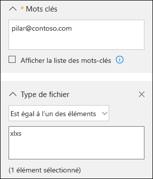
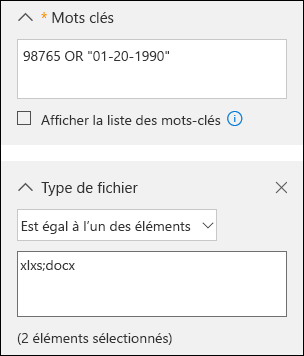

# <a name="office-365-data-subject-requests-for-the-gdpr-and-ccpa"></a>Demandes des personnes concernées pour Office 365 concernant le RGPD et le CCPA

## <a name="introduction-to-dsrs"></a>Présentation des DPC

The European Union [General Data Protection Regulation (GDPR)](https://ec.europa.eu/justice/data-protection/reform/index_en.htm) gives rights to people (known in the regulation as *data subjects*) to manage the personal data that has been collected by an employer or other type of agency or organization (known as the *data controller* or just *controller*). Personal data is defined broadly under the GDPR as any data that relates to an identified or identifiable natural person. The GDPR gives data subjects specific rights to their personal data; these rights include obtaining copies of it, requesting changes to it, restricting the processing of it, deleting it, or receiving it in an electronic format so it can be moved to another controller. A formal request by a data subject to a controller to take an action on their personal data is called a *Data Subject Request* or DSR. The controller is obligated to promptly consider each DSR and provide a substantive response either by taking the requested action or by providing an explanation for why the DSR cannot be accommodated by the controller. A controller should consult with its own legal or compliance advisers regarding the proper disposition of any given DSR.

De même, le CCPA (California Consumer Privacy Act), prévoit des droits de confidentialité et des obligations pour les consommateurs de la Californie, y compris des droits similaires aux droits des personnes concernées du RGPD, tels que le droit de supprimer, d’accéder et de recevoir (portabilité) leurs informations personnelles. Le CCPA prévoit également des publications d’informations, des protections contre la discrimination des personnes faisant usage de leurs droits et la possibilité d’opter pour ou contre certains transferts de données classés en tant que « ventes ». Les ventes sont largement définies pour inclure le partage de données à des fins importantes. Pour plus d’informations sur le CCPA, voir le [California Consumer Privacy Act](offering-ccpa.md) et le [Forum aux questions California Consumer Privacy Act](ccpa-faq.md).

Le guide décrit comment utiliser les produits, les services et les outils d’administration d’Office 365 pour vous aider à rechercher des données ou des informations personnelles et à prendre des mesures pour répondre aux DPC. Plus précisément, il explique comment rechercher des données ou des informations personnelles qui sont stockées dans le cloud Microsoft, comment y accéder et comment entreprendre une action sur ces données. Voici un aperçu rapide des processus présentés dans ce guide :

- **Découvrir** : utilisez les outils de recherche et de détection pour rechercher plus facilement les données du client qui peuvent faire l’objet d’une demande DPC. Une fois que vous avez collecté les documents susceptibles de répondre à la demande, vous pouvez effectuer une ou plusieurs des actions DPC décrites ci-après. Vous pouvez également décider que la demande ne satisfait pas aux directives de votre organisation en termes de réponse à une demande DPC.
- **Accéder :** récupérez des données à caractère personnel qui résident dans le cloud Microsoft et, si nécessaire, effectuez-en une copie pour la personne concernée.
- **Rectifier :** modifiez ou mettez en œuvre d’autres actions demandées sur les données à caractère personnel, le cas échéant.
- **Limiter** : limiter le traitement des données personnelles en supprimant les licences de différents services de Microsoft cloud ou en désactivant les services souhaités lorsque c’est possible. Vous pouvez également supprimer les données du cloud Microsoft et les conserver localement ou à un autre emplacement.
- **Supprimer :** supprimez définitivement des données à caractère personnel qui résidaient dans le cloud Microsoft.
- **Exporter/Recevoir (Portabilité) :** fournit une copie électronique (dans un format lisible par un ordinateur) des données ou des informations personnelles à la personne concernée. Les informations à caractère personnel sous CCPA englobent toutes les informations relatives à une personne identifiée ou identifiable. Aucune distinction n’est faite entre les rôles privé, public et professionnel d’une personne. Le terme défini « informations personnelles » est à peu près aligné sur celui de « données personnelles » dans le RGPD. Toutefois, le CCPA inclut également les données relatives à la famille et au foyer. Pour plus d’informations sur le CCPA, voir le [California Consumer Privacy Act](offering-ccpa.md) et le [Forum aux questions California Consumer Privacy Act](ccpa-faq.md).

### <a name="terminology"></a>Terminologie

Voici des définitions de termes du RGPD utilisés dans ce guide.

- **Responsable du traitement des données :** la personne physique ou morale, l’autorité publique, le service ou tout autre organisme qui, seul ou conjointement avec d’autres, détermine les finalités et les moyens du traitement des données à caractère personnel ; lorsque les finalités et les moyens du traitement sont déterminés par la législation de l’Union ou des États membres, le responsable du traitement peut être désigné, ou les critères spécifiques relatifs à sa nomination être définis, par la législation de l’Union ou des États membres.
- **Données personnelles et personne concernée par le traitement des données :** informations relatives à une personne physique identifiée ou identifiable (« la personne concernée par le traitement des données ») ; une personne physique identifiable est une personne qui peut être identifiée, directement ou indirectement, notamment par référence à un identificateur par exemple, un nom, un numéro d’identification, des données de localisation, un identificateur en ligne, ou un ou plusieurs facteurs spécifiques de l’identité physique, physiologique, génétique, mentale, économique, culturelle ou sociale de cette personne physique.
- **Sous-traitant de données :** la personne physique ou morale, l’autorité publique, le service ou tout autre organisme qui traite des données à caractère personnel pour le compte du responsable du traitement.
- **Données client :** toutes les données, y compris tous les fichiers texte, son, vidéo ou image et les logiciels qui ont été fournis à Microsoft par le client ou pour son compte dans le cadre du service d’entreprise. Les données client incluent à la fois les (1) informations d’identification personnelle des utilisateurs finaux (par exemple, les noms d’utilisateur et les informations de contact dans Azure Active Directory) et le contenu client chargé ou créé par un client dans des services spécifiques (par exemple, le contenu client dans un document Word ou Excel, ou dans le texte d'un courrier électronique Exchange Online, le contenu client est ajouté au site SharePoint Online ou enregistré dans un compte OneDrive pour entreprise).
- **Journaux générés par le système :** journaux et données associées générés par Microsoft qui permettent à Microsoft de fournir des services d’entreprise aux utilisateurs. Les journaux générés par le système contiennent essentiellement des données pseudonymes, généralement un numéro généré par le système qui ne permet pas, en soi, d’identifier une personne individuelle, mais qui est utilisé pour fournir les services d’entreprise aux utilisateurs. Les journaux générés par le système peuvent également contenir des informations d’identification personnelle sur les utilisateurs finaux, telles qu’un nom d’utilisateur.

### <a name="how-to-use-this-guide"></a>Comment utiliser ce guide

Pour vous aider à trouver des informations pertinentes pour votre cas d’utilisation, ce guide est divisé en quatre parties.

- **[Partie 1: réponse aux DSR pour les données client](#part-1-responding-to-dsrs-for-customer-data):** *les données client* sont des données produites et stockées dans Office 365 dans le cadre des opérations quotidiennes de l’exécution de votre entreprise. Voici quelques exemples des applications Office 365 les plus fréquemment utilisées qui vous permettent de créer des données : Word, Excel, PowerPoint, Outlook et OneNote. Office 365 comprend également des applications telles que SharePoint Online, Teams et Forms qui vous permettent de mieux collaborer avec d’autres personnes. La première partie de ce guide explique comment découvrir, rectifier, supprimer et exporter des données à partir d’applications Office 365 qui ont été utilisées pour créer et stocker des données dans les services Online Office 365. Elle présente des produits et services pour lesquels Microsoft agit comme un processeur de données pour votre organisation, par conséquent, les fonctionnalités DSR sont mises à la disposition de l’administrateur de votre client.
- **[Partie 2: répondre au DSR par rapport aux informations générées par Office 365](#part-2-responding-to-dsrs-with-respect-to-insights-generated-by-office-365):** Office 365 fournit certaines informations via les services tels que Delve, MyAnalytics et Workplace Analytics. La manière dont ces informations sont générées et la manière de répondre aux DSRs qui y sont associés sont décrites dans la partie 2 de ce guide.
- **[Partie 3: répondre aux DSRS pour les journaux générés par le système](#part-3-responding-to-dsrs-for-system-generated-logs):** lorsque vous utilisez les services Office 365 pour les entreprises, Microsoft génère des informations, telles que les journaux de service, qui enregistrent l’utilisation ou les performances des fonctionnalités dans les services en ligne. La plupart des données générées par le service contiennent des identificateurs avec pseudonyme généré par Microsoft et cette catégorie est donc généralement désignée dans ce document comme des *journaux générés par le système*. Bien que ces données ne puissent pas être affectées à un sujet de données spécifique sans utiliser d’informations supplémentaires, certaines d’entre elles peuvent être considérées comme personnelles dans le cadre de la définition de RGPD pour les «données personnelles». La troisième partie de ce guide explique comment consulter, supprimer et exporter des journaux générés par le système.
- **[Partie 4 : Ressources supplémentaires pour vous aider avec des DPC](#part-4-additional-resources-to-assist-you-with-dsrs):** la partie 4 de ce guide répertorie les scénarios limités dans lesquels Microsoft est l’entité de contrôle des données lorsque certains produits et services Office 365 sont utilisés.

>[!NOTE]
>In most cases, when users in your organization use Microsoft Office 365 products and services, you are the data controller and Microsoft is the processor. As a data controller, you are responsible for responding to the data subject directly. To assist you with this, Parts 1-3 of this guide detail the technical capabilities available to your organization to respond to a DSR request. In some limited scenarios, however, Microsoft will be the data controller when people use certain Office 365 products and services. In these cases, the information in Part 4 provides guidance on how data subjects can submit DSR requests to Microsoft.

### <a name="office-365-national-clouds"></a>Clouds nationaux Office 365

The Microsoft Office 365 services are also available in the following national cloud environments: [Office 365 Germany](https://docs.microsoft.com/microsoft-365/admin/admin-overview/learn-about-office-365-germany), [Office 365 operated by 21Vianet (China)](https://docs.microsoft.com/microsoft-365/admin/services-in-china/services-in-china), and [Office 365 US Government](https://www.microsoft.com/microsoft-365/government/compare-office-365-government-plans). Most of the guidance for managing data subject requests described in this document applies to these national cloud environments. However, due to the isolated nature of these environments, there are some exceptions. Where notable for a given subsection, these exceptions are called out in a corresponding note.

### <a name="hybrid-deployments"></a>Déploiements hybrides

Your organization may consist of Microsoft offerings that are a combination of cloud-based services and on-premises server products. In general, a hybrid deployment is typically the sharing of user accounts (identity management) and resources (such as mailboxes, web sites, and data) that exist in the cloud and on-premises. Common hybrid scenarios include:

- Les déploiements Exchange hybrides, où certains utilisateurs ont des boîtes aux lettres locales et d’autres utilisateurs ont des boîtes aux lettres Exchange Online.
- Les déploiements SharePoint hybrides, où les serveurs de sites et de fichiers sont en local et les comptes OneDrive Entreprise sont dans Office 365.
- Le système local de gestion des identités (Active Directory) synchronisé avec Azure Activity Directory, correspondant au service d’annuaire sous-jacent dans Office 365.

When responding to a DSR request, you may have to determine if data that's responsive to a DSR request is in the Microsoft cloud or in your on-premise organization, and then take the appropriate steps to respond to that request. The Office 365 Data Subject Request Guide (this guide) provides guidance for responding to cloud-based data. For guidance for data in your on-premises organization, see [GDPR for Office on-premises Servers](https://docs.microsoft.com/Office365/Enterprise/gdpr-for-office-servers).

## <a name="part-1-responding-to-dsrs-for-customer-data"></a>Partie 1 : Répondre à des DPC pour les données client

Les instructions pour répondre aux DPC pour les données client sont divisées dans les quatre sections suivantes :

- [Utilisation de l’outil de recherche de contenu eDiscovery pour répondre aux DPC](#using-the-content-search-ediscovery-tool-to-respond-to-dsrs)
- [Utilisation des fonctionnalités intégrées à l’application pour répondre aux DSR](#using-in-app-functionality-to-respond-to-dsrs)
- [Réponse aux demandes de rectification de DSR](#responding-to-dsr-rectification-requests)
- [Réponse aux demandes de restriction de DSR](#responding-to-dsr-restriction-requests)

### <a name="how-to-determine-the-office-365-applications-that-may-be-in-scope-for-a-dsr-for-customer-data"></a>Comment identifier les applications Office 365 qu’il est possible d’utiliser pour une DPC pour les données client

Pour vous aider à déterminer où rechercher des données personnelles ou ce qu’il convient de rechercher, il est utile d’identifier les applications Office 365 que les membres de votre organisation peuvent utiliser pour créer et stocker des données dans Office 365. Le fait de savoir ceci permet d’identifier les applications Office 365 dans le cadre d’un DSR et vous permet de déterminer comment rechercher et accéder aux données personnelles relatives à un DSR. Plus précisément, cela signifie que vous pouvez utiliser l’outil recherche de contenu ou que vous devrez utiliser la fonctionnalité dans l’application de l’application dans laquelle les données ont été créées.

A quick way to identify the Office 365 applications that people in your organization are using to create Customer Data is to determine which applications are included in your organization's Microsoft 365 for business subscription. To do this, you can access user accounts in the Office 365 admin portal and look at the product licensing information. See [Assign licenses to users](../admin/manage/assign-licenses-to-users.md).

## <a name="using-the-content-search-ediscovery-tool-to-respond-to-dsrs"></a>Utilisation de l’outil de recherche de contenu eDiscovery pour répondre aux DSR

When looking for personal data within the larger set of data your organization creates and stores using in Office 365, you may want to first consider which applications people have most likely used to author the data you're looking for. Microsoft estimates that over 90% of an organization's data that is stored in Office 365 is authored in Word, Excel, PowerPoint, OneNote, and Outlook. Documents authored in these Office applications, even if purchased through Microsoft 365 Apps for enterprise or an Office perpetual license, are most likely stored on a SharePoint Online site, in a user's OneDrive for Business account, or in a user's Exchange Online mailbox. That means you can use the Content Search eDiscovery tool to search (and perform other DSR-related actions) across SharePoint Online sites, OneDrive for Business accounts, and Exchange Online mailboxes (including the sites and mailboxes associated with Microsoft 365 Groups, Microsoft Teams, EDU Assignments) to find documents and mailbox items that may be relevant to the DSR you're investigating. You can also use the Content Search tool to discover Customer Data authored in other Office 365 applications.

Le tableau suivant répertorie les applications Office 365 que les personnes utilisent pour créer du Contenu créé par le client et qui peut être découvert à l’aide de la Recherche de contenu. Cette section du guide DSR fournit des instructions sur la découverte, l’accès, l’exportation et la suppression de données créées avec ces applications Office 365.

***Tableau 1 : Applications permettant l’utilisation de la recherche de contenu pour trouver des données client***

| | |
| :---: | :---:|
 <br> Calendrier |  <br> SharePoint  |
|  <br> Excel |  <br> Skype Entreprise |
|  <br> Office Lens |  <br> Tâches |
|  <br> OneDrive Entreprise | <br> Teams |
|  <br> OneNote|  <br> Action |
|  <br> Outlook/Exchange |  <br> Vidéo |
|  <br> Contacts |  <br> Visio |
|  <br> PowerPoint |  <br> Word
||

>[!NOTE]
>The Content Search eDiscovery tool is not available in [Office 365 operated by 21Vianet (China)](https://docs.microsoft.com/microsoft-365/admin/services-in-china/services-in-china). This means you won't able to use this tool to search for and export Customer Data in the Office 365 applications shown in Table 1. However, you can use the In-Place eDiscovery tool in Exchange Online to search for content in user mailboxes. You can also use the eDiscovery Center in SharePoint Online to search for content in SharePoint sites and OneDrive accounts. Alternatively, you can ask a document owner to help you find and make changes or deletions to content or export it if necessary. For more information, see:</br><br> * [Créer une recherche de découverte électronique inaltérable](https://docs.microsoft.com/exchange/create-in-place-ediscovery-search-exchange-2013-help)<br> * [Configurer un centre eDiscovery dans SharePoint Online](https://support.office.com/article/Set-up-an-eDiscovery-Center-in-SharePoint-Online-A18F8975-AA7F-43B4-A7D6-001D14744D8E)

### <a name="using-content-search-to-find-personal-data"></a>Utilisation de la recherche de contenu pour rechercher des données personnelles

La première étape pour répondre à un DPC consiste à trouver les données personnelles faisant l’objet de la demande. Cela consiste à utiliser les outils d’eDiscovery Office 365 pour rechercher des données personnelles (parmi toutes les données de votre organisation dans Office 365) ou accéder directement à l’application native dans laquelle les données ont été créées. Cette première étape, rechercher et réviser les données personnelles en cause, vous permet de déterminer si un DPC répond aux besoins de votre organisation en matière de respect ou de refus d’un DPC. Par exemple, après avoir trouvé et consulté les données personnelles en cause, vous pouvez déterminer si la demande ne respecte pas les exigences de votre organisation, car cela peut nuire aux droits et libertés d’autres personnes ou parce que les données personnelles figurent dans un dossier professionnel que votre organisation souhaite conserver pour des raisons professionnelles.

As previously stated, Microsoft estimates that over 90% of an organization's data is created with Office applications, such as Word and Excel. This means that you can use the Content Search in the Security & Compliance Center to search for most DSR-related data.

This guide assumes that you or the person searching for personal data that may be responsive to a DSR request is familiar with or has experience using the Content Search tool in the Security & Compliance Center. For general guidance on using Content Search, see [Content Search in Office 365](https://docs.microsoft.com/microsoft-365/compliance/content-search). Be sure that the person running the searches has been assigned the necessary permissions in the Security & Compliance Center. This person should be added as a member of the eDiscovery Manager role group in the Security & Compliance Center; see [Assign eDiscovery permissions in the Security & Compliance Center](https://docs.microsoft.com/microsoft-365/compliance/assign-ediscovery-permissions). Consider adding other people in your organization who are involved in investigating DSRs to the eDiscovery Manager role group, so they can perform the necessary actions in the Content Search tool such as previewing and exporting search results. However, unless you set up compliance boundaries (as described [here](#set-up-compliance-boundaries-to-limit-the-scope-of-content-searches)) be aware that an eDiscovery Manager can search all content locations in your organization, including ones that may not be related to a DSR investigation.

Lorsque vous avez trouvé les données, vous pouvez ensuite effectuer l’action spécifique pour satisfaire la demande de la personne concernée.

>[!NOTE]
>Dans Office 365 Allemagne, le Centre de sécurité et conformité se trouve à l’adresse https://protection.office.de.

#### <a name="searching-content-locations"></a>Recherche d’emplacements de contenu

Vous pouvez rechercher les types d’emplacements de contenu suivants avec l’outil de recherche de contenu :

- Boîtes aux lettres Exchange Online. Cela inclut les boîtes aux lettres liées aux Groupes Microsoft 365 et Microsoft Teams
- Dossiers publics Exchange Online
- Sites SharePoint Online. Cela inclut les sites liées aux Groupes Microsoft 365 et Microsoft Teams
- Les comptes OneDrive Entreprise

>[!NOTE]
>This guide assumes that all data that might be relevant to a DSR investigation is stored in Office 365; in other words, stored in the Microsoft cloud. Data stored on a user's local computer or on-premises on your organization's file servers is outside the scope of a DSR investigation for data stored in Office 365. For guidance about responding to DSR requests for data in on-premises organizations, see [GDPR for Office on-premises Servers](https://docs.microsoft.com/Office365/Enterprise/gdpr-for-office-servers).

#### <a name="tips-for-searching-content-locations"></a>Conseils de recherche d’emplacements de contenu

- Commencez par rechercher tous les emplacements de contenu de votre organisation (que vous pouvez rechercher en effectuant une seule recherche) pour identifier rapidement les emplacements de contenu qui contiennent les éléments correspondant à votre requête de recherche. Vous pouvez ensuite relancer la recherche et limiter l’étendue de recherche aux emplacements précis qui contiennent les éléments pertinents.
- Use search statistics to identify the top locations that contain items that match your search query. See [View keyword statistics for Content Search results](https://docs.microsoft.com/microsoft-365/compliance/view-keyword-statistics-for-content-search).
- Effectuez une recherche dans le journal d’audit pour les activités récentes des fichiers et dossiers effectués par l’utilisateur qui fait l’objet du DSR. La recherche dans le journal d’audit renvoie la liste des dossiers d’audit qui contiennent le nom et l’emplacement des ressources avec lesquelles l’utilisateur a récemment interagit. Vous pourrez peut-être utiliser ces informations pour créer une requête de recherche de contenu. Voir [Effectuer des recherches dans le journal d’audit depuis le Centre de sécurité et conformité](https://docs.microsoft.com/microsoft-365/compliance/search-the-audit-log-in-security-and-compliance) 

#### <a name="building-search-queries-to-find-personal-data"></a>Création des requêtes de recherche pour trouver des données personnelles

Le DSR sur lequel vous enquêtez contient probablement des identificateurs que vous pouvez utiliser dans la requête de recherche par mot clé pour rechercher les données personnelles. Voici quelques identificateurs courants qui peuvent être utilisés dans une requête de recherche pour trouver des données personnelles :

- Adresse e-mail ou alias
- Numéro de téléphone
- Adresse postale
- Numéro d’identification d’employé
- Numéro d’identification national ou version membre de l’UE d’un numéro de sécurité sociale

La DPC que vous examinez comporte probablement un identificateur et d’autres informations sur les données personnelles concernant la demande que vous pouvez utiliser dans une requête de recherche.

La recherche d’une adresse de courrier ou d’un ID d’employé peut probablement renvoyer plusieurs résultats. Pour limiter l’étendue de votre recherche afin qu’elle renvoie le contenu le plus pertinent au DSR, vous pouvez ajouter des conditions à la requête de recherche. Lorsque vous ajoutez une condition, le mot clé et une condition de recherche sont connectés logiquement par**ET** l’opérateur booléen. Cela signifie que seuls les éléments qui correspondent *à la fois* au mot clé et la condition sont renvoyés dans les résultats de la recherche.

The following table lists some conditions you can use to narrow the scope of a search. The table also lists the values that you can use for each condition to search for specific document types and mailbox items.

***Tableau 2 : limiter l’étendue de recherche en utilisant des conditions***

||||
| :--- | :--- |:--- |
|**Condition**|**Description** |**Exemple de valeurs de condition**|
| Type de fichier | Extension d’un document ou d’un fichier. Utilisez cette condition pour rechercher des documents Office et des fichiers créés par les applications Office 365. Utilisez cette condition pour rechercher des documents sur des sites SharePoint Online et des comptes OneDrive Entreprise.<br/>Notez que la propriété du document correspondante est filetype. <br/>Pour obtenir une liste complète des extensions de fichiers que vous pouvez rechercher, consultez l’article relatif aux extensions de nom de fichier analysées par défaut et types de fichiers étudiés dans SharePointhttps://technet.microsoft.com/library/jj219530.aspx).|&nbsp;&bull;&nbsp;&nbsp;csv : recherches de fichiers de valeurs séparées par virgule (CSV) ; les fichiers Excel peuvent être enregistrés au format CSV et le fichier CSV peut facilement être importé dans Excel<br><br>&bull;&nbsp;&nbsp;docx : recherches de fichiers Word <br><br>&bull;&nbsp;&nbsp;mpp : recherches de fichiers Project<br/><br>&bull;&nbsp;&nbsp;one : recherches de fichiers OneNote <br><br>&bull;&nbsp;&nbsp;pdf : recherches de fichiers enregistrés au format PDF <br><br>&bull;&nbsp;&nbsp;pptx : recherches de fichiers PowerPoint <br><br>&bull;&nbsp;&nbsp;xlxs : recherches de fichiers Excel <br><br>&bull;&nbsp;&nbsp;vsd : recherches de fichiers Visio <br><br>&bull;&nbsp;&nbsp;wmv : recherches de fichiers vidéo Windows Media <br>|
| Type de message | Type de message à rechercher. Utilisez cette condition pour effectuer des recherches dans les boîtes aux lettres de contacts (contacts), de tâches de réunions (calendrier) ou de conversations Skype Entreprise. La propriété de courrier correspondante est*Type*.|&bull;&nbsp;&nbsp;*contacts : recherches dans la liste Mes contacts (Contacts) d’un message de<br><br>&bull;&nbsp;&nbsp;* boîte aux lettres : Recherches messages <br><br>&bull;&nbsp;&nbsp;*messagerie instantanée : recherche des conversations Skype Entreprise<br>&bull;<br>&nbsp;&nbsp;* réunions : recherches de rendez-vous et de demandes de réunion (calendrier) <br><br>&bull;&nbsp;&nbsp;*tâches : recherches dans la liste Mes tâches (Tâches) ; utiliser cette valeur permet également de renvoyer des tâches créées dans Microsoft To-Do.<br>|
| Balise de conformité |The label assigned to an email message or a document. Labels are used to classify email and documents for data governance and enforce retention rules based on the classification defined by the label. Use this condition to search for items that have been automatically or manually assigned a label.<br/>This is a useful condition for DSR investigations because your organization may be using labels to classify content related to data privacy or that contains personal data or sensitive information. See the "Using Content Search to find all content with a specific label applied to it" section in [Overview of labels in Office 365.](https://docs.microsoft.com/microsoft-365/compliance/labels)|compliancetag="personal data"|
||||

There are many more email and document properties and search conditions that you can use to build more complex search queries. See the following sections in the [Keyword queries and search conditions for Content Search](https://docs.microsoft.com/microsoft-365/compliance/keyword-queries-and-search-conditions) help topic for more information.

- [Propriétés de messagerie utilisables dans une requête](https://docs.microsoft.com/microsoft-365/compliance/keyword-queries-and-search-conditions)
- [Propriétés de site (document) utilisables dans une requête](https://docs.microsoft.com/microsoft-365/compliance/keyword-queries-and-search-conditions)
- [Conditions de recherche](https://docs.microsoft.com/microsoft-365/compliance/keyword-queries-and-search-conditions)

#### <a name="searching-for-personal-data-in-sharepoint-lists-discussions-and-forms"></a>Recherche de données personnelles dans des listes, des discussions et des formulaires SharePoint

In addition to searching for personal data in documents, you can also use Content Search to search for other types of data that's created by using native SharePoint Online apps. This includes data created by using SharePoint lists, discussions, and forms. When you run a Content Search and search SharePoint Online sites (or OneDrive for Business accounts) data from lists, discussions, and forms that match the search criteria will be returned in the search results.

##### <a name="examples-of-search-queries"></a>Exemples de requêtes de recherche

Voici quelques exemples d’interrogations de recherche qui utilisent des mots clés et des conditions pour rechercher des données personnelles en réponse à un DSR. Les exemples illustrent deux versions de la requête : l’une montrant la syntaxe du mot clé (où la condition est incluse dans la zone de mot clé), l’autre affichant la version basée sur l’interface utilisateur de la requête avec des conditions.

##### <a name="example-1"></a>Exemple 1

Cet exemple renvoie les fichiers Excel situés sur des sites SharePoint Online et des comptes OneDrive Entreprise qui contiennent l’adresse de messagerie spécifiée. Des fichiers peuvent être renvoyés si l’adresse de messagerie apparaît dans les métadonnées de fichier.

***Syntaxe de mot clé***

```Query
pilar@contoso.com AND filetype="xlxs"
```

***Interface utilisateur graphique***



##### <a name="example-2"></a>Exemple 2

Cet exemple renvoie les fichiers Excel ou Word situés sur des sites SharePoint Online et des comptes OneDrive Entreprise qui contiennent l’ID ou la date de naissance de l’employé spécifié.

(98765 OR "01-20-1990") AND (filetype="xlxs" OR filetype="docx")

***Interface utilisateur graphique***



##### <a name="example-3"></a>Exemple 3

Cet exemple renvoie les messages électroniques qui contiennent le numéros d’identification spécifié, c’est-à-dire un numéro de sécurité sociale français (INSEE)

```Query
"1600330345678 97" AND kind="email"
```

***Interface utilisateur graphique***


#### <a name="working-with-partially-indexed-items-in-content-search"></a>Utilisation des éléments partiellement indexés dans la recherche de contenu

Les éléments partiellement indexés (également appelés *éléments non indexés*) sont des éléments de boîte aux lettres et des documents Exchange Online sur des sites SharePoint Online et OneDrive Entreprise qui, pour une raison quelconque, n’ont pas été indexés pour la recherche, ce qui signifie qu’ils ne sont pas accessibles à l’aide de la recherche de contenu. La plupart des courriers électroniques et des documents de site sont indexés parce qu’ils sont inclus dans les[limites d’indexation pour Office 365](https://docs.microsoft.com/microsoft-365/compliance/limits-for-content-search). Les raisons pour lesquelles des courriers électroniques ou des fichiers ne sont pas indexés pour la recherche sont les suivantes :

- Le type de fichier n’est pas[pris en charge ou est désactivé pour l’indexation](https://docs.microsoft.com/microsoft-365/compliance/partially-indexed-items-in-content-search). Le type de fichier est parfois pris en charge pour l'indexation, mais une erreur d'indexation s'est produite pour un fichier spécifique.
- Les messages électroniques ont un fichier joint sans gestionnaire valide, tel que le fichier image (c’est la cause la plus courante d’éléments de messagerie partiellement indexés)
- Les fichiers joints aux messages électroniques sont trop volumineux ou il y a trop de fichiers joints

We recommend that you learn more about partially indexed items so that you can work with them when responding to DSR requests. For more information, see:

- [Éléments partiellement indexés dans la recherche de contenu dans Office 365](https://docs.microsoft.com/microsoft-365/compliance/partially-indexed-items-in-content-search)
- [Examen d’éléments partiellement indexés dans eDiscovery Office 365](https://docs.microsoft.com/microsoft-365/compliance/investigating-partially-indexed-items-in-ediscovery)
- [L’exportation d’éléments non indexés](export-search-results.md)

#### <a name="tips-for-working-with-partially-indexed-items"></a>Conseils pour utiliser des éléments partiellement indexés

It's possible that data responsive to a DSR investigation may be in a partially indexed item. Here's some suggestions for working with partially indexed items:

- Une fois que vous avez effectué une recherche, le nombre d’éléments partiellement estimés s’affiche dans les statistiques de recherche. Cette estimation n’inclut pas les éléments partiellement indexés dans SharePoint Online et OneDrive Entreprise. Exportez les rapports pour une recherche de contenu pour obtenir des informations sur les éléments partiellement indexés. Le rapport **éléments non indexés.csv** contient des informations sur les éléments non indexés, y compris l’emplacement de l’élément, l’URL si l’élément est dans SharePoint Online ou OneDrive Entreprise, et la ligne d’objet (pour les messages) ou le nom du document. Pour plus d’informations, voir [Exporter des résultats de recherche](https://docs.microsoft.com/microsoft-365/compliance/export-a-content-search-report).

- Les statistiques et la liste d’éléments partiellement indexés renvoyés avec les résultats d’une recherche de contenu sont tous les éléments partiellement indexés à partir d’emplacements de contenu consultés.

- Pour récupérer les éléments partiellement indexés pouvant répondre à l’examen d’une DPC, vous pouvez effectuer l’une des actions suivantes :

##### <a name="export-all-partially-indexed-items"></a>Exporter tous les éléments partiellement indexés

Vous exportez les résultats d’une recherche de contenu et les éléments partiellement indexés à partir de l’emplacement de contenu qui a fait l’objet d’une recherche. Vous pouvez également exporter uniquement les éléments partiellement indexés. Vous pouvez ensuite les ouvrir dans leur application native et examiner le contenu. Vous devez utiliser cette option pour exporter des éléments à partir de SharePoint Online et OneDrive Entreprise. Reportez-vous à la rubrique relative à l’[exportation des résultats de la recherche de contenu du Centre de sécurité et de conformité](export-search-results.md).

##### <a name="export-a-specific-set-of-partially-indexed-items-from-mailboxes"></a>Exporter un ensemble spécifique d’éléments partiellement indexés à partir des boîtes aux lettres

Au lieu d’exporter tous les éléments de boîte aux lettres partiellement indexés à partir d’une recherche, vous pouvez réexécuter une recherche de contenu pour rechercher une liste spécifique d’éléments partiellement indexés, puis les exporter. Vous pouvez effectuer cette opération uniquement pour les éléments de boîte aux lettres. Voir[Préparer un fichier CSV pour une recherche de contenu ciblée dans Office 365](https://docs.microsoft.com/microsoft-365/compliance/csv-file-for-an-id-list-content-search).

### <a name="next-steps"></a>Étapes suivantes

Une fois que vous avez trouvé les données personnelles relatives au DSR, assurez-vous de conserver la recherche de contenu spécifique que vous avez utilisée pour rechercher les données. Vous pourrez utiliser cette recherche pour effectuer d’autres étapes du processus de réponse DSR, par exemple [pour en obtenir une copie](#providing-a-copy-of-personal-data), [l’exporter](#exporting-personal-data)ou [la supprimer définitivement](#deleting-personal-data).

### <a name="additional-considerations-for-selected-applications"></a>Considérations supplémentaires pour les applications sélectionnées

Les sections suivantes décrivent les choses à garder à l’esprit lorsque vous recherchez des données dans les applications Office 365 suivantes :

- [Office Lens](#office-lens)
- [OneDrive Entreprise et Paramètres d’expérience SharePoint](#onedrive-for-business-and-sharepoint-online-experience-settings)
- [Microsoft Teams pour l’éducation](#microsoft-teams-for-education)
- [Microsoft To-Do](#microsoft-to-do)
- [Skype Entreprise](#skype-for-business)

#### <a name="office-lens"></a>Office Lens

Une personne qui utilise Office Lens (une application caméra prise en charge par les appareils exécutant iOS, Android et Windows) peut prendre une photo de tableaux blancs, de documents papier, de cartes de visite et d’autres éléments qui contiennent beaucoup de texte. Office Lens utilise une technologie de reconnaissance optique des caractères qui extrait le texte d’une image et l’enregistre dans un document Office tel qu’un Word, PowerPoint et OneNote, ou un fichier PDF. Les utilisateurs peuvent alors télécharger le fichier qui contient le texte de l’image vers leur compte OneDrive Entreprise dans Office 365. Vous pouvez ainsi utiliser l’outil recherche de contenu pour rechercher, consulter, supprimer et exporter des données dans des fichiers créés à partir d’une image d’Office Lens. Pour plus d’informations sur Office Lens, voir :

- [Office Lens pour iOS](https://support.microsoft.com/fr-FR/office/microsoft-office-lens-for-ios-fbdca5f4-1b1b-4391-a931-dc1c2582397b)
- [Office Lens pour Android](https://support.office.com/article/Office-Lens-for-Android-ec124207-0049-4201-afaf-b5874a8e6f2b)
- [Office Lens pour Windows](https://support.microsoft.com/fr-FR/office/office-lens-for-windows-577ec09d-8da2-4029-8bb7-12f8114f472a)

#### <a name="onedrive-for-business-and-sharepoint-online-experience-settings"></a>OneDrive Entreprise et Paramètres d’expérience SharePoint Online

In addition to user-created files stored in OneDrive for Business accounts and SharePoint Online sites, these services store information about the user that is used to enable various experiences. Users still in your organization can access much of this information by using in-product functionality. The following information provides guidance on how to access, view, and export OneDrive for Business and SharePoint Online application data.

##### <a name="sharepoint-user-profiles"></a>Profils utilisateur SharePoint

Le Profil Delve de l’utilisateur permet aux utilisateurs de conserver les propriétés stockées dans le profil utilisateur SharePoint Online, y compris les anniversaires, les numéros de téléphone portable (et d’autres informations de contact), à propos de moi, des projets, des qualifications et des spécialisations, des établissements scolaires et de l’éducation, des centres d’intérêt et des loisirs.

###### <a name="end-users"></a>Utilisateurs finals

End users can discover, access, and rectify SharePoint Online user profile data using the Delve profile experience. See [View and update your profile in Office Delve](https://support.office.com/article/view-and-update-your-profile-in-office-delve-4e84343b-eedf-45a1-aeb9-8627ccca14ba) for more details.

Un autre moyen pour les utilisateurs de consulter leurs données de profil SharePoint est d’accéder à la **page Modifier le profil** dans leur compte OneDrive Entreprise, accessible en accédant au chemin d’accès **EditProfile.aspx** sous l’URL de compte OneDrive Entreprise.  Par exemple, le compte OneDrive Entreprise de l’utilisateur <strong>user1@contoso.com</strong> se trouve à l’emplacement suivant :

```URL
`https://contoso-my.sharepoint.com/personal/user1\_contoso\_com/\_layouts/15/OneDrive.aspx`
```

L’URL de la page Modifier le profil serait la suivante :

```URL
`https://contoso-my.sharepoint.com/personal/user1\_contoso\_com/\_layouts/15/EditProfile.aspx`
```

Les propriétés provenant d’Azure Active Directory ne peuvent pas être modifiées dans SharePoint Online. Toutefois, les utilisateurs peuvent accéder à leur page**Compte** en sélectionnant leur** photo** dans l’en-tête Office 365,puis en sélectionnant **mon compte**. Le fait de modifier les propriétés ici peut obliger les utilisateurs à travailler avec leurs administrateurs pour découvrir, consulter ou rectifier une propriété de profil utilisateur.

###### <a name="admins"></a>Administrateurs

Un administrateur peut accéder aux propriétés de profil et les rectifier dans le centre d’administration SharePoint. Dans le **Centre d’administration SharePoint**, cliquez sur l' onglet **Profils utilisateur**, cliquez sur**gérer les profils utilisateur**, entrez le nom d’un utilisateur, puis cliquez sur **Rechercher**. L’administrateur peut cliquer avec le bouton droit sur n' importe quel utilisateur et sélectionner **Modifier mon profil**. Les propriétés provenant d’Azure Active Directory ne peuvent pas être modifiées dans SharePoint Online.

An admin can export all User Profile properties for a user by using the **Export-SPOUserProfile** cmdlet in SharePoint Online PowerShell. See  [Export-SPOUserProfile](https://docs.microsoft.com/powershell/module/sharepoint-online/export-spouserprofile?view=sharepoint-ps).

Pour obtenir plus d’informations sur les profils utilisateur, consultez l’article [Gérer les profils utilisateur dans le Centre d’administration SharePoint](https://docs.microsoft.com/sharepoint/manage-user-profiles).

##### <a name="user-information-list-on-sharepoint-online-sites"></a>Liste d’informations utilisateur sur des sites SharePoint Online

Un sous-ensemble du profil utilisateur SharePoint d’un utilisateur est synchronisé avec la liste d’informations utilisateur de tous les sites visités ou dont il dispose des autorisations d’accès. Ceci est utilisé par les expériences SharePoint Online, telles que les colonnes contacts dans les bibliothèques de documents, pour afficher des informations de base sur l’utilisateur, telles que le nom du créateur d’un document. Les données d’une liste d’informations utilisateur correspondent aux informations stockées dans le profil de l’utilisateur SharePoint et sont automatiquement corrigées en cas de modification de la source. Pour les utilisateurs supprimés, ces données restent dans les sites avec lesquels ils interagissent pour l’intégrité référentielle des champs de colonne SharePoint. 

Admins can control which properties are replicable inside the SharePoint admin center. To do this:

1. Accédez à **Centre d’administration SharePoint** et cliquez sur l’onglet **Profils utilisateur**.
2. Cliquez sur **Gérer les propriétés utilisateur** pour obtenir la liste des propriétés.
3. Faites un clic droit sur une propriété, sélectionnez **Modifier** et modifiez les différents paramètres.
4. En vertu des **Paramètres de stratégie**, la propriété réplicable contrôle l’affichage de la propriété dans la liste d’informations utilisateur.  Notez que les propriétés ne permettent pas toutes d’effectuer cette modification.

An admin can export all User information properties for a user on a given site by using the **Export-SPOUserInfo** cmdlet in SharePoint Online PowerShell. See [Export-SPOUserInfo](https://docs.microsoft.com/powershell/module/sharepoint-online/export-spouserinfo?view=sharepoint-ps).

##### <a name="onedrive-for-business-experience-settings"></a>Paramètres d’expérience OneDrive Entreprise

A user's OneDrive for Business experience stores information to help the user find and navigate content of interest to them. Most of this information can be accessed by end users using in-product features. An admin can export the information using a [PowerShell Script](https://docs.microsoft.com/powershell/scripting/overview) and [SharePoint Client-Side Object Model (CSOM)](https://docs.microsoft.com/sharepoint/dev/sp-add-ins/complete-basic-operations-using-sharepoint-client-library-code) commands.

Consultez l’article [Exportation des paramètres d’expérience OneDrive Entreprise](https://docs.microsoft.com/sharepoint/export-odfb-lists) pour obtenir plus d’informations sur les paramètres, leur stockage et leur exportation.

##### <a name="onedrive-for-business-and-sharepoint-online-search"></a>Recherche OneDrive Entreprise et SharePoint Online

The in-app search experience in OneDrive for Business and SharePoint Online stores a user's search queries for 30 days to increase relevance of search results. An admin can export search queries for a user by using the **Export-SPOQueryLogs** cmdlet in SharePoint Online PowerShell. See [Export-SPOQueryLogs](https://docs.microsoft.com/powershell/module/sharepoint-online/export-spoquerylogs?view=sharepoint-ps).

#### <a name="microsoft-teams-for-education"></a>Microsoft Teams pour l’éducation

Microsoft Teams for Education offers two additional collaboration features that teachers and students can use that creates and stores personal data: Assignments and OneNote Class Notebook. You can use Content Search to discover data in both.

##### <a name="assignments"></a>Affectations

Students files associated with an Assignment are stored in a document library in the corresponding Teams SharePoint Online site. IT admins can use the Content Search tool to search for student files that are related to assignments. For example, an admin could search all SharePoint Online sites in the organization and use the student's name and class or assignment name in the search query to find data relevant to a DSR.

There's other data related to Assignments that isn't stored in the class team SharePoint Online site, which means it's not discoverable with Content Search. This includes:

- Fichiers que l’enseignant attribue aux étudiants dans le cadre du devoir
- Notes des étudiants et appréciations de l’enseignant
- Liste des documents envoyés par chaque étudiant pour un devoir
- Métadonnées des devoirs

Pour ce type de données, un administrateur informatique ou le propriétaire des données (par exemple, un enseignant) devra peut-être accéder à Devoir dans l’équipe de la classe pour trouver les données pertinentes pour une DSR.

##### <a name="onenote-class-notebook"></a>Bloc-notes OneNote pour la classe

The OneNote Class Notebook is stored in the class team SharePoint Online site. Every student in a class has a private notebook that's shared with the teacher. There's also a content library where a teacher can share documents with students, and a collaboration space for all students in the class. Data related to these capabilities is discoverable with Content Search.

Voici des instructions spécifiques pour rechercher un bloc-notes pour la classe.

1. Exécutez une recherche de contenu à l’aide des critères de recherche suivants :

   - Rechercher tous les sites SharePoint Online.

   - Inclure le nom de l’équipe de classe comme mot clé de recherche : par exemple, « 9C Biologie ».

2. Affichez un aperçu des résultats de la recherche et recherchez l’élément correspondant au bloc-notes pour la classe.
3. Select that item, and then copy the folder path that's displayed in the details pane. This is the root folder for the Class Notebook.
4. Edit the search that you created in step 1 and replace the class name in the keyword query with the folder path of the Class Notebook and precede the folder path with the **path** site property; for example, **path:"<https://contosoedu.onmicrosoft.com/sites/9C> Biology/SiteAssets/9C Biology Notebook/"**. Be sure to include the quotation marks and the trailing forward slash.
5. Ajouter une condition de recherche et sélectionner la condition type de fichier et en utiliser une pour la valeur du type de fichier. Cette opération renvoie tous les fichiers OneNote figurant dans les résultats de la recherche. La syntaxe des mots clés résultants ressemblerait à ce qui suit :[](#building-search-queries-to-find-personal-data)

    ```Query
   path:"<https://contosoedu.onmicrosoft.com/sites/9C> Biology/SiteAssets/9C Biology Notebook/" AND filetype="one"
   ```

6.  Relancez la recherche de contenu. Les résultats de la recherche doivent inclure tous les fichiers OneNote du bloc-notes pour la classe de l’équipe de classe.

#### <a name="microsoft-to-do"></a>Microsoft To-Do

Les *tâches* (sauvegardées dans les *listes de tâches*) dans Microsoft To Do sont sauvegardées en tant que tâches dans la boîte aux lettres Exchange Online d’un utilisateur. Cela signifie que vous pouvez utiliser l’outil de recherche de contenu pour rechercher, consulter, supprimer et exporter des tâches. Pour plus d’informations, consultez [Configurer Microsoft To-Do](https://support.microsoft.com/fr-FR/office/set-up-microsoft-to-do-490c1a8c-2333-4952-8125-841afadb9620).

#### <a name="skype-for-business"></a>Skype Entreprise

Voici quelques informations supplémentaires expliquant comment consulter, afficher et exporter des données personnelles dans Skype Entreprise.

- Files attached to a meeting are retained in the actual meeting for 180 days and then become inaccessible. These files can be accessed by meeting participants by joining the meeting from the meeting request and then viewing or downloading the attached file. See the "Use the attachments in the meeting" section in [Preload attachments for a Skype for Business meeting](https://support.microsoft.com/fr-FR/office/preload-attachments-for-a-skype-for-business-meeting-fd3d9f9d-b448-4754-b813-02e49393f251).
- Conversations in Skype for Business are retained in the Conversation History folder in user mailboxes. You can use Content Search to search mailboxes for data in Skype conversations.
- A data subject can export their contacts in Skype for Business. To do this, they would right-click a contact group in Skype for Business and click **Copy**. Then they can paste the list of email addresses into a text or Word document.
- If the Exchange Online mailbox of a meeting participant is placed on Litigation Hold or assigned to an Office 365 retention policy, files attached to a meeting are retained in the participants mailbox. You can use Content Search to search for those files in the participant's mailbox if the retention period for the file has not expired. For more information about retaining files, see [Retaining large files attached to a Skype for Business meeting](https://docs.microsoft.com/skypeforbusiness/set-up-policies-in-your-organization/retaining-large-files-attached-to-a-meeting).

## <a name="providing-a-copy-of-personal-data"></a>Fourniture d’une copie des données personnelles

After you've found personal data that is potentially responsive to a DSR, it's up to you and your organization to decide which data to provide the data subject. For example, you can provide them with a copy of the actual document, an appropriately redacted version, or a screenshot of the portions that you've deemed appropriate to share. For each of these responses to an access request, you'll have to retrieve a copy of the document or other item that contains the responsive data.

Lorsque vous fournissez une copie à la personne concernée, vous devrez peut-être supprimer ou modifier des informations personnelles sur d’autres personnes concernées et des informations confidentielles.

### <a name="using-content-search-to-get-a-copy-of-personal-data"></a>Utilisation de la recherche de contenu pour obtenir une copie des données personnelles

Il y a deux façons d’utiliser l’outil de recherche de contenu pour obtenir une copie d’un document ou d’un élément de boîte aux lettres trouvé après avoir lancé une recherche.

- Preview the search results and then download a copy of the document or item. This is a good way to download a few items or files.
- Exportez les résultats de la recherche, puis téléchargez une copie de tous les éléments renvoyés par la recherche. Cette méthode est plus complexe, mais c’est un bon moyen de télécharger de nombreux éléments qui répondent au DSR. Des rapports utiles sont également inclus dans les résultats de la recherche. Vous pouvez utiliser ces rapports pour obtenir des informations supplémentaires sur chaque élément. Le rapport** résultats.csv** est utile, car il contient de nombreuses informations sur les éléments exportés, tels que l’emplacement exact de l’élément (par exemple, la boîte aux lettres pour les courriers électroniques ou l’URL de documents ou de listes dans les sites SharePoint Online et OneDrive Entreprise). Ces informations vous aident à identifier le propriétaire de l’élément, au cas où vous devriez le contacter pendant le processus d’enquête sur le DSR. Pour plus d’informations sur les rapports inclus lorsque vous exportez des résultats de recherche, voir [exporter un rapport de recherche de contenu](https://docs.microsoft.com/microsoft-365/compliance/export-a-content-search-report).

#### <a name="preview-and-download-items"></a>Afficher un aperçu et télécharger des éléments

Une fois que vous avez effectué une nouvelle recherche ou ouvert une recherche existante, vous pouvez afficher un aperçu de chaque élément qui correspond à la requête de recherche pour vérifier qu’il est lié au DSR que vous recherchez. Cela inclut également les listes et pages Web SharePoint qui sont renvoyées dans les résultats de recherche. Vous pouvez également télécharger le fichier d’origine si vous devez le fournir à la personne concernée. Dans les deux cas, vous pouvez effectuer une capture d’écran pour répondre à la demande de l’objet de données d’obtenir les informations.

Certains types d’éléments ne peuvent pas être prévisualisés. Si l’affichage d’un élément ou d’un type de fichier n’est pas pris en charge, vous pouvez télécharger un élément individuel sur votre ordinateur local, un lecteur réseau mappé ou un autre emplacement réseau.  Vous pouvez afficher un aperçu uniquement des [types de fichiers pris en charge](https://docs.microsoft.com/microsoft-365/compliance/content-search).

Pour afficher un aperçu et télécharger les éléments, procédez comme suit :

1. Ouvrez la recherche de contenu dans le Centre de conformité et sécurité.
2. Si les résultats ne sont pas affichés, cliquez sur **Afficher un aperçu des résultats**.
3. Cliquez sur un élément pour l’afficher.
4. Click **Download original file** to download the item to your local computer. You'll also have to download items that can't be previewed.

Pour obtenir plus d’informations sur l’aperçu des résultats de recherche, consultez l’article [Afficher un aperçu des résultats de recherche](https://docs.microsoft.com/microsoft-365/compliance/content-search).

#### <a name="export-and-download-items"></a>Exporter et télécharger des éléments

You can also export the results of a content search to get a copy of email messages, documents, lists, and web pages containing the personal data, though this method is more involved than previewing items. See the next section for details about [exporting the results of a Content Search](#export-and-download-content-using-content-search).

## <a name="exporting-personal-data"></a>Exportation de données personnelles

The "right of data portability" allows a data subject to request an electronic copy of personal data that's in a "structured, commonly used, machine-readable format", and to request that your organization transmit these electronic files to another data controller. Microsoft supports this right in two ways:

- Offre d’applications Office 365 qui enregistrent les données dans un format électronique natif, lisible par l’ordinateur. Pour plus d’informations sur les formats de fichiers Office, voir [formats de fichier Office-documents techniques](https://msdn.microsoft.com/library/office/cc313105(v=office.12).aspx).
- Permettre à votre organisation d’exporter les données au format de fichier natif ou dans un format (par exemple, CSV, TXT et JSON) qui peut être facilement importé dans une autre application.

Pour répondre à une demande d’exportation de DSR, vous pouvez exporter des documents Office dans leur format de fichier natif et exporter les données à partir d’autres applications Office 365.

### <a name="export-and-download-content-using-content-search"></a>Exporter et télécharger du contenu avec la recherche de contenu

When you export the results of a Content Search, email items can be downloaded as PST files or as individual messages (.msg files). When you export documents and lists from SharePoint Online and OneDrive for Business sites, copies in the native file formats are exported. For example, SharePoint lists are exported as CSV files and Web pages are exported as .aspx or html files.

>[!NOTE]
>Pour exporter des éléments de boîte aux lettres depuis la boîte aux lettres d’un utilisateur à l’aide de la recherche de contenu, l’utilisateur (à qui appartient la boîte aux lettres depuis laquelle vous exportez des éléments) se voit attribuer une licence Exchange Online Plan 2. 

Pour exporter et télécharger des éléments, procédez comme suit :

1. Ouvrez la recherche de contenu dans le Centre de conformité et sécurité.
2. Sur la page volante de recherche, cliquez sur **Autres**, puis cliquez sur **Exporter les résultats**. Vous pouvez également exporter un rapport.
3. Complete the sections on the **Export results** fly out page. Be sure to use the scroll bar to view all export options.
4. Revenez à la page de recherche de contenu dans le Centre de sécurité et conformité, puis cliquez sur l’onglet **Exporter**.
5. Cliquez sur **Actualiser** pour mettre à jour la page.
6. Sous la colonne**Nom**, cliquez sur la tâche d’exportation que vous avez créée. Le nom de la tâche d’exportation est le nom de la recherche de contenu ajoutée à **\_Exportation**.
7. Dans la page exporter, sous**exporter la clé**, cliquez sur **copier dans le presse-papiers**. Cette clé vous permet de télécharger les résultats de recherche à l’étape 10.
8. En haut de la page volante, cliquez sur  **Télécharger les résultats**.
9. Si vous êtes invité à installer l’**outil d’exportation de découverte électronique Microsoft Office 365**, cliquez sur **Installer**.
10. Dans l’**outil d’exportation de découverte électronique**, collez la clé d’exportation que vous avez copiée à l’étape 7 dans la zone appropriée.
11. Cliquez sur **Parcourir** pour spécifier l’emplacement de téléchargement du fichier des résultats de recherche.
12. Cliquez sur **Démarrer** pour télécharger les résultats de recherche sur votre ordinateur.

When the export process is complete, you can access the files in the location on your local computer where they were downloaded. Results of a content search are downloaded to a folder named after the Content Search. Documents from sites are copied to a subfolder named **SharePoint**. Mailbox items are copied to subfolder named **Exchange**.

Pour obtenir des instructions détaillées étape par étape, consultez l’article relatif à l’[exportation des résultats de la recherche de contenu du Centre de sécurité et conformité](export-search-results.md).

### <a name="downloading-documents-and-lists-from-sharepoint-online-and-onedrive-for-business"></a>Téléchargement de documents et de listes à partir de SharePoint Online et OneDrive Entreprise

Another way to export data from SharePoint Online and OneDrive for Business is to download documents and lists directly from a SharePoint Online site or a OneDrive for Business account. You would have to get assigned the permissions to access a site, and then go to the site and download the contents. See:

- [Télécharger des fichiers et dossiers à partir de OneDrive ou SharePoint](https://support.office.com/article/download-files-and-folders-from-onedrive-or-sharepoint-5c7397b7-19c7-4893-84fe-d02e8fa5df05)
- [Exporter vers Excel à partir de SharePoint](https://support.office.com/article/export-to-excel-from-sharepoint-bfb2ea48-6118-4fa9-abb6-cced9424e5d9)

For some DSR export requests, you may want to allow the data subject to download content themselves. This enables the data subject to go to a SharePoint Online site or shared folder and click **Sync** to sync all contents in the document library or selected folders. See:

- [Permettre aux utilisateurs de synchroniser des fichiers SharePoint avec le nouveau client de synchronisation OneDrive](https://docs.microsoft.com/sharepoint/let-users-use-new-onedrive-sync-client)
- [Synchroniser des fichiers SharePoint avec le nouveau client de synchronisation OneDrive](https://support.office.com/article/sync-sharepoint-files-with-the-new-onedrive-sync-client-6de9ede8-5b6e-4503-80b2-6190f3354a88)

## <a name="deleting-personal-data"></a>Suppression de données personnelles

Le « droit à l’effacement » moyennant la suppression des données personnelles des données client d’une organisation est une protection essentielle du RGPD. La suppression des données personnelles inclut la suppression de documents ou de fichiers entiers ou la suppression de données spécifiques contenues dans un document ou un fichier (une action et un processus semblables à ceux décrits dans la section Rectifier de ce guide).

Voici quelques points importants à comprendre sur le fonctionnement de la suppression (et la rétention) de données dans Office 365 lorsque vous examinez des données personnelles ou que vous vous préparez à les supprimer en réponse à une DPC.

- **Suppression temporaire vs suppression définitive :** les services Office 365 tels que Exchange Online, SharePoint Online et OneDrive Entreprise intègrent le concept de *suppression temporaire* et *suppression définitive*, qui associe un élément supprimé à la récupération (généralement pour une période limitée) avant que celui-ci soit supprimé définitivement à partir du cloud Microsoft, sans possibilité de récupération. Dans ce contexte, un élément de menu supprimé peut être récupéré par un utilisateur et/ou un administrateur pour une durée limitée avant la suppression de son disque. Lorsqu’un élément a été supprimé définitivement, il a été marqué comme une suppression permanente et éliminé lorsqu’il est traité par le service Office 365 correspondant. Voici comment la suppression souple et la suppression de disque fonctionnent pour les éléments de boîtes aux lettres et les sites (que ce soit le propriétaire de données ou l’administrateur qui supprime un élément) :

    - **Boîtes aux lettres :** un élément est supprimé temporairement lorsqu’il est supprimé du dossier éléments supprimés ou lorsqu’un utilisateur supprime un élément en appuyant sur **MAJ + SUPPR**. Lorsque l’élément est supprimé temporairement, il est déplacé vers le dossier éléments récupérables dans la boîte aux lettres. À ce stade, l’élément peut être récupéré par l’utilisateur jusqu'à l’expiration de la période de rétention des éléments supprimés (dans Office 365, la période de rétention des éléments supprimés est de 14 jours, mais peut être accrue de 30 jours par un administrateur). Après expiration de la période de rétention, l’élément est supprimé définitivement et déplacé vers un dossier masqué (appelé le dossier*Purges*). L’élément est définitivement supprimé (ainsi effacé) d’Office 365 la prochaine fois que la boîte aux lettres est traitée ( les boîtes aux lettres sont traitées tous les 7 jours).

    - **SharePoint Online et sites OneDrive Entreprise**: lorsqu’un fichier ou un élément documenté est supprimé, il est déplacé vers la Corbeille du site (également appelé lz *première Corbeille* (qui revient à la Corbeille de Windows). L’élément restera dans la Corbeille pour 93 jours (la période de rétention d’élément supprimé pour les sites dans Office 365). Après cette période, l’élément est automatiquement déplacé vers la Corbeille pour la collection de sites, également appelée *la Corbeille second niveau*. (Notez que les utilisateurs ou les administrateurs--disposant des autorisations appropriées--peuvent également supprimer des éléments de la première Corbeille de Recyclage). À ce stade, l’élément devienne temporairement supprimé ; Il peut toujours être récupéré par un administrateur de collection de sites dans SharePoint Online ou par l’utilisateur ou administrateur dans OneDrive Entreprise). Lorsqu’un élément est supprimé de la Corbeille secondaire (manuellement ou automatiquement) il devient supprimé définitivement et n’est pas accessible par un utilisateur ou un administrateur. La période de rétention est de 93 jours pour les corbeilles de recyclage de première et de second niveau. Cela signifie que la rétention de la Corbeille de second niveau démarre lorsque l’élément est d’abord supprimé. Par conséquent, la durée de conservation maximale total est de 93 jours pour les deux corbeilles.

>[!NOTE]
>Comprendre les actions qui entraînent la suppression réversible ou définitive d’un élément vous aide à déterminer comment supprimer des données de manière à répondre aux exigences du RGPD lorsque vous répondez à une demande de suppression.

- **Stratégies de conservation et de conservation juridiques :** dans Office 365, une « conservation » peut être placée dans des boîtes aux lettres et des sites. En bref, cela signifie qu’aucun élément n’est définitivement supprimé (suppression définitive) si une boîte aux lettres ou un site est suspendu, jusqu’à la fin de la période de rétention d’un élément ou jusqu’à sa suppression. Cet aspect est important dans le contexte de la suppression de contenu client en réponse à un DSR : si un élément est supprimé d’un emplacement de contenu qui est suspendu, celui-ci n’est pas supprimé définitivement d’Office 365. Cela signifie qu’il est possible de le récupérer de façon concevable par un administrateur informatique. Si votre organisation a une obligation ou une stratégie selon laquelle les données sont définitivement supprimées et ne peuvent pas être récupérées dans Office 365 en réponse au DSR, la conservation doit être supprimée d’une boîte aux lettres ou d’un site pour supprimer définitivement les données dans Office 365. Il est possible que les instructions de votre organisation pour répondre aux DSRs soient en place afin de déterminer si une demande spécifique de suppression ou de conservation du DSR a priorité. Si une conservation est supprimée pour supprimer des éléments, elle peut être réimplémentée une fois l’élément supprimé.

### <a name="deleting-documents-in-sharepoint-online-and-onedrive-for-business"></a>Suppression de documents dans SharePoint Online et OneDrive Entreprise

Lorsque vous avez trouvé le document situé sur un site SharePoint Online ou dans un compte OneDrive Entreprise (en suivant les instructions indiquées dans la section Découvrir de ce guide) qui doit être supprimé, un responsable de confidentialité des données ou un administrateur informatique doit recevoir les autorisations nécessaires pour accéder au site et supprimer le document.  Le cas échéant, le propriétaire du document peut également être invité à supprimer le document.

Voici le processus de haut niveau permettant de supprimer des documents de sites.

1. Accédez au site et recherchez le document.
2. Delete the document. When you delete a document from a site, it's sent to the first-stage Recycle Bin.
3. Go to the first-stage Recycle Bin (the site Recycle Bin) and delete the same document you deleted in the previous step. The document is sent to the second-stage Recycle Bin. **At this point, the document is soft-deleted**.
4. Go to the second-stage Recycle Bin (which is the site collection Recycle Bin) and delete the same document that you deleted from the first-stage Recycle Bin. **At this point, the document is hard-deleted.**

>[!IMPORTANT]
>You can't delete a document that is located on a site that is on hold (with one of the retention or legal hold features in Office 365). In the case where a DSR delete request takes precedence over a legal hold, the hold would have to be removed from the site before a document could be permanently deleted.

Consultez les rubriques suivantes pour obtenir des procédures détaillées.

- [Supprimer un fichier, un dossier ou un lien à partir d’une bibliothèque de documents SharePoint](https://support.microsoft.com/fr-FR/office/delete-a-file-folder-or-link-from-a-sharepoint-document-library-71f3c90a-0d24-4d80-8b66-f88234b79a52)
- [Supprimer des éléments où vider la Corbeille d’un site SharePoint](https://support.microsoft.com/fr-FR/office/delete-items-or-empty-the-recycle-bin-of-a-sharepoint-site-2e713599-d13e-40d6-96dc-66f0a366f74e)
- [Supprimer des éléments de la Corbeille de collection de sites](https://support.microsoft.com/fr-FR/office/delete-items-from-the-site-collection-recycle-bin-dd5c00c2-aef6-4458-9d04-80b185077653)
- Section « Obtenir l’accès aux documents OneDrive Entreprise de l’ancien employé » dans l’article relatif à la [consultation et à la sauvegarde des données d’un ancien utilisateur](https://docs.microsoft.com/microsoft-365/admin/add-users/get-access-to-and-back-up-a-former-user-s-data)
- [Supprimer des fichiers ou des dossiers dans OneDrive Entreprise](https://support.office.com/article/Delete-files-or-folders-in-OneDrive-21fe345a-e488-4fa7-932b-f053c1bebe8a)
- [Supprimer une liste dans SharePoint](https://support.microsoft.com/fr-FR/office/delete-a-list-in-sharepoint-2a7bca5b-b8fd-4e5b-8f4b-2ac034f3070d)
- [Supprimer des éléments de liste dans SharePoint Online](https://support.office.com/article/delete-list-items-in-sharepoint-online-db722233-4a38-4889-a6cf-4b33fe5c60c0)

### <a name="deleting-a-sharepoint-site"></a>Suppression d’un site SharePoint

You may determine that the best way to respond to a DSR delete request is to delete an entire SharePoint site, which will delete all that data located in the site. You can do this by running cmdlets in SharePoint Online PowerShell.

- Utilisez la cmdlet [Remove-SPOSite](https://docs.microsoft.com/powershell/module/sharepoint-online/remove-sposite?view=sharepoint-ps) pour supprimer le site et le déplacer vers la Corbeille SharePoint Online (suppression réversible).
- Utilisez la cmdlet [Remove-SPODeletedSit](https://docs.microsoft.com/powershell/module/sharepoint-online/remove-spodeletedsite?view=sharepoint-ps) pour supprimer définitivement le site (suppression définitive).

Vous ne pouvez pas supprimer un site placé sur une conservation eDiscovery ou affecté à une stratégie de rétention. Les sites doivent être supprimés d’une conservation ou d’une stratégie de rétention eDiscovery avant de pouvoir être supprimés.

### <a name="deleting-a-onedrive-for-business-site"></a>Suppression d’un site OneDrive Entreprise

Similarly, you may determine to delete a user's OneDrive for Business site in response to a DSR deletion request. If you delete the user's Office 365 account, their OneDrive for Business site is retained (and restorable) for 30 days. After 30 days, it's moved to the SharePoint Online Recycle Bin (soft-deleted), and then after 93 days, it's permanently deleted (hard-deleted). To accelerate this process, you can use the [Remove-SPOSite](https://docs.microsoft.com/powershell/module/sharepoint-online/remove-sposite?view=sharepoint-ps) cmdlet to move the OneDrive for Business site to the Recycle Bin and then use the [Remove-SPODeletedSite](https://docs.microsoft.com/powershell/module/sharepoint-online/remove-spodeletedsite?view=sharepoint-ps) cmdlet to permanently delete it. As with sites in SharePoint Online, you can't delete a user's OneDrive for Business site if it was assigned to an eDiscovery hold or a retention policy before the user's account was deleted.

### <a name="deleting-onedrive-for-business-and-sharepoint-online-experience-settings"></a>Suppression de paramètres d’expérience OneDrive Entreprise et SharePoint Online

Outre les fichiers créés par l’utilisateur stockés sur des comptes OneDrive Entreprise et des sites SharePoint Online, ces services stockent des informations concernant l’utilisateur, qui sont utilisées pour permettre diverses expériences. Celles-ci étaient précédemment présentées dans ce document. Pour plus d’informations sur la procédure d’accès, de consultation et d’exportation de données d’application OneDrive Entreprise et SharePoint Online, dans la rubrique [Utilisation de l’outil de recherche de contenu eDiscovery pour répondre aux DSR](#using-the-content-search-ediscovery-tool-to-respond-to-dsrs), voir la section [Considérations supplémentaires pour les applications sélectionnées](#additional-considerations-for-selected-applications).

#### <a name="deleting-a-sharepoint-user-profile"></a>Suppression d’un profil utilisateur SharePoint

The SharePoint user profile will be permanently deleted 30 days after the user account is deleted in Azure Active Directory. However, you can hard-delete the user account, which will remove the SharePoint user profile. For more information, see the [Deleting a user section in this guide](#deleting-a-user).

An admin can expedite the deletion of the User Profile for a user by using the **Remove-SPOUserProfile** cmdlet in SharePoint Online PowerShell. See [Remove-SPOUserProfile](https://docs.microsoft.com/powershell/module/sharepoint-online/remove-spouserprofile?view=sharepoint-ps). This requires the user to be at least soft-deleted in Azure Active Directory.

#### <a name="deleting-user-information-lists-on-sharepoint-online-sites"></a>Suppression de listes d’informations utilisateur sur des sites SharePoint Online

For users that have left the organization, this data remains in the sites they interacted with for referential integrity of SharePoint column fields. An admin can delete all User information properties for a user on a given site by using the **Remove-SPOUserInfo** command in SharePoint Online PowerShell. See [Remove-SPOUserInfo](https://docs.microsoft.com/powershell/module/sharepoint-online/remove-spouserinfo?view=sharepoint-ps) for information about running this PowerShell cmdlet.

Par défaut, cette commande conserve le nom d’affichage de l’utilisateur et supprime les propriétés telles que le numéro de téléphone, l’adresse e-mail, les qualifications et l’expertise, ou d’autres propriétés qui ont été copiées à partir du profil utilisateur SharePoint Online. Un administrateur peut utiliser le paramètre**RedactUser** pour spécifier un autre nom complet pour l’utilisateur dans la liste d’informations utilisateur. Cela affecte plusieurs parties de l’expérience utilisateur et entraîne une perte d’informations lors de la consultation de l’historique des fichiers du site.

Finally, the redaction capability will not remove all metadata or content referencing a user from documents. The way to achieve redaction of file content and metadata is described in the [Making changes to content in OneDrive for Business and SharePoint Online](#making-changes-to-content-in-onedrive-for-business-and-sharepoint-online) section in this guide. This method consists of downloading, deleting, and then uploading a redacted copy of the file.

#### <a name="deleting-onedrive-for-business-experience-settings"></a>Suppression des paramètres d’expérience OneDrive Entreprise

The recommended way to delete all OneDrive for Business experience settings and information is to remove the user's OneDrive for Business site, after reassigning any retained files to other users. An admin can delete these lists using [PowerShell Script](https://docs.microsoft.com/powershell/scripting/overview) and [SharePoint Client-Side Object Model (CSOM)](https://docs.microsoft.com/sharepoint/dev/sp-add-ins/complete-basic-operations-using-sharepoint-client-library-code) commands. See [Deleting OneDrive for Business experience settings](https://docs.microsoft.com/sharepoint/delete-odfb-lists) for more information about the settings, how they are stored, and how to delete them.

#### <a name="onedrive-for-business-and-sharepoint-online-search-queries"></a>Requêtes de recherche OneDrive Entreprise et SharePoint Online

Les requêtes de recherche d’un utilisateur créées dans l’expérience de recherche OneDrive Entreprise et SharePoint Online sont automatiquement supprimées 30 jours après que l’utilisateur a créé la requête.

### <a name="deleting-items-in-exchange-online-mailboxes"></a>Suppression des éléments dans les boîtes aux lettres Exchange Online

Vous devrez peut-être supprimer des éléments dans les boîtes aux lettres Exchange Online pour répondre à une demande de suppression de DSR. Il existe deux façons pour un administrateur informatique de supprimer des éléments dans une boîte aux lettres, selon que les éléments cibles doivent être supprimés ou supprimés de façon irréversible. À l’instar des documents sur des sites SharePoint Online ou OneDrive Entreprise, les éléments d’une boîte aux lettres en attente ne peuvent pas être supprimés définitivement d’Office 365. La suspension doit être supprimée pour que l’élément puisse être supprimé. Là encore, vous devez déterminer si la suspension de la demande de suppression sur la boîte aux lettres ou la suppression de la demande DSR a priorité.

#### <a name="soft-delete-mailbox-items"></a>Supprimer des éléments de boîte aux lettres (récupération possible)

Vous pouvez utiliser la fonctionnalité action recherche de contenu pour supprimer par logiciel des éléments renvoyés par une recherche de contenu. Lorsque l’élément est supprimé temporairement, il est déplacé vers le dossier éléments récupérables dans la boîte aux lettres.

Voici un aperçu du processus :

1. Créez et exécutez une recherche de contenu pour rechercher les éléments que vous voulez supprimer de la boîte aux lettres d’utilisateur. Il se peut que vous deviez relancer la recherche pour restreindre les résultats de la recherche de sorte que seuls les éléments que vous voulez supprimer soient renvoyés dans les résultats de la recherche.
2. Utilisez la commande **New-ComplianceSearchAction** **-Purge** dans Office 365 PowerShell pour supprimer (récupération possible) l’élément renvoyé par la recherche de contenu créée à l’étape précédente.

Pour obtenir des instructions détaillées, consultez l’article [Recherche et suppression de messages électroniques dans votre organisation](https://docs.microsoft.com/microsoft-365/compliance/search-for-and-delete-messages-in-your-organization).

#### <a name="hard-delete-mailbox-items"></a>Supprimer définitivement des éléments de boîte aux lettres

If you have to hard-delete mailbox items in response to the DSR deletion request, you can use the **Search-Mailbox -DeleteContent** command in Exchange Online PowerShell. If you use this method, consider using Content Search to develop and refine a search query so that only the items that are to be deleted are returned in the search. Then you can use that query syntax when you run the **Search-Mailbox -DeleteContent** command.

Pour obtenir des instructions détaillées, consultez l’article [Recherche et suppression de messages](https://technet.microsoft.com/library/ff459253(v=exchg.150).aspx).

#### <a name="hard-delete-items-in-a-mailbox-on-hold"></a>Supprimer définitivement des éléments d’une boîte aux lettres placée en conservation

As previously explained, if you hard-delete items in a mailbox on hold, items are not removed from the mailbox. They are moved to a hidden folder in the Recoverable Items folder (the **Purges** folder) and will remain there until the hold duration for the item expires or until the hold is removed from the mailbox. If either of those things happen, the items will be purged from Office 365 the next time that the mailbox is processed.

Your organization might determine that items being permanently deleted when the hold duration expires meets the requirements for a DSR deletion request. However, if you determine that mailbox items must be immediately purged from Office 365, you would have to remove the hold from the mailbox and then hard-deleted the items from the mailbox. For detailed instructions, see [Delete items in the Recoverable Items folder of cloud-based mailboxes on hold](https://docs.microsoft.com/microsoft-365/compliance/delete-items-in-the-recoverable-items-folder-of-mailboxes-on-hold).

>[!NOTE]
>Pour supprimer définitivement des éléments de boîte aux lettres afin de satisfaire une demande de suppression de DSR en suivant la procédure décrite dans la rubrique précédente, vous devrez peut-être supprimer (récupération possible) ces éléments pendant que la boîte aux lettres est toujours placée en conservation afin que ceux-ci soient déplacés vers le dossier Éléments récupérables.

## <a name="deleting-a-user"></a>Suppression d’un utilisateur

In addition to deleting personal data in response to a DSR deletion request, a data subject's "right to be forgotten" may also be fulfilled by deleting their user account. Here are some reasons that you might want to delete a user:

- La personne concernée a quitté votre organisation (ou est sur le point de partir).
- The data subject has requested that you delete system-generated logs that have been collected about them. Examples of data in system-generated logs include Office 365 app and service usage data, information about search requests performed by the data subject, and data generated by product and services as a product of system functionality and interaction by users or other systems. For more information, see [Part 3: Responding to DSRs for system-generated Logs](#part-3-responding-to-dsrs-for-system-generated-logs) in this guide.
- Empêcher définitivement la personne concernée de consulter ou de traiter des données dans Office 365 (par opposition à restreindre temporairement l’accès par les méthodes décrites dans la section [Réponse aux demandes de restriction de DSR](#responding-to-dsr-restriction-requests)).

Après avoir supprimé un compte d’utilisateur :

- L’utilisateur ne peut plus se connecter à Office 365 ou accéder aux ressources Microsoft de votre organisation, comme son compte OneDrive Entreprise, les sites SharePoint Online ou sa boîte aux lettres Exchange Online.
- Les données personnelles, telles que l’adresse e-mail, l’alias, le numéro de téléphone et l’adresse postale associés au compte d’utilisateur sont supprimés.
- Certaines applications Office 365 suppriment des informations sur l’utilisateur. Par exemple, dans Microsoft Flow, l’utilisateur supprimé est supprimé de la liste des propriétaires d’un flux partagé.
- Les journaux générés par le système relatifs à la personne concernée, à l’exception des données susceptibles de compromettre la sécurité ou la stabilité du service, sont supprimés 30 jours après la suppression du compte d’utilisateur. Pour plus d’informations, consultez la section [Suppression des journaux générés par le système](#deleting-system-generated-logs).

>[!IMPORTANT]
>After you delete a user account, that person will lose the ability to sign in to Office 365 and the ability to sign in to any products or services for which he or she formerly relied upon for a work or school account. That person would also be unable to initiate any DSR requests through Microsoft directly in instances where Microsoft is the data controller. For more information, see the [Product and services authenticated with an Org ID for which Microsoft is a data controller](#product-and-services-authenticated-with-an-org-id-for-which-microsoft-is-a-data-controller) section in Part 4 of this guide.

>[!NOTE]
>In the event that you are a customer currently engaged in FastTrack migrations, deleting the user account will not delete the data copy held by the Microsoft FastTrack team, which is held for the sole purpose of completing the migration. If, during the migration, you would like the Microsoft FastTrack team to also delete the data copy, you can [submit a request](https://go.microsoft.com/fwlink/?linkid=874544). In the ordinary course of business, Microsoft FastTrack will delete all data copies once the migration is complete.

Tout comme pour la suppression réversible et la suppression définitive de données décrites dans la section précédente sur la suppression des données personnelles, il existe aussi un état de suppression réversible et de suppression définitive lorsque vous supprimez un compte d’utilisateur.

- Lorsque vous supprimez initialement un compte d’utilisateur (en supprimant l’utilisateur dans le Centre d’administration ou dans le portail Azure), le compte d’utilisateur est supprimé (récupérable) et déplacé de la Corbeille dans Azure pendant 30 jours maximum.  À ce stade, le compte d’utilisateur peut être restauré.
- If you permanently deleted the user account, the user account is hard-deleted and removed from the Recycle Bin in Azure. At this point, the user account can't be restored, and any data associated with the user account will be permanently removed from the Microsoft cloud. Hard-deleting an account deletes system-generated logs about the data subject, except for data that may compromise the security or stability of the service.

Voici le processus de haut niveau permettant de supprimer un utilisateur de votre organisation.

1. Accédez au Centre d’administration ou au Portail Azure et localisez l’utilisateur.

2. Delete the user. When you initially delete the user, the user's account is sent to the Recycle Bin. At this point, the user is soft-deleted. The account is retained in the soft-deleted for 30 days, which allows you to restore the account. After 30 days, the account is automatically hard-deleted. For specific instructions, see [Delete users from Azure AD](https://docs.microsoft.com/azure/active-directory/add-users-azure-active-directory).<br><br> Vous pouvez également supprimer un compte d’utilisateur dans le centre d’administration. Voir[Supprimer un utilisateur de votre organisation](https://docs.microsoft.com/microsoft-365/admin/add-users/delete-a-user).

3. Si vous ne souhaitez pas attendre 30 jours avant la suppression définitive du compte d’utilisateur, vous pouvez le supprimer manuellement. Pour ce faire dans le portail Azure, accédez à la liste utilisateurs récemment supprimés et supprimez définitivement l’utilisateur. À ce stade, l’utilisateur est supprimé de façon irréversible. Pour plus d’informations, voir [Comment supprimer définitivement un utilisateur récemment supprimé](https://docs.microsoft.com/azure/active-directory/active-directory-users-restore).

Vous ne pouvez pas supprimer définitivement un utilisateur dans le portail d’administration Office 365.

>[!NOTE]
>In Office 365 operated by 21Vianet (China), you can't permanently delete a user as previously described. To permanently delete a user, you can submit a request via the Office 365 admin portal at this [URL](https://portal.partner.microsoftonline.cn/AdminPortal/Home#/homepage). Go to **Commerce** and then select **Subscription** -> **Privacy** ->  **GDPR** and enter the required information.

### <a name="removing-exchange-online-data"></a>Suppression de données Exchange Online

Lorsque vous supprimez un utilisateur, il est important de comprendre ce qu’il advient de la boîte aux lettres Exchange Online de l’utilisateur. Une fois que le compte d’utilisateur a été supprimé de manière définitive (à l’étape 3 du processus précédent), la boîte aux lettres de l’utilisateur supprimé n’est pas automatiquement purgée d’Office 365. L’opération peut prendre jusqu’à 60 jours après la suppression définitive du compte d’utilisateur pour le supprimer définitivement d’Office 365. Voici le cycle de vie de la boîte aux lettres après la suppression du compte d’utilisateur et une description de l’état des données de la boîte aux lettres :

- **Jour 1 à jour 30** : la boîte aux lettres peut être entièrement restaurée en récupérant le compte d’utilisateur supprimé (récupérable).
- **Jour 31 à jour 60** : pendant 30 jours à l’issue de la suppression définitive du compte d’utilisateur, un administrateur de votre organisation peut récupérer les données dans la boîte aux lettres et les importer dans une autre boîte aux lettres. Cela permet aux organisations de récupérer les données de boîte aux lettres, le cas échéant.
- **Jour 61 à jour 90** : aucun administrateur ne peut plus récupérer les données dans la boîte aux lettres. Les données de boîte aux lettres sont marquées pour la suppression permanente et vous devrez patienter jusqu’à 30 jours de plus pour qu’elles soient purgées d’Office 365.

Si vous déterminez que ce cycle de vie de boîte aux lettres ne répond pas aux exigences de votre organisation dans le cadre du processus de réponse à une demande de suppression de DSR, vous pouvez [contacter le Support Microsoft](https://support.microsoft.com/) *après* avoir supprimé définitivement le compte d’utilisateur, et demandez à Microsoft de déclencher manuellement le processus pour supprimer définitivement les données de boîte aux lettres.  Notez que cette procédure pour supprimer définitivement les données de boîte aux lettres démarre automatiquement après le jour 61 du cycle de vie. Il n’y a donc aucune raison de contacter Microsoft après cette date dans le cycle de vie.

## <a name="using-in-app-functionality-to-respond-to-dsrs"></a>Utilisation des fonctionnalités intégrées à l’application pour répondre aux DPC

While most Customer Data is authored and produced using the applications described in the previous section, Office 365 also offers many other applications that customers can use to produce and store Customer Data. However, Content Search doesn't currently have the ability to find data authored in these other Office 365 applications. To find data generated by these applications, you or the data owner must use in-product functionality or features to find data that may be relevant to a DSR. The following table lists these Office 365 applications. Click the application icon to go the section in this guide that describes how to respond to DSR requests for data authored in the application.

***Tableau 3 : Applications dont les fonctionnalités intégrées permettent de trouver des données client***

||||
|:-----:|:-----:|:-----:|:-----:|
|  <br> [Access](#access) |  <br> [Applications professionnelles<br> pour Office 365](#business-apps-for-office-365) |  <br> [Enseignement](#education)|
|  <br> [Flow](#flow) |  <br> [Forms](#forms) | <br> [Kaizala](#kaizala) |
|  <br> [Planner](#planner) | <br> [Power Apps](#powerapps) | <br> [Power BI](#power-bi) |
| <br> [Project](#project-online) | <br> [Publisher](#publisher) | <br> [Stream](#stream) | <br> [Sway](#sway) |  <br> [Tableau blanc collaboratif](#whiteboard) |
| <br> [Yammer](#yammer) |
|||

### <a name="access"></a>Access

Les sections suivantes expliquent comment utiliser les fonctionnalités intégrées à l’application Microsoft Access pour rechercher, consulter, exporter et supprimer des données personnelles.

##### <a name="discover"></a>Découvrir

There are several ways that you can search for records in an Access database that might be responsive to a DSR request. For a DSR investigation, you can search for records that related to the data subject or search for records that contain specific data. For example, you could either search or go to a record that corresponds to the data subject. Or you can search for records that contain specific data, such as personal data about the data subject. For more information, see:

- [Rechercher des enregistrements dans une base de données Access](https://support.microsoft.com/fr-FR/office/find-records-in-an-access-database-705220b7-0255-4ef9-9349-6bd7442d1b7e) 
- [Créer une requête sélection simple](https://support.office.com/article/create-a-simple-select-query-de8b1c8d-14e9-4b25-8e22-70888d54de59)

##### <a name="access"></a>Access

After you find the records or fields that are relevant to the DSR request, you can take a screenshot of the data or export it to an Excel file, Word file, or a text file. You can also create and print a report based on a record source, or a select query that you created to find the data. See:

- [Présentation des rapports dans Access](https://support.office.com/article/introduction-to-reports-in-access-e0869f59-7536-4d19-8e05-7158dcd3681c)
- [Exporter des données vers Excel](https://support.office.com/article/export-data-to-excel-64e974e6-ae43-4301-a53e-20463655b1a9)
- [Exporter des données dans un document Word](https://support.microsoft.com/fr-FR/office/export-access-data-to-a-word-document-6e954c8e-2243-4cb9-8544-607e5b7bfc12)
- [Exporter des données vers un fichier texte](https://support.microsoft.com/fr-FR/office/export-data-to-a-text-file-f72dfc38-a8a0-4c5b-8c2c-bf2950814140)

##### <a name="export"></a>Exporter

Comme indiqué précédemment, vous pouvez exporter des données à partir d’une base de données Access vers différents formats de fichier. Le format de fichier d’exportation que vous choisissez peut être déterminé par la demande d’exportation DSR spécifique d’un objet de données. Pour consulter la liste des rubriques qui décrivent comment exporter des données Access dans différents formats de fichier, voir [importer et exporter](https://support.microsoft.com/fr-FR/office/import-and-export-c060505b-d8ac-4499-8879-733e56c6106f).

##### <a name="delete"></a>Supprimer

Vous pouvez supprimer un dossier entier ou uniquement un champ d’une base de données Access. La méthode la plus rapide pour supprimer un dossier d’une base de données Access consiste à ouvrir le tableau en mode feuille de données, à sélectionner le dossier (ligne) ou uniquement les données d’un champ que vous voulez supprimer, puis à appuyer sur SUPPR. Vous pouvez également utiliser une requête sélection que vous avez créée pour rechercher des données, puis la convertir en requête suppression. Voir :

- [Supprimer un ou plusieurs enregistrements d’une base de données](https://support.office.com/article/ways-to-add-edit-and-delete-records-5e90a80c-106d-4c55-996e-07d7200980ce)
- [Créer et exécuter une requête Suppression](https://support.office.com/article/create-and-run-a-delete-query-6da65fe1-0fc7-4a64-8ef0-c052cd4c3ec5)

### <a name="business-apps-for-office-365"></a>Applications professionnelles pour Office 365

Cette section explique comment utiliser les fonctionnalités intégrées de chacune des applications professionnelles suivantes pour Office 365 afin de répondre aux DPC.

- [Réservations](#bookings)
- [Référencements](#listings)
- [Connexions](#connections)
- [Outlook Customer Manager](#outlook-customer-manager)
- [Facturation](#invoicing)

#### <a name="bookings"></a>Réservations

Les sections suivantes expliquent comment utiliser les fonctionnalités intégrées à l’application Microsoft Bookings pour rechercher, consulter, exporter et supprimer des données personnelles. Cela s’applique à la fois à l’application Bookings autonome et aux réservations lors de l’accès via le centre d’affaires.

Microsoft Bookings allows administrators and users or staff, with a Bookings license in their organization, to set up booking pages so customers can schedule and make changes to appointments, receive confirmation emails, updates, cancellation, and reminders email. Business owners and their staff can also book events on behalf of their customers with Bookings. 

Voici les types de données créés par les clients, les administrateurs ou les employés :

- **Coordonnées des clients, des partenaires et des amis** : ces données contiennent le nom, le numéro de téléphone, l’adresse e-mail, l’adresse et des notes.

    - Les contacts peuvent être créés manuellement en utilisant les clients Bookings Web, iOS et Android.
    
    - Les contacts peuvent être importés de l’appareil mobile de C1 dans Bookings avec les clients Bookings iOS et Android.
    
    - Les contacts sont également créés automatiquement au moment de la création de la réservation via le flux de travail de réservation pour toute personne programmée : si la réservation est créée par un utilisateur au nom d’un client ou si elle est créée par le client à l’aide de la page de réservation du propriétaire.

- **Événements de réservation** : il s’agit des réunions entre le chef d’entreprise ou ses employés désignés et un client, qui sont créées par le chef d’entreprise ou le client via la page de réservation publique du chef d’entreprise. Ces données incluent le nom, l’adresse, l’adresse e-mail, le numéro de téléphone et d’autres informations collectées par le chef d’entreprise auprès du client au moment de la réservation.

- **Confirmations/annulations/mises à jour par e-mail** : il s’agit des e-mails générés et envoyés par le système concernant des événements spécifiques de réservation. Ils contiennent des données personnelles sur les employés chargés de fournir le service approprié, ainsi que des données personnelles sur le client qui ont été entrées par le chef d’entreprise ou le client au moment de la réservation.

Tout le contenu du client est stocké dans la boîte aux lettres Exchange Online qui héberge les réservations de l’organisation. Ce contenu est conservé tant que le propriétaire de l’entreprise et le client sont actifs dans le service, sauf s’ils demandent explicitement que les données soient supprimées ou qu’elles quittent le service. Ce contenu peut être supprimé avec une interface utilisateur dans le produit, une applet de commande ou la suppression de la boîte aux lettres de réservation correspondante. Une fois l’action supprimée, les données sont supprimées pendant la période fixée par le propriétaire de l’entreprise. 

Si un client décide de quitter le service, son contenu client est supprimé après 90 jours. Pour plus d’informations sur la suppression du contenu d’une boîte aux lettres après la suppression d’un compte d'utilisateur, voir [Suppression de données Exchange Online](#removing-exchange-online-data).

#### <a name="end-user-identifiable-information"></a>Informations d’identification personnelle utilisateur final

End user Identifiable Information (EUII) includes personal and contact information about the staff that gets scheduled in Bookings. It's added to the Staff details pages when the business owner sets up Bookings and makes updates after the setup. It contains staff member's name, initials, email address, and phone number. This data is stored in the Exchange Online mailbox that hosts Bookings.

This data is retained for as long as the staff member is active in the service unless it's explicitly deleted the business owner or an admin using the in-app UI or by deleting the relevant booking mailbox. When the admin initiates the deletion of staff's details, or if the staff member leaves the service, their details are deleted in accordance with the Exchange Online mailbox's content retention policies set by the business owner or admin.

##### <a name="discoveraccess"></a>Découvrir/Consulter

Bookings recueille et stocke les types de données suivants :

- **Informations de profil métier**: le contenu d’utilisateur concernant l’entreprise utilisant Bookings est collecté via le formulaire d’informations professionnelles de Bookings, et synchronisé avec le profil métier du Business center si un client utilise Bookings conjointement avec le Business center. Les seules EUII associées à ces données sont une adresse e-mail de C1. Cette adresse est l’adresse destinataire des e-mails de notifications des nouvelles réservations et de mises à jour.
- **Contacts clients** : des contacts peuvent être créés manuellement dans les clients Android, iOS et Bookings Web, ou importés à partir d’un appareil mobile. Des contacts sont aussi créés automatiquement lors de l’utilisation de la page de réservation libre-service. Ils contiennent des EUII et sont stockés dans la boîte aux lettres Bookings.
- **Détails du personnel** : le contenu d’utilisateur inclut des données sur les employés chargés de fournir les services créés à partir des clients Bookings Web, iOS ou Android. Les détails du personnel peuvent contenir le nom, l’adresse de courrier et le numéro de téléphone.
- **Événements de réservation** : il s’agit des réunions client et du contenu client connexe créés par l’entreprise à l’aide d’un client web ou d’une application iOS/Android, ou créés par le client à l’aide d’une page de réservation publique (ou d’une page Facebook). Ces événements peuvent inclure nom, adresse, adresse de courrier, numéro de téléphone et détails du rendez-vous.
- **Demandes de réunion, confirmations/annulations/mises à jour et rappels par e-mail** : il s’agit des e-mails liés aux réservations envoyés par le système. Ils contiennent des données sur les employés et les données client saisies au moment de la réservation.

##### <a name="export"></a>Exporter

To export data corresponding to the business owner, staff and customers, you can use the Business center privacy portal. See [Export or delete user data using Business center privacy portal](https://support.office.com/article/export-or-delete-user-data-using-business-center-privacy-portal-eb48e2c1-4c91-4421-988d-5de497d1e8d8).

##### <a name="delete"></a>Supprimer

Vous pouvez supprimer les types de données Bookings suivants en réponse à une demande de suppression de DSR :

- **Informations de profil métier et contacts** : vous pouvez supprimer la boîte aux lettres Bookings dans le Centre d’administration. Après avoir supprimé la boîte aux lettres, vous pouvez la restaurer pendant 30 jours. Passé ce délai, le compte et la boîte aux lettres correspondante sont supprimés définitivement. Pour plus d’informations sur la suppression d’un compte d’utilisateur, voir la section [Suppression d’un utilisateur](#deleting-a-user).
- **Détails du personnel** : vous pouvez supprimer des employés du tableau de bord Bookings. Pour détailler définitivement les membres du personnel, vous pouvez supprimer leur compte Office 365.
- **Événements de réservation** : vous pouvez supprimer des événements de réservation du calendrier Bookings, ce qui entraîne la suppression des informations du client.
- **Demandes de réunion, confirmations/annulations/mises à jour et rappels par e-mail** : vous pouvez supprimer ces informations du calendrier Bookings, ce qui entraîne la suppression des informations du client.

Business owners and admins can also delete their customer's data by using the Business center privacy portal. See [Export or delete user data using Business center privacy portal](https://support.office.com/article/export-or-delete-user-data-using-business-center-privacy-portal-eb48e2c1-4c91-4421-988d-5de497d1e8d8).

Additionally, you can delete business owner and staff data, you can delete the corresponding user account. See the section  [Deleting a user](#deleting-a-user).

#### <a name="listings"></a>Référencements

Les sections suivantes expliquent comment utiliser les fonctionnalités intégrées de Référencements Microsoft pour rechercher, consulter, exporter et supprimer des données personnelles.

##### <a name="discover"></a>Découvrir

Le propriétaire de Référencements peut connecter son entreprise à Google, Bing, Yelp et Facebook pour afficher une vue d’ensemble des évaluations et des commentaires.  Référencements collecte et stocke les types de données suivants :

- Commentaires et évaluations Google
- Commentaires et évaluations Bing
- Commentaires et évaluations Yelp
- Commentaires et évaluations Facebook

##### <a name="access"></a>Access
Le propriétaire de Référencements peut se connecter au tableau de bord Référencements pour découvrir ses commentaires et évaluations.

##### <a name="export"></a>Exporter

To export business owner, staff and customer data, use the Business center privacy portal. See [Export or delete user data using Business center privacy portal](https://support.office.com/article/export-or-delete-user-data-using-business-center-privacy-portal-eb48e2c1-4c91-4421-988d-5de497d1e8d8).

##### <a name="delete"></a>Supprimer

If a Listings owner would like to delete their Listings information, they can disconnect from the provider on the Listings page. After they disconnect, their Listings information will be deleted.

#### <a name="connections"></a>Connexions

Les sections suivantes expliquent comment utiliser les fonctionnalités intégrées de Connexions Microsoft pour rechercher, consulter, exporter et supprimer des données personnelles.

##### <a name="discover"></a>Découvrir

Connexions collecte et stocke les types de données suivants : 

- Les clients/contacts sont créés par l’entreprise à l’aide du client Web ou de l’application mobile (iOS, Android), ou à l’aide de l’application lorsqu’un contact professionnel est envoyé à une campagne marketing par courrier électronique. Les données client incluent le nom, l’adresse, l’adresse e-mail et les numéros d’identification de TVA. Les contacts sont partagés au sein du Business center.
- Les clients peuvent s’inscrire sur la page d’inscription Connexions et enregistrer leurs informations personnelles.
- Liens de campagnes par e-mail

##### <a name="access"></a>Accès

Un propriétaire de Connexions peut se connecter au tableau de bord Connexions et voir les campagnes par e-mail qu’il a envoyées.

##### <a name="export"></a>Exporter

To export business owner, staff and customer data, use the Business center privacy portal. See [Export or delete user data using Business center privacy portal](https://support.office.com/article/export-or-delete-user-data-using-business-center-privacy-portal-eb48e2c1-4c91-4421-988d-5de497d1e8d8).

##### <a name="delete"></a>Supprimer

After a Connections owner sends an email campaign, they can't delete the campaign. If there are any draft campaigns they want to delete, they can sign in to the Connections dashboard and delete the draft campaigns.

#### <a name="outlook-customer-manager"></a>Outlook Customer Manager

Les sections suivantes expliquent comment utiliser les fonctionnalités intégrées d’Outlook Customer Manager pour rechercher, consulter, exporter et supprimer des données personnelles.

##### <a name="discover"></a>Découvrir

Outlook Customer Manager collecte et stocke des informations utilisateur pour le propriétaire Outlook Customer Manager et leurs clients et contacts professionnels.

- Owner data. This includes name, address, and email address. Documents and files that an owner shares with a customer are stored in OneDrive for Business, SharePoint Online, and as tasks in Outlook.
- Customer and business contact data. Customer data can include name, address, and email address. Customer and contact data is created by the business in Outlook or Outlook web app. Contacts are shared across Business center. Documents and files that a customer shares with a business are stored in OneDrive for Business, SharePoint Online, and as tasks in Outlook.

Outlook Customer Manager stocke également les activités et les informations concernant les clients dans Exchange.

##### <a name="access"></a>Accès

Les propriétaires Outlook Customer Manager peuvent se connecter à Outlook ou à l’application web Outlook, puis accéder au tableau de bord Outlook Customer Manager pour consulter les interactions qu’ils ont eues avec leurs clients.

##### <a name="export"></a>Exporter

To export business owner and customer data, use the Outlook Customer Manager privacy portal. For details. See [Export or delete user data using the Outlook Customer Manager privacy portal](https://support.office.com/article/export-or-delete-user-data-using-business-center-privacy-portal-eb48e2c1-4c91-4421-988d-5de497d1e8d8).

##### <a name="delete"></a>Supprimer

To delete customer data, use the Outlook Customer Manager privacy portal. See [Export or delete user data using the Outlook Customer Manager privacy portal](https://support.office.com/article/export-or-delete-user-data-using-business-center-privacy-portal-eb48e2c1-4c91-4421-988d-5de497d1e8d8).

#### <a name="invoicing"></a>Invoicing

Les sections suivantes expliquent comment utiliser les fonctionnalités intégrées de Microsoft Invoicing pour rechercher, consulter, exporter et supprimer des données personnelles.

##### <a name="discover"></a>Découvrir

Invoicing collecte et stocke les types de données suivants :

- **Contacts** : les contacts sont créés par l’entreprise lors de la création d’une facture ou d’un devis pour un client/contact professionnel. Les contacts sont partagés au sein du Business center. Les données client incluent le nom, l’adresse, l’adresse e-mail et les numéros d’identification de TVA.
- **Factures** : les factures sont créées et envoyées aux clients et représentent à la fois une dette et une obligation fiscale.
- **Estimations** : l’entreprise peut également envoyer des estimations aux clients. Si un client accepte une estimation, celle-ci est convertie en facture. Une estimation est convertie en facture après que le client l’a acceptée. Les enregistrements des estimations ne sont pas conservés une fois qu’ils ont été convertis en facture.

##### <a name="access"></a>Accès

Les utilisateurs peuvent accéder au tableau de bord Invoicing dans le Business center pour afficher des brouillons des factures qu’ils ont créées et les factures envoyées aux clients.

##### <a name="export"></a>Exporter

To export customer invoicing data, use the Business center privacy portal. See [Export or delete user data using Business center privacy portal](https://support.office.com/article/export-or-delete-user-data-using-business-center-privacy-portal-eb48e2c1-4c91-4421-988d-5de497d1e8d8).

##### <a name="delete"></a>Supprimer

After an invoice is created and sent, it can't be deleted due to accounting laws. The Invoicing owner can request that Microsoft delete some or all their information from Office 365.

Alternatively, you can delete the invoicing owner's user account in Office 365. See the section [Deleting a user](#deleting-a-user).

### <a name="education"></a>Éducation

Cette section explique comment utiliser les fonctionnalités intégrées de Microsoft Éducation suivantes afin de répondre aux DPC.

- Affectations
- Bloc-notes pour la classe

#### <a name="assignments"></a>Affectations

Les sections suivantes expliquent comment utiliser les fonctionnalités intégrées d’Affectations pour rechercher, consulter, exporter et supprimer des données personnelles.

##### <a name="discoveraccess"></a>Découvrir/Consulter

Assignments stores information that is generated both by teachers and students. Some of this information is store in SharePoint and some is stored in a non-SharePoint location.

##### <a name="finding-assignments-data-stored-in-sharepoint"></a>Recherche des données Affectations stockées dans SharePoint

Students files associated with a Submission for Assignment are stored in a document library (named **Student Work**) and files associated with Assignments that are created by teachers and (accessible by students) are stored in a different document library (named **Class Files**). Both document libraries are in the corresponding Class Team SharePoint site.

Un administrateur peut utiliser l’outil recherche de contenu dans le centre de sécurité et conformité pour rechercher des fichiers d’étudiants (dans les bibliothèques de travaux des étudiants et de fichiers de classe) qui sont liés à des affectations et des fichiers liés à des affectations. Par exemple, un administrateur peut effectuer une recherche dans tous les sites SharePoint de l’organisation et utiliser le nom de l’étudiant et le nom de la classe ou du devoir dans la requête de recherche pour trouver des données pertinentes pour une demande DPC.

De même, un administrateur peut rechercher des fichiers d’enseignants liés à des devoirs pour les fichiers qu’un enseignant a distribués aux étudiants. Par exemple, un administrateur peut effectuer une recherche dans tous les sites SharePoint de l’organisation et utiliser le nom de l’enseignant et le nom de la classe ou du devoir dans la requête de recherche pour trouver des données pertinentes pour une demande DPC.

Pour plus d’informations, voir :

- [Documentation de l’administrateur des devoirs](https://docs.microsoft.com/microsoft-365/education/deploy/assignments-admin-documentation)
- [Utilisation de l’outil de recherche de contenu eDiscovery pour répondre aux DPC](#using-the-content-search-ediscovery-tool-to-respond-to-dsrs) (dans ce guide)

##### <a name="finding-assignments-data-not-stored-in-sharepoint"></a>Recherche des données Devoirs non stockées dans SharePoint

Les types suivants de données Devoirs ne sont pas stockés dans le site SharePoint d’équipe de la classe et, par conséquent, ne sont pas détectables à l’aide de la recherche de contenu. Cela inclut les options suivantes :

- Notes des étudiants et appréciations de l’enseignant
- Liste des documents envoyés par chaque étudiant pour un devoir
- Détails de l’affectation, tels que la date d’échéance de l’affectation

To find data, an admin or a teacher would have to go into the Assignment in the Class Team site to find data that may be relevant to a DSR request. An admin can add themselves as an owner to the class and view all the assignments for that class team.

Même si un étudiant ne fait plus partie d’une classe, ses données peuvent rester dans la classe et marqué comme «plus inscrit». Dans ce cas, un étudiant qui envoie une demande DSR doit fournir à l’administrateur la liste des classes qu’il a été inscrites.

##### <a name="export"></a>Exporter

Vous pouvez exporter des données Devoirs pour un étudiant pour tous les cours dans lesquelles l’étudiant est inscrit à l’aide d’un script PowerShell pour obtenir la liste des cours de l’étudiant, puis utiliser un script PowerShell pour exporter les données. Voir :

- [Configurer les Devoirs pour Teams](https://docs.microsoft.com/microsoft-365/education/deploy/configure-assignments-for-teams)
- [Obtenir la liste des cours d’un étudiant](https://docs.microsoft.com/microsoft-365/education/deploy/assignments-script-get)
- [Exporter les données d’étudiants et d’enseignants à partir de Devoirs](https://docs.microsoft.com/microsoft-365/education/deploy/assignments-script-export).

If the student has been removed from the Team Class site, the admin can add the student back to the site before running the export script. Or the admin can use the input file for the script to identify every class that the student was ever enrolled in. You can also use the Assignment export script to export submissions data for all assignments that a teacher has access to.

##### <a name="delete"></a>Delete

Vous pouvez supprimer des données Devoirs pour un étudiant pour tous les cours dans lesquelles l’étudiant est inscrit à l’aide d’un script PowerShell pour obtenir la liste des cours de l’étudiant, puis utiliser un script PowerShell pour supprimer les données. Vous devez effectuer cette opération avant de supprimer l’étudiant de la classe. Voir :

- [Configurer les Devoirs pour Teams](https://docs.microsoft.com/microsoft-365/education/deploy/configure-assignments-for-teams)
- [Obtenir la liste des cours d’un étudiant](https://docs.microsoft.com/microsoft-365/education/deploy/assignments-script-get)
- [Supprimer des données étudiant de Devoirs](https://docs.microsoft.com/microsoft-365/education/deploy/assignments-script-delete).

If the student has been removed from the Team Class site, the admin can add the student back to the site before running the export script. Or the admin can use the input file for the script to identify every class that the student was ever enrolled in. You can't use the Assignments deletion script to delete teacher data because all Assignments are shared across the Class Team site. As an alternative, an admin would have to add themselves to the Class Team site and then delete a specific Assignment.

#### <a name="class-notebook"></a>Bloc-notes pour la classe

La recherche de contenu dans le bloc-notes OneNote pour la classe est décrite précédemment dans ce guide. Ouvrir la section [OneNote Class Notebook](#onenote-class-notebook). Vous pouvez également utiliser l’outil recherche de contenu pour exporter des données à partir d’un bloc-notes OneNote pour la classe. Autrement, un administrateur ou un sujet de données peut exporter des données à partir d’un bloc-notes OneNote pour la classe. Voir [enregistrer une copie d’un bloc-notes pour la classe](https://support.office.com/article/44733e18-0ef1-4d4b-be51-fc2ac5bfe9ec).

### <a name="flow"></a>Flow

Les sections suivantes expliquent comment utiliser les fonctionnalités intégrées à l’application dans Microsoft Flow pour rechercher, consulter, exporter et supprimer des données personnelles.

#### <a name="discover"></a>Découvrir

People can use Flow to perform data-related tasks such as synchronizing files between applications, copying files from one Office 365 service to another, and collecting data from one Office 365 app and storing it in another. For example, a user could set up a Flow to save Outlook email attachments to their OneDrive for Business account. In this example, you could use the Content Search tool to search the user's mailbox for the email message that contained the attachment or search their OneDrive for Business account for the file. This is an example where data handled by Flow might be discoverable in the Office 365 services connected by a Flow workflow.

Additionally, people can use Flow to copy or upload files from Office 365 to an external service, such as Dropbox. In these cases, a DSR request concerning the data in an external service would have to be submitted to the external service, who is processing the data in this type of scenario.

Si un administrateur reçoit une demande DPC, il peut s’ajouter comme propriétaire des flux d’un utilisateur dans le centre d’administration des flux. Cela permet à un administrateur d’effectuer des fonctions, notamment exporter des définitions de flux, exécuter des historiques et effectuer des réaffectations d’autorisations de flux. Voir [gérer Flows dans le centre d’administration](https://flow.microsoft.com/blog/managing-flow-resources-in-the-admin-center/).

Pour être en mesure de s’ajouter en tant que propriétaire d’un flux, l’administrateur a besoin d’un compte disposant des autorisations suivantes :

- Licence Flow/PowerApps Plan 2 (payante ou d’évaluation)

- [Administrateur général\ ](https://docs.microsoft.com/microsoft-365/admin/add-users/assign-admin-roles)

    ou

- [Administrateur général Azure Active Directory](https://docs.microsoft.com/azure/active-directory/active-directory-assign-admin-roles-azure-portal)

Ces privilèges permettent à l’administrateur d’utiliser le Centre d’administration Flow pour accéder à tous les flux de l’organisation.

Pour vous ajouter en tant que propriétaire d’un flux, procédez comme suit :

1. Allez à <https://admin.flow.microsoft.com>.
2. Connectez-vous avec vos identifiants Office 365.
3. Dans la page**environnements**, cliquez sur l’environnement des flux auxquels vous voulez accéder. Les organisations disposent d’un environnement par défaut.
4. On the page for the environment that you selected, click **Resources**, and then click **Flows.** A list of all flows in the environment is displayed.
5. Cliquez sur **Afficher les détails** pour le flux que vous voulez ajouter vous-même en tant que membre.
6. Sous **Propriétaires**, cliquez sur **Gérer le partage**.
7. Sur le menu volant **Partager**, ajoutez-vous en tant que membre, puis enregistrez les modifications.

Une fois que vous êtes le propriétaire, allez à **Flux** , consultez\>** Mes flux**\> **Flux d’équipes** pour y accéder. À partir de là, vous pouvez télécharger l’historique d’exécution ou exporter le flux. Voir :

- [Télécharger l’historique d’exécution de flux](https://flow.microsoft.com/blog/download-history-recurrence/)
- [Exporter et importer vos flux au sein des environnements à l’aide de l’empaquetage](https://flow.microsoft.com/blog/import-export-bap-packages/)

#### <a name="access"></a>Access

Un utilisateur peut accéder aux définitions et exécuter les historiques de ses flux.

- **Définitions de flux** : un utilisateur peut exporter la définition d’un flux (exportée sous la forme d’un package de flux, au format JSON dans un fichier zippé).  Consultez l’article [Exporter et importer vos flux au sein des environnements à l’aide de l’empaquetage](https://flow.microsoft.com/blog/import-export-bap-packages/).
- **Historiques d’exécution de flux** : un utilisateur peut télécharger l’historique d’exécution de chacun de ses flux. Un historique d’exécution de flux est téléchargé sous la forme d’un fichier CSV, lequel peut être ouvert dans Excel pour filtrer ou Rechercher. Les utilisateurs peuvent également télécharger l’historique d’exécution de plusieurs flux. Voir[Télécharger l’historique d’exécution de flux](https://flow.microsoft.com/blog/download-history-recurrence/).

#### <a name="delete"></a>Supprimer

Un administrateur peut s’ajouter comme propriétaire des flux d’un utilisateur dans le centre d’administration des flux. Si un utilisateur quitte votre organisation et que son compte Office 365 est supprimé, les flux dont il est l’unique propriétaire sont conservés. Cette opération permet à votre organisation de migrer les flux vers les nouveaux propriétaires et d’éviter toute perturbation de votre activité pour les flux qui peuvent être utilisés pour les processus métier partagés. Un administrateur a ensuite besoin de déterminer s’il faut supprimer les flux détenus par l’utilisateur, ou simplement les réattribuer à de nouveaux propriétaires, et effectuer cette action.

Pour les flux partagés, lorsqu’un utilisateur est supprimé de votre organisation, son nom est supprimé de la liste des propriétaires.

#### <a name="export"></a>Exporter

An admin can export the definition and run history of a user's flows. To do this, an admin must add themselves as an owner of the user's flow in the Flow admin center

- **Définitions de flux** : après qu’un administrateur s’est ajouté comme propriétaire d’un flux, il peut accéder à **Flux** \> **Mes flux** \> **Flux d’équipes** pour exporter la définition du flux (exportée sous la forme d’un package de flux, au format JSON dans un fichier zippé).  Consultez l’article [Exporter et importer vos flux au sein des environnements à l’aide de l’empaquetage](https://flow.microsoft.com/blog/import-export-bap-packages/).

- **Historiques d’exécution de flux** : de même, un administrateur doit s’ajouter en tant que propriétaire d’un flux pour exporter son historique d’exécution de flux. Un historique d’exécution de flux est téléchargé sous la forme d’un fichier CSV, ce qui signifie que vous pouvez utiliser Excel pour filtrer ou rechercher. Les utilisateurs peuvent également télécharger l’historique d’exécution de plusieurs flux, tant qu’ils en sont les propriétaires. Voir[Télécharger l’historique d’exécution de flux](https://flow.microsoft.com/blog/download-history-recurrence/).

#### <a name="connections-and-custom-connectors-in-flow"></a>Connexions et connecteurs personnalisés dans Flow

Connexions obligent les utilisateurs à fournir des informations d’identification pour se connecter à des API, des applications SaaS et des systèmes développés personnalisés. Ces connexions sont détenues par l’utilisateur qui a établi la connexion et peut être [gérée](https://docs.microsoft.com/flow/add-manage-connections) dans le produit. Une fois Flows réattribué, un administrateur peut utiliser les cmdlets PowerShell pour répertorier et supprimer ces connexions dans le cadre de la suppression des données utilisateur.

Les connecteurs personnalisés permettent aux organisations d’étendre les fonctionnalités de Flow en se connectant à des systèmes sur lesquels un connecteur non intégré est disponible. Un auteur de connecteur personnalisé peut[partager](https://docs.microsoft.com/flow/register-custom-api)son connecteur avec d’autres membres d’une organisation. Une fois que vous avez reçu une demande de suppression de DSR, un administrateur doit envisager de réattribuer la propriété de ces connecteurs afin d’éviter toute perturbation de l’activité. Pour accélérer ce processus, un administrateur peut utiliser les cmdlets PowerShell pour répertorier, réattribuer ou supprimer des connecteurs personnalisés.

### <a name="forms"></a>Formulaires

Les sections suivantes expliquent comment utiliser les fonctionnalités intégrées à l’application dans Microsoft Forms pour rechercher, consulter, exporter et supprimer des données personnelles.

#### <a name="discover"></a>Découvrir

Forms users can go to <https://forms.office.com> and select **My forms** to see the Forms they've created. They can also select **Shared with me** to view Forms others have shared via a link. If there are many Forms to sort through, users can use the in-product search bar to search for Forms by title or author. To determine whether Microsoft Forms is a place where personal data responsive to your DSR is likely to reside, you can ask the Data Subject to search his or her **Shared with me** list to determine which users ("Forms owners") have sent Forms to the Data Subject. You can then ask the forms owners to select **Share** in the top navigation bar and send you a link to a specific form so you can view it and further determine whether it is material to your DSR.

#### <a name="access"></a>Accès

Une fois les formulaires appropriés détectés, vous pouvez accéder aux réponses au formulaire en cliquant sur l’onglet **Réponses**. En savoir plus sur la [vérification des résultats questionnaires](https://support.microsoft.com/fr-FR/office/check-and-share-your-quiz-results-c4a9b45c-d62f-4eb7-b5db-ad81892c7c07) ou [résultats de formulaire](https://support.office.com/article/02859424-341d-406f-b32a-9a0fbaf357af). Pour examiner les résultats des réponses dans Excel, sélectionnez l’onglet **réponses**, puis cliquez sur **Ouvrir dans Excel**. Si vous voulez envoyer à la personne concernée une copie du formulaire, vous pouvez soit prendre des captures d’écran des questions et réponses pertinentes qui apparaissent dans l’application au format RTF, soit envoyer à la personne concernée une copie Excel des résultats. Si vous utilisez Excel et que vous voulez partager avec la personne concernée uniquement une partie du résultat de l’enquête, vous pouvez supprimer certaines lignes ou colonnes, ou biffer les sections restantes avant de partager les résultats. Vous pouvez également accéder à **partager \> obtenir un lien à dupliquer** (sous partager en tant que modèle) pour fournir à la personne concernée une réplique de la totalité du formulaire.

#### <a name="delete"></a>Supprimer

Any survey, quiz, questionnaire, or poll can be permanently deleted by its owner. If you would like to honor a DSR "forget me" and delete a form in its entirety, find the Form in the list of forms, select the series of dots (ellipsis) in the upper right corner of the form preview window, and then click **Delete**. Once a Form is deleted, it can't be retrieved. For information, see [Delete a Form](https://support.microsoft.com/fr-FR/office/delete-a-form-2207e468-ce1b-4c4a-a256-caf631d87af0).

#### <a name="export"></a>Exporter

Pour exporter les questions et les réponses d’un formulaire vers un fichier Excel, ouvrez le formulaire, sélectionnez l’onglet **Réponses**, puis sélectionnez **Ouvrir dans Excel**.

### <a name="kaizala"></a>Kaizala

Les sections suivantes expliquent comment utiliser les fonctionnalités intégrées de Microsoft Kaizala pour rechercher, consulter, exporter et supprimer des données personnelles.

#### <a name="discover"></a>Découvrir

A user's organizational data, which is data that is shared in organizational groups, can be accessed by an admin from the Kaizala management portal. Organizational data is retained for a duration of time determined by your organization's retention policies. In addition to user data, Kaizala servers also store the following types of organizational data:

- Liste des membres faisant partie des groupes de l’organisation
- Données des messages des groupes de l’organisation, correspondant aux messages et aux réponses partagés au sein de groupes organisationnels
- Une liste des utilisateurs au sein des organisations
- Données d’utilisation des produits et des services capturées pour tous les utilisateurs de l’organisation
- Actions Kaizala créées par l’organisation
- Données des connecteurs Kaizala

A user's consumer data can be accessed by the data subject using the Kaizala mobile app for consumer data. Consumer data includes the following types of data:

- Données appartenant à des groupes privés sur Kaizala (stockées sur des serveurs Kaizala pendant 90 jours)
- Informations d’un profil utilisateur, ainsi que les contacts de l’utilisateur
- Liste des membres faisant partie des mêmes groupes que l’utilisateur
- Messages de groupes et les réponses partagés au sein des groupes
- Liste de contacts de l’utilisateur (stockée sur le service Kaizala)
- Transactions effectuées par l’utilisateur sur Kaizala (s’applique aux utilisateurs Kaizala en Inde uniquement)
- Données d’utilisation des produits et des services de l’utilisateur

#### <a name="access"></a>Accès

Kaizala users can go to their mobile device to see Kaizala content they've created on their device. To determine whether Kaizala mobile apps is a place where personal data responsive to a DSR is likely to reside, you can ask the data subject to search their Kaizala app for the requested information.

#### <a name="export"></a>Exporter

When users in your organization use Kaizala, consumer data is generated, and organizational data may be generated if the user participates in an organization group. Admins can export a user's organizational data from the Kaizala management portal. Kaizala consumer users can export their private data from the Kaizala mobile app. In both cases, note that product and service usage data is also export when an admin or user exports Kaizala data. For details, see:

- [Exporter ou supprimer les données organisationnelles d’un utilisateur dans Kaizala](https://docs.microsoft.com/office365/kaizala/export-or-delete-a-user-s-data)
- [Exporter ou supprimer vos données dans l’application mobile Kaizala](https://docs.microsoft.com/office365/kaizala/export-or-delete-your-data)

#### <a name="delete"></a>Supprimer

A Kaizala admin can remove a Kaizala user's account in the Kaizala management portal. After a user account is deleted, the user is removed from all groups that belong to your organization and organizational data is deleted from their device. 

To remove all private data from the user's mobile device, the Kaizala user can delete their Kaizala account. After the account is deleted, all related Kaizala content including, chats, photos, and other data will be deleted from the device.

Pour obtenir des informations détaillées, voir :

- [Exporter ou supprimer les données organisationnelles d’un utilisateur dans Kaizala](https://docs.microsoft.com/office365/kaizala/export-or-delete-a-user-s-data)
- [Exporter ou supprimer vos données dans l’application mobile Kaizala](https://docs.microsoft.com/office365/kaizala/export-or-delete-your-data)

### <a name="planner"></a>Planificateur

Les sections suivantes expliquent comment utiliser les fonctionnalités intégrées à l’application dans Microsoft Planner pour rechercher, consulter, exporter et supprimer des données personnelles.

#### <a name="discover"></a>Découvrir

Les plans du planificateur sont associés à un groupe Microsoft 365 et les fichiers pour les groupes Microsoft 365 sont stockés dans un site SharePoint Online associé au groupe. Ainsi, vous pouvez utiliser la recherche de contenu pour rechercher des fichiers du planificateur en recherchant le groupe Microsoft 365 dans le site. Pour ce faire, vous devez disposer de l’URL du groupe Microsoft 365. Pour [consulter des informations sur Microsoft Teams et les groupes Microsoft 365](https://docs.microsoft.com/microsoft-365/compliance/content-search) qui vous aideront à rechercher des fichiers dans le centre de données SharePoint Online, voir recherche de documents dans les groupes Microsoft 365 dans la rubrique d’aide «recherche de contenu dans Office 365».

#### <a name="access"></a>Accès

Comme indiqué précédemment, vous pouvez effectuer une recherche sur le site et la boîte aux lettres SharePoint Online sous-jacents associés à un plan. Vous pouvez ensuite afficher un aperçu des résultats de recherche connexes ou les télécharger afin d’accéder aux données.

#### <a name="delete"></a>Supprimer

You can manually delete a user's personally information by either giving yourself permissions to access the plans the user is part of or signing in as the user to make the changes. See [Delete user data in Microsoft Planner](https://support.office.com/article/delete-user-data-in-microsoft-planner-4349ded2-1891-4896-8e27-05fd40f3929f).

#### <a name="export"></a>Exporter

You can use a PowerShell script to export a user's data from Planner. When you export the data, a separate JSON file is export for each plan that the user is a part of. See [Export user data from Microsoft Planner](https://support.office.com/article/export-user-data-from-microsoft-planner-91258c96-b353-4da1-b6d9-d78e4809cf08).

### <a name="power-bi"></a>Power BI

Les sections suivantes expliquent comment utiliser les fonctionnalités intégrées à l’application dans Microsoft Power BI pour rechercher, consulter, exporter et supprimer des données personnelles.

#### <a name="discover"></a>Découvrir
You can search for content in the different workspaces in Power BI, including dashboards, reports, workbooks, and datasets. Each type of workspace contains a search field that you can use to search that workspace. See [Searching, finding, and sorting content in Power BI service](https://docs.microsoft.com/power-bi/service-navigation-search-filter-sort).

#### <a name="access"></a>Access

Vous pouvez imprimer des tableaux de bord, des rapports et des visuels à partir de rapports dans Power BI pour produire une copie physique. Vous ne pouvez pas imprimer des rapports entiers ; vous ne pouvez imprimer qu’une page à la fois. Pour ce faire, accédez à un rapport, utilisez le champ de recherche pour trouver des données spécifiques, puis imprimez cette page. Voir [impression à partir du service Power BI](https://docs.microsoft.com/power-bi/service-print).

#### <a name="delete"></a>Supprimer

Pour supprimer des tableaux de bord, des rapports et des classeurs, consultez l’article relatif à [la suppression de presque tout élément dans le service Power BI](https://docs.microsoft.com/power-bi/service-delete).

Deleting a dashboard, report, or workbook doesn't delete the underlying dataset. Because Power BI relies on a live connection to the underlying source data to be complete and accurate, deleting personal data must be done there. (For example, if you created a Power BI report that is connected to Dynamics 365 for Sales as the live data source, you would have to make any corrections to the data in Dynamics 365 for Sales.)

Une fois que les données sont supprimées, vous pouvez utiliser les fonctionnalités d’[actualisation planifiée des données](https://docs.microsoft.com/power-bi/refresh-scheduled-refresh) dans Power BI pour mettre à jour l’ensemble de données stocké dans Power BI. Par la suite, les données supprimées n’apparaissent plus dans les rapports Power BI ou les tableaux de bord ayant exploité ces données. Pour vous aider à répondre aux exigences RGPD, vous devez mettre en place des stratégies pour vous assurer que vous actualisez vos données à une bonne fréquence.

#### <a name="export"></a>Exporter

Pour faciliter une demande de portabilité des données, vous pouvez exporter des tableaux de bord et des rapports dans Power BI :

- You can export the underlying data for dashboards and reports to a static Excel file. See the video in [Printing from Power BI service](https://docs.microsoft.com/power-bi/service-print). Using Excel, you can then edit the personal data to be included in the portability request, and save it in a commonly used, machine-readable format such as .csv or .xml.
- You can export (download) a report from the Power BI service in Office 365 to a .pbix file if it was originally published using Power BI Desktop. You can then import this file to Power BI Desktop and publish (export) it to the Power BI service of another organization. See [Export a report from Power BI service to Desktop](https://docs.microsoft.com/power-bi/service-export-to-pbix).

### <a name="powerapps"></a>PowerApps

Les sections suivantes expliquent comment utiliser les fonctionnalités intégrées à l’application dans Microsoft Power Apps pour rechercher, consulter, exporter et supprimer des données personnelles. Les étapes suivantes décrivent comment un administrateur peut migrer les applications et leurs ressources dépendantes vers les nouveaux propriétaires afin de limiter les perturbations de l’activité.

#### <a name="discover"></a>Découvrir

PowerApps est un service permettant de créer des applications pouvant être partagées et utilisées au sein de votre organisation. Dans le cadre du processus de création ou d’exécution d’une application, un utilisateur finit par stocker plusieurs types de ressources et de données dans le service PowerApps, y compris les applications, les environnements, les connexions, les connecteurs personnalisés et les autorisations.

Pour contribuer à faciliter une DPC liée à PowerApps, vous pouvez exploiter les opérations d’administration exposées dans le [Centre d’administration PowerApps](https://admin.powerapps.com/) et les [cmdlets PowerApps Admin PowerShell](https://go.microsoft.com/fwlink/?linkid=871804).  L’accès à ces outils nécessite un compte disposant des autorisations suivantes :

- Une licence de la version d’évaluation PowerApps Plan 2 ou une licence PowerApps Plan 2 payante. Vous pouvez vous inscrire à une licence d’essai de 30 jours [ici](https://web.powerapps.com/trial).
- [Administrateur général](https://docs.microsoft.com/microsoft-365/admin/add-users/assign-admin-roles) ou
- [Administrateur général Azure Active Directory](https://docs.microsoft.com/azure/active-directory/active-directory-assign-admin-roles-azure-portal)

Pour obtenir plus d’informations sur la recherche de données personnelles, consultez la section [Découverte des données personnelles PowerApps](https://go.microsoft.com/fwlink/?linkid=871880).

Le service PowerApps inclut également le service de données commun pour les applications, qui permet aux utilisateurs de stocker des données dans des entités standard et personnalisées au sein d’une base de données de service de données commune. Vous pouvez afficher les données stockées dans ces entités à partir [du portail PowerApps Maker](https://web.powerapps.com), et utiliser les fonctionnalités de recherche de produit de la [recherche avancée](https://docs.microsoft.com/dynamics365/customer-engagement/basics/save-advanced-find-search)pour rechercher des données spécifiques dans l’entité. Pour plus d’informations sur la découverte de données personnelles dans le service de données commun, voir [découvrir les données personnelles des services de données courants](https://go.microsoft.com/fwlink/?linkid=871881).

#### <a name="access"></a>Access

Les administrateurs ont la possibilité de s’attribuer des privilèges afin de consulter et d’exécuter des applications et les ressources connexes (y compris les flux, les connexions et les connecteurs personnalisés) à l’aide du [Centre d’administration PowerApps](https://admin.powerapps.com/) ou des [cmdlets PowerApps Admin PowerShell](https://go.microsoft.com/fwlink/?linkid=871804).

After you have access to the user's app, you can use a web browser to open the app. After you open an app, you can take a screenshot of the data. See [Use PowerApps in a web browser](https://docs.microsoft.com/powerapps/run-app-browser).

#### <a name="delete"></a>Supprimer

Étant donné que les PowerApps permettent aux utilisateurs de créer des applications métier susceptibles de constituer un élément essentiel des opérations quotidiennes de votre organisation, lorsqu’un utilisateur quitte votre organisation et que son compte Office 365 est supprimé, l’administrateur doit déterminer s’il souhaite supprimer les applications appartenant à l’utilisateur ou réassigner aux nouveaux propriétaires. Cette opération permet à votre organisation de migrer les apps vers les nouveaux propriétaires et d’éviter toute perturbation de votre activité pour les apps qui peuvent être utilisées pour les processus métier partagés.

Pour les données partagées, telles que des applications, les administrateurs doivent décider s’ils souhaitent supprimer définitivement les données partagées de l’utilisateur en question ou les garder en les réattribuant à eux-mêmes ou à quelqu’un d’autre au sein de leur organisation.  Consultez la section relative à la [suppression des données personnelles PowerApps](https://go.microsoft.com/fwlink/?linkid=871883).

Any data that was stored by a user in an entity in a Common Data Service For Apps database will also need to be reviewed and (if desired) deleted by an admin using the in-product capabilities. See [Delete Common Data Service user personal data](https://go.microsoft.com/fwlink/?linkid=871886).

#### <a name="export"></a>Exporter

Admins have the ability to export personal data stored for a user within the PowerApps service using the [PowerApps Admin Center](https://admin.powerapps.com/) and [PowerApps Admin PowerShell cmdlets](https://go.microsoft.com/fwlink/?linkid=871804). See [Export PowerApps personal data](https://go.microsoft.com/fwlink/?linkid=871883).

You can also use the in-product search capabilities of [Advanced Find](https://docs.microsoft.com/dynamics365/customer-engagement/basics/save-advanced-find-search) to search for a user's personal data in any entity. For details about exporting personal data in the Common Data Service, see [Export Common Data Service personal data](https://go.microsoft.com/fwlink/?linkid=871889).

#### <a name="connections-and-custom-connectors-in-powerapps"></a>Connexions et connecteurs personnalisés dans PowerApps

Connexions obligent les utilisateurs à fournir des informations d’identification pour se connecter à des API, des applications SaaS et des systèmes développés personnalisés. Ces connexions sont détenues par l’utilisateur qui a établi la connexion et peut être [gérée](https://docs.microsoft.com/powerapps/maker/canvas-apps/add-data-connection) dans le produit. Une fois PowerApps réattribué, un administrateur peut utiliser les cmdlets PowerShell pour répertorier et supprimer ces connexions dans le cadre de la suppression des données utilisateur.

Les connecteurs personnalisés permettent aux organisations d’étendre les fonctionnalités de PowerApps en se connectant à des systèmes sur lesquels un connecteur non intégré est disponible. Un auteur de connecteur personnalisé peut[partager](https://docs.microsoft.com/connectors/custom-connectors/use-custom-connector-powerapps)son connecteur avec d’autres membres d’une organisation. Une fois que vous avez reçu une demande de suppression de DSR, un administrateur doit envisager de réattribuer la propriété de ces connecteurs afin d’éviter toute perturbation de l’activité. Pour accélérer ce processus, un administrateur peut utiliser les cmdlets PowerShell pour répertorier, réattribuer ou supprimer des connecteurs personnalisés.

### <a name="project-online"></a>Project Online

Les sections suivantes expliquent comment utiliser les fonctionnalités intégrées à l’application dans Microsoft Project Online pour rechercher, consulter, exporter et supprimer des données personnelles.

#### <a name="discover-and-access"></a>Découvrir et consulter

Vous pouvez utiliser la recherche de contenu pour rechercher dans le site SharePoint Online associé à un Projet (lors de la création d’un projet, une option de création d’un site SharePoint Online associé est disponible). La recherche de contenu ne recherche pas dans les données d’un projet réel dans Microsoft Project Online, uniquement le site associé. Bien que la recherche de contenu recherche des métadonnées relatives aux projets, telles que les personnes mentionnées dans l’objet, ceci peut toutefois vous aider à trouver (et accéder) au projet qui contient les données relatives au DSR.

>[!TIP]
>The URL for the site collection in your organization where sites associated with Projects is **https://\<your org\>.sharepoint.com/sites/pwa**; for example, **https://contoso.sharepoint.com/pwa**. You can use this specific site collection as the location of your content search and then the name of the Project in the search query. Additionally, an IT admin can use the Site Collections page in the SharePoint admin center to get a list of PWA site collections in the organization.

#### <a name="delete"></a>Supprimer

You can delete information about a user from your Project Online environment. See [Delete user data from Project Online](https://support.office.com/article/delete-user-data-from-project-online-252fa593-9c25-47ed-b861-643fe8bf1cb7).

#### <a name="export"></a>Exporter

You can a specific user's content from your Project Online environment. This data is exported to multiple files in the JSON format. For step-by instructions see, [Export user data from Project Online](https://support.office.com/article/export-user-data-from-project-online-27f3838d-3dbe-4b98-80dc-df55f851154d). For detailed information about the files that are exported, see [Project Online export json object definitions](https://support.office.com/article/project-online-export-json-object-definitions-ce5faeae-9af4-4696-b847-a1f4f20327c7).

### <a name="publisher"></a>Publisher

Les sections suivantes expliquent comment utiliser les fonctionnalités intégrées à l’application dans Microsoft Publisher pour rechercher, consulter, exporter et supprimer des données personnelles.

#### <a name="discover"></a>Découvrir

Vous pouvez utiliser la fonctionnalité de recherche intégrée dans l’application pour rechercher du texte dans un fichier Publisher de la même manière que dans la plupart des applications Office. Voir [Rechercher et remplacer du texte](https://support.office.com/article/find-and-replace-text-bfe54275-b7c7-4d0f-904d-a2f38d322268).

#### <a name="access"></a>Access

Après avoir trouvé les données, vous pouvez en prendre une capture d’écran ou les copier-coller dans un fichier Word ou un fichier texte, puis les fournir à la personne concernée. Vous pouvez également enregistrer une publication sous forme de fichier Word, PDF ou XPS. Voir :

  - [Enregistrer une publication en tant que document Word](https://support.microsoft.com/fr-FR/office/save-a-publication-as-a-word-document-b5eaaae5-6f1b-48c1-bebc-44460376b693)
  - [Enregistrer sous ou convertir une composition en fichier .pdf ou .xps à l’aide de Publisher](https://support.microsoft.com/fr-FR/office/save-as-or-convert-a-publication-to-pdf-or-xps-using-publisher-657332d0-d2c2-464a-9870-e9b3d22e6469)

#### <a name="export"></a>Exporter

Vous pouvez fournir à une personne concernée le fichier Publisher ou, comme expliqué précédemment, vous pouvez enregistrer une publication au format de fichier Word, PDF ou XPS. Voir :

  - [Enregistrer une publication en tant que document Word](https://support.microsoft.com/fr-FR/office/save-a-publication-as-a-word-document-b5eaaae5-6f1b-48c1-bebc-44460376b693)
  - [Enregistrer sous ou convertir une composition en fichier .pdf ou .xps à l’aide de Publisher](https://support.microsoft.com/fr-FR/office/save-as-or-convert-a-publication-to-pdf-or-xps-using-publisher-657332d0-d2c2-464a-9870-e9b3d22e6469)

#### <a name="delete"></a>Supprimer

Vous pouvez supprimer le contenu d’une publication, supprimer des pages entières ou supprimer un fichier Publisher entier. Voir [Ajouter ou supprimer des pages](https://support.office.com/article/add-or-delete-pages-daf71e39-86e0-4bbc-a186-d5ec70450b08).

### <a name="stream"></a>Stream

Les sections suivantes expliquent comment utiliser les fonctionnalités intégrées de Microsoft Stream pour rechercher, consulter, exporter et supprimer des données personnelles.

#### <a name="discover"></a>Découvrir

Pour découvrir du contenu généré ou téléchargé dans un flux pouvant être utile à une demande de sujet de données, un administrateur de flux peut exécuter un rapport d’utilisateur pour déterminer les vidéos, les descriptions, les groupes, les canaux ou les commentaires qu’un utilisateur de flux peut avoir téléchargé, créé ou publié par un utilisateur. Pour obtenir des instructions sur la génération d’un rapport, voir[gestion des données utilisateur dans Microsoft Stream](https://docs.microsoft.com/stream/managing-user-data). La sortie du rapport est au format HTML et contient des liens hypertexte qui peuvent être utilisés pour accéder aux vidéos présentant un intérêt potentiel. Si vous souhaitez afficher une vidéo qui comporte un ensemble d’autorisations personnalisé et que vous ne faites pas partie des utilisateurs d’origine pour lesquels la vidéo a été prévue, vous pouvez afficher en mode administrateur, voir [ fonctionnalités d'administration de Microsoft Stream](https://docs.microsoft.com/stream/manage-content-permissions).  

#### <a name="access"></a>Accès

Depending on the nature of the data subject request, a copy of the report described above can be used help satisfy a data subject request. The user report includes the Stream user's name and unique ID, a list of videos the user uploaded, a list of videos the user has access to, a list of channels the user created, a list of all the groups the user is a member of, and a list of all comments the user left on videos. The report further shows whether the user viewed each video listed in the user report. If you would like to provide the data subject with access to a video to satisfy a DSR request, you can share the video.

#### <a name="export"></a>Exporter

Reportez-vous à la section Access pour Stream. 

#### <a name="delete"></a>Supprimer

To delete or edit videos or any other Stream content, a Stream admin can select view in admin mode to perform the necessary function. See [Admin capabilities in Microsoft Stream](https://docs.microsoft.com/stream/manage-content-permissions). If a user has left the organization and would like to have their name removed from appearing next to videos that they uploaded, you can remove their name or replace it with another. See [Managing deleted users in Microsoft Stream](https://docs.microsoft.com/stream/managing-deleted-users).

### <a name="sway"></a>Sway

Les sections suivantes expliquent comment utiliser les fonctionnalités intégrées à l’application dans Microsoft Sway pour rechercher, consulter, exporter et supprimer des données personnelles.

#### <a name="discover"></a>Découvrir

Le contenu créé à l’aide de Sway (trouvé sur[www.Sway.com](https://sway.office.com/)) est visible uniquement par le propriétaire et ceux que l’auteur a autorisés à afficher le Sway. Voir [Paramètres de confidentialité dans Sway](https://support.microsoft.com/fr-FR/office/privacy-settings-in-sway-394b551c-be6f-4bd7-a70a-f318d72bf217). Pour déterminer si Sway est un emplacement où les données personnelles répondant à votre DSR sont susceptibles de résider, vous pouvez demander à la personne concernée et aux utilisateurs de l’organisation susceptibles d’avoir généré ce contenu sur la personne concernée de rechercher dans leurs Sways et de partager avec vous tous les Sways susceptibles de contenir des données personnelles répondant à la demande de l’objet de données. Pour plus d’informations sur le partage d’un Sway, voir «partager un Sway à partir de votre compte professionnel» dans cet article [partager votre Sway](https://support.microsoft.com/fr-FR/office/share-your-sway-1cf853b8-ef7e-46b0-b704-003e58d28998).

#### <a name="access"></a>Accès

Si vous avez trouvé des données personnelles dans un Sway que vous voulez partager avec la personne concernée, vous pouvez fournir à la personne concernée l’accès aux données par l’intermédiaire d’une des manières suivantes. Vous pouvez fournir à la personne concernée une copie de la version en ligne de Sway (comme décrit ci-dessus) ; vous pouvez effectuer des captures d’écran de la partie appropriée du Sway que vous voulez partager ; vous pouvez également imprimer ou télécharger le Sway dans Word ou le convertir au format PDF. Le téléchargement d’un Sway est décrit plus en détail dans la section «exporter» ci-dessous.

#### <a name="delete"></a>Supprimer

To learn how to delete a Sway, go to the "How do I delete my Sway?" section in [Privacy settings in Sway](https://support.microsoft.com/fr-FR/office/privacy-settings-in-sway-394b551c-be6f-4bd7-a70a-f318d72bf217).

#### <a name="export"></a>Exporter

Pour exporter un Sway, ouvrez le Sway que vous voulez télécharger, sélectionnez la série de points (ellipse) dans le coin supérieur droit, sélectionnez **Exporter,** puis **Word** ou **PDF**.

### <a name="whiteboard"></a>Tableau blanc collaboratif

Les sections suivantes expliquent comment utiliser les fonctionnalités intégrées à l’application dans Microsoft Whiteboard pour rechercher, consulter, exporter et supprimer des données personnelles.

- [Whiteboard 2016 sur Surface Hub](#whiteboard-2016-on-surface-hub)
- [Tableau blanc collaboratif sur d’autres plateformes](#whiteboard-for-pc-surface-hub-and-other-platforms)

#### <a name="whiteboard-2016-on-surface-hub"></a>Whiteboard 2016 sur Surface Hub

Cette section explique comment répondre aux demandes de DSR pour des données créées à l’aide de l’application intégrée Tableau blanc collaboratif 2016 sur Surface Hub.

##### <a name="discover"></a>Découvrir

Whiteboard files (.wbx files) are stored in users' OneDrive for Business account. You can ask the data subject or other users if whiteboards they created may contain personal data responsive to a DSR request. They can share a whiteboard with you, or you can get a copy of it to give to the data subject.

Pour consulter et transférer les tableaux blancs, procédez comme suit : 

1. Give yourself access to the user's OneDrive for Business account. See the "Get access to the former employee's OneDrive for Business documents" section in [Get access to and back up a former user's data](https://docs.microsoft.com/microsoft-365/admin/add-users/get-access-to-and-back-up-a-former-user-s-data).
2. Accédez au dossier des données de l’application Tableau blanc collaboratif dans le compte OneDrive Entreprise de l’utilisateur et copiez les fichiers .wbx des tableaux blancs que vous voulez transférer.
3. Accordez-vous l’accès aux données du compte OneDrive Entreprise de la personne concernée, puis accédez au dossier des données de l’application Tableau blanc collaboratif.
4. Collez les fichiers .wbx que vous avez copiés à l’étape précédente.

##### <a name="access"></a>Accès

Si vous trouvez des données personnelles dans un tableau blanc répondant à une demande d’accès de DSR, vous pouvez accorder à la personne concernée l’accès à un tableau blanc de différentes façons :

- Prenez des captures d’écran des parties pertinentes d’un tableau blanc.
- Upload a copy of the .wbx file to the data subject's OneDrive for Business account. See the previous section for steps on accessing and transferring .wbx files.
- Exportez une copie du tableau blanc dans un fichier .png.

##### <a name="export"></a>Exporter

Si vous avez obtenu une copie d’un tableau blanc, vous pouvez l’exporter. 

1. Lancer Tableau blanc collaboratif sur Surface Hub.
2. Tap the Share button and then select Export a copy.
You can export a whiteboard to a OneNote (.one) file or to an image (.png) file.

##### <a name="delete"></a>Supprimer

Vous pouvez vous accorder l’accès au compte OneDrive Entreprise de l’utilisateur, puis supprimer les tableaux blancs.

1. Give yourself access to the data subject's OneDrive for Business account. See the "Get access to the former employee's OneDrive for Business documents" section in [Get access to and back up a former user's data](https://docs.microsoft.com/microsoft-365/admin/add-users/get-access-to-and-back-up-a-former-user-s-data)
2. Accédez au dossier des données de l’application Tableau blanc collaboratif, puis supprimez le contenu de ce dossier.

#### <a name="whiteboard-for-pc-surface-hub-and-other-platforms"></a>Tableau blanc collaboratif pour PC, Surface Hub et autres plateformes

If an admin receives a DSR request for data in the new Whiteboard app, they can use Whiteboard PowerShell to add themselves (or other users) as an owner of a user's whiteboards. This enables an admin to perform actions including accessing, exporting, and deleting whiteboards. Use either the **Set-WhiteboardOwner** cmdlet to add yourself or another user as the owner of a whiteboard or use the **Invoke-TransferAllWhiteboards** cmdlet to transfer the ownership of all whiteboards for a specific user to a new owner. For information about using these cmdlets and installing the Whiteboard PowerShell module, see Microsoft Whiteboard cmdlet reference.
After you or another person has ownership of a whiteboard, see [Microsoft Whiteboard cmdlet reference](https://docs.microsoft.com/powershell/module/whiteboard/?view=whiteboard-ps).

Une fois que vous ou une autre personne avez obtenu la propriété d’un tableau blanc, consultez l’article du [support technique Tableau blanc collaboratif](https://go.microsoft.com/fwlink/?linkid=872780) pour obtenir des instructions détaillées sur l’accès aux tableaux blancs, leur exportation et leur suppression.

### <a name="yammer"></a>Yammer

Les sections suivantes expliquent comment utiliser les fonctionnalités intégrées à l’application dans Microsoft Yammer pour rechercher, consulter, exporter et supprimer des données personnelles.

#### <a name="discover"></a>Découvrir

Dans le centre d’administration Yammer, un administrateur vérifié Yammer (administrateur général ou administrateur vérifié configuré dans Yammer) peut exporter des données appartenant à un utilisateur donné. L’exportation inclut les messages et fichiers publiés et modifiés par l’utilisateur, ainsi que des informations sur les sujets et groupes créés par l’utilisateur. Lors de l’exécution d’une exportation de données propre à l’utilisateur, l’administrateur reçoit également un message de boîte de réception contenant les données d’activité de compte de l’utilisateur qu’il peut fournir à l’utilisateur, le cas échéant. Pour obtenir des instructions détaillées, voir [Yammer entreprise : confidentialité](https://docs.microsoft.com/yammer/manage-security-and-compliance/gdpr-requests-in-yammer-enterprise).

Les exportations spécifiques de l’utilisateur sont destinées à un seul réseau. Par conséquent, si l’utilisateur figure dans un réseau externe Yammer, l’administrateur doit exporter les données pour ce réseau externe, mais également pour le réseau domestique.

Pour accéder aux données non incluses dans l’exportation de données, il est possible de faire des captures d’écran du profil de l’utilisateur, des paramètres, des appartenances aux groupes, des messages ajoutés à un signet, des utilisateurs suivis et des sujets suivis.  Les utilisateurs ou les administrateurs peuvent collecter ces informations.  Pour obtenir plus d’informations, consultez l’article [Yammer Enterprise : confidentialité](https://docs.microsoft.com/yammer/manage-security-and-compliance/gdpr-requests-in-yammer-enterprise).

#### <a name="access"></a>Access

You can view data in the exported files, including the full text of messages and the contents of files. You can also click links in the exported files to go directly to the posted messages and files in Yammer, and to groups, and topics the user created, messages the user liked, messages where the user is @mentioned, polls the user has voted on, and links the user has added.

L’exportation des données par utilisateur n’inclut pas les éléments suivants :

- Profil de l’utilisateur :
    - If the user has a Yammer identity, the user has full control of their profile. For information on how to view and modify the profile, see [Change my Yammer profile and settings](https://support.office.com/article/change-my-yammer-profile-and-settings-a3aeca0e-de34-4897-9b59-de6516542851).
    
    - If the user has an Office 365 identity, the Yammer user profile is pulled automatically from Office 365, which gets the profile information from Azure Active Directory (AAD). Yammer users can temporarily change their profiles in Yammer, but these changes are overwritten when there is a change in AAD, so you must view and change directory data in AAD. See [Manage Yammer users across their lifecycle from Office 365](https://docs.microsoft.com/yammer/manage-yammer-users/manage-users-across-their-lifecycle) and [Add or change profile information for a user in Azure Active Directory](https://docs.microsoft.com/azure/active-directory/active-directory-users-profile-azure-portal).

-   Paramètres de l’utilisateur :

- The user can view and change their own settings. For information on how to view and modify user settings, see [Change my Yammer profile and settings](https://support.office.com/article/change-my-yammer-profile-and-settings-a3aeca0e-de34-4897-9b59-de6516542851). An admin can view this information and take screenshots, but can't change it. Go to Yammer settings \> **People**, and then click the name of the user.<br/>
    - L’appartenance à un groupe de l’utilisateur, les messages ajoutés à un signet, les utilisateurs suivis et les sujets suivis.
    
    - The user can view this information. For information on how, see [Tips for staying organized in Yammer](https://support.office.com/article/tips-for-staying-organized-in-yammer-40ae9666-75c0-4254-a84c-d87a9542f380). An admin can view this information and take screenshots, but can't change it. Go to Yammer settings \> **People**, and then click the name of the user.

#### <a name="export"></a>Exporter

For instructions for how to export data, see [Manage GDPR data subject requests in Yammer Enterprise](https://docs.microsoft.com/yammer/manage-security-and-compliance/gdpr-requests-in-yammer-enterprise). You must run a per-user export for each Yammer network the user is a member of.

Yammer contient des paramètres de rétention des données qui suppriment provisoirement ou suppriment de façon irréversible lorsque l’utilisateur supprime un message ou un fichier. Si ce n’est pas le cas, les données supprimées par un utilisateur sont incluses dans l’exportation. Si le paramètre de rétention des données Yammer est défini sur supprimer définitivement, les informations supprimées ne sont plus stockées dans Yammer ; par conséquent, elles ne seront pas incluses dans l’exportation.

#### <a name="delete"></a>Supprimer

Yammer allows verified admins to execute a GDPR-compliant delete via the Yammer admin center if they receive a DSR. This option is called Erase User, and it suspends the user for 14 days and then removes all their personal data, excluding files and messages. If the user is a guest user, this must be done for each external network the guest user is a member of.

>[!NOTE]
>If an admin wants to remove the files and messages of a user during the 14-day window, they will have to perform a user level export to identify the files and messages, and then decide which ones to delete either by in-product deletion or by using a PowerShell script. After the 14-day window, the admin can no longer associate the user with their files or messages.

When a user is deleted with the Erase User option, notification is sent to the Yammer Inbox of all network admins and verified admins. The Erase User option deletes the user's Yammer profile, but does not delete their Office 365 or Azure Active Directory profile.

Pour la procédure détaillée supprimer un utilisateur, voir [demandes d’objet RGPD gérer les données dans Yammer Enterprise](https://docs.microsoft.com/yammer/manage-security-and-compliance/gdpr-requests-in-yammer-enterprise).

## <a name="responding-to-dsr-rectification-requests"></a>Réponse aux demandes de rectification corrélatives aux DPC

Si un objet de données vous a demandé de rectifier les données personnelles qui résident dans les données de votre organisation stockées dans Office 365, vous et votre organisation devez déterminer s’il est approprié d’honorer la demande. Si vous choisissez d’honorer la demande, la rectification des données peut inclure la prise d’actions telles que la modification, rédaction ou la suppression de données personnelles d’un document ou d’un autre type ou élément. La manière la plus simple de procéder consiste à demander au propriétaire de l’application Office 365 d’utiliser l’application Office appropriée pour effectuer la modification demandée. Une autre solution consiste à demander à l’administrateur informatique de votre organisation d’apporter les modifications. Cela nécessitera probablement que l’administrateur informatique (ou les autres membres de votre organisation disposant des privilèges appropriés, tels qu’un administrateur de collection de sites SharePoint Online) de s’attribuer eux-mêmes ou un autre utilisateur travaillant sur le DSR, les autorisations nécessaires pour accéder au document ou à l’emplacement de contenu où se trouve le document pour apporter la modification directement dans le document.

### <a name="requesting-that-the-data-owner-to-make-the-approved-change"></a>Demander au propriétaire des données d’apporter les modifications approuvées

The most direct way to rectify personal data is to ask the data owner to make the change. After you locate the data that is the subject of the DSR, you can provide the following information so that they can make the change.

- L’emplacement et le nom de fichier (pour les documents et autres fichiers) de l’élément qui doivent être modifiés. La localisation des données en question fait partie du[processus de découverte](#using-content-search-to-find-personal-data) qui a été expliqué précédemment.
- Les modifications approuvées que le propriétaire des données doit apporter

Il convient peut-être de mettre en œuvre un processus de confirmation pendant lequel vous, ou une autre personne concernée par l’examen de la DSR, vérifiez que les modifications demandées ont bien été apportées.

### <a name="gaining-access-to-a-sharepoint-online-site-or-onedrive-for-business-account-to-make-changes"></a>Obtenir l’accès à un site SharePoint Online ou à un compte OneDrive Entreprise pour apporter des modifications

If it's not feasible for the data owner to implement the data subject's request for rectification, an IT admin or SharePoint admin in your organization can get access to the content location and make the required changes. Or, an admin can assign you or another data privacy officer the necessary permissions.

#### <a name="sharepoint-online"></a>SharePoint Online

Pour attribuer à un administrateur ou à un propriétaire les autorisations pour un site SharePoint Online afin que vous, ou une autre personne, puissiez consulter et modifier le document en question, consultez les articles suivants :

- [Gérer les administrateurs pour une collection de sites](https://docs.microsoft.com/sharepoint/manage-site-collection-administrators)

- [Modifier et gérer les autorisations pour une liste ou une bibliothèque SharePoint](https://support.office.com/article/Edit-and-manage-permissions-for-a-SharePoint-list-or-library-02d770f3-59eb-4910-a608-5f84cc297782)

#### <a name="onedrive-for-business"></a>OneDrive Entreprise

Un administrateur général peut accéder au compte OneDrive Entreprise d’un utilisateur par l’intermédiaire du.

1. Connectez-vous à Office 365 avec vos identifiants d’administrateur général.
2. Accédez au centre d’administration.
3. Accédez à **Activer les utilisateurs** et sélectionnez l’utilisateur.
4. Développez **Paramètres OneDrive Entreprise** dans le volet d’informations, puis cliquez sur **Accéder aux fichiers**.
5. Cliquez sur l’URL pour accéder au compte OneDrive Entreprise de l’utilisateur.

### <a name="gaining-access-to-an-exchange-online-mailbox-to-make-changes-to-data"></a>Obtenir l’accès à une boîte aux lettres Exchange Online pour modifier des données

A global admin can assign themselves the permissions necessary to open and edit (or delete) items in another user's mailbox, as if they were the mailbox owner. A global admin can also assign these permissions to another user. Specifically, the global admin needs to add the **Read and manage** permission, which is the Full Access permission in Exchange Online. For details, see:

- [Accorder des autorisations de boîte aux lettres à un autre utilisateur dans Office 365](https://docs.microsoft.com/microsoft-365/admin/add-users/give-mailbox-permissions-to-another-user)
- [Accéder à la boîte aux lettres d’un autre utilisateur](https://support.office.com/article/Access-another-person-s-mailbox-A909AD30-E413-40B5-A487-0EA70B763081)

Si la boîte aux lettres de l’utilisateur est placée sur une conservation légale ou a été affectée à une stratégie de rétention, toutes les versions d’une boîte aux lettres sont conservées jusqu’à l’expiration de la période de rétention ou la suspension de la boîte aux lettres. Ainsi, si un élément de boîte aux lettres est modifié suite à une demande de rectification DSR, une copie de l’élément d’origine (avant la modification) est conservée et stockée dans un dossier masqué dans le dossier éléments récupérables de la boîte aux lettres de l’utilisateur.

### <a name="making-changes-to-content-in-onedrive-for-business-and-sharepoint-online"></a>Modification du contenu dans OneDrive Entreprise et SharePoint Online

Admins or data owners can make changes to SharePoint Online documents, lists, and pages. Keep the following things in mind when making changes to SharePoint content:

- La mise à jour d’un document permet d’enregistrer une nouvelle version du document, laquelle contient la révision. Les versions antérieures du document ne sont pas mises à jour. Par conséquent, il est possible que les données faisant l’objet d’une demande de rectification DSR soient conservées dans les versions antérieures de la rubrique. Les versions antérieures d’un sujet peuvent être supprimées et supprimées de manière définitive d’Office 365. Voir la section [Suppression de documents dans SharePoint Online et OneDrive Entreprise](#deleting-documents-in-sharepoint-online-and-onedrive-for-business)de ce guide.
- Pour modifier entièrement un fichier SharePoint afin de supprimer du fichier toutes traces de la personne concernée par le traitement des données, y compris toutes les versions du fichier et toutes les activités enregistrées et effectuées par la personne concernée par le traitement des données, vous devez suivre les étapes suivantes :

    1. Télécharger une copie du fichier sur votre ordinateur local.
    2. Permanently delete the file from SharePoint Online, by deleting the file, and then deleting if from the first-stage and second-stage Recycle Bin. See the [Deleting documents in SharePoint Online and OneDrive for Business](#deleting-documents-in-sharepoint-online-and-onedrive-for-business) section in this guide.
    3. Apportez des modifications à la copie du document sur votre ordinateur local.
    4. Chargez le fichier révisé sur l’emplacement d’origine SharePoint Online.

- Data in SharePoint lists can be edited. See [Add, edit, or delete list items](https://support.microsoft.com/fr-FR/office/add-edit-or-delete-list-items-a4b31f53-f044-470e-9823-4526594bacde).

Les administrateurs informatiques peuvent également corriger certaines propriétés personnelles associées à un document :

User information from the SharePoint User Profile or Office 365 is often associated with OneDrive for Business and SharePoint Online documents to represent that person. For example, a user's name in a Created By or Modified By People column for a document or list item. This user information can be rectified in several ways, depending on the source:

- Rectifiez les propriétés de l’utilisateur dans son propre Active Directory local. Pour les clients qui synchronisent des propriétés d’utilisateur telles que nom de l’utilisateur, prénom, etc. à partir d’un AD local, ces propriétés doivent y être corrigées. Les propriétés mappées de façon appropriée sont transmises dans Office 365, puis OneDrive Entreprise et SharePoint Online.
- Rectifiez les propriétés de l’utilisateur dans le centre d’administration. Les modifications apportées aux informations de compte sont répercutées automatiquement dans OneDrive Entreprise et SharePoint Online. Pour plus d’informations, voir[Ajouter ou modifier les informations de profil pour un utilisateur dans Azure Active Directory](https://go.microsoft.com/fwlink/?linkid=864809). Pour les propriétés source dans Office 365, aucune modification ne peut être apportée du côté SharePoint.
- Rectify user properties in the SharePoint user profile experience of the SharePoint admin center. In the user profiles tab of the SharePoint admin center, admins can click **Manage user profiles**, and look up any user's properties. Then they can choose to Edit the user's properties.
- Rectify user properties in a custom source. Custom SharePoint profile properties may be syncing from a custom source via Microsoft Identity Manager (MIM) or another method.

Cela n’affecte pas toutes les expériences, qui peuvent conserver les informations plus anciennes. Par exemple, le nom de l’utilisateur en tant que texte dans le document.

### <a name="making-changes-to-content-in-power-bi"></a>Apporter des modifications au contenu dans Power BI

Power BI relies on the underlying source data used in its dashboards and reports to be complete and accurate, so correcting inaccurate or incomplete source data must be done there. For example, if you created a Power BI report that is connected to Dynamics 365 for Sales as the live data source, you would have to make any corrections to the data in Dynamics 365 for Sales.

After those changes are made, you can take advantage of the [scheduled data refresh](https://docs.microsoft.com/power-bi/refresh-scheduled-refresh) capabilities to update the dataset that is stored in Power BI so that the revised data is reflected in the dependent Power BI assets. To help comply with GDPR requirements, you should have policies in place to ensure that you are refreshing your data at an appropriate cadence.

### <a name="making-changes-to-content-in-yammer"></a>Apporter des modifications au contenu dans Yammer

For messages, a user can edit a given message to rectify any inaccuracies. They can request a list of all their messages from a Yammer verified admin, and then click a link in the file to review each message.

For files, a user can edit a given file to rectify any inaccuracies. They can request a list of all the files they posted from a Yammer verified admin, and then access the files in Yammer. Files that are exported into the Files folder can be viewed by searching for the file by number. For example, for a file named 12345678.ppx in the export, use the Search box in Yammer to search for 1235678.ppx. Or, go to <strong>https://www.yammer.com/\<network\_name\>/\#/files/\<file\_number\></strong>; for example, <strong>https://www.yammer.com/contosomkt.onmicrosoft.com/\#/files/12345678</strong>.

En ce qui concerne les données auxquelles l’utilisateur peut accéder via son profil et ses paramètres, l’utilisateur peut y apporter les modifications nécessaires.

- Profil de l’utilisateur :

    - If the user has a Yammer identity, the user has full control of their profile. For information on how to view and modify the profile, see [Change my Yammer profile and settings](https://support.office.com/article/change-my-yammer-profile-and-settings-a3aeca0e-de34-4897-9b59-de6516542851).
    - Si l’utilisateur a une identité Office 365, le profil d’utilisateur Yammer est extrait automatiquement d’Office 365, lequel obtient les informations de profil d’Azure Active Directory (AAD). Les utilisateurs de Yammer peuvent modifier temporairement leur profil dans Yammer, mais ces modifications sont remplacées en cas de modification dans AAD ; par conséquent, il est préférable d’afficher et de modifier les données d’annuaire dans AAD. L’utilisateur doit demander la mise à jour de AAD. Voir [gérer les utilisateurs de Yammer tout au long de leur cycle de vie à partir d’Office 365](https://docs.microsoft.com/yammer/manage-yammer-users/manage-users-across-their-lifecycle)et [ajouter ou modifier les informations de profil d’un utilisateur dans Azure Active Directory](https://docs.microsoft.com/azure/active-directory/active-directory-users-profile-azure-portal).

- Paramètres de l’utilisateur :

    - The user can change their own settings. For information on how to view and modify user settings, see [Change my Yammer profile and settings](https://support.office.com/article/change-my-yammer-profile-and-settings-a3aeca0e-de34-4897-9b59-de6516542851).
    - The user's group membership, bookmarked messages, followed users, and followed topics. The user can change this information; see [Tips for staying organized in Yammer](https://support.office.com/article/tips-for-staying-organized-in-yammer-40ae9666-75c0-4254-a84c-d87a9542f380).

## <a name="responding-to-dsr-restriction-requests"></a>Réponse aux demandes de restriction de DSR

Voici les méthodes pour limiter le traitement de données dans Office 365 :

- Supprimer une licence d’application Office 365 pour empêcher les utilisateurs d’accéder aux données via une application
- Empêcher les utilisateurs d’accéder à leur compte OneDrive Entreprise
- Désactiver un service Office 365 de traitement des données
- Supprimer temporairement les données de SharePoint Online et OneDrive Entreprise et les conserver en local
- Limiter temporairement tout accès à un site SharePoint Online
- Empêcher un utilisateur de se connecter à Office 365

Si votre organisation détermine ultérieurement qu’une restriction ne s’applique plus, vous pouvez mettre fin à celle-ci en effectuant à rebours les étapes suivies pour appliquer la restriction, par exemple, réattribuer des licences, réactiver un service ou autoriser un utilisateur à se connecter à Office 365.

### <a name="removing-the-license-for-an-office-365-application"></a>Retrait de la licence pour une application Office 365

Comme indiqué précédemment, les licences pour toutes les applications Office 365 incluses dans l’abonnement Microsoft 365 pour les entreprises de votre organisation sont affectées par défaut à tous les utilisateurs. Si cela s’avère nécessaire pour restreindre l’accès aux données sujettes à un DSR, un administrateur informatique peut utiliser le portail d’administration Office 365 pour désactiver temporairement la licence d’un utilisateur pour une application. Si un utilisateur tente d’utiliser cette application, il reçoit une notification produit sans licence ou un message indiquant qu’il n’a plus accès. Pour plus de détails, voir[Retirer des licences à des utilisateurs dans Office 365 pour les entreprises](https://docs.microsoft.com/microsoft-365/admin/add-users/delete-a-user).

**Remarques :**

- Pour empêcher un utilisateur d’accéder à Yammer, vous devez d’abord [appliquer l’identité Office 365 d’un utilisateur Yammer](https://docs.microsoft.com/yammer/configure-your-yammer-network/enforce-office-365-identity), puis supprimer la licence de l’utilisateur Yammer.

- Pour les scénarios qui exploitent Power BI Embedded, vous pouvez restreindre l’accès à l’application du fournisseur de logiciels indépendants où figure le contenu.

### <a name="preventing-users-from-accessing-their-onedrive-for-business-account"></a>Empêcher les utilisateurs d’accéder à leur compte OneDrive Entreprise

La suppression de la licence SharePoint Online d’un utilisateur ne les empêchera pas d’accéder à son compte OneDrive Entreprise, le cas échéant. Vous devez supprimer les autorisations des utilisateurs sur leur compte OneDrive Entreprise. Pour ce faire, vous pouvez supprimer l’utilisateur en tant que propriétaire de la collection de sites de son compte OneDrive Entreprise. Plus précisément, vous devez supprimer l’utilisateur des groupes principal administrateur de collection de sites et administrateurs de collection de sites dans son profil utilisateur. Consultez la section «Ajouter et supprimer des administrateurs dans un compte OneDrive Entreprise» dans [gérer les profils utilisateur dans le centre d’administration SharePoint](https://docs.microsoft.com/sharepoint/manage-user-profiles).

### <a name="turning-off-an-office-365-service"></a>Désactiver un service Office 365

Une autre méthode pour traiter une demande DSR pour restreindre le traitement des données consiste à désactiver un service Office 365. Cela a un impact sur tous les utilisateurs de l’ensemble de votre organisation et empêche tout le monde d’utiliser le service ou d’accéder aux données du service.

The most expedient way to turn off a service is to use Office 365 PowerShell and remove the corresponding user license from all users in the organization. This will in effect restrict anyone from access data in that service. For detailed instructions, see [Disable access to services with Office 365 PowerShell](https://docs.microsoft.com/office365/enterprise/powershell/disable-access-to-services-with-office-365-powershell) and follow the procedures to disable Office 365 services for users from a single licensing plan.

>[!NOTE]
>For Yammer, in additional to removing the Yammer license from user accounts, you also must disable users' ability to sign in to Yammer with Yammer credentials (by enforcing the use of their Office 365 credentials when signing in). For detailed instructions, see [Turn off Yammer access for Microsoft 365 users](https://support.office.com/article/Turn-off-Yammer-access-for-Office-365-users-1f79bfad-f713-4143-aa5d-5584985ce53a).

### <a name="temporarily-removing-data-from-sharepoint-online-or-onedrive-for-business-sites"></a>Suppression temporaire des données des sites SharePoint Online ou OneDrive Entreprise

Another way to restrict the processing of personal data is to temporarily remove it from Office 365 in response to a DSR. When your organization determines that the restriction no longer applies, you can import the data back into Office 365.

Étant donné que la plupart des documents Office sont situés sur un site SharePoint Online ou OneDrive Entreprise, voici un processus pour supprimer des documents de sites, puis les réimporter.

1. Get a copy of the document that is the subject of the restriction request. You may have to request either access to the site or ask a global admin or a site collection administrator to provide you with a copy of the document.
2. Stockez le document dans un emplacement local (par exemple, un serveur de fichiers ou un partage de fichiers) ou dans un emplacement autre que votre client Office 365 dans le cloud Microsoft.
3. Permanently delete (purge) the original document from Office 365. This is a 3-step process:

    a.  Delete the original copy of the document. When you delete a document from a site, it's sent to the site Recycle Bin (also called the *first-stage Recycle Bin*).

    b.  Go to the site Recycle Bin and delete that copy of the document. When you delete a document from the site Recycle Bin, it's sent to the site collection Recycle Bin (also called the *second-stage Recycle Bin*). See [Delete a file, folder, or link from a SharePoint document library](https://support.microsoft.com/fr-FR/office/delete-a-file-folder-or-link-from-a-sharepoint-document-library-71f3c90a-0d24-4d80-8b66-f88234b79a52).

    c.  Go to the site collection Recycle Bin and delete that copy of the document, which permanently removes it from Office 365. See [Delete items from the site collection recycle bin](https://support.microsoft.com/fr-FR/office/delete-items-from-the-site-collection-recycle-bin-dd5c00c2-aef6-4458-9d04-80b185077653).

4. Lorsque la restriction ne s’applique plus, la copie du document stocké en local peut être rechargée sur le site dans Office 365.

>[!IMPORTANT]
>The preceding procedure won't work if the document is located on a site that is on hold (with one of the retention or legal hold features in Office 365). In the case where a restriction request for a DSR takes precedence over a legal hold, the hold would have to be removed from the site before a document could be permanently deleted. Additionally, the document history for deleted documents is permanently removed.

### <a name="temporarily-restricting-access-to-sharepoint-online-sites"></a>Restreindre temporairement tout accès aux sites SharePoint Online

Un administrateur SharePoint Online peut empêcher temporairement tous les utilisateurs d’accéder à une collection de sites SharePoint Online en verrouillant la collection de sites ( à l’aide de la commande **Set-SPOSite -LockState** dans SharePoint Online PowerShell) . Cela empêche les utilisateurs d’accéder à la collection de sites, ainsi que le contenu ou les données qui se trouvent sur le site. Si vous déterminez ensuite que les utilisateurs doivent pouvoir accéder au site, l’administrateur peut déverrouiller le site. Pour plus d’informations sur l’exécution de cette applet de commande PowerShell, voir [Set-SPOSite](https://docs.microsoft.com/powershell/module/sharepoint-online/set-sposite).

### <a name="preventing-a-user-from-signing-in-to-office-365"></a>Empêcher un utilisateur de se connecter à Office 365

An IT admin can also prevent a user from signing into Office 365, which would prevent the user from accessing any Office 365 online service or processing any data stored in Office 365. See [Block a former employee's access to Office 365 data](https://docs.microsoft.com/microsoft-365/admin/add-users/remove-former-employee).

## <a name="part-2-responding-to-dsrs-with-respect-to-insights-generated-by-office-365"></a>Partie 2 : Répondre aux DSR relatives aux informations générées par Office 365

La suite de services Office 365 Microsoft inclut des services en ligne qui fournissent des informations aux utilisateurs et aux organisations ayant choisi de les utiliser.

- Delve et MyAnalytics fournissent des informations à des utilisateurs individuels.
- Workplace Analytics fournit des informations aux organisations.

Ces services sont décrits dans les sections suivantes :

### <a name="delve"></a>Delve

Dans Delve, les utilisateurs peuvent gérer leur profil Office 365 et découvrir des personnes et des documents susceptibles de les intéresser. Les autres utilisateurs ne verront que les documents auxquels ils ont accès. Pour consulter une série d’articles utiles sur Delve, voir [Office Delve](https://support.office.com/article/What-is-Office-Delve-1315665a-c6af-4409-a28d-49f8916878ca).

#### <a name="access-and-export"></a>Consulter et exporter

Admins can't access or export a users' Delve data. This means that users have to access and export Delve data themselves. Most of the data types can be accessed and exported directly from Delve, but some data types are only available through other services.

##### <a name="data-available-in-the-delve-user-interface"></a>Données disponibles dans l’interface utilisateur Delve

- **Données de profil** : il s’agit des informations de profil de la liste d’adresses globale de votre organisation dans Azure Active Directory, ainsi que des informations facultatives que les utilisateurs ont choisi d’ajouter sur eux. Pour accéder aux données de profil ou les exporter dans Delve, un utilisateur peut cliquer sur **Moi** \> **mettre à jour le profil**. Il peut copier le contenu directement à partir de la page
- **Données de blog** : il s’agit des billets de blog publiés par un utilisateur. Pour consulter ou exporter des données de blog, l’utilisateur peut cliquer sur **Moi** \> **Tous les billets**. Il peut copier le contenu directement à partir de la page ou prendre une capture d’écran.
- **Données de contacts récents** : il s’agit des membres de l’organisation qui, selon Delve, sont les plus pertinents pour l’utilisateur à un moment donné. Lorsqu’un utilisateur clique sur **Moi** \> **Afficher tout** dans le volet « Cliquez sur une personne pour voir sur quoi elle travaille », Delve affiche les personnes les plus pertinentes pour l’utilisateur en question à un moment donné.

##### <a name="data-available-through-an-export-link-in-delve"></a>Données disponibles via un lien d’exportation dans Delve

- **Données de liste de contacts :** il s’agit des personnes que l’utilisateur a consultées dans Delve. La liste **Contacts** apparaît dans le volet gauche sur la page d’accueil. Les utilisateurs peuvent exporter la liste des personnes qu’ils ont consultées en dernier dans Delve.
- **Données des favoris** : il s’agit des tableaux et des documents que l’utilisateur a ajoutés à ses favoris. La page **Favoris** affiche les tableaux et les documents que l’utilisateur a ajoutés à ses favoris. Les utilisateurs peuvent exporter une liste de leurs tableaux et documents favoris actuels.
- **Données des paramètres des fonctionnalités** : il s’agit des configurations ou actions Delve résultant de l’utilisation de Delve par un utilisateur. Les utilisateurs peuvent exporter la liste complète de ces paramètres.

To access or export the above data, the user can click the gear icon in the upper-right corner in Delve, and then click **Feature settings** > **Export data**. Information is exported in JSON format.

##### <a name="data-thats-available-through-other-services"></a>Données disponibles via d’autres services

- **Données des documents populaires** : il s’agit des documents et pièces jointes de courrier pouvant être pertinents pour l’utilisateur. Delve organise ces documents et courriers de façon dynamique en fonction des activités de l’utilisateur et des personnes avec qui il travaille dans Office 365. Quand un utilisateur ouvre Delve ou clique sur **Accueil**, Delve affiche les documents ou pièces jointes les plus pertinents pour l’utilisateur à un moment donné. Pour consulter ou exporter les documents et les pièces jointes en question, l’utilisateur peut accéder au service Office 365 ayant mis à disposition le document ou la pièce jointe (par exemple, Office.com, SharePoint Online, OneDrive Entreprise ou Exchange Online).
- **Données des pièces jointes de courrier et documents récents** : il s’agit des documents et pièces jointes de courrier les plus récents que l’utilisateur a modifiés. Quand un utilisateur clique sur **Moi** \> **Afficher tout** dans le volet « Revenir à vos documents récents et à vos pièces jointes de courrier », Delve affiche les documents et pièces jointes de courrier les plus récents que l’utilisateur a modifiés à un moment donné. Pour consulter ou exporter les documents et pièces jointes en question, l’utilisateur peut accéder au service Office 365 qui les a mis à disposition, tel qu’Office.com, SharePoint Online, OneDrive Entreprise ou Exchange Online.
- **Données des documents des personnes qui vous entourent** : il s’agit des documents qui, selon Delve, sont les plus pertinents pour l’utilisateur à un moment donné. Quand un utilisateur clique sur **Moi** \> **Afficher tout** dans le volet « Découvrir des documents des personnes qui vous entourent », Delve affiche les documents les plus pertinents pour l’utilisateur à un moment donné. Pour consulter ou exporter les documents en question, l’utilisateur peut accéder au service Office 365 qui les a mis à disposition, tel qu’Office.com, SharePoint Online, OneDrive Entreprise ou Exchange Online.

#### <a name="rectify"></a>Rectifier

Les utilisateurs peuvent modifier les informations suivantes dans Delve :

- **Informations de profil** : un utilisateur peut cliquer sur **Moi**\>**Mettre à jour le profil** pour mettre à jour ses informations. Selon les paramètres de votre organisation dans la liste d’adresses globale, il se peut que les utilisateurs ne puissent pas modifier toutes les informations de leur profil, telles que leur nom ou leur fonction.
- **Paramètres de fonctionnalité** : un utilisateur peut cliquer sur l’icône d’engrenage dans l’angle supérieur droit dans Delve, puis cliquer sur **Paramètres de fonctionnalité** \>pour modifier les paramètres souhaités.

#### <a name="restrict"></a>Restreindre

To restrict processing in Delve for your organization, you can turn off the Office Graph. Learn more [here](https://docs.microsoft.com/sharepoint/delve-for-office-365-admins).

#### <a name="delete"></a>Supprimer

Les utilisateurs peuvent supprimer les informations suivantes dans Delve :

- **Informations de profil** : pour supprimer des informations de profil, un utilisateur doit cliquer sur **Moi**\>**Mettre à jour le profil**, puis supprimer du texte libre. Selon les paramètres de votre organisation dans la liste d’adresses globale, il se peut que les utilisateurs ne puissent pas supprimer toutes les informations de leur profil, telles que leur nom ou leur fonction.
- **Documents et pièces jointes de courrier** : pour supprimer un document ou une pièce jointe, les utilisateurs doivent accéder au service qui les contient (par exemple, SharePoint Online, OneDrive Entreprise ou Exchange Online) et les en supprimer.

### <a name="myanalytics"></a>MyAnalytics

MyAnalytics provides statistics to users to help them understand how they spend their time at work. To help your users better understand the data that is presented to them in their personal dashboard and how that data is calculated, direct your users to the [MyAnalytics personal dashboard](https://docs.microsoft.com/workplace-analytics/myanalytics/use/dashboard-2) help topic.

#### <a name="access-and-export"></a>Consulter et exporter

Si votre organisation utilise MyAnalytics, Microsoft génère des informations pour tous les utilisateurs. Toutes les analyses MyAnalytics sont dérivées des messages et des en-têtes de réunion dans la boîte aux lettres de l’utilisateur. Les utilisateurs peuvent accéder [au tableau de bord MyAnalytics](https://delve.office.com) lorsque vous êtes connecté à leur compte Office 365 pour afficher des informations sur la manière dont ils passent leur temps de travail. Ils peuvent prendre des captures d’écran de MyAnalytics s’ils souhaitent disposer de copies permanentes de leurs informations.

#### <a name="rectify"></a>Rectifier

All insights generated by MyAnalytics are derived from the user's mail and calendar items. Therefore, there is nothing to rectify other than the source email or calendar items.

#### <a name="restrict"></a>Restreindre

To restrict processing for a specific user, you can opt them out of MyAnalytics. To see how, see [Configure MyAnalytics user settings](https://docs.microsoft.com/workplace-analytics/myanalytics/setup/configure-myanalytics).

#### <a name="delete"></a>Supprimer

All mailbox content, including MyAnalytics data, is purged when a user account is "hard-deleted" from Active Directory. For more information, see the [Deleting a user](#deleting-a-user) section in this guide.

### <a name="workplace-analytics"></a>Analyse du temps de travail

Workplace Analytics allows organizations to augment Office 365 data with their own business data to gain insights about organizational productivity, collaboration patterns, and employee engagement. [This article](https://docs.microsoft.com/workplace-analytics/index-orig) explains the control that your organization has over the data that Workplace Analytics processes and who has access to that data.

Pour vous aider avec les DSR dans Workplace Analytics : 

1. Determine whether your organization is using Workplace Analytics. For more information, see [Assign licenses to users](../admin/manage/assign-licenses-to-users.md). If your organization is not using Workplace Analytics, there is no further action.

2. Si votre organisation utilise Workplace Analytics, identifiez les membres de votre organisation ayant reçu le rôle d’administrateur de Workplace Analytics.  Vous devez également déterminer si la boîte aux lettres de la personne concernée fait l’objet d’une licence pour Workplace Analytics. Le cas échéant, demandez à l’administrateur de Workplace Analytics de contacter le Support Microsoft lors du traitement des DSR suivantes : 

#### <a name="access-and-export"></a>Consulter et exporter

Les rapports Workplace Analytics créés par vous-même peuvent ou non contenir des données personnelles des utilisateurs que votre organisation a sous licence pour l’entreprise, en fonction des informations utilisées par votre organisation pour compléter les données Office 365. L’administrateur de votre Workplace Analytics doit examiner ces rapports pour déterminer s’ils contiennent les données personnelles d’un utilisateur. Si un rapport contient les données personnelles d’un utilisateur, vous devez décider si vous voulez fournir une copie de ce rapport à l’utilisateur. Workplace Analytics vous permet d’exporter le rapport. 

#### <a name="rectify"></a>Rectifier

Comme indiqué ci-dessus, Workplace Analytics utilise les données Office 365 avec les données organisationnelles que vous fournissez pour générer des rapports qui vous intéressent. Les données Office 365 ne peuvent pas être corrigées ; elles sont basées sur les activités de courrier électronique et de calendrier d’un utilisateur. Toutefois, les données organisationnelles que vous avez téléchargées dans Workplace Analytics pour générer le rapport peuvent être corrigées. Pour ce faire, vous devez corriger les données sources, les télécharger et réexécuter le rapport afin de générer un nouveau rapport sur l’analyse de l’espace de travail.

#### <a name="restrict"></a>Restreindre

Pour limiter le traitement pour un utilisateur spécifique, vous pouvez supprimer sa licence Workplace Analytics.

#### <a name="delete"></a>Supprimer

If a data subject would like to be removed from a Workplace Analytics report or set of reports, you can delete the report. It is your responsibility to delete users from any organizational data that you used to generate the report, and reupload the data. All data about the user is removed when a user account is "hard-deleted" from Azure Active Directory. 

Pour supprimer les données personnelles d’une personne concernée par le traitement des données, un administrateur général peut procéder comme suit : 

1. Supprimer la licence Workplace Analytique à partir de l’objet de données.
2. Delete the Azure Active Directory (AAD) entry for the data subject. (For more information, see [Delete a user](https://docs.microsoft.com/azure/active-directory/fundamentals/add-users-azure-active-directory#delete-a-user).)
3. Contact support and have support open a ticket for a Data Subject Rights (DSR) user-delete request. In this ticket, identify the data subject by using their User Principal Name (UPN).
4. Exportez une copie des données RH à partir du système RH de l’entreprise (voir [Exporter des données](https://docs.microsoft.com/workplace-analytics/setup/prepare-organizational-data)), supprimer les informations de l’objet de données de ce fichier de données RH, puis charger le fichier de données RH modifié au format .csv dans Workplace Analytics (voir [Charger données organisationnelles](https://docs.microsoft.com/workplace-analytics/setup/upload-organizational-data)).

## <a name="part-3-responding-to-dsrs-for-system-generated-logs"></a>Partie 3 : Répondre aux demandes d’accès aux données des personnes concernées pour les journaux générés par le système

Microsoft also provides you with the ability to access, export, and delete system-generated logs that may be deemed personal under the GDPR's broad definition of "personal data." Examples of system-generated logs that may be deemed personal under GDPR include:

- Données relatives à l’utilisation de produits et de services tels que les journaux d’activité des utilisateurs
- Requêtes de recherche et données de requête des utilisateurs
- Données générées par les produits et services comme étant un produit des fonctionnalités du système et de l’interaction par les utilisateurs ou d’autres systèmes

La possibilité de restreindre ou de rectifier des données dans des journaux générés par le système n’est pas prise en charge. Les données contenues dans des journaux générés par le système forment des actions factuelles effectuées dans le cloud Microsoft et les données de diagnostic, et des modifications apportées à ces données compromettraient l’enregistrement historique des actions, augmentant ainsi les risques de fraude et de sécurité.

### <a name="accessing-and-exporting-system-generated-logs"></a>Consultation et exportation des journaux générés par le système

L’administrateur du client est la seule personne au sein de votre organisation qui peut accéder aux journaux générés par le système associé à l’utilisation des services et applications Office 365 par un utilisateur particulier. Les données récupérées pour une demande d’exportation seront fournies dans un format lisible par l’ordinateur et seront fournies dans des fichiers qui permettront à l’utilisateur de savoir à quels services les données sont associées. Comme indiqué ci-dessus, les données récupérées n’incluent pas de données susceptibles de compromettre la sécurité ou la stabilité du service.

Pour accéder aux journaux générés par le système et les exporter :

1. Connectez-vous au portail Azure et sélectionnez **Tous les services**.
2. Tapez stratégie dans le filtre, puis sélectionnez **Stratégie**.
3. Dans le volet **Stratégie**, sélectionnez **Confidentialité de l’utilisateur**, **Gérer les demandes utilisateur**, puis **Ajouter une demande d’exportation**.
4. Terminez la **demande d’exportation des données** :

    - **Utilisateur**. Tapez l’adresse e-mail de l’utilisateur Azure Active Directory qui a demandé l’exportation.
    - **Abonnement**. Sélectionnez le compte que vous utilisez pour créer des rapports sur l’utilisation des ressources et facturer les services. Il s’agit également de l’emplacement de votre compte de stockage Azure.
    - **Compte de stockage**. Sélectionnez l’emplacement de votre espace de stockage Azure (BLOB). Pour plus d’informations, voir l’article présentation de Stockage Microsoft Azure, stockage BLOB.
    - **Conteneur**. Créez un conteneur (ou sélectionnez un conteneur existant) comme emplacement de stockage pour les données confidentielles exportées de l’utilisateur.

5. Sélectionnez **Créer**.

La demande d’exportation passe**en attente**. Vous pouvez afficher l’état du rapport dans la **rubrique confidentialité de l’utilisateur** > **Aperçu**.

>[!IMPORTANT]
>Étant donné que les données personnelles peuvent provenir de plusieurs systèmes, il est possible que le processus d’exportation dure un mois.

### <a name="notify-about-exporting-or-deleting-issues"></a>Notification des problèmes d’exportation ou de suppression

Si vous rencontrez des problèmes lorsque vous exportez ou supprimez des données sur le portail Azure, accédez au panneau **Aide + Support** du portail Azure et envoyez un nouveau ticket sous **Gestion des abonnements** > **Autre demande de conformité et de sécurité** > **Confidentialité et demandes dans le cadre du RGPD**.

>[!NOTE]
 >Lorsque vous exportez des données à partir du portail Azure, les données générées par le système pour certaines applications ne sont pas exportées. Pour exporter des données pour ces applications, consultez[Étapes supplémentaires pour exporter les données des journaux générés par le système](https://docs.microsoft.com/microsoft-365/compliance/gdpr-system-generated-log-data).

Les éléments suivants récapitulent la consultation et l’exportation des journaux générés par le système :

- **Combien de temps une demande d’exportation à l’aide du portail Azure prend-elle pour effectuer une demande ?**: cela peut dépendre de plusieurs facteurs. Dans la plupart des cas, l’exécution dure entre un et deux jours, mais elle peut prendre jusqu’à 30 jours.
- **Quel format la sortie aura-t-elle ?** La sortie sera structurée sous forme de fichiers lisibles par machine, comme XML, CSV ou JSON.
- **Qui a accès au portail Azure pour envoyer des demandes d’accès aux données générées par le système ?**  : les administrateurs généraux d’Office 365 ont accès au portail Azure.
- **Quelles données sont renvoyées par les résultats d’exportation ?**: les résultats contiennent des journaux générés par le système que Microsoft stocke. Les données exportées englobent différents services Microsoft, dont Office 365, Azure et Dynamics. Les résultats ne contiennent pas de données susceptibles de compromettre la sécurité ou la stabilité du service.
- **Comment les données sont-elles renvoyées à l’utilisateur ?**  : Les données sont exportées vers l’emplacement de stockage Azure de votre organisation ; les administrateurs de votre organisation doivent ensuite déterminer la façon dont ils souhaitent afficher/renvoyer ces données aux utilisateurs.
- **De quoi ressembleront les données de journal générées par le système ?**  : vous trouverez ci-dessous des exemples de données au format JSON :

    ```JSON
    [{
    "DateTime": "2017-04-28T12:09:29-07:00",
    "AppName": "SharePoint",
    "Action": "OpenFile",
    "IP": "154.192.13.131",
    "DevicePlatform": "Windows 1.0.1607"
    }]
    ```

Il est également possible de récupérer des données d’utilisation des produits et services pour certains des services Microsoft les plus fréquemment utilisés, tels qu’Exchange Online, SharePoint Online, Skype Entreprise, Yammer et les groupes Office 365, en recherchant dans le journal d’audit Office 365 dans le Centre de conformité et sécurité. Pour plus d’informations, voir[utiliser l’outil de recherche dans le journal d’audit d’Office 365 dans les investigations DSR](#use-the-audit-log-search-tool-in-dsr-investigations) de l’annexe A. Le journal d’audit peut vous intéresser parce qu’il est possible d’attribuer des autorisations à d’autres membres de votre organisation (par exemple, comme officier de conformité) pour effectuer des recherches dans le journal d’audit afin d’accéder à ces données.

### <a name="deleting-system-generated-logs"></a>Suppression des journaux générés par le système

To delete system-generated logs retrieved through an access request, you must remove the user from the service and permanently delete their Azure Active Directory account. For instructions about permanently delete a user, see the [Deleting a user section](#deleting-a-user) in this guide. It's important to note that permanently deleting a user account is irreversible once initiated.

La suppression définitive d’un compte d’utilisateur supprimera les données de l’utilisateur des journaux générés par le système, à l’exception des données qui peuvent compromettre la sécurité ou la stabilité du service, pour pratiquement tous les services Office 365 dans un délai de 30 jours. 

Une exception à cette période de 30 jours est que la suppression définitive du compte d’utilisateur dans Exchange Online prend plus de 30 jours. Cela est dû à la nature critique du contenu Exchange Online et à la protection contre la perte de données accidentelle. Exchange Online a été conçu pour placer intentionnellement des données dans un état de conservation pendant 60 jours après la suppression définitive d’un compte d’utilisateur. Pour supprimer définitivement les données Exchange Online d’un utilisateur dans un délai de 30 jours, supprimez définitivement le compte d’utilisateur dans Azure Active Directory, puis contactez le [Support Microsoft](https://support.microsoft.com/) et demandez de faire en sorte que les données Exchange Online de l’utilisateur soient manuellement supprimées en dehors du processus de suppression planifiée. Pour plus d’informations, voir [Suppression de données Exchange Online](#removing-exchange-online-data), décrite précédemment dans ce guide.

Deleting a user's account will not remove system-generated logs for Yammer and Kaizala. To remove the data from these applications, see one of the following:

- Yammer : [gérer les demandes RGPD objet de données dans Yammer Entreprise](https://docs.microsoft.com/yammer/manage-security-and-compliance/gdpr-requests-in-yammer-enterprise)
- Kaizala : [Exporter ou supprimer les données organisationnelles d’un utilisateur dans Kaizala](https://docs.microsoft.com/office365/kaizala/export-or-delete-a-user-s-data)

#### <a name="national-clouds"></a>Clouds nationaux

Un administrateur informatique général doit procéder comme suit pour exporter les données de journaux générés par le système dans les clouds nationaux suivants :

- **Office 365 Allemagne** : suivez les étapes ci-dessus.
- **Office 365 Secteur Public** : [accédez au portail d’administration Office 365](https://portal.office365.us) et envoyez une demande au support Microsoft.
- **Office 365 géré par 21Vianet (Chine)**  : [accédez au portail d’administration d’Office 365 géré par 21Vianet](https://portal.partner.microsoftonline.cn/AdminPortal/Home#/homepage) puis accédez à **Commerce** > **Abonnement** > **Confidentialité** > **RGPD** et saisissez les informations requises.

## <a name="part-4-additional-resources-to-assist-you-with-dsrs"></a>Partie 4 : Ressources supplémentaires pour vous aider avec les DSR

### <a name="dsr-guides-for-other-microsoft-enterprise-services"></a>Guide relatif aux DPC pour les autres services d’entreprise Microsoft

Ce guide traite de la recherche et de l’utilisation de données personnelles pour répondre à DSRs lorsque vous utilisez les produits, services et outils d’administration 365 d’Office. Accédez au portail [Microsoft Service Trust Portal](https://servicetrust.microsoft.com/) pour accéder à des guides similaires pour d’autres services Microsoft Enterprise.

### <a name="microsoft-support"></a>Support technique Microsoft

"Support Data" is the data you and your users provide to Microsoft if your organization or your users engage with Microsoft to receive product support related to Office 365 or other Microsoft products and services (for example, to troubleshoot unexpected product behavior). Some of this data may contain personal data. For more information, see [Microsoft Support and Professional Services Data Subject Requests for the GDPR](https://docs.microsoft.com/microsoft-365/compliance/gdpr-dsr-prof-services).

### <a name="product-and-services-authenticated-with-an-org-id-for-which-microsoft-is-a-data-controller"></a>Produits et services authentifiés avec un ID d’organisation pour lesquels Microsoft est l’entité de contrôle des données

Les parties 1-3 de ce guide présentent des produits et services pour lesquels Microsoft agit comme un processeur de données pour votre organisation, par conséquent, les fonctionnalités DSR sont mises à la disposition de l’administrateur de votre client. Les utilisateurs de votre organisation peuvent utiliser leur compte professionnel ou scolaire (également appelé «ID Azure Active Directory» ou «DAS») pour se connecter aux produits et services Microsoft pour lesquels Microsoft est un contrôleur de données. Pour tous les produits et services, vos utilisateurs doivent initier leurs propres demandes de sujets de données directement auprès de Microsoft et Microsoft traitera les demandes directement à l’utilisateur. Par conception, les produits et services qui comprennent le stockage de contenu créé par l’utilisateur permettent aux utilisateurs d’accéder à, d’exporter, de rectifier et de supprimer leur contenu créé par l’utilisateur dans le cadre de la fonctionnalité inhérente des produits. Les scénarios qui peuvent s’appliquer sont les suivants :

- **Services en ligne connectés en option**: Microsoft 365 Apps pour les entreprises permet à l’utilisateur de bénéficier de certains services en ligne connectés en option. La liste de ces services et les contrôles utilisateur associés sont répertoriés [ici](https://support.office.com/article/microsoft-s-other-connected-services-92c234f1-dc91-4dc1-925d-6c90fc3816d8). Vous pouvez décider si vous souhaitez autoriser les utilisateurs finaux à utiliser ces services. Pour plus d’informations, voir [Comment les administrateurs peuvent gérer les services du contrôleur dans Microsoft 365 Apps pour les entreprises](https://docs.microsoft.com/DeployOffice/manage-controller-services-office-365-proplus). Ces services facultatifs traitent des données personnelles, Microsoft est un contrôleur de données pour ces services.
- **Commentaires des utilisateurs** : si vos utilisateurs choisissent de transmettre des commentaires sur les produits et services Microsoft, Microsoft est un contrôleur de données pour ces commentaires dans la mesure où il contiennent des données personnelles. Microsoft répondra aux demandes de sujets de données pour les commentaires collectés par Microsoft (y compris les commentaires gérés par les sous-processus Microsoft), sauf dans les cas où Microsoft a demandé aux utilisateurs de ne pas inclure de données personnelles pendant la collecte de commentaires. Exceptions : si Microsoft a demandé aux utilisateurs de ne pas inclure de données personnelles pendant le processus de collecte de commentaires, Microsoft s’appuie sur cette instruction et part du principe qu’aucune donnée personnelle n’a été fournie. Les utilisateurs qui ont créé un compte distinct avec des fournisseurs de services de commentaires tiers devront remplir leur DSR directement avec ces fournisseurs.
- **Authentification Windows via un compte professionnel ou scolaire**: si votre organisation a acheté des licences de Windows et que vos utilisateurs s’authentifient à Windows fourni par l’organisation avec leur compte professionnel ou scolaire, Microsoft agit en qualité d’entité de contrôle des données. 
- **Produits ou services acquis par l’utilisateur**: si vous autorisez vos utilisateurs, agissant à titre personnel, à acquérir des produits ou des services Microsoft qui utilisent AAD pour l’authentification, par exemple, des compléments Office ou des applications disponibles dans un Microsoft Store, Microsoft peut agir en tant qu’entité de contrôle des données.  Pour ces produits ou services Microsoft, les utilisateurs doivent contacter Microsoft directement pour toute demande d’accès à leurs données personnelles.

>[!IMPORTANT]
>If you delete a user as enabled via Azure Active Directory, your (former) user will lose the ability to sign in to any products or services for which he or she formerly relied upon for a work or school account. Additionally, Microsoft will no longer be able to authenticate the user in connection with a DSR request for products or services for which Microsoft is a data controller. If you wish to enable a user to initiate DSRs against such services, it is important you instruct your user to do so before you delete the user's AAD account.

### <a name="personal-accounts"></a>Comptes personnels

Si vos utilisateurs ont utilisé des comptes Microsoft (par exemple, des comptes personnels) pour acquérir des produits et des services Microsoft pour leur propre utilisation, et pour lesquels Microsoft agit en qualité d’entité de contrôle des données, ils peuvent créer des DPC à l’aide du [Tableau de bord de confidentialité de Microsoft](https://account.microsoft.com/account/privacy).

### <a name="third-party-products"></a>Produits tiers

Si votre organisation ou vos utilisateurs, agissant à titre personnel, ont acquis des produits ou des services de tiers et utilisent leur compte professionnel ou scolaire Microsoft pour l’authentification, les demandes des personnes concernées doivent être redirigées vers le tiers applicable.

## <a name="appendix-a-preparing-for-dsr-investigations"></a>Annexe A : Préparation des examens de DSR

Pour vous aider à préparer votre organisation à effectuer des examens de DSR à l’aide des services Office 365, prenez en compte les recommandations suivantes :

- Utiliser l’outil de cas eDiscovery de DSR dans le Centre de conformité et sécurité pour gérer les examens de DSR
- Configurer des limites de conformité pour restreindre l’étendue des recherches de contenu
- Utiliser l’outil de recherche de journal d’audit lors d’examens de DSR

### <a name="use-the-dsr-case-tool-to-manage-dsr-investigations"></a>Utiliser l’outil de cas de DSR pour gérer les examens de DSR

We recommend that you use the DSR case tool in Security & Compliance Center to manage DSR investigations. By using the DSR case tool, you can:

- Créer un dossier distinct pour chaque examen de DPC.

- Utilisez la recherche intégrée pour rechercher tout le contenu relatif à un sujet de données spécifique. Lorsque vous créez un cas et lancez la recherche, les emplacements de contenu suivants sont recherchés :

   - Toutes les boîtes aux lettres de votre organisation (y compris les boîtes aux lettres associées à Microsoft Teams et aux Groupes Microsoft 365)
   - Tous les sites SharePoint Online et les comptes OneDrive Entreprise dans votre organisation
   - Tous les sites Microsoft Teams et les sites de groupes Microsoft 365 dans votre organisation
   - Tous les dossiers publics dans Exchange Online

- Réviser la requête de recherche par défaut, puis relancer la recherche pour limiter les résultats de recherche.

- Contrôler les personnes autorisées à accéder à la demande en ajoutant des personnes en tant que membres du cas ; seuls les membres peuvent accéder au cas et ne peuvent voir que leur cas dans la liste des cas sur la page de DSR dans le centre de conformité & sécurité. De plus, vous pouvez attribuer des autorisations différentes aux différents membres du même cas. Par exemple, vous pouvez autoriser certains membres à afficher uniquement le cas et les résultats d’une recherche de contenu, et permettre à d’autres membres de créer des recherches et d’exporter des résultats de recherche.

- Créez des tâches d’exportation pour exporter les résultats de recherche en réponse à une demande d’exportation DSR. Vous pouvez exporter tout le contenu renvoyé par la recherche de contenu. Les autres données Office 365 relatives à un sujet de données sont également exportées.

- Créez des tâches d’exportation pour exporter les résultats de recherche en réponse à une demande d’exportation DSR. Vous pouvez exporter tout le contenu renvoyé par la recherche de contenu. Vous pouvez également exporter des journaux générés par le système pour le service d’itinérance d’Office.

- Supprimez les cas lorsque le processus d’investigation du DSR est terminé. Cela a pour effet de supprimer toutes les recherches de contenu et les tâches d’exportation associées au cas.

Pour savoir comment utiliser les dossiers de demandes d’accès aux données personnelles, consultez l’article [Gérer les demandes des personnes associées aux données RGPD avec l’outil de dossier de DPC dans le Centre de sécurité et conformité](https://docs.microsoft.com/microsoft-365/compliance/manage-gdpr-data-subject-requests-with-the-dsr-case-tool).

>[!IMPORTANT]
>An eDiscovery Administrator can view and manage all DSR cases in your organization. For more information about the different roles related to eDiscovery, see [Assign eDiscovery permissions to potential case members](https://docs.microsoft.com/Office365/SecurityCompliance/assign-ediscovery-permissions).

### <a name="set-up-compliance-boundaries-to-limit-the-scope-of-content-searches"></a>Configurer des limites de conformité pour restreindre l’étendue des recherches de contenu

Compliance Boundaries are implemented by using the search permissions filtering functionality in the Security & Compliance Center. Compliance Boundaries create logical search boundaries within an organization that control/limit which content locations (for example Exchange Online mailboxes and SharePoint Online sites) that an IT admin or compliance officer can search. Compliance Boundaries are useful for multi-national organizations that need to respect geographical boundaries, governmental organizations that need to separate different agencies, and business organizations that segregated into business unit or department. For all these scenarios, Compliance Boundaries can be used in DSR investigations to limit which mailboxes and sites can be searched by people involved in the investigation.

Vous pouvez utiliser des limites de conformité de concert avec des cas eDiscovery pour limiter les emplacements de contenu pouvant être consultés dans le cadre d’un examen aux emplacements figurant exclusivement au sein de l’agence ou de la division.

Voici une vue d’ensemble de la méthode d’implémentation des limites de conformité (de concert avec des cas eDiscovery) dans le cadre d’examens de DSR.

1. Choisissez les agences de votre organisation à désigner comme limite de conformité.

2. Determine which user object attribute in Azure Active Directory will be used to define the compliance boundary. For example, you might choose the Country, CountryCode, or Department attribute, so that members of the admin role group that you create in the next step can only search the content locations of the users that have a specific value for that attribute. This is how you limit who can search for content in a specific agency.

>[!NOTE]
>Vous devez actuellement effectuer une formalité supplémentaire pour OneDrive Entreprise et envoyer une demande au Support Microsoft pour que l’attribut soit synchronisé avec les comptes OneDrive Entreprise.

4. Create an admin role group in the Security & Compliance Center for each compliance boundary. We recommend that you create these role groups by copying the built-in eDiscovery Manager role group and then removing any roles as necessary.

5. Ajouter des membres à chacun des groupes de rôles spécifiques comme gestionnaires d’eDiscovery. Les membres sont les personnes responsables de l’examen et de la résolution des DPC. Ce sont généralement des administrateurs informatiques, des responsables de confidentialité de données, des responsables de conformité et des représentants des ressources humaines.

6. Créez un filtre d’autorisation de recherche pour chaque limite de conformité de sorte que les membres du groupe de rôles d’administration correspondants puissent uniquement effectuer des recherches dans les boîtes aux lettres et les sites des utilisateurs au sein de cette limite. Le filtre autorisations de recherche permet aux membres du groupe de rôles correspondant de rechercher uniquement les emplacements de contenu ayant une valeur d’attribut d’objet utilisateur qui correspond à la limite d’agence/conformité.

Pour obtenir des instructions étape par étape, consultez l’article relatif à la [configuration des limites de conformité pour les examens eDiscovery dans Office 365](https://docs.microsoft.com/microsoft-365/compliance/set-up-compliance-boundaries).

### <a name="use-the-audit-log-search-tool-in-dsr-investigations"></a>Utiliser l’outil de recherche de journal d’audit lors d’examens de DSR

IT admins can use the audit log search tool in the Security & Compliance Center to identity documents, files, and other Office 365 resources that users have created, accessed, changed, or deleted. Searching for this kind activity can be useful in DSR investigations. For example, in SharePoint Online and OneDrive for Business, auditing events are logged when users perform these activities:

- Accès à un fichier
- Modification d’un fichier
- Déplacement d’un fichier
- Chargement ou téléchargement d’un fichier

Vous pouvez effectuer une recherche dans le journal d’audit pour des activités spécifiques, des types d’activités, des activités effectuées par un utilisateur spécifique et d’autres critères de recherche. Outre les activités SharePoint Online et OneDrive Entreprise, vous pouvez également rechercher des activités dans Flow, Power BI et Microsoft Teams. Les dossiers d’audit sont conservés pendant 90 jours. Par conséquent, vous ne pourrez pas rechercher les activités des utilisateurs qui se sont produites il y a plus de 90 jours. Pour obtenir la liste complète des activités auditées et consulter le journal d’audit, voir [effectuer des recherches dans le journal d’audit dans le centre de sécurité et conformité](search-the-audit-log-in-security-and-compliance.md).

>[!TIP]
>Pour contourner la limite de 90 jours susmentionnée et tenir un historique suivi des enregistrements d’audit de votre organisation, vous pouvez exporter toutes les activités de façon récurrente (par exemple, tous les 30 jours) afin de toujours garder une trace des enregistrements d’audit de votre organisation.

## <a name="appendix-b-change-log"></a>Annexe B : Journal des modifications

Le tableau suivant indique les modifications apportées au guide relatif aux DSR pour Office 365 depuis sa publication initiale, le 25 mai 2018.

|Date  |Section/Application |Modification  |
|:---------|:---------|:---------|
|18/09/14 | [Tableau blanc collaboratif](#whiteboard) |Whiteboard Preview is no longer in preview and has been released to general availability. Therefore, the section on Whiteboard Preview was renamed to "Whiteboard for PC, Surface Hub, and other platforms"; procedures to access, export, and delete data were removed from this section and replaced with a link to the Whiteboard support article.|
|11/08/2018 | [ Workplace Analytics](#workplace-analytics) |Instructions détaillées ajoutée à la section sur la suppression d’un objet de données à partir de Workplace Analytics et suppression des informations sur un objet de données à partir d’un rapport Workplace Analytics.|
|11/12/2018| Tout| Correction des signets incorrects et liens rompus vers des rubriques externes.|
|9/1/2019| StaffHub |Dans la section Supprimer, la description mise à jour de ce qui se passe lorsqu’un compte d’utilisateur est supprimé définitivement.|
|8/5/2019| [Publisher](#publisher)|Nous avons ajouté du contenu pour vous aider à répondre aux DPC concernant Publisher.|
|11/7/2019| [MyAnalytics](#myanalytics)|La possibilité pour un administrateur d’utiliser l’outil DPC dans le Centre de sécurité et conformité pour exporter les données MyAnalytics a été supprimée, car tous les utilisateurs peuvent désormais afficher leurs données dans l’application MyAnalytics. |
|11/6/2019|[Enseignement](#education)|Liens vers les nouvelles rubriques sur l’utilisation de scripts PowerShell pour obtenir la liste des cours pour un étudiant, puis exporter ou supprimer ses données.|
|28/01/2020| Tous | StaffHub a été supprimé du document, StaffHub est annulé. |
||||
