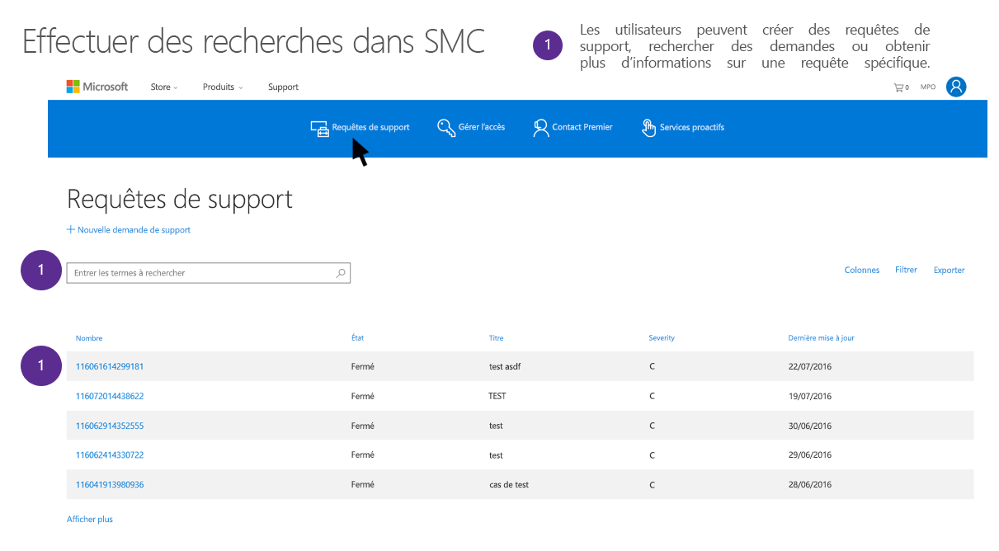

# Demandes des personnes concernées du Support Microsoft et des services professionnels concernant le RGPD et le CCPA

## Présentation des services professionnels Microsoft

Les services professionnels Microsoft sont constitués d’un groupe divers d’architectes techniques, d’ingénieurs, de consultants et de professionnels du support qui se consacrent à remplir la mission de Microsoft consistant à donner aux clients les moyens d’être plus productifs. Notre équipe des services professionnels comprend plus de 21 000 consultants, conseillers numériques, agents de support, ingénieurs et autres commerciaux, opérant dans 191 pays et 46 langues différentes, gérant plusieurs millions d’engagements par mois et interagissant avec les clients et partenaires à l’aide d’outils locaux automatisés basés sur le téléphone, le web et la communauté. L’organisation apporte une grande expertise dans le portefeuille Microsoft, tirant parti d’un important réseau de partenaires, de communautés techniques, d’outils, de diagnostics et de canaux qui nous connectent à nos clients professionnels.

Suivez ce lien pour en savoir plus sur les services professionnels Microsoft, ou accédez à la rubrique consacrée à ceux-ci dans la [page web de la documentation sur la sécurité des services professionnels de Microsoft](https://www.microsoft.com/fr-FR/professionalservices/overview). Le Support Microsoft et les Services professionnels Microsoft prennent au sérieux les obligations imposées par le Règlement général sur la protection des données (RGPD). Les informations contenues dans ce document sont conçues pour répondre aux questions des clients sur la prise en charge de Microsoft et les offres conseils qui répondront aux clients et les aideront en réponse aux obligations de données objet (DSR) sous RGPD.

### Présentation des DPC 

Le RGPD de l’UE permet aux utilisateurs (désignés dans le règlement comme étant les *personnes concernées par le traitement des données*) de gérer les données personnelles collectées par un employeur ou tout autre type d’agence ou organisation (l’*entité de contrôle des données* ou l’*entité de contrôle* uniquement). Les données personnelles sont définies de manière générale dans le cadre du RGPD comme correspondant aux données associées à une personne physique identifiée ou identifiable. Le RGPD octroie aux personnes concernées des droits spécifiques sur leurs données personnelles. Ces droits incluent l’obtention de copies de ces dernières, les demandes de changements, la restriction de leur traitement et leur suppression. Toute demande formelle effectuée par une personne concernée par le traitement des données à une entité de contrôle au sujet de la prise de mesure sur ses données personnelles est appelée *demande de personne concernée* ou DPC. En outre, elle oblige les entreprises travaillant pour le compte d’une entité de contrôle (appelé *responsable du traitement des données* ou tout simplement *responsable du traitement*) d’assister l’entité de contrôle qui répond aux DPC de façon raisonnable.

De même, le CCPA (California Consumer Privacy Act), prévoit des droits de confidentialité et des obligations pour les consommateurs de la Californie, y compris des droits similaires aux droits des personnes concernées du RGPD, tels que le droit de supprimer, d’accéder et de recevoir (portabilité) leurs informations personnelles.  Le CCPA prévoit également des publications d’informations, des protections contre la discrimination des personnes faisant usage de leurs droits et la possibilité d’opter pour ou contre certains transferts de données classés en tant que « ventes ». Les ventes sont largement définies pour inclure le partage de données à des fins importantes. Pour plus d’informations sur le CCPA, voir le [California Consumer Privacy Act](offering-ccpa.md) et le [Forum aux questions California Consumer Privacy Act](ccpa-faq.md).

Ce guide décrit comment rechercher des données personnelles résidant dans des systèmes informatiques Microsoft et ayant pu être collectées pour fournir des offres du support et d’autres services professionnels. Il décrit également comment accéder à ces données et les exploiter.

Lors du développement d’une réponse pour des DPC, il est important que les clients de Microsoft comprennent que les données de support et les données de conseil sont distinctes des données client dans les services en ligne ou d’autres données qu’ils ont pu, eux ou leurs personnes concernées par le traitement des données, fournir à Microsoft. Les outils et processus fournis pour les services en ligne, le tableau de bord Microsoft ou d’autres systèmes Microsoft permettant de répondre aux DPC ne peuvent pas être utilisés pour répondre aux DPC concernant des données personnelles détenues par le support Microsoft ou d’autres services professionnels.

Toutes les demandes doivent être effectués via un représentant du support, comme décrit ci-dessous. Il n’existe actuellement aucun outil en libre-service permettant aux clients d’accéder aux données personnelles au sein des organisations de services professionnels.

#### Vue d’ensemble des processus décrits dans ce guide

- **Découvrir** : utilisez les outils de recherche et de détection pour rechercher plus facilement les données du client qui peuvent faire l’objet d’une demande DPC. Une fois que vous avez collecté les documents susceptibles de répondre à la demande, vous pouvez effectuer une ou plusieurs des actions DPC décrites ci-après. Vous pouvez également décider que la demande ne satisfait pas aux directives de votre organisation en termes de réponse à une demande DPC.
- **Accéder :** récupérez des données à caractère personnel qui résident dans le cloud Microsoft et, si nécessaire, effectuez-en une copie pour la personne concernée.
- **Rectifier :** modifiez ou mettez en œuvre d’autres actions demandées sur les données à caractère personnel, le cas échéant.
- **Limiter** : limiter le traitement des données personnelles en supprimant les licences de différents services Azure ou en désactivant les services souhaités lorsque c’est possible. Vous pouvez également supprimer les données du cloud Microsoft et les conserver localement ou à un autre emplacement.
- **Supprimer :** supprimez définitivement des données à caractère personnel qui résidaient dans le cloud Microsoft.
- **Exporter/Recevoir (Portabilité) :** fournit une copie électronique (dans un format lisible par un ordinateur) des données ou des informations personnelles à la personne concernée. Les informations à caractère personnel sous CCPA englobent toutes les informations relatives à une personne identifiée ou identifiable. Aucune distinction n’est faite entre les rôles privé, public et professionnel d’une personne. Le terme défini « informations personnelles » est à peu près aligné sur celui de « données personnelles » dans le RGPD. Toutefois, le CCPA inclut également les données relatives à la famille et au foyer. Pour plus d’informations sur le CCPA, voir le [California Consumer Privacy Act](offering-ccpa.md) et le [Forum aux questions California Consumer Privacy Act](ccpa-faq.md).

### Terminologie

Vous trouverez ci-dessous les définitions des termes du RGPD utiles pour ce guide :

- **Responsable du traitement des données :** la personne physique ou morale, l’autorité publique, le service ou tout autre organisme qui, seul ou conjointement avec d’autres, détermine les finalités et les moyens du traitement des données à caractère personnel ; lorsque les finalités et les moyens du traitement sont déterminés par la législation de l’Union ou des États membres, le responsable du traitement peut être désigné, ou les critères spécifiques relatifs à sa nomination être définis, par la législation de l’Union ou des États membres.
- **Données personnelles et personne concernée par le traitement des données :** informations relatives à une personne physique identifiée ou identifiable (« la personne concernée par le traitement des données ») ; une personne physique identifiable est une personne qui peut être identifiée, directement ou indirectement, notamment par référence à un identificateur par exemple, un nom, un numéro d’identification, des données de localisation, un identificateur en ligne, ou un ou plusieurs facteurs spécifiques de l’identité physique, physiologique, génétique, mentale, économique, culturelle ou sociale de cette personne physique.
- **Responsable du traitement :** la personne physique ou morale, l’autorité publique, le service ou tout autre organisme qui traite des données personnelles pour le compte de l’entité de contrôle.

#### Définitions et termes supplémentaires pouvant être utiles pour comprendre ce guide

- **Données de support et de conseil** : toutes les données (y compris le texte, le son, la vidéo, les fichiers image ou le logiciel) qui sont fournies à Microsoft par le (ou pour le compte du) client (ou que ce client autorise Microsoft à obtenir d’un service en ligne) via un engagement avec Microsoft pour obtenir un support ou des services professionnels.  Pour être plus précis, ceci n’inclut pas les données collectées où Microsoft est le contrôleur des données, y compris les données de contact du client.
- **Contact client:** données personnelles susceptibles de faire partie de votre relation professionnelle avec Microsoft, telles que les données personnelles contenues dans les informations de contact de votre client. Il peut s’agir de votre nom, de votre adresse de courrier ou du numéro de téléphone de votre CSM, de l’administrateur général ou de l’administrateur informatique d’un service en ligne ou de rôles similaires.
- **Données pseudonymes:** lorsque vous utilisez le support Microsoft pour les produits et services professionnels de Microsoft, Microsoft génère des informations liées à un identificateur numérique Microsoft pour fournir le support. Ce phénomène est souvent appelé «données pseudonymes», bien que ces données ne puissent pas être affectées à un sujet de données spécifique sans utiliser d’informations supplémentaires, certaines d’entre elles peuvent être considérées comme personnelles dans le cadre de la définition de RGPD pour les données personnelles. Dans les services professionnels, les demandes de remplir ou d’aider à satisfaire les DPCs incluent toujours automatiquement les données pseudonymes.

### Comment utiliser ce guide

Ce guide décrit quatre scénarios qu’un client peut rencontrer s’il a utilisé les services professionnels Microsoft.

- **DPC pour un contact client impliquant Microsoft :** explication de la manière dont Microsoft répondra aux demandes provenant d’un contact client ou d’un administrateur informatique d’exercer leurs droits de personnes concernées.
- **DPC pour un client final impliquant Microsoft :** Explication de la manière dont Microsoft répondra aux demandes provenant des employés d’un client ou d’autres personnes concernées d’exercer leurs droits.
- **DPC pour les données de clients fournies : support commercial :** Explication de la manière de recevoir une assistance de Microsoft lorsqu’un client a reçu une demande de son employé ou d’une autre personne concernée par le traitement des données souhaitant exercer ses droits, et que les données personnelles de cette personne concernée par le traitement des données ont été collectées par le support Microsoft pendant un engagement du support.
- **DPC pour les données de clients fournies : services de conseil incluant les services de migration FastTrack :** Explication de la manière de recevoir une assistance de Microsoft lorsqu’un client a reçu une demande de son employé ou d’une autre personne concernée par le traitement des données souhaitant exercer ses droits, et que les données personnelles de cette personne concernée par le traitement des données ont été collectées par le support Microsoft pendant un engagement du support.

## DPC pour un contact client impliquant Microsoft

*Comment Microsoft répond aux demandes d’un contact client ou d’un administrateur informatique d’exercer ses droits de personne concernée.*

Quand un client contacte Microsoft pour recevoir des services de support ou de conseil, le Support Microsoft collecte ou récupère automatiquement à partir des enregistrements du compte les données à caractère personnel du contact client (par exemple, CSM Premier, administrateur général, administrateur informatique). Ces données incluent probablement le nom, l’adresse e-mail et d’autres données à caractère personnel de la personne sollicitant des services de support ou de conseil.

Les données personnelles du contact client font partie des relations professionnelles de Microsoft avec le client, et Microsoft est l’entité de contrôle des données. Microsoft répondra aux DPC du contact client quant à ses données personnelles, qu’il soit encore présent dans l’organisation ou non.

Les clients doivent comprendre que la DPC ne couvre que les données personnelles du Contact Client et qu’aucune modification ni suppression n’est effectuée sur des données du client envoyées dans le cadre d’engagements (par exemple, transcriptions, descriptions de cas, fichiers, produit de travail), car Microsoft est le responsable du traitement des données.  En outre, pour conserver l’enregistrement de l’historique des engagements, aucune modification ne sera effectuée sur des engagements fermés (y compris l’enregistrement indiquant la personne ayant ouvert un engagement).

Lors de la réception d’une requête provenant d’un contact client concernant une DPC, le personnel Microsoft enverra un contact client au [Centre de réponse de confidentialité](https://go.microsoft.com/fwlink/?LinkId=321116). Il s’agit du mécanisme d’entrée principal de Microsoft pour les requêtes et les réclamations en matière de confidentialité. Lors de la réception d’une requête, le Centre de réponse de confidentialité identifiera qu’elle fait partie d’un compte commercial ou organisationnel et y répondra en conséquence.

Pour conserver la continuité des opérations du client, Microsoft ne traitera pas non plus de DPC associée à un engagement tant qu’un contact de remplacement n’aura pas été confirmé. Lors de la confirmation d’un nouveau contact, Microsoft remplacera l’ancien contact par le nouveau dans les engagements ouverts.

Les clients peuvent choisir d’apporter des modifications aux données qu’ils ont collectées pendant les engagements de services professionnels via le support normal ou les canaux de conseil, séparément de cette DPC. Par exemple, Microsoft peut aider à supprimer des engagements de support, sur demande (reportez-vous ci-dessous à la section intitulée *Guide DPC pour des données fournies par le client*).

***Exemple à des fins d’illustration uniquement***

John est administrateur informatique pour un client d’entreprise O365, avec un engagement de support ouvert et deux engagements fermés. John va quitter son entreprise et souhaite supprimer ses données. John contacte le centre de réponse de confidentialité, qui l’identifie comme administrateur informatique. John est informé que son nom ne peut pas être supprimé des engagements (fermés) précédents ou des données des engagements ouverts. Toutefois, le centre de réponse de confidentialité remplacera John en tant que contact sur le ticket ouvert actuel s’il identifie un contact de remplacement. John signale à Microsoft que Jane sera son contact de remplacement, et Microsoft effectue le changement dans tous les systèmes de support.

## DPC pour un utilisateur final contactant Microsoft

*Comment Microsoft répond aux demandes provenant des employés d’un client ou d’autres personnes concernées d’exercer leurs droits.*

Si l’employé d’un client ou une autre personne concernée contacte Microsoft pour exercer ses droits sur les données que Microsoft a collectées en tant que processeur de données, la personne concernée est informée qu’elle doit contacter le client de Microsoft, en tant que contrôleur des données, afin d’exercer ces droits. Microsoft ne prendra aucune mesure supplémentaire.

Si la personne concernée a également contacté Microsoft pour exercer ses droits sur des données collectées par Microsoft dans des situations où Microsoft est le responsable du traitement de données (par exemple, support client, contact de client commercial), Microsoft répond séparément à la demande de droit de la personne concernée pour ces données à caractère personnel.

***Exemple à des fins d’illustration uniquement***

Jane est employée d’un client d’entreprise, Contoso, qui lui a attribué un compte Dynamics 365. Elle contacte Microsoft pour supprimer toutes ses données et est renvoyée au centre de réponse à la confidentialité. Jane remplit le formulaire de demande. Le centre de réponse à la confidentialité l’identifie comme utilisateur final de l’entreprise et lui indique qu’elle doit passer par Contoso pour la suppression de ses données d’entreprise. Ils l’identifient également comme un utilisateur de Microsoft X-Box et suppriment ses données de son compte consommateur Microsoft.

## DPC pour des données fournies par un client : support commercial

*Découvrez comment recevoir une assistance de Microsoft lorsqu’un client a reçu une demande de son employé ou d’une autre personne concernée d’exercer ses droits, et que les données personnelles de cette personne concernée ont été collectées par le support Microsoft pendant un engagement du support.*

Lorsqu’un client interagit avec le support Microsoft, Microsoft collecte les données de support du client afin de résoudre les problèmes nécessitant un engagement de support technique. Ces données de support incluent les interactions de Microsoft avec le client (par exemple, conversation, téléphone, courrier électronique, envoi Web), ainsi que les fichiers de contenu que le client envoie à Microsoft ou que Microsoft a extrait, avec l’autorisation du client, de l’environnement informatique du client ou du client de services en ligne pour résoudre le problème de support. Dans le cadre du support Premier, cela inclut également toutes les données collectées auprès de vous afin d’éviter de futurs problèmes de manière proactive. Toutefois, cela exclut les informations de contact client ou d’autres informations de relation professionnelle de Microsoft avec le client (par exemple, les enregistrements de facturation).

Pour toutes les données de support, Microsoft est le responsable du traitement des données. De ce fait, Microsoft ne répondra pas aux demandes directes provenant de personnes concernées par le traitement des données lorsque ces demandes sont relatives aux données de support fournies lorsqu’elles étaient associées à un client commercial Microsoft. Microsoft collaborera avec le client par le biais de ses canaux de support habituels pour l’aider à répondre aux DPC.

## Étape 1 : Découvrir

La première étape pour obtenir de l’aide de Microsoft en répondant à un DPC consiste à trouver les données personnelles faisant l’objet de la demande. Cette première étape, rechercher et réviser les données personnelles en cause, permet au client de déterminer si un DPC répond aux besoins de l’organisation en matière de respect ou de refus d’un DPC.

Une fois que le client trouve les données, il peut effectuer l’action spécifique pour satisfaire la demande provenant de la personne concernée. Le type d’action que le client tente d’effectuer déterminera le niveau de découverte dans lequel il doit s’engager.

Lorsque Microsoft aide un client à résoudre une DPC, il s’agit d’une fonction d’entreprise, et la demande est effectuée via votre canal de support habituel et non via une demande auprès du centre de réponse de confidentialité.

Lorsqu’il découvre les données pertinentes et obtient l’assistance de Microsoft, un client dispose de plusieurs options pour résoudre la DPC :

*Option A : DPC sur tous les clients du support Microsoft* : appliquez la DPC à toutes les données de support du client dans l’environnement de support Microsoft. Pour ce faire, il suffit que le client demande à Microsoft d’appliquer la DPC à toutes les données de support collectées.

*Option B : engagements de client spécifiques.* Utilisez les systèmes en ligne pour passer en revue les tickets, puis identifiez les engagements spécifiques contenant les données personnelles pertinentes et signalez-les à Microsoft. Microsoft essaiera de fournir une assistance pour effectuer une recherche si le client n’a pas la possibilité d’effectuer une recherche dans les engagements (tickets).

***Une fois que les engagements sont identifiés, demandez d’appliquer la DPC à une partie spécifique de l’enregistrement ou à tout ce qui est lié à cet engagement dans Microsoft.***

Pour identifier des engagements spécifiques, les clients doivent effectuer des recherches dans leurs engagements. Pour les clients Premier, le gestionnaire du service de contrat (« CSM - Contract Service Manager ») d’un client a une visibilité sur toutes les demandes de support (SR - Support Request) qui sont créées dans le cadre de ce calendrier de contrat. Pour les clients non Premier, des portails d’engagement du support sont disponibles (par le biais des zones de support des services en ligne, par exemple).

 Le CSM peut accéder au portail à l’adresse Support.Microsoft.Com ([https://support.microsoft.com/\<localcode de langue\>/premier](https://support.microsoft.com/%3clocal%20language%20code%3e/premier)) (« SMC ») et sélectionnez et examinez des demandes de support. (Remarque : dans l’URL, insérez votre code de langue local).

>[!IMPORTANT]
>En plus de l’historique des cas dans SMC, les clients peuvent également avoir des données personnelles d’un utilisateur final dans des fichiers collectés par Microsoft (ou, avec l’autorisation du client, supprimés du service en ligne) au cours d’un contrat de support. Par exemple, il peut s’agir de copies de boîtes aux lettres Exchange client, d’Azure VMs ou de bases de données. Ces données personnelles peuvent ou non être mentionnées dans l’historique des cas (par exemple, ticket) pour un engagement particulier. Pour réviser ces données, le contact client doit être un contact de demande de prise en charge spécifique authentifié (via AAD ou MSA) qui a reçu une URL pour un espace de travail dans Microsoft support Microsoft Data Transfer and Management Tool (DTM). Un contact client a accès aux fichiers, mais aucun affichage global n’est disponible et SMC n’indique pas si des fichiers existent.

Lorsque les clients ont identifié toutes les données pertinentes dans les tickets de support sélectionnés, les clients peuvent choisir de demander la suppression de tous les éléments liés à un ticket ou d’appliquer de façon sélective la DPC à des instances individuelles des données personnelles.

## Étape 2 : Accéder

Lorsqu’un client a trouvé les données de support contenant les données personnelles pouvant répondre à une DPC, il doit choisir les données personnelles à inclure dans la réponse. Par exemple, le client peut choisir de supprimer les données personnelles concernant d’autres personnes concernées par le traitement des données et toutes les informations confidentielles.

La réponse à la DPC peut inclure une copie du document réel, une version rédigée correctement ou une capture d’écran des parties que le client considère comme pouvant être partagées. Pour chacune de ces réponses à une demande d’accès, le client devra récupérer une copie du document ou tout autre élément contenant les données de réponse.

L’accès aux données personnelles d’un utilisateur final peut provenir d’une mention ou d’une notation dans les différents types de documentation de contenu. Étant donné que les clients peuvent accéder au ticket d’engagement et au contenu, ils peuvent fournir un résumé des données personnelles eux-mêmes sans l’aide de Microsoft.

Dans de rares cas, le client peut avoir besoin des copies des données d’interaction du support (par exemple, des e-mails, des copies transcrites d’enregistrements téléphoniques, des transcriptions de conversation) entre un représentant Microsoft et le représentant du client.  Dans la mesure requise, Microsoft peut fournir des copies rédigées de ces transcriptions en fonction des besoins, du niveau de confidentialité et de la difficulté.

## Étape 3 : Rectifier

Si une personne concernée a demandé au client de rectifier les données personnelles qui résident dans les données de support de son organisation, le client devra déterminer s’il convient d’honorer la demande. Si le client décide d’honorer la demande, il peut demander à Microsoft d’effectuer le changement. Microsoft peut rectifier des données ou supprimer les données du client dans les systèmes de support et demander au client de les renvoyer à Microsoft au format corrigé.

## Étape 4 : Restreindre

À tout moment, le client peut fermer un engagement ou contacter Microsoft et demander de fermer l’engagement.  Un engagement fermé empêchera d’effectuer tout travail.

Pour avoir une garantie supplémentaire, le client peut contacter Microsoft et demander de placer une note dans le système de création de tickets d’engagement, indiquant que le dossier ne doit pas être rouvert pour quelque raison que ce soit sans l’autorisation du client.

Remarque : les engagements (tickets) seront également supprimés en fonction d’un échéancier de rétention et de suppression, en fonction de la sensibilité des données, du service et du système. Si le client a besoin d’une copie des données, il doit s’assurer qu’il a extrait les données avant sa suppression.

## Étape 5 : Supprimer

Le «droit à l’effacement» par la suppression des données personnelles des données client des données support d’une organisation est une protection essentielle du RGPD. La suppression de données personnelles inclut la suppression d’engagements, de documents ou de fichiers complets, ou la suppression de données spécifiques au sein d’un engagement, d’un document ou d’un fichier.

Voici quelques points importants à comprendre sur le fonctionnement de la suppression pour le support Microsoft lorsqu’un client examine des données personnelles ou se prépare à les supprimer en réponse à une DPC.

Chez Microsoft, toutes les données disposent d’une politique de rétention et de suppression qui leur est appliquée et qui varie selon les risques et d’autres facteurs.

Les clients qui demandent la suppression des données personnelles d’une personne concernée par le traitement des données de façon universelle sur les systèmes du support peuvent le faire via votre TAM ou en remplissant une demande de support (SR : Support Request) dans SMC ou un système équivalent. Vous *devez* indiquer qu’il s’agit d’une demande d’assistance concernant une DPC en vertu du RGPD.

*Option A — DPC support technique chez Microsoft*. Pour un système transversal DPC, le client doit fournir les données personnelles dont Microsoft a besoin pour identifier les données requises (par exemple, adresse de messagerie, numéro de téléphone). Microsoft ne mettra pas en corrélation ou ne recherchera pas les enregistrements et effectuera uniquement des recherches directement sur les identificateurs fournis par le client. Lorsque des données sont trouvées, Microsoft supprime tous les engagements et toutes les données associées.

> Remarque importante : cela peut entraîner la perte d’enregistrements historiques importants pour l’organisation du client.

*Option B : engagements de client spécifiques*. Pour les engagements spécifiques que le client a identifiés et qu’il souhaite supprimer, ne supprimez pas les tickets de SMC. Ainsi, les données personnelles restent dans les journaux et les systèmes en aval, qui ne peuvent pas être supprimés dans le délai nécessaire. Au lieu de cela, identifiez le ticket ou les données personnelles dans le ticket qui doit être supprimé, et contactez le support Microsoft pour vous aider à supprimer ces données.

### Instructions relatives à l’outil de gestion et de transfert des données du support Microsoft (DTM)

Pour toutes ces recherches, Microsoft n’effectuera pas de recherches dans DTM en raison du niveau de confidentialité potentiel du contenu des fichiers. Toutefois, si le client le souhaite, Microsoft supprimera tous les fichiers contenus dans le DTM associé au compte du client. En raison du grave impact sur le client, Microsoft exige une demande distincte du client spécifiant la suppression des fichiers DTM.

- Pour les dossiers ouverts, le contact client peut accéder au DTM et supprimer des fichiers.
- Pour les dossiers fermés avant 90 jours, une demande doit être effectuée auprès d’un responsable technique de compte ou dans une SR pour supprimer les fichiers.
- Pour les dossiers fermés après 90 jours, les fichiers ont déjà été supprimés automatiquement.
- Même si les données personnelles ont été localisées dans un seul fichier qui a été supprimé, les clients doivent quand même demander à Microsoft d’effectuer une vérification des données personnelles sur les systèmes car certaines d’entre elles peuvent avoir été supprimées dans DTM pendant le support.

## Étape 6 : Exporter

Le « droit à la portabilité des données » permet à une personne concernée d’obtenir une copie de ses données personnelles dans un format électronique et de demander à votre organisation de les transmette à un autre contrôleur. Dans le cas des données de support, les informations utilisables détenues par Microsoft seraient sous la forme d’informations d’engagement ou de fichiers pouvant vous être renvoyés pour une nouvelle communication ou un chargement vers un autre contrôleur.

Remarque : les données exportées peuvent ne pas inclure la propriété intellectuelle de Microsoft ou les données qui peuvent compromettre la sécurité ou la stabilité du service.

***Exemple à des fins d’illustration uniquement***

Jean est un gestionnaire du service de contrat Premier pour un client d’entreprise, Contoso, qui utilise Office 365 pour sa messagerie d’employé et Azure pour héberger une base de données SQL Contoso. Contoso a plusieurs tickets ouverts et fermés. Récemment, le support Microsoft, avec l’autorisation de Contoso, a déplacé une copie de la base de données SQL dans DTM pour le support et le dépannage.

Jean reçoit une DPC de Marie lui demandant de supprimer toutes ses données. Jean accède à SMC et effectue des recherches dans les engagements pour identifier que Jane a eu des problèmes de comptes de messagerie qui ont été référencés dans deux tickets par nom et adresse e-mail. Il contacte son responsable technique de compte, lui donne le nom et l’adresse e-mail de Marie comme identificateur, et demande que ces deux tickets soient supprimés, ainsi que toutes les données en aval ayant pu être générées à partir de ces tickets.

Il soupçonne également qu’il a été impliqué dans une conversation avec des membres du personnel du support où il mentionne Jane, donc il demande que le journal de la conversation soit supprimé.

Il sait également que les données personnelles de Marie se trouvent dans la base de données SQL. Étant donné que la machine virtuelle SQL a été déplacée dans DTM il y a moins de 90 jours, il demande séparément à son responsable technique de compte de l’aider à supprimer immédiatement la base de données de DTM.

Enfin, étant donné qu’il sait que des données ont pu être supprimées du fichier DTM tout en assurant la prise en charge, il demande à Microsoft d’effectuer une vérification au sein des systèmes informatiques à la recherche des données personnelles de Marie dans la base de données SQL.

Le support Microsoft effectue toutes ces suppressions et, en fonction de la demande du client, le responsable technique de compte lui fournit un document attestant que les données requises ont été supprimées.

## DPC pour des données fournies par un client : services de conseil incluant les services de migration

*Découvrez comment recevoir une assistance de Microsoft lorsqu’un client a reçu une demande de son employé ou d’une autre personne concernée d’exercer ses droits, et que les données personnelles de cette personne concernée ont été collectées par Microsoft pendant un engagement du conseil.*

## Microsoft Consulting Services

Pour les engagements de Microsoft Consulting Services où l’Addendum de protection des données des services professionnels de Microsoft (<https://aka.ms/professionalservicesdpa>) s’applique.

Microsoft est le contrôleur des données du contact client qui travaille avec l’équipe de l’engagement. Ces personnes doivent contacter le [Centre de réponse de confidentialité](https://go.microsoft.com/fwlink/?LinkId=321116) pour respecter les droits de personne concernée.

Microsoft est le responsable du traitement des données pour une DPC se trouvant dans des données fournies pendant un engagement de conseil. Le client doit contacter le gestionnaire de l’engagement pour mettre en place un plan permettant de répondre à une DPC en fonction des données collectées puis du type spécifique de services de conseil fournis. Selon que votre demande constitue un niveau d’effort généralement vu dans un engagement de Microsoft Consulting Services, une tâche supplémentaire peut être requise. Par ailleurs, les données personnelles seront supprimées après chaque engagement de conseil dans un délai qui dépendra du type d’engagement de conseil. Le client peut demander de supprimer des données avant le délai établi et demander une attestation de suppression.

## Services Microsoft FastTrack

[Microsoft FastTrack](https://na01.safelinks.protection.outlook.com/?url=https%3A%2F%2Ffasttrack.microsoft.com%2Fabout&data=02%7C01%7C%7Cd0521d8739c841df674508d596834585%7C72f988bf86f141af91ab2d7cd011db47%7C1%7C0%7C636580412901207944&sdata=PO5eh56pm9IYk5Y%2Ff%2F31e%2BRVPmrC2Qi%2FCsw1NphR8gY%3D&reserved=0) fournit des services de conseil informatique aux organisations afin de les aider à intégrer et utiliser des services de cloud computing Microsoft tels que Microsoft 365, Azure et Dynamics 365.

Microsoft est le contrôleur des données des contacts client travaillant avec l’équipe FastTrack. Si des contacts client souhaitent accéder à des informations de contact, les réviser ou les supprimer à partir d’enregistrements de Microsoft FastTrack, les clients peuvent demander à la personne concernée d’envoyer la demande directement à la boîte de réception de la demande RGPD FastTrack Office 365 \<<o365ftgdpr@microsoft.com>\>.

Pour les services de migration FastTrack, Microsoft est le responsable du traitement des données. Conformément à notre déclaration de confidentialité supplémentaire relative à FastTrack, toutes les données en cours de migration sont considérées comme des « données de migration ». Si vous devez exécuter des demandes de personnes concernées tandis que votre organisation est engagée dans un projet de migration FastTrack, une attention spéciale est nécessaire.
  
Si vous devez traiter des demandes d’accès, de rectification ou d’exportation de DPC alors que les données d’un utilisateur sont traitées via les systèmes de migration FastTrack, il incombe au client de répondre à ce DPC via les systèmes sources existants dans lesquels les données utilisateur sont stockées. Lorsque la migration de l’utilisateur est terminée et que les données ont été déplacées vers le service Cloud Microsoft de destination, les conseils fournis par Microsoft sur la façon dont les clients peuvent utiliser les produits, services et outils d’administration de Microsoft pour rechercher et agir sur des données personnelles pour répondre à une demande d’objet de données s’appliqueront. Pour consulter ces recommandations, voir[demandes d’objet de données pour le RGPD](https://docs.microsoft.com/microsoft-365/compliance/gdpr-data-subject-requests). 

Si vous devez supprimer un compte d’utilisateur en réponse à une demande de personne concernée tandis que votre organisation est engagée dans un projet de migration FastTrack en cours, vous devez savoir que les systèmes de migration peuvent conserver une copie des données de migration de l’utilisateur pendant une certaine période après la fin de la migration de cet utilisateur. La suppression du compte d’utilisateur ne supprime pas automatiquement ces données de migration d’utilisateur stockées dans des systèmes de migration FastTrack. Si vous souhaitez que l’équipe Microsoft FastTrack supprime des données de migration d’utilisateur, vous pouvez [envoyer une demande](https://go.microsoft.com/fwlink/?linkid=874544). Dans le cours normal de nos activités, Microsoft FastTrack supprime toutes les copies des données une fois que la migration de votre organisation est terminée.

## Autres services de conseil

Si un client reçoit d’autres services professionnels via Microsoft, il doit collaborer avec l’équipe de l’engagement pour respecter toutes les exigences du RGPD. Si l’équipe de l’engagement n’est pas en mesure de fournir des instructions claires sur l’exécution d’une DPC en vertu du RGPD, les clients peuvent contacter le [Centre de réponse de confidentialité](https://go.microsoft.com/fwlink/?LinkId=321116) pour obtenir de l’aide.
