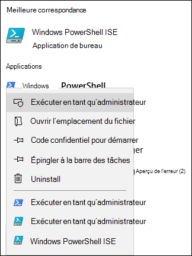
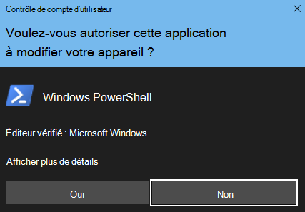

# <a name="fasttrack-migration-toolset-for-submitting-delete-request"></a>Ensemble d’outils de migration FastTrack pour envoyer une demande de suppression

## <a name="toolset-purpose"></a>Objectif de l’ensemble d’outils

Si vous êtes un client actuellement engagé dans les migrations FastTrack, la suppression du compte d’utilisateur n’entraîne pas la suppression de la copie des données détenue par l’équipe Microsoft FastTrack, conservée dans le seul but d’exécuter la migration. Si, lors de la migration, vous souhaitez que l’équipe Microsoft FastTrack supprime également la copie des données, envoyez une demande via cet ensemble d’outils. Dans le cours normal des activités, Microsoft FastTrack supprimera toutes les copies de données une fois la migration terminée.

### <a name="supported-platforms"></a>Plateformes prises en charge

Microsoft prend en charge la version initiale de cet ensemble d’outils dans la console PowerShell et la plateforme Windows. Les plateformes connues suivantes sont prises en charge par cet ensemble d’outils :

***Tableau 1 : plateformes prises en charge par cet ensemble d’outils***

****

|Version de PowerShell|Windows 7|Windows 8|Windows 10|Windows Server 2012|Windows Server 2016|
|:---:|:---:|:---:|:---:|:---:|:---:|
|5.0|Non pris en charge|Pris en charge|Pris en charge|Pris en charge|Pris en charge|
|5.1|Non pris en charge|Pris en charge|Pris en charge|Pris en charge|Pris en charge|
|

### <a name="obtaining-the-toolset"></a>Obtention de l’ensemble d’outils

Cet ensemble d’outils est disponible dans la galerie PowerShell sur l’application console PowerShell. Pour rechercher et charger ce module de cmdlet, ouvrez tout d’abord PowerShell en mode administrateur afin d’être autorisé à installer le module. Si vous n’avez jamais utilisé PowerShell, accédez à la barre des tâches Windows et saisissez « PowerShell » dans la zone de recherche. Faites un clic droit sur l’application console pour la sélectionner, choisissez **Exécuter en tant qu’administrateur**, puis cliquez sur **Oui** pour exécuter Windows PowerShell.





Maintenant que la console est ouverte, vous devez créer des autorisations pour l’exécution du script. Pour autoriser l’exécution des scripts, tapez la commande suivante :

```powershell
Set-ExecutionPolicy -ExecutionPolicy Bypass -Scope Process
```

Vous serez invité à confirmer cette action, car l’administrateur peut modifier l’étendue à sa guise.

***Définir la stratégie d’exécution***


Maintenant que la console est configurée pour autoriser le script, exécutez la commande suivante pour installer le module :

```powershell
Install-Module -Name Microsoft.FastTrack -Repository PSGallery -WarningAction SilentlyContinue -Force
```

### <a name="prerequisites-for-module"></a>Conditions préalables pour le module

Pour exécuter correctement ce module, vous devrez peut-être installer des modules dépendants si ce n’est pas déjà fait. Vous devrez peut-être redémarrer PowerShell.

Pour envoyer une DPC, vous devez d’abord vous connecter à l’aide de vos informations d’identification Office 365. Entrer les informations d’identification correctes valide l’état de votre administrateur général et recueille les informations sur le client.

```powershell
Login-FastTrackAccount -ApiKey <API Key provided by FastTrack MVM>
```

Une fois que vous êtes connecté, les identifiants et la clé sont stockés pour être utilisés avec les modules FastTrack pendant le reste de la session PowerShell actuelle.

Si vous avez besoin de vous connecter à un environnement cloud autre que commercial, vous devrez ajouter *-Environment* à la commande *Login* avec l’un des environnements valides suivants :

- AzureCloud
- AzureChinaCloud
- AzureGermanCloud
- AzureUSGovernmentCloud

```powershell
Login-FastTrackAccount -ApiKey <API Key provided by FastTrack MVM> -Environment <cloud environment>
```

Pour envoyer une demande DPC, exécutez la commande suivante :

```powershell
Submit-FastTrackGdprDsrRequest -DsrRequestUserEmail SubjectUserEmail@mycompany.com
```

En cas de réussite, l’applet de commande renvoie un objet d’ID de transaction. Veuillez conserver l’ID de transaction.

#### <a name="checking-the-status-of-a-request-transaction"></a>Vérification de l’état de transaction d’une demande

Exécutez la fonction suivante en utilisant l’ID de transaction précédemment obtenu :

```powershell
Get-FastTrackGdprDsrRequest -TransactionID "YourTransactionID"
```

#### <a name="transaction-status-codes"></a>Codes d’état de transaction

|Transaction|Statut|
|---|---|
|**Créée**|Une demande a été créée.|
|**Échec**|Échec de la création de la demande : renvoyez-la ou contactez le support technique.|
|**Terminée**|Demande terminée et purgée.|
|

<!-- original version: **Created**  Request has been created<br/>**Failed** Request failed to create, please resubmit, or contact support<br/>**Completed** Request has been completed and sanitized -->

## <a name="learn-more"></a>En savoir plus

[Centre de gestion de la confidentialité Microsoft](https://www.microsoft.com/trust-center/privacy/gdpr-overview)
