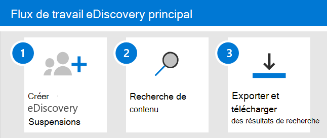

# Mise en place de core eDiscovery dans Microsoft 365

Core eDiscovery dans Microsoft 365 fournit un outil eDiscovery de base que les organisations peuvent utiliser pour rechercher et exporter du contenu dans Microsoft 365 et Office 365. Vous pouvez également utiliser core eDiscovery pour placer une boîte aux lettres eDiscovery en attente sur des emplacements de contenu, tels que des boîtes aux lettres Exchange, des sites SharePoint, des comptes OneDrive et des Microsoft Teams. Rien n’est nécessaire pour déployer core eDiscovery, mais un administrateur informatique et un responsable eDiscovery doivent effectuer certaines tâches préalables avant que votre organisation puisse commencer à utiliser core eDiscovery pour rechercher, exporter et conserver du contenu.

Cet article décrit les étapes nécessaires pour configurer Core eDiscovery. Cela inclut la garantie de la licence appropriée requise pour accéder à Core eDiscovery et placer une mise en attente eDiscovery sur les emplacements de contenu, ainsi que l’attribution d’autorisations à votre équipe de l’information, juridique et d’examen afin qu’elle puisse accéder aux cas et les gérer. Cet article fournit également une vue d’ensemble de l’utilisation des cas de recherche et d’exportation de contenu.

## Étape 1 : Vérifier et attribuer les licences appropriées

La gestion des licences pour core eDiscovery nécessite l’abonnement d’organisation et la licence par utilisateur appropriés.

- **Abonnement à l’organisation :** Pour accéder à core eDiscovery dans le Centre de conformité Microsoft 365 ou le Centre de conformité Office 365 Security & et utiliser les fonctionnalités de mise en attente et d’exportation, votre organisation doit avoir un abonnement Microsoft 365 E3 ou Office 365 E3 ou supérieur.

- **Licences par utilisateur :** Pour placer une boîte aux lettres et des sites en attente eDiscovery, un utilisateur doit se voir attribuer l’une des licences suivantes, en fonction de l’abonnement de votre organisation :

  - Une licence Microsoft 365 E3 ou Office 365 E3 ou supérieure

   OU

  - Office 365 Licence E1 avec une licence Exchange Online Plan 2 ou Archivage Exchange Online licence de modules logiciels

  AND

  - Office 365 Licence E1 avec une licence de module SharePoint Online Plan 2 ou OneDrive Entreprise Plan 2
  
  Pour plus d’informations sur l’attribution de licences, voir [Attribuer des licences aux utilisateurs.](../admin/manage/assign-licenses-to-users.md)

Pour plus d’informations sur la gestion des licences :

- Téléchargez et consultez la solution « Découvrir & répondre » dans la comparaison des licences [Microsoft 365 conformité.](/office365/servicedescriptions/downloads/microsoft-365-compliance-licensing-comparison.xlsx)

- Consultez la description du service centre & conformité de [sécurité.](/office365/servicedescriptions/office-365-platform-service-description/office-365-securitycompliance-center)

## Étape 2 : Attribuer des autorisations eDiscovery

Pour accéder à Core eDiscovery ou être ajouté en tant que membre d’un cas core eDiscovery, un utilisateur doit avoir les autorisations appropriées. Plus précisément, un utilisateur doit être ajouté en tant que membre du groupe de rôles Gestionnaire eDiscovery dans le Centre de sécurité & conformité Office 365. Les membres de ce groupe de rôles peuvent créer et gérer des cas eDiscovery principaux. Ils peuvent ajouter et supprimer des membres, placer une mise en attente eDiscovery sur les utilisateurs, créer et modifier des recherches et exporter du contenu à partir d’un cas core eDiscovery.

Pour ajouter des utilisateurs au groupe de rôles Gestionnaire eDiscovery, complétez les étapes suivantes :

1. Go to [https://protection.office.com/permissions](https://protection.office.com/permissions) and sign in using the credentials for an admin account in your Microsoft 365 or Office 365 organization.

2. Dans la page **Autorisations,** sélectionnez le groupe de rôles **Gestionnaire eDiscovery.**

3. Dans la page volante du Gestionnaire  eDiscovery, cliquez sur Modifier à côté de la section Gestionnaire **eDiscovery.**

4. Dans la page **Choisir le gestionnaire eDiscovery** dans l’Assistant Modifier le groupe de rôles, cliquez sur **Choisir gestionnaire de découverte.**

5. Cliquez **sur** Ajouter, puis cochez la case pour tous les utilisateurs que vous souhaitez ajouter au groupe de rôles.

6. Cliquez **sur** Ajouter pour ajouter les utilisateurs sélectionnés, puis cliquez sur **Terminé.**

7. Cliquez **sur Enregistrer** pour ajouter les utilisateurs au groupe de rôles, puis cliquez sur **Fermer** pour terminer l’étape.

### Plus d’informations sur le groupe de rôles Gestionnaire eDiscovery

Il existe deux sous-groupes dans le groupe de rôles Gestionnaire eDiscovery. Ces sous-groupes ont différents rôles.

- **Gestionnaire eDiscovery :** peut afficher et gérer les cas eDiscovery principaux qu’ils créent ou dont ils sont membres. Si un autre gestionnaire eDiscovery crée un cas mais n’ajoute pas un deuxième gestionnaire eDiscovery en tant que membre de ce cas, le deuxième gestionnaire eDiscovery ne sera pas en mesure d’afficher ou d’ouvrir le cas sur la page eDiscovery principale dans le centre de conformité. En règle générale, la plupart des membres de votre organisation peuvent être ajoutés au sous-groupe gestionnaire eDiscovery.

- **Administrateur eDiscovery**: peut effectuer toutes les tâches de gestion des cas qu’un gestionnaire eDiscovery peut effectuer. De plus, un administrateur de découverte électronique peut :

  - Afficher tous les cas répertoriés sur la page eDiscovery principale.
  
  - Gérer tous les cas au sein l’organisation après s’être ajouté en tant que membre du cas.

  - Accéder et exporter des données de cas pour tout cas au sein de l’organisation.

  En raison de l’étendue de l’accès, une organisation ne doit avoir que quelques administrateurs membres du sous-groupe administrateurs eDiscovery.

Pour plus d’informations sur les autorisations eDiscovery et une description de chaque rôle attribué au groupe de rôles Gestionnaire eDiscovery, voir Attribuer des [autorisations eDiscovery.](assign-ediscovery-permissions.md)

## Étape 3 : Créer un cas de découverte électronique principale

L’étape suivante consiste à créer un cas et à commencer à utiliser Core eDiscovery. Pour créer un cas et ajouter des membres, complétez les étapes suivantes. L’utilisateur qui crée le cas est automatiquement ajouté en tant que membre.

1. Go to [https://compliance.microsoft.com](https://compliance.microsoft.com) and sign in using the credentials for a user account that has been assigned the appropriate eDiscovery permissions. Les membres du groupe de rôles Gestion de l’organisation peuvent également créer des cas eDiscovery principaux.

2. Dans le volet de navigation gauche du centre de conformité Microsoft 365, cliquez sur Afficher **tout,** puis sur **eDiscovery > Core**.

3. Dans la page **Core eDiscovery,** cliquez **sur Créer un cas.**

4. Dans la page **du nouveau volant de** cas, nommez le cas (obligatoire), puis tapez une description facultative. Le nom de cas doit être unique dans votre organisation.

5. Cliquez **sur Enregistrer** pour créer le cas.

   Le nouveau cas est créé et affiché sur la page Core eDiscovery. Vous de devez peut-être cliquer **sur Actualiser** pour afficher le nouveau cas.

## Étape 4 (facultative) : ajouter des membres à un cas core eDiscovery

Si vous créez un cas à l’étape 3 et que vous êtes la seule personne à utiliser le cas, vous n’avez pas besoin d’effectuer cette étape. Vous pouvez commencer à utiliser le cas pour créer des conserves eDiscovery, rechercher du contenu et exporter des résultats de recherche. Effectuez cette étape si vous souhaitez accorder à d’autres utilisateurs (ou groupes de rôles) l’accès au cas.

1. Dans la page **Core eDiscovery** du centre Microsoft 365 conformité, cliquez sur le nom du cas à ajouter.

2. Dans la page d’accueil du cas, sélectionnez **l’onglet Paramètres,** puis sélectionnez Autorisations & **accès.**

3. Dans la page **& autorisations** d’accès, sous  **Membres,** cliquez sur Ajouter pour ajouter des membres au cas.

    Vous pouvez également choisir d’ajouter des groupes de rôles en tant que membres d’un cas. Sous **Groupes de rôles,** cliquez sur **Ajouter.** Vous pouvez uniquement affecter les groupes de rôles dont vous êtes membre à un cas. En raison du fait que les groupes de rôles contrôlent qui peut affecter des membres à un cas eDiscovery.

4. Dans la liste des personnes ou des groupes de rôles qui peuvent être ajoutés en tant que membres du cas, cliquez à gauche du nom des personnes (ou groupes de rôles) que vous souhaitez ajouter. Si vous avez une liste importante de personnes ou de  groupes de rôles qui peuvent être ajoutés en tant que membres, utilisez la zone de recherche pour rechercher une personne ou un groupe de rôles spécifique dans la liste.
  
5. Après avoir sélectionné les personnes ou les groupes de rôles à ajouter en tant que membres du cas, cliquez sur **Enregistrer** pour enregistrer les nouveaux membres ou groupes de rôles.

## Explorer le flux de travail eDiscovery principal

Pour commencer à utiliser la découverte électronique principale, voici un flux de travail simple qui vous permet de créer des holds eDiscovery pour les personnes qui vous intéressent, de rechercher du contenu pertinent pour votre examen, puis d’exporter ces données pour une révision plus approfondie. Dans chacune de ces étapes, nous allons également mettre en évidence certaines fonctionnalités eDiscovery principales étendues que vous pouvez explorer.

1. **[Créer une attente eDiscovery](create-ediscovery-holds.md)**. La première étape après la création d’un cas consiste à placer une mise en attente (également appelée mise en attente *eDiscovery)* sur les emplacements de contenu des personnes qui vous intéressent dans votre enquête. Les emplacements de contenu incluent Exchange boîtes aux lettres, des sites SharePoint, des comptes OneDrive, ainsi que les boîtes aux lettres et les sites associés à Microsoft Teams et Office 365 groupes. Bien que cette étape soit facultative, la création d’une conservation eDiscovery conserve le contenu qui peut être pertinent pour le cas pendant l’examen. Lorsque vous créez une conservation eDiscovery, vous pouvez conserver tout le contenu dans des emplacements de contenu spécifiques ou créer une conservation basée sur une requête pour conserver uniquement le contenu qui correspond à une requête de conservation. En plus de préserver le contenu, une autre bonne raison de créer des conservations eDiscovery consiste à rechercher rapidement les emplacements de contenu en attente (au lieu de devoir sélectionner chaque emplacement à rechercher) lorsque vous créez et exécutez des recherches à l’étape suivante. Une fois que vous avez terminé votre enquête, vous pouvez libérer toute mise en attente que vous avez créée.

2. **[Rechercher du contenu.](search-for-content-in-core-ediscovery.md)** Après avoir créé des conserver eDiscovery, utilisez l’outil de recherche intégré pour rechercher les emplacements de contenu en attente. Vous pouvez également rechercher dans d’autres emplacements de contenu des données qui peuvent être pertinentes pour le cas. Vous pouvez créer et exécuter différentes recherches associées au cas. Vous utilisez des mots clés,  des propriétés et des conditions pour créer des requêtes de recherche qui retournent des résultats de recherche avec les données les plus susceptibles d’être pertinentes pour le cas. Vous pouvez également :

   - Afficher les statistiques de recherche qui peuvent vous aider à affiner une requête de recherche pour affiner les résultats.

   - Affichez un aperçu des résultats de la recherche pour vérifier rapidement si les données pertinentes sont trouvées.

   - Révisez une requête et réexécutez la recherche.

3. **[Exporter et télécharger les résultats de recherche.](export-content-in-core-ediscovery.md)** Une fois que vous avez recherché et trouvé des données pertinentes pour votre enquête, vous pouvez les exporter hors Office 365 pour révision par des personnes extérieures à l’équipe d’examen. L’exportation des données est un processus en deux étapes. La première étape consiste à exporter les résultats d’une recherche en cas de non-Office 365. Pour ce faire, copiez les résultats d’une recherche dans un emplacement stockage Azure Microsoft. L’étape suivante consiste à utiliser l’outil d’exportation eDiscovery pour télécharger le contenu sur un ordinateur local. Outre les fichiers de données exportés, le contenu du package d’exportation contient également un rapport d’exportation, un rapport de synthèse et un rapport d’erreurs.
