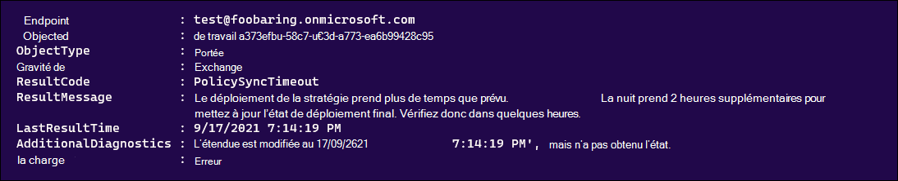
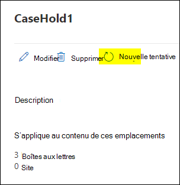

# <a name="troubleshoot-ediscovery-hold-errors"></a>Résoudre les erreurs de mise en suspens de la découverte électronique

Cet article traite des problèmes courants qui peuvent se produire avec les conserves eDiscovery et explique comment les résoudre. L’article inclut également des pratiques recommandées pour vous aider à atténuer ou à éviter ces problèmes.

## <a name="recommended-practices"></a>Pratiques recommandées

Pour réduire le nombre d’erreurs liées aux conserves eDiscovery, nous vous recommandons les pratiques suivantes :

- Si une distribution de la mise en attente est toujours en attente, avec l’un ou l’autre état, patientez jusqu’à ce que la distribution de la mise en attente soit `On (Pending)` terminée avant d’effectuer d’autres mises à `Off (Pending)` jour.

- Vérifiez si une stratégie de mise en attente est en attente avant d’y apporter d’autres mises à jour. Exécutez les commandes suivantes ou enregistrez-les dans un script PowerShell.

    ```powershell
    $status = Get-CaseHoldPolicy -Identity <policyname> -DistributionDetail
    if($status.DistributionStatus -ne "Pending"){
        # policy no longer pending
        Set-CaseHoldPolicy -Identity <policyname> -AddExchangeLocation $user1
    }else{
        # policy still pending
        Write-Host "Hold policy still pending."
    }
   ```

- Fusionnez vos mises à jour dans une mise en attente eDiscovery dans une seule demande en bloc au lieu de mettre à jour la stratégie de mise à jour à plusieurs reprises pour chaque transaction. Par exemple, pour ajouter plusieurs boîtes aux lettres utilisateur à une stratégie de blocage existante à l’aide de la cmdlet [Set-CaseHoldPolicy,](/powershell/module/exchange/set-caseholdpolicy) exécutez la commande (ou ajoutez-la en tant que bloc de code à un script) afin qu’elle ne s’exécute qu’une seule fois pour ajouter plusieurs utilisateurs.

  **Correct**

    ```powershell
    Set-CaseHoldPolicy -Identity "policyname" -AddExchangeLocation "User1", "User2", "User3", "User4", "User5"
    ```

   **Incorrect**

    ```powershell
    $users = "User1", "User2", "User3", "User4", "User5"
    ForEach($user in $users)
    {
        Set-CaseHoldPolicy -Identity "policyname" -AddExchangeLocation $user
    }
    ```

   Dans l’exemple incorrect précédent, la cmdlet est exécuté cinq fois distinctement pour effectuer la tâche. Pour plus d’informations sur les pratiques recommandées pour ajouter des utilisateurs à une stratégie de attente, consultez la section [Plus d’informations.](#more-information)

- Avant de contacter le Support Microsoft à propos des problèmes de mise en attente eDiscovery, vérifiez ce qui provoque l’échec de la stratégie en vérifiant distributionResults, en fonction de ResultCode :

   ```powershell
   Get-CaseHoldPolicy -Identity "policyname" -DistributionDetail | Select -ExpandProperty DistributionResults
   ```

   

## <a name="error-policysynctimeout"></a>Erreur : PolicySyncTimeout

Si vous voyez cette erreur dans **ResultCode: PolicySyncTimeout** et dans le message d’erreur suivant, vérifiez le LastResultTime pour voir si cela fait plus de deux heures que la synchronisation a atteint le délai d’arrêt.

> Le déploiement de la stratégie prend plus de temps que prévu. La mise à jour de l’état de déploiement final peut prendre 2 heures supplémentaires. Vérifiez donc dans quelques heures.

### <a name="resolution"></a>Résolution

**L’exécution de Set-CaseHoldPolicy -Identity « policyname » -RetryDistribution** résoudra le problème.

   ```powershell
   Set-CaseHoldPolicy "policyname" -RetryDistribution
   ```

Dans la page de la Centre de conformité Microsoft 365, vous pouvez également redéployer la stratégie en cliquant sur **Réessayer.**



## <a name="error-policynotifyerror"></a>Erreur : PolicyNotifyError

Si vous voyez cette erreur dans **resultCode: PolicyNotifyError** et le message d’erreur suivant, un problème de centre de données a interrompu la synchronisation de stratégie.

> La stratégie ne peut pas être déployée sur la source de contenu en raison d’un problème Office 365 de centre de données temporaire. La stratégie actuelle n’est appliquée à aucun contenu de la source, donc le déploiement bloqué n’a aucun impact. Pour résoudre ce problème, essayez de redéployer la stratégie.

### <a name="resolution"></a>Résolution

**L’exécution de Set-CaseHoldPolicy -Identity « policyname » -RetryDistribution** résoudra le problème.

   ```powershell
   Set-CaseHoldPolicy "policyname" -RetryDistribution
   ```

Dans la page de la Centre de conformité Microsoft 365, vous pouvez également redéployer la stratégie en cliquant sur **Réessayer.**


## <a name="error-internalerror"></a>Erreur : InternalError

Si vous voyez cette erreur dans **resultCode: InternalError** et le message d’erreur suivant, ce problème doit être résolu par Microsoft.

> Le déploiement de stratégie a été interrompu par un Office 365 de centre de données inattendu. Veuillez contacter le support Microsoft pour résoudre le problème de déploiement.

### <a name="resolution"></a>Résolution

Contactez le Support Microsoft avec les informations suivantes :

- Nom de la stratégie
- Service ou fonctionnalité Microsoft 365
- Code de résultat
- Message de résultat
- Diagnostics supplémentaires

## <a name="error-failedtoopencontainer"></a>Erreur : FailedToOpenContainer

Si vous voyez cette erreur dans **resultCode: FailedToOpenContainer** et le message d’erreur suivant lors de la mise en attente des dépositaires et des sources de données, utilisez les étapes de résolution pour résoudre le problème.

> La boîte aux lettres ou SharePoint site web n’existe peut-être pas.  Si ce n’est pas le cas, contactez le support Microsoft.  Dans le cas contraire, supprimez-la de cette stratégie.

### <a name="resolution"></a>Résolution

- Exécutez [Get-Mailbox](/powershell/module/exchange/get-mailbox) dans Exchange Online PowerShell pour vérifier si la boîte aux lettres utilisateur existe dans votre organisation.

- Exécutez la cmdlet [Get-SPOSite](/powershell/module/sharepoint-online/get-sposite) dans SharePoint Online PowerShell pour vérifier si le site existe dans votre organisation.

- Vérifiez si l’URL du site a changé.

- Supprimez la boîte aux lettres ou le site de la stratégie, si l’objet n’existe pas.

## <a name="error-siteinreadonlyornotaccessible"></a>Erreur : SiteInReadonlyOrNotAccessible

Si vous voyez cette erreur dans **ResultCode : SiteInReadonlyOrNotAccessible** et le message d’erreur suivant, le site SharePoint est en mode lecture seule.

> Le site SharePoint est accessible en lecture seule ou inaccessible. Veuillez contacter l’administrateur du site pour rendre le site accessible en ligne, puis redéployer cette stratégie.

### <a name="resolution"></a>Résolution

Déverrouillez le site (ou demandez à un administrateur de le déverrouiller) pour résoudre ce problème. Pour en savoir plus sur la modification de l’état de verrouillage d’un site, voir [Verrouiller et déverrouiller des sites.](/sharepoint/manage-lock-status)

## <a name="error-siteoutofquota"></a>Erreur : SiteOutOfQuota

Si vous voyez cette erreur dans **ResultCode: SiteOutOfQuota** et le message d’erreur suivant, le site SharePoint a atteint son quota de stockage.

> Le SharePoint site n’a pas un quota suffisant. Allouez davantage de quotas à la collection de sites, puis redéployer cette stratégie.

### <a name="resolution"></a>Résolution

Ajoutez davantage de stockage au site (ou demandez à un administrateur d’ajouter davantage de stockage) à la collection de sites. Pour en savoir plus sur la gestion des quotas de stockage pour un site, voir Gérer les [limites de stockage des collections de sites.](/sharepoint/manage-site-collection-storage-limits)

Une fois le quota de stockage ajouté au site, la stratégie doit être redéployée.

   ```powershell
   Set-CaseHoldPolicy "policyname" -RetryDistribution
   ```

Dans la page de la Centre de conformité Microsoft 365, vous pouvez également redéployer la stratégie en cliquant sur **Réessayer.**


## <a name="error-recipienttypenotallowed"></a>Erreur : RecipientTypeNotAllowed

Si vous voyez cette erreur dans **resultCode: RecipientTypeNotAllowed** et le message d’erreur suivant, un emplacement Exchange qui est une boîte aux lettres est affecté à la stratégie.

> Le type de destinataire n’est pas autorisé pour les conserves.

### <a name="resolution"></a>Résolution

Exécutez [l’adresse Get-Recipient](/powershell/module/exchange/get-recipient) Exchange Online PowerShell pour vérifier si l’adresse dans le point de terminaison est une boîte aux lettres valide.

Si la cmdlet ci-dessus indique que l’adresse SMTP n’est pas une boîte aux lettres valide, supprimez-la de la stratégie.

```powershell
Set-CaseHoldPolicy "policyname" -RemoveExchangeLocation "non-mailbox user"
```

## <a name="more-information"></a>Informations supplémentaires

Les instructions sur la mise à jour des stratégies de blocage pour plusieurs utilisateurs dans la section « Pratiques recommandées » résultent du fait que le système bloque les mises à jour simultanées d’une stratégie de blocage. Cela signifie que lorsqu’une stratégie de mise à jour de mise en attente est appliquée aux nouveaux emplacements de contenu et que la stratégie de mise en attente est dans un état en attente, des emplacements de contenu supplémentaires ne peuvent pas être ajoutés à la stratégie de mise en attente. Voici quelques éléments à garder à l’esprit pour vous aider à atténuer ce problème :
  
- Chaque fois qu’une mise à jour de la mise à jour d’une mise en attente est mise à jour, elle passe immédiatement à l’état en attente. L’état d’état en attente signifie que la attente est appliquée aux emplacements de contenu.
  
- Si vous avez un script qui exécute une boucle et ajoute des emplacements à la stratégie un par un (semblable à l’exemple incorrect présenté dans la section « Pratiques recommandées », le premier emplacement de contenu (par exemple, une boîte aux lettres utilisateur) lance le processus de synchronisation qui déclenche l’état en attente. Cela signifie que les autres utilisateurs ajoutés à la stratégie dans les boucles suivantes entraînent une erreur.
  
- Si votre organisation utilise un script qui exécute une boucle pour mettre à jour les emplacements de contenu pour une stratégie de mise en attente, vous devez mettre à jour le script afin qu’il met à jour les emplacements en une seule opération en bloc (comme illustré dans l’exemple correct dans la section « Pratiques recommandées »).
