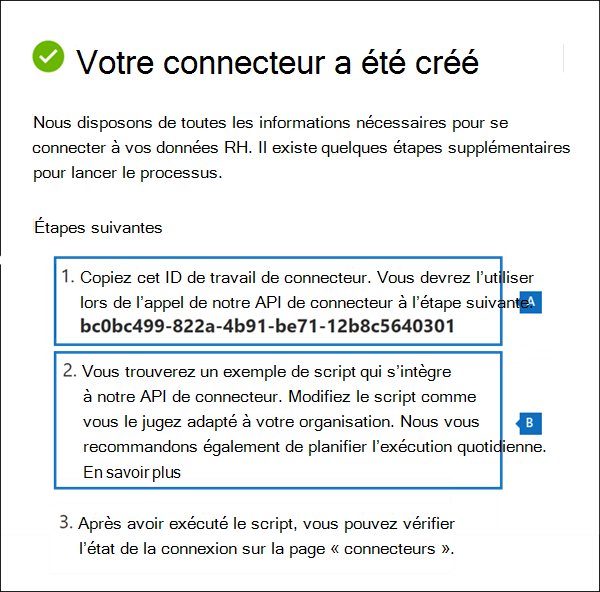

# <a name="set-up-a-connector-to-import-hr-data-in-us-government"></a>Configurer un connecteur pour importer des données RH dans le gouvernement des États-Unis

Vous pouvez configurer un connecteur de données dans le portail de conformité Microsoft Purview pour importer des données de ressources humaines (RH) dans votre organisation du gouvernement des États-Unis. Les données relatives aux RH incluent la date à laquelle un employé a présenté sa démission et la date du dernier jour de l’employé. Ces données RH peuvent ensuite être utilisées par les solutions de protection des informations Microsoft, telles que la [solution de gestion des risques internes](insider-risk-management.md), pour protéger votre organisation contre les activités malveillantes ou le vol de données au sein de votre organisation. La configuration d’un connecteur RH consiste à créer une application dans Azure Active Directory utilisée pour l’authentification par connecteur, à créer un fichier de mappage CSV qui contient vos données RH, à créer un connecteur de données dans le centre de conformité, puis à exécuter un script (planifié) qui ingère les données RH du fichier CSV dans le cloud Microsoft. Ensuite, le connecteur de données est utilisé par l’outil de gestion des risques internes pour accéder aux données RH qui ont été importées dans votre organisation Microsoft 365 US Government.

## <a name="before-you-begin"></a>Avant de commencer

- L’utilisateur qui crée le connecteur RH à l’étape 3 doit disposer du rôle Administration connecteur de données. Ce rôle est requis pour ajouter des connecteurs sur la page **Connecteurs de données** dans le portail de conformité. Ce rôle est ajouté par défaut à plusieurs groupes de rôles. Pour obtenir la liste de ces groupes de rôles, consultez la section « Rôles dans les centres de sécurité et de conformité » dans [Autorisations dans le Centre de sécurité & conformité](../security/office-365-security/permissions-in-the-security-and-compliance-center.md#roles-in-the-security--compliance-center). Un administrateur de votre organisation peut également créer un groupe de rôles personnalisé, attribuer le rôle Administration connecteur de données, puis ajouter les utilisateurs appropriés en tant que membres. Pour obtenir des instructions, consultez la section « Créer un groupe de rôles personnalisé » dans [Autorisations dans le portail de conformité Microsoft Purview](microsoft-365-compliance-center-permissions.md#create-a-custom-role-group).

   > [!NOTE]
   > Le rôle Administration connecteur de données n’est actuellement pas pris en charge dans les environnements US Government GCC High et DoD. Par conséquent, l’utilisateur qui crée le connecteur RH dans les environnements GCC High et DoD doit se voir attribuer le rôle d’exportation d’importation de boîte aux lettres dans Exchange Online. Par défaut, ce rôle n’est affecté à aucun groupe de rôles dans Exchange Online. Vous pouvez ajouter le rôle d’exportation d’importation de boîte aux lettres au groupe de rôles Gestion de l’organisation dans Exchange Online. Vous pouvez également créer un groupe de rôles, attribuer le rôle d’exportation d’importation de boîte aux lettres, puis ajouter les utilisateurs appropriés en tant que membres. Pour plus d’informations, consultez les sections [Créer des groupes de rôles](/Exchange/permissions-exo/role-groups#create-role-groups) ou [Modifier des groupes de rôles](/Exchange/permissions-exo/role-groups#modify-role-groups) dans l’article « Gérer les groupes de rôles dans Exchange Online ».

- Vous devez déterminer comment récupérer ou exporter les données à partir du système RH de votre organisation (régulièrement) et les ajouter au fichier CSV décrit à l’étape 2. Le script que vous exécutez à l’étape 4 charge les données RH dans le fichier CSV dans le cloud Microsoft.

- L’exemple de script que vous exécutez à l’étape 4 charge les données RH dans le cloud Microsoft afin qu’elles puissent être utilisées par d’autres outils Microsoft, tels que la solution de gestion des risques internes. Cet exemple de script n’est pas pris en charge dans le cadre d’un programme ou d’un service de support standard Microsoft. L’exemple de script est fourni tel quel, sans garantie d’aucune sorte. Microsoft Corporation décline aussi toute garantie implicite, y compris et sans limitation, les garanties implicites de qualité marchande ou d’adéquation à un usage particulier. La totalité des risques découlant de l’utilisation ou de la performance de l’exemple de script et de la documentation repose sur vous. En aucun cas Microsoft, ses auteurs ou quiconque impliqué dans la création, la production ou la livraison des scripts ne sera responsable de tous dommages quels qu’ils soient (y compris, sans limitation, les dommages pour perte de profits, interruption d’activité, perte d’informations commerciales ou toute autre perte pécuniaire) découlant de l’utilisation ou de l’impossibilité d’utiliser les exemples de scripts ou la documentation, même si Microsoft a été informé de la possibilité de tels dommages.

## <a name="step-1-create-an-app-in-azure-active-directory"></a>Étape 1 : Créer une application dans Azure Active Directory

La première étape consiste à créer et à inscrire une application dans Azure Active Directory (Azure AD). L’application correspond au connecteur RH que vous créez à l’étape 3. La création de cette application permet à Azure AD d’authentifier le connecteur RH lorsqu’il s’exécute et tente d’accéder à votre organisation. Cette application sera également utilisée pour authentifier le script que vous exécutez à l’étape 4 pour charger vos données RH dans le cloud Microsoft. Lors de la création de cette application Azure AD, veillez à enregistrer les informations suivantes. Ces valeurs seront utilisées dans les étapes ultérieures.

- ID d’application Azure AD (également appelé *ID d’application* ou *ID client*)

- Secret d’application Azure AD (également appelé *clé secrète client*)

- ID de locataire (également appelé *ID de répertoire*)

Pour obtenir des instructions détaillées sur la création d’une application dans Azure AD, consultez [Inscrire une application auprès du Plateforme d'identités Microsoft](/azure/active-directory/develop/quickstart-register-app).

## <a name="step-2-prepare-a-csv-file-with-your-hr-data"></a>Étape 2 : Préparer un fichier CSV avec vos données RH

L’étape suivante consiste à créer un fichier CSV qui contient des informations sur les employés qui ont quitté votre organisation. Comme expliqué dans la section Avant de commencer, vous devez déterminer comment générer ce fichier CSV à partir du système RH de votre organisation. L’exemple suivant montre un fichier CSV terminé (ouvert dans le bloc de notes) qui contient les trois paramètres requis (colonnes). Il est beaucoup plus facile de modifier le fichier CSV dans Microsoft Excel.

```text
EmailAddress,TerminationDate,LastWorkingDate
sarad@contoso.com,2019-04-23T15:18:02.4675041+05:30,2019-04-29T15:18:02.4675041+05:30
pilarp@contoso.com,2019-04-24T09:15:49Z,2019-04-29T15:18:02.7117540
```

La première ligne, ou ligne d’en-tête, du fichier CSV répertorie les noms de colonnes requis. Le nom utilisé dans chaque en-tête de colonne dépend de vous (celles de l’exemple précédent sont des suggestions). Toutefois, les mêmes noms de colonne que ceux que vous utilisez dans le fichier CSV *doivent* être spécifiés lorsque vous créez le connecteur RH à l’étape 3. N’incluez pas d’espaces dans les noms de colonnes.

Le tableau suivant décrit chaque colonne du fichier CSV :

| Nom de colonne | Description |
|:-----|:-----|
| **EmailAddress** <br/> |Spécifie l’adresse e-mail de l’employé arrêté.|
| **TerminationDate** <br/> |Spécifie la date à laquelle l’emploi de la personne a été officiellement résilié dans votre organisation. Par exemple, il peut s’agir de la date à laquelle l’employé a donné son avis de quitter votre organisation. Cette date peut être différente de la date du dernier jour de travail de la personne. Utilisez le format de date et d’heure suivant : `yyyy-mm-ddThh:mm:ss.nnnnnn+|-hh:mm`il s’agit du [format de date et d’heure ISO 8601](https://www.iso.org/iso-8601-date-and-time-format.html).|
|**LastWorkingDate**|Spécifie le dernier jour de travail de l’employé licencié. Utilisez le format de date et d’heure suivant : `yyyy-mm-ddThh:mm:ss.nnnnnn+|-hh:mm`il s’agit du [format de date et d’heure ISO 8601](https://www.iso.org/iso-8601-date-and-time-format.html).|
|||

Après avoir créé le fichier CSV avec les données RH requises, stockez-le sur le même système que le script que vous exécutez à l’étape 4. Veillez à implémenter une stratégie de mise à jour afin que le fichier CSV contienne toujours les informations les plus actuelles. Cela garantit que, quel que soit le script que vous exécutez, les données de terminaison les plus actuelles des employés sont chargées dans le cloud Microsoft.

## <a name="step-3-create-the-hr-connector"></a>Étape 3 : Créer le connecteur RH

L’étape suivante consiste à créer un connecteur RH dans le portail de conformité. Après avoir exécuté le script à l’étape 4, le connecteur RH que vous créez ingère les données RH du fichier CSV à votre organisation Microsoft 365. Dans cette étape, veillez à copier l’ID de travail généré lorsque vous créez le connecteur. Vous allez utiliser l’ID de travail lorsque vous exécutez le script.

1. Accédez au portail de conformité, puis sélectionnez la <a href="https://go.microsoft.com/fwlink/p/?linkid=2173865" target="_blank">page **Connecteurs de données**</a>.

2. Dans la page **Connecteurs de données** sous **RH**, cliquez sur **Affichage**.

3. Dans la page **RH** , cliquez sur **Ajouter un connecteur**.

4. Dans la page **Informations d’identification d’authentification** , procédez comme suit, puis cliquez sur **Suivant** :

   1. Tapez ou collez l’ID d’application Azure AD pour l’application Azure que vous avez créée à l’étape 1.

   1. Tapez un nom pour le connecteur RH.

5. Dans la page **de mappage de fichiers** , tapez les noms des trois en-têtes de colonne (également *appelés paramètres*) à partir du fichier CSV que vous avez créé à l’étape 2 dans chacune des zones appropriées. Les noms ne respectent pas la casse. Comme expliqué précédemment, les noms que vous tapez dans ces zones doivent correspondre aux noms de paramètres dans votre fichier CSV. Par exemple, la capture d’écran suivante montre les noms de paramètres de l’exemple dans l’exemple de fichier CSV présenté à l’étape 2.

   

6. Dans la page **Révision** , passez en revue vos paramètres, puis cliquez sur **Terminer** pour créer le connecteur.

   Une page d’état s’affiche pour confirmer la création du connecteur. Cette page contient deux éléments importants que vous devez effectuer à l’étape suivante pour exécuter l’exemple de script pour charger vos données RH.

   

   1. **ID du travail.** Vous aurez besoin de cet ID de travail pour exécuter le script à l’étape suivante. Vous pouvez la copier à partir de cette page ou de la page de menu volant du connecteur.
   
   1. **Lien vers un exemple de script.** Cliquez sur le lien **ci-après** pour accéder au site GitHub pour accéder à l’exemple de script (le lien ouvre une nouvelle fenêtre). Laissez cette fenêtre ouverte pour pouvoir copier le script à l’étape 4. Vous pouvez également marquer la destination ou copier l’URL pour y accéder à nouveau à l’étape 4. Ce lien est également disponible sur la page de menu volant du connecteur.

7. Cliquez sur **Terminé**.

   Le nouveau connecteur s’affiche dans la liste sous l’onglet **Connecteurs** . 

8. Cliquez sur le connecteur RH que vous venez de créer pour afficher la page de menu volant, qui contient des propriétés et d’autres informations sur le connecteur.

   

   Si vous ne l’avez pas déjà fait, vous pouvez copier les valeurs de **l’ID de Azure App** et de **l’ID de travail du connecteur**. Vous en aurez besoin pour exécuter le script à l’étape suivante. Vous pouvez également télécharger le script à partir de la page de menu volant (ou le télécharger à l’aide du lien à l’étape suivante).)

   Vous pouvez également cliquer sur **Modifier** pour modifier l’ID Azure App ou les noms d’en-tête de colonne que vous avez définis sur la page **de mappage de fichiers**.

## <a name="step-4-run-the-sample-script-to-upload-your-hr-data"></a>Étape 4 : Exécuter l’exemple de script pour charger vos données RH

La dernière étape de la configuration d’un connecteur RH consiste à exécuter un exemple de script qui charge les données RH dans le fichier CSV (que vous avez créé à l’étape 2) dans le cloud Microsoft. Plus précisément, le script charge les données dans le connecteur RH. Après avoir exécuté le script, le connecteur RH que vous avez créé à l’étape 3 importe les données RH dans votre organisation Microsoft 365, où elles sont accessibles par d’autres outils de conformité, tels que la solution de gestion des risques Insider. Après avoir exécuté le script, envisagez de planifier une tâche pour l’exécuter automatiquement tous les jours afin que les données d’arrêt des employés les plus actuelles soient chargées dans le cloud Microsoft. Consultez [Planifier l’exécution automatique du script](#optional-step-6-schedule-the-script-to-run-automatically).

1. Accédez à la fenêtre que vous avez laissée ouverte à l’étape précédente pour accéder au site GitHub avec l’exemple de script. Vous pouvez également ouvrir le site avec signet ou utiliser l’URL que vous avez copiée.

2. Cliquez sur le bouton **Brut** pour afficher le script en mode texte.

3. Copiez toutes les lignes de l’exemple de script, puis enregistrez-les dans un fichier texte.

4. Si nécessaire, modifiez l’exemple de script pour votre organisation.

5. Enregistrez le fichier texte en tant que fichier de script Windows PowerShell à l’aide d’un suffixe de nom de fichier de `.ps1`; par exemple, `HRConnector.ps1`.

6. Ouvrez une invite de commandes sur votre ordinateur local, puis accédez au répertoire où vous avez enregistré le script.

7. Exécutez la commande suivante pour charger les données RH dans le fichier CSV dans le cloud Microsoft ; par exemple :

    ```powershell
    .\HRConnector.ps1 -tenantId <tenantId> -appId <appId>  -appSecret <appSecret>  -jobId <jobId>  -csvFilePath '<csvFilePath>'
    ```

   Le tableau suivant décrit les paramètres à utiliser avec ce script et leurs valeurs requises. Les informations que vous avez obtenues dans les étapes précédentes sont utilisées dans les valeurs de ces paramètres.

   | Paramètre | Description |
   |:-----|:-----|:-----|
   |`tenantId`|ID de votre organisation Microsoft 365 que vous avez obtenu à l’étape 1. Vous pouvez également obtenir l’ID de locataire de votre organisation dans le panneau **Vue d’ensemble** du Centre d’administration Azure AD. Cela permet d’identifier votre organisation.|
   |`appId` |ID d’application Azure AD pour l’application que vous avez créée dans Azure AD à l’étape 1. Azure AD l’utilise pour l’authentification lorsque le script tente d’accéder à votre organisation Microsoft 365. |
   |`appSecret`|Secret d’application Azure AD pour l’application que vous avez créée dans Azure AD à l’étape 1. Cela est également utilisé pour l’authentification.|
   |`jobId`|ID de travail du connecteur RH que vous avez créé à l’étape 3. Cela permet d’associer les données RH chargées dans le cloud Microsoft au connecteur RH.|
   |`csvFilePath`|Chemin d’accès du fichier CSV (stocké sur le même système que le script) que vous avez créé à l’étape 2. Essayez d’éviter les espaces dans le chemin d’accès au fichier ; sinon, utilisez des guillemets simples.|
   |||
   
   Voici un exemple de syntaxe pour le script de connecteur RH utilisant des valeurs réelles pour chaque paramètre :

   ```powershell
    .\HRConnector.ps1 -tenantId d5723623-11cf-4e2e-b5a5-01d1506273g9 -appId 29ee526e-f9a7-4e98-a682-67f41bfd643e -appSecret MNubVGbcQDkGCnn -jobId b8be4a7d-e338-43eb-a69e-c513cd458eba -csvFilePath 'C:\Users\contosoadmin\Desktop\Data\employee_termination_data.csv'
    ```

   Si le chargement réussit, le script affiche le message **De réussite** du chargement.

   > [!NOTE]
   > Si vous rencontrez des problèmes lors de l’exécution de la commande précédente en raison de stratégies d’exécution, consultez [À propos des stratégies d’exécution](/powershell/module/microsoft.powershell.core/about/about_execution_policies) et [de Set-ExecutionPolicy](/powershell/module/microsoft.powershell.security/set-executionpolicy) pour obtenir des conseils sur la définition des stratégies d’exécution.

## <a name="step-5-monitor-the-hr-connector"></a>Étape 5 : Surveiller le connecteur RH

Après avoir créé le connecteur RH et exécuté le script pour charger vos données RH, vous pouvez afficher le connecteur et charger l’état dans le portail de conformité. Si vous planifiez l’exécution automatique du script régulièrement, vous pouvez également afficher l’état actuel après la dernière exécution du script.

1. Accédez au portail de conformité, puis sélectionnez <a href="https://go.microsoft.com/fwlink/p/?linkid=2173865" target="_blank">**Connecteurs de données**</a>.

2. Cliquez sur l’onglet **Connecteurs** , puis sélectionnez le connecteur RH pour afficher la page de menu volant. Cette page contient les propriétés et les informations sur le connecteur.

   

3. Sous **Progression**, cliquez sur le lien **Télécharger le journal** pour ouvrir (ou enregistrer) le journal d’état du connecteur. Ce journal contient des informations sur chaque exécution du script et le chargement des données du fichier CSV dans le cloud Microsoft. 

   

   Le `RecordsSaved` champ indique le nombre de lignes dans le fichier CSV chargé. Par exemple, si le fichier CSV contient quatre lignes, la valeur des `RecordsSaved` champs est 4, si le script a correctement chargé toutes les lignes du fichier CSV.

Si vous n’avez pas exécuté le script à l’étape 4, un lien pour télécharger le script s’affiche sous **Dernière importation**. Vous pouvez télécharger le script, puis suivre les étapes de l’étape 4 pour l’exécuter.

## <a name="optional-step-6-schedule-the-script-to-run-automatically"></a>(Facultatif) Étape 6 : Planifier l’exécution automatique du script

Pour vous assurer que les dernières données RH de votre organisation sont disponibles pour des outils tels que la solution de gestion des risques internes, nous vous recommandons de planifier l’exécution automatique du script de façon périodique, par exemple une fois par jour. Cela nécessite également que vous mettiez à jour les données RH dans le fichier CSV selon une planification similaire (si ce n’est pas la même) afin qu’elles contiennent les informations les plus récentes sur les employés qui quittent votre organisation. L’objectif est de charger les données RH les plus actuelles afin que le connecteur RH puisse les rendre disponibles pour la solution de gestion des risques internes.

Vous pouvez utiliser l’application Planificateur de tâches dans Windows pour exécuter automatiquement le script tous les jours.

1. Sur votre ordinateur local, cliquez sur le bouton Démarrer de Windows, puis **tapez** **Planificateur de tâches**.

2. Cliquez sur l’application **Du planificateur de tâches** pour l’ouvrir.

3. Dans la section **Actions** , cliquez sur **Créer une tâche**.

4. Sous l’onglet **Général** , tapez un nom descriptif pour la tâche planifiée ; par exemple, **script du connecteur RH**. Vous pouvez également ajouter une description facultative.

5. Sous **Options de sécurité**, procédez comme suit :

   1. Déterminez si vous devez exécuter le script uniquement lorsque vous êtes connecté à l’ordinateur ou si vous l’exécutez lorsque vous êtes connecté ou non.
   
   1. Vérifiez que la case à cocher **Exécuter avec les privilèges les plus élevés** est cochée.

6. Sélectionnez l’onglet Déclencheurs, cliquez sur **Nouveau**, puis effectuez les **opérations suivantes** :

   1. Sous **Paramètres**, sélectionnez l’option **Quotidienne** , puis choisissez une date et une heure pour exécuter le script pour la première fois. Le script s’exécute tous les jours à la même heure spécifiée.
   
   1. Sous **Paramètres avancés**, vérifiez que la case à cocher **Activé** est cochée.
   
   1. Cliquez sur **OK**.

7. Sélectionnez l’onglet **Actions** , cliquez sur **Nouveau**, puis effectuez les opérations suivantes :

   

   1. Dans la liste déroulante **Action** , vérifiez que **l’option Démarrer un programme** est sélectionnée.

   1. Dans la zone **Programme/script** , cliquez sur **Parcourir, accédez** à l’emplacement suivant et sélectionnez-le pour que le chemin d’accès s’affiche dans la zone : `C:\Windows\System32\WindowsPowerShell\v1.0\powershell.exe`.

   1. Dans la zone **Ajouter des arguments (facultatif),** collez la commande de script que vous avez exécutée à l’étape 4. Par exemple, `.\HRConnector.ps1 -tenantId "d5723623-11cf-4e2e-b5a5-01d1506273g9" -appId "c12823b7-b55a-4989-faba-02de41bb97c3" -appSecret "MNubVGbcQDkGCnn"  -jobId "e081f4f4-3831-48d6-7bb3-fcfab1581458" -csvFilePath "C:\Users\contosoadmin\Desktop\Data\employee_termination_data.csv"`

   1. Dans la zone **Démarrer (facultatif),** collez l’emplacement du dossier du script que vous avez exécuté à l’étape 4. Par exemple : `C:\Users\contosoadmin\Desktop\Scripts`.

   1. Cliquez sur **Ok** pour enregistrer les paramètres de la nouvelle action.

8. Dans la fenêtre **Créer une tâche** , cliquez sur **Ok** pour enregistrer la tâche planifiée. Vous pouvez être invité à entrer les informations d’identification de votre compte d’utilisateur.

   La nouvelle tâche s’affiche dans la bibliothèque du planificateur de tâches.

   

   La dernière fois que le script s’est exécuté et la prochaine fois qu’il est planifié pour s’exécuter s’affiche. Vous pouvez double-cliquer sur la tâche pour la modifier.

   Vous pouvez également vérifier la dernière fois que le script s’est exécuté sur la page de menu volant du connecteur RH correspondant dans le centre de conformité.