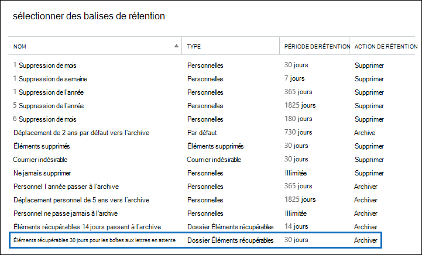
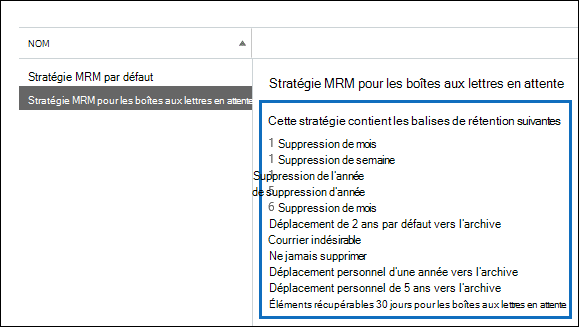

# <a name="increase-the-recoverable-items-quota-for-mailboxes-on-hold"></a>Augmenter le quota des éléments récupérables pour les boîtes aux lettres placées en conservation

[!include[Purview banner](../includes/purview-rebrand-banner.md)]

La stratégie de rétention par défaut Exchange, nommée stratégie *MRM par défaut*, qui est automatiquement appliquée aux nouvelles boîtes aux lettres dans Exchange Online contient une balise de rétention nommée Éléments récupérables 14 jours, qui passe à l’archive. Cette balise de rétention déplace les éléments du dossier Éléments récupérables de la boîte aux lettres principale de l’utilisateur vers le dossier Éléments récupérables de la boîte aux lettres d’archivage de l’utilisateur à l’expiration de la période de rétention de 14 jours d’un élément. Pour ce faire, la boîte aux lettres d’archivage de l’utilisateur doit être activée. Si la boîte aux lettres d’archivage n’est pas activée, aucune action n’est effectuée, ce qui signifie que les éléments du dossier Éléments récupérables pour une boîte aux lettres placée en conservation ne sont pas déplacés vers la boîte aux lettres d’archivage après expiration de la période de rétention de 14 jours. Étant donné que rien n’est supprimé d’une boîte aux lettres placée en conservation, il est possible que le quota de stockage pour le dossier Éléments récupérables soit dépassé, en particulier si la boîte aux lettres d’archivage de l’utilisateur n’est pas activée.

Pour réduire le risque de dépassement de cette limite, le quota de stockage pour le dossier Éléments récupérables passe automatiquement de 30 Go à 100 Go lorsqu’une conservation est placée sur une boîte aux lettres dans Exchange Online. Si la boîte aux lettres d’archivage est activée, le quota de stockage pour le dossier Éléments récupérables dans la boîte aux lettres d’archivage passe également de 30 Go à 100 Go. Si la fonctionnalité d’archivage à extension automatique dans Exchange Online est activée, le quota total de stockage pour la boîte aux lettres d’archivage de l’utilisateur, y compris le dossier Éléments récupérables, est de 1,5 To.

  Le tableau suivant résume le quota de stockage pour le dossier Éléments récupérables.

| Emplacement du dossier Éléments récupérables | Boîtes aux lettres non placées en conservation | Boîtes aux lettres placées en conservation |
|:-----|:-----|:-----|
|Boîte aux lettres principale |30 Go |100 Go |
|Boîte aux lettres d’archivage, y compris dossier Éléments récupérables <sup>\*</sup> |1,5 To |1,5 To |

> [!NOTE]
> <sup>\*</sup>Le quota de stockage initial de la boîte aux lettres d’archivage est de 100 Go pour les utilisateurs disposant d’une licence Exchange Online (plan 2). Toutefois, lorsque l’archivage de développement automatique est activé pour les boîtes aux lettres en attente, le quota de stockage pour la boîte aux lettres d’archivage et le dossier Éléments récupérables est porté à 110 Go. Un espace de stockage d’archive supplémentaire (qui inclut le dossier Éléments récupérables) jusqu’à 1,5 To est approvisionné si nécessaire. Pour plus d’informations sur le développement automatique de l’archivage, consultez [En savoir plus sur l’archivage à extension automatique](autoexpanding-archiving.md).

Lorsque le quota de stockage pour le dossier Éléments récupérables dans la boîte aux lettres principale d’une boîte aux lettres placée en conservation est proche de sa limite, vous pouvez effectuer les opérations suivantes :

- **Activez la boîte aux lettres d’archivage et activez l’archivage à extension automatique.** Vous pouvez activer une capacité de stockage supplémentaire pour le dossier Éléments récupérables simplement en activant la boîte aux lettres d’archivage, puis en activant la fonctionnalité d’archivage à extension automatique dans Exchange Online. Cela donne 110 Go pour le dossier Éléments récupérables dans la boîte aux lettres principale et jusqu’à 1,5 To de capacité de stockage combinée pour le dossier Archive et Éléments récupérables. Pour plus d’informations, consultez [Activer les boîtes aux lettres d’archivage](enable-archive-mailboxes.md) et [Activer l’archivage à extension automatique](enable-autoexpanding-archiving.md).

    > [!NOTE]
    > Une fois que vous avez activé l’archive pour une boîte aux lettres proche du dépassement du quota de stockage pour le dossier Éléments récupérables, vous pouvez exécuter l’Assistant Dossier géré pour déclencher manuellement l’Assistant pour traiter la boîte aux lettres afin que les éléments expirés soient déplacés vers le dossier Éléments récupérables dans la boîte aux lettres d’archivage. Voir [Étape 4](#optional-step-4-run-the-managed-folder-assistant-to-apply-the-new-retention-settings) pour obtenir des instructions. Notez que d’autres éléments dans la boîte aux lettres de l’utilisateur peuvent être déplacés vers la nouvelle boîte aux lettres d’archivage. Envisagez de dire à l’utilisateur que cela peut se produire une fois que vous avez activé la boîte aux lettres d’archivage.

- **Créez une stratégie de rétention Exchange personnalisée pour les boîtes aux lettres en attente.** Outre l’activation de la boîte aux lettres d’archivage et le développement automatique de l’archivage pour les boîtes aux lettres en attente de litige ou In-Place conservation, vous pouvez également créer une stratégie de rétention Exchange personnalisée pour les boîtes aux lettres en attente. Cela vous permet d’appliquer une stratégie de rétention aux boîtes aux lettres en attente qui est différente de la stratégie MRM par défaut appliquée aux boîtes aux lettres qui ne sont pas en attente, et vous permet d’appliquer des balises de rétention conçues pour les boîtes aux lettres en attente. Cela inclut la création d’une nouvelle balise de rétention pour le dossier Éléments récupérables.

Le reste de cette rubrique décrit les procédures pas à pas permettant de créer une stratégie de rétention Exchange personnalisée pour les boîtes aux lettres en attente.

[Étape 1 : Création d’une balise de rétention pour le dossier Éléments récupérables](#step-1-create-a-custom-retention-tag-for-the-recoverable-items-folder)

[Étape 2 : Créer une stratégie de rétention Exchange pour les boîtes aux lettres en attente](#step-2-create-a-new-exchange-retention-policy-for-mailboxes-on-hold)

[Étape 3 : Appliquer la nouvelle stratégie de rétention Exchange aux boîtes aux lettres en attente](#step-3-apply-the-new-exchange-retention-policy-to-mailboxes-on-hold)

[(Facultatif) Étape 4 : Exécution de l’Assistant Dossier géré pour appliquer les nouveaux paramètres de rétention](#optional-step-4-run-the-managed-folder-assistant-to-apply-the-new-retention-settings)

## <a name="step-1-create-a-custom-retention-tag-for-the-recoverable-items-folder"></a>Étape 1 : Création d’une balise de rétention personnalisée pour le dossier Éléments récupérables

La première étape consiste à créer une balise de rétention personnalisée (appelée balise de stratégie de rétention) pour le dossier Éléments récupérables. Comme expliqué précédemment, cette balise de stratégie de rétention déplace les éléments du dossier Éléments récupérables de la boîte aux lettres principale de l’utilisateur vers le dossier Éléments récupérables de la boîte aux lettres d’archivage de l’utilisateur. Vous devez utiliser PowerShell pour créer un RPT pour le dossier Éléments récupérables. Vous ne pouvez pas utiliser le Centre d'administration Exchange (CAE).

1. [Vous connecter à Exchange Online à l'aide de Remote PowerShell](/powershell/exchange/connect-to-exchange-online-powershell)

2. Exécutez la commande suivante pour créer une balise de stratégie de rétention pour le dossier Éléments récupérables : 

    ```powershell
    New-RetentionPolicyTag -Name <Name of RPT> -Type RecoverableItems -AgeLimitForRetention <Number of days> -RetentionAction MoveToArchive
    ```

    Par exemple, la commande suivante crée un RPT pour le dossier Éléments récupérables nommé « Éléments récupérables 30 jours pour les boîtes aux lettres en attente », avec une période de rétention de 30 jours. Cela signifie que 30 jours après qu’un élément a été placé dans le dossier Éléments récupérables, il est déplacé vers le dossier Éléments récupérables de la boîte aux lettres d’archivage de l’utilisateur.

    ```powershell
    New-RetentionPolicyTag -Name "Recoverable Items 30 days for mailboxes on hold" -Type RecoverableItems -AgeLimitForRetention 30 -RetentionAction MoveToArchive
    ```

    > [!TIP]
    > Nous recommandons que la période de rétention (définie par le paramètre  _AgeLimitForRetention_ ) pour le RPT Éléments récupérables soit la même que la période de rétention des éléments supprimés pour les boîtes aux lettres auxquelles le RPT sera appliqué. Cela permet à un utilisateur de disposer de l’intégralité de la période de rétention des éléments supprimés pour récupérer les éléments supprimés avant qu’ils ne soient déplacés vers la boîte aux lettres d’archivage. Dans l’exemple précédent, la période de rétention était définie sur 30 jours en supposant que la période de rétention de l’élément supprimé pour les boîtes aux lettres est aussi de 30 jours. Une boîte aux lettres Exchange Online est configurée pour conserver les éléments supprimés pendant 14 jours, par défaut. Toutefois, vous pouvez augmenter la valeur de ce paramètre jusqu’à 30 jours au maximum. Pour plus d’informations, consultez [Modifier la période de rétention des éléments supprimés pour une boîte aux lettres dans Exchange Online](https://www.microsoft.com/?ref=go).

## <a name="step-2-create-a-new-exchange-retention-policy-for-mailboxes-on-hold"></a>Étape 2 : Créer une stratégie de rétention Exchange pour les boîtes aux lettres en attente

L’étape suivante consiste à créer une stratégie de rétention et à lui ajouter des balises de rétention, y compris la balise de stratégie de rétention des éléments récupérables que vous avez créée à l’étape 1. Cette nouvelle stratégie sera appliquée aux boîtes aux lettres placées en conservation dans l’étape suivante. 

Avant de créer la stratégie de rétention, déterminez les balises de rétention supplémentaires que vous souhaitez ajouter. Pour obtenir une liste des balises de rétention qui sont ajoutées à la stratégie MRM par défaut et pour plus d’informations sur la création des balises de rétention, voir les rubriques suivantes :

- [Stratégie de rétention par défaut dans Exchange Online](/exchange/security-and-compliance/messaging-records-management/default-retention-policy)

- [Dossiers par défaut prenant en charge les balises de stratégie de rétention](/exchange/security-and-compliance/messaging-records-management/default-folders)

- Section « Créer une balise de rétention » dans la rubrique [Créer une stratégie de rétention](/exchange/security-and-compliance/messaging-records-management/create-a-retention-policy) .

Vous pouvez utiliser le CCE ou Exchange Online PowerShell pour créer une stratégie de rétention.

### <a name="use-the-eac-to-create-a-retention-policy"></a>Utilisation du Centre d’administration Exchange pour créer une stratégie de rétention

1. Dans le CENTRE, accédez aux **stratégies de rétention** de **gestion de la conformité**\>, puis cliquez sur **Ajouter** 

2. Sur la page **Nouvelle stratégie de rétention**, sous **Nom**, saisissez un nom qui décrit l’objectif de la stratégie de rétention ; par exemple, **MRM Policy for Mailboxes on Hold**. 

3. Sous **Balises de rétention**, cliquez sur **Ajouter** 

4. Dans la liste des balises de rétention, sélectionnez la balise de stratégie de rétention des éléments récupérables que vous avez créée à l’étape 1, puis cliquez sur **Ajouter**.

    

5. Sélectionnez des balises de rétention supplémentaires à ajouter à la stratégie de rétention. Par exemple, vous pouvez ajouter les mêmes balises qui sont incluses dans la stratégie MRM par défaut.

6. Lorsque vous avez fini d’ajouter les balises de rétention, cliquez sur **OK**.

7. Cliquez sur **Enregistrer** pour créer la stratégie de rétention.

    Les balises de rétention liées à la stratégie de rétention sont affichées dans le volet de détails.

    

### <a name="use-exchange-online-powershell-to-create-a-retention-policy"></a>Utiliser Exchange Online PowerShell pour créer une stratégie de rétention

Exécutez la commande suivante pour créer une stratégie de rétention pour les boîtes aux lettres placées en conservation. 

```powershell
New-RetentionPolicy <Name of retention policy>  -RetentionPolicyTagLinks <list of retention tags>
```

Par exemple, la commande suivante crée la stratégie de rétention et les balises de rétention liées affichées dans l’illustration précédente.

```powershell
New-RetentionPolicy "MRM Policy for Mailboxes on Hold"  -RetentionPolicyTagLinks "Recoverable Items 30 days for mailboxes on hold","1 Month Delete","1 Week Delete","1 Year Delete","5 Year Delete","6 Month Delete","Default 2 year move to archive","Junk Email","Never Delete","Personal 1 year move to archive","Personal 5 year move to archive"
```

## <a name="step-3-apply-the-new-exchange-retention-policy-to-mailboxes-on-hold"></a>Étape 3 : Appliquer la nouvelle stratégie de rétention Exchange aux boîtes aux lettres en attente

La dernière étape consiste à appliquer la nouvelle stratégie de rétention que vous avez créée à l’étape 2 aux boîtes aux lettres placées en conservation dans votre organisation. Vous pouvez utiliser le CCE ou Exchange Online PowerShell pour appliquer la stratégie de rétention à une seule boîte aux lettres ou à plusieurs boîtes aux lettres.

### <a name="use-the-eac-to-apply-the-new-retention-policy"></a>Utilisation du Centre d’administration Exchange pour appliquer la nouvelle stratégie de rétention

1. Accédez à **RecipientsMailboxes** > .

2. Dans l’affichage liste, sélectionnez la boîte aux lettres à laquelle vous souhaitez appliquer la stratégie de rétention, puis cliquez sur **l’icône Modifier** .

3. Sur la page **Boîte aux lettres de l’utilisateur**, cliquez sur **Fonctionnalités de boîte aux lettres**.

4. Sous **Stratégie de rétention**, sélectionnez la stratégie de rétention que vous avez créée à l’étape 2, puis cliquez sur **Enregistrer**.

Vous pouvez aussi utiliser le Centre d’administration Exchange pour appliquer la stratégie de rétention à plusieurs boîtes aux lettres.

1. Accédez à **RecipientsMailboxes** > .

2. Dans la liste affichée, utilisez les touches Maj ou Ctrl pour sélectionner plusieurs boîtes aux lettres.

3. Dans le volet d’informations, cliquez sur **Plus d’options**.

4. Sous **Stratégie de rétention**, cliquez sur **Mettre à jour**.

5. Sur la page **Attribuer la stratégie de rétention en bloc**, sélectionnez la stratégie de rétention que vous avez créée à l’étape 2, puis cliquez sur **Enregistrer**. 

### <a name="use-exchange-online-powershell-to-apply-the-new-retention-policy"></a>Utiliser Exchange Online PowerShell pour appliquer la nouvelle stratégie de rétention

Vous pouvez utiliser Exchange Online PowerShell pour appliquer une nouvelle stratégie de rétention à une seule boîte aux lettres. Mais la puissance réelle de PowerShell est que vous pouvez l’utiliser pour identifier rapidement toutes les boîtes aux lettres de votre organisation qui sont en attente de litige ou In-Place hold, puis appliquer la nouvelle stratégie de rétention à toutes les boîtes aux lettres en attente dans une seule commande. Voici quelques exemples d’utilisation de Exchange PowerShell pour appliquer une stratégie de rétention à une ou plusieurs boîtes aux lettres. Tous les exemples appliquent la stratégie de rétention qui a été créée à l’étape 2.

Cet exemple applique la nouvelle stratégie de rétention à la boîte aux lettres de Pilar Pinilla.

```powershell
Set-Mailbox "Pilar Pinilla" -RetentionPolicy "MRM Policy for Mailboxes on Hold"
```

Cet exemple applique la nouvelle stratégie de rétention à toutes les boîtes aux lettres de l’organisation qui sont placées en conservation pour litige.

```powershell
$LitigationHolds = Get-Mailbox -ResultSize unlimited | Where-Object {$_.LitigationHoldEnabled -eq 'True'}
```

```powershell
$LitigationHolds.DistinguishedName | Set-Mailbox -RetentionPolicy "MRM Policy for Mailboxes on Hold"
```

Cet exemple applique la nouvelle stratégie de rétention à toutes les boîtes aux lettres de l’organisation qui sont placées en conservation inaltérable.

```powershell
$InPlaceHolds = Get-Mailbox -ResultSize unlimited | Where-Object {$_.InPlaceHolds -ne $null}
```

```powershell
$InPlaceHolds.DistinguishedName | Set-Mailbox -RetentionPolicy "MRM Policy for Mailboxes on Hold"
```

Vous pouvez utiliser la cmdlet **Get-Mailbox** pour vérifier que la nouvelle stratégie de rétention a été appliquée.

Voici quelques exemples pour vérifier que les commandes des exemples précédents appliquent la stratégie de rétention « stratégie MRM pour les boîtes aux lettres en conservation » aux boîtes aux lettres placées en conservation sur litige et aux boîtes aux lettres en conservation inaltérable.

```powershell
Get-Mailbox "Pilar Pinilla" | Select RetentionPolicy
```

```powershell
Get-Mailbox -ResultSize unlimited | Where-Object {$_.LitigationHoldEnabled -eq 'True'} | FT DisplayName,RetentionPolicy -Auto
```

```powershell
Get-Mailbox -ResultSize unlimited | Where-Object {$_.InPlaceHolds -ne $null} | FT DisplayName,RetentionPolicy -Auto
```

## <a name="optional-step-4-run-the-managed-folder-assistant-to-apply-the-new-retention-settings"></a>(Facultatif) Étape 4 : Exécution de l’Assistant Dossier géré pour appliquer les nouveaux paramètres de rétention

Une fois que vous avez appliqué la nouvelle stratégie de rétention Exchange aux boîtes aux lettres en attente, le traitement de ces boîtes aux lettres par l’Assistant Dossier géré peut prendre jusqu’à 7 jours dans Exchange Online à l’aide des paramètres de la nouvelle stratégie de rétention. Au lieu d’attendre l’exécution de l’Assistant Dossier géré, vous pouvez utiliser la cmdlet **Start-ManagedFolderAssistant** pour déclencher manuellement l’assistant afin qu’il traite les boîtes aux lettres auxquelles vous avez appliqué la nouvelle stratégie de rétention.

Exécutez la commande suivante pour démarrer l’Assistant Dossier géré pour la boîte aux lettres de Pilar Pinilla.

```powershell
Start-ManagedFolderAssistant "Pilar Pinilla"
```

Exécutez les commandes suivantes pour démarrer l’Assistant Dossier géré pour toutes les boîtes aux lettres placées en conservation.

```powershell
$MailboxesOnHold = Get-Mailbox -ResultSize unlimited | Where-Object {($_.InPlaceHolds -ne $null) -or ($_.LitigationHoldEnabled -eq "True")}
```

```powershell
$MailboxesOnHold.DistinguishedName | Start-ManagedFolderAssistant
```

## <a name="more-information"></a>Plus d’informations

- Après avoir activé la boîte aux lettres d’archivage d’un utilisateur, envisagez d’indiquer à l’utilisateur que d’autres éléments de sa boîte aux lettres (pas seulement les éléments du dossier Éléments récupérables) peuvent être déplacés vers la boîte aux lettres d’archivage. Cela est dû au fait que la stratégie MRM par défaut affectée à Exchange Online boîtes aux lettres contient une balise de rétention (nommée Par défaut 2 ans, passer à l’archive) qui déplace les éléments vers la boîte aux lettres d’archivage deux ans après la date à laquelle l’élément a été remis à la boîte aux lettres ou créé par l’utilisateur. Pour plus d’informations, consultez [la stratégie de rétention par défaut dans Exchange Online](/exchange/security-and-compliance/messaging-records-management/default-retention-policy)

- Après avoir activé la boîte aux lettres d’archivage d’un utilisateur, vous pouvez également indiquer à l’utilisateur qu’il peut récupérer les éléments supprimés dans le dossier Éléments récupérables dans sa boîte aux lettres d’archivage. Ils peuvent le faire dans Outlook en sélectionnant le dossier **Éléments supprimés** dans la boîte aux lettres d’archivage, puis en cliquant sur **Récupérer les éléments supprimés du serveur** sous l’onglet **Accueil**. Pour plus d’informations sur la récupération d’éléments supprimés, consultez [Récupérer les éléments supprimés dans Outlook pour Windows](https://go.microsoft.com/fwlink/p/?LinkId=624829).
