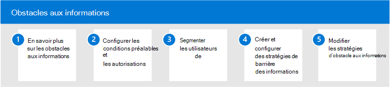

# Obstacles aux informations dans Microsoft 365

Microsoft 365 permet la communication et la collaboration entre les groupes et les organisations, et prend en charge les moyens de restreindre la communication et la collaboration entre des groupes spécifiques d’utilisateurs si nécessaire. Cela peut inclure des situations ou des scénarios dans lesquelles vous souhaitez restreindre la communication et la collaboration entre deux groupes afin d’éviter qu’un conflit d’intérêts ne se produise dans votre organisation. Cela peut également inclure des situations dans lesquelles vous devez restreindre la communication et la collaboration entre certaines personnes au sein de votre organisation afin de protéger les informations internes.

Les obstacles à l’information sont pris en charge dans Microsoft Teams, SharePoint Online et OneDrive Entreprise. Un administrateur de conformité ou un administrateur des obstacles à l’information peut définir des stratégies pour autoriser ou empêcher les communications entre des groupes d’utilisateurs dans Microsoft Teams. Les stratégies de obstacle à l’information peuvent être utilisées dans des situations comme celles-ci :

- L’utilisateur du jour ne doit pas communiquer ou partager des fichiers avec l’équipe marketing
- Le personnel financier travaillant sur des informations confidentielles sur l’entreprise ne doit pas communiquer ou partager des fichiers avec certains groupes au sein de leur organisation
- Une équipe interne avec du matériel de secret commercial ne doit pas appeler ou discuter en ligne avec des personnes de certains groupes au sein de leur organisation
- Une équipe de recherche doit uniquement appeler ou discuter en ligne avec une équipe de développement de produits

## Configurer les obstacles aux informations pour Microsoft 365

Pour configurer les obstacles à l’information pour votre organisation, utilisez les étapes suivantes :

1. En savoir plus [sur les obstacles aux informations](information-barriers.md) dans Microsoft 365
2. Configurer les [conditions préalables et les autorisations](information-barriers-policies.md#prerequisites)
3. Segmenter [les utilisateurs de votre organisation](information-barriers-policies.md#part-1-segment-users)
4. Créer et configurer des stratégies [d’obstacle aux informations](information-barriers-policies.md#part-2-define-information-barrier-policies)
5. Appliquer des [stratégies de obstacle à l’information](information-barriers-policies.md#part-3-apply-information-barrier-policies)

## Plus d’informations sur les obstacles aux informations

- [Attributs pour les stratégies d’obstacle aux informations](information-barriers-attributes.md)
- [Modifier ou supprimer des stratégies de obstacle à l’information](information-barriers-edit-segments-policies.md)