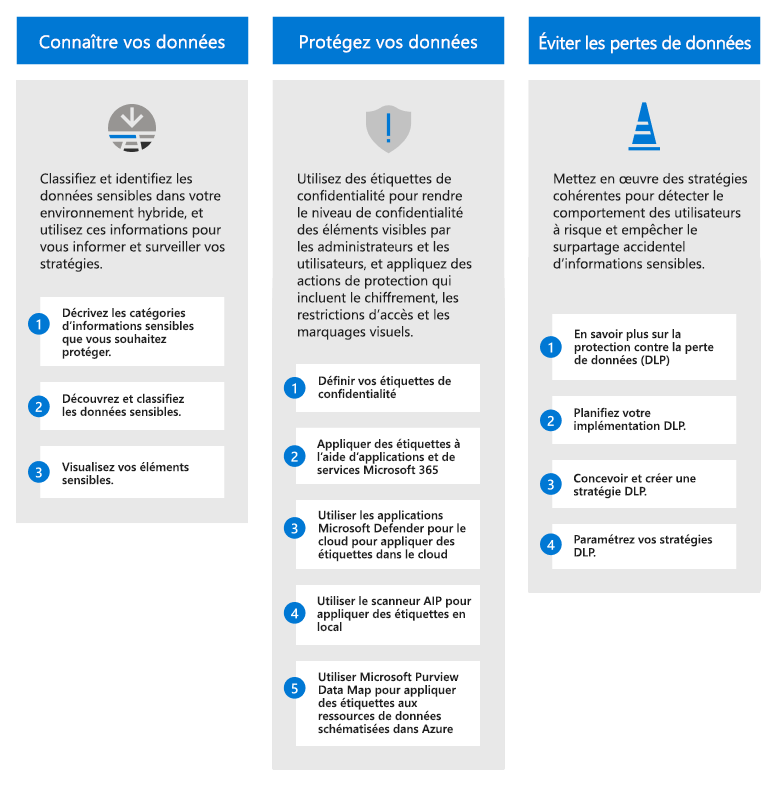
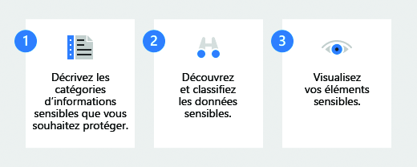
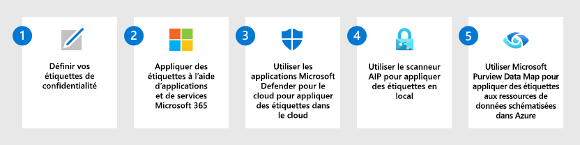
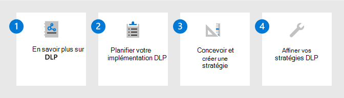

# Déployer une solution de protection des informations avec Microsoft Purview

>*[Licences de sécurité et de conformité Microsoft 365](/office365/servicedescriptions/microsoft-365-service-descriptions/microsoft-365-tenantlevel-services-licensing-guidance/microsoft-365-security-compliance-licensing-guidance)*

Votre stratégie de protection des informations est déterminée par les besoins de votre entreprise. De nombreuses organisations doivent se conformer aux réglementations, aux lois et aux pratiques commerciales. En outre, les organisations doivent protéger les informations propriétaires, telles que les données pour des projets spécifiques.

Microsoft Purview Information Protection (anciennement Microsoft Information Protection) fournit un cadre, un processus et des capacités que vous pouvez utiliser pour atteindre vos objectifs commerciaux spécifiques. 

## Cadre de protection des informations Microsoft Purview

Utilisez Microsoft Purview Information Protection pour vous aider à découvrir, classer, protéger et gérer les informations sensibles, où qu'elles se trouvent ou voyagent.

Regardez la session Ignite suivante pour voir comment ces fonctionnalités se prennent en charge et se renforcent les unes les autres : [Connaissez vos données, protégez vos données et empêchez la perte de données avec Microsoft Information Protection](https://myignite.microsoft.com/archives/IG20-OD273).

Pour la gouvernance des données, voir [Déployer une solution de gouvernance des données avec Microsoft Purview](data-governance-solution.md).

## Licences

Les capacités de protection de l'information de Microsoft Purview sont incluses dans Microsoft Purview. Les exigences de licence peuvent varier même au sein des fonctionnalités, en fonction des options de configuration. Pour identifier les exigences et les options en matière de licences, consultez les [Conseils Microsoft 365 en matière de sécurité et de conformité](/office365/servicedescriptions/microsoft-365-service-descriptions/microsoft-365-tenantlevel-services-licensing-guidance/microsoft-365-security-compliance-licensing-guidance).

## Connaître vos données

Savoir où résident vos données sensibles constitue souvent le plus grand défi pour de nombreuses organisations. La classification des données de Microsoft Purview Information Protection vous aide à découvrir et à classer avec précision les quantités toujours croissantes de données créées par votre organisation. Les représentations graphiques vous permettent d’obtenir des informations sur ces données afin de pouvoir configurer et surveiller des stratégies pour les protéger et les gérer.

|Étape|Description|Plus d’informations|
|:---|:----------|:---------------|
|1| Décrivez les catégories d’informations sensibles que vous souhaitez protéger.    Vous avez déjà une idée des types d’informations les plus importantes pour votre organisation et de ceux qui ne le sont pas. Collaborez avec les parties prenantes pour décrire ces catégories qui constituent votre point de départ. | [En savoir plus sur les types d’informations confidentielles](sensitive-information-type-learn-about.md). 
 [En savoir plus sur les classifieurs avec capacité d’apprentissage](classifier-learn-about.md)|
|2| Découvrez et classifiez les données sensibles.    Vous pouvez trouver les données sensibles dans des éléments à l’aide de nombreuses méthodes différentes qui incluent des stratégies DLP par défaut, l’étiquetage manuel par les utilisateurs et la reconnaissance automatique des modèles à l’aide de types d’informations sensibles ou de l’apprentissage automatique. | [En savoir plus sur la classification des données](data-classification-overview.md) 
 [Vidéo : classification des données dans le Centre de conformité](https://www.microsoft.com/videoplayer/embed/RE4vx8x)|
|3| Afficher vos éléments sensibles.     Utilisez l’Explorateur de contenu et l’Explorateur d’activités pour une analyse plus approfondie des éléments sensibles et des mesures que les utilisateurs prennent sur ces éléments.| [Prise en main de l’explorateur de contenu](data-classification-content-explorer.md) 
 [Prise en main de l’explorateur d’activités](data-classification-activity-explorer.md)|

## Protéger ses données

Utilisez les informations en sachant où résident vos données sensibles pour vous aider à les protéger plus efficacement. Mais il n’est pas nécessaire d’attendre : vous pouvez commencer à protéger immédiatement vos données à l’aide d’une association d’étiquetage manuel, par défaut et automatique. Utilisez ensuite l’[Explorateur de contenu](data-classification-content-explorer.md) et l’[Explorateur d’activités](data-classification-activity-explorer.md) de la section précédente pour vérifier quels éléments sont étiquetés et comment vos étiquettes sont utilisées.

|Étape|Description|Plus d’informations|
|:---|-----------|:---------------|
| 1|Définissez vos stratégies et [étiquettes de confidentialité](sensitivity-labels.md) qui protégeront les données de votre organisation.   En plus d’identifier la sensibilité du contenu, ces étiquettes peuvent appliquer des actions de protection, telles que des en-têtes, des pieds de page, des filigranes et le chiffrement. | [Prise en main des étiquettes de confidentialité](get-started-with-sensitivity-labels.md)    [Créer et configurer des étiquettes de confidentialité ainsi que leurs stratégies](create-sensitivity-labels.md)    [Restreindre l'accès au contenu grâce à la mise en place d'un chiffrement par les étiquettes de confidentialité](encryption-sensitivity-labels.md) |
| 2|Étiquetez et protégez les éléments des services et applications Microsoft 365.   Les étiquettes de confidentialité sont prises en charge pour Microsoft 365 Word, Excel, PowerPoint, Outlook et les conteneurs qui incluent des sites SharePoint et OneDrive, ainsi que des groupes Microsoft 365. Utilisez une association de méthodes d’étiquetage telles que l’étiquetage manuel, l’étiquetage automatique, une étiquette par défaut et l’étiquetage obligatoire.| [Gérer les étiquettes de confidentialité dans les applications Office](sensitivity-labels-office-apps.md)    [Activer les étiquettes de confidentialité pour les fichiers Office dans SharePoint et OneDrive](sensitivity-labels-sharepoint-onedrive-files.md)    [Activer la co-édition pour les fichiers chiffrés avec les étiquettes de confidentialité](sensitivity-labels-coauthoring.md)    [Appliquer automatiquement une étiquette de confidentialité à du contenu](apply-sensitivity-label-automatically.md)    [Utiliser des étiquettes de confidentialité avec Microsoft Teams, les Groupes Microsoft 365 et les sites SharePoint](sensitivity-labels-teams-groups-sites.md)    [Utilisez les étiquettes de confidentialité pour configurer le type de lien de partage par défaut pour les sites et les documents dans SharePoint et OneDrive](sensitivity-labels-default-sharing-link.md)    [Appliquer une étiquette de confidentialité à un modèle dans Microsoft SharePoint Syntex](/microsoft-365/contentunderstanding/apply-a-sensitivity-label-to-a-model)    [Étiquettes de confidentialité dans Power BI](/power-bi/admin/service-security-sensitivity-label-overview) |
|3|Découvrez, étiquetez et protégez des éléments sensibles qui résident dans des magasins de données dans le cloud en utilisant [Microsoft Defender for Cloud Apps](/cloud-app-security/what-is-cloud-app-security) avec vos étiquettes de confidentialité.| [Découvrir, classifier, étiqueter et protéger les données réglementées et sensibles stockées dans le cloud](/cloud-app-security/best-practices#discover-classify-label-and-protect-regulated-and-sensitive-data-stored-in-the-cloud)|
|4|Découvrez, étiquetez et protégez des éléments sensibles qui résident dans des magasins de données en local en déployant le [scanneur d’étiquetage unifié Azure Information Protection](/azure/information-protection/deploy-aip-scanner) avec vos étiquettes de confidentialité.| [Configurer et installer le scanner d’étiquetage unifié Azure Information Protection](/azure/information-protection/deploy-aip-scanner-configure-install)|
|5|Étendez vos étiquettes de sensibilité à Azure en utilisant la [carte de données Microsoft Purview](/azure/purview/overview), pour découvrir et étiqueter des éléments pour Azure Blob Storage, les fichiers Azure, le stockage Azure du lac de données Gen1 et Azure du lac de données Gen12. | [Étiquetage dans Microsoft Purview Data Map](/azure/purview/create-sensitivity-label)|

Si vous êtes un développeur qui souhaite étendre les étiquettes de sensibilité aux applications de métier ou aux applications SaaS tierces, consultez[Installation et configuration du kit SDK Microsoft Information Protection (MIP)](/information-protection/develop/setup-configure-mip). 

### Fonctionnalités de protection supplémentaires

Microsoft Purview comprend des fonctionnalités supplémentaires pour aider à protéger les données. Tous les clients n’ont pas besoin de ces fonctionnalités, et certaines d’entre elles peuvent être remplacées par des versions plus récentes.

Utilisez la[ page Protéger vos données avec Microsoft Purview](information-protection.md) pour obtenir la liste complète des capacités de protection.

## Évitez les pertes de données

Déployez des stratégies de prévention des pertes de données (DLP) Microsoft Purview pour régir et empêcher le partage, le transfert ou l'utilisation inappropriés de données sensibles dans les applications et les services. Ces stratégies aident les utilisateurs à prendre les bonnes décisions et à prendre les bonnes mesures lorsqu’ils utilisent des données sensibles.

|Étape|Description|Plus d’informations|
|:---|:----------|:---------------|
|1|En savoir plus sur DLP.    Les organisations ont des informations sensibles sous leur contrôle, telles que des données financières, des données propriétaires, des numéros de carte de crédit, des dossiers de santé ou des numéros de sécurité sociale. Pour protéger ces données sensibles et réduire les risques, ils ont besoin d’un moyen d’empêcher leurs utilisateurs de les partager de manière inappropriée avec des personnes qui ne devraient pas les avoir. Cette pratique est appelée protection contre la perte de données (DLP).| [En savoir plus sur la prévention des pertes de données](dlp-learn-about-dlp.md)|
|2|Planifiez votre implémentation DLP.    Chaque organisation planifie et implémente la protection contre la perte de données (DLP) différemment, car les besoins, les objectifs, les ressources et la situation de chaque organisation lui sont propres. Toutefois, certains éléments sont communs à toutes les implémentations DLP réussies. | [Planifier la protection contre la perte de données](dlp-overview-plan-for-dlp.md)|
|3|Concevoir et créer une stratégie DLP.    La création d’une stratégie de protection contre la perte de données (DLP) est rapide et facile, mais l’obtention d’une stratégie pour produire les résultats attendus peut prendre beaucoup de temps si vous devez effectuer un grand nombre de paramétrages. Prendre le temps de concevoir une stratégie avant de l’implémenter vous permet d’obtenir les résultats souhaités plus rapidement et avec moins de problèmes inattendus que le réglage par version d’essai et d’erreur uniquement.| [Concevoir une stratégie DLP](dlp-policy-design.md) 
 [Référence de stratégie DLP](dlp-policy-reference.md) 
[Création, test et réglage d’une stratégie DLP](create-test-tune-dlp-policy.md)|
|4|Paramétrez vos stratégies DLP.    Après avoir déployé une stratégie DLP, vous verrez à quel point elle répond à l’objectif prévu. Utilisez ces informations pour ajuster vos paramètres de stratégie pour de meilleures performances. | [Création, test et réglage d’une stratégie DLP](create-test-tune-dlp-policy.md)|

## Ressources de formation

Modules d’apprentissage pour les consultants et les administrateurs :

- [Introduction à la protection de l'information et à la gestion du cycle de vie des données dans Microsoft Purview](/learn/modules/m365-compliance-information-governance)
- [Classifier des données à des fins de protection et de gouvernance](/learn/modules/m365-compliance-information-classify-data)
- [Protéger les informations dans Microsoft Purview](/learn/modules/m365-compliance-information-protect-information)
- [Prévenir la perte de données dans Microsoft Purview](/learn/modules/m365-compliance-information-prevent-data-loss)

Pour indiquer à vos utilisateurs comment appliquer et utiliser les étiquettes de confidentialité que vous configurez pour eux, consultez [Documentation de l’utilisateur final pour les étiquettes de confidentialité](get-started-with-sensitivity-labels.md#end-user-documentation-for-sensitivity-labels).

Lorsque vous déployez des stratégies de protection contre la perte de données pour Teams, vous trouverez peut-être utiles les conseils suivants de l’utilisateur final en guise d’introduction à cette technologie avec certains messages potentiels qu’ils peuvent voir : [Messages Teams sur la protection sur la perte de données (DLP) et les stratégies de conformité des communications](https://support.microsoft.com/office/teams-messages-about-data-loss-prevention-dlp-and-communication-compliance-policies-c5631c3f-f61b-4306-a6ac-6603d9fc5ff0).
