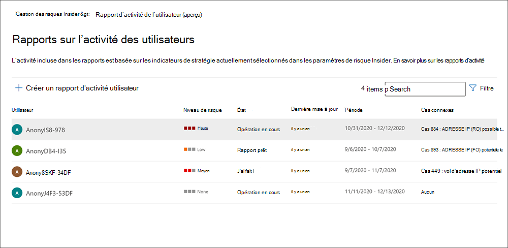

# Examiner les activités de gestion des risques internes

L’étude des activités des utilisateurs à risque est une première étape importante pour réduire les risques internes pour votre organisation. Ces risques peuvent être des activités qui génèrent des alertes à partir de stratégies de gestion des risques internes ou des risques d’activités détectées par des stratégies, mais qui ne créent pas immédiatement une alerte de gestion des risques internes pour les utilisateurs. Vous pouvez examiner ces types d’activités à l’aide des rapports d’activité de l’utilisateur **(aperçu)** ou du tableau de bord **d’alerte.**

## Rapports d’activité utilisateur (aperçu)

Les rapports d’activité des utilisateurs vous permettent d’examiner les activités de certains utilisateurs pendant une période définie sans avoir à les affecter temporairement ou explicitement à une stratégie de gestion des risques internes. Dans la plupart des scénarios de gestion des risques internes, les utilisateurs sont explicitement définis dans des stratégies et peuvent avoir des alertes de stratégie (selon le déclenchement d’événements) et des scores de risque associés aux activités. Toutefois, dans certains scénarios, vous pouvez examiner les activités des utilisateurs qui ne sont pas explicitement définis dans une stratégie. Il peut s’agit d’utilisateurs dont vous avez reçu un conseil sur l’utilisateur et les activités potentiellement risquées, ou d’utilisateurs qui n’ont généralement pas besoin d’être affectés à une stratégie de gestion des risques internes.

Une fois que vous avez configuré les indicateurs sur la page de gestion des risques internes **Paramètres,** l’activité des utilisateurs est détectée pour les activités risquées associées aux indicateurs sélectionnés. Il n’est pas nécessaire de configurer une stratégie pour les rapports d’activité des utilisateurs afin de détecter et signaler les activités risquées par les utilisateurs de votre organisation. Les activités incluses dans les rapports d’activité des utilisateurs ne nécessitent pas de déclenchement d’événements pour que les activités soient affichées. Cette configuration signifie que toutes les activités détectées pour l’utilisateur sont disponibles pour révision, qu’elle ait un événement déclencheur ou qu’elle crée une alerte. Les rapports sont créés par utilisateur et peuvent inclure toutes les activités pour une période personnalisée de 90 jours. Plusieurs rapports pour le même utilisateur ne sont pas pris en charge.

Après avoir examiné les activités d’un utilisateur, les enquêteurs peuvent ignorer les activités individuelles comme étant anodins, partager ou envoyer par courrier électronique un lien vers le rapport avec d’autres enquêteurs, ou choisir d’affecter temporairement ou explicitement l’utilisateur à une stratégie de gestion des risques internes. Les utilisateurs doivent être affectés au groupe de *rôles Enquêteurs* de gestion des risques internes pour afficher la page Rapports **d’activité des utilisateurs.**  

Vous pouvez commencer en sélectionnant **Gérer** les rapports dans la **section** Examiner l’activité des utilisateurs dans la page Vue d’ensemble de la gestion des risques **internes.** Pour afficher les activités d’un utilisateur, sélectionnez d’abord Créer un rapport d’activité utilisateur et complétez les champs suivants dans le volet Nouveau rapport d’activité **de l’utilisateur** : 

- **Utilisateur**: rechercher un utilisateur par nom ou adresse e-mail
- **Date de début**: utilisez le contrôle calendrier pour sélectionner la date de début des activités de l’utilisateur.
- **Date de fin**: utilisez le contrôle calendrier pour sélectionner la date de fin des activités de l’utilisateur. La date de fin sélectionnée doit être supérieure à deux jours après la date de début sélectionnée et pas plus de 90 jours à partir de la date de début sélectionnée.
Les nouveaux rapports prennent généralement jusqu’à 10 heures avant d’être prêts pour révision. Lorsque le rapport est prêt,  le rapport est prêt dans la colonne **État** de la page Rapport d’activité de l’utilisateur. Sélectionnez l’utilisateur pour afficher le rapport détaillé :

Le **rapport d’activité de** l’utilisateur sélectionné contient les onglets Activité de l’utilisateur et Explorateur  **d’activités** :

- **Activité utilisateur**: utilisez cette vue de graphique pour examiner les activités et afficher les activités potentielles qui se produisent par séquences. Cet onglet est structuré pour permettre un examen rapide d’un cas, y compris une chronologie historique de toutes les activités, les détails de l’activité, le score de risque actuel pour l’utilisateur dans le cas, la séquence d’événements de risque et les contrôles de filtrage pour faciliter les recherches.
- **Explorateur d’activités**: **l’onglet Explorateur** d’activités fournit aux enquêteurs des risques un outil analytique complet qui fournit des informations détaillées sur les activités. Avec l’Explorateur d’activités, les réviseurs peuvent rapidement passer en revue une chronologie des activités à risque détectées et identifier et filtrer toutes les activités à risque associées aux alertes. Pour en savoir plus sur l’utilisation de l’Explorateur d’activités, consultez la *section* Explorateur d’activités plus loin dans cet article.

## Tableau de bord d’alerte

Les alertes de gestion des risques internes sont automatiquement générées par les indicateurs de risque définis dans les stratégies de gestion des risques internes. Ces alertes donnent aux analystes et aux enquêteurs de conformité une vue d’ensemble de l’état de risque actuel et permettent à votre organisation de trier et de prendre des mesures pour les risques détectés. Par défaut, les stratégies génèrent une certaine quantité d’alertes de gravité faible, moyenne et élevée, mais vous pouvez augmenter ou diminuer le [volume](insider-risk-management-settings.md#alert-volume) d’alertes en fonction de vos besoins. En outre, vous pouvez configurer le seuil d’alerte pour les indicateurs de stratégie [lors](insider-risk-management-settings.md#indicator-level-settings-preview) de la création d’une stratégie avec l’Assistant Stratégie.

Consultez la vidéo Expérience de triage des [alertes](https://www.youtube.com/watch?v=KgmpxBLJLPI) de gestion des risques internes pour obtenir une vue d’ensemble de la façon dont les alertes fournissent des détails, du contexte et du contenu associé pour les activités risquées et comment rendre votre processus d’examen plus efficace.

Le tableau de **bord** des alertes de risques internes vous permet d’afficher et d’agir sur les alertes générées par les stratégies de risque internes. Chaque widget de rapport affiche des informations pour les 30 derniers jours.

- **Nombre total d’alertes** qui doivent être revue : le nombre total d’alertes devant être revue et triée sont répertoriés, y compris une répartition par gravité de l’alerte.
- Ouvrez les alertes au cours des **30** derniers jours : nombre total d’alertes créées par les correspondances de stratégie au cours des 30 derniers jours, triées par niveaux de gravité d’alerte élevé, moyen et faible.
- **Durée moyenne de résolution des alertes**: résumé des statistiques d’alerte utiles :
  - Délai moyen de résolution des alertes de gravité élevée, indiqué en heures, jours ou mois.
  - Délai moyen de résolution des alertes de gravité moyenne, indiqué en heures, jours ou mois.
  - Délai moyen de résolution des alertes de faible gravité, indiqué en heures, jours ou mois.

> [!NOTE]
> La gestion des risques internes utilise la limitation d’alertes intégrée pour vous aider à protéger et optimiser vos examens de risque et réviser l’expérience. Cette limitation empêche les problèmes qui peuvent entraîner une surcharge d’alertes de stratégie, telles que la configuration incorrecte des connecteurs de données ou des stratégies DLP. Par conséquent, il peut y avoir un retard dans l'affichage de nouvelles alertes pour un utilisateur.

## État de l’alerte et gravité

Vous pouvez trier les alertes dans l’un des états suivants :

- **Confirmé :** alerte confirmée et affectée à un cas nouveau ou existant.
- **Dismissed**: une alerte rejetée comme étant anodin dans le processus de triage.
- **Doit être revue**: nouvelle alerte dans laquelle des actions de tri n’ont pas encore été prises.
- **Résolu :** alerte qui fait partie d’un cas fermé et résolu.

Les scores de risque d’alerte sont automatiquement calculés à partir de plusieurs indicateurs d’activité de risque. Ces indicateurs incluent le type d’activité à risque, le nombre et la fréquence de l’occurrence de l’activité, l’historique de l’activité de risque utilisateur et l’ajout de risques d’activité qui peuvent renforcer la gravité de l’activité. Le score de risque d'alerte détermine l'affectation programmatique d'un niveau de gravité du risque pour chaque alerte et ne peut être personnalisé. Si les alertes restent non récupérables et que les activités de risque continuent à s’accumuler à l’alerte, le niveau de gravité du risque peut augmenter. Les analystes et enquêteurs de risque peuvent utiliser la gravité des risques d’alerte pour vous aider à trier les alertes conformément aux stratégies et normes de risque de votre organisation.

Les niveaux de gravité des risques d’alerte sont :

- **Gravité élevée :** les activités et les indicateurs de l’alerte présentent un risque important. Les activités de risque associées sont graves, répétitives et essentielles à d’autres facteurs de risque importants.
- **Gravité moyenne :** les activités et les indicateurs de l’alerte présentent un risque modéré. Les activités de risque associées sont modérées, fréquentes et présentent une corrélation avec d’autres facteurs de risque.
- **Faible gravité :** les activités et les indicateurs de l’alerte présentent un risque mineur. Les activités de risque associées sont mineures, plus rares et ne sont pas liées à d’autres facteurs de risque importants.

## Filtrer les alertes dans le tableau de bord d’alerte

Selon le nombre et le type de stratégies de gestion des risques internes actif au sein de votre organisation, il peut être difficile de réviser une grande file d’alertes. L’utilisation de filtres d’alerte permet aux analystes et aux enquêteurs de trier les alertes par plusieurs attributs. Pour filtrer les alertes dans le tableau de bord **Alertes,** sélectionnez **le contrôle** Filtre. Vous pouvez filtrer les alertes par un ou plusieurs attributs :

- **État**: sélectionnez une ou plusieurs valeurs d’état pour filtrer la liste d’alertes. Les options sont *Confirmé*, *Fermé*, *Révision requise* et *Résolu*.
- **Gravité : sélectionnez** un ou plusieurs niveaux de gravité des risques d’alerte pour filtrer la liste d’alertes. Les options disponibles sont *Élevée*, *Moyenne* et *Faible*.
- **Heure détectée :** sélectionnez les dates de début et de fin de la création de l’alerte.
- **Stratégie**: sélectionnez une ou plusieurs stratégies pour filtrer les alertes générées par les stratégies sélectionnées.

## Alertes de recherche dans le tableau de bord d’alerte

Pour rechercher le nom d’une alerte pour un mot spécifique, sélectionnez la commande **Recherche** et tapez le mot à rechercher. Les résultats de la recherche affichent une alerte de stratégie contenant le mot défini dans la recherche.

## Ignorer plusieurs alertes (aperçu)

Cela peut permettre aux analystes et aux enquêteurs de faire disparaître immédiatement plusieurs alertes à la fois. L’option Ignorer la barre de commandes **alertes** vous  permet de sélectionner une ou plusieurs alertes avec l’état Révision des besoins dans le tableau de bord et de faire disparaître rapidement ces alertes comme étant anodins selon le cas dans votre processus de tri. Vous pouvez sélectionner jusqu’à 400 alertes à ignorer en même temps.

Pour ignorer une alerte de risque interne, complétez les étapes suivantes :

1. Dans la [Centre de conformité Microsoft 365,](https://compliance.microsoft.com)sélectionnez  l’onglet **Alertes** pour la gestion des risques internes.
2. Dans le tableau **de bord Alertes,** sélectionnez  l’alerte (ou les alertes) avec l’état De révision des besoins que vous souhaitez ignorer.
3. Dans la barre de commandes Alertes, sélectionnez **Ignorer les alertes.**
4. Dans le volet Détails Ignorer les **alertes,** vous pouvez passer en revue les détails de l’utilisateur et de la stratégie associés aux alertes sélectionnées.
5. Sélectionnez **Ignorer les alertes** pour résoudre les alertes comme étant anodins ou sélectionnez **Annuler** pour fermer le volet d’informations sans ignorer les alertes.

## Alertes de triage

Pour trier une alerte de risque interne, effectuer les étapes suivantes :

1. Dans la [Centre de conformité Microsoft 365,](https://compliance.microsoft.com)sélectionnez  l’onglet **Alertes** pour la gestion des risques internes.
2. Dans le tableau **de bord Alertes,** sélectionnez l’alerte que vous souhaitez trier.
3. Dans le **volet d’informations Alertes,** vous pouvez passer en revue les onglets suivants et trier l’alerte :
    - **Résumé :** Cet onglet contient des informations générales sur l’alerte et vous permet de confirmer l’alerte et de créer un nouveau cas ou vous permet d’ignorer l’alerte. Il inclut l’état actuel de l’alerte et le niveau de gravité du risque d’alerte, répertorié comme *élevé,* *moyen* ou *faible*. Le niveau de gravité peut augmenter ou diminuer au fil du temps si l’alerte n’est pas triée.
        - **Ce qui s’est passé (aperçu)**: affiche les trois principales activités de risque et les correspondances de stratégie pendant la période d’évaluation de l’activité, y compris le type de violation associé à l’activité et le nombre d’occurrences.
        - **Détails utilisateur :** affiche des informations générales sur l’utilisateur affecté à l’alerte. Si l’anonymisation est activée, le nom d’utilisateur, l’adresse e-mail, l’alias et les champs de l’organisation sont rendus anonymes.
        - **Détails de** l’alerte : inclut la durée depuis que l’alerte a été générée, les stratégies qui ont généré l’alerte sont répertoriées et le cas généré à partir de l’alerte est répertorié. Pour les nouvelles alertes, le **champ Case** affiche Aucune.
        - **Contenu détecté (aperçu)**: inclut le contenu associé aux activités à risque pour l’alerte et récapitule les événements d’activité par zones clés. La sélection d’un lien d’activité ouvre l’Explorateur d’activités et affiche des détails supplémentaires sur l’activité.
    - **Activité de l’utilisateur**: cet onglet affiche l’historique des activités de l’utilisateur associé à l’alerte. Cet historique inclut d’autres alertes et activités liées aux indicateurs de risque définis dans le modèle affecté à la stratégie pour cette alerte. Cet historique permet aux analystes et enquêteurs de risques de prendre en compte tout comportement à risque passé pour l’employé dans le cadre du processus de triage.
    - **Actions**: les actions suivantes sont disponibles pour chaque alerte :
        - **Vue étendue ouverte :** ouvre le tableau de bord de **l’Explorateur d’activités.**
        - **Confirmez et créez un cas**: utilisez cette action pour confirmer et créer un nouveau cas pour toutes les alertes associées à un utilisateur. Cette action modifie automatiquement l’état de l’alerte *sur Confirmé.*
        - **Ignorer l’alerte**: utilisez cette action pour ignorer l’alerte. Cette action modifie l’état de l’alerte *sur Résolu.*

## Explorateur d’activités (aperçu)

> [!NOTE]
> L’Explorateur d’activités est disponible dans la zone de gestion des alertes pour les utilisateurs ayant déclenché des événements une fois que cette fonctionnalité est disponible dans votre organisation.

L’Explorateur d’activités fournit aux enquêteurs et aux analystes des risques un outil analytique complet qui fournit des informations détaillées sur les alertes. Avec l’Explorateur d’activités, les réviseurs peuvent rapidement passer en revue une chronologie des activités à risque détectées et identifier et filtrer toutes les activités à risque associées aux alertes. Pour filtrer les alertes dans l’Explorateur d’activités, sélectionnez le contrôle Filtre. Vous pouvez filtrer les alertes par un ou plusieurs attributs répertoriés dans le volet d’informations de l’alerte. L’Explorateur d’activités prend également en charge les colonnes personnalisables pour aider les enquêteurs et les analystes à concentrer le tableau de bord sur les informations les plus importantes pour eux.

Pour utiliser **l’Explorateur d’activités,** complétez les étapes suivantes :

1. Dans la Centre de conformité Microsoft 365, **sélectionnez** l’onglet **Alertes** pour la gestion des risques internes.
2. Dans le tableau **de bord Alertes,** sélectionnez l’alerte que vous souhaitez trier.
3. Dans le **volet Détails des alertes,** **sélectionnez Ouvrir en vue étendue.**
4. Dans la page de l’alerte sélectionnée, sélectionnez l’onglet **Explorateur d’activités.**

Lors de l’examen des activités dans l’Explorateur d’activités, les enquêteurs et les analystes peuvent sélectionner une activité spécifique et ouvrir le volet d’informations sur l’activité. Le volet affiche des informations détaillées sur l’activité que les enquêteurs et les analystes peuvent utiliser pendant le processus de tri des alertes. Les informations détaillées peuvent fournir un contexte pour l’alerte et vous aider à identifier l’étendue complète de l’activité de risque ayant déclenché l’alerte.

## Créer un cas pour une alerte

À mesure que l’alerte est examinée et triée, vous pouvez créer un cas pour examiner plus en détail l’activité de risque. Pour créer un cas pour une alerte, suivez les étapes suivantes :

1. Dans la [Centre de conformité Microsoft 365,](https://compliance.microsoft.com)sélectionnez  l’onglet **Alertes** pour la gestion des risques internes.
2. Dans le **tableau de bord Alertes,** sélectionnez l’alerte pour qui vous souhaitez confirmer et créer un cas.
3. Dans le **volet d’informations Alertes,** sélectionnez **Actions** Confirmer les  >  **alertes & créer un cas.**
4. Dans la **boîte de** dialogue Confirmer l’alerte et créer un cas de risque interne, entrez un nom pour le cas, sélectionnez les utilisateurs à ajouter en tant que contributeurs et ajoutez des commentaires le cas échéant. Les commentaires sont automatiquement ajoutés au cas en tant que note de cas.
5. Sélectionnez **Créer un cas** pour  créer un cas ou annuler pour fermer la boîte de dialogue sans créer de cas.

Une fois le cas créé, les enquêteurs et les analystes peuvent gérer le cas et agir sur celui-ci. Pour plus d’informations, consultez l’article sur la gestion des [risques internes.](insider-risk-management-cases.md)
