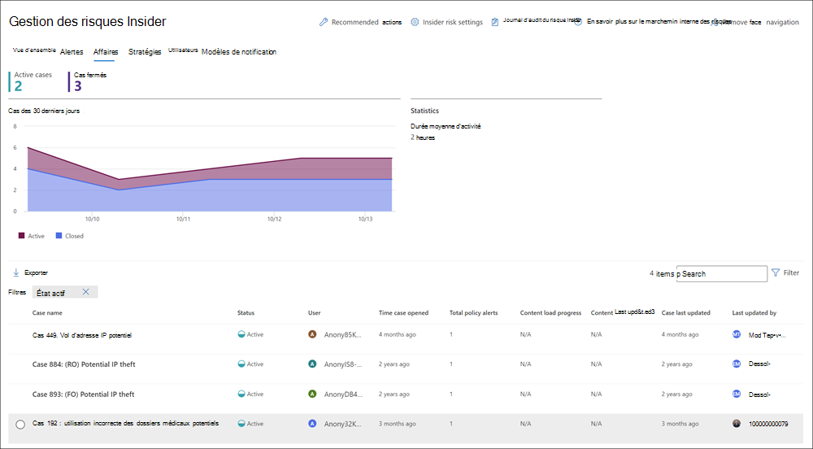

# Cas de gestion des risques internes

>[!IMPORTANT]
>Gestion des risques internes Microsoft Purview met en corrélation différents signaux pour identifier les risques internes potentiels malveillants ou involontaires, tels que le vol d’adresses IP, les fuites de données et les violations de sécurité. La gestion des risques internes permet aux clients de créer des stratégies pour gérer la sécurité et la conformité. Créés avec la confidentialité par conception, les utilisateurs sont pseudonymes par défaut, et des contrôles d’accès en fonction du rôle et des journaux d’audit sont en place pour garantir la confidentialité au niveau de l’utilisateur.

Les cas sont au cœur de la gestion des risques internes et vous permettent d’examiner et d’agir en profondeur sur les problèmes générés par les indicateurs de risque définis dans vos stratégies. Les cas sont créés manuellement à partir d’alertes dans des situations où une action supplémentaire est nécessaire pour résoudre un problème lié à la conformité pour un utilisateur. Chaque cas est limité à un seul utilisateur et plusieurs alertes pour l’utilisateur peuvent être ajoutées à un cas existant ou à un nouveau cas.

Après avoir examiné les détails d’un cas, vous pouvez prendre les mesures suivantes :

- envoi d’un avis à l’utilisateur
- résolution de l’affaire comme étant sans gravité
- partage du cas avec votre instance ServiceNow ou avec un destinataire d’e-mail
- faire remonter le cas d’une enquête eDiscovery (Premium)

Consultez la [vidéo sur l’examen et l’escalade de la gestion des risques internes](https://www.youtube.com/watch?v=UONUSmkRC8s) pour obtenir une vue d’ensemble de la façon dont les cas sont examinés et gérés dans la gestion des risques internes.

[!INCLUDE [purview-preview](../includes/purview-preview.md)]

## Tableau de bord Cas

Le **tableau de bord des cas** de gestion des risques internes vous permet d’afficher et d’agir sur les cas. Chaque widget de rapport du tableau de bord affiche des informations pour les 30 derniers jours.

- **Cas actifs** : nombre total de cas actifs en cours d’investigation.
- **Cas au cours des 30 derniers jours** : nombre total de cas créés, triés par état *Actif* et *Fermé* .
- **Statistiques** : durée moyenne des cas actifs, répertoriés en heures, jours ou mois.

La file d’attente de cas répertorie tous les cas actifs et fermés pour votre organisation, en plus de l’état actuel des attributs de cas suivants :

- **Nom du cas** : nom du cas, défini lorsqu’une alerte est confirmée et que le cas est créé.  
- **État** : état du cas, *Actif* ou *Fermé*.
- **Utilisateur** : utilisateur du cas. Si l’anonymisation des noms d’utilisateur est activée, des informations anonymes s’affichent.
- **Délai d’ouverture** : heure qui s’est écoulée depuis l’ouverture de l’affaire.
- **Nombre total d’alertes de stratégie** : nombre de correspondances de stratégie incluses dans le cas. Ce nombre peut augmenter si de nouvelles alertes sont ajoutées au cas.
- **Dernière mise à jour** du cas : délai écoulé depuis l’ajout d’une note de cas ou d’une modification de l’état du cas.
- **Dernière mise à jour par** : nom de l’analyste ou de l’enquêteur de gestion des risques internes qui a mis à jour le cas pour la dernière fois.

Utilisez le contrôle **De recherche** pour rechercher des noms de cas pour du texte spécifique et utilisez le filtre de cas pour trier les cas selon les attributs suivants :

- État
- Heure d'ouverture du cas, date de début et la date de fin
- Dernière mise à jour, date de début et la date de fin

## Cas de filtre

Selon le nombre et le type de stratégies de gestion des risques internes actives dans votre organisation, il peut être difficile de passer en revue une file d’attente importante de cas. L’utilisation de filtres de cas peut aider les analystes et les enquêteurs à trier les cas selon plusieurs attributs. Pour filtrer les alertes dans le **tableau de bord Cas**, sélectionnez le contrôle **Filtre** . Vous pouvez filtrer les cas par un ou plusieurs attributs :

- **État** : sélectionnez une ou plusieurs valeurs d’état pour filtrer la liste de cas. Les options sont *Active* et *Closed*.
- **Cas d’heure ouvert** : sélectionnez les dates de début et de fin pour l’ouverture du cas.
- **Dernière mise à jour** : sélectionnez les dates de début et de fin de la mise à jour du cas.

## Examiner un cas

Une enquête approfondie sur les alertes de gestion des risques internes est essentielle pour prendre des mesures correctives appropriées. Les cas de gestion des risques internes sont l’outil central de gestion pour approfondir l’historique des activités à risque des utilisateurs, les détails des alertes, la séquence d’événements à risque et explorer le contenu et les messages exposés aux risques. Les analystes et les enquêteurs des risques utilisent également des cas pour centraliser l’examen des commentaires et des notes et pour traiter la résolution des cas.

La sélection d’un cas ouvre les outils de gestion des cas et permet aux analystes et aux enquêteurs d’approfondir les détails des cas.

### Présentation du cas

L’onglet **Vue d’ensemble du cas** récapitule les détails du cas pour les analystes et les enquêteurs en matière de risques. Il inclut les informations suivantes dans la zone **À propos de ce cas**

- **État** : état actuel du cas, Actif ou Fermé.
- **Cas créé le** : date et heure de création du cas.
- **Score de risque de l’utilisateur** : niveau de risque calculé actuel de l’utilisateur pour le cas. Ce score est calculé toutes les 24 heures et utilise les scores de risque d’alerte de toutes les alertes actives associées à l’utilisateur.
- **Email** : alias de messagerie de l’utilisateur pour le cas.
- **Organisation ou service** : organisation ou service auquel l’utilisateur est affecté.
- **Nom du gestionnaire** : nom du responsable de l’utilisateur.
- **E-mail du responsable** : alias de messagerie du responsable de l’utilisateur.

L’onglet **Vue d’ensemble** de la casse comprend également une section Alertes qui inclut les informations **suivantes** sur les alertes de correspondance de stratégie associées au cas :

- **Correspondances** de stratégie : nom de la stratégie de gestion des risques internes associée aux alertes de correspondance pour l’activité de l’utilisateur.
- **État** : état de l’alerte.
- **Gravité** : gravité de l’alerte.
- **Heure détectée** : temps écoulé depuis la génération de l’alerte.

### Alertes

L’onglet **Alertes** récapitule les alertes actuelles incluses dans le cas. De nouvelles alertes peuvent être ajoutées à un cas existant et elles seront ajoutées à la file d’attente **d’alertes** à mesure qu’elles seront affectées. La file d’attente répertorie les attributs d’alerte suivants :

- État
- Severity
- Heure détectée

Sélectionnez une alerte dans la file d’attente pour afficher la page **de détails de l’alerte** .

Utilisez le contrôle de recherche pour rechercher du texte spécifique dans les noms d’alerte et utilisez le filtre d’alerte pour trier les cas selon les attributs suivants :

- État
- Severity
- Heure détectée, la date de début et la date de fin

Utilisez le contrôle de filtre pour filtrer les alertes par plusieurs attributs, notamment :

- **État** : sélectionnez une ou plusieurs valeurs d’état pour filtrer la liste d’alertes. Les options sont *Confirmé*, *Fermé*, *Révision requise* et *Résolu*.
- **Gravité** : sélectionnez un ou plusieurs niveaux de gravité de risque d’alerte pour filtrer la liste d’alertes. Les options disponibles sont *Élevée*, *Moyenne* et *Faible*.
- **Heure détectée** : sélectionnez les dates de début et de fin de la création de l’alerte.
- **Stratégie** : sélectionnez une ou plusieurs stratégies pour filtrer les alertes générées par les stratégies sélectionnées.

### Activité utilisateur

**L’onglet Activité utilisateur** permet aux analystes de risque et aux enquêteurs d’examiner les détails de l’activité et d’utiliser une représentation visuelle de toutes les activités associées aux alertes et aux cas de risque. Par exemple, dans le cadre du processus de triage des alertes, les analystes devront peut-être examiner toutes les activités à risque associées au cas pour plus d’informations. Dans les cas, les enquêteurs de risque peuvent examiner les détails de l’activité des utilisateurs et le graphique en bulles pour mieux comprendre l’étendue globale des activités associées au cas. Pour plus d’informations sur le graphique d’activité utilisateur, consultez l’article [sur les activités de gestion des risques internes](insider-risk-management-activities.md#user-activity) .

### Explorateur d’activités (préversion)

**L’onglet Explorateur d’activités** permet aux analystes de risque et aux enquêteurs d’examiner les détails de l’activité associés aux alertes de risque. Par exemple, dans le cadre des actions de gestion des cas, les enquêteurs et les analystes devront peut-être examiner toutes les activités à risque associées au cas pour plus d’informations. Avec **l’Explorateur d’activités**, les réviseurs peuvent rapidement passer en revue une chronologie des activités à risque détectées et identifier et filtrer toutes les activités à risque associées aux alertes.

Pour plus d’informations sur l’Explorateur d’activités, consultez l’article [sur les activités de gestion des risques internes](insider-risk-management-activities.md#activity-explorer) .

### Preuves légales (préversion)

L’onglet **Preuves légales (préversion)** permet aux enquêteurs des risques d’examiner les captures visuelles associées aux activités à risque incluses dans les cas. Par exemple, dans le cadre des actions de gestion des cas, les enquêteurs peuvent avoir besoin d’aider à clarifier le contexte de l’activité utilisateur en cours d’examen. L’affichage des clips réels de l’activité peut aider l’enquêteur à déterminer si l’activité de l’utilisateur est potentiellement risquée et peut entraîner un incident de sécurité.

Pour plus d’informations sur les preuves judiciaires, consultez l’article [En savoir plus sur les preuves légales de gestion des risques internes](/microsoft-365/compliance/insider-risk-management-forensic-evidence) .

### Explorateur de contenu

**L’onglet Explorateur de** contenu permet aux enquêteurs de risques d’examiner des copies de tous les fichiers individuels et des messages électroniques associés aux alertes de risque. Par exemple, si une alerte est créée lorsqu’un utilisateur télécharge des centaines de fichiers à partir de SharePoint Online et que l’activité déclenche une alerte de stratégie, tous les fichiers téléchargés pour l’alerte sont capturés et copiés dans le cas de gestion des risques internes à partir de sources de stockage d’origine.

L’Explorateur de contenu est un outil puissant avec des fonctionnalités de recherche et de filtrage de base et avancées. Pour en savoir plus sur l’utilisation de l’Explorateur de contenu, consultez [l’Explorateur de contenu de gestion des risques Insider](insider-risk-management-content-explorer.md).

### Notes sur le cas

L’onglet **Notes** de cas dans le cas est l’endroit où les analystes de risque et les enquêteurs partagent des commentaires, des commentaires et des insights sur leur travail pour le cas. Les notes sont des ajouts permanents à un cas et ne peuvent pas être modifiées ou supprimées une fois la note enregistrée. Lors de la création d’un cas à partir d’une alerte, les commentaires entrés dans la boîte de dialogue **Confirmer l’alerte et créer un cas de risque internes** sont automatiquement ajoutés comme note de cas.

Le tableau de bord des notes de cas affiche les notes de l’utilisateur qui a créé la note et le temps écoulé depuis l’enregistrement de la note. Pour rechercher un mot clé spécifique dans le champ de texte de la note de cas, utilisez le bouton **Rechercher** dans le tableau de bord de la casse et entrez un mot clé spécifique.

Pour ajouter une note à un cas :

1. Dans le [portail de conformité Microsoft Purview](https://compliance.microsoft.com), accédez à **La gestion des risques internes** et sélectionnez l’onglet **Cas**.
2. Sélectionnez un cas, puis sélectionnez l’onglet **Notes de cas** .
3. Sélectionnez **Ajouter une note de cas**.
4. Dans la boîte de **dialogue Ajouter une note de cas** , tapez votre note pour le cas. Sélectionnez **Enregistrer** pour ajouter la note au cas ou **sélectionnez Annuler** fermer sans enregistrer la note dans le cas.

### Contributeurs

L’onglet **Contributeurs** dans le cas est l’endroit où les analystes et les enquêteurs peuvent ajouter d’autres réviseurs au cas. Par défaut, tous les utilisateurs **affectés aux rôles Analystes de gestion des risques internes** et **Enquêteurs de gestion des risques internes sont répertoriés** en tant que contributeurs pour chaque cas actif et fermé. Seuls les utilisateurs auxquels le rôle **Insider Risk Management Investigators** a été attribué ont l’autorisation d’afficher des fichiers et des messages dans l’Explorateur de contenu.

L’accès temporaire à un cas peut être accordé en ajoutant un utilisateur en tant que contributeur. Les contributeurs disposent de tous les contrôles de gestion de cas sur le cas spécifique, à l’exception des éléments suivants :

- Autorisation de confirmer ou d’ignorer les alertes
- Autorisation de modifier les contributeurs pour les cas
- Autorisation d’afficher des fichiers et des messages dans l’Explorateur de contenu

Pour ajouter un contributeur à un cas :

1. Dans le [portail de conformité Microsoft Purview](https://compliance.microsoft.com), accédez à **La gestion des risques internes** et sélectionnez l’onglet **Cas**.
2. Sélectionnez un cas, puis sélectionnez l’onglet **Contributeurs** .
3. Sélectionnez **Ajouter un contributeur**.
4. Dans la boîte de dialogue **Ajouter un contributeur** , commencez à taper le nom de l’utilisateur que vous souhaitez ajouter, puis sélectionnez l’utilisateur dans la liste d’utilisateurs suggérée. Cette liste est générée à partir d’Azure Active Directory de votre abonnement client.
5. Sélectionnez **Ajouter** pour ajouter l’utilisateur en tant que contributeur ou **sélectionnez Annuler** fermer la boîte de dialogue sans ajouter l’utilisateur en tant que contributeur.

## Actions de cas

Les enquêteurs de risque peuvent prendre des mesures sur un cas dans l’une des différentes méthodes, en fonction de la gravité du cas, de l’historique des risques de l’utilisateur et des recommandations de votre organisation en matière de risque. Dans certains cas, vous devrez peut-être faire remonter un cas à un utilisateur ou à une enquête de données pour collaborer avec d’autres secteurs de votre organisation et approfondir les activités à risque. La gestion des risques internes est étroitement intégrée à d’autres solutions Microsoft Purview pour vous aider à gérer la résolution de bout en bout.

### Envoyer une notification par e-mail

Dans la plupart des cas, les actions de l’utilisateur qui créent des alertes de risque interne sont accidentelles ou accidentelles. L’envoi d’un avis de rappel à l’utilisateur par e-mail est une méthode efficace pour documenter l’examen et l’action des cas. Il s’agit d’une méthode permettant de rappeler aux utilisateurs les stratégies d’entreprise ou de les pointer vers l’actualisation de la formation. Les avis sont générés à partir de [modèles d’avis que vous créez](insider-risk-management-notices.md) pour votre infrastructure de gestion des risques internes.

Il est important de se rappeler que l’envoi d’une notification par e-mail à un utilisateur ***ne_ résout pas** le cas comme _Closed*. Dans certains cas, vous souhaiterez peut-être laisser un cas ouvert après avoir envoyé un avis à un utilisateur pour qu’il recherche davantage d’activités à risque sans ouvrir un nouveau cas. Si vous voulez résoudre un cas après l’envoi d’une notification, vous devez sélectionner le **Résoudre un cas** sous la forme d’une étape de suivi après l’envoi d’une notification.

Pour envoyer une notification à l’utilisateur affecté à un cas :

1. Dans le [portail de conformité Microsoft Purview](https://compliance.microsoft.com), accédez à **La gestion des risques internes** et sélectionnez l’onglet **Cas**.
2. Sélectionnez un cas, puis sélectionnez le bouton **Envoyer une notification par e-mail** dans la barre d’outils de l’action de cas.
3. Dans la boîte **de dialogue Envoyer un avis de courrier électronique** , sélectionnez le contrôle de liste **déroulante Choisir un modèle d’avis** pour sélectionner le modèle d’avis de l’avis. Cette sélection préremplit les autres champs de l’avis.
4. Passez en revue les champs d’avis et mettez à jour le cas échéant. Les valeurs entrées ici remplacent les valeurs du modèle.
5. Sélectionnez **Envoyer** pour envoyer l’avis à l’utilisateur ou **sélectionnez Annuler** fermer la boîte de dialogue sans envoyer l’avis à l’utilisateur. Tous les avis envoyés sont ajoutés à la file d’attente des notes de cas dans le tableau de bord **Des notes de cas** .

### Réaffecter pour examen

Faites remonter le cas de l’investigation utilisateur dans les situations où une révision juridique supplémentaire est nécessaire pour l’activité à risque de l’utilisateur. Cette escalade ouvre un nouveau cas de Microsoft Purview eDiscovery (Premium) dans votre organisation Microsoft 365. La découverte électronique (Premium) fournit un flux de travail de bout en bout pour préserver, collecter, examiner, analyser et exporter le contenu qui répond aux enquêtes juridiques internes et externes de votre organisation. Il permet également à votre équipe juridique de gérer l’ensemble du flux de travail de notification de conservation légale pour communiquer avec les conservateurs impliqués dans un cas. L’escalade vers un cas eDiscovery (Premium) à partir d’un cas de gestion des risques internes aide votre équipe juridique à prendre les mesures appropriées et à gérer la conservation du contenu. Pour en savoir plus sur les cas eDiscovery (Premium), consultez [Vue d’ensemble de Microsoft Purview eDiscovery (Premium).](overview-ediscovery-20.md)

Pour faire remonter un cas à une enquête utilisateur :

1. Dans le [portail de conformité Microsoft Purview](https://compliance.microsoft.com), accédez à **La gestion des risques internes** et sélectionnez l’onglet **Cas**.
2. Sélectionnez un cas, puis **sélectionnez le bouton Escalader pour l’examen** dans la barre d’outils de l’action de cas.
3. Dans la boîte de dialogue **Escalader pour l’investigation** , entrez un nom pour la nouvelle investigation utilisateur. Si nécessaire, entrez des notes sur le cas et sélectionnez **Escalate**.
4. Passez en revue les champs d’avis et mettez à jour le cas échéant. Les valeurs entrées ici remplacent les valeurs du modèle.
5. Sélectionnez **Confirmer** pour créer le cas d’investigation utilisateur ou **sélectionnez Annuler** pour fermer la boîte de dialogue sans créer de cas d’enquête utilisateur.

Une fois que le cas de gestion des risques internes a été remonté à un nouveau cas d’enquête utilisateur, vous pouvez examiner le nouveau cas dans la zone **eDiscovery** > **Advanced** dans le portail de conformité Microsoft Purview.

### Exécuter des tâches automatisées avec des flux Power Automate pour le cas

À l’aide des flux Power Automate recommandés, les enquêteurs et les analystes des risques peuvent rapidement prendre des mesures pour :

- Demander des informations auprès des rh ou des entreprises sur un utilisateur dans un cas de risque interne
- Avertir le responsable lorsqu’un utilisateur a une alerte de risque interne
- Créer un enregistrement pour un cas de gestion des risques internes dans ServiceNow
- Avertir les utilisateurs lorsqu’ils sont ajoutés à une stratégie de risque interne

Pour exécuter, gérer ou créer des flux Power Automate pour un cas de gestion des risques internes :

1. Sélectionnez **Automatiser** dans la barre d’outils de l’action de cas. 
2. Choisissez le flux Power Automate à exécuter, puis sélectionnez **Exécuter le flux**. 
3. Une fois le flux terminé, sélectionnez **Terminé**.

Pour en savoir plus sur les flux Power Automate pour la gestion des risques internes, consultez [Prise en main des paramètres de gestion des risques internes](insider-risk-management-settings.md#power-automate-flows-preview).

### Afficher ou créer une équipe Microsoft Teams pour le cas

Lorsque l’intégration de Microsoft Teams pour la gestion des risques internes est activée dans les paramètres, une équipe Microsoft Teams est automatiquement créée chaque fois qu’une alerte est confirmée et qu’un cas est créé. Les enquêteurs et les analystes des risques peuvent rapidement ouvrir Microsoft Teams et accéder directement à l’équipe pour un cas en sélectionnant **Afficher l’équipe Microsoft Teams** dans la barre d’outils d’action de cas.

Pour les cas ouverts avant d’activer l’intégration de Microsoft Team, les enquêteurs et les analystes des risques peuvent créer une équipe Microsoft Teams pour un cas en sélectionnant **Créer une équipe Microsoft Teams** dans la barre d’outils d’action de cas.

Lorsqu’un cas est résolu, l’équipe Microsoft associée est automatiquement archivée (masquée et convertie en lecture seule).

Pour en savoir plus sur Microsoft Teams pour la gestion des risques internes, consultez [Prise en main des paramètres de gestion des risques internes](insider-risk-management-settings.md#microsoft-teams-preview).

### Résoudre le cas

Une fois que les analystes et les enquêteurs des risques ont terminé leur examen et leur enquête, un cas peut être résolu pour agir sur toutes les alertes actuellement incluses dans le cas. La résolution d’un cas ajoute une classification de résolution, remplace l’état du cas par *Fermé* et les raisons de l’action de résolution sont automatiquement ajoutées à la file d’attente des notes de cas dans le tableau de bord **Des notes** de cas. Les cas sont résolus comme suit :

- **Bénin** : classification pour les cas où les alertes de correspondance de stratégie sont évaluées comme étant à faible risque, non graves ou faux positifs.
- **Violation de stratégie confirmée** : classification pour les cas où les alertes de correspondance de stratégie sont évaluées comme étant risquées, graves ou le résultat d’une intention malveillante.

Pour résoudre un cas :

1. Dans le [portail de conformité Microsoft Purview](https://compliance.microsoft.com), accédez à **La gestion des risques internes** et sélectionnez l’onglet **Cas**.
2. Sélectionnez un cas, puis sélectionnez le bouton **Résoudre le cas** dans la barre d’outils de l’action de cas.
3. Dans la boîte de dialogue **Résoudre le cas** , sélectionnez le contrôle **Résoudre en tant que** contrôle de liste déroulante pour sélectionner la classification de résolution pour le cas. Les options sont **une violation de stratégie bénigne** ou **confirmée**.
4. Dans la boîte de dialogue **Résoudre le cas** , entrez les raisons de la classification de résolution dans le champ de texte **Action prise** .
5. Sélectionnez **Résoudre** pour fermer le cas ou **sélectionnez Annuler** fermer la boîte de dialogue sans résoudre le cas.
