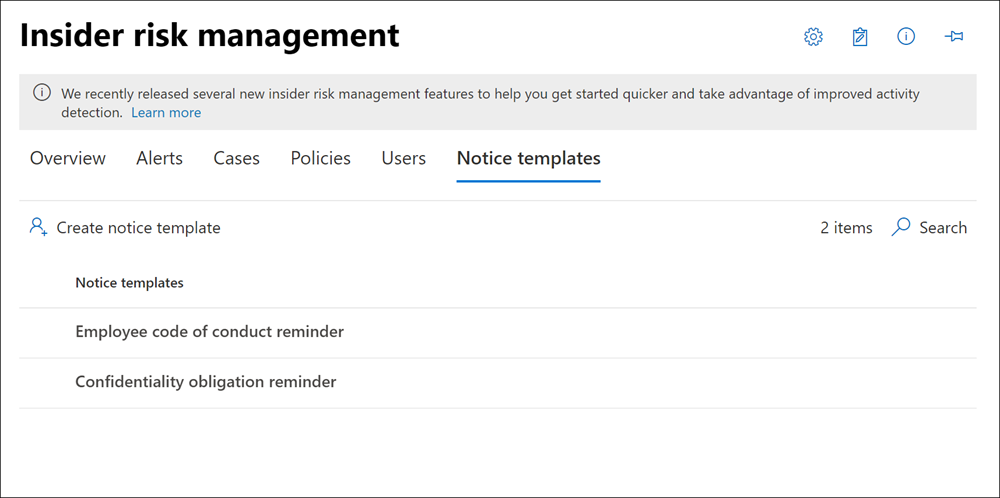

# <a name="insider-risk-management-notice-templates"></a>Modèles de notifications sur la gestion des risques internes

>[!IMPORTANT]
>Gestion des risques internes Microsoft Purview met en corrélation différents signaux pour identifier les risques internes potentiels malveillants ou involontaires, tels que le vol d’adresses IP, les fuites de données et les violations de sécurité. La gestion des risques internes permet aux clients de créer des stratégies pour gérer la sécurité et la conformité. Créés avec la confidentialité par conception, les utilisateurs sont pseudonymes par défaut, et des contrôles d’accès en fonction du rôle et des journaux d’audit sont en place pour garantir la confidentialité au niveau de l’utilisateur.

Les modèles d’avis de gestion des risques internes vous permettent d’envoyer automatiquement des messages électroniques aux utilisateurs lorsqu’un cas est créé pour les activités qui ont généré une correspondance de stratégie et une alerte confirmée. Pour la plupart des alertes qui génèrent des cas, les actions de l’utilisateur sont le résultat d’erreurs ou d’activités accidentelles sans intention malveillante. Les avis servent de rappels simples aux utilisateurs pour qu’ils soient plus prudents, fournissent des liens vers des informations pour la formation d’actualisation ou des ressources de stratégie d’entreprise. Les avis peuvent être une partie importante de votre programme de formation à la conformité interne et peuvent vous aider à créer une piste d’audit documentée pour les utilisateurs présentant des activités à risque périodiques.

Créez des modèles d’avis si vous souhaitez envoyer aux utilisateurs un avis de rappel par e-mail pour les correspondances de stratégie dans le cadre du processus de résolution de cas. Les avis ne peuvent être envoyés qu’à l’adresse e-mail de l’utilisateur associée au cas spécifique en cours de révision. Lorsque vous sélectionnez un modèle d’avis à appliquer à une correspondance de stratégie, vous pouvez choisir d’accepter les valeurs de champ définies dans le modèle ou de remplacer les champs en fonction des besoins.

[!INCLUDE [purview-preview](../includes/purview-preview.md)]

## <a name="notice-templates-dashboard"></a>Notez le tableau de bord des modèles

Le **Tableau de bord modèles de notifications** affiche une liste de modèles de notifications configurés et vous permet de créer des modèles de notifications. Les modèles de notifications sont répertoriés à l’aide du modèle de notifications le plus récent répertorié en premier.



## <a name="html-for-notices"></a>HTML pour les avis

Si vous souhaitez créer plus qu’un simple message électronique textuel pour les notifications, vous pouvez créer un message plus détaillé à l’aide du code HTML dans le champ corps du message d’un modèle d’avis. L’exemple suivant fournit le format de corps du message pour un modèle de notification par e-mail HTML de base :

```HTML
<!DOCTYPE html>
<html>
<body>
<h2>Action Required: Contoso User Code of Conduct Policy Training</h2>
<p>A recent activity you've performed has generated a risk alert prohibited by the Contoso User <a href='https://www.contoso.com'>Code of Conduct Policy</a>.</p>
<p>You are required to attend the Contoso User Code of Conduct <a href='https://www.contoso.com'>training</a> within the next 14 days. Please contact <a href='mailto:hr@contoso.com'>Human Resources</a> with any questions about this training request.</p>
<p>Thank you,</p>
<p><em>Human Resources</em></p>
</body>
</html>
```

> [!NOTE]
> L’implémentation d’attribut href HTML dans les modèles d’avis de gestion des risques internes prend actuellement en charge uniquement les guillemets simples au lieu de guillemets doubles pour les références d’URL.

## <a name="create-a-new-notice-template"></a>Créer un modèle d’avis

Pour créer un modèle d’avis de gestion des risques internes, vous allez utiliser l’outil de création d’avis dans la solution **de gestion des risques Insider** dans le portail de conformité Microsoft Purview.

Effectuez les étapes suivantes pour créer un modèle d’avis de gestion des risques internes :

1. Dans le [portail de conformité Microsoft Purview](https://compliance.microsoft.com), accédez à **La gestion des risques internes** et sélectionnez l’onglet **Modèles d’avis**.
2. Sélectionnez **Créer un modèle d’avis** pour ouvrir l’outil de création d’avis.
3. Dans la page **Créer un modèle d’avis** , renseignez les champs suivants :
    - **Nom du modèle** : entrez un nom convivial pour l’avis. Ce nom apparaît dans la liste des avis dans le tableau de bord des avis et dans la liste de sélection des avis lors de l’envoi de notifications à partir d’un cas.
    - **Envoyer à partir de** : entrez l’adresse e-mail de l’expéditeur pour l’avis. Cette adresse s’affiche dans le champ **De :** dans toutes les notifications envoyées aux utilisateurs, sauf modification lors de l’envoi d’un avis à partir d’un cas.
    - **Champs Cc et Cci** : utilisateurs ou groupes facultatifs à notifier de la correspondance de stratégie, sélectionnés dans Active Directory pour votre abonnement.
    - **Objet** : Les informations qui apparaissent dans la ligne d’objet du message prennent en charge les caractères texte.
    - **Corps du message** : informations qui apparaissent dans le corps du message, prennent en charge le texte ou les valeurs HTML.
4. Sélectionnez **Créer** pour créer et enregistrer le modèle d’avis ou **sélectionnez Annuler** pour fermer sans enregistrer le modèle d’avis.

## <a name="update-a-notice-template"></a>Mettre à jour un modèle d’avis

Pour mettre à jour un modèle d’avis de gestion des risques internes existant, effectuez les étapes suivantes :

1. Dans le [portail de conformité Microsoft Purview](https://compliance.microsoft.com), accédez à **La gestion des risques internes** et sélectionnez l’onglet **Modèles d’avis**.
2. Dans le tableau de bord de l’avis, sélectionnez le modèle d’avis que vous souhaitez gérer.
3. Dans la page des détails de l’avis, **sélectionnez Modifier**
4. Dans la page **Modifier** , vous pouvez modifier les champs suivants :
    - **Nom du modèle** : entrez un nouveau nom convivial pour l’avis. Ce nom apparaît dans la liste des avis dans le tableau de bord des avis et dans la liste de sélection des avis lors de l’envoi de notifications à partir d’un cas.
    - **Envoyer à partir de** : mettez à jour l’adresse e-mail de l’expéditeur pour l’avis. Cette adresse s’affiche dans le champ **De :** dans toutes les notifications envoyées aux utilisateurs, sauf modification lors de l’envoi d’un avis à partir d’un cas.
    - **Champs Cc et Cci** : mettez à jour les utilisateurs ou groupes facultatifs pour être notifiés de la correspondance de stratégie, sélectionnés dans Active Directory pour votre abonnement.
    - **Objet** : Mettre à jour les informations qui apparaissent dans la ligne d’objet du message, prend en charge les caractères texte.
    - **Corps du message** : mettez à jour les informations qui apparaissent dans le corps du message, prennent en charge le texte ou les valeurs HTML.
5. Sélectionnez **Enregistrer** pour mettre à jour et enregistrer l’avis, ou **sélectionnez Annuler** pour fermer sans enregistrer le modèle d’avis.

## <a name="delete-a-notice-template"></a>Supprimer un modèle d’avis

Pour supprimer un modèle d’avis de gestion des risques internes existant, effectuez les étapes suivantes :

1. Dans le [portail de conformité Microsoft Purview](https://compliance.microsoft.com), accédez à **La gestion des risques internes** et sélectionnez l’onglet **Modèles d’avis**.
2. Dans le tableau de bord de l’avis, sélectionnez le modèle d’avis à supprimer.
3. Sélectionnez l’icône **Supprimer** dans la barre d’outils.
4. Pour supprimer le modèle d’avis, sélectionnez **Oui** dans la boîte de dialogue Supprimer. Pour annuler la suppression, sélectionnez **Annuler**.
