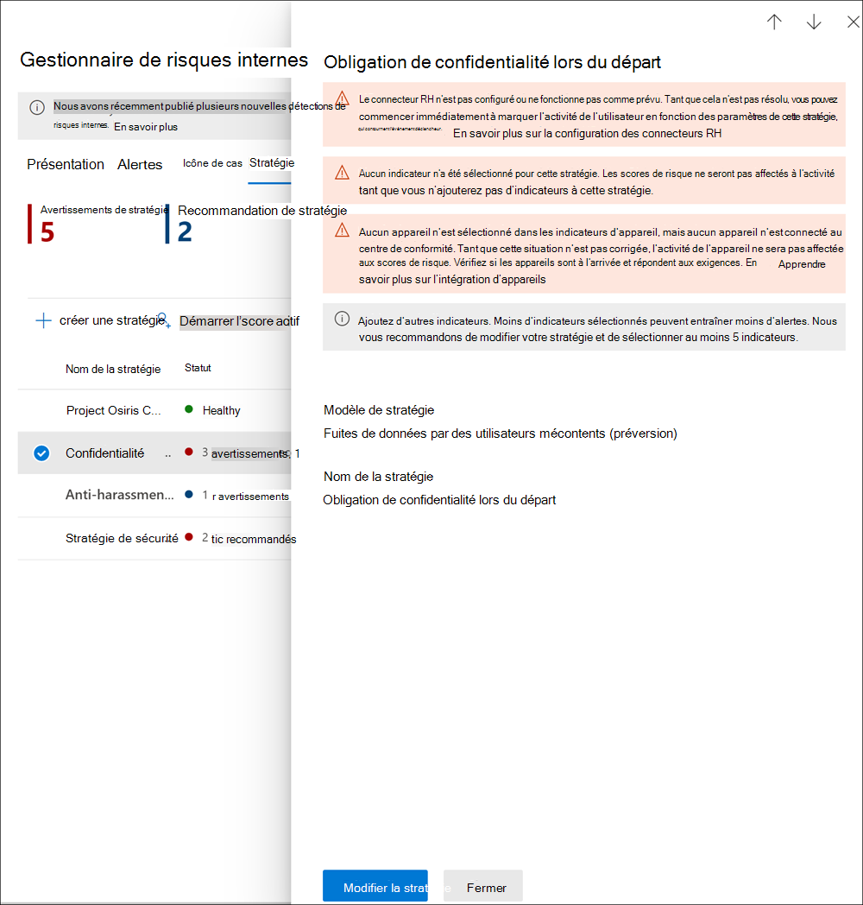

# <a name="insider-risk-management-policies"></a>Stratégies de gestion des risques internes

Les stratégies de gestion des risques internes déterminent quels utilisateurs sont dans l’étendue et quels types d’indicateurs de risque sont configurés pour les alertes. Vous pouvez rapidement créer une stratégie qui s’applique à tous les utilisateurs de votre organisation ou définir des utilisateurs individuels ou des groupes à gérer dans une stratégie. Les stratégies de prise en charge des priorités de contenu pour concentrer les conditions de stratégie sur plusieurs Microsoft Teams, sites SharePoint, types de confidentialité des données et étiquettes de données spécifiques ou multiples. À l’aide de modèles, vous pouvez sélectionner des indicateurs de risque spécifiques et personnaliser les seuils d’événement pour les indicateurs de stratégie, en personnalisant efficacement les scores de risque, ainsi que le niveau et la fréquence des alertes. En outre, les détections de score de risque et d’anomalies permettent d’identifier l’activité des utilisateurs qui est plus importante ou plus inhabituelle. Les fenêtres de stratégie vous permettent de définir le délai d’application de la stratégie aux activités d’alerte et sont utilisées pour déterminer la durée de la stratégie une fois activée.

## <a name="policy-dashboard"></a>Tableau de bord de stratégie

Le  tableau de bord de stratégie vous permet de voir rapidement les stratégies de votre organisation, l’état de la stratégie, d’ajouter manuellement des utilisateurs aux stratégies et d’afficher l’état des alertes associées à chaque stratégie.

- **Nom de la** stratégie : nom attribué à la stratégie dans l’Assistant Stratégie.
- **État**: état d’état d’santé de chaque stratégie. Affiche le nombre d’avertissements et de  recommandations de stratégie, ou un état Sain pour les stratégies sans problèmes.  Vous pouvez cliquer sur la stratégie pour voir les détails de l’état d’état d’état des avertissements ou recommandations.
- **Alertes actives**: nombre d’alertes actives pour chaque stratégie.
- **Alertes confirmées**: nombre total d’alertes résultant de cas de la stratégie au cours des 365 derniers jours.
- **Actions prises sur les alertes**: nombre total d’alertes qui ont été confirmées ou rejetées au cours des 365 derniers jours.
- Efficacité des **alertes** de stratégie : pourcentage déterminé par le nombre total d’alertes confirmées divisé par le nombre total d’actions entreprises sur les alertes (c’est-à-dire la somme des alertes confirmées ou rejetées au cours de l’année précédente).


## <a name="policy-recommendations-from-analytics-preview"></a>Recommandations de stratégie à partir de l’analyse (aperçu)

L’analyse des risques internes vous permet d’effectuer une évaluation des risques internes potentiels dans votre organisation sans configurer de stratégies de risques internes. Cette évaluation peut aider votre organisation à identifier les zones potentielles à haut risque pour les utilisateurs et à déterminer le type et l’étendue des stratégies de gestion des risques internes que vous pouvez envisager de configurer.

Pour en savoir plus sur l’analyse des risques internes et les recommandations de stratégie, voir Paramètres de gestion des risques internes [: Analyse (prévisualisation).](insider-risk-management-settings.md#analytics-preview)

## <a name="policy-templates"></a>Modèles de stratégie

Les modèles de gestion des risques internes sont des conditions de stratégie prédéfinëes qui définissent les types d’indicateurs de risque et le modèle d’évaluation des risques utilisés par la stratégie. Chaque stratégie doit avoir un modèle affecté dans l’Assistant de création de stratégie avant la création de celle-ci. La gestion des risques internes prend en charge jusqu’à cinq stratégies pour chaque modèle de stratégie. Lorsque vous créez une stratégie de risque interne avec l’Assistant Stratégie, vous avez le choix entre l’un des modèles de stratégie suivants :

### <a name="data-theft-by-departing-users"></a>Vol de données par des utilisateurs qui quittent le site

Lorsque des utilisateurs quittent votre organisation, des indicateurs de risque spécifiques sont généralement associés au vol de données par les utilisateurs qui quittent l’organisation. Ce modèle de stratégie utilise des indicateurs d’exfiltration pour le score de risque et se concentre sur la détection et les alertes dans ce domaine de risque. Le vol de données pour les utilisateurs qui quittent l’entreprise peut inclure le téléchargement de fichiers à partir de SharePoint Online, l’impression de fichiers et la copie de données dans des services de messagerie et de stockage cloud personnels près de leur lieu de travail et de leur date de fin. En utilisant le connecteur Microsoft 365 HR ou l’option de surveillance automatique de la suppression de compte d’utilisateur dans Azure Active Directory pour votre organisation, ce modèle démarre l’évaluation des indicateurs de risque relatifs à ces activités et leur corrélation avec l’état d’emploi des utilisateurs.

>[!IMPORTANT]
>Lorsque vous utilisez ce modèle, vous pouvez configurer un connecteur Microsoft 365 HR pour importer régulièrement les informations de date de résiliation et de résiliation pour les utilisateurs de votre organisation. Consultez [l’article](import-hr-data.md) Importer des données avec le connecteur RH pour obtenir des instructions pas à pas pour configurer le connecteur RH Microsoft 365 pour votre organisation. Si vous choisissez de ne pas utiliser le connecteur RH, vous devez sélectionner l’option Compte d’utilisateur supprimé d’Azure AD lors de la configuration des événements de déclencheur dans l’Assistant Stratégie.

### <a name="general-data-leaks"></a>Fuites générales de données

La protection des données et la prévention des fuites de données sont un défi constant pour la plupart des organisations, en particulier avec la croissance rapide des nouvelles données créées par les utilisateurs, les appareils et les services. Les utilisateurs sont habilités à créer, stocker et partager des informations entre les services et les appareils, ce qui rend la gestion des fuites de données de plus en plus complexe et difficile. Les fuites de données peuvent inclure un partage accidentel d’informations en dehors de votre organisation ou un vol de données à des fins malveillantes. Avec une stratégie de protection contre la perte de données (DLP) affectée ou l’événement déclencheur intégré, ce modèle commence à détecter en temps réel les téléchargements de données SharePoint Online suspects, le partage de fichiers et de dossiers, l’impression de fichiers et la copie des données dans les services de messagerie et de stockage cloud personnels.

Lorsque vous utilisez un modèle *de fuites* de données, vous pouvez affecter une stratégie DLP pour déclencher des indicateurs dans la stratégie de risque interne pour les alertes de gravité élevée dans votre organisation. Chaque fois qu’une alerte de gravité élevée est générée par une règle de stratégie DLP est ajoutée au journal d’audit Office 365, les stratégies de risque interne créées avec ce modèle examinent automatiquement l’alerte DLP de gravité élevée. Si l’alerte contient un utilisateur dans l’étendue défini dans la stratégie de risque interne, l’alerte est traitée par la stratégie de risque interne en tant que nouvelle alerte et une gravité des risques internes et un score de risque lui sont attribués. Cette stratégie vous permet d’évaluer cette alerte en contexte avec d’autres activités incluses dans le cas. Si vous ne choisissez pas de stratégie DLP, vous devez sélectionner l’événement déclencheur intégré.

#### <a name="data-leaks-policy-guidelines"></a>Recommandations en matière de stratégie de fuite de données

Lorsque vous créez ou modifiez des stratégies DLP à utiliser avec des stratégies de gestion des risques internes, prenons en compte les recommandations suivantes :

- Hiérarchisez les événements d’exfiltration de données et soyez sélectif lors de l’affectation des paramètres de rapports **d’incident** à *Élevé* lors de la configuration des règles dans vos stratégies DLP. Par exemple, l’envoi par courrier électronique de documents sensibles à un concurrent connu doit être *un* événement d’exfiltration de niveau d’alerte élevé. La sur-affectation  du niveau  élevé dans les paramètres des rapports d’incident dans d’autres règles de stratégie DLP peut augmenter le bruit dans le flux de travail d’alerte de gestion des risques internes et rendre plus difficile pour vos enquêteurs et analystes de données d’évaluer correctement ces alertes. Par exemple,  l’attribution de niveaux d’alerte élevés pour accéder aux activités par déni dans les stratégies DLP complique l’évaluation du comportement et des activités des utilisateurs réellement risqués.
- Assurez-vous que vous comprenez et configurez correctement les utilisateurs dans l’étendue dans les stratégies de gestion des risques internes et DLP. Seuls les utilisateurs définis en tant que stratégies de gestion des risques internes à l’aide du modèle fuites de données auront des **alertes** de stratégie DLP de gravité élevée traitées. En outre, seuls les utilisateurs définis comme étant dans l’étendue d’une règle pour une alerte DLP de gravité élevée seront examinés par la stratégie de gestion des risques internes pour examen. Il est important de ne pas configurer inconsciemment les utilisateurs dans l’étendue dans vos stratégies DLP et de risques internes de manière conflictuelle.

     Par exemple, si vos règles de stratégie DLP sont limitées aux utilisateurs de l’équipe commerciale et que la stratégie de risque interne créée à partir du modèle de fuites de données a défini tous les utilisateurs comme étant dans l’étendue, la stratégie de risque interne traitera uniquement les alertes DLP de gravité élevée pour les **utilisateurs** de l’équipe commerciale. La stratégie de risque interne ne reçoit aucune alerte DLP haute priorité que les utilisateurs doivent traiter et qui ne sont pas définies dans les règles DLP de cet exemple. À l’inverse, si votre stratégie de gestion des risques internes créée à partir de modèles de fuites de données s’étendue uniquement aux **utilisateurs** de l’équipe commerciale et que la stratégie DLP affectée est étendue à tous les utilisateurs, la stratégie de risque interne traitera uniquement les alertes DLP de gravité élevée pour les membres de l’équipe commerciale. La stratégie de gestion des risques internes ignorera les alertes DLP de gravité élevée pour tous les utilisateurs qui ne sont pas membres de l’équipe commerciale.

- Assurez-vous que le **paramètre** de règle rapports d’incident dans la  stratégie DLP utilisée pour ce modèle de gestion des risques internes est configuré pour les alertes de niveau de gravité élevé. Le  niveau de gravité élevé est le déclenchement des événements et les alertes de gestion des risques internes ne sont pas générées à partir des règles dans les stratégies DLP avec le champ Rapports **d’incidents** définie sur *Faible* ou *Moyen*.

    

     >[!NOTE]
     >Lorsque vous créez une stratégie DLP à l’aide des modèles intégrés, vous devez sélectionner l’option  Créer ou personnaliser des règles **DLP** avancées pour configurer le paramètre Rapports **d’incident** pour le niveau de gravité élevé.

Une seule stratégie DLP peut être affectée à chaque stratégie de gestion des risques internes créée à partir du modèle de **fuites** de données. Envisagez de créer une stratégie DLP dédiée qui combine les différentes activités que vous souhaitez détecter et agir comme déclencheurs d’événements pour les stratégies de risques internes qui utilisent le modèle de **fuites de** données.

Consultez [l’article Créer, tester](create-test-tune-dlp-policy.md) et régler une stratégie DLP pour obtenir des instructions pas à pas pour configurer des stratégies DLP pour votre organisation.

### <a name="data-leaks-by-priority-users-preview"></a>Fuites de données par les utilisateurs prioritaires (aperçu)

La protection des données et la prévention des fuites de données pour les utilisateurs de votre organisation peuvent dépendre de leur position, du niveau d’accès aux informations sensibles ou de l’historique des risques. Les fuites de données peuvent inclure le partage accidentel d’informations hautement sensibles en dehors de votre organisation ou le vol de données à des fins malveillantes. Avec une stratégie de protection contre la perte de données (DLP) affectée, ce modèle démarre l’évaluation en temps réel des détections d’activité suspecte et augmente la probabilité d’alertes et d’alertes à risque interne avec des niveaux de gravité plus élevés. Les utilisateurs prioritaires sont définis dans les groupes [d’utilisateurs](insider-risk-management-settings.md#priority-user-groups-preview) prioritaires configurés dans la zone des paramètres de gestion des risques internes.

Comme avec le **modèle Fuites générales** de données, vous devez affecter une stratégie DLP pour déclencher des indicateurs dans la stratégie de risque interne pour les alertes de gravité élevée dans votre organisation. Suivez les instructions de stratégie de fuite de données ci-dessus lors de la création d’une stratégie à l’aide de ce modèle. En outre, vous devez affecter à la stratégie des groupes d’utilisateurs prioritaires créés dans les  >  **paramètres** de gestion des risques  >   internes.

### <a name="data-leaks-by-disgruntled-users-preview"></a>Fuites de données par des utilisateurs disgrunts (aperçu)

Lorsque les utilisateurs font face à des contraintes d’emploi, ils peuvent devenir indisciplinés, ce qui peut augmenter les risques internes. Ce modèle démarre l’score de l’activité de l’utilisateur lorsqu’un indicateur associé à disgruntlement est identifié. Les notifications d’amélioration des performances, les révisions de performances médiocres ou les modifications apportées à l’état du niveau de travail en sont des exemples. Les fuites de données pour les utilisateurs non régrunts peuvent inclure le téléchargement de fichiers à partir de SharePoint Online et la copie de données dans des services de messagerie et de stockage cloud personnels proches des événements de contrainte d’emploi.

Lorsque vous utilisez ce modèle, vous devez également configurer un connecteur RH Microsoft 365 pour importer régulièrement des notifications d’amélioration des performances, un état d’évaluation des performances médiocres ou des informations de modification du niveau de travail pour les utilisateurs de votre organisation. Consultez [l’article](import-hr-data.md) Importer des données avec le connecteur RH pour obtenir des instructions pas à pas pour configurer le connecteur RH Microsoft 365 pour votre organisation.

### <a name="general-security-policy-violations-preview"></a>Violations générales de la stratégie de sécurité (aperçu)

Dans de nombreuses organisations, les utilisateurs sont autorisés à installer des logiciels sur leurs appareils ou à modifier les paramètres de l’appareil pour faciliter leurs tâches. Par inadvertance ou avec une intention malveillante, les utilisateurs peuvent installer des programmes malveillants ou désactiver des fonctionnalités de sécurité importantes qui aident à protéger les informations sur leur appareil ou sur vos ressources réseau. Ce modèle de stratégie utilise les alertes de sécurité de Microsoft Defender pour le point de terminaison pour commencer à marquer ces activités et la détection de focus et les alertes à cette zone de risque. Utilisez ce modèle pour fournir des informations sur les violations de stratégie de sécurité dans les scénarios où les utilisateurs peuvent avoir un historique de violations de stratégie de sécurité qui peuvent être un indicateur de risque interne.

Microsoft Defender pour point de terminaison doit être configuré dans votre organisation et activer Defender pour le point de terminaison pour l’intégration de la gestion des risques internes dans le Centre de sécurité Defender pour importer les alertes de violation de sécurité. Pour plus d’informations sur la configuration de Defender pour Endpoint pour l’intégration de la gestion des risques internes, voir Configurer des fonctionnalités avancées [dans Defender pour Endpoint.](/windows/security/threat-protection/microsoft-defender-atp/advanced-features#share-endpoint-alerts-with-microsoft-compliance-center)

### <a name="security-policy-violations-by-departing-users-preview"></a>Violations de stratégie de sécurité par les utilisateurs qui quittent le site (aperçu)

Les utilisateurs sortants, qu’ils s’en vont dans des conditions positives ou négatives, peuvent être plus à risque pour les violations de stratégie de sécurité. Pour vous protéger contre les violations de sécurité accidentelles ou malveillantes pour les utilisateurs qui quittent l’entreprise, ce modèle de stratégie utilise les alertes Defender for Endpoint pour fournir des informations sur les activités liées à la sécurité. Ces activités incluent l’installation de programmes malveillants ou d’autres applications potentiellement dangereuses par l’utilisateur et la désactivation des fonctionnalités de sécurité sur leurs appareils. À l’aide du connecteur [Microsoft 365 HR](import-hr-data.md) ou de l’option de surveillance automatique de la suppression de compte d’utilisateur dans Azure Active Directory pour votre organisation, ce modèle démarre l’évaluation des indicateurs de risque relatifs à ces activités de sécurité et leur corrélation avec l’état d’emploi des utilisateurs.

Microsoft Defender pour point de terminaison doit être configuré dans votre organisation et activer Defender pour le point de terminaison pour l’intégration de la gestion des risques internes dans le Centre de sécurité Defender pour importer les alertes de violation de sécurité. Pour plus d’informations sur la configuration de Defender pour Endpoint pour l’intégration de la gestion des risques internes, voir Configurer des fonctionnalités avancées [dans Defender pour Endpoint.](/windows/security/threat-protection/microsoft-defender-atp/advanced-features#share-endpoint-alerts-with-microsoft-compliance-center)

### <a name="security-policy-violations-by-priority-users-preview"></a>Violations de stratégie de sécurité par les utilisateurs prioritaires (aperçu)

La protection contre les violations de sécurité pour les utilisateurs de votre organisation peut dépendre de leur position, du niveau d’accès aux informations sensibles ou de l’historique des risques. Étant donné que les violations de sécurité par les utilisateurs prioritaires peuvent avoir un impact significatif sur les zones critiques de votre organisation, ce modèle de stratégie commence à marquer ces indicateurs et utilise les alertes microsoft Defender pour les points de terminaison pour fournir des informations sur les activités liées à la sécurité pour ces utilisateurs. Ces activités peuvent inclure la priorité des utilisateurs qui installent des programmes malveillants ou d’autres applications potentiellement dangereuses et désactivent les fonctionnalités de sécurité sur leurs appareils. Les utilisateurs prioritaires sont définis dans les groupes d’utilisateurs prioritaires configurés dans la zone des paramètres de gestion des risques internes.

Microsoft Defender pour point de terminaison doit être configuré dans votre organisation et activer Defender pour le point de terminaison pour l’intégration de la gestion des risques internes dans le Centre de sécurité Defender pour importer les alertes de violation de sécurité. Pour plus d’informations sur la configuration de Defender pour Endpoint pour l’intégration de la gestion des risques internes, voir Configurer des fonctionnalités avancées [dans Defender pour Endpoint.](/windows/security/threat-protection/microsoft-defender-atp/advanced-features#share-endpoint-alerts-with-microsoft-compliance-center) En outre, vous devez affecter à la stratégie des groupes d’utilisateurs prioritaires créés dans les  >  **paramètres** de gestion des risques  >   internes.

### <a name="security-policy-violations-by-disgruntled-users-preview"></a>Violations de stratégie de sécurité par les utilisateurs non résusés (aperçu)

Les utilisateurs qui sont exposés à des contraintes d’emploi peuvent être plus à risque de violations accidentelles ou malveillantes de la stratégie de sécurité. Ces stresseurs peuvent inclure l’utilisateur placé sur un plan d’amélioration des performances, l’état de l’évaluation des performances médiocres ou le fait d’être rétrogradé de sa position actuelle. Ce modèle de stratégie démarre l’évaluation des risques en fonction de ces indicateurs et activités associés à ces événements pour ces utilisateurs.

Lorsque vous utilisez ce modèle, vous devez également configurer un connecteur RH Microsoft 365 pour importer régulièrement des notifications d’amélioration des performances, un état d’évaluation des performances médiocres ou des informations de modification du niveau de travail pour les utilisateurs de votre organisation. Consultez [l’article](import-hr-data.md) Importer des données avec le connecteur RH pour obtenir des instructions pas à pas pour configurer le connecteur RH Microsoft 365 pour votre organisation.

Microsoft Defender pour point de terminaison doit également être configuré dans votre organisation et activer Defender pour endpoint pour l’intégration de la gestion des risques internes dans le Centre de sécurité Defender pour importer les alertes de violation de la sécurité. Pour plus d’informations sur la configuration de Defender pour Endpoint pour l’intégration de la gestion des risques internes, voir Configurer des fonctionnalités avancées [dans Defender pour Endpoint.](/windows/security/threat-protection/microsoft-defender-atp/advanced-features#share-endpoint-alerts-with-microsoft-compliance-center)

### <a name="policy-template-prerequisites-and-triggering-events"></a>Conditions préalables du modèle de stratégie et déclenchement d’événements

Selon le modèle que vous choisissez pour une stratégie de gestion des risques internes, les événements de déclenchement et les conditions préalables à la stratégie varient. Le déclenchement d’événements est une condition préalable qui détermine si un utilisateur est actif pour une stratégie de gestion des risques internes. Si un utilisateur est ajouté à une stratégie de gestion des risques internes sans événement déclencheur, l’activité de l’utilisateur n’est pas évaluée par la stratégie, sauf s’il est ajouté manuellement dans le tableau de bord Utilisateurs. Les conditions préalables à la stratégie sont des éléments obligatoires afin que la stratégie reçoine les signaux ou les activités nécessaires pour évaluer les risques.

Le tableau suivant répertorie les événements déclencheurs et les conditions préalables pour les stratégies créées à partir de chaque modèle de stratégie de gestion des risques internes :

| **Modèle de stratégie** | **Déclenchement d’événements pour des stratégies** | **Configuration requise** |
| :------------------ | :--------------------------------- | :---------------- |
| Vol de données par des utilisateurs qui quittent le site | Indicateur de date de départ ou de résiliation à partir d’un connecteur RH | (facultatif) Connecteur Microsoft 365 HR configuré pour les indicateurs de date de résiliation et d’anniversaire ou l’intégration Azure Active Directory activée |
| Fuites générales de données | Activité de stratégie de fuite de données qui crée une alerte de gravité élevée | (facultatif) Stratégie DLP configurée pour les alertes de gravité élevée ou l’événement déclencheur d’exfiltration de données intégrées |
| Fuites de données par utilisateurs prioritaires | Activité de stratégie de fuite de données qui crée une alerte de *gravité* élevée ou des déclencheurs d’événements d’exfiltration intégrés | (facultatif) Stratégie DLP configurée pour les alertes de gravité élevée <br><br> Groupes d’utilisateurs prioritaires configurés dans les paramètres de risque internes |
| Fuites de données par des utilisateurs non régrunts | Amélioration des performances, performances médiocres ou indicateurs de changement de niveau de travail à partir du connecteur RH | Connecteur Microsoft 365 HR configuré pour les indicateurs de désgruntlement |
| Violations générales de la stratégie de sécurité | Défense de contrôles de sécurité ou de logiciels indésirables détectés par Microsoft Defender pour le point de terminaison | Abonnement Microsoft Defender pour point de terminaison actif <br><br> Intégration de Microsoft Defender for Endpoint au Centre de conformité Microsoft 365 configuré |
| Violations de la stratégie de sécurité par les utilisateurs qui quittent le site | Indicateurs de date de départ ou de résiliation à partir d’un connecteur RH ou d’une suppression de compte Azure Active Directory | (facultatif) Connecteur Microsoft 365 HR configuré pour les indicateurs de date de résiliation et d’avant-première <br><br> Abonnement Microsoft Defender pour point de terminaison actif <br><br> Intégration de Microsoft Defender for Endpoint au Centre de conformité Microsoft 365 configuré |
| Violations de stratégie de sécurité par les utilisateurs prioritaires | Défense de contrôles de sécurité ou de logiciels indésirables détectés par Microsoft Defender pour le point de terminaison | Abonnement Microsoft Defender pour point de terminaison actif <br><br> Intégration de Microsoft Defender for Endpoint au Centre de conformité Microsoft 365 configuré <br><br> Groupes d’utilisateurs prioritaires configurés dans les paramètres de risque internes |
| Violations de la stratégie de sécurité par un utilisateur non régrunt | Amélioration des performances, performances médiocres ou indicateurs de changement de niveau de travail à partir du connecteur RH | Connecteur Microsoft 365 HR configuré pour les indicateurs de désgruntlement <br><br> Abonnement Microsoft Defender pour point de terminaison actif <br><br> Intégration de Microsoft Defender for Endpoint au Centre de conformité Microsoft 365 configuré |

## <a name="prioritize-content-in-policies"></a>Hiérarchiser le contenu dans les stratégies

Les stratégies de gestion des risques internes prendre en charge la spécification d’une priorité plus élevée pour le contenu en fonction de l’endroit où il est stocké ou de la façon dont il est classé. La spécification du contenu comme priorité augmente le score de risque pour toute activité associée, ce qui augmente à son tour le risque de génération d’une alerte de gravité élevée. Toutefois, certaines activités ne génèrent aucune alerte, sauf si le contenu associé contient des types d’informations sensibles intégrés ou personnalisés ou a été spécifié en tant que priorité dans la stratégie.

Par exemple, votre organisation dispose d’un site SharePoint dédié pour un projet hautement confidentiel. Les fuites de données pour les informations dans ce site SharePoint peuvent compromettre le projet et avoir un impact significatif sur son succès. En hiér donc sur ce site SharePoint dans une stratégie de fuites de données, les scores de risque pour les activités éligibles sont automatiquement augmentés. Cette hiér donc augmente la probabilité que ces activités génèrent une alerte de risque interne et augmente le niveau de gravité de l’alerte.

Lorsque vous créez une stratégie de gestion des risques internes dans l’Assistant Stratégie, vous pouvez choisir parmi les priorités suivantes :

- **Sites SharePoint**: toute activité associée à tous les types de fichiers dans les sites SharePoint définis se voit attribuer un score de risque plus élevé. 
- **Types d’informations sensibles**: toute activité associée au contenu qui contient des [types d’informations](sensitive-information-type-entity-definitions.md) sensibles se voit attribuer un score de risque plus élevé.
- **Étiquettes de sensibilité**: toute activité associée à du contenu avec des étiquettes [de sensibilité](sensitivity-labels.md) spécifiques est affectée d’un score de risque plus élevé.

## <a name="sequence-detection-preview"></a>Détection de séquence (aperçu)

Les activités risquées peuvent ne pas se produire en tant qu’événements isolés. Ces risques font souvent partie d’une séquence d’événements plus importante. Une séquence est un groupe de deux ou plusieurs activités utilisateur effectuées l’une après l’autre et qui peuvent suggérer un risque élevé. L’identification de ces activités connexes est une partie importante de l’évaluation du risque global. Lorsque la détection de séquence est activée pour le vol de données ou les  stratégies de fuite de données, les informations provenant des activités d’informations de séquence sont affichées sous l’onglet Activité de l’utilisateur dans un cas de gestion des risques internes. Les modèles de stratégie suivants prise en charge la détection de séquence :

- Vol de données par des utilisateurs qui quittent le site
- Fuites générales de données
- Fuites de données par utilisateurs prioritaires
- Fuites de données par des utilisateurs non régrunts

Ces stratégies de gestion des risques internes peuvent utiliser des indicateurs spécifiques et l’ordre où elles se produisent pour détecter chaque étape dans une séquence de risques. Les noms de fichiers sont utilisés lors du mappage d’activités sur une séquence. Ces risques sont organisés en quatre catégories principales d’activité :

- **Collection :** ces signaux de catégorie se concentrent sur les activités de téléchargement par les utilisateurs de stratégies dans l’étendue. Un exemple d’activité dans cette catégorie serait le téléchargement de fichiers à partir de sites SharePoint.
- **Exfiltration : ces** signaux de catégorie se concentrent sur les activités de partage ou d’extraction à des sources internes et externes par les utilisateurs de stratégies dans l’étendue. Un exemple d’activité dans cette catégorie serait l’envoi de messages électroniques avec des pièces jointes de votre organisation à des destinataires externes.
- **Obfuscation**: ces signaux de catégorie se concentrent sur le masquage des activités risquées par les utilisateurs de stratégies dans l’étendue. Un exemple d’activité dans cette catégorie serait le changement de nom des fichiers sur un appareil.
- **Nettoyage : ces catégories** signalent que les activités de suppression sont axées sur les utilisateurs de stratégies dans l’étendue. Un exemple d’activité dans cette catégorie serait la suppression de fichiers d’un appareil.

>[!NOTE]
>La détection de séquences utilise des indicateurs activés dans les paramètres globaux pour la gestion des risques internes et les indicateurs sélectionnés dans une stratégie. Si les indicateurs appropriés ne sont pas sélectionnés, la détection de séquence ne fonctionne pas.

Vous pouvez personnaliser les paramètres de seuil individuels pour chaque type de détection de séquence lorsqu’il est configuré dans la stratégie. Ces paramètres de seuil ajustent les alertes en fonction du volume de fichiers associé à la séquence.

Pour en savoir plus sur  la gestion de la détection de séquences dans l’affichage Activité de l’utilisateur, consultez Les cas de gestion des risques internes [: activité de l’utilisateur.](insider-risk-management-cases.md#user-activity)

## <a name="cumulative-exfiltration-detection-preview"></a>Détection d’exfiltration cumulative (aperçu)

Les indicateurs de risques internes permettent d’identifier les niveaux inhabituels d’activités à risque lorsqu’ils sont évalués quotidiennement pour les utilisateurs qui sont dans l’étendue des stratégies de risque internes. La détection d’exfiltration cumulative utilise des modèles d’apprentissage automatique pour vous aider à identifier quand les activités d’exfiltration des utilisateurs dépassent les moyennes organisationnelles mesurées au fil du temps et sur plusieurs types d’activité d’exfiltration. Les analystes et enquêteurs de la gestion des risques internes peuvent utiliser les informations de détection d’exfiltration cumulatives pour vous aider à identifier les activités d’exfiltration qui ne génèrent généralement pas d’alertes, mais qui sont au-dessus de ce qui est typique pour leur organisation. Certains exemples peuvent être les utilisateurs qui quittent lentement l’exfiltrate de données sur une plage de jours, ou lorsque les utilisateurs partagent à plusieurs reprises des données sur plusieurs canaux plus que d’habitude pour le partage de données pour votre organisation.

La détection d’exfiltration cumulative est activée par défaut lorsque vous utilisez les modèles de stratégie suivants :

- Vol de données par des utilisateurs qui quittent le site
- Fuites générales de données
- Fuites de données par utilisateurs prioritaires
- Fuites de données par des utilisateurs non régrunts

>[!NOTE]
>La détection d’exfiltration cumulative utilise des indicateurs d’exfiltration activés dans les paramètres globaux pour la gestion des risques internes et les indicateurs d’exfiltration sélectionnés dans une stratégie. Ainsi, la détection d’exfiltration cumulative n’est évaluée que pour les indicateurs d’exfiltration nécessaires sélectionnés.

Lorsque la détection d’exfiltration cumulative est activée pour le vol de données ou les  stratégies de fuite de données, les informations des activités d’exfiltration cumulatives sont affichées sous l’onglet Activité de l’utilisateur dans un cas de gestion des risques internes.

Pour en savoir plus sur la gestion des activités des utilisateurs, consultez les cas de gestion des risques internes [: activités des utilisateurs.](insider-risk-management-cases.md#user-activity)

## <a name="policy-health-preview"></a>État de la stratégie (aperçu)

L’état d’état de la stratégie vous donne des informations sur les problèmes potentiels avec vos stratégies de gestion des risques internes. La colonne État sous l’onglet Stratégies peut vous alerter sur les problèmes de stratégies qui peuvent empêcher les activités des utilisateurs d’être signalées ou pourquoi le nombre d’alertes d’activité est inhabituel. L’état d’état de la stratégie peut également confirmer que la stratégie est saine et n’a pas besoin d’attention ou de modifications de configuration.

En cas de problèmes avec une stratégie, l’état d’état de la stratégie affiche des avertissements de notification et des recommandations pour vous aider à prendre des mesures pour résoudre les problèmes de stratégie. Ces notifications peuvent vous aider à résoudre les problèmes suivants :

- Stratégies avec configuration incomplète. Ces problèmes peuvent inclure des utilisateurs ou des groupes manquants dans la stratégie ou d’autres étapes de configuration de stratégie incomplètes.
- Stratégies avec des problèmes de configuration des indicateurs. Les indicateurs sont une partie importante de chaque stratégie. Si les indicateurs ne sont pas configurés ou si trop peu d’indicateurs sont sélectionnés, la stratégie risque de ne pas évaluer les activités risquées comme prévu.
- Les déclencheurs de stratégie ne fonctionnent pas ou les exigences de déclencheur de stratégie ne sont pas correctement configurées. La fonctionnalité de stratégie peut dépendre d’autres services ou exigences de configuration pour détecter efficacement les événements déclenchant l’attribution du score de risque aux utilisateurs de la stratégie. Ces dépendances peuvent inclure des problèmes avec la configuration du connecteur, le partage d’alertes Microsoft Defender for Endpoint ou les paramètres de configuration de stratégie de protection contre la perte de données.
- Les limites de volume sont proches ou au-dessus des limites. Les stratégies de gestion des risques internes utilisent de nombreux services et points de terminaison Microsoft 365 pour agréger les signaux d’activité de risque. Selon le nombre d’utilisateurs dans vos stratégies, les limites de volume peuvent retarder l’identification et la signalement des activités de risque. En savoir plus sur ces limites dans la section Limites des modèles de stratégie de cet article.

Pour afficher rapidement l’état d’état d’une stratégie, accédez à l’onglet Stratégie et à la colonne État. Vous verrez ici les options d’état d’état de stratégie suivantes pour chaque stratégie :

- Sain : aucun problème n’a été identifié avec la stratégie.
- Recommandations : il existe certains problèmes avec la stratégie qui peuvent empêcher le fonctionnement de la stratégie comme prévu.
- Avertissements : il existe des problèmes avec la stratégie qui l’empêchent d’identifier les activités à risque.

Pour plus d’informations sur les recommandations ou  avertissements, sélectionnez une stratégie sous l’onglet Stratégie pour ouvrir la carte de détails de stratégie. Plus d’informations sur les recommandations et les avertissements, y compris des conseils sur la façon de résoudre ces problèmes, seront affichés dans la section Notifications de la carte de détails.



Utilisez le tableau suivant pour en savoir plus sur les recommandations, les notifications d’avertissement et les actions à prendre pour résoudre les problèmes potentiels.

|**Les messages de notification**|**Modèles de stratégie**|**Causes / Essayer cette action pour corriger**|
|:------------------------|:-------------------|:---------------------------|
| La stratégie n’affecte pas les scores de risque à l’activité | Tous les modèles de stratégie | Vous pouvez examiner l’étendue de votre stratégie et déclencher la configuration des événements afin que la stratégie puisse affecter des scores de risque à l’activité <br><br> 1. Examinez les utilisateurs sélectionnés pour la stratégie. Si peu d’utilisateurs sont sélectionnés, vous pouvez sélectionner d’autres utilisateurs. <br> 2. Si vous utilisez un connecteur RH, vérifiez que votre connecteur RH envoie les données correctes. <br> 3. Si vous utilisez une stratégie DLP comme événement déclencheur, vérifiez la configuration de votre stratégie DLP pour vous assurer qu’elle est configurée pour être utilisée dans cette stratégie. <br> 4. Pour les stratégies de violation de la sécurité, examinez l’état de triage des alertes Microsoft Defender for Endpoint sélectionné dans les paramètres de risque Insider > détections intelligentes. Confirmez que le filtre d’alerte n’est pas trop étroit. |
| La stratégie n’a généré aucune alerte | Tous les modèles de stratégie | Vous souhaitez peut-être passer en revue la configuration de votre stratégie afin d’analyser l’évaluation de l’activité qui vous intéresse. <br><br> 1. Confirmez que vous avez sélectionné les indicateurs que vous souhaitez scorer. Plus le nombre d’indicateurs sélectionnés est élevé, plus le nombre d’activités affectées est élevé. <br> 2. Passer en revue la personnalisation du seuil pour la stratégie. Si les seuils sélectionnés ne s’alignent pas sur la tolérance aux risques de votre organisation, ajustez les sélections de sorte que les alertes soient créées en fonction de vos seuils préférés. <br> 3. Examinez les utilisateurs et les groupes sélectionnés pour la stratégie. Confirmez que vous avez sélectionné tous les utilisateurs et groupes applicables. <br> 4. Pour les stratégies de violation de la sécurité, confirmez que vous avez sélectionné l’état de tri des alertes que vous souhaitez marquer pour les alertes de point de terminaison Microsoft Defender dans détections intelligentes dans les paramètres.|
| Aucun utilisateur ou groupe n’est inclus dans cette stratégie | Tous les modèles de stratégie | Les utilisateurs ou les groupes ne sont pas affectés à la stratégie. <br><br> Modifiez votre stratégie et sélectionnez des utilisateurs ou des groupes pour la stratégie. |
| Aucun indicateur n’a été sélectionné pour cette stratégie | Tous les modèles de stratégie | Les indicateurs n’ont pas été sélectionnés pour la stratégie <br><br> Modifiez votre stratégie et sélectionnez les indicateurs de stratégie appropriés pour la stratégie. |
| Aucun groupe d’utilisateurs prioritaires n’est inclus dans cette stratégie | - Fuites de données par les utilisateurs prioritaires <br> - Violations de stratégie de sécurité par les utilisateurs prioritaires | Les groupes d’utilisateurs prioritaires ne sont pas affectés à la stratégie. <br><br> Configurez les groupes d’utilisateurs prioritaires dans les paramètres de gestion des risques internes et attribuez des groupes d’utilisateurs prioritaires à la stratégie. |
| Aucun événement déclencheur n’a été sélectionné pour cette stratégie | Tous les modèles de stratégie | Un événement déclencheur n’est pas configuré pour la stratégie <br><br> Les scores de risque ne seront pas affectés aux activités de l’utilisateur tant que vous n’avez pas modifié la stratégie et sélectionné un événement déclencheur. |
| Le connecteur RH n’est pas configuré ou ne fonctionne pas comme prévu | - Vol de données par un utilisateur qui quitte l’équipe <br> - Violations de stratégie de sécurité par l’utilisateur qui quitte l’équipe <br> - Fuites de données par des utilisateurs non régrunts <br> - Violations de stratégie de sécurité par les utilisateurs non régrunts | Il existe un problème avec le connecteur RH. <br><br> 1. Si vous utilisez un connecteur RH, vérifiez que votre connecteur RH envoie les données correctes <br><br> Ou <br><br> 2. Sélectionnez l’événement déclencheur supprimé du compte Azure AD. |
| Aucun appareil n’est intégré | - Vol de données par des utilisateurs qui quittent le site <br> - Fuites générales de données <br> - Fuites de données par des utilisateurs non régrunts <br> - Fuites de données par utilisateurs prioritaires | Les indicateurs d’appareil sont sélectionnés, mais aucun appareil n’est intégré à Microsoft 365 <br><br> Vérifiez si les appareils sont intégrés et répondent aux exigences. |
| Le connecteur RH n’a pas téléchargé de données récemment | - Vol de données par un utilisateur qui quitte l’équipe <br> - Violations de stratégie de sécurité par l’utilisateur qui quitte l’équipe <br> - Fuites de données par des utilisateurs non régrunts <br> - Violations de stratégie de sécurité par les utilisateurs non régrunts | Le connecteur RH n’a pas importé de données depuis plus de 7 jours. <br><br> Vérifiez que votre connecteur RH est configuré correctement et envoie des données. |
| We are unable to check the status of your HR connector right now, please check again later | - Vol de données par un utilisateur qui quitte l’équipe <br> - Violations de stratégie de sécurité par l’utilisateur qui quitte l’équipe <br> - Fuites de données par des utilisateurs non régrunts <br> - Violations de stratégie de sécurité par les utilisateurs non régrunts | La solution de gestion des risques internes ne peut pas vérifier l’état de votre connecteur RH. <br><br> Vérifiez que votre connecteur RH est configuré correctement et envoie des données, ou revenir et vérifier l’état de la stratégie.  |
| La stratégie DLP n’est pas sélectionnée comme événement déclencheur | - Fuites générales de données <br> - Fuites de données par les utilisateurs prioritaires | Une stratégie DLP n’a pas été sélectionnée en tant qu’événement déclencheur ou la stratégie DLP sélectionnée a été supprimée. <br><br> Modifiez la stratégie et sélectionnez une stratégie DLP active ou « L’utilisateur effectue une activité d’exfiltration » comme événement déclencheur dans la configuration de la stratégie. |
| La stratégie DLP utilisée dans cette stratégie est désactivée | - Fuites générales de données <br> - Fuites de données par les utilisateurs prioritaires | La stratégie DLP utilisée dans cette stratégie est désactivée. <br><br> 1. Activer la stratégie DLP affectée à cette stratégie. <br><br> Ou <br><br> 2. Modifiez cette stratégie et sélectionnez une nouvelle stratégie DLP ou « L’utilisateur effectue une activité d’exfiltration » comme événement déclencheur dans la configuration de la stratégie. |
| La stratégie DLP ne répond pas aux exigences | - Fuites générales de données <br> - Fuites de données par les utilisateurs prioritaires | Les stratégies DLP utilisées comme déclencheurs d’événements doivent être configurées pour générer des alertes de gravité élevée. <br><br>  1. Modifiez votre stratégie DLP pour affecter des alertes applicables en *tant que gravité élevée*. <br><br> Ou <br><br> 2. Modifiez cette stratégie et sélectionnez User effectue une *activité d’exfiltration* en tant qu’événement déclencheur. |
| Votre organisation n’a pas d’abonnement Microsoft Defender pour les points de terminaison | - Violations générales de la stratégie de sécurité <br> - Violations de stratégie de sécurité par les utilisateurs qui quittent le site <br> - Violations de stratégie de sécurité par les utilisateurs non régrunts <br> - Violations de stratégie de sécurité par les utilisateurs prioritaires | Un abonnement Microsoft Defender pour point de terminaison actif n’a pas été détecté pour votre organisation. <br><br> Tant qu’un abonnement Microsoft Defender pour point de terminaison n’est pas ajouté, ces stratégies n’affectent pas de scores de risque à l’activité des utilisateurs. |
| Les alertes microsoft Defenders pour les points de terminaison ne sont pas partagées avec le centre de conformité | - Violations générales de la stratégie de sécurité <br> - Violations de stratégie de sécurité par les utilisateurs qui quittent le site <br> - Violations de stratégie de sécurité par les utilisateurs non régrunts <br> - Violations de stratégie de sécurité par les utilisateurs prioritaires | Les alertes Microsoft Defender pour les points de terminaison ne sont pas partagées avec le centre de conformité. <br><br> Configurez le partage de Microsoft Defender pour les alertes de point de terminaison. |
| Vous approchez de la limite maximale d’utilisateurs activement marqués pour ce modèle de stratégie. | Tous les modèles de stratégie | Chaque modèle de stratégie a un nombre maximal d’utilisateurs dans l’étendue. Consultez les détails de la section limite des modèles. <br><br> Examinez les utilisateurs de l’onglet Utilisateurs et supprimez tous les utilisateurs qui n’ont plus besoin d’être notés. |

## <a name="policy-template-limits"></a>Limites des modèles de stratégie

Les modèles de stratégie de gestion des risques internes utilisent des limites pour gérer le volume et le taux de traitement des activités de risque utilisateur dans l’étendue et la façon dont ce processus est intégré à la prise en charge des services Microsoft 365. Chaque modèle de stratégie dispose d’un nombre maximal d’utilisateurs qui peuvent se voir attribuer activement des scores de risque pour la stratégie qu’il peut prendre en charge et traiter et signaler efficacement les activités de risque. Les utilisateurs dans l’étendue sont des utilisateurs qui déclenchent des événements pour la stratégie.

La limite pour chaque stratégie est calculée en fonction du nombre total d’utilisateurs uniques recevant des scores de risque par type de modèle de stratégie. Si le nombre d’utilisateurs pour un type de modèle de stratégie est proche ou dépasse la limite utilisateur, les performances de la stratégie seront réduites. Pour afficher le nombre actuel d’utilisateurs pour une stratégie, accédez à l’onglet Stratégie et à la colonne Utilisateurs dans l’étendue. Vous pouvez avoir jusqu’à cinq stratégies pour n’importe quel modèle de stratégie. Ces limites maximales s’appliquent aux utilisateurs de toutes les stratégies à l’aide d’un modèle de stratégie donné.

Utilisez le tableau suivant pour déterminer le nombre maximal d’utilisateurs dans l’étendue pris en charge pour chaque modèle de stratégie :

|**Modèle de stratégie**|**Nombre maximal d’utilisateurs actuels dans l’étendue**|
|:------------------|:--------------------------------|
| Fuite générale de données | 15 000 |
| Fuite de données par des utilisateurs non régrunts | 7,500 |
| Fuite de données par les utilisateurs prioritaires | 1 000 |
| Vol de données par des utilisateurs qui quittent le site | 20,000 |
| Violations générales de la stratégie de sécurité | 1 000 |
| Violation de la stratégie de sécurité par les utilisateurs prioritaires | 1 000 |
| Violations de la stratégie de sécurité par les utilisateurs qui quittent le site | 15 000 |
| Violations de stratégie de sécurité par les utilisateurs non résusés | 7,500 |

## <a name="create-a-new-policy"></a>Créer une stratégie

Pour créer une stratégie de gestion des risques internes, vous allez utiliser l’Assistant Stratégie dans la **solution** de gestion des risques internes dans le Centre de conformité Microsoft 365.

Pour créer une stratégie, vous pouvez effectuer les étapes suivantes :

1. Dans le Centre de conformité [Microsoft 365,](https://compliance.microsoft.com)allez à **La** gestion des risques internes et sélectionnez **l’onglet Stratégies.**
2. Sélectionnez **Créer une stratégie** pour ouvrir l’Assistant Stratégie.
3. Dans la page **Modèle de stratégie,** choisissez une catégorie de stratégie, puis sélectionnez le modèle pour la nouvelle stratégie. Ces modèles sont composés de conditions et d’indicateurs qui définissent les activités à risque que vous souhaitez détecter et examiner. Examinez les conditions préalables du modèle, le déclenchement d’événements et les activités détectées pour vérifier que ce modèle de stratégie répond à vos besoins.

    >[!IMPORTANT]
    >Certains modèles de stratégie ont des conditions préalables qui doivent être configurées pour que la stratégie génère des alertes pertinentes. Si vous n’avez pas configuré les conditions préalables applicables à la stratégie, consultez **l’étape 4** ci-dessus.

4. Sélectionnez **Suivant** pour continuer.
5. Dans la page **Nom et description,** remplissez les champs suivants :
    - **Nom (obligatoire)**: entrez un nom convivial pour la stratégie. Ce nom ne peut pas être modifié après la création de la stratégie.
    - **Description (facultative)**: entrez une description de la stratégie.

6. Sélectionnez **Suivant** pour continuer.
7. Dans la **page** Utilisateurs  et groupes,  sélectionnez Inclure tous les utilisateurs et groupes ou Inclure des utilisateurs et des groupes spécifiques pour définir quels utilisateurs ou groupes sont inclus dans la stratégie, ou si vous avez choisi un modèle basé sur les utilisateurs prioritaires . sélectionnez **Ajouter ou modifier des groupes d’utilisateurs prioritaires.** La sélection **Inclure tous les** utilisateurs et groupes recherchera le déclenchement d’événements pour tous les utilisateurs et groupes de votre organisation afin de commencer à attribuer des scores de risque pour la stratégie. La sélection **inclure des utilisateurs et des groupes** spécifiques vous permet de définir les utilisateurs et les groupes à affecter à la stratégie.
8. Sélectionnez **Suivant** pour continuer.
9. Dans **la** page Contenu à hiérarchiser, vous pouvez affecter (si nécessaire) les sources à hiérarchiser, ce qui augmente le risque de générer une alerte de gravité élevée pour ces sources. Sélectionnez l’un des choix suivants :

    - **Je souhaite spécifier des sites SharePoint, des étiquettes de sensibilité et/ou des types d’informations sensibles en tant que contenu prioritaire.** La sélection de cette option active les pages de détails de l’Assistant pour configurer ces canaux.
    - **Je ne souhaite pas spécifier de** contenu prioritaire pour le moment (vous pourrez le faire une fois la stratégie créée). La sélection de cette option permet d’ignorer les pages de détails du canal dans l’Assistant.

10. Sélectionnez **Suivant** pour continuer.

11. Si vous avez sélectionné je souhaite spécifier des **sites SharePoint,** des étiquettes de sensibilité et/ou des types d’informations sensibles comme contenu prioritaire à l’étape précédente, vous verrez les pages de détails pour les *sites SharePoint,* les *types* d’informations sensibles et les étiquettes de *sensibilité.* Utilisez ces pages de détails pour définir sharePoint, les types d’informations sensibles et les étiquettes de confidentialité à hiérarchiser dans la stratégie.

    - **Sites SharePoint**: sélectionnez Ajouter un **site SharePoint** et sélectionnez les organisations SharePoint à qui vous avez accès et que vous souhaitez hiérarchiser. Par exemple, *« group1@contoso.sharepoint.com/sites/group1*».
    - **Type d’informations sensibles**: sélectionnez Ajouter **un type d’informations sensibles** et sélectionnez les types de sensibilité que vous souhaitez hiérarchiser. Par exemple, *« Numéro de compte* bancaire américain » et « Numéro de carte de *crédit*».
    - **Étiquettes de sensibilité**: **sélectionnez Ajouter une** étiquette de sensibilité et sélectionnez les étiquettes que vous souhaitez hiérarchiser. Par exemple, *« Confidentiel »* et « *Secret*».

12. Sélectionnez **Suivant** pour continuer.
13. Dans la page **Indicateurs** et déclenchement d’événements, vous verrez les indicateurs que vous avez définis comme disponibles dans la page Indicateurs des [](insider-risk-management-settings.md#indicators) **paramètres** de risque  >   internes. Si vous avez sélectionné un modèle de fuites de données au début de l’Assistant, vous devez sélectionner une stratégie DLP dans la liste de listes de listes des *stratégies* **DLP** pour activer les indicateurs de déclenchement de la stratégie ou sélectionner l’événement déclencheur intégré.

    >[!IMPORTANT]
    >Si les indicateurs de cette page ne peuvent pas être sélectionnés, vous devez sélectionner les indicateurs que vous souhaitez activer pour toutes les stratégies. Vous pouvez utiliser le **bouton Activer** les indicateurs dans l’Assistant ou sélectionner des indicateurs dans la page Indicateurs de stratégie des  >  **paramètres** de gestion des risques  >   internes.

    Sélectionnez les indicateurs que vous souhaitez appliquer à la stratégie. Si vous préférez ne pas utiliser les paramètres de seuil de stratégie par défaut pour ces indicateurs, désactivez les seuils par défaut recommandés par Microsoft et entrez les **valeurs** de seuil pour chaque indicateur sélectionné.

    - Si vous avez sélectionné au moins un indicateur *Office* ou *Appareil,* sélectionnez le **score de risque** selon le cas. Les score de risque ne s’appliquent qu’aux indicateurs sélectionnés.
    - Si vous avez sélectionné  un modèle de stratégie de vol  de données ou de fuite *de* données, sélectionnez une ou plusieurs méthodes de détection de séquence et une méthode de détection **d’exfiltration** cumulative à appliquer à la stratégie.

14. Sélectionnez **Suivant** pour continuer.
15. Dans la page **Seuils de** l’indicateur, sélectionnez l’option d’utilisation des seuils d’indicateurs par défaut ou de spécifier des seuils personnalisés pour des indicateurs individuels. Pour chaque indicateur, choisissez le niveau approprié pour générer le niveau souhaité d’alertes d’activité.
16. Sélectionnez **Suivant** pour continuer.
17. Dans **la** page Révision, examinez les paramètres que vous avez choisis pour la stratégie et les suggestions ou avertissements pour vos sélections. Sélectionnez **Modifier** pour modifier l’une des valeurs de stratégie ou **sélectionnez Envoyer** pour créer et activer la stratégie.

## <a name="update-a-policy"></a>Mettre à jour une stratégie

Pour mettre à jour une stratégie de gestion des risques internes existante, vous utiliserez l’Assistant Stratégie dans la **solution** de gestion des risques internes dans le Centre de conformité Microsoft 365.

Pour gérer une stratégie existante, complétez les étapes suivantes :

1. Dans le Centre de conformité [Microsoft 365,](https://compliance.microsoft.com)allez à **La** gestion des risques internes et sélectionnez **l’onglet Stratégies.**
2. Dans le tableau de bord de stratégie, sélectionnez la stratégie à gérer.
3. Dans la page détails de la stratégie, **sélectionnez Modifier la stratégie**
4. Dans l’Assistant Stratégie, vous ne pouvez pas modifier les modifications suivantes :
    - **Modèle de stratégie**: modèle utilisé pour définir les types d’indicateurs de risque surveillés par la stratégie.
    - **Nom**: nom convivial de la stratégie
5. Dans la page **Nom et description,** mettez à jour la description de la stratégie dans le **champ Description.**
6. Sélectionnez **Suivant** pour continuer.
7. Dans la **page** Utilisateurs  et groupes,  sélectionnez Inclure tous les utilisateurs et groupes ou Inclure des utilisateurs et des groupes spécifiques pour définir quels utilisateurs ou groupes sont inclus dans la stratégie, ou si vous avez choisi un modèle basé sur les utilisateurs prioritaires . sélectionnez **Ajouter ou modifier des groupes d’utilisateurs prioritaires.** La sélection **Inclure tous les** utilisateurs et groupes recherchera le déclenchement d’événements pour tous les utilisateurs et groupes de votre organisation afin de commencer à attribuer des scores de risque pour la stratégie. La sélection **inclure des utilisateurs et des groupes** spécifiques vous permet de définir les utilisateurs et les groupes à affecter à la stratégie.
8. Sélectionnez **Suivant** pour continuer.
9. Dans **la** page Contenu à hiérarchiser, vous pouvez affecter (si nécessaire) les sources à hiérarchiser, ce qui augmente le risque de générer une alerte de gravité élevée pour ces sources. Sélectionnez l’un des choix suivants :

    - **Je souhaite spécifier des sites SharePoint, des étiquettes de sensibilité et/ou des types d’informations sensibles en tant que contenu prioritaire.** La sélection de cette option active les pages de détails de l’Assistant pour configurer ces canaux.
    - **Je ne souhaite pas spécifier de** contenu prioritaire pour le moment (vous pourrez le faire une fois la stratégie créée). La sélection de cette option permet d’ignorer les pages de détails du canal dans l’Assistant.

10. Sélectionnez **Suivant** pour continuer.

11. Si vous avez sélectionné je souhaite spécifier des **sites SharePoint,** des étiquettes de sensibilité et/ou des types d’informations sensibles comme contenu prioritaire à l’étape précédente, vous verrez les pages de détails pour les *sites SharePoint,* les *types* d’informations sensibles et les étiquettes de *sensibilité.* Utilisez ces pages de détails pour définir sharePoint, les types d’informations sensibles et les étiquettes de confidentialité à hiérarchiser dans la stratégie.

    - **Sites SharePoint**: sélectionnez Ajouter un **site SharePoint** et sélectionnez les organisations SharePoint à qui vous avez accès et que vous souhaitez hiérarchiser. Par exemple, *« group1@contoso.sharepoint.com/sites/group1*».
    - **Type d’informations sensibles**: sélectionnez Ajouter **un type d’informations sensibles** et sélectionnez les types de sensibilité que vous souhaitez hiérarchiser. Par exemple, *« Numéro de compte* bancaire américain » et « Numéro de carte de *crédit*».
    - **Étiquettes de sensibilité**: **sélectionnez Ajouter une** étiquette de sensibilité et sélectionnez les étiquettes que vous souhaitez hiérarchiser. Par exemple, *« Confidentiel »* et « *Secret*».

12. Sélectionnez **Suivant** pour continuer.
13. Dans la page **Indicateurs** et déclenchement d’événements, vous verrez les indicateurs que vous avez définis comme disponibles dans la page Indicateurs des [](insider-risk-management-settings.md#indicators) **paramètres** de risque  >   internes. Si vous avez sélectionné un modèle de fuites de données au début de l’Assistant, vous devez sélectionner une stratégie DLP dans la liste de listes de listes des *stratégies* **DLP** pour activer les indicateurs de déclenchement de la stratégie ou sélectionner l’événement déclencheur intégré.

    >[!IMPORTANT]
    >Si les indicateurs de cette page ne peuvent pas être sélectionnés, vous devez sélectionner les indicateurs que vous souhaitez activer pour toutes les stratégies. Vous pouvez utiliser le **bouton Activer** les indicateurs dans l’Assistant ou sélectionner des indicateurs dans la page Indicateurs de stratégie des  >  **paramètres** de gestion des risques  >   internes.

    Sélectionnez les indicateurs que vous souhaitez appliquer à la stratégie. Si vous préférez ne pas utiliser les paramètres de seuil de stratégie par défaut pour ces indicateurs, désactivez les seuils par défaut recommandés par Microsoft et entrez les **valeurs** de seuil pour chaque indicateur sélectionné.

    - Si vous avez sélectionné au moins un indicateur *Office* ou *Appareil,* sélectionnez le **score de risque** selon le cas. Les score de risque ne s’appliquent qu’aux indicateurs sélectionnés.
    - Si vous avez sélectionné  un modèle de stratégie de vol  de données ou de fuite *de* données, sélectionnez une ou plusieurs méthodes de détection de séquence et une méthode de détection **d’exfiltration** cumulative à appliquer à la stratégie.

14. Sélectionnez **Suivant** pour continuer.
15. Dans la page **Seuils de** l’indicateur, sélectionnez l’option d’utilisation des seuils d’indicateurs par défaut ou de spécifier des seuils personnalisés pour des indicateurs individuels. Pour chaque indicateur, choisissez le niveau approprié pour générer le niveau souhaité d’alertes d’activité.
16. Sélectionnez **Suivant** pour continuer.
17. Dans **la** page Révision, examinez les paramètres que vous avez choisis pour la stratégie et les suggestions ou avertissements pour vos sélections. Sélectionnez **Modifier** pour modifier l’une des valeurs de stratégie ou **sélectionnez Envoyer** pour créer et activer la stratégie.

## <a name="copy-a-policy"></a>Copier une stratégie

Vous devrez peut-être créer une stratégie similaire à une stratégie existante, mais qui nécessite seulement quelques modifications de configuration. Au lieu de créer une stratégie à partir de zéro, vous pouvez copier une stratégie existante, puis modifier les zones qui doivent être mises à jour dans la nouvelle stratégie.

Pour copier une stratégie existante, complétez les étapes suivantes :

1. Dans le Centre de conformité Microsoft 365, sélectionnez l’onglet Stratégies sur la gestion des risques internes.
2. Dans le tableau de bord de stratégie, sélectionnez la stratégie que vous souhaitez copier.
3. Dans la page détails de la stratégie, sélectionnez Copier.
4. Dans l’Assistant Stratégie, nommez la nouvelle stratégie et mettez à jour la configuration de la stratégie selon vos besoins.

## <a name="add-users-to-a-policy"></a>Ajouter des utilisateurs à une stratégie

Dans certains scénarios, vous devrez peut-être ajouter temporairement des utilisateurs aux stratégies de risques internes après qu’un événement inhabituel a été signalé en dehors du flux de travail de gestion des risques internes. Utilisez l’activité de score de démarrage pour les utilisateurs de l’onglet Stratégies pour ajouter manuellement un (ou plusieurs utilisateurs) à une ou plusieurs stratégies de risque internes pendant un laps de temps spécifique, pour commencer immédiatement à affecter des scores de risque à leur activité et pour contourner l’obligation pour un utilisateur d’avoir un indicateur de déclenchement (comme une correspondance de stratégie DLP). Vous pouvez également ajouter une raison pour ajouter l’utilisateur à la stratégie. Les utilisateurs ajoutés manuellement aux stratégies sont affichés dans le tableau de bord Utilisateurs.

>[!NOTE]
>L’affichage des nouveaux utilisateurs ajoutés manuellement dans le tableau de bord Utilisateurs peut prendre plusieurs heures. L’affichage des activités des 90 derniers jours de ces utilisateurs peut prendre jusqu’à 24 heures. Pour afficher les activités des utilisateurs ajoutés manuellement, accédez à l’onglet Utilisateurs, sélectionnez l’utilisateur dans le tableau de bord Utilisateurs et ouvrez l’onglet Activité de l’utilisateur dans le volet d’informations.

Pour ajouter manuellement un ou plusieurs utilisateurs à une ou plusieurs stratégies de gestion des risques internes, vous pouvez effectuer les étapes suivantes :

1. Dans le Centre de conformité [Microsoft 365,](https://compliance.microsoft.com)allez à **La** gestion des risques internes et sélectionnez **l’onglet Stratégies.**
2. Dans le tableau de bord de stratégie, sélectionnez la ou les stratégies à ajouter aux utilisateurs.
3. Sélectionnez **Démarrer l’activité de notation pour les utilisateurs.**
4. Dans le **champ Raison du** volet Ajouter des utilisateurs à plusieurs stratégies, ajoutez une raison pour ajouter les utilisateurs. 
5. Dans le champ This **should last for (choose between 5 and 30 days),** définissez le nombre de jours de score de l’activité de l’utilisateur pour la stratégie à ajouter
6. Pour rechercher des utilisateurs dans Active Directory, utilisez l’utilisateur de recherche **pour l’ajouter au champ stratégies.** Tapez le nom de l’utilisateur que vous souhaitez ajouter aux stratégies. Sélectionnez le nom d’utilisateur et répétez cette procédure pour affecter des utilisateurs supplémentaires aux stratégies. La liste des utilisateurs que vous avez sélectionnés apparaît dans la section Utilisateurs du volet Ajouter des utilisateurs à plusieurs stratégies.
7. Pour importer une liste d’utilisateurs à ajouter aux stratégies, sélectionnez **Importer** pour importer un fichier .csv (valeurs séparées par des virgules). Le fichier doit être au format suivant et vous devez lister les noms d’utilisateur principal dans le fichier :

    ```csv
    user principal name
    user1@domain.com
    user2@domain.com
    ```

8. Sélectionnez Ajouter des utilisateurs aux stratégies pour accepter les modifications et ajouter des utilisateurs aux stratégies ou sélectionnez Annuler pour ignorer les modifications et fermer la boîte de dialogue.

## <a name="stop-scoring-users-in-a-policy"></a>Arrêter de scorer les utilisateurs dans une stratégie

Pour arrêter de scorer les utilisateurs dans une stratégie, consultez l’article Gestion des risques internes : supprimer les utilisateurs de l’attribution dans l’étendue [à des stratégies.](insider-risk-management-users.md#remove-users-from-in-scope-assignment-to-policies)

## <a name="delete-a-policy"></a>Suppression d’une stratégie

>[!NOTE]
>La suppression d’une stratégie ne supprime pas les alertes actives ou archivées générées à partir de la stratégie.

Pour supprimer une stratégie de gestion des risques internes existante, complétez les étapes suivantes :

1. Dans le Centre de conformité [Microsoft 365,](https://compliance.microsoft.com)allez à **La** gestion des risques internes et sélectionnez **l’onglet Stratégies.**
2. Dans le tableau de bord de stratégie, sélectionnez la stratégie à supprimer.
3. Sélectionnez **Supprimer** dans la barre d’outils du tableau de bord.
4. Dans la **boîte de** dialogue Supprimer, sélectionnez **Oui** pour supprimer la stratégie ou sélectionnez **Annuler** pour fermer la boîte de dialogue.
