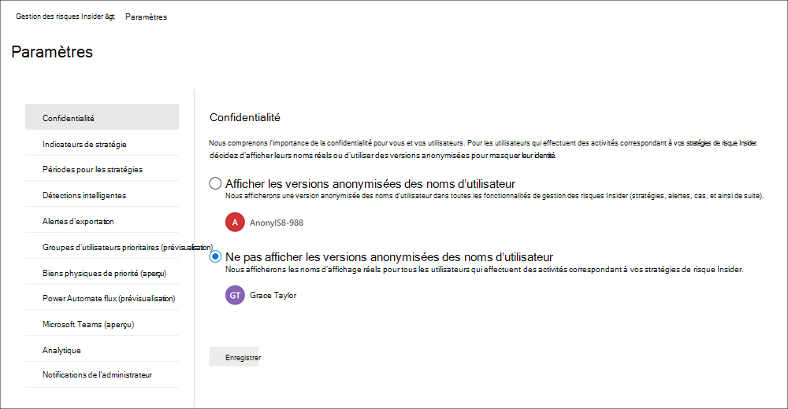
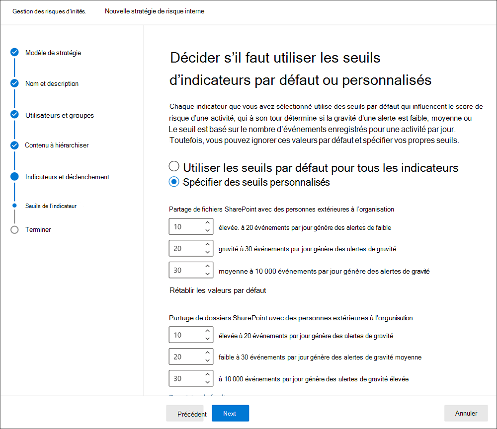
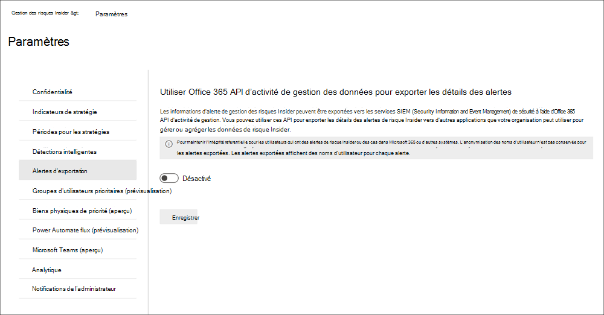

# Prise en main des paramètres de gestion des risques initiés

Les paramètres de gestion des risques initiaux s’appliquent à toutes les stratégies de gestion des risques internes, quel que soit le modèle que vous avez choisi lors de la création d’une stratégie. Les paramètres sont configurés à l’aide des **Paramètres de risque internes** contrôle situés en haut de tous les onglets de gestion des risques internes. Ces paramètres de stratégie contrôlent les éléments suivants :

- Confidentialité
- Indicateurs
- Chronologies des stratégies
- Détections intelligentes
- Exporter des alertes (aperçu)
- Groupes d’utilisateurs prioritaires (aperçu)
- Priorité des ressources physiques (aperçu)
- Flux d’automates d’alimentation (aperçu)
- Microsoft Teams (aperçu)

Avant de commencer et de créer des stratégies de gestion des risques Insiders, il est important de comprendre ces paramètres et de définir les niveaux les plus adaptés aux besoins de conformité de votre organisation.

## Confidentialité

La protection de la confidentialité des utilisateurs disposant de correspondances de stratégie est importante et peut favoriser l'objectivité dans les examens et analyses de données pour les alertes de risque internes. Pour les utilisateurs avec une stratégie de risque Insider, vous pouvez choisir l’un des paramètres suivants :

- **Afficher les versions anonymes des**noms d’utilisateur : les noms des utilisateurs sont rendus anonymes pour empêcher les administrateurs, les enquêteurs de données et les relecteurs de voir qui est associé à des alertes de stratégie. Par exemple, un utilisateur « Grace à Taylor » apparaît avec un pseudonyme aléatoire tel que « AnonIS8-988 » dans toutes les zones de l’expérience de gestion des risques internes. Le choix de ce paramètre permet d'anonymiser tous les utilisateurs ayant des correspondances de stratégie actuelle et passée et s’applique à toutes les stratégies. Les informations de profil utilisateur dans les détails des alertes de risque et des cas d’Insider ne seront pas disponibles lorsque cette option est sélectionnée. Toutefois, les noms d’utilisateur sont affichés lors de l’ajout de nouveaux utilisateurs à des stratégies existantes ou lors de l’affectation d’utilisateurs à de nouvelles stratégies. Si vous choisissez de désactiver ce paramètre, les noms d’utilisateur s’affichent pour tous les utilisateurs qui ont des correspondances de stratégie actuelle ou passée.
- **Ne pas afficher les versions anonymes des noms d’utilisateur**: les noms d’utilisateur sont affichés pour toutes les correspondances de stratégie actuelle et passée pour les alertes et les incidents. Les informations de profil utilisateur (nom, titre, alias, organisation ou service) s’affichent pour l’utilisateur pour toutes les alertes et les incidents liés à la gestion des risques Insiders.

## Indicateurs

Les modèles de stratégie de risque initié définissent le type d’activités de risque que vous souhaitez détecter et examiner. Chaque modèle de stratégie est basé sur des indicateurs spécifiques qui correspondent à des déclencheurs et des activités à risque spécifiques. Tous les indicateurs sont désactivés par défaut, et vous devez sélectionner un ou plusieurs indicateurs de stratégie avant de configurer une stratégie de gestion des risques Insiders.

Les alertes sont déclenchées par des stratégies lorsque les utilisateurs effectuent des activités liées aux indicateurs de stratégie qui répondent à un seuil requis. La gestion des risques internes utilise deux types d’indicateurs :

- **Déclenchement des événements**: événements qui déterminent si un utilisateur est actif pour une stratégie de gestion des risques Insiders. Si un utilisateur est ajouté à une stratégie de gestion des risques Insiders ne comporte pas d’événement déclencheur, l’activité de l’utilisateur n’est pas évaluée par la stratégie. Par exemple, l’utilisateur A est ajouté à une stratégie créée à partir du modèle de stratégie des *utilisateurs* qui se déposent, et la stratégie et le connecteur RH de Microsoft 365 sont correctement configurés. Tant que l’utilisateur a n’a pas enregistré une date de fin pour le connecteur RH, les activités de l’utilisateur A ne sont pas évaluées par cette stratégie de gestion des risques Insiders pour le risque. Un autre exemple d’événement déclencheur est si un utilisateur a une alerte de stratégie DLP de gravité *élevée* lors de l’utilisation de stratégies de *fuites de données* .
- **Indicateurs de stratégie**: indicateurs inclus dans les stratégies de gestion des risques internes utilisées pour déterminer une note de risque pour un utilisateur à l’étendue. Ces indicateurs de stratégie ne sont activés qu’une fois qu’un événement déclencheur a lieu pour un utilisateur. Voici quelques exemples d’indicateurs de stratégie lorsqu’un utilisateur copie des données sur des services de stockage cloud personnels ou des périphériques de stockage amovibles, ou si un utilisateur partage des fichiers et dossiers internes avec des parties externes non autorisées.

Les indicateurs de stratégie sont segmentés dans les domaines suivants. Vous pouvez choisir les indicateurs d’activation et de personnalisation des limites d’événement d’indicateur pour chaque niveau d’indicateur lors de la création d’une stratégie de risque initié :

- **Indicateurs Office**: ils incluent des indicateurs de stratégie pour les sites SharePoint, les équipes et la messagerie électronique.
- **Indicateurs de périphérique**: ils incluent des indicateurs de stratégie pour les activités telles que le partage de fichiers sur le réseau ou avec des appareils. Les indicateurs incluent l’activité impliquant des fichiers Microsoft Office,. Fichiers CSV et. Fichiers PDF. Si vous sélectionnez **indicateurs de périphérique**, l’activité est traitée uniquement pour les appareils avec Windows 10 Build 1809 ou version ultérieure. Pour plus d’informations sur la configuration des appareils en vue de l’intégration à un risque d’initié, voir [Getting Started with Endpoint DLP](endpoint-dlp-getting-started.md).
- **Indicateur de violation de stratégie de sécurité**: ils incluent des indicateurs de Microsoft Defender ATP liés à l’installation de logiciels non approuvés ou malveillants ou à contourner les contrôles de sécurité. Pour recevoir des alertes dans la gestion des risques initiés, vous devez disposer d’une licence active Microsoft Defender ATP et d’une intégration des risques Insider. Pour plus d’informations sur la configuration de Microsoft Defender ATP pour l’intégration de la gestion des risques initiaux, voir [configure Advanced Features in Microsoft Defender ATP](https://docs.microsoft.com/windows/security/threat-protection/microsoft-defender-atp/advanced-features\#share-endpoint-alerts-with-microsoft-compliance-center).
- **Amplificateurs de score de risque**: augmentation du score de risque pour les activités inhabituelles ou les violations de stratégie passée. L’activation des amplificateurs de score de risque augmente le score des risques et la probabilité d’alertes pour ces types d’activités. Les suramplificateurs de score de risque ne peuvent être sélectionnés que si un ou plusieurs indicateurs ci-dessus sont sélectionnés.

Dans certains cas, vous souhaiterez peut-être limiter les indicateurs de stratégie de risque d’initié appliqués aux stratégies de risque d’initié dans votre organisation. Vous pouvez désactiver les indicateurs de stratégie pour des zones spécifiques en les désactivant de toutes les stratégies de risque initiaux. Les événements de déclenchement ne peuvent pas être modifiés pour les modèles de stratégie de risque initié.

Pour définir les indicateurs de stratégie de risque initié qui sont activés dans toutes les stratégies de risque d’initié, accédez à indicateurs de **paramètres des risques internes**  >  **Indicators** et sélectionnez un ou plusieurs indicateurs de stratégie. Les indicateurs sélectionnés sur la page Paramètres des indicateurs ne peuvent pas être configurés individuellement lors de la création ou de la modification d’une stratégie de risque initié dans l’Assistant stratégie.

>[!NOTE]
>L’affichage des nouveaux utilisateurs ajoutés manuellement dans le **tableau de bord utilisateurs**peut prendre plusieurs heures. L’affichage des activités pour les 90 jours précédents pour ces utilisateurs peut prendre jusqu’à 24 heures. Pour afficher les activités des utilisateurs ajoutés manuellement, sélectionnez l’utilisateur dans le **tableau de bord utilisateurs** et ouvrez l’onglet **activité utilisateur** dans le volet d’informations.

### Paramètres de niveau de l’indicateur (aperçu)

Lors de la création d’une stratégie dans l’Assistant stratégie, vous pouvez configurer la façon dont le nombre quotidien d’événements de risque doit influencer le score de risque pour les alertes de risque d’initié. Ces paramètres d’indicateur vous permettent de contrôler la façon dont le nombre d’occurrences d’événements à risque dans votre organisation doit affecter la note de risque et, par conséquent, la gravité d’alerte associée pour ces événements. Si vous préférez, vous pouvez également choisir de conserver les niveaux de seuil d’événement par défaut recommandés par Microsoft pour tous les indicateurs activés.

Par exemple, vous décidez d’activer les indicateurs SharePoint dans les paramètres de stratégie des risques initiaux et de définir des seuils personnalisés pour les événements SharePoint lors de la configuration des indicateurs pour une nouvelle stratégie de *fuites de données* sur les risques initiés. Dans l’Assistant stratégie d’Insider Risk, vous configurez trois niveaux d’événements quotidiens différents pour chaque indicateur SharePoint afin d’influencer le score de risque pour les alertes associées à ces événements.

Pour le premier niveau d’événement quotidien, vous définissez le seuil à *10 événements ou plus par jour* pour un impact faible sur le score de risque pour les événements, au *moins 20 événements par jour* pour un impact moyen sur le score de risque pour les événements, et au *moins 30 événements* par jour ayant un impact plus élevé sur le score de risque pour les événements. Ces paramètres signifient effectivement :

- S’il y a 1-9 événements SharePoint qui ont lieu après le déclenchement de l’événement, les scores de risque ont un impact minimal sur la probabilité de ne pas générer d’alerte.
- S’il y a 10-19 événements SharePoint qui ont lieu après un événement déclencheur, le score de risque est fondamentalement inférieur et les niveaux de gravité d’alerte ont tendance à être bas.
- S’il y a 20-29 événements SharePoint qui ont lieu après un déclenchement, le score de risque est par essence plus élevé et les niveaux de gravité d’alerte ont tendance à se trouver à un niveau moyen.
- Si au moins 30 événements SharePoint ont lieu après un déclenchement, le score de risque est fondamentalement plus élevé et les niveaux de gravité d’alerte ont tendance à être à un niveau élevé.

## Délais de la stratégie

Les délais de stratégie vous permettent de définir les périodes passées et futures qui sont déclenchées après les correspondances de stratégie basées sur les événements et les activités des modèles de stratégie de gestion des risques internes. Selon le modèle de stratégie que vous choisissez, les délais de stratégie suivants sont disponibles :

- **Fenêtre d’activation**: disponible pour tous les modèles de stratégie, la *fenêtre d’activation* est le nombre de jours défini pendant lesquels la fenêtre est activée **après** un événement déclencheur. La fenêtre est activée entre 1 et 30 jours après qu’un événement déclencheur se produit pour tout utilisateur affecté à la stratégie. Par exemple, vous avez configuré une stratégie de gestion des risques inSided et vous avez défini la *fenêtre d’activation* sur 30 jours. Plusieurs mois se sont écoulés depuis la configuration de la stratégie et un événement déclencheur se produit pour l'un des utilisateurs inclus dans la stratégie. L’événement déclencheur active la *fenêtre d’activation* et la stratégie est active pour cet utilisateur pendant 30 jours après la survenue de l’événement déclencheur.
- **Détection de l’activité passée**: disponible pour tous les modèles de stratégie, la *détection d’activité passée* est le nombre de jours défini pendant lesquels la fenêtre est activée **avant** un événement déclencheur. La fenêtre est activée entre 0 et 180 jours avant qu’un événement déclencheur se produise pour tout utilisateur affecté à la stratégie. Par exemple, vous avez configuré une stratégie de gestion des risques inSided et défini la détection de l' *activité passée* sur 90 jours. Plusieurs mois se sont écoulés depuis la configuration de la stratégie et un événement déclencheur se produit pour l'un des utilisateurs inclus dans la stratégie. L’événement déclencheur active la *détection d’activité passée* et la stratégie recueille des activités historiques pour cet utilisateur pendant 90 jours avant l’événement déclencheur.

## Détections intelligentes

Les paramètres de détection intelligents permettent d’affiner la manière dont les détections d’activités à risque sont traitées pour les alertes. Dans certains cas, vous devrez peut-être définir des types de fichiers à ignorer ou vous souhaitez appliquer un niveau de détection pour les fichiers afin de définir une barre minimale pour les alertes. Lors de l’utilisation de stratégies linguistiques choquantes, vous devrez peut-être augmenter ou diminuer la sensibilité de la détection pour contrôler la nombre de correspondances de stratégie indiquée. Utilisez ces paramètres pour contrôler le volume global d’alertes, les exclusions de types de fichiers, les limites de volume de fichiers et la sensibilité de détection du langage offensant.

### Détections d’anomalies

Les détections anormales incluent des paramètres pour les exclusions de type de fichier et les limites de volume de fichier.

- **Exclusions**de types de fichiers : pour exclure des types de fichiers spécifiques de toutes les correspondances de stratégie de gestion des risques Insider, entrez les extensions de types de fichiers séparées par des virgules. Par exemple, pour exclure certains types de fichiers musicaux des correspondances de stratégie, vous pouvez entrer *aac,mp3,wav,wma* dans le champ **exclusions de type de fichier**. Les fichiers portant ces extensions seraient ignorés par toutes les stratégies de gestion des risques internes.
- **Limite de limite de volume de fichiers**: pour définir un niveau de fichier minimal avant que les alertes d’activité soient consignées dans les stratégies de risque initié, entrez le nombre de fichiers. Par exemple, vous devez entrer « 10 » si vous ne souhaitez pas générer d’alertes relatives aux risques initiés lorsqu’un utilisateur télécharge 10 fichiers ou moins, même si les stratégies considèrent cette activité comme une anomalie.

### Détections de langage choquant

>[!IMPORTANT]
>À partir du 16 octobre 2020, vous ne pourrez plus créer de stratégies à l’aide de ce modèle. Toutes les stratégies actives qui utilisent ce modèle fonctionneront jusqu’à ce qu’elles soient définitivement supprimées en janvier 2021. Nous déconfigurons le classifieur intégré en langage offensant qui prend en charge ce modèle car il génère un nombre élevé de faux positifs. Pour résoudre les problèmes de risque pour le langage offensant, nous vous recommandons d’utiliser les stratégies de [conformité de communication](communication-compliance.md) Microsoft 365. Pour plus d’informations sur les classifieurs intégrés, voir [Getting Started with trainable Classifiers](classifier-get-started-with.md).

Pour ajuster la sensibilité du classifieur de langue choquant pour les stratégies à l’aide du modèle *Langage choquant dans les messages électroniques*, choisissez l’un des paramètres suivants :

- **Faible**: niveau de sensibilité le plus élevé avec la plage la plus large pour la détection du langage offensant et des sentiments. La probabilité de faux positifs pour une correspondance choquante est élevée.
- **Moyenne**: niveau de confidentialité de milieu de gamme avec une plage équilibrée pour la détection du langage offensant et des sentiments. La probabilité de faux positifs pour une correspondance choquante est moyenne.
- **Élevé**: niveau de sensibilité le plus élevé avec une plage étroite pour la détection du langage offensant et des sentiments. La probabilité de faux positifs pour une correspondance choquante est faible.

### Volume d’alerte

Les activités de l’utilisateur détectées par les stratégies de risque d’initié se voient attribuer une note de risque spécifique, qui détermine à son tour la gravité de l’alerte (faible, moyenne, haute). Par défaut, nous allons générer une certaine quantité d’alertes de gravité faible, moyenne et élevée, mais vous pouvez augmenter ou diminuer le volume en fonction de vos besoins. Pour ajuster le volume des alertes pour toutes les stratégies de gestion des risques Insider, choisissez l’un des paramètres suivants :

- **Alertes moins nombreuses**: vous verrez toutes les alertes de gravité élevée, moins les alertes de gravité moyenne et aucune gravité faible. Ce paramètre signifie que vous risquez de manquer des véritables positifs.
- **Volume par défaut**: vous verrez toutes les alertes de gravité élevée et une quantité équilibrée d’alertes de gravité moyenne et faible.
- **Plus d’alertes**: vous verrez toutes les alertes de gravité moyenne et élevée, ainsi que les alertes de gravité faible. Ce paramètre peut entraîner des faux positifs supplémentaires.

### Protection avancée contre les menaces Microsoft Defender (préversion)

[Microsoft Defender Advanced Threat Protection](https://docs.microsoft.com/windows/security/threat-protection/microsoft-defender-atp/microsoft-defender-advanced-threat-protection) (ATP) est une plateforme de sécurité de point de terminaison d’entreprise conçue pour aider les réseaux d’entreprise à prévenir, détecter, examiner et répondre aux menaces avancées. Pour améliorer la visibilité de la violation de sécurité dans votre organisation, vous pouvez importer et filtrer les alertes de Microsoft Defender ATP pour les activités utilisées dans les stratégies créées à partir des modèles de stratégie de violation de la sécurité de la gestion des risques inSided.

En fonction des types de signaux qui vous intéressent, vous pouvez choisir d’importer des alertes dans la gestion des risques initiés en fonction de l’état de triage des alertes Microsoft Defender ATP. Vous pouvez définir un ou plusieurs des statuts de triage des alertes suivants dans les paramètres globaux à importer :

- Inconnu
- Nouveau
- En cours
- Résolu

Les alertes de Microsoft Defender ATP sont importées quotidiennement. En fonction de l’état de triage que vous choisissez, vous pouvez voir plusieurs activités utilisateur pour la même alerte que les modifications d’état de triage dans Microsoft Defender ATP.

Par exemple, si vous sélectionnez *nouveau*, *en cours*et *résolu* pour ce paramètre, lorsqu’une alerte Microsoft Defender ATP est générée et que l’État est *nouveau*, une activité d’alerte initiale est importée pour l’utilisateur en cas d’Insider. Lorsque l’état de triage Microsoft Defender ATP devient *en cours*, une deuxième activité pour cette alerte est importée pour l’utilisateur en cas d’Insider. Lorsque l’état de *triage de Microsoft* Defender DAV final de est défini, une troisième activité pour cette alerte est importée pour l’utilisateur en cas d’Insider. Cette fonctionnalité permet aux enquêteurs de suivre la progression des alertes de Microsoft Defender ATP et de choisir le niveau de visibilité requis par leur enquête.

>[!IMPORTANT]
>Vous devez avoir Microsoft Defender ATP configuré dans votre organisation et activer l’intégration de la gestion des risques initiés de Microsoft Defender dans le centre de sécurité de Defender pour importer les alertes de violation de sécurité. Pour plus d’informations sur la configuration de Microsoft Defender ATP pour l’intégration de la gestion des risques initiaux, voir [configure Advanced Features in Microsoft Defender ATP](https://docs.microsoft.com/windows/security/threat-protection/microsoft-defender-atp/advanced-features\#share-endpoint-alerts-with-microsoft-compliance-center).

### Domaines (aperçu)

Les paramètres de domaine vous permettent de définir des niveaux de risque pour les communications vers des domaines spécifiques. Ces communications incluent le partage de fichiers, de messages électroniques ou le téléchargement de contenu. En spécifiant des domaines dans ces paramètres, vous pouvez augmenter ou diminuer le score de risque pour l’activité qui a lieu avec ces domaines. Par exemple, pour spécifier contoso.com et sales.wingtiptoys.com en tant que domaines autorisés, vous devez entrer « contoso.com sales.wingtiptoys.com » dans le champ **domaines autorisés** .

Pour chacun des paramètres de domaine suivants, vous pouvez entrer jusqu’à 500 domaines :

- **Domaines non autorisés :** En spécifiant des domaines non autorisés, l’activité qui a lieu avec ces domaines aura des scores de risque *plus élevés* .
- **Domaines autorisés :** En spécifiant les domaines autorisés dans les paramètres, l’activité qui a lieu avec ces domaines présente des scores de risque *moindre* et est traitée de la même manière que l’activité interne de l’organisation. Par exemple, les activités de messagerie vers ces domaines sont analysées de la même façon que l’activité de messagerie interne.
- **Domaines tiers :** Les domaines tiers sont des domaines utilisés à des fins professionnelles au sein de votre organisation et le contenu sensible peut être stocké à ces emplacements. En spécifiant un domaine tiers, vous pouvez recevoir des alertes pour les activités à risque sur ces domaines.

## Exporter des alertes (aperçu)

Gestion des risques internes les informations d’alerte sont exportables vers des services d’informations sur la sécurité et de gestion des événements via le schéma de l' [API activité de gestion d’Office 365](https://docs.microsoft.com/office/office-365-management-api/office-365-management-activity-api-schema#security-and-compliance-alerts-schema). Vous pouvez utiliser les API activité de gestion d’Office 365 pour exporter des informations d’alerte vers d’autres applications que votre organisation peut utiliser pour gérer ou agréger des informations sur les risques internes.

Pour utiliser les API afin de consulter les informations d’alerte de risque Insider :

1. Activer la prise en charge de l’API activité de gestion Office 365 dans l’exportation des paramètres de **gestion des risques Insider**  >  **Settings**  >  **Export**. Par défaut, ce paramètre est désactivé pour votre organisation Microsoft 365.
2. Filtrez les activités d’audit courantes d’Office 365 par *SecurityComplianceAlerts*.
3. Filtrez *SecurityComplianceAlerts* par la catégorie *InsiderRiskManagement* .

Les informations d’alerte contiennent des informations provenant du schéma d’alerte de sécurité et de conformité et du schéma commun de l’API d’activité de gestion Office 365.

Les champs et valeurs suivants sont exportés pour les alertes de gestion des risques internes pour le schéma d’alerte de conformité de la sécurité & :

| **Paramètre Alert** | **Description** |
|:------------------|:----------------|
| AlertType | Le type de l’alerte est *Custom*.  |
| AlertId | GUID de l’alerte. Les alertes de gestion des risques internes sont mutables. Lorsque l’état des alertes est modifié, un nouveau journal portant le même alerties est généré. Cette fonction peut être utilisée pour corréler les mises à jour d’une alerte. |
| Catégorie | La catégorie de l’alerte est *InsiderRiskManagement*. Cette catégorie peut être utilisée pour faire la distinction entre ces alertes et d’autres alertes de sécurité & de conformité. |
| Commentaires | Commentaires par défaut pour l’alerte. Values *New Alert* (consignée lors de la création d’une alerte) et *Alert* Updated (consignée lors de la mise à jour d’une alerte). Utilisez la fonction alertiesd pour corréler les mises à jour d’une alerte. |
| Données | Les données de l’alerte incluent l’ID d’utilisateur unique, le nom d’utilisateur principal, ainsi que la date et l’heure (UTC) lorsque l’utilisateur a été déclenché dans une stratégie. |
| Nom | Nom de la stratégie pour la stratégie de gestion des risques initiés qui a généré l’alerte. |
| PolicyId | GUID de la stratégie de gestion des risques Insiders qui a déclenché l’alerte. |
| Severity | Gravité de l’alerte. Les valeurs sont *élevé*, *moyen*ou *faible*. |
| Source | Source de l’alerte. La valeur est *Office 365 Security & Compliance*. |
| Statut | État de l’alerte. Les valeurs sont *actives* (*examen* des risques Insider), *étude* (*confirmée* en ce qui se traduit par des risques Insiders), *résolues* (*résolues* en risque d’initiés), *ignorées* (*rejetée* en risque d’initiés). |
| Version | La version du schéma d’alerte de sécurité et de conformité. |

Les champs et valeurs suivants sont exportés pour les alertes de gestion des risques internes pour le [schéma commun de l’API d’activité de gestion Office 365](https://docs.microsoft.com/office/office-365-management-api/office-365-management-activity-api-schema#common-schema).

- UserId
- ID
- RecordType
- CreationTime
- Opération
- OrganizationId
- UserType
- UserKey

## Groupes d’utilisateurs prioritaires (aperçu)

Les utilisateurs de votre organisation peuvent avoir différents niveaux de risque en fonction de leur position, de leur niveau d’accès aux informations sensibles ou de l’historique des risques. La définition de la priorité de l’examen et de l’évaluation des activités de ces utilisateurs peut vous aider à vous informer des risques potentiels susceptibles d’avoir des conséquences plus élevées pour votre organisation. Priorité les groupes d’utilisateurs dans la gestion des risques initiés permettent de définir les utilisateurs de votre organisation qui ont besoin d’une inspection plus approfondie et d’un score de risque plus sensible. En association avec les *violations de stratégie de sécurité par les utilisateurs prioritaires* et les *fuites de données par* les modèles de stratégie utilisateurs prioritaires, les utilisateurs ajoutés à un groupe d’utilisateurs prioritaire ont une probabilité accrue d’alertes et d’alertes de risque d’initiés avec des niveaux de gravité plus élevés.

Par exemple, vous devez vous protéger contre les fuites de données pour un projet hautement confidentiel où les utilisateurs ont accès à des informations sensibles. Vous choisissez de créer un groupe d’utilisateurs prioritaire pour *les utilisateurs* de *projets confidentiels* pour les utilisateurs de votre organisation qui travaillent sur ce projet. À l’aide de l’Assistant stratégie et du modèle de stratégie de *fuite de données par utilisateurs prioritaires* , vous créez une stratégie et affectez le groupe utilisateurs prioritaires du *projet confidentiel* à la stratégie. Les activités examinées par la stratégie pour les membres du groupe d’utilisateurs priorité des *utilisateurs de projets confidentiels* sont plus sensibles aux risques et les activités de ces utilisateurs sont plus susceptibles de générer une alerte et d’avoir des alertes ayant des niveaux de gravité plus élevés.

### Créer un groupe d’utilisateurs de priorité

Pour créer un groupe d’utilisateurs de priorité, vous utiliserez des contrôles de paramètres dans la solution de **gestion des risques inSided** dans le centre de conformité Microsoft 365. Pour créer un groupe d’utilisateurs de priorité, vous devez être membre du groupe de rôles *gestion des risques internes* ou *Insider gestion des risques inSided* .

Pour créer un groupe d’utilisateurs prioritaire, procédez comme suit :

1. Dans le [Centre de conformité Microsoft 365](https://compliance.microsoft.com), accédez à **gestion des risques internes** et sélectionnez **paramètres des risques Insiders**.
2. Sélectionnez l’onglet **groupes d’utilisateurs prioritaires**
3. Sous l’onglet **groupes d’utilisateurs de priorité** , sélectionnez créer un groupe d’utilisateurs de **priorité** pour démarrer l’Assistant Création de groupe.
4. Dans la page **définir un groupe** , renseignez les champs suivants :
    - **Nom (obligatoire)**: entrez un nom convivial pour le groupe d’utilisateurs prioritaire. Vous ne pouvez pas modifier le nom du groupe d’utilisateurs prioritaire après avoir exécuté l’Assistant.
    - **Description (facultatif)**: entrez une description pour le groupe d’utilisateurs prioritaire.
5. Sélectionnez **suivant** pour continuer.
6. Sur la page **choisir les membres** , sélectionnez choisir les **membres** à rechercher et sélectionnez les comptes d’utilisateur à extension messagerie inclus dans le groupe ou activez la case à cocher **Sélectionner tout** pour ajouter tous les utilisateurs de votre organisation au groupe. Sélectionnez **Ajouter** pour continuer ou **Annuler** pour fermer sans ajouter d’utilisateurs au groupe.
7. Sélectionnez **suivant** pour continuer.
8. Sur la page **révision** , passez en revue les paramètres que vous avez choisis pour le groupe d’utilisateurs prioritaire. Sélectionnez **modifier** pour modifier les valeurs d’un groupe ou sélectionnez **Envoyer** pour créer et activer le groupe d’utilisateurs prioritaire.
9. Sur la page confirmation, sélectionnez **terminé** pour quitter l’Assistant.

### Mettre à jour un groupe d’utilisateurs prioritaire

Pour mettre à jour un groupe d’utilisateurs prioritaire existant, vous utiliserez des contrôles de paramètres dans la solution de **gestion des risques inSided** dans le centre de conformité Microsoft 365. Pour mettre à jour un groupe d’utilisateurs de priorité, vous devez être membre du groupe de rôles *gestion des risques Insiders* ou gestion des *risques inSided* .

Pour modifier un groupe d’utilisateurs de priorité, procédez comme suit :

1. Dans le [Centre de conformité Microsoft 365](https://compliance.microsoft.com), accédez à **gestion des risques internes** et sélectionnez **paramètres des risques Insiders**.
2. Sélectionnez l’onglet **groupes d’utilisateurs prioritaires**
3. Sélectionnez le groupe d’utilisateurs prioritaire que vous souhaitez modifier et sélectionnez **modifier le groupe**.
4. Dans la page **définir un groupe** , mettez à jour le champ Description si nécessaire. Vous ne pouvez pas mettre à jour le nom du groupe d’utilisateurs prioritaire. Sélectionnez **suivant** pour continuer.
5. Dans la page **choisir les membres** , ajoutez de nouveaux membres au groupe à l’aide du contrôle choisir les **membres** . Pour supprimer un utilisateur du groupe, sélectionnez le « X » en regard de l’utilisateur que vous souhaitez supprimer. Sélectionnez **suivant** pour continuer.
6. Sur la page **révision** , passez en revue les paramètres de mise à jour que vous avez choisis pour le groupe d’utilisateurs prioritaire. Sélectionnez **modifier** pour modifier les valeurs d’un groupe ou sélectionnez **Envoyer** pour mettre à jour le groupe d’utilisateurs prioritaire.
7. Sur la page confirmation, sélectionnez **terminé** pour quitter l’Assistant.

### Supprimer un groupe d’utilisateurs de priorité

Pour supprimer un groupe d’utilisateurs de priorité existant, vous utiliserez des contrôles de paramètres dans la solution de **gestion des risques inSided** dans le centre de conformité Microsoft 365. Pour supprimer un groupe d’utilisateurs de priorité, vous devez être membre du groupe de rôles *gestion des risques internes* ou *Insider gestion des risques inSided* .

>[!IMPORTANT]
>La suppression d’un groupe d’utilisateurs de priorité le supprime de toute stratégie active à laquelle il est affecté. Si vous supprimez un groupe d’utilisateurs prioritaire affecté à une stratégie active, la stratégie ne contiendra aucun utilisateur dans l’étendue et sera effectivement inactive et ne créera pas d’alertes.

Pour supprimer un groupe d’utilisateurs de priorité, procédez comme suit :

1. Dans le [Centre de conformité Microsoft 365](https://compliance.microsoft.com), accédez à **gestion des risques internes** et sélectionnez **paramètres des risques Insiders**.
2. Sélectionnez l’onglet **groupes d’utilisateurs prioritaires**
3. Sélectionnez le groupe d’utilisateurs dont vous souhaitez modifier la priorité, puis cliquez sur **supprimer** dans le menu Tableau de bord.
4. Dans la boîte de dialogue **supprimer** , cliquez sur **Oui** pour supprimer le groupe d’utilisateurs priorité ou sur **Annuler** pour revenir au tableau de bord.

## Priorité des ressources physiques (aperçu)

L’identification de l’accès aux ressources physiques prioritaires et à la corrélation de l’activité d’accès aux événements utilisateur est un composant important de votre infrastructure de conformité. Ces ressources physiques représentent des emplacements prioritaires au sein de votre organisation, tels que des bâtiments d’entreprise, des centres de données ou des salles de serveurs. Les activités liées aux risques internes peuvent être associées aux utilisateurs qui travaillent des heures inhabituelles, tentent d’accéder à ces zones sensibles ou sécurisées non autorisées et demandent l’accès à des zones de haut niveau sans besoin légitime.

Avec les ressources matérielles prioritaires activées et le [connecteur de données badges physique](import-physical-badging-data.md) configuré, la gestion des risques internes intègre des signaux provenant de votre contrôle physique et des systèmes d’accès aux autres activités liées aux risques de l’utilisateur. En examinant les modèles de comportement entre les systèmes d’accès physique et en mettant en corrélation ces activités avec d’autres événements de risque Insider, la gestion des risques internes peut aider les responsables de la conformité et les analystes à prendre des décisions plus éclairées pour les alertes. L’accès aux ressources physiques prioritaires est évalué et identifié dans Insights différemment d’un accès à des ressources non prioritaires.

Par exemple, votre organisation dispose d’un système badges pour les utilisateurs qui contrôlent et approuvent l’accès physique aux zones de travail normales et sensibles. Plusieurs utilisateurs travaillent sur un projet sensible et ces utilisateurs seront retournés à d’autres zones de votre organisation une fois le projet terminé. Lorsque le projet sensible approche de l’achèvement, vous souhaitez vous assurer que le travail du projet reste confidentiel et que l’accès aux zones du projet est étroitement contrôlé.

Vous choisissez d’activer le connecteur de données badges dans Microsoft 365 pour importer des informations d’accès à partir de votre système badges physique et de spécifier des ressources physiques de priorité dans la gestion des risques initiés. En important les informations de votre système badges et en mettant en corrélation les informations d’accès physique avec d’autres activités liées aux risques identifiées dans la gestion des risques initiés, vous remarquez que l’un des utilisateurs du projet accède aux bureaux de projet après les heures de travail normales et exporte également de grandes quantités de données vers un service de stockage cloud personnel depuis leur zone de travail normale Cette activité d’accès physique associée à l’activité en ligne peut pointer vers des investigateurs de conformité et des enquêteurs de données possibles, et les analystes peuvent prendre les mesures appropriées en fonction des circonstances de cet utilisateur.

### Configurer la priorité des ressources physiques

Pour configurer des ressources physiques de priorité, vous allez configurer le connecteur badges physique et utiliser des contrôles de paramètres dans la solution de **gestion des risques inSided** dans le centre de conformité Microsoft 365. Pour configurer des ressources physiques de priorité, vous devez être membre du groupe de rôles *gestion des risques internes* ou *Insider gestion des risques internes*.

Procédez comme suit pour configurer la priorité des ressources physiques :

1. Suivez les étapes de configuration pour la gestion des risques internes à l’article [Getting Started with Insider Management Risk](insider-risk-management-configure.md) . À l’étape 3, vérifiez que vous configurez le connecteur badges physique.

    >[!IMPORTANT]
    >Pour les stratégies de gestion des risques Insiders permettant d’utiliser et de corréler les données de signal relatives au fait de se déconnecter et aux utilisateurs qui se terminent avec des données d’événement provenant de vos plateformes de contrôle physique et d’accès, vous devez également configurer le connecteur RH de Microsoft 365. Si vous activez le connecteur badges physique sans activer le connecteur RH de Microsoft 365, les stratégies de gestion des risques internes ne traiteront que les événements pour les activités d’accès physique pour les utilisateurs de votre organisation.

2. Dans le [Centre de conformité Microsoft 365](https://compliance.microsoft.com), accédez à **gestion des risques internes** et sélectionnez **paramètres des risques Insider**  >  **Priority physical assets**.
3. Sur la page **priorité des ressources physiques** , vous pouvez ajouter manuellement les numéros d’inventaire physique que vous souhaitez surveiller pour les événements d’immobilisation importés par le connecteur badges physique ou importer un. Fichier CSV de tous les codes de ressource physique importés par le connecteur badges physique : a) pour ajouter manuellement des codes de ressources physiques, sélectionnez **Ajouter une priorité des biens physiques**, entrez un code d’actif physique, puis sélectionnez **Ajouter**. Entrez des codes d’actifs physiques supplémentaires, puis sélectionnez **Ajouter une priorité des biens physiques** pour enregistrer toutes les ressources entrées.
    b) pour ajouter une liste de codes d’inventaire physique à partir d’un. Fichier CSV, choisissez **importer des ressources physiques de priorité**. Dans la boîte de dialogue Explorateur de fichiers, sélectionnez le. Fichier CSV que vous souhaitez importer, puis sélectionnez **ouvrir**. Les ID des biens physiques du. Les fichiers CSV sont ajoutés à la liste.
4. Accédez à l’onglet **indicateurs de stratégie** dans paramètres.
5. Dans la page **indicateurs de stratégie** , accédez à la section indicateurs d' **accès physique** et activez la case à cocher **accès physique après résiliation ou échec de l’accès à la ressource sensible**.
6. Sélectionnez **Enregistrer** pour configurer et quitter.

### Supprimer un élément physique de priorité

Pour supprimer un élément physique de priorité existant, vous utiliserez des contrôles de paramètres dans la solution de gestion des risques inSided dans le centre de conformité Microsoft 365. Pour supprimer une ressource physique de priorité, vous devez être membre du groupe de rôles Gestion des risques internes ou administrateurs de gestion des risques inSided.

>[!IMPORTANT]
>La suppression d’un actif physique de priorité le supprime de l’examen par une stratégie active à laquelle il était précédemment inclus. Les alertes générées par des activités associées à la ressource physique Priority ne sont pas supprimées.

Pour supprimer une ressource physique de priorité, procédez comme suit :

1. Dans le [Centre de conformité Microsoft 365](https://compliance.microsoft.com), accédez à **gestion des risques internes** et sélectionnez **paramètres des risques Insider**  >  **Priority physical assets**.
2. Sur la page **priorité des ressources physiques** , sélectionnez l’élément que vous souhaitez supprimer.
3. Sélectionnez **supprimer** dans le menu action pour supprimer l’élément.

## Flux d’automates d’alimentation (aperçu)

[Microsoft Power automate](https://docs.microsoft.com/power-automate/getting-started) est un service de flux de travail qui automatise les actions entre les applications et les services. En utilisant des flux provenant de modèles ou créés manuellement, vous pouvez automatiser les tâches courantes associées à ces applications et services. Lorsque vous activez la gestion de l’énergie automatique pour la gestion des risques initiaux, vous pouvez automatiser des tâches importantes pour les cas et les utilisateurs. Vous pouvez configurer les flux Automated Power afin de récupérer les informations relatives aux utilisateurs, aux alertes et aux incidents, de partager ces informations avec les parties prenantes et d’autres applications, ainsi que d’automatiser les actions de gestion des risques initiés, telles que la publication dans les notes de cas. Les flux d’automate de puissance s’appliquent aux cas et à tout utilisateur dans l’étendue d’une stratégie.

Les clients ayant des abonnements Microsoft 365 qui incluent une gestion des risques Insider n’ont pas besoin de puissance automatique supplémentaire pour utiliser la gestion des risques initiés de gestion des risques automatisée. Ces modèles peuvent être personnalisés pour prendre en charge votre organisation et couvrent les scénarios de gestion des risques initiaux fondamentaux. Si vous choisissez d’utiliser les fonctionnalités de Power automate Premium dans ces modèles, créez un modèle personnalisé à l’aide du connecteur Microsoft 365 Compliance Connector ou utilisez Power automates pour d’autres zones de conformité dans Microsoft 365, vous aurez peut-être besoin d’une alimentation automatique supplémentaire.

Les modèles automateurs d’alimentation suivants sont fournis aux clients pour prendre en charge l’automatisation des processus pour les utilisateurs et les cas de gestion des risques initiaux :

- **Avertir les utilisateurs lorsqu’ils sont ajoutés à une stratégie d’Insider Risk**: ce modèle est destiné aux organisations qui ont des stratégies internes, de confidentialité ou des exigences réglementaires que les utilisateurs doivent être avertis lorsqu’ils sont soumis à des stratégies de gestion des risques initiés. Lorsque ce flux est configuré et sélectionné pour un utilisateur dans la page utilisateurs, les utilisateurs et leurs responsables reçoivent un message électronique lorsque l’utilisateur est ajouté à une stratégie de gestion des risques Insiders. Ce modèle prend également en charge la mise à jour d’une liste SharePoint hébergée sur un site SharePoint pour faciliter le suivi des détails du message de notification comme la date/l’heure et le destinataire du message. Power automatiser les flux à l’aide de ce modèle sont disponibles dans le **tableau de bord utilisateurs**.
- **Demander des informations de RH ou de l’entreprise à propos d’un utilisateur dans un cas d’Insider**: lorsqu’il s’agit d’un cas, des analystes et des enquêteurs de risques initiés peuvent avoir besoin de consulter les RH ou les autres parties prenantes pour comprendre le contexte des activités de cas. Lorsque ce flux est configuré et sélectionné pour un cas, les analystes et les enquêteurs envoient un message électronique aux parties prenantes RH et entreprise configurées pour ce flux. Chaque destinataire reçoit un message avec des options de réponse préconfigurées ou personnalisables. Lorsque les destinataires sélectionnent une option de réponse, la réponse est enregistrée comme note de cas et inclut le destinataire et les informations de date/heure. Power automatiser les flux à l’aide de ce modèle sont disponibles dans le **tableau de bord cas**.
- **Avertir le gestionnaire lorsqu’un utilisateur a une alerte de risque d’Insider**: certaines organisations peuvent avoir besoin de recevoir une notification de gestion immédiate lorsqu’un utilisateur a une alerte de gestion des risques Insider. Lorsque ce flux est configuré et sélectionné, le responsable de l’utilisateur du cas reçoit un message électronique contenant les informations suivantes sur toutes les alertes de cas : 
    - Stratégie applicable pour l’alerte
    - Date/heure de l’alerte
    - Niveau de gravité de l’alerte

    Le flux met automatiquement à jour les notes de cas auxquelles le message a été envoyé et que le flux a été activé. Power automatiser les flux à l’aide de ce modèle sont disponibles dans le **tableau de bord cas**.

- **Ajouter un rappel de calendrier pour le suivi d’un cas d’Insider risque**: ce modèle permet aux enquêteurs et analystes d’ajouter des rappels de calendrier pour les incidents à leur calendrier Office 365 Outlook. Ce flux élimine la nécessité pour les utilisateurs de quitter ou de quitter le flux de travail de gestion des risques inSided lors du traitement des alertes de triage de cas et de tri. Lorsque ce flux est configuré et sélectionné, un rappel est ajouté au calendrier Office 365 Outlook pour l’utilisateur qui exécute le flux. Power automatiser les flux à l’aide de ce modèle sont disponibles dans le **tableau de bord cas**.

### Créer une alimentation automatique flux à partir d’un modèle de gestion des risques inSided

Pour créer un flux automatique de puissance à partir d’un modèle de gestion des risques Insider recommandé, vous utiliserez les contrôles des paramètres de la solution de **gestion des risques Insider** dans le centre de conformité Microsoft 365 ou l’option **gérer les flux d’automates d’alimentation** du contrôle **automatiser** lorsque vous travaillez directement dans les **tableaux de bord** **incidents** ou utilisateurs.

Pour créer un flux automatique d’alimentation dans la zone Paramètres, vous devez être membre du groupe de rôles *gestion des risques internes* ou *administrateurs de gestion des risques Insiders* . Pour créer un flux automatique d’alimentation à l’aide de l’option **gérer les flux d’automate** de gestion, vous devez être membre d’au moins un groupe de rôles de gestion des risques Insiders.

Procédez comme suit pour créer un flux automatique de puissance à partir d’un modèle de gestion des risques Insider recommandé :

1. Dans le [Centre de conformité Microsoft 365](https://compliance.microsoft.com/), accédez à **gestion des risques internes** et sélectionnez **paramètres des risques initiés**  >  :**Power Automated flows**. Vous pouvez également accéder à partir des pages de **tableaux de bord** **incidents** ou utilisateurs en sélectionnant **automatiser**  >  **gérer Power Automated flows**.
2. Sur la page flux automatique de l' **alimentation** , sélectionnez un modèle recommandé dans la section modèles de **gestion des risques Insider que vous pouvez aimeriez** .
3. Le flux répertorie les connexions incorporées nécessaires pour le flux et indique si les États de connexion sont disponibles. Si nécessaire, mettez à jour toutes les connexions qui ne sont pas affichées comme disponibles. Sélectionnez **Continuer**.
4. Par défaut, les flux recommandés sont préconfigurés avec les champs de données de gestion des risques initiés et de service Microsoft 365 requis pour effectuer la tâche attribuée au flux. Si nécessaire, personnalisez les composants de flux à l’aide du contrôle **afficher les options avancées** et en configurant les propriétés disponibles pour le composant de flux.
5. Si nécessaire, ajoutez des étapes supplémentaires au flux en sélectionnant le bouton **nouvelle étape** . Dans la plupart des cas, cette option n’est pas nécessaire pour les modèles par défaut recommandés.
6. Sélectionnez **Enregistrer brouillon** pour enregistrer le flux pour une configuration supplémentaire ou sélectionnez **Enregistrer** pour terminer la configuration du flux.
7. Sélectionnez **Fermer** pour revenir à la page **flux automatique** de l’alimentation. Le nouveau modèle est affiché sous forme de flux dans les onglets **mes flux** et est automatiquement disponible à partir du contrôle de liste déroulante **automatiser** lorsque vous travaillez avec des cas de gestion des risques initiés pour l’utilisateur qui crée le flux.

>[!IMPORTANT]
>Si d’autres utilisateurs de votre organisation ont besoin d’accéder au flux, le flux doit être partagé.

### Création d’un flux de puissance personnalisé Automated pour la gestion des risques initiés

Certains processus et flux de travail de votre organisation peuvent se trouver en dehors des modèles de flux de gestion des risques initiés recommandés et il se peut que vous ayez besoin de créer des flux automatiques personnalisés pour les zones de gestion des risques internes. Les flux d’automate d’énergie sont flexibles et prennent en charge une personnalisation étendue, mais il existe des étapes à suivre pour intégrer les fonctionnalités de gestion des risques internes.

Procédez comme suit pour créer un modèle Automated Power pour la gestion des risques initiés :

1. **Vérifiez votre licence de flux Automated Flow**: pour créer des flux automatisés d’alimentation personnalisés qui utilisent des déclencheurs de gestion des risques inSided, vous aurez besoin d’une licence Automated. Les modèles de flux de gestion des risques initiés recommandés ne nécessitent pas de licences supplémentaires et sont inclus dans le cadre de votre licence de gestion des risques Insiders.
2. **Créer un flux automatisé**: créez un flux qui effectue une ou plusieurs tâches après qu’il a été déclenché par un événement de gestion des risques inSided. Pour plus d’informations sur la création d’un flux automatisé, voir [Create a flow in Power automate](https://docs.microsoft.com/power-automate/get-started-logic-flow).
3. **Sélectionnez le connecteur de conformité microsoft 365**: recherchez et sélectionnez le connecteur de conformité Microsoft 365. Ce connecteur permet des déclencheurs et des actions de gestion des risques internes. Pour plus d’informations sur les connecteurs, voir l’article de [vue d’ensemble](https://docs.microsoft.com/connectors/connector-reference/) de la référence du connecteur.
4. **Choisissez déclencheurs de gestion des risques Insider pour votre flux : la**gestion des risques initiés est composée de deux déclencheurs disponibles pour les flux d’automates de puissance personnalisés :
    - **Pour un cas de gestion des risques inSided sélectionné**: les flux avec ce déclencheur peuvent être sélectionnés dans la page de tableau de bord cas de gestion des risques inSided.
    - **Pour un utilisateur de gestion des risques Insiders sélectionné**: les flux avec ce déclencheur peuvent être sélectionnés à partir de la page de tableau de bord utilisateurs de gestion des risques Insiders.
5. Choisissez les actions de gestion des risques Insider pour votre flux : vous pouvez choisir parmi plusieurs actions pour la gestion des risques initiés à inclure dans votre flux personnalisé :
    - Obtenir une alerte de gestion des risques Insider
    - Obtenir un cas de gestion des risques Insider
    - Obtenir un utilisateur de gestion des risques Insider
    - Obtenir des alertes de gestion des risques Insiders pour un cas
    - Ajouter une note de cas de gestion des risques Insider

### Partager un flux de puissance automatique

Par défaut, les flux d’alimentation automatique automatiques créés par un utilisateur sont uniquement disponibles pour cet utilisateur. Pour que d’autres utilisateurs de la gestion des risques Insiders aient accès et utilisent un flux, le flux doit être partagé par le créateur du flux. Pour partager un flux, vous utiliserez les contrôles des paramètres de la **solution de gestion des risques inSided** dans le centre de conformité Microsoft 365 ou l’option **gérer les flux d’automates d’alimentation** du contrôle automatiser lorsque vous travaillez directement dans les pages du **tableau de bord** **incidents** ou utilisateurs. Une fois que vous avez partagé un flux, toutes les personnes avec lesquelles il a été partagé peuvent accéder au flux dans la liste déroulante **de contrôle automatique** dans le **cas** et les **tableaux de bord utilisateur**.

Pour partager un flux de puissance automatique dans la zone Paramètres, vous devez être membre du groupe de rôles *gestion des risques internes* ou administration des *risques inSided* . Pour partager un flux de puissance automatique avec l’option **gérer les flux d’automate** de gestion de l’alimentation, vous devez être membre d’au moins un groupe de rôles de gestion des risques Insiders.

Procédez comme suit pour partager un flux automatique de puissance :

1. Dans le [Centre de conformité Microsoft 365](htttps://compliance.microsoft.com), accédez à **gestion des risques internes** et sélectionnez **paramètres des risques initiés**  >  :**Power Automated flows**. Vous pouvez également accéder à partir des pages de **tableaux de bord** **incidents** ou utilisateurs en sélectionnant **automatiser**  >  **gérer Power Automated flows**.
2. Sur la page flux automatique de l' **alimentation** , sélectionnez l’onglet **mes flux** ou flux d' **équipe** .
3. Sélectionnez le flux à partager, puis sélectionnez **partager** dans le menu options de flux.
4. Dans la page partage de flux, entrez le nom de l’utilisateur ou du groupe que vous souhaitez ajouter en tant que propriétaire pour le flux.
5. Dans la boîte de dialogue **connexion utilisée** , sélectionnez **OK** pour confirmer que l’utilisateur ou le groupe ajouté aura un accès total au flux.

### Modifier un flux d’alimentation automatique

Pour modifier un flux, vous utiliserez les contrôles des paramètres de la solution de **gestion des risques inSided** dans le centre de conformité Microsoft 365 ou l’option **gérer les flux d’automates d’alimentation** du contrôle **automatiser** lorsque vous travaillez directement dans le **tableau de bord**des **cas** ou des utilisateurs.

Pour modifier un flux automatique d’alimentation dans la zone Paramètres, vous devez être membre du groupe de rôles *gestion des risques Insider* ou gestion des *risques inSided* . Pour modifier un flux de puissance automatique à l’aide de l’option **gérer les flux d’automate** de gestion, vous devez être membre d’au moins un groupe de rôles de gestion des risques Insiders.

Pour modifier un flux automatique, procédez comme suit :

1. Dans le [Centre de conformité Microsoft 365](htttps://compliance.microsoft.com), accédez à **gestion des risques internes** et sélectionnez **paramètres des risques initiés**  >  :**Power Automated flows**. Vous pouvez également accéder à partir des pages de **tableaux de bord** **incidents** ou utilisateurs en sélectionnant **automatiser**  >  **gérer Power Automated flows**.
2. Sur la page **flux d’automate de puissance** , sélectionnez un flux à modifier et sélectionnez **modifier** dans le menu contrôle de flux.
3. Sélectionnez les **ellipsis**  >  **paramètres** de sélection pour modifier un paramètre de composant de flux ou supprimer des **points de suspension**  >  **Delete** pour supprimer un composant de flux.
4. Sélectionnez **Enregistrer** , puis **Fermer** pour terminer la modification du flux.

### Supprimer un flux d’alimentation automatique

Pour supprimer un flux, utilisez les contrôles de paramètres de la solution **de gestion des risques inSided** dans le centre de conformité Microsoft 365 ou l’option **gérer les flux d’automate de puissance** du contrôle **automate** lorsque vous travaillez directement dans le **tableau de bord**des **cas** ou des utilisateurs. Lorsqu’un flux est supprimé, il est supprimé en tant qu’option pour tous les utilisateurs.

Pour supprimer un flux de puissance automatique dans la zone Paramètres, vous devez être membre du groupe de rôles *gestion des risques internes* ou administrateurs de la *gestion des risques Insiders* . Pour supprimer un flux de puissance automatique à l’aide de l’option **gérer les flux d’automate** de gestion, vous devez être membre d’au moins un groupe de rôles de gestion des risques Insiders.

Procédez comme suit pour supprimer un flux automatique de puissance :

1. Dans le [Centre de conformité Microsoft 365](htttps://compliance.microsoft.com), accédez à **gestion des risques internes** et sélectionnez **paramètres des risques initiés**  >  :**Power Automated flows**. Vous pouvez également accéder à partir des pages de **tableaux de bord** **incidents** ou utilisateurs en sélectionnant **automatiser**  >  **gérer Power Automated flows**.
2. Sur la page **flux d’automate de puissance** , sélectionnez un flux à supprimer, puis sélectionnez **supprimer** dans le menu contrôle de flux.
3. Dans la boîte de dialogue de confirmation de suppression, sélectionnez **supprimer** pour supprimer le flux ou cliquez sur **Annuler** pour quitter l’action de suppression.

## Microsoft Teams (aperçu)

Les analystes et les enquêteurs de conformité peuvent facilement utiliser Microsoft teams pour la collaboration sur des cas de gestion des risques Insiders. Ils peuvent coordonner et communiquer avec d’autres parties prenantes dans Microsoft teams pour :

- Coordination et examen des activités Response pour les cas de canaux teams privés
- Partager et stocker en toute sécurité des fichiers et des preuves liés à des cas individuels
- Suivre et passer en revue les activités de réponse des analystes et des investigateurs

Une fois que Microsoft teams est activé pour la gestion des risques initiés, une équipe Microsoft teams dédiée est créée chaque fois qu’une alerte est confirmée et une demande de devis est créée. Par défaut, l’équipe inclut automatiquement tous les membres des groupes de rôles *gestion des risques initiaux*, *analystes de gestion des risques internes*et *Insider la gestion des risques internes* (jusqu’à 100 utilisateurs initiaux). Des contributeurs d’organisation supplémentaires peuvent être ajoutés à l’équipe après sa création et selon les besoins. Pour les cas existants créés avant l’activation de Microsoft Teams, les analystes et les enquêteurs peuvent choisir de créer une nouvelle équipe Microsoft teams lorsque vous travaillez dans un cas si nécessaire.  Une fois que vous avez résolu le cas associé dans la gestion des risques initiés, l’équipe est automatiquement archivée (déplacée vers masquée et en lecture seule).

Pour plus d’informations sur l’utilisation des équipes et des canaux dans Microsoft Teams, consultez la rubrique [vue d’ensemble des équipes et des canaux dans Microsoft teams](https://docs.microsoft.com/MicrosoftTeams/teams-channels-overview).

L’activation de la prise en charge de Microsoft teams pour les incidents est rapide et facile à configurer. Pour activer Microsoft teams pour la gestion des risques initiaux, procédez comme suit :

1. Dans le [Centre de conformité Microsoft 365](htttps://compliance.microsoft.com), accédez à l' **Insider Risk Management**  >  **Risk Settings**.
2. Sélectionnez l’onglet **Microsoft teams** .
3. Activer l’intégration de Microsoft teams pour la gestion des risques initiaux.
4. Sélectionnez **Enregistrer** pour configurer et quitter.

### Créer une équipe Microsoft teams pour les cas existants

Si vous activez la prise en charge de Microsoft teams pour la gestion des risques initiaux une fois que vous avez des cas existants, vous devez créer manuellement une équipe pour chaque cas, selon vos besoins. Après avoir activé la prise en charge de Microsoft teams dans les paramètres de gestion des risques initiés, les nouveaux cas créent automatiquement une nouvelle équipe Microsoft Teams.

Les utilisateurs ont besoin de l’autorisation de créer des groupes Microsoft 365 dans votre organisation pour créer une équipe Microsoft teams à partir d’un cas. Pour plus d’informations sur la gestion des autorisations pour les groupes Microsoft 365, consultez la rubrique [gérer les personnes autorisées à créer des groupes microsoft 365](https://docs.microsoft.com/microsoft-365/solutions/manage-creation-of-groups).

Pour créer une équipe pour un cas, utilisez le contrôle créer Microsoft Team lorsque vous travaillez directement dans un cas existant. Pour créer une équipe, procédez comme suit :

1. Dans le [Centre de conformité Microsoft 365](htttps://compliance.microsoft.com), accédez à dossiers de **gestion des risques internes**  >  **Cases** et sélectionnez un cas existant.
2. Dans le menu action de cas, sélectionnez **créer une équipe Microsoft**.
3. Dans le champ nom de l' **équipe** , entrez un nom pour la nouvelle équipe Microsoft Teams.
4. Sélectionnez **créer une équipe Microsoft** , puis **Fermer**.

Selon le nombre d’utilisateurs affectés à des groupes de rôles de gestion des risques initiés, l’ajout de tous les enquêteurs et analystes à l’équipe Microsoft teams peut prendre 15 minutes pour un cas.
