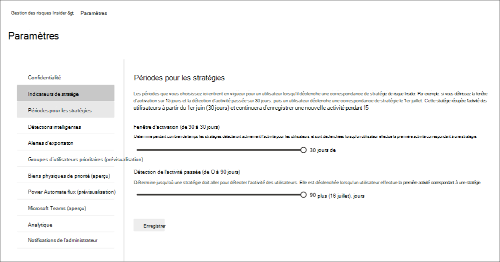

# Prise en charge des paramètres de gestion des risques internes

Les paramètres de gestion des risques internes s’appliquent à toutes les stratégies de gestion des risques internes, quel que soit le modèle que vous choisissez lors de la création d’une stratégie. Les paramètres sont configurés à l’aide des **Paramètres de risque internes** contrôle situés en haut de tous les onglets de gestion des risques internes. Ces paramètres contrôlent les composants de stratégie pour les domaines suivants :

- Confidentialité
- Indicateurs
- Chronologies des stratégies
- Détections intelligentes
- Exporter des alertes (aperçu)
- Groupes d’utilisateurs prioritaires (aperçu)
- Ressources physiques prioritaires (prévisualisation)
- Flux Power Automate (prévisualisation)
- Microsoft Teams (prévisualisation)
- Analytics (préversion)

Avant de commencer et de créer des stratégies de gestion des risques internes, il est important de comprendre ces paramètres et de choisir les niveaux de configuration les mieux conformes aux besoins de conformité de votre organisation.

## Confidentialité

La protection de la confidentialité des utilisateurs disposant de correspondances de stratégie est importante et peut favoriser l'objectivité dans les examens et analyses de données pour les alertes de risque internes. Pour les utilisateurs avec une correspondance de stratégie de risque interne, vous pouvez choisir l’un des paramètres suivants :

- **Afficher les versions anonymisées** des noms d’utilisateur : les noms des utilisateurs sont rendus anonymes pour empêcher les administrateurs, les enquêteurs de données et les réviseurs de voir qui est associé aux alertes de stratégie. Par exemple, un utilisateur « Grace à Taylor » apparaît avec un pseudonyme aléatoire tel que « AnonIS8-988 » dans toutes les zones de l’expérience de gestion des risques internes. Le choix de ce paramètre permet d'anonymiser tous les utilisateurs ayant des correspondances de stratégie actuelle et passée et s’applique à toutes les stratégies. Les informations de profil utilisateur dans l’alerte de risque interne et les détails du cas ne seront pas disponibles lorsque cette option sera choisie. Toutefois, les noms d’utilisateur s’affichent lors de l’ajout de nouveaux utilisateurs à des stratégies existantes ou lors de l’affectation d’utilisateurs à de nouvelles stratégies. Si vous choisissez de désactiver ce paramètre, les noms d’utilisateur s’affichent pour tous les utilisateurs qui ont des correspondances de stratégie actuelles ou passées.
- **Ne pas afficher les versions rendues anonymes** des noms d’utilisateur : les noms d’utilisateur sont affichés pour toutes les correspondances de stratégie actuelles et passées pour les alertes et les cas. Les informations de profil utilisateur (nom, titre, alias et organisation ou service) s’affichent pour l’utilisateur pour tous les cas et alertes de gestion des risques internes.

## Indicateurs

Les modèles de stratégie de risque interne définissent le type d’activités de risque que vous souhaitez détecter et examiner. Chaque modèle de stratégie est basé sur des indicateurs spécifiques qui correspondent à des déclencheurs et des activités de risque spécifiques. Tous les indicateurs sont désactivés par défaut et vous devez sélectionner un ou plusieurs indicateurs de stratégie avant de configurer une stratégie de gestion des risques internes.

Les alertes sont déclenchées par des stratégies lorsque les utilisateurs effectuent des activités liées à des indicateurs de stratégie qui répondent à un seuil requis. La gestion des risques internes utilise deux types d’indicateurs :

- **Déclenchement d’événements**: événements qui déterminent si un utilisateur est actif dans une stratégie de gestion des risques internes. Si un utilisateur est ajouté à une stratégie de gestion des risques internes ne comprend pas d’événement déclencheur, l’activité de l’utilisateur n’est pas évaluée par la stratégie. Par exemple, l’utilisateur A est ajouté  à une stratégie créée à partir du vol de données en dévolant au modèle de stratégie des utilisateurs, et la stratégie et le connecteur RH Microsoft 365 sont correctement configurés. Tant que l’utilisateur A n’a pas de date de résiliation signalée par le connecteur RH, les activités de l’utilisateur A ne sont pas évaluées par cette stratégie de gestion des risques internes pour les risques. Un autre exemple d’événement déclencheur est  si un utilisateur a une alerte de stratégie DLP de gravité élevée lors de l’utilisation de *stratégies de fuite de* données.
- **Indicateurs de stratégie :** indicateurs inclus dans les stratégies de gestion des risques internes utilisées pour déterminer un score de risque pour un utilisateur dans l’étendue. Ces indicateurs de stratégie sont activés uniquement après qu’un événement déclencheur s’est produit pour un utilisateur. Voici quelques exemples d’indicateurs de stratégie lorsqu’un utilisateur copie des données vers des services de stockage cloud personnels ou des périphériques de stockage portables, si un compte d’utilisateur est supprimé d’Azure Active Directory ou si un utilisateur partage des fichiers et dossiers internes avec des parties externes non autorisées.

Les indicateurs de stratégie sont segmentés dans les zones suivantes. Vous pouvez choisir les indicateurs pour activer et personnaliser les limites des événements d’indicateurs pour chaque niveau d’indicateur lors de la création d’une stratégie de risque interne :

- Indicateurs Office : il **s’agit** notamment d’indicateurs de stratégie pour les sites SharePoint, Microsoft Teams et la messagerie électronique.
- **Indicateurs d’appareil**: il s’agit notamment d’indicateurs de stratégie pour les activités telles que le partage de fichiers sur le réseau ou avec des appareils. Les indicateurs incluent les activités impliquant des Microsoft Office, des fichiers .csv (valeurs séparées par des virgules) et des fichiers .pdf (format de document portable). Si vous sélectionnez Indicateurs d’appareil, l’activité est traitée uniquement pour les appareils avec Windows 10 Build 1809 ou une build supérieure et vous devez d’abord intégrer les appareils au centre de conformité. Pour plus d’informations sur la configuration des appareils pour l’intégration aux risques internes, voir la section Activer les indicateurs d’appareil et les appareils [intégrés](insider-risk-management-settings.md#OnboardDevices) dans cet article.
- Indicateur de violation de stratégie de sécurité **(prévisualisation)**: il s’agit des indicateurs de Microsoft Defender pour le point de terminaison liés à l’installation de logiciels non désapprouvés ou malveillants ou au contournement des contrôles de sécurité. Pour recevoir des alertes dans la gestion des risques internes, vous devez avoir activé une licence Active Defender for Endpoint et l’intégration des risques internes. Pour plus d’informations sur la configuration de Defender pour Endpoint pour l’intégration de la gestion des risques internes, voir Configurer des fonctionnalités avancées [dans Microsoft Defender pour Endpoint.](/windows/security/threat-protection/microsoft-defender-atp/advanced-features\#share-endpoint-alerts-with-microsoft-compliance-center)
- **Indicateurs d’accès physique (aperçu)**: il s’agit des indicateurs de stratégie pour l’accès physique aux biens sensibles. Par exemple, les tentatives d’accès à une zone restreinte dans vos journaux du système de gestion des risques internes peuvent être partagées avec les stratégies de gestion des risques internes. Pour recevoir ces types d’alertes dans la gestion des risques internes, les ressources physiques prioritaires doivent être activées dans la gestion des risques internes et le connecteur de données de [badging](import-physical-badging-data.md) physique configuré. Pour en savoir plus sur la configuration de l’accès physique, consultez la [section Accès physique prioritaire](#priority-physical-assets-preview) de cet article.
- **Indicateurs Microsoft Cloud App Security (prévisualisation)**: il s’agit des indicateurs de stratégie provenant d’alertes partagées de Cloud App Security. La détection des anomalies activée automatiquement dans Cloud App Security commence immédiatement à détecter et à rassembler les résultats, en ciblant de nombreuses anomalies comportementales au sein de vos utilisateurs et des ordinateurs et périphériques connectés à votre réseau. Pour inclure ces activités dans les alertes de stratégie de gestion des risques internes, sélectionnez un ou plusieurs indicateurs dans cette section. Pour en savoir plus sur l’analyse de Cloud App Security et la détection des anomalies, voir [Obtenir l’analyse comportementale et la détection des anomalies.](/cloud-app-security/anomaly-detection-policy)
- Score de risque : il **s’agit notamment** d’augmenter le score de risque pour les activités inhabituelles ou les violations de stratégie passées. L’activation des score de risque augmente les scores de risque et la probabilité d’alertes pour ces types d’activités. Pour les activités inhabituelles, les scores sont élevés si l’activité détectée s’écarte du comportement classique de l’utilisateur. Par exemple, une augmentation significative des téléchargements de fichiers quotidiens. Une activité inhabituelle est présentée comme une augmentation du pourcentage (par exemple, « 100 % au-dessus de l’activité habituelle » par exemple) et aura un impact différent sur le score de risque en fonction de l’activité. Pour les utilisateurs avec des violations de stratégie précédentes, les scores sont élevés si un utilisateur a résolu plusieurs cas précédemment comme une violation de stratégie confirmée. Les marqueurs de score de risque ne peuvent être sélectionnés que si un ou plusieurs indicateurs sont sélectionnés.

Dans certains cas, vous pouvez limiter les indicateurs de stratégie de risque interne qui sont appliqués aux stratégies de risques internes de votre organisation. Vous pouvez désactiver les indicateurs de stratégie pour des zones spécifiques en les désactivant de toutes les stratégies de risque internes. Le déclenchement d’événements ne peut pas être modifié pour les modèles de stratégie de risque internes.

Pour définir les indicateurs de stratégie de risque interne activés dans toutes les stratégies de risques internes, accédez aux indicateurs des **paramètres** de risque internes et sélectionnez un ou plusieurs  >   indicateurs de stratégie. Les indicateurs sélectionnés dans la page Paramètres des indicateurs ne peuvent pas être configurés individuellement lors de la création ou de la modification d’une stratégie de risque interne dans l’Assistant Stratégie.

>[!NOTE]
>L’affichage des nouveaux utilisateurs ajoutés manuellement dans le tableau de bord Utilisateurs peut prendre plusieurs **heures.** L’affichage des activités des 90 derniers jours de ces utilisateurs peut prendre jusqu’à 24 heures. Pour afficher les activités des utilisateurs ajoutés  manuellement, sélectionnez l’utilisateur dans le tableau de bord Utilisateurs et ouvrez l’onglet Activité de l’utilisateur dans le volet d’informations. 

### Activer les indicateurs d’appareil et les appareils intégrés

Pour activer la surveillance des activités de risque sur les appareils et inclure des indicateurs de stratégie pour ces activités, vos appareils doivent répondre aux exigences suivantes et vous devez effectuer les étapes d’intégration suivantes.

#### Étape 1 : Préparer vos points de terminaison

Assurez-vous que les appareils Windows 10 que vous prévoyez de signaler dans la gestion des risques internes répondent à ces exigences.

1. Doit être en cours d’exécution windows 10 x64 build 1809 ou ultérieure et avoir installé la mise à jour [Windows 10 (os Build 17763.1075)](https://support.microsoft.com/help/4537818/windows-10-update-kb4537818) à partir du 20 février 2020.
2. Tous les appareils doivent être [joints à Azure Active Directory (AAD)](/azure/active-directory/devices/concept-azure-ad-join) ou joints à Azure AD Hybride.
3. Installez le navigateur Microsoft Chromium Edge sur l’appareil de point de terminaison pour surveiller les actions de l’activité de chargement dans le cloud. [Télécharger le nouveau Microsoft Edge sur la base de chrome](https://support.microsoft.com/help/4501095/download-the-new-microsoft-edge-based-on-chromium).

#### Étape 2 : Intégration d’appareils

Vous devez activer la surveillance des appareils et intégrer vos points de terminaison avant de pouvoir surveiller les activités de gestion des risques internes sur un appareil. Les deux actions sont prises dans le portail de conformité Microsoft 365.

Lorsque vous souhaitez intégrer des appareils qui n’ont pas encore été intégrés, vous devez télécharger le script approprié et le déployer comme indiqué dans les étapes suivantes.

Si vous disposez déjà d’appareils incorporés dans [Microsoft Defender pour point de terminaison](/windows/security/threat-protection/), ceux-ci apparaissent déjà dans la liste des périphériques gérés. Suivez [l’étape 3 : si vous avez des](insider-risk-management-settings.md#OnboardStep3) appareils intégrés à Microsoft Defender pour point de terminaison dans la section suivante.

Dans ce scénario de déploiement, vous allez intégrer des appareils qui n’ont pas encore été intégrés et vous souhaitez simplement surveiller les activités de risque internes sur les appareils Windows 10.

1. Ouvrez le [Centre de conformité Microsoft](https://compliance.microsoft.com).
2. Ouvrez la page Paramètres du centre de conformité et sélectionnez **Appareils intégrés**.

   > [!NOTE]
   > Bien que l’activation de l’intégration des appareils dure généralement environ 60 secondes, patientez jusqu’à 30 minutes avant de contacter le support Microsoft.

3. Sélectionnez **Gestion des appareils** pour ouvrir la liste des **Appareils**. La liste est vide tant que vous n’avez pas intégré de périphériques.
4. Sélectionnez **Intégration** pour lancer le processus d’intégration.
5. Choisissez la façon dont vous souhaitez  déployer sur ces autres appareils à partir de la liste des méthodes de déploiement, puis **téléchargez le package.**
6. Suivez les procédures appropriées dans [Outils et méthodes d’intégration pour les ordinateurs Windows 10](/windows/security/threat-protection/microsoft-defender-atp/configure-endpoints). Ce lien vous dirige vers une page d’accueil dans laquelle vous pouvez accéder aux procédures Microsoft Defender pour point de terminaison qui correspondent au package de déploiement que vous avez sélectionné à l’étape 5 :
    - Intégrer les ordinateurs Windows 10 utilisant une stratégie de groupe
    - Intégrer les ordinateurs Windows à l’aide du gestionnaire de configuration de point de terminaison Microsoft
    - Intégrer les ordinateurs Windows 10 à l’aide des outils de gestion des appareils mobiles
    - Intégrer les ordinateurs Windows 10 utilisant un script local
    - Intégrer les ordinateurs virtuels d’infrastructure de bureau virtuel (VDI) non persistants.

Une fois terminé et le point de terminaison intégré, il doit être visible dans la liste des appareils et le point de terminaison commence à signaler les journaux d’activité d’audit à la gestion des risques internes.

> [!NOTE]
> Cette expérience est sous l’application de la licence. Sans la licence requise, les données ne sont pas visibles ni accessibles.

#### Étape 3 : Si vous avez des appareils intégrés à Microsoft Defender pour le point de terminaison

Si Microsoft Defender pour le point de terminaison est déjà déployé et que des points de terminaison sont connectés, tous ces points de terminaison apparaissent dans la liste des appareils gérés. Vous pouvez continuer à intégrer de nouveaux appareils à la gestion des risques internes pour étendre la couverture à l’aide de la section Étape 2 : [Intégration des appareils.](insider-risk-management-settings.md#OnboardStep2)

1. Ouvrez le [Centre de conformité Microsoft](https://compliance.microsoft.com).
2. Ouvrez la page Paramètres du centre de conformité et sélectionnez **Activer la surveillance d’appareils**.
3. Sélectionnez **Gestion des appareils** pour ouvrir la liste des **Appareils**. Vous devriez voir la liste des appareils qui sont déjà signalés dans Microsoft Defender pour le point de terminaison.
4. Choisissez **l’intégration** si vous avez besoin d’intégrer davantage d’appareils.
5. Choisissez la façon dont vous souhaitez  déployer sur ces autres appareils dans la liste des méthodes de déploiement, puis **téléchargez le package.**
6. Suivez les procédures appropriées dans [Outils et méthodes d’intégration pour les ordinateurs Windows 10](/windows/security/threat-protection/microsoft-defender-atp/configure-endpoints). Ce lien vous dirige vers une page d’accueil dans laquelle vous pouvez accéder aux procédures Microsoft Defender pour point de terminaison qui correspondent au package de déploiement que vous avez sélectionné à l’étape 5 :
    - Intégrer les ordinateurs Windows 10 utilisant une stratégie de groupe
    - Intégrer les ordinateurs Windows à l’aide du gestionnaire de configuration de point de terminaison Microsoft
    - Intégrer les ordinateurs Windows 10 à l’aide des outils de gestion des appareils mobiles
    - Intégrer les ordinateurs Windows 10 utilisant un script local
    - Intégrer les ordinateurs virtuels d’infrastructure de bureau virtuel (VDI) non persistants.

Une fois terminé et le point de terminaison intégré, il doit être visible sous la table **Appareils** et le point de terminaison commence à signaler les journaux d’activité d’audit à la gestion des risques internes.

> [!NOTE]
>Cette expérience est sous l’application de la licence. Sans la licence requise, les données ne sont pas visibles ni accessibles.

### Paramètres de niveau indicateur (aperçu)

Lors de la création d’une stratégie dans l’Assistant Stratégie, vous pouvez configurer la façon dont le nombre quotidien d’événements de risque doit influencer le score de risque pour les alertes de risque internes. Ces paramètres d’indicateur vous aident à contrôler la façon dont le nombre d’occurrences d’événements de risque dans votre organisation doit affecter le score de risque, ainsi que la gravité de l’alerte associée, pour ces événements. Si vous préférez, vous pouvez également choisir de conserver les niveaux de seuil d’événement par défaut recommandés par Microsoft pour tous les indicateurs activés.

Par exemple, vous décidez d’activer les indicateurs SharePoint dans les paramètres de stratégie de risque interne  et de définir des seuils personnalisés pour les événements SharePoint lors de la configuration des indicateurs pour une nouvelle stratégie de fuite de données de risques internes. Dans l’Assistant Stratégie de risque interne, vous configurez trois niveaux d’événements quotidiens différents pour chaque indicateur SharePoint afin d’influencer le score de risque pour les alertes associées à ces événements.

Pour le premier niveau d’événement quotidien, vous définissez le seuil à *10* événements ou plus par jour pour un impact inférieur sur le score de risque pour les événements, *20* événements ou plus par jour pour un impact moyen sur le score de risque pour les événements et *30* événements ou plus par jour un impact plus élevé sur le score de risque pour les événements. Ces paramètres signifient effectivement :

- Si 1 à 9 événements SharePoint se produisent après le déclenchement de l’événement, les scores de risque sont peu touchés et ont tendance à ne pas générer d’alerte.
- Si 10 à 19 événements SharePoint se déclenchent après un événement déclencheur, le score de risque est intrinsèquement inférieur et les niveaux de gravité des alertes ont tendance à se trouver à un niveau faible.
- Si 20 à 29 événements SharePoint se déclenchent après un déclenchement, le score de risque est intrinsèquement plus élevé et les niveaux de gravité des alertes ont tendance à se trouver à un niveau moyen.
- Si au moins 30 événements SharePoint ont lieu après un déclenchement, le score de risque est intrinsèquement plus élevé et les niveaux de gravité des alertes ont tendance à se trouver à un niveau élevé.

## Délais de la stratégie

Les délais de stratégie vous permettent de définir les périodes passées et futures qui sont déclenchées après les correspondances de stratégie basées sur les événements et les activités des modèles de stratégie de gestion des risques internes. En fonction du modèle de stratégie que vous choisissez, les délais de stratégie suivants sont disponibles :

- **Fenêtre d’activation**: disponible pour tous les modèles de stratégie, la fenêtre *Activation* est le nombre défini de jours d’activation de la fenêtre après **un** événement déclencheur. La fenêtre s’active pendant 1 à 30 jours après qu’un événement déclencheur se produit pour tout utilisateur affecté à la stratégie. Par exemple, vous avez configuré une stratégie de gestion des risques internes et définissez la fenêtre *d’activation* sur 30 jours. Plusieurs mois se sont écoulés depuis la configuration de la stratégie et un événement déclencheur se produit pour l’un des utilisateurs inclus dans la stratégie. L’événement déclencheur active la fenêtre *Activation* et la stratégie est active pour cet utilisateur pendant 30 jours après que l’événement déclencheur s’est produit.
- **Détection des activités passées**: disponible  pour tous les modèles de stratégie,  la détection de l’activité passée est le nombre défini de jours d’activation de la fenêtre avant un événement déclencheur. La fenêtre s’active pendant 0 à 180 jours avant qu’un événement déclencheur ne se produise pour tout utilisateur affecté à la stratégie. Par exemple, vous avez configuré une stratégie de gestion des risques internes et définissez la détection des activités *passées* sur 90 jours. Plusieurs mois se sont écoulés depuis la configuration de la stratégie et un événement déclencheur se produit pour l’un des utilisateurs inclus dans la stratégie. L’événement déclencheur active  la détection de l’activité passée et la stratégie collecte les activités historiques de cet utilisateur pendant 90 jours avant l’événement déclencheur.

## Détections intelligentes

Les paramètres de détection intelligent permettent d’affiner la façon dont les détections des activités à risque sont traitées pour les alertes. Dans certains cas, vous devrez peut-être définir des types de fichiers à ignorer ou appliquer un niveau de détection pour les fichiers afin de définir une barre minimale pour les alertes. Utilisez ces paramètres pour contrôler le volume d’alerte global, les exclusions de types de fichiers et les limites de volume de fichiers.

### Exclusions de types de fichiers

Pour exclure des types de fichiers spécifiques de toutes les correspondances de stratégie de gestion des risques internes, entrez des extensions de type de fichier séparées par des virgules. Par exemple, pour exclure certains types de fichiers musicaux des correspondances de stratégie, vous pouvez entrer aac,mp3,wav,wma dans le champ **exclusions de type de fichier**. Les fichiers avec ces extensions seront ignorés par toutes les stratégies de gestion des risques internes.

### Seuil pour l’activité inhabituelle des fichiers

Pour définir un niveau de fichier minimal avant que les alertes d’activité soient signalées dans les stratégies de risque interne, entrez le nombre de fichiers. Par exemple, entrez « 10 » si vous ne souhaitez pas générer d’alertes de risques internes lorsqu’un utilisateur télécharge 10 fichiers ou moins, même si les stratégies considèrent cette activité comme inhabituelle.

### Volume d’alerte

Les activités des utilisateurs détectées par les stratégies de risque interne se voit attribuer un score de risque spécifique, qui à son tour détermine la gravité de l’alerte (faible, moyenne, élevée). Par défaut, nous allons générer une certaine quantité d’alertes de gravité faible, moyenne et élevée, mais vous pouvez augmenter ou diminuer le volume en fonction de vos besoins. Pour ajuster le volume des alertes pour toutes les stratégies de gestion des risques internes, choisissez l’un des paramètres suivants :

- **Moins d’alertes**: vous verrez toutes les alertes de gravité élevée, moins d’alertes de gravité moyenne et aucune alerte de faible gravité. Ce niveau de paramètre signifie que vous pouvez manquer certains vrais positifs.
- **Volume par défaut**: vous verrez toutes les alertes de gravité élevée et une quantité équilibrée d’alertes de gravité moyenne et faible.
- **Plus d’alertes**: vous verrez toutes les alertes de gravité moyenne et élevée, ainsi que la plupart des alertes de faible gravité. Ce niveau de paramètre peut entraîner davantage de faux positifs.

### Microsoft Defender pour point de terminaison (prévisualisation)

[Microsoft Defender pour point de terminaison](/windows/security/threat-protection/microsoft-defender-atp/microsoft-defender-advanced-threat-protection) est une plateforme de sécurité de point de terminaison d’entreprise conçue pour aider les réseaux d’entreprise à prévenir, détecter, examiner et répondre aux menaces avancées. Pour avoir une meilleure visibilité des violations de sécurité dans votre organisation, vous pouvez importer et filtrer les alertes Defender for Endpoint pour les activités utilisées dans les stratégies créées à partir de modèles de stratégie de violation de sécurité de gestion des risques internes.

En fonction des types de signaux qui vous intéressent, vous pouvez choisir d’importer des alertes dans la gestion des risques internes en fonction de l’état de triage des alertes Defender for Endpoint. Vous pouvez définir un ou plusieurs des états de tri d’alerte suivants dans les paramètres globaux à importer :

- Inconnu
- Nouveau
- En cours
- Résolu

Les alertes de Defender for Endpoint sont importées quotidiennement. En fonction de l’état de triage que vous choisissez, vous pouvez voir plusieurs activités utilisateur pour la même alerte lorsque l’état de triage change dans Defender pour le point de terminaison.

Par exemple, si vous sélectionnez  Nouveau *,* En cours et Résolu pour ce paramètre, lorsqu’une alerte Microsoft Defender pour le point de terminaison est générée et que l’état est Nouveau *,* une activité d’alerte initiale est importée pour l’utilisateur en cas de risque interne. Lorsque l’état de triage Defender pour le point de terminaison passe à En *cours,* une deuxième activité de cette alerte est importée pour l’utilisateur en cas de risque interne. Lorsque l’état de triage  Final Defender pour le point de terminaison est résolu, une troisième activité de cette alerte est importée pour l’utilisateur à risque interne. Cette fonctionnalité permet aux enquêteurs de suivre la progression des alertes defender pour point de terminaison et de choisir le niveau de visibilité nécessaire à leur examen.

>[!IMPORTANT]
>Microsoft Defender pour point de terminaison doit être configuré dans votre organisation et activer Defender pour le point de terminaison pour l’intégration de la gestion des risques internes dans le Centre de sécurité Defender pour importer les alertes de violation de sécurité. Pour plus d’informations sur la configuration de Defender pour Endpoint pour l’intégration de la gestion des risques internes, voir Configurer des fonctionnalités avancées [dans Defender pour Endpoint.](/windows/security/threat-protection/microsoft-defender-atp/advanced-features\#share-endpoint-alerts-with-microsoft-compliance-center)

### Domaines (prévisualisation)

Les paramètres de domaine vous aident à définir des niveaux de risque pour les activités sur des domaines spécifiques. Ces activités incluent le partage de fichiers, l’envoi de messages électroniques, le téléchargement ou le téléchargement de contenu. En spécifiant des domaines dans ces paramètres, vous pouvez augmenter ou diminuer le score de risque pour l’activité qui a lieu avec ces domaines.

Utilisez Ajouter un domaine pour définir un domaine pour chacun des paramètres de domaine. En outre, vous pouvez utiliser des caractères génériques pour vous aider à trouver des variantes de domaines racines ou de sous-domaines. Par exemple, pour spécifier sales.wingtiptoys.com et support.wingtiptoys.com, utilisez l’entrée générique « *.wingtiptoys.com » pour faire correspondre ces sous-domaine (et tout autre sous-domaine du même niveau). Pour spécifier des sous-domaines à plusieurs niveaux pour un domaine racine, vous devez cocher la case Inclure les **sous-domaines** à plusieurs niveaux.

Pour chacun des paramètres de domaine suivants, vous pouvez entrer jusqu’à 500 domaines :

- **Domaines nonallés :** En spécifiant des domaines nonallés, l’activité qui a lieu avec ces domaines aura des *scores* de risque plus élevés. Voici quelques exemples d’activités impliquant le partage de contenu avec quelqu’un (par exemple, l’envoi de courriers électroniques à une personne avec une adresse gmail.com) et lorsque les utilisateurs téléchargent du contenu sur un appareil à partir de l’un de ces domaines nonallés.
- **Domaines autorisés :** Certaines activités liées aux domaines autorisés sont ignorées par vos stratégies et ne génèrent pas d’alertes. Ces activités sont les suivantes :

    - Courrier électronique envoyé à des domaines externes
    - Fichiers, dossiers, sites partagés avec des domaines externes
    - Fichiers téléchargés vers des domaines externes (à l’aide du navigateur Microsoft Edge)

    En spécifiant les domaines autorisés dans les paramètres, cette activité avec ces domaines est traitée de la même manière que l’activité interne de l’organisation. Par exemple, les domaines ajoutés ici m’indiquent des activités qui peuvent impliquer le partage de contenu avec une personne extérieure à votre organisation (par exemple, l’envoi d’e-mails à une personne avec gmail.com’adresse).

- **Domaines tiers :** Si votre organisation utilise des domaines tiers à des fins professionnelles (telles que le stockage cloud), *incluez-les* ici afin de pouvoir recevoir des alertes pour l’activité liée à l’indicateur d’appareil Utilisez un navigateur pour télécharger du contenu à partir d’un site tiers.

## Exporter des alertes (aperçu)

Les informations d’alerte de gestion des risques internes sont exportables vers les services de gestion des événements et des informations de sécurité (SIEM) via le schéma de l’API Activité de gestion [Office 365.](/office/office-365-management-api/office-365-management-activity-api-schema#security-and-compliance-alerts-schema) Vous pouvez utiliser les API Activité de gestion Office 365 pour exporter des informations d’alerte vers d’autres applications que votre organisation peut utiliser pour gérer ou agréger des informations sur les risques internes.

Pour utiliser les API pour passer en revue les informations d’alerte de risque interne :

1. Activer la prise en charge de l’API Activité de gestion Office 365 dans les **paramètres** de gestion des risques internes  >    >  **- Exporter les alertes.** Par défaut, ce paramètre est désactivé pour votre organisation Microsoft 365.
2. Filtrez les activités d’audit Office 365 courantes par *SecurityComplianceAlerts*.
3. Filtrez *SecurityComplianceAlerts par* catégorie *InsiderRiskManagement.*

Les informations d’alerte contiennent des informations du schéma d’alerte de sécurité et de conformité et du schéma commun de l’API Activité de gestion Office 365.

Les champs et valeurs suivants sont exportés pour les alertes de gestion des risques internes pour le schéma d’alerte de sécurité & conformité :

| **Paramètre d’alerte** | **Description** |
|:------------------|:----------------|
| AlertType | Type de l’alerte est *Personnalisé*.  |
| AlertId | GUID de l’alerte. Les alertes de gestion des risques internes sont mutables. À mesure que l’état de l’alerte change, un nouveau journal avec le même ID d’alerte est généré. Ce AlertID peut être utilisé pour corréler les mises à jour d’une alerte. |
| Catégorie | La catégorie de l’alerte *est InsiderRiskManagement*. Cette catégorie peut être utilisée pour distinguer ces alertes des autres alertes de sécurité & conformité. |
| Commentaires | Commentaires par défaut pour l’alerte. Les valeurs *sont Nouvelle alerte* (consignée lors de la création d’une alerte) et Alerte mise à jour (consignée lorsqu’une alerte est mise à jour).  Utilisez alertID pour corréler les mises à jour d’une alerte. |
| Données | Les données de l’alerte incluent l’ID d’utilisateur unique, le nom d’utilisateur principal et la date et l’heure (UTC) de déclenchement de l’utilisateur dans une stratégie. |
| Nom | Nom de la stratégie de gestion des risques internes qui a généré l’alerte. |
| PolicyId | GUID de la stratégie de gestion des risques internes qui a déclenché l’alerte. |
| Severity | Gravité de l’alerte. Les valeurs *sont Élevée,* *Moyenne* ou *Faible*. |
| Source | Source de l’alerte. La valeur est *Office 365 Security & Compliance*. |
| Statut | État de l’alerte. Les valeurs sont *Active* *(révision* nécessaire en cas de risque *interne),* Examen *(confirmé* en cas de risque interne), *Résolu* *(résolu* en cas de risque *interne),* Rejeté *(rejeté* en cas de risque interne). |
| Version | Version du schéma d’alerte de sécurité et de conformité. |

Les champs et valeurs suivants sont exportés pour les alertes de gestion des risques internes pour le schéma commun de l’API Activité de gestion [Office 365.](/office/office-365-management-api/office-365-management-activity-api-schema#common-schema)

- UserId
- ID
- RecordType
- CreationTime
- Opération
- OrganizationId
- UserType
- UserKey

## Groupes d’utilisateurs prioritaires (aperçu)

Les utilisateurs de votre organisation peuvent avoir différents niveaux de risque en fonction de leur position, du niveau d’accès aux informations sensibles ou de l’historique des risques. La priorité de l’examen et de l’notation des activités de ces utilisateurs peut vous aider à vous alerter sur les risques potentiels qui peuvent avoir des conséquences plus élevées pour votre organisation. Les groupes d’utilisateurs prioritaires dans la gestion des risques internes vous aident à définir les utilisateurs de votre organisation qui ont besoin d’une inspection plus approfondie et d’un score de risque plus sensible. Couplés aux violations de stratégie de sécurité par les *utilisateurs* prioritaires et aux fuites de données par les *modèles* de stratégie utilisateurs prioritaires, les utilisateurs ajoutés à un groupe d’utilisateurs prioritaires ont une probabilité accrue d’alertes à risque internes et d’alertes avec des niveaux de gravité plus élevés.

Par exemple, vous devez vous protéger contre les fuites de données pour un projet hautement confidentiel dans lequel les utilisateurs ont accès à des informations sensibles. Vous choisissez de créer un *groupe d’utilisateurs*  prioritaire Utilisateurs de projet confidentiels pour les utilisateurs de votre organisation qui travaillent sur ce projet. À l’aide de l’Assistant Stratégie et des fuites de  données par modèle de stratégie utilisateurs prioritaires, vous créez une stratégie et attribuez le groupe utilisateurs de priorité *Utilisateurs* de projet confidentiels à la stratégie. Les activités examinées par la  stratégie pour les membres du groupe d’utilisateurs priorité Utilisateurs de projet confidentiels sont plus sensibles aux risques et les activités de ces utilisateurs seront plus susceptibles de générer une alerte et d’avoir des alertes avec des niveaux de gravité plus élevés.

### Créer un groupe d’utilisateurs prioritaire

Pour créer un nouveau groupe d’utilisateurs prioritaires, vous allez utiliser la définition de contrôles dans la **solution** de gestion des risques internes dans le Centre de conformité Microsoft 365. Pour créer un groupe d’utilisateurs prioritaires, vous devez être membre du groupe de rôles Gestion des risques internes ou Administrateur de la gestion *des* risques internes. 

Pour créer un groupe d’utilisateurs prioritaire, complétez les étapes suivantes :

1. Dans le Centre [de conformité Microsoft 365,](https://compliance.microsoft.com)sélectionnez Gestion des risques internes **et** sélectionnez **Paramètres de risque** insider.
2. Sélectionner **l’onglet Groupes d’utilisateurs prioritaires**
3. Sous **l’onglet Groupes d’utilisateurs** prioritaires, **sélectionnez Créer** un groupe d’utilisateurs prioritaire pour démarrer l’Assistant Création de groupes.
4. Dans la page **Définir un groupe,** remplissez les champs suivants :
    - **Nom (obligatoire)**: entrez un nom convivial pour le groupe d’utilisateurs prioritaire. Vous ne pouvez pas modifier le nom du groupe d’utilisateurs prioritaires après avoir terminé l’Assistant.
    - **Description (facultative)**: entrez une description du groupe d’utilisateurs prioritaire.
5. Sélectionnez **Suivant** pour continuer.
6. Dans la **page** Choisir  des membres, sélectionnez Choisir les membres à rechercher et sélectionnez les comptes d’utilisateurs à messagerie inclus dans le groupe ou activez la case à cocher Sélectionner tout pour ajouter tous les utilisateurs de votre organisation au groupe.  Sélectionnez **Ajouter** pour continuer ou **Annuler** pour fermer sans ajouter d’utilisateurs au groupe.
7. Sélectionnez **Suivant** pour continuer.
8. Dans la page **Révision,** examinez les paramètres que vous avez choisis pour le groupe d’utilisateurs prioritaire. Sélectionnez **Modifier** pour modifier l’une des valeurs du groupe ou **sélectionnez Envoyer** pour créer et activer le groupe d’utilisateurs prioritaire.
9. Dans la page de confirmation, **sélectionnez Terminé** pour quitter l’Assistant.

### Mettre à jour un groupe d’utilisateurs prioritaire

Pour mettre à jour un groupe d’utilisateurs prioritaires existant, vous utiliserez des contrôles de paramètre dans la **solution** de gestion des risques internes dans le Centre de conformité Microsoft 365. Pour mettre à jour un groupe d’utilisateurs prioritaires, vous devez être membre du groupe de rôles Gestion des risques internes ou Administrateur de la gestion *des* risques internes. 

Pour modifier un groupe d’utilisateurs prioritaires, complétez les étapes suivantes :

1. Dans le Centre [de conformité Microsoft 365,](https://compliance.microsoft.com)sélectionnez Gestion des risques internes **et** sélectionnez **Paramètres de risque** insider.
2. Sélectionner **l’onglet Groupes d’utilisateurs prioritaires**
3. Sélectionnez le groupe d’utilisateurs prioritaire que vous souhaitez modifier et **sélectionnez Modifier le groupe.**
4. Dans la page **Définir un groupe,** mettez à jour le champ Description si nécessaire. Vous ne pouvez pas mettre à jour le nom du groupe d’utilisateurs prioritaire. Sélectionnez **Suivant** pour continuer.
5. Dans la page **Choisir des membres,** ajoutez de nouveaux membres au groupe à l’aide du contrôle Choisir **des membres.** Pour supprimer un utilisateur du groupe, sélectionnez le « X » en côté de l’utilisateur que vous souhaitez supprimer. Sélectionnez **Suivant** pour continuer.
6. Dans la page **Révision,** examinez les paramètres de mise à jour que vous avez choisis pour le groupe d’utilisateurs prioritaire. Sélectionnez **Modifier** pour modifier l’une des valeurs du groupe ou **sélectionnez Envoyer** pour mettre à jour le groupe d’utilisateurs prioritaires.
7. Dans la page de confirmation, **sélectionnez Terminé** pour quitter l’Assistant.

### Supprimer un groupe d’utilisateurs prioritaire

Pour supprimer un groupe d’utilisateurs prioritaires existant, vous utiliserez des contrôles de paramètre dans la **solution** de gestion des risques internes dans le Centre de conformité Microsoft 365. Pour supprimer un groupe d’utilisateurs prioritaires, vous devez être membre du groupe de rôles Gestion des risques internes ou Administrateur de la gestion *des* risques internes. 

>[!IMPORTANT]
>La suppression d’un groupe d’utilisateurs prioritaires le supprime de toute stratégie active à laquelle il est affecté. Si vous supprimez un groupe d’utilisateurs prioritaire affecté à une stratégie active, la stratégie ne contiendra aucun utilisateur dans l’étendue et sera effectivement inactive et ne créera pas d’alertes.

Pour supprimer un groupe d’utilisateurs prioritaires, vous devez effectuer les étapes suivantes :

1. Dans le Centre [de conformité Microsoft 365,](https://compliance.microsoft.com)sélectionnez Gestion des risques internes **et** sélectionnez **Paramètres de risque** insider.
2. Sélectionner **l’onglet Groupes d’utilisateurs prioritaires**
3. Sélectionnez le groupe d’utilisateurs prioritaire à modifier, puis **sélectionnez Supprimer** dans le menu tableau de bord.
4. Dans la **boîte de dialogue** Supprimer, sélectionnez **Oui** pour supprimer le groupe d’utilisateurs prioritaire ou sélectionnez **Annuler** pour revenir au tableau de bord.

## Ressources physiques prioritaires (prévisualisation)

L’identification de l’accès aux ressources physiques prioritaires et la mise en corrélation de l’activité d’accès aux événements utilisateur est un composant important de votre infrastructure de conformité. Ces biens physiques représentent des emplacements prioritaires dans votre organisation, tels que des bâtiments d’entreprise, des centres de données ou des salles de serveurs. Les activités à risque internes peuvent être associées à des utilisateurs travaillant pendant des heures inhabituelles, à la tentative d’accès à ces zones sensibles ou sécurisées non autorisées, et à des demandes d’accès à des zones de haut niveau sans besoins légitimes.

Une fois que les ressources physiques de priorité sont activées et que le connecteur de données de [badging](import-physical-badging-data.md) physique est configuré, la gestion des risques internes intègre les signaux de vos systèmes de contrôle physique et d’accès à d’autres activités de risque utilisateur. En examinant les modèles de comportement sur les systèmes d’accès physique et en corrélant ces activités avec d’autres événements de risque internes, la gestion des risques internes peut aider les enquêteurs et les analystes de conformité à prendre des décisions de réponse plus éclairées pour les alertes. L’accès aux ressources physiques prioritaires est marqué et identifié dans les informations différemment de l’accès aux ressources non prioritaires.

Par exemple, votre organisation dispose d’un système de mauvaise gestion pour les utilisateurs qui surveille et approuve l’accès physique aux zones de projet normales de travail et sensibles. Plusieurs utilisateurs travaillent sur un projet sensible et ces utilisateurs reviennent à d’autres zones de votre organisation une fois le projet terminé. Lorsque le projet sensible est sur le point d’être terminé, vous souhaitez vous assurer que le travail du projet reste confidentiel et que l’accès aux zones de projet est étroitement contrôlé.

Vous choisissez d’activer le connecteur de données de mauvaise gestion physique dans Microsoft 365 pour importer les informations d’accès à partir de votre système de mauvaise gestion physique et spécifier les ressources physiques prioritaires dans la gestion des risques internes. En important des informations à partir de votre système de corruption et en corrélant les informations d’accès physique avec d’autres activités de risque identifiées dans la gestion des risques internes, vous remarquez qu’un des utilisateurs du projet accède aux bureaux du projet après des heures de travail normales et exporte également de grandes quantités de données vers un service de stockage cloud personnel à partir de leur zone de travail normale. Cette activité d’accès physique associée à l’activité en ligne peut pointer vers un vol possible de données et les enquêteurs et analystes de conformité peuvent prendre les mesures appropriées selon les circonstances de cet utilisateur.

### Configurer les ressources physiques prioritaires

Pour configurer les ressources physiques prioritaires, vous devez configurer le connecteur de gestion des problèmes physiques et utiliser les contrôles de paramètre dans la **solution** de gestion des risques internes dans le Centre de conformité Microsoft 365. Pour configurer les ressources physiques prioritaires, vous  devez être membre du groupe de rôles Gestion des risques internes ou Administrateur de la gestion des risques *internes.*

Pour configurer les ressources physiques prioritaires, complétez les étapes suivantes :

1. Suivez les étapes de configuration pour la gestion des risques internes dans l’article Prise en charge de la [gestion des risques internes.](insider-risk-management-configure.md) À l’étape 3, veillez à configurer le connecteur de badging physique.

    >[!IMPORTANT]
    >Pour que les stratégies de gestion des risques internes utilisent et corrélent les données de signal liées aux utilisateurs qui quittent et se terminent par des données d’événement à partir de vos plateformes de contrôle physique et d’accès, vous devez également configurer le connecteur Microsoft 365 HR. Si vous activez le connecteur de badging physique sans activer le connecteur RH Microsoft 365, les stratégies de gestion des risques internes ne traitera que les événements des activités d’accès physique pour les utilisateurs de votre organisation.

2. Dans le Centre de conformité [Microsoft 365,](https://compliance.microsoft.com)allez à **La** gestion des risques internes et sélectionnez **Paramètres** des risques internes Priorité des ressources  >  **physiques.**
3. Dans la **page** Ressources physiques de priorité, vous pouvez ajouter manuellement les ID d’actifs physiques que vous souhaitez surveiller pour les événements de ressources importés par le connecteur de badging physique ou importer un fichier .csv de tous les ID de biens physiques importés par le connecteur de badging physique : a) Pour ajouter manuellement des ID de ressources physiques, choisissez Ajouter des ressources physiques de **priorité,** entrez un ID de bien physique, puis sélectionnez Ajouter **.** Entrez d’autres ID de ressources physiques, puis **sélectionnez** Ajouter des ressources physiques de priorité pour enregistrer tous les biens entrés.
    b) To add a list of physical asset IDs from a .csv file, choose **Import priority physical assets**. Dans la boîte de dialogue Explorateur de fichiers, sélectionnez le fichier .csv à importer, puis sélectionnez **Ouvrir.** Les ID de ressources physiques des fichiers .csv sont ajoutés à la liste.
4. Accédez à **l’onglet Indicateurs de stratégie** dans Paramètres.
5. Dans la page **Indicateurs de** stratégie, accédez à la section Indicateurs d’accès physique et cochez la case accès physique après l’arrêt ou l’échec de l’accès aux **biens** **sensibles.**
6. Sélectionnez **Enregistrer** pour configurer et quitter.

### Supprimer un bien physique prioritaire

Pour supprimer un bien physique de priorité existant, vous utiliserez des contrôles de paramètre dans la solution de gestion des risques internes dans le Centre de conformité Microsoft 365. Pour supprimer un bien physique prioritaire, vous devez être membre du groupe de rôles Gestion des risques internes ou Administrateur de la gestion des risques internes.

>[!IMPORTANT]
>La suppression d’un bien physique prioritaire le supprime de l’examen par toute stratégie active à laquelle il était précédemment inclus. Les alertes générées par les activités associées au bien physique de priorité ne sont pas supprimées.

Pour supprimer un bien physique prioritaire, vous devez effectuer les étapes suivantes :

1. Dans le Centre de conformité [Microsoft 365,](https://compliance.microsoft.com)allez à **La** gestion des risques internes et sélectionnez **Paramètres** des risques internes Priorité des ressources  >  **physiques.**
2. Dans la page **Ressources physiques de priorité,** sélectionnez le bien que vous souhaitez supprimer.
3. Sélectionnez **Supprimer** dans le menu Action pour supprimer le bien.

## Flux Power Automate (prévisualisation)

[Microsoft Power Automate est un](/power-automate/getting-started) service de flux de travail qui automatise les actions entre les applications et les services. En utilisant des flux à partir de modèles ou créés manuellement, vous pouvez automatiser les tâches courantes associées à ces applications et services. Lorsque vous activez les flux Power Automate pour la gestion des risques internes, vous pouvez automatiser des tâches importantes pour les cas et les utilisateurs. Vous pouvez configurer les flux Power Automate pour récupérer des informations sur les utilisateurs, les alertes et les cas, et partager ces informations avec les parties prenantes et d’autres applications, et automatiser les actions de gestion des risques internes, telles que la publication dans des notes de cas. Les flux Power Automate s’appliquent aux cas et aux utilisateurs dans l’étendue d’une stratégie.

Les clients titulaires d’abonnements Microsoft 365 qui incluent la gestion des risques internes n’ont pas besoin de licences Power Automate supplémentaires pour utiliser les modèles power Automate de gestion des risques internes recommandés. Ces modèles peuvent être personnalisés pour prendre en charge votre organisation et couvrir les principaux scénarios de gestion des risques internes. Si vous choisissez d’utiliser des fonctionnalités Power Automate premium dans ces modèles, créez un modèle personnalisé à l’aide du connecteur de conformité Microsoft 365 ou utilisez des modèles Power Automate pour d’autres domaines de conformité dans Microsoft 365, vous aurez peut-être besoin de davantage de licences Power Automate.

Les modèles Power Automate suivants sont fournis aux clients pour prendre en charge l’automatisation des processus pour les utilisateurs et les cas de gestion des risques internes :

- Informez les utilisateurs lorsqu’ils sont ajoutés à une stratégie de risque interne : ce modèle est pour les organisations qui ont des stratégies internes, la confidentialité ou des exigences réglementaires que les utilisateurs doivent être avertis **lorsqu’ils** sont soumis à des stratégies de gestion des risques internes. Lorsque ce flux est configuré et sélectionné pour un utilisateur dans la page des utilisateurs, les utilisateurs et leurs responsables sont envoyés par courrier électronique lorsque l’utilisateur est ajouté à une stratégie de gestion des risques internes. Ce modèle prend également en charge la mise à jour d’une liste SharePoint hébergée sur un site SharePoint pour vous aider à suivre les détails des messages de notification tels que la date/l’heure et le destinataire du message. Si vous avez choisi d’anonymiser les utilisateurs dans les paramètres de confidentialité, les flux **créés** à partir de ce modèle ne fonctionneront pas comme prévu afin que la confidentialité de l’utilisateur soit conservée. Les flux Power Automate à l’aide de ce modèle sont disponibles dans le tableau de bord **Utilisateurs.**
- Demander des informations auprès des ressources humaines ou de l’entreprise sur un utilisateur dans un cas de risque interne : lorsque vous agissez sur un cas, les analystes et enquêteurs des risques internes peuvent avoir besoin de consulter les ressources humaines ou d’autres parties prenantes pour comprendre le contexte des activités du cas. Lorsque ce flux est configuré et sélectionné pour un cas, les analystes et enquêteurs envoient un message électronique aux parties prenantes et aux ressources humaines configurées pour ce flux. Chaque destinataire reçoit un message avec des options de réponse pré-configurées ou personnalisables. Lorsque les destinataires sélectionnent une option de réponse, la réponse est enregistrée en tant que note de cas et inclut les informations de destinataire et de date/heure. Si vous avez choisi d’anonymiser les utilisateurs dans les paramètres de confidentialité, les flux **créés** à partir de ce modèle ne fonctionneront pas comme prévu afin que la confidentialité de l’utilisateur soit conservée. Les flux Power Automate à l’aide de ce modèle sont disponibles dans le tableau de bord **Cas.**
- **Avertir le responsable lorsqu’un utilisateur** a une alerte de risque interne : certaines organisations peuvent avoir besoin d’une notification de gestion immédiate lorsqu’un utilisateur a une alerte de gestion des risques internes. Lorsque ce flux est configuré et sélectionné, le responsable de l’utilisateur du cas est envoyé un message électronique avec les informations suivantes sur toutes les alertes de cas :
    - Stratégie applicable pour l’alerte
    - Date/heure de l’alerte
    - Niveau de gravité de l’alerte

    Le flux met automatiquement à jour les notes de cas que le message a été envoyé et que le flux a été activé. Si vous avez choisi d’anonymiser les utilisateurs dans les paramètres de confidentialité, les flux **créés** à partir de ce modèle ne fonctionneront pas comme prévu afin que la confidentialité de l’utilisateur soit conservée. Les flux Power Automate à l’aide de ce modèle sont disponibles dans le tableau de bord **Cas.**

- **Ajouter un** rappel de calendrier pour suivre un cas de risque interne : ce modèle permet aux enquêteurs et analystes de risques d’ajouter des rappels de calendrier pour les cas à leur calendrier Outlook Office 365. Ce flux élimine la nécessité pour les utilisateurs de quitter ou de quitter le flux de travail de gestion des risques internes lors du traitement des cas et du tri des alertes. Lorsque ce flux est configuré et sélectionné, un rappel est ajouté au calendrier Outlook Office 365 pour l’utilisateur qui exécute le flux. Les flux Power Automate à l’aide de ce modèle sont disponibles dans le tableau de bord **Cas.**
- **Créez un enregistrement pour** les cas de risque internes dans ServiceNow : ce modèle est conçu pour les organisations qui souhaitent utiliser leur solution ServiceNow pour suivre les cas de gestion des risques internes.  Dans un cas, les analystes et enquêteurs des risques internes peuvent créer un enregistrement pour le cas dans ServiceNow. Vous pouvez personnaliser ce modèle pour remplir les champs sélectionnés dans ServiceNow en fonction des besoins de votre organisation. Les flux Power Automate à l’aide de ce modèle sont disponibles dans le tableau de bord **Cas.** Pour plus d’informations sur les champs ServiceNow disponibles, consultez l’article de [référence serviceNow Connector.](/connectors/service-now/)

### Créer un flux Power Automate à partir d’un modèle de gestion des risques internes

Pour créer un flux Power Automate à partir d’un modèle de gestion des risques internes recommandé, vous allez utiliser les contrôles de paramètres dans la **solution**  de gestion des risques internes dans le Centre de conformité Microsoft 365 ou l’option Gérer les flux Power **Automate** à partir du contrôle **Automatiser** lorsque vous travaillez directement dans les tableaux de bord Cas ou **Utilisateurs.**

Pour créer un flux Power Automate dans la zone des  paramètres,  vous devez être membre du groupe de rôles Gestion des risques internes ou Administrateur de la gestion des risques internes. Pour créer un flux Power Automate avec l’option Gérer les flux **Power Automate,** vous devez être membre d’au moins un groupe de rôles de gestion des risques internes.

Pour créer un flux Power Automate à partir d’un modèle de gestion des risques internes recommandé, complétez les étapes suivantes :

1. Dans le Centre de conformité [Microsoft 365,](https://compliance.microsoft.com/)allez à **la** gestion des risques internes et sélectionnez les **paramètres** de risque  >  **Insider Flux Power Automate.** Vous pouvez également accéder à partir des pages de **tableaux** de bord Cas ou **Utilisateurs** en choisissant   >  **Automatiser gérer les flux Power Automate.**
2. Dans la page **Flux Power Automate,** sélectionnez un modèle recommandé dans les **modèles** de gestion des risques internes que vous souhaitez peut-être voir dans la section de la page.
3. Le flux répertorie les connexions incorporées nécessaires au flux et note si les états de connexion sont disponibles. Si nécessaire, mettez à jour les connexions qui ne sont pas affichées comme disponibles. Sélectionnez **Continuer**.
4. Par défaut, les flux recommandés sont pré-configurés avec la gestion recommandée des risques internes et les champs de données de service Microsoft 365 requis pour effectuer la tâche affectée au flux. Si nécessaire, personnalisez les composants de flux à l’aide du contrôle Afficher les **options** avancées et en configurant les propriétés disponibles pour le composant de flux.
5. Si nécessaire, ajoutez d’autres étapes au flux en sélectionnant le **bouton Nouvelle étape.** Dans la plupart des cas, cela ne doit pas être nécessaire pour les modèles par défaut recommandés.
6. Sélectionnez **Enregistrer le** brouillon pour enregistrer le flux pour une configuration supplémentaire ou **sélectionnez Enregistrer** pour terminer la configuration du flux.
7. Sélectionnez **Fermer** pour revenir à la page **de flux Power Automate.** Le nouveau modèle sera répertorié sous  la forme d’un flux dans les onglets Mes flux et est automatiquement disponible à partir du contrôle de listes d’attente **Automatiser** lorsque vous travaillez avec des cas de gestion des risques internes pour l’utilisateur qui crée le flux.

>[!IMPORTANT]
>Si d’autres utilisateurs de votre organisation ont besoin d’accéder au flux, le flux doit être partagé.

### Créer un flux Power Automate personnalisé pour la gestion des risques internes

Certains processus et flux de travail pour votre organisation peuvent se trouver en dehors des modèles de flux de gestion des risques internes recommandés et vous devrez peut-être créer des flux Power Automate personnalisés pour les zones de gestion des risques internes. Les flux Power Automate sont flexibles et permettent une personnalisation étendue, mais il existe des étapes à suivre pour intégrer les fonctionnalités de gestion des risques internes.

Pour créer un modèle Power Automate personnalisé pour la gestion des risques internes, vous pouvez effectuer les étapes suivantes :

1. **Vérifiez votre licence de** flux Power Automate : pour créer des flux Power Automate personnalisés qui utilisent des déclencheurs de gestion des risques internes, vous aurez besoin d’une licence Power Automate. Les modèles de flux de gestion des risques internes recommandés ne nécessitent pas de licences supplémentaires et sont inclus dans le cadre de votre licence de gestion des risques internes.
2. **Créer un flux automatisé**: créez un flux qui effectue une ou plusieurs tâches après qu’il a été déclenché par un événement de gestion des risques internes. Pour plus d’informations sur la création d’un flux automatisé, voir [Créer un flux dans Power Automate.](/power-automate/get-started-logic-flow)
3. **Sélectionnez le connecteur de conformité Microsoft 365**: recherchez et sélectionnez le connecteur de conformité Microsoft 365. Ce connecteur active les déclencheurs et actions de gestion des risques internes. Pour plus d’informations sur les connecteurs, consultez l’article de présentation [de référence du](/connectors/connector-reference/) connecteur.
4. **Choisissez les déclencheurs de gestion des risques internes pour** votre flux : la gestion des risques internes a deux déclencheurs disponibles pour les flux Power Automate personnalisés :
    - **Pour un cas de gestion des** risques internes sélectionné : les flux avec ce déclencheur peuvent être sélectionnés dans la page du tableau de bord Cas de gestion des risques internes.
    - **Pour un utilisateur de gestion des** risques internes sélectionné : les flux avec ce déclencheur peuvent être sélectionnés dans la page du tableau de bord Utilisateurs de gestion des risques internes.
5. Choisissez les actions de gestion des risques internes pour votre flux : vous pouvez choisir parmi plusieurs actions pour la gestion des risques internes à inclure dans votre flux personnalisé :
    - Obtenir une alerte de gestion des risques internes
    - Obtenir un cas de gestion des risques internes
    - Obtenir un utilisateur de gestion des risques internes
    - Obtenir des alertes de gestion des risques internes pour un cas
    - Ajouter une note de cas de gestion des risques internes

### Partager un flux Power Automate

Par défaut, les flux Power Automate créés par un utilisateur sont uniquement disponibles pour cet utilisateur. Pour que d’autres utilisateurs de gestion des risques internes ont accès et utilisent un flux, le flux doit être partagé par le créateur du flux. Pour partager un flux, vous allez utiliser les contrôles de paramètres de la **solution** de gestion des risques internes dans le Centre  de conformité Microsoft 365 ou l’option Gérer les flux **Power Automate** à partir du contrôle Automatiser lorsque vous travaillez directement dans les **pages** du tableau de bord Cas ou Utilisateurs. Une fois que vous avez partagé un flux, toutes les personnes avec qui  il a été partagé peuvent accéder au flux dans la zone de contrôle **Automatiser** dans les tableaux de bord cas et **utilisateur.**

Pour partager un flux Power Automate dans la zone des  paramètres,  vous devez être membre du groupe de rôles Gestion des risques internes ou Administrateur de la gestion des risques internes. Pour partager un flux Power Automate avec l’option Gérer les flux **Power Automate,** vous devez être membre d’au moins un groupe de rôles de gestion des risques internes.

Pour partager un flux Power Automate, complétez les étapes suivantes :

1. Dans le Centre de conformité [Microsoft 365,](htttps://compliance.microsoft.com)allez à **la** gestion des risques internes et sélectionnez les **paramètres** de risque  >  **Insider Flux Power Automate.** Vous pouvez également accéder à partir des pages de **tableaux** de bord Cas ou **Utilisateurs** en choisissant   >  **Automatiser gérer les flux Power Automate.**
2. Dans la page **Flux Power Automate,** sélectionnez **l’onglet Mes flux ou** Flux **d’équipe.**
3. Sélectionnez le flux à partager, puis **sélectionnez Partager dans** le menu options de flux.
4. Sur la page de partage de flux, entrez le nom de l’utilisateur ou du groupe que vous souhaitez ajouter en tant que propriétaire du flux.
5. Dans la **boîte de dialogue Connexion utilisée,** sélectionnez **OK** pour reconnaître que l’utilisateur ou le groupe ajouté aura un accès total au flux.

### Modifier un flux Power Automate

Pour modifier un flux, vous allez utiliser les contrôles de paramètres dans la **solution** de gestion des risques internes dans le Centre  de conformité Microsoft 365 ou l’option Gérer les flux **Power Automate** à partir du contrôle **Automatiser** lorsque vous travaillez directement dans les tableaux de bord Cas ou **Utilisateurs.**

Pour modifier un flux Power Automate dans la zone des  paramètres,  vous devez être membre du groupe de rôles Gestion des risques internes ou Administrateur de la gestion des risques internes. Pour modifier un flux Power Automate à l’aide de l’option Gérer les flux **Power Automate,** vous devez être membre d’au moins un groupe de rôles de gestion des risques internes.

Pour modifier un flux Power Automate, complétez les étapes suivantes :

1. Dans le Centre de conformité [Microsoft 365,](htttps://compliance.microsoft.com)allez à **la** gestion des risques internes et sélectionnez les **paramètres** de risque  >  **Insider Flux Power Automate.** Vous pouvez également accéder à partir des pages de **tableaux** de bord Cas ou **Utilisateurs** en choisissant   >  **Automatiser gérer les flux Power Automate.**
2. Dans la page **Flux Power Automate,** sélectionnez un flux à modifier et sélectionnez **Modifier** dans le menu de contrôle de flux.
3. Sélectionnez **les paramètres de sélection** pour modifier un paramètre de composant de flux ou supprimer des  >   **ellipses**  >   pour supprimer un composant de flux.
4. Sélectionnez **Enregistrer,** **puis Fermez** pour terminer la modification du flux.

### Supprimer un flux Power Automate

Pour supprimer un flux, vous allez utiliser les contrôles de paramètres dans la **solution** de gestion des risques internes dans le Centre  de conformité Microsoft 365 ou l’option Gérer les flux **Power Automate** à partir du contrôle **Automatiser** lorsque vous travaillez directement dans les tableaux de bord Cas ou **Utilisateurs.** Lorsqu’un flux est supprimé, il est supprimé en tant qu’option pour tous les utilisateurs.

Pour supprimer un flux Power Automate dans la zone des  paramètres,  vous devez être membre du groupe de rôles Gestion des risques internes ou Administrateur de la gestion des risques internes. Pour supprimer un flux Power Automate avec l’option Gérer les flux **Power Automate,** vous devez être membre d’au moins un groupe de rôles de gestion des risques internes.

Pour supprimer un flux Power Automate, vous devez effectuer les étapes suivantes :

1. Dans le Centre de conformité [Microsoft 365,](htttps://compliance.microsoft.com)allez à **la** gestion des risques internes et sélectionnez les **paramètres** de risque  >  **Insider Flux Power Automate.** Vous pouvez également accéder à partir des pages de **tableaux** de bord Cas ou **Utilisateurs** en choisissant   >  **Automatiser gérer les flux Power Automate.**
2. Dans la page **Flux Power Automate,** sélectionnez un flux à supprimer et sélectionnez **Supprimer** dans le menu de contrôle de flux.
3. Dans la boîte de dialogue de confirmation de suppression, sélectionnez **Supprimer** pour supprimer le flux ou sélectionnez **Annuler** pour quitter l’action de suppression.

## Microsoft Teams (prévisualisation)

Les analystes et enquêteurs de conformité peuvent facilement utiliser Microsoft Teams pour collaborer sur des cas de gestion des risques internes. Ils peuvent coordonner et communiquer avec d’autres parties prenantes dans Microsoft Teams pour :

- Coordonner et examiner les activités de réponse pour les cas dans les canaux Teams privés
- Partager et stocker en toute sécurité des fichiers et des preuves liés à des cas individuels
- Suivre et examiner les activités de réponse des analystes et des enquêteurs

Une fois Microsoft Teams activé pour la gestion des risques internes, une équipe Microsoft Teams dédiée est créée chaque fois qu’une alerte est confirmée et qu’un cas est créé. Par défaut, l’équipe inclut automatiquement tous les membres des groupes de rôles Insider *Risk Management,* *Insider Risk Management Analysts* et Insider Risk Management Investigators (jusqu’à 100 *utilisateurs* initiaux). Des collaborateurs d’organisation supplémentaires peuvent être ajoutés à l’équipe après sa création et selon les cas. Pour les cas existants créés avant d’activer Microsoft Teams, les analystes et enquêteurs peuvent choisir de créer une équipe Microsoft Teams lorsque vous travaillez dans un cas si nécessaire.  Une fois que vous avez résolu le cas associé dans la gestion des risques internes, l’équipe est automatiquement archivée (déplacée vers masquée et en lecture seule).

Pour plus d’informations sur l’utilisation des équipes et des canaux dans Microsoft Teams, voir Vue d’ensemble des équipes et des [canaux dans Microsoft Teams.](/MicrosoftTeams/teams-channels-overview)

L’activation de la prise en charge de Microsoft Teams pour les cas est rapide et facile à configurer. Pour activer Microsoft Teams pour la gestion des risques internes, effectuer les étapes suivantes :

1. Dans le Centre [de conformité Microsoft 365,](htttps://compliance.microsoft.com)allez aux paramètres de risques internes de **gestion** des risques  >  internes.
2. Sélectionnez **l’onglet Microsoft Teams.**
3. Activez l’intégration de Microsoft Teams pour la gestion des risques internes.
4. Sélectionnez **Enregistrer** pour configurer et quitter.

### Créer une équipe Microsoft Teams pour les cas existants

Si vous activez la prise en charge de Microsoft Teams pour la gestion des risques internes une fois que vous avez des cas existants, vous devez créer manuellement une équipe pour chaque cas si nécessaire. Après l’activation de la prise en charge de Microsoft Teams dans les paramètres de gestion des risques internes, de nouveaux cas créent automatiquement une équipe Microsoft Teams.

Les utilisateurs doivent être autorisés à créer des groupes Microsoft 365 dans votre organisation pour créer une équipe Microsoft Teams à partir d’un cas. Pour plus d’informations sur la gestion des autorisations pour les groupes Microsoft 365, voir Gérer les personnes autorisées à créer des [groupes Microsoft 365.](../solutions/manage-creation-of-groups.md)

Pour créer une équipe pour un cas, vous devez utiliser le contrôle Créer une équipe Microsoft lorsque vous travaillez directement dans un cas existant. Pour créer une équipe, vous pouvez effectuer les étapes suivantes :

1. Dans le Centre de conformité [Microsoft 365,](htttps://compliance.microsoft.com)allez aux cas de gestion des risques internes   >   et sélectionnez un cas existant.
2. Dans le menu d’action de cas, **sélectionnez Créer Microsoft Team**.
3. Dans le **champ Nom de l’équipe,** entrez un nom pour la nouvelle équipe Microsoft Teams.
4. Sélectionnez **Créer une équipe Microsoft,** puis **Fermez.**

Selon le nombre d’utilisateurs affectés à des groupes de rôles de gestion des risques internes, l’ajout de tous les enquêteurs et analystes à l’équipe Microsoft Teams pour un cas peut prendre 15 minutes.

## Analytics (préversion)

L’analyse des risques internes vous permet d’effectuer une évaluation des risques internes potentiels dans votre organisation sans configurer de stratégies de risque internes. Cette évaluation peut aider votre organisation à identifier les zones potentielles à haut risque pour les utilisateurs et à déterminer le type et l’étendue des stratégies de gestion des risques internes que vous pouvez envisager de configurer. Les analyses d’analyse offrent les avantages suivants pour votre organisation :

- Facile à configurer : pour commencer à utiliser les analyses d’analyse, vous pouvez sélectionner Exécuter l’analyse lorsque vous y êtes invité par la recommandation d’analyse ou passer aux paramètres de risque insider > onglet Analyse et activer l’analyse.
- Exigences de confidentialité minimales : les résultats de l’analyse et les informations sont renvoyés en tant qu’activité utilisateur rendue anonyme, les noms d’utilisateur individuels ne sont pas identifiables par les réviseurs.
- Comprenez les risques potentiels par le biais d’informations consolidées : les résultats de l’analyse peuvent vous aider à identifier rapidement les zones de risque potentielles pour vos utilisateurs et la stratégie la mieux à même d’atténuer ces risques.

Regardez la vidéo [Analyse de](https://www.youtube.com/watch?v=5c0P5MCXNXk) la gestion des risques internes pour comprendre comment l’analyse peut vous aider à accélérer l’identification des risques internes potentiels et à prendre rapidement des mesures.

L’analyse recherche les événements d’activité à risque provenant de plusieurs sources afin d’identifier les informations sur les zones de risque potentielles. En fonction de votre configuration actuelle, l’analyse recherche les activités de risque éligibles dans les domaines suivants :

- **Journaux d’audit Microsoft 365**: inclus dans toutes les analyses, il s’agit de la source principale permettant d’identifier la plupart des activités potentiellement risquées.
- **Exchange Online**: incluses dans toutes les analyses, l’activité Exchange Online permet d’identifier les activités dans laquelle les données des pièces jointes sont envoyés par courrier électronique à des contacts ou services externes.
- **Azure Active Directory :** inclus dans toutes les analyses, l’historique Azure Active Directory permet d’identifier les activités à risque associées aux utilisateurs avec des comptes d’utilisateur supprimés.
- Connecteur de **données RH Microsoft 365**: s’il est configuré, les événements de connecteur RH permettent d’identifier les activités à risque associées aux utilisateurs qui ont des dates de résiliation anticipées ou à venir.

Les analyses des analyses sont basées sur les mêmes signaux d’activité de risque utilisés par les stratégies de gestion des risques internes et signalent les résultats en fonction des activités d’utilisateurs simples et séquentaux. Toutefois, l’évaluation des risques pour l’analyse est basée sur 30 jours d’activité au plus, tandis que les stratégies de risque internes utilisent l’activité quotidienne pour obtenir des informations. Lorsque vous activez et exécutez l’analyse pour la première fois dans votre organisation, les résultats de l’analyse s’offrent à vous pendant un jour. Si vous laissez l’analyse activée, vous verrez les résultats de chaque analyse quotidienne ajoutés aux rapports d’analyse pour une plage maximale des 30 jours d’activité précédents.

### Activer l’analyse et démarrer votre analyse

Pour activer l’analyse des risques internes, vous devez être membre du groupe de rôles d’administrateur de gestion des risques internes, d’administrateur de gestion des risques internes ou d’administrateur global Microsoft 365.
Pour activer l’analyse des risques internes, vous suivrez les étapes suivantes :

1. Dans le Centre [de conformité Microsoft 365,](htttps://compliance.microsoft.com)allez à La gestion des **risques internes.**
2. Sélectionnez **Exécuter l’analyse** dans **l’analyse des risques** internes dans la carte de votre organisation, sous l’onglet Vue d’ensemble de la gestion **des** risques internes. Cela permet d’analyser l’analyse pour votre organisation. Vous pouvez également activer l’analyse dans votre organisation en naviguant vers l’analyse des **paramètres** de risque internes et en activant  >   l’analyse de **l’activité** utilisateur de votre client pour identifier les risques internes potentiels.
3. Dans le **volet Détails de l’analyse,** **sélectionnez Exécuter l’analyse** pour démarrer l’analyse pour votre organisation. Les résultats de l’analyse peuvent prendre jusqu’à 24 heures avant que les informations soient disponibles en tant que rapports à réviser.

### Affichage des analyses et création de stratégies

Une fois la première analyse terminée pour votre organisation, vous pouvez afficher les informations et les recommandations concernant les activités potentiellement risquées de vos utilisateurs. Les analyses quotidiennes se poursuivent, sauf si vous la désactiver pour votre organisation. Pour afficher les risques potentiels pour  votre organisation, consultez l’onglet Vue d’ensemble et sélectionnez Afficher les résultats **sur** la carte Analyse des risques **internes (aperçu).** Si l’analyse de votre organisation n’est pas terminée, vous verrez un message vous messageant que l’analyse est toujours active.

Pour les analyses terminées, vous verrez les risques potentiels détectés dans votre organisation, ainsi que des informations et des recommandations pour résoudre ces risques. Les risques identifiés et des informations spécifiques sont inclus dans les rapports regroupés par domaine, le nombre total d’utilisateurs avec des risques identifiés, le pourcentage de ces utilisateurs avec des activités potentiellement risquées et une stratégie de risque interne recommandée pour vous aider à atténuer ces risques. Les rapports sont les suivants :

- **Informations sur les fuites** de données : activités pour tous les utilisateurs qui peuvent inclure un partage accidentel d’informations en dehors de votre organisation ou des fuites de données par des utilisateurs malveillants.
- Informations sur le vol de données : activités pour les **utilisateurs** qui quittent l’organisation ou les utilisateurs avec des comptes Azure Active Directory supprimés qui peuvent inclure un partage risqué d’informations en dehors de votre organisation ou un vol de données par des utilisateurs malveillants.
- **Informations d’exfiltration principales**: activités de tous les utilisateurs qui peuvent inclure le partage de données en dehors de votre organisation.

Pour afficher plus d’informations pour un aperçu, sélectionnez Afficher les **détails** pour afficher le volet d’informations de l’insight. Le volet d’informations inclut les résultats complets de  l’analyse, une recommandation de stratégie de risque interne et le bouton Créer une stratégie pour vous aider à créer rapidement la stratégie recommandée. La sélection de créer une stratégie vous permet d’utiliser l’Assistant Stratégie et de sélectionner automatiquement le modèle de stratégie recommandé associé à l’aperçu. Par exemple, si l’analyse est pour l’activité de fuite de données, le modèle de stratégie Général des *fuites* de données sera pré-sélectionné dans l’Assistant Stratégie pour vous. 

### Désactiver l’analyse

Pour désactiver l’analyse des risques internes, vous devez être membre du groupe de rôles d’administrateur de gestion des risques *internes,* d’administrateur de gestion des risques internes ou d’administrateur global Microsoft 365.  Une fois l’analyse désactivée, les rapports d’analyse restent statiques et ne sont pas mis à jour pour les nouveaux risques.

Pour désactiver l’analyse des risques internes, complétez les étapes suivantes :

1. Dans le Centre [de conformité Microsoft 365,](htttps://compliance.microsoft.com)allez à La gestion des **risques internes.**
2. Sélectionnez la page **Analyse des paramètres de risque**  >  **internes.**
3. Dans la page **Analyse,** désactiver **l’analyse de l’activité** utilisateur de votre client pour identifier les risques internes potentiels.