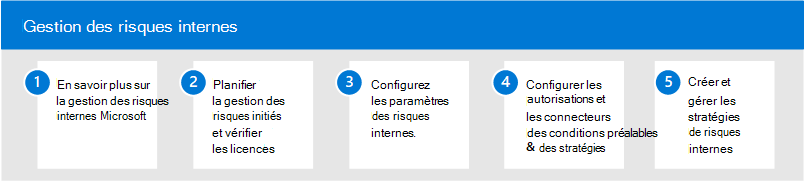

# Gestion des risques internes dans Microsoft 365

De plus en plus, les employés ont plus d’accès pour créer, gérer et partager des données sur un large éventail de plateformes et de services. Dans la plupart des cas, les organisations disposent de ressources et d’outils limités pour identifier et atténuer les risques à l’échelle de l’organisation, tout en respectant les exigences de conformité et les normes de confidentialité des employés. Ces risques peuvent inclure le vol de données par les employés qui quittent l’organisation et les fuites de données d’informations en dehors de votre organisation par un partage accidentel ou une intention malveillante.

La gestion des risques internes dans Microsoft 365 utilise l’ensemble des indicateurs de service et tiers pour vous aider à identifier, trier et agir rapidement sur l’activité des utilisateurs à risque. À l’aide des journaux de Microsoft 365 et Microsoft Graph, la gestion des risques internes vous permet de définir des stratégies spécifiques pour identifier les indicateurs de risque et prendre des mesures pour atténuer ces risques.

## Configurer la gestion des risques internes pour Microsoft 365

Pour configurer la gestion des risques internes pour votre organisation, utilisez les étapes suivantes :

1. En savoir plus [sur la gestion des risques internes](insider-risk-management.md) dans Microsoft 365
2. Planifier la gestion [des risques internes et vérifier les licences](insider-risk-management-plan.md)
3. Configurer les [paramètres de gestion des risques internes](insider-risk-management-settings.md)
4. Configurer les [autorisations et](insider-risk-management-configure.md#step-1-enable-permissions-for-insider-risk-management) les conditions [préalables de stratégie & connecteurs](insider-risk-management-configure.md#step-3-configure-prerequisites-for-templates)
5. Créer et configurer des stratégies [de gestion des risques internes](insider-risk-management-configure.md#step-5-create-an-insider-risk-management-policy)

## Plus d’informations sur la gestion des risques internes

- [Gérer les stratégies de risques internes](insider-risk-management-policies.md)
- [Identifier les alertes de risques internes](insider-risk-management-alerts.md)
- [Agir sur les cas de risques internes](insider-risk-management-cases.md)