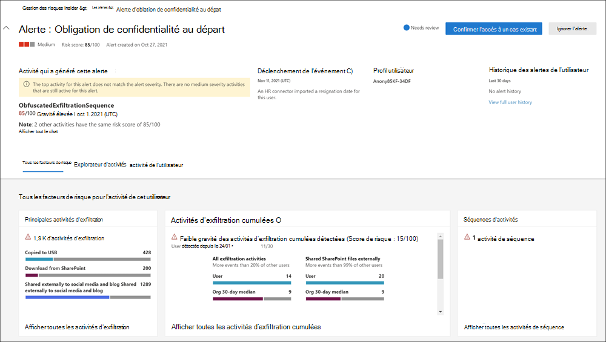
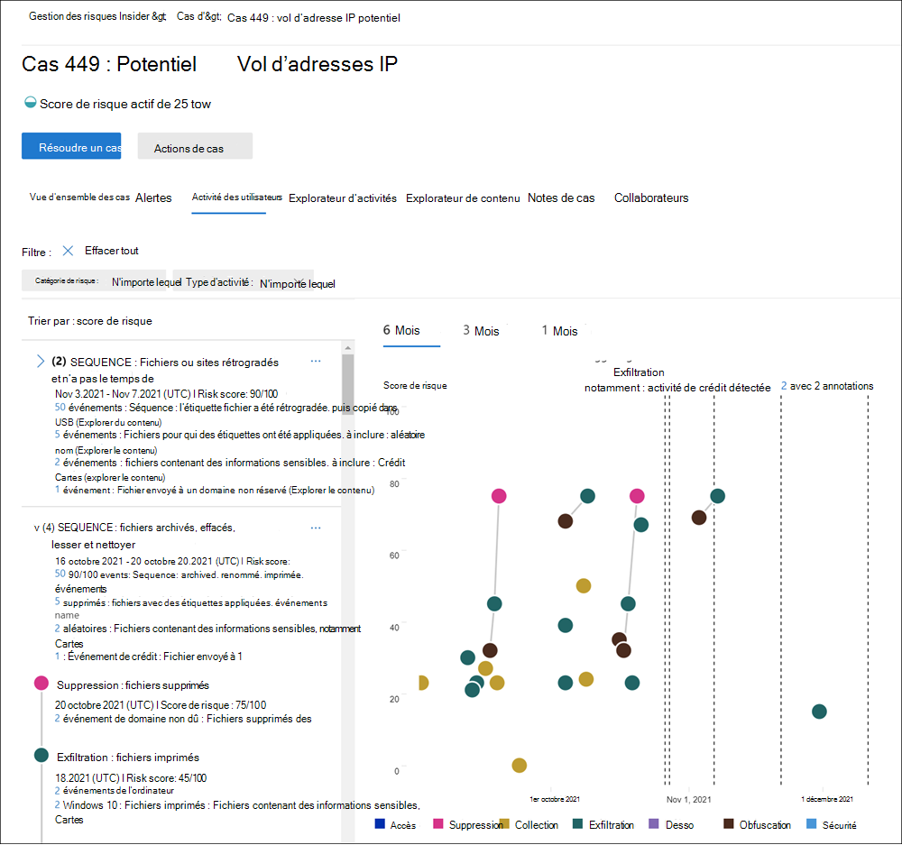

# En savoir plus sur la gestion des risques internes dans Microsoft 365

La gestion des risques internes est une solution de conformité dans Microsoft 365 qui vous permet de minimiser les risques internes en vous permettant de détecter, d’examiner et d’agir sur des activités malveillantes et accidentelles dans votre organisation. Les stratégies de risques internes vous permettent de définir les types de risques à identifier et à détecter dans votre organisation, notamment en agissant sur des cas et en les resserrant à Microsoft Advanced eDiscovery si nécessaire. Les analystes de risque de votre organisation peuvent rapidement prendre les mesures appropriées pour s’assurer que les utilisateurs sont conformes aux normes de conformité de votre organisation.

Regardez les vidéos ci-dessous pour découvrir comment la gestion des risques internes peut aider votre organisation à prévenir, détecter et contenir des risques tout en hiérbant les valeurs, la culture et l’expérience utilisateur de votre organisation :
 
 

**Solution de gestion des risques internes & développement**:
>[!VIDEO https://www.microsoft.com/videoplayer/embed/RE4j9CN]
 

**Flux de travail de gestion des risques internes**:
>[!VIDEO https://www.microsoft.com/videoplayer/embed/RE4OUXB]

## Points de mal à risque modernes

La gestion et la réduction des risques au sein de votre organisation commencent par la compréhension des types de risques présents sur le lieu de travail moderne. Certains risques sont pilotés par des événements externes et des facteurs qui sont en dehors du contrôle direct. D’autres risques sont pilotés par des événements internes et des activités utilisateur qui peuvent être réduites et évitées. Voici quelques exemples de risques liés à des comportements et des actions non autorisés, inappropriés ou non autorisés par les utilisateurs de votre organisation. Ces comportements incluent un large éventail de risques internes de la part des utilisateurs :

- Fuites de données sensibles et fuite de données
- Violations de confidentialité
- Vol de propriété intellectuelle (IP)
- Fraude
- Délit d’initié
- Violations de la conformité avec la réglementation

Les utilisateurs de l’espace de travail moderne ont accès à la création, à la gestion et au partage de données sur un large éventail de plateformes et de services. Dans la plupart des cas, les organisations disposent de ressources et d’outils limités pour identifier et atténuer les risques à l’échelle de l’organisation, tout en respectant les normes de confidentialité des utilisateurs.

La gestion des risques internes utilise l’ensemble des indicateurs de service et tiers pour vous aider à identifier, trier et agir rapidement sur l’activité de risque. À l’aide des journaux de Microsoft 365 et de Microsoft Graph, la gestion des risques internes vous permet de définir des stratégies spécifiques pour identifier les indicateurs de risque. Ces stratégies vous permettent d’identifier les activités à risque et d’agir pour atténuer ces risques.

La gestion des risques internes est centrée sur les principes suivants :

- **Transparence :** trouver un équilibre entre la confidentialité des utilisateurs et les risques de l’organisation avec l’architecture de confidentialité par conception.
- **Configurable :** stratégies configurables basées sur des secteurs d’activité, géographiques et professionnels.
- **Intégré :** flux de travail intégré dans Microsoft 365 solutions de conformité.
- **Actionnable**: fournit des informations pour activer les notifications du réviseur, les investigations de données et les enquêtes utilisateur.

## Identification des risques potentiels avec l’analyse (aperçu)

L’analyse des risques internes vous permet d’effectuer une évaluation des risques internes potentiels au sein de votre organisation sans aucune configuration de stratégie des risques internes. Cette évaluation peut permettre à votre organisation d’identifier des zones potentielles plus élevées de risque utilisateur et vous aider à déterminer le type et l’étendue des stratégies de gestion des risques internes que vous pouvez envisager de configurer. Cette évaluation peut également vous aider à déterminer les besoins en matière de licences supplémentaires ou d’optimisation future des stratégies de risque internes existantes.

Pour en savoir plus sur l’analyse des risques internes, voir [Paramètres de gestion](insider-risk-management-settings.md#analytics-preview)des risques internes : Analyse.

## Flux de travail

Le flux de travail de gestion des risques internes vous permet d’identifier, d’examiner et de prendre des mesures pour résoudre les risques internes au niveau de votre organisation. Avec des modèles de stratégie axés, une signalisation d’activité complète dans le service Microsoft 365 et des outils de gestion des alertes et des cas, vous pouvez utiliser des informations actionnables pour identifier et agir rapidement sur les comportements risqués.

L'identification et la résolution des activités à risque internes et des problèmes de conformité avec la gestion des risques internes dans Microsoft 365 utilise le flux de travail suivant :

### Stratégies

[Les stratégies de gestion](insider-risk-management-policies.md) des risques internes sont créées à l’aide de modèles prédéfin définis et de conditions de stratégie qui définissent les événements déclenchant des événements et des indicateurs de risque examinés dans votre organisation. Ces conditions incluent l’utilisation des indicateurs de risque pour les alertes, les utilisateurs inclus dans la stratégie, les services hiérarchisés et la période de surveillance.

Vous pouvez choisir parmi les modèles de stratégie suivants pour commencer rapidement à gérer les risques internes :

- [Vol de données par des employés quittant votre organisation](insider-risk-management-policies.md#data-theft-by-departing-users)
- [Fuites de données générales](insider-risk-management-policies.md#general-data-leaks)
- [Fuites de données par des utilisateurs prioritaires (aperçu)](insider-risk-management-policies.md#data-leaks-by-priority-users-preview)
- [Fuites de données par des utilisateurs mécontents (préversion)](insider-risk-management-policies.md#data-leaks-by-disgruntled-users-preview)
- [Violations générales de la stratégie de sécurité (préversion)](insider-risk-management-policies.md#general-security-policy-violations-preview)
- [Violations de stratégie de sécurité par des utilisateurs sortants (préversion)](insider-risk-management-policies.md#security-policy-violations-by-departing-users-preview)
- [Violations de la stratégie de sécurité par des utilisateurs prioritaires (préversion)](insider-risk-management-policies.md#security-policy-violations-by-priority-users-preview)
- [Violations de stratégie de sécurité par un utilisateur mécontent (préversion)](insider-risk-management-policies.md#security-policy-violations-by-disgruntled-users-preview)

### Alertes

Les alertes sont automatiquement générées par les indicateurs de risque qui correspondent aux conditions de stratégie et qui sont affichés dans le tableau de bord [Alertes.](insider-risk-management-activities.md#alert-dashboard) Ce tableau de bord autorise un affichage rapide de toutes les alertes nécessitant un examen, des alertes ouvertes au fil du temps et des statistiques des alertes pour votre organisation. Toutes les alertes de stratégie sont affichées avec les informations suivantes pour vous aider à identifier rapidement l’état des alertes existantes et des nouvelles alertes qui ont besoin d’une action :

- Statut
- Severity
- Heure détectée
- Cas
- État de la cas

### Triage

Les nouvelles activités utilisateur qui doivent faire l’objet d’un examen génèrent automatiquement des alertes qui se voit attribuer *l’état De révision des* besoins. Les réviseurs peuvent rapidement identifier et examiner, évaluer et trier ces alertes.

Les alertes sont résolues par l'ouverture d'un nouveau cas, l'affectation de l'alerte à un cas existant ou le rejet de l'alerte. À l’aide des filtres d’alerte, il est facile d’identifier rapidement les alertes par état, gravité ou heure détectée. Dans le cadre du processus de tri, les réviseurs peuvent afficher les détails de l’alerte pour les activités identifiées par la stratégie, afficher l’activité de l’utilisateur associée à la correspondance de stratégie, consulter la gravité de l’alerte et consulter les informations de profil utilisateur.

### Examiner

Examinez rapidement toutes les activités d’un utilisateur sélectionné avec les rapports [d’activité de l’utilisateur (aperçu).](insider-risk-management-activities.md#user-activity-reports-preview) Ces rapports permettent aux enquêteurs de votre organisation d’examiner les activités d’utilisateurs spécifiques pendant une période définie sans avoir à les affecter temporairement ou explicitement à une stratégie de gestion des risques internes. Après avoir examiné les activités d’un utilisateur, les enquêteurs peuvent ignorer les activités individuelles comme étant anodins, partager ou envoyer par courrier électronique un lien vers le rapport avec d’autres enquêteurs, ou choisir d’affecter temporairement ou explicitement l’utilisateur à une stratégie de gestion des risques internes.

[Les cas](insider-risk-management-cases.md) sont créés pour les alertes qui nécessitent un examen et un examen approfondis des détails et des circonstances de l’activité autour de la correspondance de stratégie. La **Tableau de bord des cas** fournit un affichage total de tous les cas actifs, des cas ouverts au fil du temps et des statistiques sur les cas pour votre organisation. Les réviseurs peuvent rapidement filtrer les cas par état, date d’ouverture du cas et date de la dernière mise à jour du cas.

La sélection d’un cas dans le tableau de bord des cas ouvre le cas pour examen et enquête. Cette étape est au cœur du flux de travail de gestion des risques internes. C’est dans ce domaine que les activités de risque, les conditions de stratégie, les détails des alertes et les détails utilisateur sont synthétisés dans une vue intégrée pour les réviseurs. Les principaux outils d’examen dans ce domaine sont :

- **Activité utilisateur**: l’activité de l’utilisateur s’affiche automatiquement dans un graphique interactif qui trace les activités au fil du temps et par niveau de risque pour les activités de risque actuelles ou passées. Les réviseurs peuvent rapidement filtrer et afficher l’historique des risques complet de l’utilisateur et consulter des activités spécifiques pour plus d’informations.
- **Explorateur de contenu**: tous les fichiers de données et messages électroniques associés aux activités d’alerte sont automatiquement capturés et affichés dans l’Explorateur de contenu. Les réviseurs peuvent filtrer et afficher des fichiers et des messages par source de données, type de fichier, balises, conversation et bien d’autres attributs.
- **Notes de cas**: les réviseurs peuvent fournir des notes pour un cas dans la section Notes de cas. Cette liste consolide toutes les notes dans un affichage central et inclut les informations de relecteur et de date d’soumises.

En outre, le nouveau journal [d’audit (prévisualisation)](insider-risk-management-audit-log.md) vous permet de rester informé des actions qui ont été prises sur les fonctionnalités de gestion des risques internes. Cette ressource permet un examen indépendant des actions entreprises par les utilisateurs affectés à un ou plusieurs groupes de rôles de gestion des risques internes.

### Action

Une fois les cas examinés, les réviseurs peuvent agir rapidement pour résoudre le cas ou collaborer avec d’autres parties prenantes à risque dans votre organisation. Si des utilisateurs violent accidentellement ou par inadvertance les conditions de la stratégie, un simple avis de rappel peut être envoyé à l’utilisateur à partir des modèles de notification que vous pouvez personnaliser pour votre organisation. Ces notifications peuvent servir de rappels simples ou peuvent diriger l’utilisateur vers une formation ou des conseils d’actualisation afin d’éviter les comportements à risque futurs. Pour plus d’informations, voir [Modèles de notifications sur la gestion des risques internes](insider-risk-management-notices.md).

Dans les situations les plus graves, vous devrez peut-être partager les informations sur les cas de gestion des risques internes avec d’autres réviseurs ou services de votre organisation. La gestion des risques internes est étroitement intégrée aux autres solutions de conformité Microsoft 365 pour vous aider à résoudre les risques de bout en bout.

- **Advanced eDiscovery**: la escalade d’un cas d’enquête vous permet de transférer des données et la gestion du cas à Advanced eDiscovery dans Microsoft 365. Advanced eDiscovery fournit un flux de travail intégral pour préserver, collecter, examiner, analyser et exporter du contenu adapté aux examens internes et externes de votre organisation. Il permet aux équipes juridiques de gérer l’ensemble du flux de travail de notification de conservation légale. Pour en savoir plus sur les cas Advanced eDiscovery, consultez [Présentation de Advanced eDiscovery dans Microsoft 365](overview-ediscovery-20.md).
- Office 365'intégration des API de gestion **(prévisualisation)**: la gestion des risques internes prend en charge l’exportation des informations d’alerte vers les services de gestion des événements et des informations de sécurité (SIEM) via les API de gestion Office 365. Le fait d’avoir accès aux informations d’alerte dans la plateforme la mieux adaptée aux processus de risque de votre organisation vous offre plus de flexibilité dans la façon d’agir sur les activités à risque. Pour en savoir plus sur l’exportation des informations d’alerte avec Office 365 API de gestion des données, voir [Exporter les alertes.](insider-risk-management-settings.md#export-alerts-preview)

> [!NOTE]
> Merci de vos commentaires et de votre support pendant la prévisualisation du connecteur ServiceNow. Nous avons décidé de mettre fin à la prévisualisation du connecteur ServiceNow et de cesser de prendre en charge la gestion des risques internes le 30 novembre 2020. Nous évaluons activement d’autres méthodes pour fournir aux clients l’intégration de ServiceNow dans la gestion des risques internes.

## Scénarios

La gestion des risques internes peut vous aider à détecter, examiner et prendre des mesures pour atténuer les risques internes dans votre organisation dans plusieurs scénarios courants :

### Vol de données par des employés quittant votre organisation

Lorsque des utilisateurs quittent une organisation, volontairement ou à la suite d’un arrêt, il existe souvent des préoccupations légitimes concernant les données de l’entreprise, des clients et des utilisateurs. Les utilisateurs peuvent supposer que les données de projet ne sont pas propriétaires, ou ils peuvent être tentés de prendre des données d’entreprise à des titres personnels et en violation de la politique de l’entreprise et des normes légales. Les stratégies de  gestion des risques internes qui utilisent le vol de données par les utilisateurs qui quittent le modèle de stratégie détectent automatiquement les activités généralement associées à ce type de vol. Avec cette stratégie, vous recevrez automatiquement des alertes pour les activités suspectes associées au vol de données par des utilisateurs qui quittent l’application afin de pouvoir prendre les mesures d’investigation appropriées. La configuration [d’Microsoft 365 rh pour](import-hr-data.md) votre organisation est requise pour ce modèle de stratégie.

### Fuite intentionnelle ou involontaire d’informations sensibles ou confidentielles

Dans la plupart des cas, les utilisateurs font de leur mieux pour gérer correctement les informations sensibles ou confidentielles. Toutefois, les utilisateurs peuvent parfois faire des erreurs et des informations sont accidentellement partagées en dehors de votre organisation ou en violation de vos stratégies de protection des informations. Dans d’autres cas, les utilisateurs peuvent intentionnellement fuiter ou partager des informations sensibles et confidentielles à des fins malveillantes et pour un gain personnel potentiel. Les stratégies de gestion des risques internes créées à l’aide des modèles de stratégie de fuite de données suivants détectent automatiquement les activités généralement associées au partage d’informations sensibles ou confidentielles :

- [Fuites de données générales](insider-risk-management-policies.md#general-data-leaks)
- [Fuites de données par des utilisateurs prioritaires (aperçu)](insider-risk-management-policies.md#data-leaks-by-priority-users-preview)
- [Fuites de données par des utilisateurs mécontents (préversion)](insider-risk-management-policies.md#data-leaks-by-disgruntled-users-preview)

## Violations intentionnelles ou involontaires de la stratégie de sécurité (aperçu)

Les utilisateurs ont généralement un grand degré de contrôle lors de la gestion de leurs appareils dans l’espace de travail moderne. Ce contrôle peut inclure des autorisations d’installation ou de désinstallation des applications nécessaires pour l’exécution de leurs tâches ou la possibilité de désactiver temporairement les fonctionnalités de sécurité des appareils. Que cette activité soit accidentelle, accidentelle ou malveillante, cette conduite peut poser un risque pour votre organisation et il est important d’identifier et de réduire les risques. Pour faciliter l’identité de ces activités de sécurité risquées, les modèles suivants de violation de la stratégie de sécurité de gestion des risques internes marquent les indicateurs de risque de sécurité et utilisent les alertes microsoft Defender pour les points de terminaison pour fournir des informations sur les activités liées à la sécurité :

- [Violations générales de la stratégie de sécurité (préversion)](insider-risk-management-policies.md#general-security-policy-violations-preview)
- [Violations de stratégie de sécurité par des utilisateurs sortants (préversion)](insider-risk-management-policies.md#security-policy-violations-by-departing-users-preview)
- [Violations de la stratégie de sécurité par des utilisateurs prioritaires (préversion)](insider-risk-management-policies.md#security-policy-violations-by-priority-users-preview)
- [Violations de stratégie de sécurité par un utilisateur mécontent (préversion)](insider-risk-management-policies.md#security-policy-violations-by-disgruntled-users-preview)

## Stratégies pour les utilisateurs en fonction de la position, du niveau d’accès ou de l’historique des risques (aperçu)

Les utilisateurs de votre organisation peuvent avoir différents niveaux de risque en fonction de leur position, du niveau d’accès aux informations sensibles ou de l’historique des risques. Cette structure peut inclure des membres de l’équipe de direction de votre organisation, des administrateurs informatiques qui ont des données étendues et des privilèges d’accès réseau, ou des utilisateurs ayant un passé d’activités risquées. Dans ces circonstances, une inspection plus approfondie et un score de risque plus agressif sont importants pour permettre l’examen des alertes et une action rapide. Pour identifier les activités à risque pour ces types d’utilisateurs, vous pouvez créer des groupes d’utilisateurs prioritaires et créer des stratégies à partir des modèles de stratégie suivants :

- [Violations de la stratégie de sécurité par des utilisateurs prioritaires (préversion)](insider-risk-management-policies.md#security-policy-violations-by-priority-users-preview)
- [Fuites de données par des utilisateurs prioritaires (aperçu)](insider-risk-management-policies.md#data-leaks-by-priority-users-preview)

## Actions et comportements des utilisateurs non résusés (aperçu)

Les événements liés à l’emploi peuvent avoir un impact sur le comportement des utilisateurs de plusieurs manières liées aux risques internes. Ces stresseurs peuvent être un examen des performances médiocres, une rétrogradation de position ou l’utilisateur en cours de placement dans un plan d’évaluation des performances. Bien que la plupart des utilisateurs ne répondent pas de manière malveillante à ces événements, le stress de ces actions peut entraîner l’intervention de certains utilisateurs qu’ils ne prennent normalement pas en compte dans des circonstances normales. Pour faciliter l’identité de ces types d’activités risquées, les modèles de stratégie de gestion des risques internes suivants utilisent le connecteur rh Microsoft 365 et démarrent l’évaluation des indicateurs de risque relatifs aux comportements qui peuvent se produire à proximité d’événements de contrainte d’emploi :

- [Fuites de données par des utilisateurs mécontents (préversion)](insider-risk-management-policies.md#data-leaks-by-disgruntled-users-preview)
- [Violations de stratégie de sécurité par un utilisateur mécontent (préversion)](insider-risk-management-policies.md#security-policy-violations-by-disgruntled-users-preview)

## Vous êtes prêt ?

- Voir [Planifier la gestion des risques internes](insider-risk-management-plan.md) pour vous préparer à activer les stratégies de gestion des risques internes dans votre organisation.
- Consultez [La prise en charge des paramètres de gestion](insider-risk-management-settings.md) des risques internes pour configurer les paramètres globaux des stratégies de risque internes.
- Consultez [La prise en charge de la gestion](insider-risk-management-configure.md) des risques internes pour configurer les conditions préalables, créer des stratégies et commencer à recevoir des alertes.
