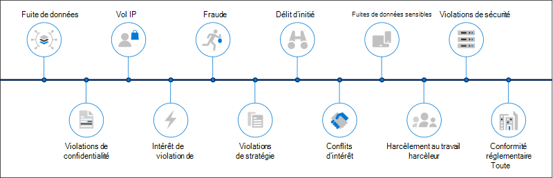
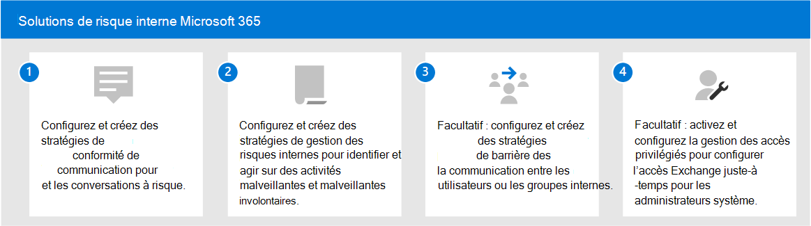

# Solutions de risque interne dans Microsoft 365

Les risques internes sont l’une des principales préoccupations des professionnels de la sécurité et de la conformité dans l’espace de travail moderne. Des études du secteur ont montré que les risques internes sont souvent associés à des événements ou des activités utilisateur spécifiques. La protection de votre organisation contre ces risques peut être difficile à identifier et difficile à atténuer. Les risques internes incluent des vulnérabilités dans différents domaines et peuvent entraîner des problèmes majeurs pour votre organisation, allant de la perte de propriété intellectuelle au harcèlement en lieu de travail, et bien plus encore. La figure suivante décrit les risques internes courants :

Microsoft 365 fonctionnalités de prévention des risques sont conçues et intégrées à nos solutions et produits à risque internes. Ces solutions fonctionnent ensemble et utilisent des indicateurs de service avancés et tiers pour vous aider à identifier, trier et agir rapidement sur l’activité de risque. La plupart des solutions offrent un flux de travail complet de détection, d’alerte et de correction que vos analystes et enquêteurs de données peuvent utiliser pour agir rapidement et réduire ces risques.

| Icône Risque | Risques | Conformité des communications | Gestion des risques internes | Obstacles aux informations | Gestion des accès privilégiés |
| :---- | :-------- | :--------------------------- | :-------------------------- |:-------------------------| :--------------------------------|
| | Débordement de données |  |  |  |  |
| | Violations de confidentialité |  |  |  |  |
| | Vol d’ADRESSE IP |  |  |  |  |
| | Violence sur le lieu de travail |  |  |  |  |
| | Fraude |  |  |  |  |
| | Violations de stratégie |  |  |  |  |
| | Délit d’initié |  |  |  |  |
| | Conflits d’intérêt |  |  |  |  |
| | Fuites de données sensibles |  |  |  |  |
| | Harcèlement au travail |  |  |  |  |
| | Violations de sécurité |  |  |  |  |
| | Violations de la conformité avec la réglementation |  |  |  |  |

## Solutions de risque interne Microsoft 365

Pour protéger votre organisation contre les risques internes, utilisez Microsoft 365 fonctionnalités et fonctionnalités.

### Conformité des communications

La conformité des communications vous permet de réduire les risques de communication en vous aidant à détecter, capturer et agir sur des messages inappropriés dans votre organisation. La conformité des communications est disponible dans les abonnements suivants :

- Microsoft 365 E5 abonnement (version payante ou d’essai)
- Microsoft 365 E3 abonnement + le module Microsoft 365 E5 Conformité’abonnement
- Microsoft 365 E3 abonnement + le module Microsoft 365 E5 gestion des risques internes
- Microsoft 365 A5 abonnement (version payante ou d’essai)
- Microsoft 365 A3 abonnement + le module Microsoft 365 A5 conformité de l’application
- Microsoft 365 A3 abonnement + le module Microsoft 365 A5 gestion des risques internes
- Microsoft 365 Abonnement G5 (version payante ou d’essai)
- Microsoft 365 Abonnement G5 + module Microsoft 365 conformité G5
- Microsoft 365 Abonnement G5 + module Microsoft 365 G5 Gestion des risques internes
- Office 365 Entreprise Abonnement E5 (version payante ou d’essai)
- Office 365 A5 abonnement (version payante ou d’essai)
- Abonnement Office 365 Entreprise E3 + module complémentaire de Conformité avancée Office 365 (désormais indisponible pour les nouveaux abonnements)

### Gestion des risques internes

La gestion des risques internes permet de réduire les risques internes en vous permettant de détecter, d’examiner et d’agir sur des activités malveillantes et accidentelles dans votre organisation.

La gestion des risques internes est disponible dans les abonnements suivants :

- Microsoft 365 E5 abonnement (version payante ou d’essai)
- Microsoft 365 E3 abonnement + le module Microsoft 365 E5 Conformité’abonnement
- Microsoft 365 E3 abonnement + le module Microsoft 365 E5 gestion des risques internes
- Microsoft 365 A5 abonnement (version payante ou d’essai)
- Microsoft 365 A3 abonnement + le module Microsoft 365 A5 conformité de l’application
- Microsoft 365 A3 abonnement + le module Microsoft 365 A5 gestion des risques internes
- Microsoft 365 Abonnement G5 (version payante ou d’essai)
- Microsoft 365 G3 abonnement + le module Microsoft 365 conformité G5
- Microsoft 365 G3 abonnement + le module Microsoft 365 gestion des risques internes G5
- Office 365 E3 abonnement + Enterprise Mobility and Security E3 + le module Microsoft 365 E5 Conformité module

### Obstacles aux informations

Les obstacles à l’information vous permettent de restreindre la communication et la collaboration entre deux groupes internes afin d’éviter tout conflit d’intérêt dans votre organisation.

Les obstacles aux informations sont disponibles dans les abonnements suivants :

- Microsoft 365 E5 abonnement (version payante ou d’essai)
- Microsoft 365 A5 abonnement (version payante ou d’essai)
- Office 365 Entreprise Abonnement E5 (version payante ou d’essai)
- Office 365 A5 abonnement (version payante ou d’essai)
- Conformité avancée Office 365 module module (non disponible pour les nouveaux abonnements)
- Microsoft 365 E3 abonnement + le module Microsoft 365 E5 Conformité’abonnement
- Microsoft 365 E3 abonnement + le module Microsoft 365 E5 gestion des risques internes
- Microsoft 365 A3 abonnement + le module Microsoft 365 A5 conformité de l’application
- Microsoft 365 A3 abonnement + le module Microsoft 365 A5 gestion des risques internes

### Gestion des accès privilégiés

La gestion des accès privilégiés permet un contrôle d’accès granulaire sur les tâches Exchange Online administrateur privilégiés dans Office 365. Elle peut faciliter la protection de votre organisation contre des violations utilisant les comptes d’administration privilégiés existants avec un accès permanent aux données sensibles ou un accès aux paramètres de configuration critiques.

La gestion des accès privilégiés est disponible dans les abonnements suivants :

- Microsoft 365 E5 abonnement (version payante ou d’essai)
- Microsoft 365 A5 abonnement (version payante ou d’essai)
- Office 365 Entreprise Abonnement E5 (version payante ou d’essai)
- Office 365 A5 abonnement (version payante ou d’essai)
- Microsoft 365 E3 abonnement + le module Microsoft 365 E5 Conformité’abonnement
- Microsoft 365 E3 abonnement + le module complémentaire Microsoft 365 E5 Protection des informations et gouvernance des informations
- Microsoft 365 A3 abonnement + le module Microsoft 365 A5 conformité de l’application
- Microsoft 365 A3 abonnement + le module complémentaire Microsoft 365 A5 Protection des informations et gouvernance des informations

## Déployer des solutions Microsoft 365 risques internes

Pour protéger votre organisation contre les risques internes, définissez et déployez les solutions Microsoft 365 suivantes :

1. Configurer et créer des stratégies [de conformité des communications.](communication-compliance-solution-overview.md)
2. Configurer et créer des [stratégies de gestion des risques internes.](insider-risk-management-solution-overview.md)
3. Facultatif : configurer et créer des stratégies [d’obstacle aux informations.](information-barriers-solution-overview.md)
4. Facultatif : activez et configurez la [gestion des accès privilégiés.](privileged-access-management-solution-overview.md)

## Illustrations avec exemples

Pour vous aider à planifier une stratégie intégrée pour l’Microsoft 365 fonctionnalités de risques internes, téléchargez l’ensemble des fonctionnalités de *protection* des informations Microsoft 365 et de conformité. Pour les fonctionnalités de risque internes, consultez les pages d’illustration de l’architecture 5 à 7. N’hésitez pas à les adapter à votre usage personnel.

| Élément | Description |
|:-----|:------------|
|   [Télécharger au format PDF](https://download.microsoft.com/download/3/a/6/3a6ab1a3-feb0-4ee2-8e77-62415a772e53/m365-compliance-illustrations.pdf)  \| [Télécharger en tant que Visio](https://download.microsoft.com/download/3/a/6/3a6ab1a3-feb0-4ee2-8e77-62415a772e53/m365-compliance-illustrations.vsdx)   Mise à jour : octobre 2020|Inclus : <ul><li>  Protection des informations et protection contre la perte de données Microsoft</li><li>Stratégies de rétention et étiquettes de rétention </li><li>Obstacles aux informations</li><li>Conformité des communications</li><li>Gestion des risques internes</li><li>Réception de données tierces</li>|

## Formation

Former vos administrateurs et votre équipe de conformité aux principes de base de chaque solution à risque interne peut aider votre organisation à démarrer plus rapidement avec vos efforts de déploiement et d’implémentation. 

Microsoft 365 fournit les ressources suivantes pour aider à informer et à former ces utilisateurs dans votre organisation :

| Solution/zone | Ressources |
|:------------------|:--------------|
| Gérer les risques internes dans Microsoft 365 |[Parcours d’apprentissage complet](/learn/paths/m365-compliance-insider)   Ce parcours d’apprentissage inclut tous les modules de solution individuels pour la conformité des communications, la gestion des risques internes, les obstacles à l’information et la gestion des accès privilégiés. Sélectionnez ce parcours d’apprentissage pour terminer tous les modules. |
| Conformité des communications | [Learning module : préparer la conformité des communications dans Microsoft 365](/learn/modules/m365-compliance-insider-prepare-communication-compliance)   Ce module vous aide à découvrir les bases sur la façon d’identifier et de corriger les violations de stratégie de code de conduite avec la conformité des communications, de couvrir les conditions préalables requises avant de créer des stratégies de conformité des communications et d’en savoir plus sur les types de modèles de stratégie prédéfinits intégrés dans la conformité des communications. |
| Gestion des risques internes | [Learning module : gestion des risques internes dans Microsoft 365](/learn/modules/m365-compliance-insider-manage-insider-risk)   Ce module vous aide à découvrir comment la gestion des risques internes dans Microsoft 365 peut vous aider à prévenir, détecter et contenir des risques internes dans une organisation, à en savoir plus sur les types de modèles de stratégie prédéfinits intégrés, à comprendre les conditions préalables de base nécessaires avant de créer des stratégies de risque internes et à expliquer les types d’actions que vous pouvez prendre sur les cas de gestion des risques internes. |
| Obstacles aux informations | [Learning module : planifier les obstacles à l’information](/learn/modules/m365-compliance-insider-plan-information-barriers)   Ce module vous aide à découvrir comment les stratégies d’obstacle à l’information peuvent aider votre organisation à maintenir la conformité avec les normes et réglementations du secteur pertinentes, répertorie les types de situations dans lesquelles des obstacles à l’information seraient applicables, explique le processus de création d’une stratégie d’obstacle à l’information et explique comment résoudre les problèmes inattendus une fois les obstacles à l’information en place. |
| Gestion des accès privilégiés | [Learning module : implémenter la gestion des accès privilégiés](/learn/modules/m365-compliance-insider-implement-privileged-access-management)   Ce module vous aide à comprendre la différence entre la gestion des accès privilégiés et la gestion des identités privilégiées, à comprendre le flux de processus de gestion des accès privilégiés et à comprendre les principes de base de la configuration et de l’utilisation de la gestion des accès privilégiés. |
