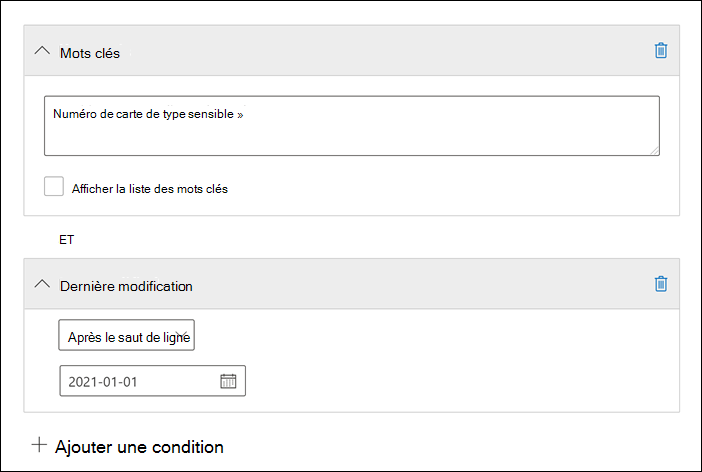

# <a name="keyword-queries-and-search-conditions-for-ediscovery"></a>Requêtes de mots clés et conditions de recherche pour eDiscovery

[!include[Purview banner](../includes/purview-rebrand-banner.md)]

Cet article décrit les propriétés de l’e-mail et du document que vous pouvez rechercher dans les éléments de messagerie et les conversations Microsoft Teams dans Exchange Online, ainsi que les documents stockés sur des sites SharePoint et OneDrive Entreprise à l’aide des outils de recherche eDiscovery dans le portail de conformité Microsoft Purview. Cela inclut la recherche de contenu, Microsoft Purview eDiscovery (Standard) et Microsoft Purview eDiscovery (Premium) (les recherches eDiscovery dans eDiscovery (Premium) sont appelées *collections*). Vous pouvez également utiliser les **\*** applets de commande -ComplianceSearch dans security & Compliance Center PowerShell pour rechercher ces propriétés. L’article décrit également les éléments suivants :

- Utilisation d’opérateurs de recherche booléens, de conditions de recherche et d’autres techniques de requête de recherche pour affiner vos résultats de recherche.
- Recherche de types de données sensibles et de types de données sensibles personnalisés dans SharePoint et OneDrive Entreprise.
- Recherche de contenu de site partagé avec des utilisateurs extérieurs à votre organisation

Pour obtenir des instructions pas à pas sur la création de différentes recherches eDiscovery, consultez :

- [Recherche de contenu](content-search.md)
- [Rechercher du contenu dans eDiscovery (Standard)](search-for-content-in-core-ediscovery.md)
- [Créer un brouillon de collection dans eDiscovery (Premium)](create-draft-collection.md)

> [!NOTE]
> Les recherches eDiscovery dans le portail de conformité et les applets de commande **-ComplianceSearch correspondantes\*** dans le Centre de sécurité & conformité PowerShell utilisent le langage de requête de mot clé (KQL). Pour plus d’informations, consultez la [référence de syntaxe du langage de requête de mot clé](/sharepoint/dev/general-development/keyword-query-language-kql-syntax-reference).

## <a name="searchable-email-properties"></a>Propriétés de messagerie utilisables dans une requête

Le tableau suivant répertorie les propriétés des messages électroniques qui peuvent être recherchées à l’aide des outils de recherche eDiscovery dans le portail de conformité ou à l’aide de l’applet de commande **New-ComplianceSearch** ou **Set-ComplianceSearch** . Il inclut un exemple de syntaxe  _property:value_ pour chaque propriété et une description des résultats de recherche renvoyés par ces exemples. Vous pouvez taper ces  `property:value` paires dans la zone mots clés pour une recherche eDiscovery.

> [!NOTE]
> Lors de la recherche de propriétés d’e-mail, il n’est pas possible de rechercher des éléments dans lesquels la propriété spécifiée est vide ou vide. Par exemple, l’utilisation de la paire *property:value* de **subject: »** pour rechercher des messages électroniques avec une ligne d’objet vide renvoie zéro résultat. Cela s’applique également lors de la recherche de propriétés de site et de contact.

|Propriété|Description de la propriété|Exemples|Résultats de recherche renvoyés par les exemples|
|---|---|---|---|
|AttachmentNames|Nom des fichiers joints à un message électronique.|`attachmentnames:annualreport.ppt` <p> `attachmentnames:annual*` <br/> `attachmentnames:.pptx`|Messages comportant un fichier joint nommé annualreport.ppt. Dans le deuxième exemple, l’utilisation du caractère générique ( * ) retourne les messages avec le mot « annuel » dans le nom de fichier d’une pièce jointe. Le troisième exemple retourne toutes les pièces jointes avec l’extension de fichier pptx.|
|Cci|Champ Cci d’un e-mail. <sup>1</sup>|`bcc:pilarp@contoso.com` <p> `bcc:pilarp` <p> `bcc:"Pilar Pinilla"`|Tous les exemples renvoient des messages dont « Pilar Pinilla » est en copie carbone invisible.|
|Category|Catégories à rechercher. Les catégories peuvent être définies par les utilisateurs à l’aide de Outlook ou Outlook sur le web (anciennement Outlook Web App). Les valeurs possibles sont les suivantes : <ul><li>blue<li>green<li>orange<li>purple<li>red<li>yellow</li></ul>|`category:"Red Category"`|Messages auxquels a été attribuée la catégorie « red » dans les boîtes aux lettres source.|
|Cc|Champ Cc d’un e-mail. <sup>1</sup>|`cc:pilarp@contoso.com` <p> `cc:"Pilar Pinilla"`|Dans les deux exemples, les messages avec Pilar Pinilla spécifiés dans le champ Cc.|
|Folderid|ID de dossier (GUID) d’un dossier de boîte aux lettres spécifique. Si vous utilisez cette propriété, veillez à rechercher dans la boîte aux lettres dans laquelle se trouve le dossier spécifié. Seul le dossier spécifié est recherché. Les sous-dossiers du dossier ne sont pas recherchés. Pour rechercher des sous-dossiers, vous devez utiliser la propriété Folderid pour le sous-dossier que vous souhaitez rechercher. <p> Pour plus d’informations sur la recherche de la propriété Folderid et l’utilisation d’un script pour obtenir les ID de dossier pour une boîte aux lettres spécifique, consultez [Utiliser la recherche de contenu pour les collections ciblées](use-content-search-for-targeted-collections.md).|`folderid:4D6DD7F943C29041A65787E30F02AD1F00000000013A0000` <p> `folderid:2370FB455F82FC44BE31397F47B632A70000000001160000 AND participants:garthf@contoso.com`|Le premier exemple retourne tous les éléments du dossier de boîte aux lettres spécifié. Le deuxième exemple retourne tous les éléments du dossier de boîte aux lettres spécifié qui ont été envoyés ou reçus par garthf@contoso.com.|
|From|Expéditeur d'un message électronique.<sup>1</sup>|`from:pilarp@contoso.com` <p> `from:contoso.com`|Messages envoyés par l'utilisateur indiqué ou à partir d'un domaine spécifié.|
|HasAttachment|Indique si un message a une pièce jointe. Utilisez les valeurs **true** ou **false**.|`from:pilar@contoso.com AND hasattachment:true`|Messages envoyés par l’utilisateur spécifié qui a des pièces jointes.|
|Importance|Importance d'un message électronique, que l'expéditeur peut préciser lors de l'envoi. Par défaut, les messages sont envoyés avec une importance normale, à moins que l'expéditeur préfère une importance **haute** ou **faible**.  |`importance:high` <p> `importance:medium` <p> `importance:low`|Messages marqués comme ayant une importance haute, normale ou faible.|
|IsRead|Indique si les messages ont été lus. Utilisez les valeurs **true** ou **false**.|`isread:true` <p> `isread:false`|Le premier exemple retourne des messages avec la propriété IsRead définie sur **True**. Le deuxième exemple retourne des messages avec la propriété IsRead définie sur **False**.|
|ItemClass|Utilisez cette propriété pour rechercher des types de données tiers spécifiques que votre organisation a importés dans Office 365. Utilisez la syntaxe suivante pour cette propriété :  `itemclass:ipm.externaldata.<third-party data type>*`|`itemclass:ipm.externaldata.Facebook* AND subject:contoso` <p> `itemclass:ipm.externaldata.Twitter* AND from:"Ann Beebe" AND "Northwind Traders"`|Le premier exemple retourne des éléments Facebook qui contiennent le mot « contoso » dans la propriété Subject. Le deuxième exemple renvoie des éléments Twitter qui ont été publiés par Ann Beebe et qui contiennent l’expression clé « Northwind Traders ». <p> Pour obtenir la liste complète des valeurs à utiliser pour les types de données tiers pour la propriété ItemClass, consultez [Utiliser la recherche de contenu pour rechercher des données tierces importées dans Office 365](use-content-search-to-search-third-party-data-that-was-imported.md).|
|Kind|Type de message électronique à rechercher. Valeurs possibles : <p>  contacts <p>  docs <p>  email <p>  Externaldata <p>  faxes <p>  im <p>  journals <p>  meetings <p>  microsoftteams (retourne des éléments à partir de conversations, de réunions et d’appels dans Microsoft Teams) <p>  notes <p>  posts <p>  rssfeeds <p>  tasks <p>  voicemail|`kind:email` <p> `kind:email OR kind:im OR kind:voicemail` <p> `kind:externaldata`|Le premier exemple retourne des messages électroniques qui répondent aux critères de recherche. Le deuxième exemple renvoie des messages électroniques, des conversations par messagerie instantanée (y compris des conversations Skype Entreprise et des conversations dans Microsoft Teams) et des messages vocaux qui répondent aux critères de recherche. Le troisième exemple retourne des éléments qui ont été importés dans des boîtes aux lettres dans Microsoft 365 à partir de sources de données tierces, telles que Twitter, Facebook et Cisco Jabber, qui répondent aux critères de recherche. Pour plus d’informations, consultez [Archivage des données tierces dans Office 365](https://www.microsoft.com/?ref=go).|
|Participants|Tous les champs de personnes dans un e-mail. Ces champs sont From, To, Cc et Bcc.1<sup></sup>|`participants:garthf@contoso.com` <p> `participants:contoso.com`|Messages envoyés par ou envoyés à garthf@contoso.com. Le deuxième exemple renvoie tous les messages envoyés par ou envoyés à un utilisateur dans le domaine contoso.com.|
|Received|Date à laquelle un message électronique a été reçu par un destinataire.|`received:2021-04-15` <p> `received>=2021-01-01 AND received<=2021-03-31`|Messages reçus le 15 avril 2021. Le deuxième exemple retourne tous les messages reçus entre le 1er janvier 2021 et le 31 mars 2021.|
|Destinataires|Tous les champs du destinataire dans un e-mail. Ces champs sont To, Cc et <sup>Cci.1</sup>|`recipients:garthf@contoso.com` <p> `recipients:contoso.com`|Messages envoyés à garthf@contoso.com. Le deuxième exemple renvoie les messages envoyés à tous les destinataires dans le domaine contoso.com.|
|Sent|Date à laquelle un message électronique a été envoyé par l'expéditeur.|`sent:2021-07-01` <p> `sent>=2021-06-01 AND sent<=2021-07-01`|Messages envoyés à la date indiquée ou entre les dates spécifiées.|
|Size|Taille d'un élément, en octets.|`size>26214400` <p> `size:1..1048567`|Messages dont la taille est supérieure à 25 Mo. Le deuxième exemple renvoie les messages dont la taille est comprise entre 1 et 1 048 567 octets (1 Mo).|
|Subject|Texte de la ligne d'objet d'un message électronique. <p> **Note:** Lorsque vous utilisez la propriété Subject dans une requête, la recherche retourne tous les messages dans lesquels la ligne d’objet contient le texte que vous recherchez. En d’autres termes, la requête ne retourne pas uniquement les messages qui ont une correspondance exacte. Par exemple, si vous recherchez  `subject:"Quarterly Financials"`, vos résultats incluent des messages portant l’objet « Financière trimestrielle 2018 ».|`subject:"Quarterly Financials"` <p> `subject:northwind`|Messages qui contiennent l’expression « Financials trimestriels » n’importe où dans le texte de la ligne d’objet. Le deuxième exemple renvoie tous les messages contenant le mot « northwind » dans la ligne d'objet.|
|To|Champ À d'un message électronique.<sup>1</sup>|`to:annb@contoso.com` <p> `to:annb ` <br/> `to:"Ann Beebe"`|Tous les exemples renvoient les messages dans lesquels « Ann Beebe » est indiqué sur la ligne À.|

> [!NOTE]
> <sup>1</sup> Pour la valeur d’une propriété de destinataire, vous pouvez utiliser l’adresse e-mail (également appelée *nom d’utilisateur principal* ou UPN), le nom d’affichage ou l’alias pour spécifier un utilisateur. Par exemple, vous pouvez utiliser annb@contoso.com, annb ou « Ann Beebe » pour spécifier l'utilisateur Ann Beebe.

### <a name="recipient-expansion"></a>Extension du destinataire

Lors de la recherche d’une des propriétés du destinataire (From, To, Cc, Cci, Participants et Recipients), Microsoft 365 tente d’étendre l’identité de chaque utilisateur en les recherchant dans Azure Active Directory (Azure AD).  Si l’utilisateur se trouve dans Azure AD, la requête est développée pour inclure l’adresse e-mail de l’utilisateur (ou UPN), l’alias, le nom d’affichage et LegacyExchangeDN. Par exemple, une requête telle que `participants:ronnie@contoso.com` « expands » prend la valeur `participants:ronnie@contoso.com OR participants:ronnie OR participants:"Ronald Nelson" OR participants:"<LegacyExchangeDN>"`.

Pour empêcher l’expansion du destinataire, ajoutez un caractère générique (astérisque) à la fin de l’adresse e-mail et utilisez un nom de domaine réduit; Par exemple, `participants:"ronnie@contoso*"` veillez à entourer l’adresse e-mail de guillemets doubles.

Toutefois, n’oubliez pas que la prévention de l’expansion du destinataire dans la requête de recherche peut entraîner le non-retour d’éléments pertinents dans les résultats de la recherche. Les messages électroniques dans Exchange peuvent être enregistrés avec différents formats de texte dans les champs du destinataire. L’extension du destinataire est destinée à atténuer ce fait en retournant des messages qui peuvent contenir différents formats de texte. Par conséquent, la prévention de l’expansion du destinataire peut empêcher la requête de recherche de renvoyer tous les éléments susceptibles d’être pertinents pour votre investigation.

> [!NOTE]
> Si vous devez examiner ou réduire les éléments retournés par une requête de recherche en raison de l’extension du destinataire, envisagez d’utiliser eDiscovery (Premium). Vous pouvez rechercher des messages (en tirant parti de l’extension du destinataire), les ajouter à un ensemble de révisions, puis utiliser des requêtes ou des filtres de jeu de révision pour examiner ou affiner les résultats. Pour plus d’informations, consultez [Collecter des données pour un cas](collecting-data-for-ediscovery.md) et [interroger les données dans un jeu de révision](review-set-search.md).

## <a name="searchable-site-properties"></a>Propriétés de site utilisables dans une requête

Le tableau suivant répertorie certaines des propriétés SharePoint et OneDrive Entreprise qui peuvent être recherchées à l’aide des outils de recherche eDiscovery dans le portail de conformité Microsoft Purview ou à l’aide de l’applet de commande **New-ComplianceSearch** ou **Set-ComplianceSearch**. Il inclut un exemple de syntaxe  _property:value_ pour chaque propriété et une description des résultats de recherche renvoyés par ces exemples.

Pour obtenir la liste complète des propriétés SharePoint qui peuvent être recherchées, consultez [Vue d’ensemble des propriétés analysées et gérées dans SharePoint](/SharePoint/technical-reference/crawled-and-managed-properties-overview). Les propriétés marquées d’un **oui** dans la colonne **Queryable** peuvent être recherchées.

|Propriété|Description de la propriété|Exemple|Résultats de recherche renvoyés par les exemples|
|---|---|---|---|
|Auteur|Champ Auteur des documents Office (subsiste si un document est copié). Par exemple, si un utilisateur crée un document et qu’il l’envoie par e-mail à quelqu’un d’autre qui le charge ensuite dans SharePoint, le document conserve l’auteur d’origine. Veillez à utiliser le nom complet de l’utilisateur pour cette propriété.|`author:"Garth Fort"`|Tous les documents créés par Garth Fort.|
|ContentType|Le SharePoint type de contenu d’un élément, tel qu’Élément, Document ou Vidéo.|`contenttype:document`|Tous les documents sont renvoyés.|
|Created|Date de création d’un élément.|`created>=2021-06-01`|Tous les éléments créés le 1er juin 2021 ou après.|
|CreatedBy|Personne qui a créé ou chargé un élément. Veillez à utiliser le nom complet de l’utilisateur pour cette propriété.|`createdby:"Garth Fort"`|Tous les éléments créés ou chargés par Garth Fort.|
|DetectedLanguage|Langue d’un élément.|`detectedlanguage:english`|Tous les éléments en anglais.|
|DocumentLink|Chemin d’accès (URL) d’un dossier spécifique sur un site SharePoint ou OneDrive Entreprise. Si vous utilisez cette propriété, veillez à effectuer une recherche sur le site dans lequel se trouve le dossier spécifié. <p> Pour renvoyer des éléments situés dans les sous-dossiers du dossier que vous spécifiez pour la propriété documentlink, vous devez ajouter /\* à l’URL du dossier spécifié ; par exemple, `documentlink: "https://contoso.sharepoint.com/Shared Documents/*"` <p> <br/>Pour plus d’informations sur la recherche de la propriété documentlink et l’utilisation d’un script pour obtenir les URL de lien de document pour les dossiers sur un site spécifique, consultez [Utiliser la recherche de contenu pour les collections ciblées](use-content-search-for-targeted-collections.md).|`documentlink:"https://contoso-my.sharepoint.com/personal/garthf_contoso_com/Documents/Private"` <p> `documentlink:"https://contoso-my.sharepoint.com/personal/garthf_contoso_com/Documents/Shared with Everyone/*" AND filename:confidential`|Le premier exemple retourne tous les éléments du dossier OneDrive Entreprise spécifié. Le deuxième exemple retourne des documents dans le dossier de site spécifié (et tous les sous-dossiers) qui contiennent le mot « confidentiel » dans le nom de fichier.|
|FileExtension|Extension d’un fichier ; par exemple, docx, un, pptx ou xlsx.|`fileextension:xlsx`|Tous les fichiers Excel (Excel 2007 et versions ultérieures)|
|FileName|Nom d’un fichier.|`filename:"marketing plan"` <p> `filename:estimate`|Le premier exemple renvoie les fichiers contenant l’expression « marketing plan » (plan marketing) dans le titre. Le second exemple renvoie les fichiers contenant le mot « estimate » (devis) dans le nom du fichier.|
|LastModifiedTime|Date à laquelle un élément a été modifié pour la dernière fois.|`lastmodifiedtime>=2021-05-01` <p> `lastmodifiedtime>=2021-05-01 AND lastmodifiedtime<=2021-06-01`|Le premier exemple retourne les éléments qui ont été modifiés le 1er mai 2021 ou après. Le deuxième exemple retourne les éléments modifiés entre le 1er mai 2021 et le 1er juin 2021.|
|ModifiedBy|Personne qui a apporté les dernières modifications. Veillez à utiliser le nom complet de l’utilisateur pour cette propriété.|`modifiedby:"Garth Fort"`|Tous les éléments qui ont été modifiés en dernier par Garth Fort.|
|Path|Chemin d’accès (URL) d’un site spécifique dans un site SharePoint ou OneDrive Entreprise. <p> Pour renvoyer des éléments uniquement à partir du site spécifié, vous devez ajouter la fin `/` à la fin de l’URL ; par exemple, `path: "https://contoso.sharepoint.com/sites/international/"` <p> Pour renvoyer des éléments situés dans des dossiers du site que vous spécifiez dans la propriété de chemin d’accès, vous devez ajouter `/*` à la fin de l’URL ; par exemple,  `path: "https://contoso.sharepoint.com/Shared Documents/*"` <p> **Note:** L’utilisation de la `Path` propriété pour rechercher OneDrive emplacements ne retourne pas les fichiers multimédias, tels que les fichiers .png, .tiff ou .wav, dans les résultats de la recherche. Utilisez une autre propriété de site dans votre requête de recherche pour rechercher des fichiers multimédias dans OneDrive dossiers. <br/>|`path:"https://contoso-my.sharepoint.com/personal/garthf_contoso_com/"` <p> `path:"https://contoso-my.sharepoint.com/personal/garthf_contoso_com/*" AND filename:confidential`|Le premier exemple retourne tous les éléments du site OneDrive Entreprise spécifié. Le deuxième exemple retourne des documents dans le site spécifié (et les dossiers du site) qui contiennent le mot « confidentiel » dans le nom de fichier.|
|SharedWithUsersOWSUser|Documents qui ont été partagés avec l’utilisateur spécifié et affichés sur la page **Partagé avec moi** dans le site OneDrive Entreprise de l’utilisateur. Il s’agit de documents qui ont été explicitement partagés avec l’utilisateur spécifié par d’autres personnes de votre organisation. Lorsque vous exportez des documents qui correspondent à une requête de recherche qui utilise la propriété SharedWithUsersOWSUser, les documents sont exportés à partir de l’emplacement de contenu d’origine de la personne qui a partagé le document avec l’utilisateur spécifié. Pour plus d’informations, consultez [Recherche de contenu de site partagé au sein de votre organisation](#searching-for-site-content-shared-within-your-organization).|`sharedwithusersowsuser:garthf` <p> `sharedwithusersowsuser:"garthf@contoso.com"`|Les deux exemples renvoient tous les documents internes qui ont été explicitement partagés avec Garth Fort et qui apparaissent sur la page **Partagé avec moi** dans le compte OneDrive Entreprise de Garth Fort.|
|Site|URL d’un site ou d’un groupe de sites de votre organisation.|`site:"https://contoso-my.sharepoint.com"` <p> `site:"https://contoso.sharepoint.com/sites/teams"`|Le premier exemple retourne des éléments des sites OneDrive Entreprise pour tous les utilisateurs de l’organisation. Le second exemple renvoie les éléments de tous les sites d’équipe.|
|Size|Taille d'un élément, en octets.|`size>=1` <p> `size:1..10000`|Le premier exemple renvoie les éléments dont la taille est supérieure à 1 octet. Le deuxième exemple renvoie les éléments dont la taille est comprise entre 1 et 10 000 octets.|
|Titre|Titre du document. La propriété Title est des métadonnées spécifiées dans Microsoft Office documents. Il est différent du nom de fichier du document.|`title:"communication plan"`|Tout document qui contient l’expression « communication plan » (plan de communication) dans la propriété de métadonnées du titre d’un document Office.|

## <a name="searchable-contact-properties"></a>Propriétés du contact pouvant faire l’objet d’une recherche

Le tableau suivant répertorie les propriétés de contact indexées et que vous pouvez rechercher à l’aide des outils de recherche eDiscovery. Il s’agit des propriétés que les utilisateurs peuvent configurer pour les contacts (également appelés contacts personnels) qui se trouvent dans le carnet d’adresses personnel de la boîte aux lettres d’un utilisateur. Pour rechercher des contacts, vous pouvez sélectionner les boîtes aux lettres à rechercher, puis utiliser une ou plusieurs propriétés de contact dans la requête de mot clé.

> [!TIP]
> Pour rechercher des valeurs qui contiennent des espaces ou des caractères spéciaux, utilisez des guillemets doubles ( » « ) pour contenir l’expression; par exemple, `businessaddress:"123 Main Street"`.

|Propriété|Description de la propriété|
|---|---|
|BusinessAddress|Adresse dans la propriété **Adresse d’entreprise** . La propriété est également appelée adresse **de travail** sur la page des propriétés du contact.|
|BusinessPhone|Numéro de téléphone dans l’une des propriétés du numéro **de Téléphone Entreprise**.|
|CompanyName|Nom dans la propriété **Company** .|
|Service|Nom dans la propriété **Department** .|
|DisplayName|Nom complet du contact. Il s’agit du nom dans la propriété **Nom complet** du contact.|
|EmailAddress|Adresse de toute propriété d’adresse e-mail pour le contact. Les utilisateurs peuvent ajouter plusieurs adresses e-mail pour un contact. L’utilisation de cette propriété renvoie les contacts qui correspondent à l’une des adresses e-mail du contact.|
|FileAs|**Fichier en tant que** propriété. Cette propriété est utilisée pour spécifier la façon dont le contact est répertorié dans la liste des contacts de l’utilisateur. Par exemple, un contact peut être répertorié comme  *FirstName, LastName*  ou  *LastName,FirstName*.|
|GivenName|Nom dans la propriété **Prénom** .|
|HomeAddress|Adresse dans l’une des propriétés de l’adresse **d’accueil** .|
|HomePhone|Numéro de téléphone dans l’une des propriétés du numéro de téléphone **d’accueil** .|
|IMAddress|Propriété de l’adresse de messagerie instantanée, qui est généralement une adresse e-mail utilisée pour la messagerie instantanée.|
|MiddleName|Nom dans la propriété **Middle** name.|
|MobilePhone|Numéro de téléphone dans la propriété Numéro de téléphone **mobile** .|
|Nickname|Nom dans la propriété **Surnom** .|
|OfficeLocation|Valeur dans **Office** ou **Office propriété d’emplacement**.|
|OtherAddress|Valeur de la propriété **Autre** adresse.|
|Surname|Nom dans la propriété **Last** name.|
|Titre|Titre dans la propriété **Titre du travail** .|

## <a name="searchable-sensitive-data-types"></a>Types de données sensibles utilisables dans une requête

Vous pouvez utiliser les outils de recherche eDiscovery dans le portail de conformité pour rechercher des données sensibles, telles que des numéros de carte de crédit ou des numéros de sécurité sociale, qui sont stockées dans des documents sur des sites SharePoint et OneDrive Entreprise. Pour ce faire, utilisez la `SensitiveType` propriété et le nom (ou l’ID) d’un type d’informations sensibles dans une requête de mot clé. Par exemple, la requête `SensitiveType:"Credit Card Number"` retourne des documents qui contiennent un numéro de carte de crédit. La requête  `SensitiveType:"U.S. Social Security Number (SSN)"` retourne des documents qui contiennent un numéro de sécurité sociale américain.

Pour afficher la liste des types d’informations sensibles que vous pouvez rechercher, accédez aux **classifications de données Types** **d’informations sensibles** \> dans le portail de conformité. Vous pouvez également utiliser l’applet de commande **Get-DlpSensitiveInformationType** dans security & Compliance Center PowerShell pour afficher une liste des types d’informations sensibles.

Pour plus d’informations sur la création de requêtes à l’aide de la `SensitiveType` propriété, consultez [Formulaire d’une requête pour rechercher des données sensibles stockées sur des sites](form-a-query-to-find-sensitive-data-stored-on-sites.md).

### <a name="limitations-for-searching-sensitive-data-types"></a>Limitations pour la recherche de types de données sensibles

- Pour rechercher des types d’informations sensibles personnalisés, vous devez spécifier l’ID du type d’informations sensibles dans la `SensitiveType` propriété. L’utilisation du nom d’un type d’informations sensibles personnalisé (comme indiqué dans l’exemple pour les types d’informations sensibles intégrés dans la section précédente) ne retourne aucun résultat. Utilisez la colonne **Publisher** de la page **Types d’informations sensibles** dans le centre de conformité (ou la propriété **Publisher** dans PowerShell) pour différencier les types d’informations sensibles intégrés et personnalisés. Les types de données sensibles intégrés ont une valeur pour `Microsoft Corporation` la propriété **Publisher**.

  Pour afficher le nom et l’ID des types de données sensibles personnalisés dans votre organisation, exécutez la commande suivante dans le Centre de sécurité & conformité PowerShell :

  ```powershell
  Get-DlpSensitiveInformationType | Where-Object {$_.Publisher -ne "Microsoft Corporation"} | FT Name,Id
  ```

  Vous pouvez ensuite utiliser l’ID dans la `SensitiveType` propriété de recherche pour renvoyer des documents qui contiennent le type de données sensibles personnalisé ; par exemple, `SensitiveType:7e13277e-6b04-3b68-94ed-1aeb9d47de37`

- Vous ne pouvez pas utiliser les types d’informations sensibles et la `SensitiveType` propriété de recherche pour rechercher des données sensibles au repos dans Exchange Online boîtes aux lettres. Cela inclut les messages de conversation 1:1, les messages de conversation de groupe 1:N et les conversations de canal d’équipe dans Microsoft Teams, car tout ce contenu est stocké dans des boîtes aux lettres. Toutefois, vous pouvez utiliser des stratégies de protection contre la perte de données (DLP) pour protéger les données de messagerie sensibles en transit. Pour plus d’informations, consultez [En savoir plus sur la protection contre la perte de données](dlp-learn-about-dlp.md) et [rechercher et rechercher des données personnelles](/compliance/regulatory/gdpr).

## <a name="search-operators"></a>Opérateurs de recherche

Les opérateurs de recherche booléens, tels que **AND**, **OR** et **NOT**, vous aident à définir des recherches plus précises en incluant ou en excluant des mots spécifiques dans la requête de recherche. D’autres techniques, telles que l’utilisation d’opérateurs de propriétés (tels que `>=` ou `..`), de guillemets, de parenthèses et de caractères génériques, vous aident à affiner une requête de recherche. Le tableau suivant répertorie les opérateurs disponibles pour restreindre ou élargir les résultats de recherche.

|Opérateur|Utilisation|Description|
|---|---|---|
|AND|keyword1 AND keyword2|Retourne des éléments qui incluent tous les mots clés ou  `property:value` expressions spécifiés. Par exemple,  `from:"Ann Beebe" AND subject:northwind` renvoie tous les messages envoyés par Ann Beebe qui contiennent le mot northwind dans la ligne d’objet. <sup>2</sup>|
|+|keyword1 + keyword2 + keyword3|Renvoie les éléments qui contiennent  *soit*  `keyword2` soit  `keyword3` *, et*  qui contiennent également  `keyword1`. Par conséquent, cet exemple équivaut à la requête  `(keyword2 OR keyword3) AND keyword1`.  <p> La requête  `keyword1 + keyword2` (avec un espace après le **+** symbole) n’est pas identique à l’utilisation de l’opérateur **AND** . Cette requête est équivalente à  `"keyword1 + keyword2"` et renvoie des éléments contenant l'expression exacte  `"keyword1 + keyword2"`.|
|OR|keyword1 OR keyword2|Retourne des éléments qui incluent un ou plusieurs mots clés ou  `property:value` expressions spécifiés. <sup>2</sup>|
|NOT|keyword1 NOT keyword2 <p> NOT from:"Ann Beebe" <p> NOT kind:im|Exclut les éléments spécifiés par un mot clé ou une  `property:value` expression. Dans le deuxième exemple, les messages envoyés par Ann Beebe sont exclus. Le troisième exemple exclut les conversations de messagerie instantanée, telles que les conversations Skype Entreprise enregistrées dans le dossier de boîte aux lettres Historique des conversations. <sup>2</sup>|
|-|keyword1 -keyword2|Identique à l'opérateur **NOT**. Par conséquent, cette requête retourne les éléments qui contiennent  `keyword1` et excluraient les éléments qui contiennent  `keyword2`.|
|NEAR|keyword1 NEAR(n) keyword2|Renvoie les éléments qui incluent des mots proches les uns des autres, n étant égal au nombre de mots. Par exemple, `best NEAR(5) worst` retourne tout élément où le mot « pire » se trouve dans les cinq mots « meilleur ». Si aucun nombre n'est spécifié, la distance par défaut est de huit mots. <sup>2</sup>|
|:|property:value|Deux-points (:) dans la  `property:value` syntaxe spécifie que la valeur de la propriété recherchée contient la valeur spécifiée. Par exemple,  `recipients:garthf@contoso.com` renvoie les messages envoyés à garthf@contoso.com.|
|=|property=value|Identique à l’opérateur **:** .|
|\<|property\<value|Indique que la propriété recherchée est inférieure à la valeur spécifiée.<sup>1</sup>|
|\>|property\>value|Indique que la propriété recherchée est supérieure à la valeur spécifiée.<sup>1</sup>|
|\<=|property\<=value|Indique que la propriété recherchée est inférieure ou égale à la valeur spécifiée.<sup>1</sup>|
|\>=|property\>=value|Indique que la propriété recherchée est supérieure ou égale à la valeur spécifiée.<sup>1</sup>|
|..|property:value1.. value2|Indique que la propriété recherchée est supérieure ou égale à value1 et inférieure ou égale à value2.<sup>1</sup>|
|"  "|"fair value" <p> subject:"Quarterly Financials"|Dans une requête de mot clé (où vous tapez la `property:value` paire dans la zone **Mot clé** ), utilisez des guillemets doubles ( » « ) pour rechercher une expression ou un terme exact. Toutefois, si vous utilisez la [condition de recherche](#search-conditions) **Objet** ou **Objet/Titre**, n’ajoutez pas de guillemets doubles à la valeur, car les guillemets sont automatiquement ajoutés lors de l’utilisation de ces conditions de recherche. Si vous ajoutez des guillemets à la valeur, deux paires de guillemets doubles sont ajoutées à la valeur de condition et la requête de recherche renvoie une erreur. |
|\*|cat\* <p> subject:set\*|Recherches de préfixe (également appelées *correspondances de préfixe*) où un caractère générique ( * ) est placé à la fin d’un mot dans des mots clés ou `property:value` des requêtes. Dans les recherches de préfixe, la recherche retourne des résultats avec des termes qui contiennent le mot suivi de zéro caractère ou plus. Par exemple, `title:set*` retourne des documents qui contiennent les mots « set », « setup » et « setting » (et d’autres mots commençant par « set ») dans le titre du document. <p> **Note:** Vous pouvez utiliser uniquement des recherches de préfixe ; par exemple, **cat\**_ ou _* set\**_. Les recherches de suffixe (_*\*chat**), les recherches d’infixes (**ct\***) et les recherches de sous-chaînes (**\*cat\***) ne sont pas prises en charge. <p> En outre, ajout d’un point ( \. ) en recherche de préfixe modifie les résultats retournés. C’est parce qu’un point est traité comme un mot d’arrêt. Par exemple, la recherche de **cat\**_ et de _* cat.\*** renvoie des résultats différents. Nous vous recommandons de ne pas utiliser un point dans une recherche de préfixe.|
|(  )| (fair OR free) AND from:contoso.com <p> (IPO OR initial) AND (stock OR shares) <p> (quarterly financials)|Les parenthèses regroupent des expressions booléennes, des éléments  `property:value` et des mots-clés. Par exemple,  `(quarterly financials)` renvoie les éléments contenant les mots « quarterly » et « financials ».  |

> [!NOTE]
> <sup>1</sup> Utilisez cet opérateur pour les propriétés ayant des valeurs de date ou des valeurs numériques.<br/> <sup>2</sup> Les opérateurs booléens doivent être en majuscules, par exemple **AND**. Si vous utilisez un opérateur en minuscules, tel que **et**, il sera traité comme un mot clé dans la requête de recherche.

## <a name="search-conditions"></a>Conditions de recherche

Vous pouvez ajouter des conditions à une requête de recherche pour affiner une recherche et retourner un ensemble de résultats plus affiné. Chaque condition ajoute une clause à la requête de recherche KQL qui est créée et exécutée lorsque vous démarrez la recherche.

[Conditions de propriétés communes ](#conditions-for-common-properties)

[Conditions pour les propriétés de messagerie](#conditions-for-mail-properties)

[Conditions des propriétés de document](#conditions-for-document-properties)

[Opérateurs utilisés avec des conditions](#operators-used-with-conditions)

[Instructions relatives à l’utilisation des conditions](#guidelines-for-using-conditions)

[Exemples](#examples-of-using-conditions-in-search-queries)

### <a name="conditions-for-common-properties"></a>Conditions de propriétés communes

Créez une condition avec des propriétés communes lorsque vous recherchez des boîtes aux lettres et des sites dans la même recherche. Le tableau suivant répertorie les propriétés disponibles à utiliser lors de l’ajout d’une condition.

|Condition|Description|
|---|---|
|Date|Pour la messagerie électronique, date à laquelle un message a été reçu par un destinataire ou envoyé par l’expéditeur. Pour les documents, date de dernière modification d’un document.|
|Expéditeur/auteur|Pour la messagerie électronique, personne ayant envoyé le message. Pour les documents, personne mentionnée dans le champ Auteur des documents Office. Vous pouvez saisir plusieurs noms, séparés par des virgules. Deux ou plusieurs valeurs sont connectées logiquement par l’opérateur **OR**.|
|Taille (en octets)|Pour la messagerie électronique et les documents, taille de l’élément (en octets).|
|Objet/titre|Pour la messagerie électronique, texte de la ligne d’objet d’un message. Pour les documents, titre du document. Comme expliqué précédemment, la propriété Title est des métadonnées spécifiées dans Microsoft Office documents. Vous pouvez taper le nom de plusieurs valeurs de sujet/titre, séparées par des virgules. Deux ou plusieurs valeurs sont connectées logiquement par l’opérateur **OR**. <p> **Remarque** : n’incluez pas de guillemets doubles aux valeurs de cette condition, car les guillemets sont automatiquement ajoutés lors de l’utilisation de cette condition de recherche. Si vous ajoutez des guillemets à la valeur, deux paires de guillemets doubles sont ajoutées à la valeur de condition et la requête de recherche retourne une erreur.|
|Étiquette de rétention|Pour les e-mails et les documents, étiquettes de rétention qui peuvent être appliquées automatiquement ou manuellement aux messages et documents. Les étiquettes de rétention peuvent être utilisées pour déclarer des enregistrements et vous aider à gérer le cycle de vie des données du contenu en appliquant les règles de rétention et de suppression spécifiées par l’étiquette. Vous pouvez taper une partie du nom de l’étiquette de rétention et utiliser un caractère générique ou taper le nom complet de l’étiquette. Pour plus d’informations sur les étiquettes de rétention, consultez [En savoir plus sur les stratégies de rétention et les étiquettes de rétention](retention.md).|

### <a name="conditions-for-mail-properties"></a>Conditions pour les propriétés de messagerie

Créez une condition à l’aide de propriétés de messagerie lors de la recherche de boîtes aux lettres ou de dossiers publics. Le tableau suivant répertorie les propriétés d’e-mail que vous pouvez utiliser pour une condition. Ces propriétés sont un sous-ensemble des propriétés d’e-mail qui ont été décrites précédemment. Ces descriptions sont répétées pour votre commodité.

|Condition|Description|
|---|---|
|Type de message|Type de message à rechercher. Il s’agit de la même propriété que la propriété de messagerie Kind. Valeurs possibles : <ul><li>contacts</li><li>docs</li><li>email</li><li>Externaldata</li><li>fax</li><li>im</li><li>journals</li><li>meetings</li><li>microsoftteams</li><li>notes</li><li>posts</li><li>rssfeeds</li><li>tasks</li><li>voicemail</li></ul>|
|Participants|Tous les champs de personnes dans un e-mail. Ces champs sont From, To, Cc et Cci.|
|Type|Propriété de classe de message pour un élément de messagerie. Il s’agit de la même propriété que la propriété e-mail ItemClass. Il s’agit également d’une condition à valeurs multiples. Par conséquent, pour sélectionner plusieurs classes de message, maintenez la touche **CTRL** enfoncée, puis cliquez sur deux classes de message ou plus dans la liste déroulante que vous souhaitez ajouter à la condition. Chaque classe de message que vous sélectionnez dans la liste est logiquement connectée par l’opérateur **OR** dans la requête de recherche correspondante. <p> Pour obtenir la liste des classes de message (et leur ID de classe de message correspondant) utilisées par Exchange et que vous pouvez sélectionner dans la liste **des classes message**, consultez [Types d’éléments et Classes de message](/office/vba/outlook/Concepts/Forms/item-types-and-message-classes).|
|Received|Date à laquelle un message électronique a été reçu par un destinataire. Il s’agit de la même propriété que la propriété de messagerie Received.|
|Destinataires|Tous les champs du destinataire dans un e-mail. Ces champs sont To, Cc et Cci.|
|Expéditeur|Expéditeur d’un message électronique.|
|Sent|Date à laquelle un message électronique a été envoyé par l’expéditeur. Il s’agit de la même propriété que la propriété de messagerie Sent.|
|Subject|Texte de la ligne d'objet d'un message électronique. <p> **Remarque** : n’incluez pas de guillemets doubles aux valeurs de cette condition, car les guillemets sont automatiquement ajoutés lors de l’utilisation de cette condition de recherche. Si vous ajoutez des guillemets à la valeur, deux paires de guillemets doubles sont ajoutées à la valeur de condition et la requête de recherche retourne une erreur.|
|À|Destinataire d’un e-mail dans le champ À.|

### <a name="conditions-for-document-properties"></a>Conditions des propriétés de document

Créez une condition à l’aide de propriétés de document lors de la recherche de documents sur des sites SharePoint et OneDrive Entreprise. Le tableau suivant répertorie les propriétés de document que vous pouvez utiliser pour une condition. Ces propriétés sont un sous-ensemble des propriétés de site qui ont été décrites précédemment. Ces descriptions sont répétées pour votre commodité.

|Condition|Description|
|---|---|
|Auteur|Champ Auteur des documents Office (subsiste si un document est copié). Par exemple, si un utilisateur crée un document et qu’il l’envoie par e-mail à quelqu’un d’autre qui le charge ensuite dans SharePoint, le document conserve l’auteur d’origine.|
|Titre|Titre du document. Cette propriété correspond aux métadonnées spécifiées dans les documents Office. Il est différent du nom de fichier du document.|
|Created|Date de création d’un document.|
|Dernière modification|Date de la dernière modification apportée à un document.|
|Type de fichier|Extension d’un fichier ; par exemple, docx, un, pptx ou xlsx. Il s’agit de la même propriété que la propriété de site FileExtension. <p> **Note:** Si vous incluez une condition de type de fichier à l’aide de l’opérateur **Equals** ou **Equals** dans une requête de recherche, vous ne pouvez pas utiliser une recherche de préfixe (en incluant le caractère générique ( \* ) à la fin du type de fichier) pour retourner toutes les versions d’un type de fichier. Si c’est le cas, le caractère générique est ignoré. Par exemple, si vous incluez la condition `Equals any of doc*`, seuls les fichiers avec une extension de `.doc` seront retournés. Les fichiers avec une extension de `.docx` ne seront pas retournés. Pour retourner toutes les versions d’un type de fichier, vous avez utilisé la paire *property:value* dans une requête de mot clé ; par exemple, `filetype:doc*`.|

### <a name="operators-used-with-conditions"></a>Opérateurs utilisés avec des conditions

Lorsque vous ajoutez une condition, vous pouvez sélectionner un opérateur pertinent par rapport au type de propriété pour la condition. Le tableau suivant décrit les opérateurs qui sont utilisés avec les conditions et répertorie l’équivalent utilisé dans la requête de recherche.

|Opérateur|Équivalent dans la requête|Description|
|---|---|---|
|Après|`property>date`|Utilisé avec les conditions de date. Renvoie les éléments qui ont été envoyés, reçus ou modifiés après la date spécifiée. |
|Avant|`property<date`|Utilisé avec les conditions de date. Renvoie les éléments qui ont été envoyés, reçus ou modifiés avant la date spécifiée.|
|Between|`date..date`|Utilisé avec les conditions de date et de taille. Lorsqu’il est utilisé avec une condition de date, renvoie les éléments qui ont été envoyés, reçus ou modifiés dans la plage de dates spécifiée. Lorsqu’il est utilisé avec une condition de taille, renvoie les éléments dont la taille est comprise dans la plage spécifiée.|
|Contient l’un des éléments|`(property:value) OR (property:value)`|Utilisé avec les conditions des propriétés qui spécifient une valeur de chaîne. Renvoie les éléments qui contiennent une partie d’une ou plusieurs valeurs de chaîne spécifiées.|
|Ne contient pas|`-property:value` <p> `NOT property:value`|Utilisé avec les conditions des propriétés qui spécifient une valeur de chaîne. Renvoie les éléments qui ne contiennent aucune partie de la valeur de chaîne spécifiée.|
|N’est pas égal à|`-property=value` <p> `NOT property=value`|Utilisé avec les conditions des propriétés qui spécifient une valeur de chaîne. Renvoie les éléments qui ne contiennent pas la chaîne spécifique.|
|Égal à|`size=value`|Retourne des éléments qui sont égaux à la taille spécifiée. <sup>1</sup>|
|Est égal à l’un des éléments|`(property=value) OR (property=value)`|Utilisé avec les conditions des propriétés qui spécifient une valeur de chaîne. Retourne des éléments qui correspondent à une ou plusieurs valeurs de chaîne spécifiées.|
|Plus|`size>value`|Retourne des éléments où la propriété spécifiée est supérieure à la valeur spécifiée. <sup>1</sup>|
|Supérieur ou égal|`size>=value`|Retourne des éléments dont la propriété spécifiée est supérieure ou égale à la valeur spécifiée. <sup>1</sup>|
|Moins|`size<value`|Retourne des éléments supérieurs ou égaux à la valeur spécifique. <sup>1</sup>|
|Inférieur ou égal|`size<=value`|Retourne des éléments supérieurs ou égaux à la valeur spécifique. <sup>1</sup>|
|Différent de|`size<>value`|Retourne des éléments qui ne correspondent pas à la taille spécifiée. <sup>1</sup>|

> [!NOTE]
> <sup>1</sup> Cet opérateur est disponible uniquement pour les conditions qui utilisent la propriété Size.

### <a name="guidelines-for-using-conditions"></a>Instructions relatives à l’utilisation des conditions

Gardez les points suivants à l’esprit lorsque vous utilisez des critères de recherche.

- Une condition est connectée à la requête de mot-clé (spécifiée dans la zone de mot-clé) sur le plan logique par l’opérateur **AND**. Cela signifie que les éléments doivent satisfaire la requête de mot-clé et la condition pour être inclus dans les résultats. C’est ainsi que les conditions contribuent à affiner vos résultats.

- Si vous ajoutez au moins deux conditions uniques à une requête de recherche (des conditions qui spécifient des propriétés différentes), celles-ci sont connectées sur le plan logique par l’opérateur **ET**. Cela signifie que seuls les éléments qui répondent à toutes les conditions (en plus des requêtes de mot-clé) sont renvoyés.

- Si vous ajoutez plusieurs conditions pour la même propriété, celles-ci sont connectées sur le plan logique par l’opérateur **OR**. Cela signifie que les éléments renvoyés sont ceux qui satisfont la requête de mot-clé et l’une des conditions. Par conséquent, les groupes de mêmes conditions sont connectés par l’opérateur **OR** et les ensembles de conditions uniques sont connectés par l’opérateur **AND**.

- Si vous ajoutez plusieurs valeurs (séparées par des virgules ou des points-virgules) à une condition unique, ces valeurs sont connectées par l’opérateur **OU**. Les éléments renvoyés sont ceux qui contiennent l’une des valeurs spécifiées pour la propriété dans la condition.

- Toute condition qui utilise un opérateur avec la logique **Contains** et **Equals retourne des** résultats de recherche similaires pour les recherches de chaînes simples. Une recherche de chaîne simple est une chaîne dans la condition qui n’inclut pas de caractère générique). Par exemple, une condition qui utilise **equals any of renvoie les mêmes** éléments qu’une condition qui utilise **Contains any of**.

- La requête de recherche créée à l’aide de la zone mots clés et des conditions s’affiche sur la page **Recherche** , dans le volet d’informations de la recherche sélectionnée. Dans une requête, tout ce qui se trouve à droite de la notation  `(c:c)` indique les conditions ajoutées à la requête.

- Les conditions ajoutent uniquement des propriétés à la requête de recherche ; n’ajoutez pas d’opérateurs. C’est pourquoi la requête affichée dans le volet de détails n’affiche pas les opérateurs à droite de la  `(c:c)` notation. KQL ajoute les opérateurs logiques (conformément aux règles expliquées précédemment) lors de l’exécution de la requête.

- Vous pouvez utiliser le contrôle glisser-déplacer pour reséquencer l’ordre des conditions. Cliquez sur le contrôle d’une condition et déplacez-la vers le haut ou vers le bas.

- Comme expliqué précédemment, certaines propriétés de condition vous permettent de taper plusieurs valeurs (séparées par des points-virgules). Chaque valeur est logiquement connectée par l’opérateur **OR** et génère la requête `(filetype=docx) OR (filetype=pptx) OR (filetype=xlsx)`. L’illustration suivante montre un exemple de condition avec plusieurs valeurs.

    

  > [!NOTE]
  > Vous ne pouvez pas ajouter plusieurs conditions (en cliquant sur **Ajouter une condition** pour la même propriété. Au lieu de cela, vous devez fournir plusieurs valeurs pour la condition (séparées par des points-virgules), comme indiqué dans l’exemple précédent.

### <a name="examples-of-using-conditions-in-search-queries"></a>Exemples

Les exemples suivants montrent la version basée sur l’interface graphique utilisateur d’une requête de recherche avec des conditions, la syntaxe de requête de recherche affichée dans le volet d’informations de la recherche sélectionnée (qui est également retournée par l’applet de commande **Get-ComplianceSearch**) et la logique de la requête KQL correspondante.

#### <a name="example-1"></a>Exemple 1

Cet exemple renvoie des documents sur les sites SharePoint et OneDrive Entreprise qui contiennent un numéro de carte de crédit et qui ont été modifiés pour la dernière fois avant le 1er janvier 2021.

**Interface graphique utilisateur** :



**Syntaxe de requête de recherche** :

`SensitiveType:"Credit Card Number"(c:c)(lastmodifiedtime<2021-01-01)`

**Logique de requête de recherche** :

`SensitiveType:"Credit Card Number" AND (lastmodifiedtime<2021-01-01)`

Notez dans la capture d’écran précédente que l’interface utilisateur de recherche renforce le fait que la requête et la condition du mot clé sont connectées par l’opérateur **AND** .

#### <a name="example-2"></a>Exemple 2

Cet exemple renvoie des éléments de courrier ou des documents qui contiennent le mot clé « rapport », qui ont été envoyés ou créés avant le 1er avril 2021 et qui contiennent le mot « northwind » dans le champ objet des messages électroniques ou dans la propriété de titre des documents. La requête exclut les pages Web qui répondent à d’autres critères de recherche.

**Interface graphique utilisateur** :


**Syntaxe de requête de recherche** :

`report(c:c)(date<2021-04-01)(subjecttitle:"northwind")(-filetype:aspx)`

**Logique de requête de recherche** :

`report AND (date<2021-04-01) AND (subjecttitle:"northwind") NOT (filetype:aspx)`

#### <a name="example-3"></a>Exemple 3

Cet exemple renvoie des messages électroniques ou des réunions de calendrier qui ont été envoyés entre le 1er décembre 2019 et le 30 novembre 2020 et qui contiennent des mots commençant par « téléphone » ou « smartphone ».

**Interface graphique utilisateur** :


**Syntaxe de requête de recherche** :

`phone* OR smartphone*(c:c)(sent=2019-12-01..2020-11-30)(kind="email")(kind="meetings")`

**Logique de requête de recherche** :

`phone* OR smartphone* AND (sent=2019-12-01..2020-11-30) AND ((kind="email") OR (kind="meetings"))`

## <a name="special-characters"></a>Caractères spéciaux

Certains caractères spéciaux ne sont pas inclus dans l’index de recherche et ne peuvent donc pas faire l’objet d’une recherche. Cela inclut également les caractères spéciaux qui représentent les opérateurs de recherche dans la requête de recherche. Voici une liste de caractères spéciaux qui sont remplacés par un espace vide dans la requête de recherche réelle ou qui provoquent une erreur de recherche.

`+ - = : ! @ # % ^ & ; _ / ? ( ) [ ] { }`

## <a name="searching-for-site-content-shared-with-external-users"></a>Rechercher du contenu de site partagé avec des utilisateurs externes

Vous pouvez également utiliser les outils de recherche eDiscovery dans le centre de conformité pour rechercher des documents stockés sur SharePoint et OneDrive Entreprise sites qui ont été partagés avec des personnes extérieures à votre organisation. Ainsi, vous pouvez identifier les informations sensibles ou confidentielles qui sont partagées en dehors de votre organisation. Pour ce faire, utilisez la  `ViewableByExternalUsers` propriété dans une requête de mot clé. Cette propriété renvoie des documents ou des sites qui ont été partagés avec des utilisateurs externes à l’aide de l’une des méthodes de partage suivantes :

- Invitation de partage qui oblige les utilisateurs à se connecter à votre organisation en tant qu’utilisateur authentifié.
- Un lien invité anonyme, qui permet à toute personne disposant de ce lien d’accéder à la ressource sans avoir à être authentifié.

Voici quelques exemples :

- La requête  `ViewableByExternalUsers:true AND SensitiveType:"Credit Card Number"` retourne tous les éléments qui ont été partagés avec des personnes extérieures à votre organisation et contiennent un numéro de carte de crédit.
- La requête  `ViewableByExternalUsers:true AND ContentType:document AND site:"https://contoso.sharepoint.com/Sites/Teams"` retourne une liste de documents sur tous les sites d’équipe de l’organisation qui ont été partagés avec des utilisateurs externes.

> [!TIP]
> Une requête de recherche telle que  `ViewableByExternalUsers:true AND ContentType:document` celle-ci peut renvoyer un grand nombre de fichiers .aspx dans les résultats de la recherche. Pour éliminer ces derniers (ou d’autres types de fichiers), vous pouvez utiliser la  `FileExtension` propriété pour exclure des types de fichiers spécifiques, par exemple  `ViewableByExternalUsers:true AND ContentType:document NOT FileExtension:aspx`.

Qu’est-ce qui est considéré comme du contenu partagé avec des personnes extérieures à votre organisation ? Les documents des SharePoint et des sites OneDrive Entreprise de votre organisation qui sont partagés en envoyant une invitation de partage ou qui sont partagés dans des emplacements publics. Par exemple, les activités utilisateur suivantes produisent du contenu visible par les utilisateurs externes :

- Un utilisateur partage un fichier ou un dossier avec une personne extérieure à votre organisation.
- Un utilisateur crée et envoie un lien vers un fichier partagé à une personne extérieure à votre organisation. Ce lien permet à l’utilisateur externe d’ouvrir (ou de modifier) le fichier.
- Un utilisateur envoie une invitation de partage ou un lien invité à une personne extérieure à votre organisation pour ouvrir (ou modifier) un fichier partagé.

### <a name="issues-using-the-viewablebyexternalusers-property"></a>Problèmes liés à l’utilisation de la propriété ViewableByExternalUsers

Bien que la  `ViewableByExternalUsers` propriété représente l’état du partage d’un document ou d’un site avec des utilisateurs externes, il existe des mises en garde à ce que cette propriété fait et ne reflète pas. Dans les scénarios suivants, la valeur de la  `ViewableByExternalUsers` propriété ne sera pas mise à jour et les résultats d’une requête de recherche qui utilise cette propriété peuvent être inexacts.

- Modifications apportées à la stratégie de partage, telles que la désactivation du partage externe pour un site ou pour l’organisation. La propriété affiche toujours les documents précédemment partagés comme étant accessibles en externe, même si l’accès externe a peut-être été révoqué.
- Modifications apportées à l’appartenance à un groupe, telles que l’ajout ou la suppression d’utilisateurs externes à Groupes Microsoft 365 ou Microsoft 365 groupes de sécurité. La propriété ne sera pas automatiquement mise à jour pour les éléments auxquels le groupe a accès.
- Envoi d’invitations de partage à des utilisateurs externes où le destinataire n’a pas accepté l’invitation et n’a donc pas encore accès au contenu.

Dans ces scénarios, la  `ViewableByExternalUsers` propriété ne reflète pas l’état de partage actuel tant que le site ou la bibliothèque de documents n’est pas recradé et réindexé.

## <a name="searching-for-site-content-shared-within-your-organization"></a>Recherche de contenu de site partagé au sein de votre organisation

Comme expliqué précédemment, vous pouvez utiliser la  `SharedWithUsersOWSUser` propriété pour rechercher des documents qui ont été partagés entre des personnes de votre organisation. Lorsqu’une personne partage un fichier (ou un dossier) avec un autre utilisateur au sein de votre organisation, un lien vers le fichier partagé apparaît sur la page **Partagé avec moi** dans le compte OneDrive Entreprise de la personne avec laquelle le fichier a été partagé. Par exemple, pour rechercher les documents qui ont été partagés avec Sara Davis, vous pouvez utiliser la requête  `SharedWithUsersOWSUser:"sarad@contoso.com"`. Si vous exportez les résultats de cette recherche, les documents d’origine (situés dans l’emplacement de contenu de la personne qui a partagé les documents avec Sara) seront téléchargés.

Les documents doivent être explicitement partagés avec un utilisateur spécifique pour être retournés dans les résultats de recherche lors de l’utilisation de la  `SharedWithUsersOWSUser` propriété. Par exemple, lorsqu’une personne partage un document dans son compte OneDrive, elle peut le partager avec n’importe qui (à l’intérieur ou à l’extérieur de l’organisation), le partager uniquement avec des personnes au sein de l’organisation ou le partager avec une personne spécifique. Voici une capture d’écran de la fenêtre **Partager** dans OneDrive, qui montre les trois options de partage.


Seuls les documents partagés à l’aide de la troisième option (partagés avec **des personnes spécifiques**) sont retournés par une requête de recherche qui utilise la  `SharedWithUsersOWSUser` propriété.

## <a name="searching-for-skype-for-business-conversations"></a>Recherche de conversations Skype Entreprise

Vous pouvez utiliser la requête de mot clé suivante pour rechercher spécifiquement du contenu dans Skype Entreprise conversations :

```powershell
kind:im
```

La requête de recherche précédente retourne également des conversations à partir de Microsoft Teams. Pour éviter cela, vous pouvez limiter les résultats de la recherche pour inclure uniquement Skype Entreprise conversations à l’aide de la requête de mot clé suivante :

```powershell
kind:im AND subject:conversation
```

La requête de mot clé précédente exclut les conversations dans Microsoft Teams, car Skype Entreprise conversations sont enregistrées sous forme de messages électroniques avec une ligne Objet commençant par le mot « Conversation ».

Pour rechercher Skype Entreprise conversations qui se sont produites dans une plage de dates spécifique, utilisez la requête de mot clé suivante :

```powershell
kind:im AND subject:conversation AND (received=startdate..enddate)
```

## <a name="character-limits-for-searches"></a>Limites de caractères pour les recherches

Il existe une limite de 4 000 caractères pour les requêtes de recherche lors de la recherche de contenu dans SharePoint sites et OneDrive comptes.
Voici comment le nombre total de caractères dans la requête de recherche est calculé :

- Les caractères de la requête de recherche par mot clé (y compris les champs d’utilisateur et de filtre) sont comptabilisés dans cette limite.
- Les caractères de n’importe quelle propriété d’emplacement (telles que les URL de tous les sites SharePoint ou OneDrive emplacements recherchés) sont comptabilisés dans cette limite.
- Les caractères de tous les filtres d’autorisations de recherche qui sont appliqués à l’utilisateur exécutant le nombre de recherches par rapport à la limite.

Pour plus d’informations sur les limites de caractères, consultez [les limites de recherche eDiscovery](limits-for-content-search.md#search-limits).

> [!NOTE]
> La limite de 4 000 caractères s’applique à la recherche de contenu, eDiscovery (Standard) et eDiscovery (Premium).

## <a name="search-tips-and-tricks"></a>Conseils et astuces pour la recherche

- Les recherches de mots clés ne respectent pas la casse. Par exemple, **cat** et **CAT** renvoient les mêmes résultats.

- Les opérateurs booléens **AND**, **OR**, **NOT** et **NEAR** doivent être en majuscules.

- Un espace entre deux mots-clés ou deux expressions  `property:value` revient au même que d'utiliser l'opérateur **AND**. Par exemple,  `from:"Sara Davis" subject:reorganization` retourne tous les messages envoyés par Sara Davis qui contiennent le mot réorganisation dans la ligne d’objet.

- Utilisez la syntaxe qui correspond au `property:value` format. Les valeurs ne respectent pas la casse et ne peuvent pas avoir d’espace après l’opérateur. S’il existe un espace, votre valeur prévue sera une recherche en texte intégral. Par exemple `to: pilarp` , recherche « pilarp » comme mot clé, plutôt que pour les messages qui ont été envoyés à pilarp.

- Lorsque vous lancez une recherche sur une propriété de destinataire, telle que To, From, Cc ou Recipients, vous pouvez utiliser une adresse SMTP, un alias ou un nom d'affichage pour désigner un destinataire. Par exemple, vous pouvez saisir pilarp@contoso.com, pilarp ou « Pilar Pinilla ».

- Vous pouvez utiliser uniquement des recherches de préfixe ; par exemple, **cat\**_ ou _* set\**_. Les recherches de suffixe (_*\*chat**), les recherches d’infixes (**ct\***) et les recherches de sous-chaînes (**\*cat\***) ne sont pas prises en charge.

- Lors de la recherche d’une propriété, utilisez des guillemets doubles ( » « ) si la valeur de recherche se compose de plusieurs mots. Par exemple `subject:budget Q1` , retourne des messages qui contiennent un **budget** dans la ligne d’objet et qui contiennent **Q1** n’importe où dans le message ou dans l’une des propriétés du message. L’utilisation `subject:"budget Q1"` retourne tous les messages qui contiennent le **budget Q1** n’importe où dans la ligne d’objet.

- Pour exclure de vos résultats de recherche du contenu marqué avec une certaine valeur de propriété, placez un signe moins (-) avant le nom de la propriété. Par exemple, `-from:"Sara Davis"` exclut les messages envoyés par Sara Davis.

- Vous pouvez exporter des éléments en fonction du type de message. Par exemple, pour exporter Skype conversations et conversations dans Microsoft Teams, utilisez la syntaxe `kind:im`. Pour renvoyer uniquement les messages électroniques, vous devez utiliser `kind:email`. Pour retourner des conversations, des réunions et des appels dans Microsoft Teams, utilisez `kind:microsoftteams`.

- Comme expliqué précédemment, lors de la recherche sur des sites, vous devez ajouter la fin `/` à la fin de l’URL lors de l’utilisation de la `path` propriété pour renvoyer uniquement les éléments d’un site spécifié. Si vous n’incluez pas la fin `/`, les éléments d’un site avec un nom de chemin d’accès similaire sont également retournés. Par exemple, si vous utilisez `path:sites/HelloWorld` des éléments de sites nommés `sites/HelloWorld_East` ou `sites/HelloWorld_West` qui sont également retournés. Pour renvoyer des éléments uniquement à partir du site HelloWorld, vous devez utiliser `path:sites/HelloWorld/`.
