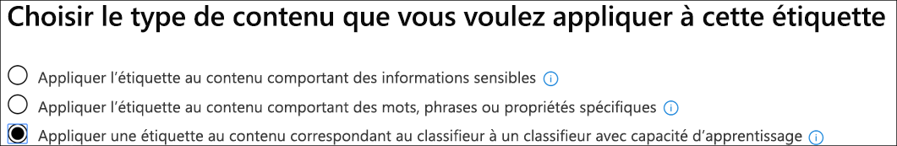
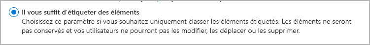

# Découvrir les étiquettes de rétention

>*[Guide de sécurité et conformité pour les licences Microsoft 365](https://aka.ms/ComplianceSD).*

Au sein de votre organisation, il existe probablement divers types de contenu devant faire l’objet d’actions différentes afin de respecter des réglementations du secteur et des stratégies internes. Par exemple, vous pouvez avoir les types de contenu suivants :
  
- Formulaires fiscaux qui doivent être **conservés** pendant une période minimale de temps. 
    
- Documents de presse qui doivent être **définitivement supprimés** après une certaine date. 
    
- Recherche concurrentielle qui doit être **conservée**, puis **définitivement supprimée**. 
    
- Permis de travail qui doivent être **enregistrés** afin de ne pas être modifiés ou supprimés. 
    
Dans tous ces cas, les étiquettes de rétention vous aident à entreprendre les bonnes actions sur le contenu approprié. Grâce aux étiquettes de rétention, vous pouvez classer les données au sein de votre organisation à des fins de gouvernance, et appliquer des règles de rétention basées sur cette classification.
  
Avec les étiquettes de rétention, vous pouvez effectuer les actions suivantes :
  
- **Permettre aux personnes de votre organisation d’appliquer manuellement une étiquette de rétention** à du contenu dans Outlook sur le web, Outlook 2010 et versions ultérieures, OneDrive, SharePoint et Groupes Microsoft 365. Les utilisateurs ont souvent une meilleure connaissance du type de contenu qu’ils utilisent. Ils peuvent donc le classer et lui appliquer la stratégie appropriée. 
    
- **Appliquer automatiquement des étiquettes de rétention au contenu** s’il répond à des conditions spécifiques, comme lorsque le contenu contient : 
    
    - des types spécifiques d’informations sensibles.
    
    - des mots clés spécifiques correspondant à une requête que vous créez.
    
    - Le modèle correspond à un classifieur entraînable.
    
  La possibilité d’appliquer automatiquement des étiquettes de rétention à du contenu est importante pour les raisons suivantes :
    
     - Vous n’avez pas à former les utilisateurs à l’ensemble de vos classifications.
    
     - Vous n’avez pas à dépendre des utilisateurs pour classer tout le contenu correctement.
    
   - Les utilisateurs n’ont plus à connaître les stratégies de gouvernance des données : à la place, ils peuvent se concentrer sur leur travail.

- **Appliquer une étiquette de rétention par défaut à une bibliothèque de documents, un dossier ou un ensemble de documents** dans SharePoint, afin que tous les documents stockés dans cette bibliothèque obtiennent l’étiquette de rétention par défaut.

De plus, les étiquettes de rétention prennent en charge la [gestion des enregistrements](records-management.md) pour les e-mails et les documents dans les applications et les services Microsoft 365. Vous pouvez utiliser une étiquette de rétention pour classer du contenu sous la forme d’un enregistrement. Dans ce cas, l’étiquette ne peut pas être modifiée ou retirée, et le contenu ne peut pas être modifié ou supprimé. 

Il n’y a pas de limite au nombre d’étiquettes de rétention qui sont prises en charge pour un client. Toutefois, le nombre maximal de stratégies prises en charge pour un client est de 10 000, et cela inclut les stratégies qui appliquent les étiquettes (stratégies d’étiquette de rétention et stratégies de rétention qui s’appliquent automatiquement), ainsi que les stratégies de rétention.

## Fonctionnement des étiquettes avec les stratégies d’étiquette de rétention

La mise à disposition des étiquettes de rétention aux membres de votre organisation afin qu’ils puissent classer le contenu est un processus en deux étapes : 

1. Créer les étiquettes de rétention

2. Publier les étiquettes de rétention à l’aide d’une stratégie d’étiquette de rétention.
  

  
Les étiquettes de rétention sont des éléments constitutifs indépendants et réutilisables qui sont inclus dans une ou plusieurs stratégies de rétention d’étiquette. L’objectif principal d’une stratégie de rétention d’étiquette est de regrouper un ensemble d’étiquettes de rétention et de spécifier les emplacements où vous souhaitez voir apparaître ces étiquettes.
  

  
1. Lorsque vous publiez des étiquettes, celles-ci sont incluses dans une stratégie d’étiquette. Les noms des étiquettes de rétention sont immuables, ce qui signifie qu’ils ne peuvent pas être modifiés une fois créés.

2. Une étiquette de conservation peut être incluse dans de nombreuses stratégies d’étiquette de rétention.

3. Un seul emplacement peut être inclus dans de nombreuses stratégies d’étiquette de rétention.
    
3. Les stratégies d’étiquette de rétention définissent les emplacements où publier les étiquettes de rétention.
    
## Une seule étiquette de rétention à la fois

Il est important de savoir que du contenu tel qu’un e-mail ou un document ne peut porter qu’une seule étiquette de rétention à la fois :
  
- En ce qui concerne les étiquettes de rétention affectées manuellement par les utilisateurs finals, ceux-ci peuvent supprimer ou modifier l’étiquette de rétention affectée.
    
- Si du contenu porte une étiquette appliquée automatiquement, celle-ci peut être remplacée par une étiquette de rétention affectée manuellement par un utilisateur final.
    
- Si du contenu porte une étiquette affectée manuellement par un utilisateur final, celle-ci ne peut pas être remplacée par une étiquette de rétention à appliquer automatiquement.
    
- S’il existe plusieurs règles qui affectent une étiquette à appliquer automatiquement et que le contenu remplit les critères de plusieurs règles, l’étiquette de rétention de la règle la plus ancienne est affectée.
    
Pour comprendre comment et pourquoi une étiquette de rétention est appliquée plutôt qu’une autre, il est important de comprendre la différence entre l’attribution explicite et l’attribution implicite d’une étiquette :

- Les étiquettes attribuées manuellement sont attribuées de manière explicite.
- Les étiquettes appliquées automatiquement sont attribuées de manière implicite.

Une étiquette de rétention attribuée de manière explicite prévaut sur une étiquette de rétention attribuée de manière implicite. Si vous souhaitez en savoir plus, consultez la section de cette page nommée [Principes de rétention et priorité](#the-principles-of-retention-or-what-takes-precedence).

## Stratégies d’étiquette de rétention et emplacements

Différents types d’étiquettes de rétention peuvent être publiés dans différents emplacements, en fonction du descriptif de l’étiquette de rétention.
  
|**Si l’étiquette de rétention est...**|**La stratégie d’étiquette peut être appliquée à...**|
|:-----|:-----|
|Publiée aux utilisateurs finaux    |Exchange, SharePoint, OneDrive et Groupes Microsoft 365    |
|Appliquée automatiquement en fonction des types d’informations sensibles    |Exchange (toutes les boîtes aux lettres uniquement), SharePoint, OneDrive    |
|Appliquée automatiquement en fonction d’une requête    |Exchange, SharePoint, OneDrive et Groupes Microsoft 365    |
   
Dans Exchange, les étiquettes de rétention d’application automatique (pour les requêtes et les types d’informations sensibles) sont appliquées uniquement aux nouveaux messages envoyés (données en transit) et pas à tous les éléments présents dans la boîte aux lettres (données au repos). Par ailleurs, les étiquettes de rétention d’application automatique pour les types d’informations sensibles ne peuvent s’appliquer qu’à toutes les boîtes aux lettres. Vous ne pouvez pas sélectionner les boîtes aux lettres spécifiques.
  
Les dossiers publics Exchange, Skype et les messages et conversations de canal Teams ne prennent pas en charge les étiquettes de rétention.

## Comment les étiquettes appliquent la rétention

Les étiquettes de rétention peuvent appliquer les mêmes actions de rétention qu’une stratégie de rétention, c’est-à-dire conserver puis supprimer le contenu, le conserver uniquement ou le supprimer uniquement. Vous pouvez utiliser des étiquettes de rétention pour implémenter un plan de fichiers sophistiqué qui identifie des fichiers spécifiques pour différents paramètres de rétention. Si vous souhaitez en savoir plus sur le fonctionnement des stratégies de rétention, consultez la page [Découvrir les stratégies de rétention](retention-policies.md).

En outre, une étiquette de rétention dispose de deux options de rétention qui sont disponibles uniquement dans une étiquette de rétention et non dans une stratégie de rétention. Avec une étiquette de rétention, vous pouvez effectuer les actions suivantes :
  
- Déclenchez une révision avant destruction à la fin d’une période de rétention afin que les documents SharePoint et OneDrive soient analysés avant de pouvoir être supprimés. Si vous souhaitez en savoir plus, consultez la page [Révisions avant destruction](disposition.md#disposition-reviews).
    
- Démarrer la période de rétention à compter de la date d’étiquetage du contenu, au lieu de l’ancienneté du contenu ou de la date de sa dernière modification. Lorsque vous utilisez cette option :
    - Cela s'applique uniquement au contenu des sites SharePoint et des comptes OneDrive. Pour la messagerie Exchange, la période de rétention est toujours basée sur la date à laquelle le message a été envoyé ou reçu.
    - Vous ne pouvez pas modifier la période de rétention une fois l’étiquette enregistrée.
    

Une autre différence majeure réside dans le fait que, lorsque vous appliquez une étiquette de rétention au lieu d’une stratégie de rétention aux fichiers dans SharePoint, et que l’étiquette est configurée de manière à conserver le contenu, les utilisateurs ne peuvent pas supprimer le fichier pendant la période de rétention. Les utilisateurs peuvent supprimer du contenu lorsque la même étiquette est appliquée aux fichiers dans OneDrive et aux courriers électroniques, sauf si l’étiquette marque le contenu en tant qu’enregistrement.

## Emplacements des étiquettes de rétention publiées visibles pour les utilisateurs finals

Si votre étiquette de rétention est affectée au contenu par les utilisateurs finals, vous pouvez la publier pour :
  
- Outlook et Outlook sur le web
    
- OneDrive
    
- SharePoint
    
- Groupes Microsoft 365 (le site de groupe et la boîte aux lettres de groupe dans Outlook sur le web)
    
Les sections suivantes expliquent comment les étiquettes apparaissent aux membres de votre organisation dans les différentes applications.
  

### Outlook

Pour étiqueter un élément dans le client de bureau Outlook, sélectionnez l’élément. Sous l’onglet **Accueil** du ruban, cliquez sur **Attribuer une stratégie**, puis sélectionnez l’étiquette de rétention. 
  

  
Vous pouvez également cliquer avec le bouton droit sur un élément, cliquer sur **Attribuer une stratégie** dans le menu contextuel, puis choisir l’étiquette de rétention. 

Une fois l’étiquette de rétention appliquée, vous pouvez la voir ainsi que son action en haut de l’élément. Si un e-mail est classifié avec une étiquette de rétention et une période de rétention associée, vous pouvez savoir en un coup d’œil quand le message arrivera à expiration.
  
Vous pouvez également appliquer des étiquettes de rétention à des dossiers. Dans ce cas, tenez compte des points suivants :
  
- Tous les éléments du dossier héritent automatiquement de cette même étiquette de rétention, **à l’exception** des éléments auxquels une étiquette de rétention a été appliquée de manière explicite. Les éléments étiquetés de manière explicite conservent leur étiquette de rétention existante. Si vous souhaitez en savoir plus, consultez la section de cette page nommée [Principes de rétention et priorité](#the-principles-of-retention-or-what-takes-precedence). 
    
- Si vous modifiez ou supprimez l’étiquette de rétention par défaut d’un dossier, l’étiquette est également modifiée ou supprimée pour tous les éléments dans le dossier **à l’exception** des éléments portant des étiquettes de rétention attribuées de manière explicite. 
    
- Si vous déplacez un élément portant une étiquette de rétention par défaut d’un dossier vers un autre dossier portant une étiquette de rétention par défaut différente, l’élément reçoit la nouvelle étiquette par défaut.
    
- Si vous déplacez un élément portant une étiquette de rétention par défaut d’un dossier vers un autre dossier ne portant pas d’étiquette de rétention par défaut, l’ancienne étiquette par défaut est supprimée.

### Outlook sur le web

Pour étiqueter un élément dans Outlook sur le web, cliquez sur l’élément \> **Affecter une stratégie** \> et choisissez l’étiquette de rétention. 
  

  
Après avoir appliqué l’étiquette de rétention, vous pouvez l’afficher, ainsi que son action, en haut de l’élément. Si un e-mail est classé et associé à une période de rétention, vous pouvez connaître en un clin d’œil la date d’expiration de l’e-mail.
  

  
Comme avec Outlook sur le web, vous pouvez également appliquer des étiquettes de rétention aux dossiers. 

### OneDrive et SharePoint

Pour étiqueter un document (notamment les fichiers OneNote) dans OneDrive ou SharePoint, sélectionnez l’élément \> dans le coin supérieur droit, sélectionnez **Ouvrir le volet d’informations** \> **Appliquer une étiquette de rétention** \> et choisissez l’étiquette de rétention. 
  
Vous pouvez également appliquer une étiquette de rétention à un ensemble de dossiers ou de documents, et vous pouvez définir une [étiquette de rétention par défaut pour une bibliothèque de documents](#applying-a-default-retention-label-to-all-content-in-a-sharepoint-library-folder-or-document-set).
  

  
Après avoir appliqué une étiquette de rétention à un élément, vous pouvez l’afficher dans le volet d’informations lorsque cet élément est sélectionné.
  

  
Pour SharePoint, vous pouvez créer un affichage de la bibliothèque qui contient la colonne **Étiquettes** ou la colonne **L’élément est un enregistrement**. Cela n’est pas possible pour OneDrive. Cet affichage vous permet de voir rapidement les étiquettes de rétention attribuées à tous les éléments et les éléments qui sont des enregistrements. Notez cependant que vous ne pouvez pas filtrer l’affichage en utilisant la colonne **L’élément est un enregistrement**. Si vous souhaitez savoir comment ajouter des colonnes, consultez la page [Afficher ou masquer des colonnes dans une liste ou une bibliothèque](https://support.microsoft.com/fr-FR/office/show-or-hide-columns-in-a-list-or-library-b820db0d-9e3e-4ff9-8b8b-0b2dbefa87e2).

### Groupes Microsoft 365

Lorsque vous publiez des étiquettes de rétention sur des groupes Microsoft 365 ([anciennement appelés groupes Office 365](https://techcommunity.microsoft.com/t5/microsoft-365-blog/office-365-groups-will-become-microsoft-365-groups/ba-p/1303601)), celles-ci apparaissent à la fois dans le site et dans la boîte aux lettres du groupe dans Outlook sur le web. L’expérience concernant l’application d’une étiquette à du contenu est identique à celle utilisée pour les e-mails et les documents.

Pour conserver le contenu d’un groupe Microsoft 365, utilisez l’emplacement des **groupes Office 365**. Même si un groupe Microsoft 365 possède une boîte aux lettres Exchange, une politique de rétention qui inclut l’ensemble de l’emplacement Exchange n’inclut pas le contenu des boîtes aux lettres du groupe Microsoft 365.

De plus, il n’est pas possible d’utiliser l’emplacement Exchange pour inclure ou exclure une boîte aux lettres de groupe spécifique. Bien que l’emplacement Exchange permette initialement de sélectionner une boîte aux lettres de groupe, lorsque vous essayez d’enregistrer la stratégie de rétention, vous recevez une erreur qui indique que « RemoteGroupMailbox » n’est pas une sélection valide pour l’emplacement Exchange.
  
Commencez par créer et configurer les étiquettes de confidentialité que vous souhaitez rendre disponibles pour les applications et autres services. Par exemple, les étiquettes que vous voulez que les utilisateurs voient et appliquent à partir des applications Office. 

Puis créez une ou plusieurs stratégies d’étiquette contenant les étiquettes et paramètres de stratégie que vous configurez. La stratégie d’étiquette publie en effet les étiquettes et paramètres pour les utilisateurs et emplacements que vous sélectionnez.

## Application automatique d’une étiquette de rétention en fonction de conditions

L’une des fonctionnalités les plus puissantes des étiquettes de rétention est la possibilité d’appliquer celles-ci automatiquement à tout contenu correspondant à certaines conditions. Dans ce cas, les personnes au sein de votre organisation ne doivent pas appliquer les étiquettes de rétention. Microsoft 365 s’en charge à leur place.
  

  
Les étiquettes de rétention appliquées automatiquement sont puissantes pour les raisons suivantes :
  
- Vous n’avez pas besoin de former les utilisateurs concernant l’ensemble de vos classifications.
    
- Vous n’avez pas à dépendre des utilisateurs pour classer tout le contenu correctement.
    
- Les utilisateurs n’ont plus besoin de connaître les stratégies de gouvernance des données : ils peuvent se concentrer sur leur travail.
    
Vous pouvez choisir d’appliquer automatiquement des étiquettes de rétention au contenu quand celui-ci inclut :
  
- [Types spécifiques d’informations sensibles](create-retention-labels.md#auto-apply-labels-to-content-with-specific-types-of-sensitive-information)
    
- [Mots clés spécifiques correspondant à une requête que vous créez](create-retention-labels.md#auto-apply-labels-to-content-with-keywords-or-searchable-properties)

- [Correspondance pour les classifieurs entraînables](create-retention-labels.md#auto-apply-labels-to-content-by-using-trainable-classifiers)
    

> [!TIP]
> Consultez [Gérer le cycle de vie des documents SharePoint avec des étiquettes de rétention](auto-apply-retention-labels-scenario.md) pour un scénario détaillé sur l’utilisation de propriétés gérées dans SharePoint afin d'appliquer automatiquement des étiquettes de rétention et implémenter la rétention basée sur les événements.

## Application d’une étiquette de rétention par défaut à tout le contenu dans une bibliothèque, un dossier ou un ensemble de documents SharePoint

En plus de permettre aux utilisateurs d’appliquer une étiquette de rétention à des documents individuels, vous pouvez également appliquer une étiquette de rétention par défaut à une bibliothèque, à un dossier ou à un ensemble de documents SharePoint, afin que tous les documents dans cet emplacement héritent de cette étiquette de rétention par défaut.
  
Pour une bibliothèque de documents, cette opération s’effectue sur la page **Paramètres de la bibliothèque** d’une bibliothèque de documents. Lorsque vous choisissez l’étiquette de rétention par défaut, vous pouvez également choisir de l’appliquer aux éléments présents dans la bibliothèque. 
  
Par exemple, si vous avez une balise pour des documents marketing et vous savez qu’une bibliothèque de documents spécifique contient uniquement ce type de contenu, vous pouvez définir la balise Document marketing par défaut pour tous les documents de cette bibliothèque.
  

  
Si vous appliquez une étiquette de rétention par défaut à des éléments existants dans la bibliothèque, le dossier ou l’ensemble de documents, procédez comme suit :
  
- Tous les éléments de la bibliothèque, du dossier ou de l'ensemble de documents héritent automatiquement de cette même étiquette de rétention, **à l’exception** des éléments auxquels une étiquette de rétention a été appliquée explicitement (tels que les enregistrements). Les éléments étiquetés explicitement conservent leur étiquette. Pour plus d’informations, voir la section relative aux [principes de rétention ci-dessous ou ce qui priorité](#the-principles-of-retention-or-what-takes-precedence).
    
- Si vous modifiez ou supprimez l’étiquette de rétention par défaut d’une bibliothèque, d’un dossier ou de l’ensemble de documents, l’étiquette est également modifiée ou supprimée pour tous les éléments dans la bibliothèque, le dossier ou l’ensemble de documents, **à l’exception** des éléments portant des étiquettes de rétention explicites (tels que les enregistrements).
    
- Si vous déplacez un élément portant une étiquette de rétention par défaut d’une collection de sites, d'une bibliothèque, d’un dossier ou d’un ensemble de documents vers une autre collection de sites, bibliothèque, dossier ou un autre ensemble de documents ayant une étiquette différente, l’élément conserve l'étiquette de rétention par défaut existante, même si l’étiquette par défaut du nouvel emplacement est différente. Si l’élément n’a pas d’étiquette avant le déplacement, il utilise l’étiquette de rétention par défaut du nouvel emplacement.

**Enregistrements :** si vous appliquez une étiquette d’enregistrement par défaut à une bibliothèque, un dossier ou un ensemble de documents, une étiquette d’enregistrement est ensuite appliquée à tous les éléments individuels de ces emplacements. Lorsque vous déplacez un nouvel élément vers un emplacement comportant une étiquette d’enregistrement, cet élément est étiqueté en tant qu’enregistrement. Toutefois, si vous remplacez l’étiquette de rétention par défaut par une étiquette ne déclarant pas de contenu en tant qu’enregistrement, cette action ne supprime pas l’étiquette d’enregistrement des éléments individuels ; ceux-ci conservent leur étiquette d’enregistrement. Seul un administrateur de collection de sites peut supprimer ou modifier, de manière explicite, l’étiquette de rétention des éléments d’enregistrement.

Si vous souhaitez en savoir plus sur les étiquettes de rétention qui déclarent du contenu en tant qu’enregistrement, consultez la page [Découvrir les enregistrements](records.md).

## Application d’une étiquette de rétention pour les e-mails à l’aide de règles

Dans Outlook, vous pouvez créer des règles pour appliquer une étiquette ou une stratégie de rétention.
  
Par exemple, vous pouvez créer une règle qui applique une étiquette de rétention spécifique à tous les messages envoyés vers un groupe de distribution spécifique ou à partir de celui-ci.
  
Pour créer une règle, faites un clic droit sur un élément \> **Règles** \> **Créer une règle** \> **Options avancées** \> **Assistant de règles** \> **appliquez la stratégie de rétention**.
  

  
## Classification de contenu sans appliquer d’action

Lorsque vous créez une étiquette de rétention, vous pouvez le faire sans activer de rétention ou d’autre actions. Dans ce cas, vous pouvez utiliser une étiquette de rétention simplement, comme une étiquette de texte, sans appliquer la moindre action.
  
Par exemple, vous pouvez créer une étiquette de rétention nommée « Réviser plus tard » sans action, puis appliquer automatiquement cette étiquette de rétention au contenu avec des types d’informations sensibles ou au contenu recherché.
  

  
## Utilisation d’étiquettes de rétention pour la gestion des enregistrements
    
Vous pouvez utiliser des étiquettes de rétention pour déclarer du contenu sous la forme d’un enregistrement. Cela vous permet de mettre en place une stratégie de gestion des enregistrements unique et cohérente au sein de Microsoft 365. Pour plus d’informations, voir [En savoir plus sur les enregistrements](records.md).
  
## Utilisation d’une étiquette de rétention comme condition dans une stratégie DLP

Une étiquette de rétention peut appliquer des actions de rétention sur le contenu. En outre, vous pouvez utiliser une étiquette de rétention comme condition dans une stratégie de prévention contre la perte de données (DLP). Cela signifie qu’une stratégie DLP peut appliquer d’autres actions, telles que la restriction d’accès, au contenu portant une étiquette spécifique. 
  
Pour plus d’informations, consultez [Utilisation d’une étiquette de rétention comme condition dans une stratégie DLP](data-loss-prevention-policies.md#using-a-retention-label-as-a-condition-in-a-dlp-policy).
  

## Principes de rétention et priorité

Il est possible, voire même probable, que le contenu fasse l’objet de plusieurs stratégies de rétention, chacune avec une action (conservation, suppression ou les deux) et une période de rétention différentes. Laquelle est prioritaire ? Au plus haut niveau, sachez que le contenu conservé par une stratégie ne peut pas être supprimé définitivement par une autre stratégie.
  

  
Pour comprendre comment les différentes étiquettes avec des actions de rétention s’appliquent au contenu, prenez en compte les principes de rétention suivants :
  
1. **La rétention l’emporte sur la suppression.** Supposons qu’une stratégie de rétention stipule de supprimer la messagerie Exchange au bout de trois ans, mais qu’une autre stratégie de rétention stipule de la conserver pendant cinq ans, puis de la supprimer. Le contenu atteignant trois ans est supprimé et masqué des utilisateurs, mais est conservé dans le dossier Éléments récupérables jusqu’à ce que le contenu atteigne cinq ans, avant d’être définitivement supprimé. 
    
2. **La plus longue période de rétention l’emporte. ** Si du contenu est soumis à plusieurs stratégies de rétention, il est conservé jusqu’à la fin de la période de rétention la plus longue. 
    
3. **L’inclusion explicite l’emporte sur l’inclusion implicite. ** Il faut donc prendre en compte les points suivants : 
    
    1. Si une étiquette de rétention avec des paramètres de rétention est attribuée manuellement par un utilisateur à un élément tel qu’un message Exchange ou un document OneDrive, cette étiquette de rétention l’emporte sur toute stratégie appliquée au niveau du site ou de la boîte aux lettres, ainsi que sur une étiquette de rétention par défaut attribuée par la bibliothèque de documents. Par exemple, si l’étiquette de rétention explicite stipule une période de rétention de 10 ans, tandis que la stratégie de rétention appliquée au site indique une période de rétention de cinq ans, l’étiquette de rétention est prioritaire. Les étiquettes de rétention appliquées automatiquement sont considérées comme implicites et non explicites, car Microsoft 365 les applique automatiquement.
    
    2. Si une stratégie de rétention inclut un emplacement spécifique, comme la boîte aux lettres d’un utilisateur spécifique ou un compte OneDrive, cette stratégie prévaut sur les autres stratégies de rétention qui s’appliquent à l’ensemble des boîtes aux lettres ou des comptes OneDrive des utilisateurs, mais n’inclut pas spécifiquement la boîte aux lettres de l’utilisateur en question.
    
4. **La période de suppression la plus courte l’emporte. ** De même, si du contenu est soumis à plusieurs stratégies de suppression (sans aucune rétention), il est supprimé à la fin de la période de rétention la plus courte. 
    
Notez que les principes de rétention opèrent comme un flux de partage du haut vers le bas : si les règles appliquées par toutes les stratégies ou étiquettes sont identiques sur un même niveau, le flux passe au niveau inférieur pour déterminer la règle prioritaire à appliquer.
  
Enfin, une stratégie de rétention ou une étiquette de rétention ne peut pas supprimer définitivement du contenu en attente pour eDiscovery. Une fois cette conservation levée, le contenu est de nouveau éligible pour le processus de nettoyage décrit ci-dessus.

### Priorité pour l’étiquetage automatique avec les classifieurs présentant une capacité d’apprentissage

Toutes les étiquettes de rétention configurées pour les classifieurs présentant une capacité d’apprentissage sont évaluées en même temps. Si un élément est détecté par plusieurs classifieurs présentant une capacité d’apprentissage, les critères suivants sont utilisés pour déterminer l’étiquette de rétention à appliquer :

1. Les étiquettes de rétention configurées pour être conservées uniquement ou pour être conservées puis supprimées ont une priorité plus élevée que les étiquettes de rétention configurées pour être supprimées uniquement.

2. Les étiquettes de rétention qui sont configurées pour être conservées uniquement ou pour être conservées puis supprimées, l'étiquette de rétention qui est configurée pour la plus longue période de rétention prime.

3. Les étiquettes de rétention qui sont configurées pour être supprimées uniquement, l'étiquette de rétention qui est configurée pour la plus courte période de rétention prime.

4. Les étiquettes de rétention ayant la même action et la même période entraînent une sélection non déterministe des étiquettes de rétention.

## Contrôler les étiquettes de rétention

Après avoir publié ou appliqué automatiquement vos étiquettes de rétention, vous pouvez vérifier qu’elles ont été correctement appliquées au contenu souhaité. Pour contrôler les étiquettes de rétention :
  
- **l’explorateur des activités liées aux étiquettes**. L’explorateur (exemple sur la photo suivante) vous permet de rechercher et d’afficher rapidement l’activité liée aux étiquettes pour l’ensemble du contenu dans SharePoint et OneDrive au cours des 30 derniers jours. Si vous souhaitez en savoir plus, consultez la page [Afficher l’activité liée aux étiquettes pour les documents](view-label-activity-for-documents.md).

- Page **Analyse des étiquettes**. Dans le Centre de conformité Microsoft 365 et le Centre de sécurité Microsoft 365, vous pouvez afficher rapidement vos principales étiquettes de rétention et leur emplacement. Vous pouvez également afficher tout le contenu portant une étiquette de rétention spécifique. Si vous souhaitez en savoir plus, consultez la page [Afficher l’utilisation des étiquettes grâce à la page Analyse des étiquettes](label-analytics.md).
    
- **Rapports de gouvernance des données**. Ces rapports vous permettent de consulter rapidement l’activité et les tendances liées aux étiquettes de rétention pour l’ensemble du contenu dans Exchange, SharePoint et OneDrive au cours des 90 derniers jours. Si vous souhaitez en savoir plus, consultez la page [Consulter les rapports de gouvernance des données](view-the-data-governance-reports.md).
    

## Utilisation de la recherche de contenu pour rechercher tout le contenu portant une étiquette de rétention spécifique

Lorsque les étiquettes de rétention sont affectées au contenu par les utilisateurs ou automatiquement, vous pouvez utiliser la recherche de contenu pour rechercher les contenus classés et dotés d’étiquettes de rétention spécifiques.
  
Lorsque vous créez une recherche de contenu, sélectionnez la condition **Balise de conformité**, puis entrez le nom complet ou une partie du nom de l’étiquette de rétention et utilisez un caractère générique. Si vous souhaitez en savoir plus, consultez la page [Requêtes par mots-clés et conditions de recherche pour la recherche de contenu](keyword-queries-and-search-conditions.md).
  

  
## Utilisez des étiquettes de rétention plutôt que les anciennes fonctionnalités

Les étiquettes de rétention peuvent facilement être mises à la disposition de toute une organisation et de son contenu dans Microsoft 365, y compris dans les groupes Exchange, SharePoint, OneDrive et Microsoft 365. Si vous devez conserver ou supprimer du contenu ou bien gérer des enregistrements n’importe où dans Microsoft 365, il est recommandé d’utiliser des étiquettes de rétention.
  
Plusieurs autres fonctionnalités étaient auparavant utilisées pour conserver ou supprimer du contenu ou pour gérer les enregistrements dans Microsoft 365. Ces fonctionnalités continuent de fonctionner parallèlement aux étiquettes de rétention. Même s’il existe encore certaines situations où vous pouvez choisir entre l’une de ces fonctionnalités et les étiquettes de rétention, sachez qu’à l’avenir, seules les étiquettes de rétention seront utilisées pour la gestion des enregistrements dans Microsoft 365. Il est donc recommandé d’utiliser immédiatement les étiquettes de rétention pour la gouvernance de vos données, plutôt que les anciennes fonctionnalités suivantes.
  
### Exchange Online

- [Balises de rétention et stratégies de rétention](https://go.microsoft.com/fwlink/?linkid=846125), aussi appelées [gestion des enregistrements de messagerie (MRM)](https://go.microsoft.com/fwlink/?linkid=846126) (suppression uniquement) 
    
### SharePoint et OneDrive

- [Configuration de la gestion des enregistrements sur place](https://support.office.com/article/7707a878-780c-4be6-9cb0-9718ecde050a) (rétention) 
    
- [Présentation du Centre des enregistrements](https://support.office.com/article/bae6ca5a-7b19-40e0-b433-e3613a747c2c) (rétention) 
    
- [Stratégies de gestion des informations](intro-to-info-mgmt-policies.md) (suppression uniquement) 
    
## Étapes suivantes

Si vous êtes prêt à créer et publier des étiquettes de rétention, voir [Créer, publier et appliquer automatiquement des étiquettes de rétention](create-retention-labels.md).
