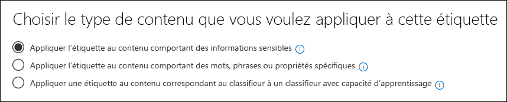
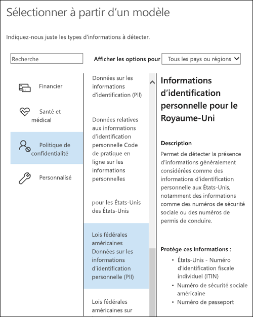

# <a name="overview-of-retention-labels"></a>Vue d’ensemble des étiquettes de rétention

Au sein de votre organisation, il existe probablement divers types de contenu devant faire l’objet d’actions différentes afin de respecter des réglementations du secteur et des stratégies internes. Par exemple, vous pouvez avoir les types de contenu suivants :
  
- Formulaires fiscaux qui doivent être **conservés** pendant une période minimale de temps. 
    
- Documents de presse qui doivent être **définitivement supprimés** après une certaine date. 
    
- Recherche concurrentielle qui doit être **conservée**, puis **définitivement supprimée**. 
    
- Permis de travail qui doivent être **enregistrés** afin de ne pas être modifiés ou supprimés. 
    
Dans tous ces cas, les étiquettes de rétention dans Office 365 vous aident à entreprendre les bonnes actions sur le contenu approprié. Grâce aux étiquettes de rétention, vous pouvez classer les données au sein de votre organisation à des fins de gouvernance, et appliquer des règles de rétention basées sur cette classification.
  
Avec les étiquettes de rétention, vous pouvez effectuer les actions suivantes :
  
- **Permettre aux personnes de votre organisation d’appliquer manuellement une étiquette de rétention** à du contenu dans Outlook sur le web, Outlook 2010 et versions ultérieures, OneDrive, SharePoint et les groupes Office 365. Les utilisateurs ont souvent une meilleure connaissance du type de contenu qu’ils utilisent. Ils peuvent donc le classer et lui appliquer la stratégie appropriée. 
    
- **Appliquer automatiquement des étiquettes de rétention au contenu** s’il répond à des conditions spécifiques, comme lorsque le contenu contient : 
    
  - des types spécifiques d’informations sensibles ;
    
  - des mots clés spécifiques correspondant à une requête que vous créez.
    
  La possibilité d’appliquer automatiquement des étiquettes de rétention à du contenu est importante pour les raisons suivantes :
    
     - Vous n’avez pas à former les utilisateurs à l’ensemble de vos classifications.
    
     - Vous n’avez pas à dépendre des utilisateurs pour classer tout le contenu correctement.
    
   - Les utilisateurs n’ont plus à connaître les stratégies de gouvernance des données : à la place, ils peuvent se concentrer sur leur travail.

  > [!NOTE]
  > Pour appliquer automatiquement des étiquettes, chaque utilisateur disposant des autorisations nécessaires pour modifier du contenu étiqueté automatiquement dans un site ou une boîte aux lettres doit disposer d’une licence Office 365 Entreprise E5. Les utilisateurs qui ont simplement un accès en lecture seule n’ont pas besoin d’une licence.
      
- **Mettre en œuvre la gestion des enregistrements dans Office 365**, notamment les e-mails et les documents. Vous pouvez utiliser une étiquette de rétention pour classer du contenu en tant qu’enregistrement. Lorsque cela se produit, l’étiquette ne peut pas être modifiée ou supprimée, et le contenu ne peut pas être modifié ou supprimé. 

- **Appliquer une étiquette de rétention par défaut à une bibliothèque de documents, dossier ou ensemble de documents** dans SharePoint, afin que tous les documents figurant dans cette bibliothèque obtiennent l’étiquette de rétention par défaut.  
    
Vous créez des étiquettes de rétention dans le Centre de conformité Microsoft 365, le Centre de sécurité Microsoft 365 ou le Centre de sécurité et conformité Office 365. Dans la zone de navigation gauche, sélectionnez **Classification** > **Étiquette de rétention** > **Créer une étiquette**.

## <a name="how-retention-labels-work-with-retention-label-policies"></a>Fonctionnement des étiquettes avec les stratégies d’étiquette de rétention

La mise à disposition d’étiquettes pour permettre aux membres de votre organisation de classifier du contenu est un processus en deux étapes : vous commencez par créer les étiquettes de rétention, puis vous les publiez dans les emplacements de votre choix. Lorsque vous publiez des étiquettes de rétention, une stratégie de rétention d’étiquette est créée.
  

  
Les étiquettes de rétention sont des éléments constitutifs indépendants et réutilisables qui sont inclus dans une ou plusieurs stratégies de rétention d’étiquette. L’objectif principal d’une stratégie de rétention d’étiquette est de regrouper un ensemble d’étiquettes de rétention et de spécifier les emplacements où vous souhaitez voir apparaître ces étiquettes.
  

  
1. Lorsque vous publiez des étiquettes, celles-ci sont incluses dans une stratégie d’étiquette. Veuillez noter que les noms d’étiquettes de conservation sont définitifs et ne peuvent plus être modifiés une fois créés.


2. Une étiquette de conservation peut être incluse dans de nombreuses stratégies d’étiquette de rétention.

3. Un seul emplacement peut être inclus dans de nombreuses stratégies d’étiquette de rétention.    
    
3. Les stratégies d’étiquette de rétention définissent les emplacements où publier les étiquettes de rétention.
    
## <a name="only-one-retention-label-at-a-time"></a>Une seule étiquette de rétention à la fois

Il est important de savoir que du contenu tel qu’un e-mail ou un document ne peut porter qu’une seule étiquette de rétention à la fois :
  
- En ce qui concerne les étiquettes de rétention affectées manuellement par les utilisateurs finals, ceux-ci peuvent supprimer ou modifier l’étiquette de rétention affectée.
    
- Si du contenu porte une étiquette appliquée automatiquement, celle-ci peut être remplacée par une étiquette de rétention affectée manuellement par un utilisateur final.
    
- Si du contenu porte une étiquette affectée manuellement par un utilisateur final, celle-ci ne peut pas être remplacée par une étiquette de rétention à appliquer automatiquement.
    
- S’il existe plusieurs règles qui affectent une étiquette à appliquer automatiquement et que le contenu remplit les critères de plusieurs règles, l’étiquette de rétention de la règle la plus ancienne est affectée.
    
Les étiquettes affectées manuellement sont affectées explicitement. Les étiquettes à appliquer automatiquement sont affectées implicitement. Une étiquette de rétention explicite est prioritaire sur une étiquette implicite. Pour obtenir plus d’informations, consultez la section [Principes de rétention et priorité](#the-principles-of-retention-or-what-takes-precedence) indiquée ci-après.

Toutes les informations de cette section s’appliquent uniquement aux étiquettes de rétention. Un élément de contenu peut également porter une étiquette de niveau de confidentialité, en plus d’une étiquette de rétention.
  
## <a name="how-long-it-takes-for-retention-labels-to-take-effect"></a>Délai d’activation des étiquettes de rétention

Lorsque vous publiez ou appliquez automatiquement des étiquettes de rétention, elles ne prennent pas effet immédiatement :
  
1. La première étape consiste à accéder au centre d’administration pour synchroniser la stratégie d’étiquette avec les emplacements définis dans la stratégie.
    
2. Ensuite, selon l’emplacement, un certain temps peut s’écouler avant que des étiquettes de rétention soient rendues disponibles aux utilisateurs finaux ou que des étiquettes d’application automatique soient attribuées à du contenu. Le temps nécessaire dépend de l’emplacement et du type d’étiquette de rétention.
    
### <a name="published-retention-labels"></a>Étiquettes de rétention publiées

Si vous publiez des étiquettes de rétention sur SharePoint ou OneDrive, cela peut prendre un jour pour que ces étiquettes soient visibles pour les utilisateurs finals. De plus, si vous publiez des étiquettes de rétention sur Exchange, cela peut prendre 7 jours pour que ces étiquettes soient visibles pour les utilisateurs finals, et la boîte aux lettres doit contenir au moins 10 Mo de données.
  

  
### <a name="auto-apply-retention-labels"></a>Étiquettes de rétention appliquées automatiquement

Si vous appliquez automatiquement des étiquettes de rétention à du contenu remplissant des critères spécifiques, l’application de ces étiquettes à ce contenu peut prendre jusqu’à 7 jours.
  

  
### <a name="how-to-check-on-the-status-of-retention-labels-published-to-exchange"></a>Vérifier l’état des étiquettes de rétention publiées dans Exchange

Dans Exchange Online, les étiquettes de rétention deviennent disponibles pour les utilisateurs finals par l’intermédiaire d’un processus qui s’exécute tous les sept jours. À l’aide de Powershell, vous pouvez découvrir la date de la dernière exécution du processus et déterminer la date de sa prochaine exécution.
  
1. [Connectez-vous à Exchange Online PowerShell](https://go.microsoft.com/fwlink/?linkid=799773).
    
2. Exécutez les commandes suivantes :
    
   ```powershell
   $logProps = Export-MailboxDiagnosticLogs <user> -ExtendedProperties
   ```

   ```powershell
   $xmlprops = [xml]($logProps.MailboxLog)
   ```

   ```powershell
   $xmlprops.Properties.MailboxTable.Property | ? {$_.Name -like "ELC*"}
   ```

Dans les résultats, la propriété `ELCLastSuccessTimeStamp` (UTC) indique quand le système a traité votre boîte aux lettres pour la dernière fois. Si cela ne s’est pas produit depuis la création de la stratégie, les étiquettes ne s’affichent pas. Pour forcer le traitement, exécutez la commande `Start-ManagedFolderAssistant -Identity <user>`.
    
Si les étiquettes n’apparaissent pas dans Outlook sur le web comme prévu, veillez à vider le cache dans votre navigateur (CTRL + F5).
    
## <a name="retention-label-policies-and-locations"></a>Stratégies d’étiquette de rétention et emplacements

Différents types d’étiquettes de rétention peuvent être publiés dans différents emplacements, en fonction du descriptif de l’étiquette de rétention.
  
|**Si l’étiquette de rétention est...**|**La stratégie d’étiquette peut être appliquée à...**|
|:-----|:-----|
|Publiée aux utilisateurs finaux  <br/> |Exchange, SharePoint, OneDrive et aux groupes Office 365  <br/> |
|Appliquée automatiquement en fonction des types d’informations sensibles  <br/> |Exchange (toutes les boîtes aux lettres uniquement), SharePoint, OneDrive  <br/> |
|Appliquée automatiquement en fonction d’une requête  <br/> |Exchange, SharePoint, OneDrive et aux groupes Office 365  <br/> |
   
Dans Exchange, les étiquettes de rétention d’application automatique (pour les requêtes et les types d’informations sensibles) sont appliquées uniquement aux nouveaux messages envoyés (données en transit) et pas à tous les éléments présents dans la boîte aux lettres (données au repos). Par ailleurs, les étiquettes de rétention d’application automatique pour les types d’informations sensibles ne peuvent s’appliquer qu’à toutes les boîtes aux lettres. Vous ne pouvez pas sélectionner les boîtes aux lettres spécifiques.
  
Les dossiers publics Exchange et Skype ne prennent pas en charge les étiquettes.
  
## <a name="how-retention-labels-enforce-retention"></a>Application de la rétention par les étiquettes

Des étiquettes de rétention peuvent appliquer les mêmes actions de rétention qu’une stratégie de rétention. Vous pouvez utiliser des étiquettes de rétention pour implémenter un plan de gestion de contenu (ou plan de gestion de fichiers) sophistiqué. Pour plus d’informations sur le fonctionnement de la rétention, voir [Vue d’ensemble des stratégies de rétention](retention-policies.md).
  
En outre, une étiquette de rétention dispose de deux options de rétention qui sont disponibles uniquement dans une étiquette de rétention et non dans une stratégie de rétention. Avec une étiquette de rétention, vous pouvez effectuer les actions suivantes :
  
- Déclencher une révision de destruction à la fin de la période de rétention, afin que les documents SharePoint et OneDrive soient vérifiés avant d’être supprimés. Pour obtenir plus d’informations, consultez l’article [Vue d’ensemble des révisions de destruction](disposition-reviews.md).
    
- Démarrer la période de rétention à compter de la date d’étiquetage du contenu, au lieu de l’ancienneté du contenu ou de la date de sa dernière modification. Cette option s'applique uniquement au contenu des sites SharePoint et des comptes OneDrive. Pour la messagerie Exchange, la période de rétention est toujours basée sur la date à laquelle le message a été envoyé ou reçu, quelle que soit l’option choisie.
    

  
## <a name="where-published-retention-labels-can-appear-to-end-users"></a>Emplacements des étiquettes de rétention publiées visibles pour les utilisateurs finals

Si votre étiquette de rétention est affectée au contenu par les utilisateurs finals, vous pouvez la publier pour :
  
- Outlook sur le web
    
- Outlook 2010 et versions ultérieures
    
- OneDrive
    
- SharePoint
    
- Les groupes Office 365 (le site de groupe et la boîte aux lettres de groupe dans Outlook sur le web)
    
Les sections indiquées ci-dessous montrent comment les étiquettes apparaissent pour les membres de votre organisation dans différentes applications.
  
### <a name="outlook-on-the-web"></a>Outlook sur le web

Pour étiqueter un élément dans Outlook sur le web, cliquez sur l’élément \> **Affecter une stratégie** \> et choisissez l’étiquette de rétention. 
  

  
Après avoir appliqué l’étiquette de rétention, vous pouvez l’afficher, ainsi que son action, en haut de l’élément. Si un e-mail est classé et associé à une période de rétention, vous pouvez connaître en un clin d’œil la date d’expiration de l’e-mail.
  

  
Vous pouvez également appliquer des étiquettes de rétention à des dossiers. Dans ce cas, tenez compte des points suivants :
  
- Tous les éléments du dossier héritent automatiquement de cette même étiquette de rétention, **à l’exception** des éléments auxquels une étiquette de rétention a été appliquée explicitement. Les éléments étiquetés explicitement conservent leur étiquette. Pour obtenir plus d’informations, consultez la section relative aux principes de rétention ci-après. 
    
- Si vous modifiez ou supprimez l’étiquette de rétention par défaut d’un dossier, l’étiquette est également modifiée ou supprimée pour tous les éléments dans le dossier **à l’exception** des éléments portant des étiquettes de rétention explicites. 
    
- Si vous déplacez un élément portant une étiquette de rétention par défaut d’un dossier vers un autre dossier portant une étiquette de rétention par défaut différente, l’élément reçoit la nouvelle étiquette par défaut.
    
- Si vous déplacez un élément portant une étiquette de rétention par défaut d’un dossier vers un autre dossier ne portant pas d’étiquette de rétention par défaut, l’ancienne étiquette par défaut est supprimée.
    
### <a name="outlook-2010-and-later"></a>Outlook 2010 et versions ultérieures

Pour étiqueter un élément dans le client de bureau Outlook, sélectionnez l’élément. Sous l’onglet **Accueil** du ruban, cliquez sur **Attribuer une stratégie**, puis sélectionnez l’étiquette de rétention. 
  

  
Vous pouvez également cliquer avec le bouton droit sur un élément, cliquer sur **Attribuer une stratégie** dans le menu contextuel, puis choisir l’étiquette de rétention. 

Une fois l’étiquette de rétention appliquée, vous pouvez la voir ainsi que son action en haut de l’élément. Si un e-mail est classifié avec une étiquette de rétention et une période de rétention associée, vous pouvez savoir en un coup d’œil quand le message arrivera à expiration.
  
Vous pouvez également appliquer des étiquettes de rétention à des dossiers. Cela fonctionne de la même manière dans Outlook 2010 et versions ultérieures que dans Outlook sur le web. Consultez la section précédente pour plus d’informations.
  
### <a name="onedrive-and-sharepoint"></a>OneDrive et SharePoint

Pour étiqueter un document (notamment les fichiers OneNote) dans OneDrive ou SharePoint, sélectionnez l’élément \> dans le coin supérieur droit, sélectionnez **Ouvrir le volet d’informations** \> **Appliquer une étiquette de rétention** \> et choisissez l’étiquette de rétention. 
  
Vous pouvez également appliquer une étiquette de rétention à un ensemble de dossiers ou de documents, et vous pouvez définir une étiquette de rétention par défaut pour une bibliothèque de documents. Consultez la rubrique ci-dessous pour plus d’informations.
  

  
Après avoir appliqué une étiquette de rétention à un élément, vous pouvez l’afficher dans le volet d’informations lorsque cet élément est sélectionné.
  

  
Vous pouvez également créer un affichage de la bibliothèque qui contient la colonne **Étiquettes** ou la colonne **Élément est un enregistrement**, afin que vous puissiez voir en un clin d’œil les étiquettes de rétention attribuées à tous les éléments, et les éléments qui sont des enregistrements. Toutefois, notez que vous ne pouvez pas filtrer l’affichage par la colonne **Élément est un enregistrement**. 
  

  
### <a name="office-365-groups"></a>Groupes Office 365

Lorsque vous publiez des étiquettes de rétention dans un groupe Office 365, celles-ci apparaissent dans le site de groupe et la boîte aux lettres de groupe dans Outlook sur le web. L’expérience d’application d’une étiquette de rétention au contenu est identique à celle illustrée ci-dessus pour les e-mails et les documents.

Pour conserver le contenu pour un groupe Office 365, vous devez utiliser l’emplacement de groupes Office 365. Même si un groupe Office 365 a une boîte aux lettres Exchange, une stratégie de rétention qui inclut l’emplacement Exchange entier n’inclut pas du contenu dans les boîtes aux lettres de groupe Office 365. 

De plus, il n’est pas possible d’utiliser l’emplacement Exchange pour inclure ou exclure une boîte aux lettres de groupe spécifique. Bien que l’emplacement Exchange permette initialement de sélectionner une boîte aux lettres de groupe, lorsque vous essayez d’enregistrer la stratégie de rétention, vous recevez une erreur « RemoteGroupMailbox » n’est pas une sélection valide pour l’emplacement Exchange.
  
## <a name="applying-a-retention-label-automatically-based-on-conditions"></a>Application automatique d’une étiquette de rétention en fonction de conditions

L’une des fonctionnalités les plus puissantes des étiquettes de rétention est la possibilité d’appliquer celles-ci automatiquement à tout contenu correspondant à certaines conditions. Dans ce cas, les personnes au sein de votre organisation ne doivent pas appliquer les étiquettes de rétention. Office 365 s’en charge à leur place.
  

  
Les étiquettes de rétention à appliquer automatiquement sont puissantes pour les raisons suivantes :
  
- Vous n’avez pas besoin de former les utilisateurs concernant l’ensemble de vos classifications.
    
- Vous n’avez pas à dépendre des utilisateurs pour classer tout le contenu correctement.
    
- Les utilisateurs n’ont plus besoin de connaître les stratégies de gouvernance des données : ils peuvent se concentrer sur leur travail.
    
Vous pouvez choisir d’appliquer automatiquement des étiquettes de rétention au contenu quand celui-ci inclut :
  
- des types spécifiques d’informations sensibles ;
    
- des mots clés spécifiques correspondant à une requête que vous créez.
    



Les étiquettes de rétention à appliquer automatiquement requièrent un abonnement Office 365 Entreprise E5. Cela peut prendre jusqu’à sept jours pour que les étiquettes de rétention à appliquer automatiquement soient appliquées à tout le contenu remplissant les conditions, comme décrit ci-dessus.
  
> [!TIP]
> Voir [Gérer le cycle de vie des documents SharePoint avec des étiquettes de rétention](auto-apply-retention-labels-scenario.md) pour un scénario détaillé sur l’utilisation de propriétés gérées dans SharePoint pour appliquer automatiquement des étiquettes de rétention et implémenter la rétention basée sur les événements.

### <a name="auto-apply-retention-labels-to-content-with-specific-types-of-sensitive-information"></a>Application automatique d’étiquettes de rétention au contenu incluant des types spécifiques d’informations sensibles

Lorsque vous créez des étiquettes de rétention d’application automatique pour des informations sensibles, vous voyez s’afficher la même liste de modèles de stratégie que lorsque vous créez une stratégie de protection contre la perte de données. Chaque modèle de stratégie est préconfiguré pour rechercher des types spécifiques d’informations sensibles. Par exemple, le modèle illustré ici recherche les numéros ITIN, SSN et de passeport américains. Pour plus d’informations sur la protection contre la perte de données, voir [Vue d’ensemble des stratégies de protection contre la perte de données](data-loss-prevention-policies.md).
  

  
Après avoir sélectionné un modèle de stratégie, vous pouvez ajouter ou supprimer tout type d’informations sensibles, et vous pouvez modifier le nombre d’instances et la précision de correspondance. Dans l’exemple présenté ici, une étiquette de rétention sera appliquée automatiquement uniquement dans les cas suivants :
  
- Le contenu comprend entre 1 et 9 instances de l’un de ces trois types d’informations sensibles. Vous pouvez supprimer la valeur **max** pour la définir sur **any**.
    
- Le type d’informations sensibles détecté a une précision de correspondance (ou niveau de confiance) minimale de 75. De nombreux types d’informations sensibles sont définis avec plusieurs modèles. Tandis qu’un modèle avec une précision de correspondance plus élevée nécessite un nombre de preuves plus important (par exemple, des mots clés, des dates ou des adresses), un modèle avec une précision de correspondance inférieure nécessite moins de preuves. En d’autres termes, plus la précision de correspondance **min** est faible, plus il est facile de faire correspondre le contenu à la condition. 
    
Pour plus d’informations relatives à ces options, voir[optimisation des règles afin de les rendre plus facile ou plus difficile à associer](data-loss-prevention-policies.md#tuning-rules-to-make-them-easier-or-harder-to-match).
    

  
### <a name="auto-apply-labels-to-content-with-keywords-or-searchable-properties"></a>Application automatique d’étiquettes au contenu comprenant des mots clés ou des propriétés pouvant faire l’objet d’une recherche

Vous pouvez appliquer automatiquement des étiquettes au contenu remplissant certaines conditions. Les conditions actuellement disponibles prennent en charge l’application d’une étiquette au contenu comprenant des mots, des phrases spécifiques ou des valeurs de propriété pouvant faire l’objet d’une recherche. Vous pouvez affiner votre requête à l’aide des opérateurs de recherche tels que AND, OR et NOT.

Pour obtenir plus d’informations sur la syntaxe de requête, consultez l’article suivant :

- [Référence de syntaxe de langage de requête de mot clé (KQL)](https://docs.microsoft.com/sharepoint/dev/general-development/keyword-query-language-kql-syntax-reference)

Les étiquettes basées sur une requête utilisent l’index de recherche pour identifier le contenu. Pour plus d’informations sur les propriétés valides utilisables dans une requête, consultez l’article suivant :

- [Requêtes par mots clés et conditions de recherche pour la recherche de contenu](keyword-queries-and-search-conditions.md)
- [Vue d’ensemble des propriétés analysées et gérées dans SharePoint Server](https://docs.microsoft.com/SharePoint/technical-reference/crawled-and-managed-properties-overview)

Exemples de requêtes :

- Exchange
    - subject:"Quarterly Financials"
    - recipients:garthf<!--nolink-->@contoso.com
- SharePoint et OneDrive Entreprise
    - contenttype:contract
    - site:https<!--nolink-->://contoso.sharepoint.com/sites/teams/procurement AND contenttype:contract


## <a name="applying-a-default-retention-label-to-all-content-in-a-sharepoint-library-folder-or-document-set"></a>Application d’une étiquette de rétention par défaut à tout le contenu dans une bibliothèque, un dossier ou un ensemble de documents SharePoint

En plus de permettre aux utilisateurs d’appliquer une étiquette de rétention à des documents individuels, vous pouvez également appliquer une étiquette de rétention par défaut à une bibliothèque, à un dossier ou à un ensemble de documents SharePoint, afin que tous les documents dans cet emplacement héritent de cette étiquette de rétention par défaut.
  
Pour une bibliothèque de documents, cette opération s’effectue sur la page **Paramètres de la bibliothèque** d’une bibliothèque de documents. Lorsque vous choisissez l’étiquette de rétention par défaut, vous pouvez également choisir de l’appliquer aux éléments présents dans la bibliothèque. 
  
Par exemple, si vous avez une balise pour des documents marketing et vous savez qu’une bibliothèque de documents spécifique contient uniquement ce type de contenu, vous pouvez définir la balise Document marketing par défaut pour tous les documents de cette bibliothèque.
  

  
Si vous appliquez une étiquette de rétention par défaut à des éléments existants dans la bibliothèque, le dossier ou l’ensemble de documents, procédez comme suit :
  
- Tous les éléments de la bibliothèque, du dossier ou de l'ensemble de documents héritent automatiquement de cette même étiquette de rétention, **à l’exception** des éléments auxquels une étiquette de rétention a été appliquée explicitement. Les éléments étiquetés explicitement conservent leur étiquette. Pour plus d’informations, voir la section relative aux [principes de rétention ci-dessous ou ce qui priorité](#the-principles-of-retention-or-what-takes-precedence).
    
- Si vous modifiez ou supprimez l’étiquette de rétention par défaut d’une bibliothèque, d’un dossier ou de l’ensemble de documents, l’étiquette est également modifiée ou supprimée pour tous les éléments dans la bibliothèque, le dossier ou l’ensemble de documents, **à l’exception** des éléments portant des étiquettes de rétention explicites. 
    
- Si vous déplacez un élément portant une étiquette de rétention par défaut d’une bibliothèque, d’un dossier ou d’un ensemble de documents vers une autre bibliothèque, un autre dossier ou un autre ensemble de documents, l’élément conserve son étiquette de rétention par défaut existante, même si l’étiquette par défaut du nouvel emplacement est différente.

- Si l’étiquette de rétention par défaut d’une bibliothèque, d’un dossier ou d’un ensemble de documents déclare du contenu sous la forme d’un enregistrement (également appelé *étiquette d’enregistrement*), les caractéristiques suivantes s’appliquent :

   - Si vous remplacez l’étiquette de rétention par défaut par une étiquette qui ne déclare pas du contenu en tant qu’enregistrement, les éléments conservent l’étiquette d’enregistrement par défaut existante. La nouvelle étiquette de rétention par défaut n’est pas appliquée à ces éléments. Un administrateur de collection de sites doit explicitement supprimer ou modifier l’étiquette de rétention.

   - Si vous supprimez l’étiquette de rétention par défaut qui déclare du contenu en tant qu’enregistrement, l’étiquette d’enregistrement n’est pas supprimée des éléments de la bibliothèque, du dossier ou de l’ensemble de documents. Un administrateur de collection de sites doit explicitement supprimer l’étiquette de rétention.

   Pour plus d’informations sur les étiquettes de rétention qui déclarent du contenu en tant qu’enregistrement, voir [Vue d’ensemble des enregistrements](records.md).
    
## <a name="applying-a-retention-label-to-email-by-using-rules"></a>Application d’une étiquette de rétention à la messagerie à l’aide de règles

Dans Outlook 2010 ou version ultérieure, vous pouvez créer des règles pour appliquer une étiquette de rétention ou une stratégie de rétention.
  
Par exemple, vous pouvez créer une règle qui applique une étiquette de rétention spécifique à tous les messages envoyés vers un groupe de distribution spécifique ou à partir de celui-ci.
  
Pour créer une règle, faites un clic droit sur un élément \> **Règles** \> **Créer une règle** \> **Options avancées** \> **Assistant de règles** \> **appliquez la stratégie de rétention**.
  

  
## <a name="classifying-content-without-applying-any-actions"></a>Classification de contenu sans appliquer d’action

Lorsque vous créez une étiquette de rétention, vous pouvez le faire sans activer la rétention ou d’autres actions, comme illustré ci-dessous. Dans ce cas, vous pouvez utiliser une étiquette de rétention comme simple étiquette de texte sans y appliquer la moindre action.
  
Par exemple, vous pouvez créer une étiquette de rétention nommée « Réviser plus tard » sans action, puis appliquer automatiquement cette étiquette de rétention au contenu avec des types d’informations sensibles ou au contenu recherché.
  

  
## <a name="using-retention-labels-for-records-management"></a>Utilisation d’étiquettes de rétention pour la gestion des enregistrements
    
Vous pouvez utiliser des étiquettes de rétention pour déclarer du contenu sous la forme d’un enregistrement. Cela vous permet d’implémenter une stratégie de gestion des enregistrements unique et cohérente dans Office 365. Pour plus d’informations, voir [Présentation des enregistrements](records.md).
  
## <a name="using-a-retention-label-as-a-condition-in-a-dlp-policy"></a>Utilisation d’une étiquette de rétention comme condition dans une stratégie DLP

Une étiquette de rétention peut appliquer des actions de rétention sur le contenu. En outre, vous pouvez utiliser une étiquette de rétention comme condition dans une stratégie de prévention contre la perte de données (DLP). Cela signifie qu’une stratégie DLP peut appliquer d’autres actions, telles que la restriction d’accès, au contenu portant une étiquette spécifique. 
  
Pour obtenir plus d’informations, consultez la rubrique [Utilisation d’une étiquette comme condition dans une stratégie DLP](data-loss-prevention-policies.md#using-a-label-as-a-condition-in-a-dlp-policy).
  
## <a name="monitor-retention-labels"></a>Contrôler les étiquettes de rétention

Après avoir publié ou appliqué automatiquement vos étiquettes de rétention, vous voudrez vérifier qu’elles s’appliquent correctement au contenu. Pour contrôler vos étiquettes de rétention, vous pouvez utiliser les éléments suivants :
  
- **Explorateur d’activité des étiquettes**. Grâce à l’explorateur (voir ci-après), vous pouvez rapidement rechercher et afficher l’activité des étiquettes de rétention pour tout le contenu au sein de SharePoint et OneDrive Entreprise au cours des 30 derniers jours. Pour obtenir plus d’informations, consultez l’article [Afficher l’activité des étiquettes pour les documents](view-label-activity-for-documents.md).

- Page **Analyse des étiquettes**. Les portails Centre de conformité Microsoft 365 et Centre de sécurité Microsoft 365 permettent d’afficher rapidement vos principales étiquettes et leurs applications. Ils permettent aussi d’afficher tous les contenus dotés d’étiquettes spécifiques. Pour en savoir plus, consultez la page [Afficher l’utilisation des étiquettes grâce à la page Analyse des étiquettes](label-analytics.md).
    
- **Rapports de gouvernance des données**. Grâce à ces rapports, vous pouvez rapidement afficher les activités et les tendances des étiquettes de rétention pour tout le contenu dans Exchange, SharePoint et OneDrive Entreprise au cours des 90 derniers jours. Pour obtenir plus d’informations, consultez l’article [Affichage des rapports de gouvernance des données](view-the-data-governance-reports.md).
    

  
## <a name="using-content-search-to-find-all-content-with-a-specific-retention-label-applied-to-it"></a>Utilisation de la recherche de contenu pour rechercher tout le contenu portant une étiquette de rétention spécifique

Lorsque les étiquettes de rétention sont affectées au contenu par les utilisateurs ou automatiquement, vous pouvez utiliser la recherche de contenu pour rechercher les contenus classés et dotés d’étiquettes de rétention spécifiques.
  
Lorsque vous créez une recherche de contenu, sélectionnez la condition **Balise de conformité**, puis saisissez l’intégralité ou une partie du nom de l’étiquette et utilisez un caractère générique. Pour obtenir plus d’informations, consultez l’article [Requêtes par mots clés et conditions de recherche pour la recherche de contenu](keyword-queries-and-search-conditions.md).
  

  
## <a name="the-principles-of-retention-or-what-takes-precedence"></a>Principes de rétention et priorité

Il est possible, voire même probable, que le contenu fasse l’objet de plusieurs stratégies de rétention, chacune avec une action (conservation, suppression ou les deux) et une période de rétention différentes. Laquelle est prioritaire ? Au plus haut niveau, sachez que le contenu conservé par une stratégie ne peut pas être supprimé définitivement par une autre stratégie.
  

  
Pour comprendre comment les différentes étiquettes avec des actions de rétention s’appliquent au contenu, prenez en compte les principes de rétention suivants :
  
1. **La rétention l’emporte sur la suppression.** Supposons qu’une stratégie de rétention stipule de supprimer la messagerie Exchange au bout de trois ans, mais qu’une autre stratégie de rétention stipule de la conserver pendant cinq ans, puis de la supprimer. Le contenu atteignant trois ans est supprimé et masqué des utilisateurs, mais est conservé dans le dossier Éléments récupérables jusqu’à ce que le contenu atteigne cinq ans, avant d’être définitivement supprimé. 
    
2. **La plus longue période de rétention l’emporte. ** Si du contenu est soumis à plusieurs stratégies de rétention, il est conservé jusqu’à la fin de la période de rétention la plus longue. 
    
3. **L’inclusion explicite l’emporte sur l’inclusion implicite. ** Il faut donc prendre en compte les points suivants : 
    
    1. Si une étiquette de rétention avec des paramètres de rétention est attribuée manuellement par un utilisateur à un élément tel qu’un message Exchange ou un document OneDrive, cette étiquette de rétention l’emporte sur toute stratégie appliquée au niveau du site ou de la boîte aux lettres, ainsi que sur une étiquette de rétention par défaut attribuée par la bibliothèque de documents. Par exemple, si l’étiquette de rétention explicite stipule une période de rétention de 10 ans, tandis que la stratégie de rétention appliquée au site indique une période de rétention de cinq ans, l’étiquette de rétention est prioritaire. Les étiquettes de rétention d’application automatique sont considérées comme implicites et non explicites, car Office 365 les applique automatiquement.
    
    2. Si une stratégie de rétention inclut un emplacement spécifique, tel que la boîte aux lettres d’un utilisateur spécifique ou compte OneDrive Entreprise, cette stratégie l’emporte sur une autre stratégie de rétention qui s’applique à l’ensemble des boîtes aux lettres ou des comptes OneDrive Entreprise des utilisateurs, mais n’inclut pas spécifiquement la boîte aux lettres de l’utilisateur en question.
    
4. **La période de suppression la plus courte l’emporte. ** De même, si du contenu est soumis à plusieurs stratégies de suppression (sans aucune rétention), il est supprimé à la fin de la période de rétention la plus courte. 
    
Notez que les principes de rétention opèrent comme un flux de partage du haut vers le bas : si les règles appliquées par toutes les stratégies ou étiquettes sont identiques sur un même niveau, le flux passe au niveau inférieur pour déterminer la règle prioritaire à appliquer.
  
Enfin, une stratégie de rétention ou une étiquette ne peut pas supprimer définitivement du contenu placé en conservation pour eDiscovery. Lorsque cette conservation est levée, le contenu est de nouveau éligible pour le processus de nettoyage décrit ci-dessus.
  
## <a name="use-retention-labels-instead-of-these-features"></a>Utilisation des étiquettes de rétention au lieu de ces fonctionnalités

Les étiquettes de rétention peuvent facilement être rendues disponibles pour l’ensemble d’une organisation et son contenu dans Office 365, y compris Exchange, SharePoint, OneDrive et les groupes Office 365. Si vous devez classer du contenu ou gérer des enregistrements dans Office 365, nous vous recommandons d’utiliser des étiquettes de rétention.
  
Auparavant, d’autres fonctionnalités étaient utilisées pour classer des contenus ou gérer des enregistrements dans Office 365. Nous les avons répertoriées ci-dessous. Ces fonctionnalités restent utilisables. Même s’il existe encore certaines situations où vous pouvez choisir entre l’une de ces fonctionnalités et les étiquettes de rétention, sachez qu’à l’avenir, seules les étiquettes de rétention seront utilisées pour la gestion des documents dans Office 365. Nous vous recommandons donc d’utiliser immédiatement les étiquettes de rétention pour la gouvernance de vos données, plutôt que ces fonctionnalités.
  
### <a name="exchange-online"></a>Exchange Online

- [Balises de rétention et stratégies de rétention](https://go.microsoft.com/fwlink/?linkid=846125), aussi appelées [gestion des enregistrements de messagerie (MRM)](https://go.microsoft.com/fwlink/?linkid=846126) (suppression uniquement) 
    
### <a name="sharepoint-online-and-onedrive-for-business"></a>Sharepoint Online et OneDrive Entreprise

- [Configuration en place de gestion des enregistrements](https://support.office.com/article/7707a878-780c-4be6-9cb0-9718ecde050a) (rétention) 
    
- [Présentation du Centre des enregistrements](https://support.office.com/article/bae6ca5a-7b19-40e0-b433-e3613a747c2c) (rétention) 
    
- [Stratégies de gestion des informations](intro-to-info-mgmt-policies.md) (suppression uniquement) 
    
## <a name="permissions"></a>Autorisations

Les membres de votre équipe de conformité appelés à créer des étiquettes de rétention ont besoin d’autorisations pour accéder au Centre de sécurité et de conformité. Par défaut, votre administrateur locataire a accès à cet emplacement et peut accorder l’accès aux responsables de la mise en conformité et à d’autres personnes du Centre de sécurité et de conformité, sans leur donner toutes les autorisations d’un administrateur locataire. Pour ce faire, nous vous recommandons d’accéder à la page **Autorisations** du Centre de sécurité et de conformité, de modifier le groupe de rôles **Administrateur de conformité** et d’ajouter des membres à ce groupe de rôles. 
  
Pour obtenir plus d’informations, consultez l’article [Octroi de l’accès au Centre de sécurité &amp; conformité Office 365 aux utilisateurs](../security/office-365-security/grant-access-to-the-security-and-compliance-center.md).
  
Ces autorisations sont requises uniquement pour créer et appliquer des étiquettes de rétention et une stratégie d’étiquette. L’application d’une stratégie ne nécessite pas d’accès au contenu.  
## <a name="find-the-powershell-cmdlets-for-labels"></a>Trouver les cmdlets PowerShell pour les étiquettes

Pour utiliser les cmdlets, vous devez effectuer les actions suivantes :
  
1. [Connexion au Centre de sécurité et de conformité Office 365 PowerShell](https://docs.microsoft.com/powershell/exchange/office-365-scc/connect-to-scc-powershell/connect-to-scc-powershell)
    
2. Utilisez les cmdlets ci-après du Centre de sécurité et de conformité Office 365 :

  - [Get-ComplianceTag](https://docs.microsoft.com/powershell/module/exchange/policy-and-compliance-retention/get-compliancetag)

  - [New-ComplianceTag](https://docs.microsoft.com/powershell/module/exchange/policy-and-compliance-retention/new-compliancetag)

  - [Remove-ComplianceTag](https://docs.microsoft.com/powershell/module/exchange/policy-and-compliance-retention/remove-compliancetag)

  - [Set-ComplianceTag](https://docs.microsoft.com/powershell/module/exchange/policy-and-compliance-retention/set-compliancetag)

  - [Enable-ComplianceTagStorage](https://docs.microsoft.com/powershell/module/exchange/policy-and-compliance-retention/enable-compliancetagstorage)

  - [Get-ComplianceTagStorage](https://docs.microsoft.com/powershell/module/exchange/policy-and-compliance-retention/get-compliancetagstorage)

  - [Get-RetentionCompliancePolicy](https://docs.microsoft.com/powershell/module/exchange/policy-and-compliance-retention/get-retentioncompliancepolicy)

  - [New-RetentionCompliancePolicy](https://docs.microsoft.com/powershell/module/exchange/policy-and-compliance-retention/new-retentioncompliancepolicy)

  - [Remove-RetentionCompliancePolicy](https://docs.microsoft.com/powershell/module/exchange/policy-and-compliance-retention/remove-retentioncompliancepolicy)

  - [Set-RetentionCompliancePolicy](https://docs.microsoft.com/powershell/module/exchange/policy-and-compliance-retention/set-retentioncompliancepolicy)

  - [Get-RetentionComplianceRule](https://docs.microsoft.com/powershell/module/exchange/policy-and-compliance-retention/get-retentioncompliancerule)

  - [New-RetentionComplianceRule](https://docs.microsoft.com/powershell/module/exchange/policy-and-compliance-retention/new-retentioncompliancerule)

  - [Remove-RetentionComplianceRule](https://docs.microsoft.com/powershell/module/exchange/policy-and-compliance-retention/remove-retentioncompliancerule)

  - [Set-RetentionComplianceRule](https://docs.microsoft.com/powershell/module/exchange/policy-and-compliance-retention/set-retentioncompliancerule)
