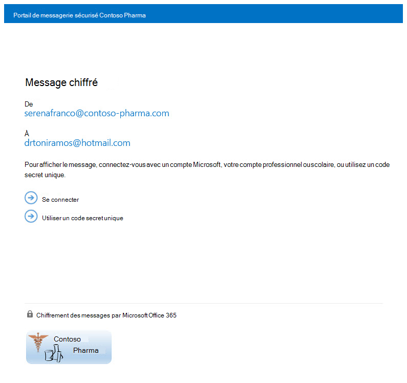

# <a name="legacy-information-for-office-365-message-encryption"></a>Informations héritées pour le chiffrement de messages Office 365

Si vous n’avez pas encore déplacé votre organisation vers les nouvelles fonctionnalités OME, mais que vous avez déjà déployé OME, les informations de cet article s’appliquent à votre organisation. Microsoft vous recommande d’effectuer un plan pour passer aux nouvelles fonctionnalités OME dès qu’il est raisonnable pour votre organisation. Pour obtenir des instructions, voir Configurer les nouvelles fonctionnalités de chiffrement de messages [Office 365](set-up-new-message-encryption-capabilities.md)intégrées à Azure Information Protection. Si vous souhaitez en savoir plus sur le fonctionnement des nouvelles fonctionnalités, consultez chiffrement de [messages Office 365.](ome.md) Le reste de cet article fait référence au comportement OME avant la publication des nouvelles fonctionnalités OME.
  
Avec chiffrement de messages Office 365, votre organisation peur envoyer et recevoir des messages chiffrés entre des personnes à l’intérieur et à l’extérieur de votre organisation. Le chiffrement de messages Office 365 fonctionne avec Outlook.com, Yahoo, Gmail et d’autres services de messagerie. Le chiffrement des messages électroniques permet de s’assurer que seuls les destinataires prévus peuvent afficher le contenu des messages.
  
Voici quelques exemples :
  
- Un employé de la banque envoie des relevés de carte de crédit aux clients

- Un représentant d’une compagnie d’assurance fournit des détails sur la stratégie aux clients

- Un courtier en prêts immobiliers demande des informations financières à un client pour une demande de prêt

- Un fournisseur de soins de santé envoie des informations sur les soins de santé aux patients

- Un avocat envoie des informations confidentielles à un client ou à un autre avocat

## <a name="how-office-365-message-encryption-works-without-the-new-capabilities"></a>Fonctionnement du chiffrement de messages Office 365 sans les nouvelles fonctionnalités

Le chiffrement de messages Office 365 est un service en ligne qui repose sur Microsoft Azure Rights Management (Azure RMS). Avec Azure RMS, les administrateurs peuvent définir des règles de flux de messagerie pour déterminer les conditions de chiffrement. Par exemple, une règle peut exiger le chiffrement de tous les messages adressés à un destinataire spécifique.
  
Lorsqu’une personne envoie un message électronique dans Exchange Online qui correspond à une règle de chiffrement, le message est envoyé avec une pièce jointe HTML. Le destinataire ouvre la pièce jointe HTML et suit les instructions pour afficher le message chiffré sur le portail de chiffrement de messages Office 365. Le destinataire peut choisir d’afficher le message en se signant à l’aide d’un compte Microsoft ou d’un établissement scolaire ou scolaire associé à Office 365, ou à l’aide d’un code de passage à usage seul. Les deux options vous permettent de vous assurer que seul le destinataire voulu peut afficher le message chiffré. Ce processus est très différent pour les nouvelles fonctionnalités OME.
  
Le diagramme suivant résume le passage d’un message électronique dans le processus de chiffrement et de déchiffrement.
  

  
Pour plus d’informations, consultez les informations de service pour le chiffrement de [messages Office 365](legacy-information-for-message-encryption.md#LegacyServiceInfo)hérité avant la publication des nouvelles fonctionnalités OME.
  
## <a name="defining-mail-flow-rules-for-office-365-message-encryption-that-dont-use-the-new-ome-capabilities"></a>Définition de règles de flux de messagerie pour le chiffrement de messages Office 365 qui n’utilisent pas les nouvelles fonctionnalités OME

Pour activer le chiffrement de messages Office 365 sans les nouvelles fonctionnalités, les administrateurs Exchange Online et Exchange Online Protection définissent des règles de flux de messagerie Exchange. Ces règles déterminent dans quelles conditions les messages électroniques doivent être chiffrés, ainsi que les conditions de suppression du chiffrement des messages. Lorsqu’une action de chiffrement est définie pour une règle, le service effectue l’action sur tous les messages qui correspondent aux conditions de règle avant d’envoyer les messages.

Les règles de flux de messagerie sont flexibles, ce qui vous permet de combiner des conditions afin de répondre à des exigences de sécurité spécifiques dans une seule règle. Par exemple, vous pouvez créer une règle pour chiffrer tous les messages qui contiennent les mots-clés spécifiés et adressés à des destinataires externes. Le chiffrement de messages Office 365 chiffre également les réponses des destinataires des messages chiffrés, et vous pouvez créer une règle qui déchiffre ces réponses pour la commodité de vos utilisateurs de messagerie. Ainsi, les utilisateurs de votre organisation n’auront pas à se connecter au portail de chiffrement pour afficher les réponses.
  
Pour plus d’informations sur la création de règles de flux de messagerie Exchange, voir Définir des règles pour le chiffrement de [messages Office 365.](define-mail-flow-rules-to-encrypt-email.md)
  
### <a name="use-the-eac-to-create-a-mail-flow-rule-for-encrypting-email-messages-without-the-new-ome-capabilities"></a>Utiliser le EAC pour créer une règle de flux de messagerie pour chiffrer les messages électroniques sans les nouvelles fonctionnalités OME

1. Dans un navigateur web, à l’aide d’un compte scolaire ou scolaire qui a reçu des autorisations d’administrateur général, connectez-vous [à Office 365.](https://support.office.com/article/b9582171-fd1f-4284-9846-bdd72bb28426#ID0EAABAAA=Web_browser)

2. Sélectionnez la **vignette** Administrateur.

3. Dans le Centre d’administration Microsoft 365, sélectionnez **Centres d’administration** \> **Exchange**.

4. Dans le EAC, sélectionnez Règles de **flux de** messagerie et sélectionnez Nouvelle icône \>  Créer une   \> **règle.** Pour plus d’informations sur l’utilisation du CENTRE d’administration Exchange, consultez le Centre [d’administration Exchange dans Exchange Online.](/exchange/exchange-admin-center)

5. In **Name**, type a name for the rule, such as Encrypt mail for DrToniRamos@hotmail.com.

6. Dans l’option **Appliquer cette règle si**, sélectionnez une condition, puis entrez une valeur si nécessaire. Par exemple, pour chiffrer les messages adressés à DrToniRamos@hotmail.com :

   1. Dans **Appliquer cette règle si**, sélectionnez **le destinataire est**.

   2. Choisissez un nom existant dans la liste de contacts ou entrez une nouvelle adresse de messagerie dans la zone **vérifier les noms**.

      - Pour sélectionner un nom existant, sélectionnez-le dans la liste et cliquez sur **OK**.

      - Pour entrer un nouveau nom, tapez une adresse e-mail dans la case à cocher **noms,** puis sélectionnez **vérifier les noms** \> **OK.**

7. Pour ajouter d’autres conditions, sélectionnez **Plus d’options,** puis **sélectionnez Ajouter une condition** et sélectionnez dans la liste.

   Par exemple, pour appliquer la règle uniquement si le destinataire est en dehors de votre organisation, sélectionnez Ajouter **une condition,** puis sélectionnez Le destinataire est **externe/interne** à l’extérieur de \> **l’organisation** \> **OK**.

8. Pour activer le chiffrement sans utiliser les nouvelles fonctionnalités OME, dans Faire les choses suivantes, sélectionnez Modifier la sécurité des **messages** Appliquer la version précédente d’OME, puis sélectionnez \>  **Enregistrer**.

   Si vous recevez une erreur selon qui la gestion des licences IRM n’est pas activée, vous n’utilisez pas OME hérité.

9. (Facultatif) Choisissez **d’ajouter une action** pour spécifier une autre action.

### <a name="use-exchange-online-powershell-to-create-a-mail-flow-rule-for-encrypting-email-messages-without-the-new-ome-capabilities"></a>Utiliser Exchange Online PowerShell pour créer une règle de flux de messagerie pour chiffrer les messages électroniques sans les nouvelles fonctionnalités OME

1. Connectez-vous à Exchange Online PowerShell. Pour plus d'informations, reportez-vous à [Connexion à Exchange Online](/powershell/exchange/connect-to-exchange-online-powershell).

2. Créez une règle à l’aide de la cmdlet **New-TransportRule** et définissez le _paramètre ApplyOME_ sur `$true` .

   Cet exemple exige que tous les messages électroniques envoyés DrToniRamos@hotmail.com soient chiffrés.

   ```powershell
   New-TransportRule -Name "Encrypt rule for Dr Toni Ramos" -SentTo "DrToniRamos@hotmail.com" -SentToScope "NotinOrganization" -ApplyOME $true
   ```

   où :

   - Le nom unique de la nouvelle règle est « Encrypt rule for Dr ToniSni ».
   - Le _paramètre SentTo_ spécifie les destinataires du message (identifiés par leur nom, leur adresse e-mail, leur nom, etc.). Dans cet exemple, le destinataire est identifié par l’adresse de messagerie « DrToniRamos@hotmail.com ».
   - Le _paramètre SentToScope_ spécifie l’emplacement des destinataires du message. Dans cet exemple, la boîte aux lettres du destinataire est dans hotmail et ne fait pas partie de l’organisation. La valeur `NotInOrganization` est donc utilisée.

   Pour obtenir des informations détaillées sur la syntaxe et les paramètres, voir [New-TransportRule](/powershell/module/exchange/New-TransportRule).

### <a name="remove-encryption-from-email-replies-encrypted-without-the-new-ome-capabilities"></a>Supprimer le chiffrement des réponses aux e-mails chiffrées sans les nouvelles fonctionnalités OME

Lorsque vos utilisateurs de messagerie envoient des messages chiffrés, les destinataires de ces messages peuvent y répondre par des réponses chiffrées. Vous pouvez créer des règles de flux de messagerie pour supprimer automatiquement le chiffrement des réponses afin que les utilisateurs de messagerie de votre organisation n’ont pas à se connecter au portail de chiffrement pour les afficher. Vous pouvez utiliser le EAC ou Windows PowerShell cmdlets pour définir ces règles. Vous pouvez déchiffrer les messages envoyés à partir de votre organisation ou les messages qui sont des réponses à des messages envoyés à partir de votre organisation. Vous ne pouvez pas déchiffrer les messages chiffrés provenant de l’extérieur de votre organisation.

#### <a name="use-the-eac-to-create-a-rule-for-removing-encryption-from-email-replies-encrypted-without-the-new-ome-capabilities"></a>Utiliser le EAC pour créer une règle de suppression du chiffrement des réponses de courrier chiffrées sans les nouvelles fonctionnalités OME

1. Dans un navigateur web, à l’aide d’un compte scolaire ou scolaire qui a reçu des autorisations d’administrateur, connectez-vous [à Office 365.](https://support.office.com/article/b9582171-fd1f-4284-9846-bdd72bb28426#ID0EAABAAA=Web_browser)

2. Sélectionnez la **vignette** Administrateur.

3. Dans le Centre d’administration Microsoft 365, sélectionnez **Centres d’administration** \> **Exchange**.

4. Dans le EAC, sélectionnez Règles de **flux de** messagerie et sélectionnez Nouvelle icône \>  Créer une   \> **règle.** Pour plus d’informations sur l’utilisation du CENTRE d’administration Exchange, consultez le Centre [d’administration Exchange dans Exchange Online.](/exchange/exchange-admin-center)

5. In **Name**, type a name for the rule, such as Remove encryption from incoming mail.

6. Dans **Appliquer cette règle, sélectionnez** les conditions dans laquelle  le chiffrement doit être supprimé des messages, telles que le destinataire se trouve à l’intérieur \> **de l’organisation.**

7. In **Do the following**, select Modify the message **security** Remove the previous version \> **of OME**.

8. Sélectionnez **Enregistrer**.

#### <a name="use-exchange-online-powershell-to-create-a-rule-to-remove-encryption-from-email-replies-encrypted-without-the-new-ome-capabilities"></a>Utiliser Exchange Online PowerShell pour créer une règle pour supprimer le chiffrement des réponses de courrier chiffrées sans les nouvelles fonctionnalités OME

1. Connectez-vous à Exchange Online PowerShell. Pour plus d'informations, reportez-vous à [Connexion à Exchange Online](/powershell/exchange/connect-to-exchange-online-powershell).

2. Créez une règle à l’aide de la cmdlet **New-TransportRule** et définissez _le paramètre RemoveOME_ sur `$true` .

   Cet exemple supprime le chiffrement de tous les messages envoyés aux destinataires de l’organisation.

   ```powershell
   New-TransportRule -Name "Remove encryption from incoming mail" -SentToScope "InOrganization" -RemoveOME $true
   ```

   où :

   - Le nom unique de la nouvelle règle est « Supprimer le chiffrement du courrier entrant ».
   - Le _paramètre SentToScope_ spécifie l’emplacement des destinataires du message. Dans cet exemple, la valeur `InOrganization` est utilisée, ce qui indique l’une des valeurs suivantes :
     - Le destinataire est une boîte aux lettres, un utilisateur de messagerie, un groupe ou un dossier public à messagerie dans votre organisation.
     - L’adresse e-mail du destinataire se trouve dans un domaine accepté configuré en tant que domaine faisant autorité ou domaine de relais interne dans votre _organisation,_ et le message a été envoyé ou reçu sur une connexion authentifiée.

Pour obtenir des informations détaillées sur la syntaxe et les paramètres, voir [New-TransportRule](/powershell/module/exchange/New-TransportRule).

## <a name="sending-viewing-and-replying-to-messages-encrypted-without-the-new-capabilities"></a>Envoi, affichage et réponse à des messages chiffrés sans les nouvelles fonctionnalités

Avec le chiffrement de messages Office 365, les messages électroniques sont chiffrés automatiquement, en fonction des règles définies par l’administrateur. Un e-mail qui envoie un message chiffré arrive dans la boîte de réception du destinataire avec un fichier HTML joint.
  
Les destinataires suivent les instructions du message pour ouvrir la pièce jointe et s’authentifier à l’aide d’un compte Microsoft ou d’un établissement scolaire ou scolaire associé à Office 365. Si les destinataires n’ont aucun compte, ils sont dirigés vers la création d’un compte Microsoft qui leur permettra de se connecter pour afficher le message chiffré. Les destinataires peuvent également choisir d’obtenir un code de passe à une seule fois pour afficher le message. Après la connexion ou l’utilisation d’un code de passe à usage seul, les destinataires peuvent afficher le message déchiffré et envoyer une réponse chiffrée.
  
## <a name="customize-encrypted-messages-with-office-365-message-encryption"></a>Personnaliser les messages chiffrés avec le chiffrement de messages Office 365

En tant qu’administrateur Exchange Online et Exchange Online Protection, vous pouvez personnaliser vos messages chiffrés. Par exemple, vous pouvez ajouter la marque et le logo de votre entreprise, spécifier une introduction et ajouter un texte de clause d’exclusion de responsabilité dans les messages chiffrés et dans le portail où les destinataires visualisent vos messages chiffrés. Avec les cmdlets Windows PowerShell, vous pouvez personnaliser les aspects suivants de l’expérience d’affichage des destinataires de messages électroniques chiffrés :

- Le texte d’introduction du message électronique contenant le message chiffré

- Le texte d’exclusion de responsabilité du message électronique contentant le message chiffré

- Le texte du portail qui apparaîtra dans le portail d’affichage des messages

- Le logo qui apparaîtra dans le message électronique et le portail d’affichage

Vous pouvez également rétablir l’apparence par défaut à tout moment.
  
L’exemple suivant montre un logo personnalisé pour ContosoPharma dans la pièce jointe d’un message électronique :

> [!div class="mx-imgBorder"]
> 
  
**Pour personnaliser les messages électroniques de chiffrement et le portail de chiffrement avec la marque de votre organisation**
  
1. Connectez-vous à Exchange Online à l’aide de Remote PowerShell, comme décrit dans La connexion à [Exchange Online à l’aide de Remote PowerShell](/powershell/exchange/connect-to-exchange-online-powershell).

2. Utilisez la cmdlet Set-OMEConfiguration comme décrit ici : [Set-OMEConfiguration](/powershell/module/exchange/set-omeconfiguration) ou utilisez le tableau suivant pour obtenir des conseils.

   **Options de personnalisation du chiffrement**

   | Pour personnaliser cette fonctionnalité de l’expérience de chiffrement | Utiliser ces commandes Windows PowerShell |
   |:-----|:-----|
   |Texte par défaut qui accompagne les messages électroniques chiffrés  <br/> Texte par défaut qui s’affiche au-dessus des instructions relatives à l’affichage des messages chiffrés  <br/> | `Set-OMEConfiguration -Identity <OMEConfigurationIdParameter> -EmailText "<string of up to 1024 characters>"` <br/> **Exemple :** `Set-OMEConfiguration -Identity "OME Configuration" -EmailText "Encrypted message from ContosoPharma secure messaging system"` <br/> |
   |Déclaration de non-responsabilité du message électronique qui contient le message chiffré  <br/> | `Set-OMEConfiguration -Identity <OMEConfigurationIdParameter> DisclaimerText "<your disclaimer statement, string of up to 1024 characters>"` <br/> **Exemple :** `Set-OMEConfiguration -Identity "OME Configuration" -DisclaimerText "This message is confidential for the use of the addressee only"` <br/> |
   |Texte qui s’affiche en haut du portail d’affichage du message chiffré  <br/> | `Set-OMEConfiguration -Identity <OMEConfigurationIdParameter> -PortalText "<text for your portal, string of up to 128 characters>"` <br/> **Exemple :** `Set-OMEConfiguration -Identity "OME Configuration" -PortalText "ContosoPharma secure email portal"` <br/> |
   |Logo  <br/> | `Set-OMEConfiguration -Identity <OMEConfigurationIdParameter> -Image <Byte[]>` <br/> **Exemple :** `Set-OMEConfiguration -Identity "OME configuration" -Image (Get-Content "C:\Temp\contosologo.png" -Encoding byte)` <br/> Formats de fichier pris en charge : .png, .jpg, .bmp ou .tiff  <br/> Taille optimale du fichier de logo : moins de 40 Ko  <br/> Taille optimale de l’image de logo : 170x70 pixels  <br/> |

**Pour supprimer les personnalisations de marque des messages électroniques de chiffrement et du portail de chiffrement**
  
1. Connectez-vous à Exchange Online à l’aide de Remote PowerShell, comme décrit dans La connexion à [Exchange Online à l’aide de Remote PowerShell](/powershell/exchange/connect-to-exchange-online-powershell).

2. Utilisez la cmdlet Set-OMEConfiguration comme décrit ici [: Set-OMEConfiguration](/powershell/module/exchange/set-omeconfiguration). Pour supprimer les personnalisations de votre organisation des valeurs DisclaimerText, EmailText et PortalText, définissez la valeur sur une chaîne  `""` vide. Pour toutes les valeurs d’image, telles que Logo, définissez la valeur sur  `"$null"` .

   **Options de personnalisation du chiffrement**

   | Pour annuler cette fonctionnalité de chiffrement et rétablir le texte et l’image par défaut | Utilisez ces commandes Windows PowerShell |
   |:-----|:-----|
   |Texte par défaut qui accompagne les messages électroniques chiffrés  <br/> Texte par défaut qui s’affiche au-dessus des instructions relatives à l’affichage des messages chiffrés  <br/> | `Set-OMEConfiguration -Identity <OMEConfigurationIdParameter> -EmailText "<empty string>"` <br/> **Exemple :** `Set-OMEConfiguration -Identity "OME Configuration" -EmailText ""` <br/> |
   |Déclaration de non-responsabilité du message électronique qui contient le message chiffré  <br/> | `Set-OMEConfiguration -Identity <OMEConfigurationIdParameter> DisclaimerText "<empty string>"` <br/> **Exemple :** `Set-OMEConfiguration -Identity "OME Configuration" -DisclaimerText ""` <br/> |
   |Texte qui s’affiche en haut du portail d’affichage du message chiffré  <br/> | `Set-OMEConfiguration -Identity <OMEConfigurationIdParameter> -PortalText "<empty string>"` <br/> **Exemple de retour à la valeur par défaut :**`Set-OMEConfiguration -Identity "OME Configuration" -PortalText ""` <br/> |
   |Logo  <br/> | `Set-OMEConfiguration -Identity <OMEConfigurationIdParameter> -Image <"$null">` <br/> **Exemple de retour à la valeur par défaut :**`Set-OMEConfiguration -Identity "OME configuration" -Image $null` <br/> |

## <a name="service-information-for-legacy-office-365-message-encryption-prior-to-the-release-of-the-new-ome-capabilities"></a>Informations de service pour le chiffrement de messages Office 365 hérité avant la publication des nouvelles fonctionnalités OME
<a name="LegacyServiceInfo"> </a>

Le tableau suivant fournit des détails techniques pour le service de chiffrement de messages Office 365 avant la publication des nouvelles fonctionnalités OME.
  
| Détails du service | Description |
|:-----|:-----|
|Exigences relatives aux périphériques client  <br/> |Les messages chiffrés peuvent être affichés sur tous les périphériques client, tant que la pièce jointe HTML peut être ouverte dans un navigateur moderne qui prend en charge la publication de formulaire.  <br/> |
|Algorithme de chiffrement et conformité aux normes FIPS (Federal Information Processing Standards)  <br/> |Le chiffrement de messages Office 365 utilise les mêmes clés de chiffrement que la gestion des droits relatifs à l’information (IRM) de Windows Azure et prend en charge le mode de chiffrement 2 (clé 2K pour RSA et clé 256 bits pour les systèmes SHA-1). Pour plus d’informations sur les modes de chiffrement IRM sous-jacents, voir Modes de chiffrement [AD RMS.](/previous-versions/windows/it-pro/windows-server-2008-R2-and-2008/hh867439(v=ws.10))  <br/> |
|Types de messages pris en charge  <br/> |Le chiffrement de messages Office 365 est uniquement pris en charge pour les éléments avec un ID de classe de message **IPM.Note**. Pour plus d’informations, voir [Types d’éléments et classes de messages.](/office/vba/outlook/Concepts/Forms/item-types-and-message-classes)  <br/> |
|Tailles limites des messages  <br/> |Le chiffrement de messages Office 365 permet de chiffrer des messages d’une taille maximale de 25 Mo. Pour plus d’informations sur les limites de taille des messages, voir [Limites d’Exchange Online.](/office365/servicedescriptions/exchange-online-service-description/exchange-online-limits)  <br/> |
|Stratégies de rétention de messagerie Exchange Online  <br/> |Exchange Online ne stocke pas les messages chiffrés.  <br/> |
|Prise en charge linguistique pour le chiffrement de messages Office 365  <br/> | Le chiffrement de messages Office 365 prend en charge les langues Microsoft 365, comme suit :  <br/>  Les messages électroniques entrants et les fichiers HTML joints sont localisées en fonction des paramètres de langue de l’expéditeur.  <br/>  Le portail d’affichage est localisé en fonction des paramètres de navigateur du destinataire.  <br/>  Le corps (contenu) du message chiffré n’est pas localisé.  <br/> |
|Informations de confidentialité pour le portail OME et l’application Visionneuse OME  <br/> |La [Office 365 Messaging Encryption Portal privacy statement](https://privacy.microsoft.com/privacystatement) fournit des informations détaillées sur ce que fait et ne fait pas Microsoft avec vos informations privées.  <br/> |

## <a name="frequently-asked-questions-about-legacy-ome"></a>Questions fréquemment posées sur l’OME hérité
<a name="LegacyServiceInfo"> </a>

Vous avez des questions sur le chiffrement de messages Office 365 ? Voici les réponses à certaines questions fréquemment posées. Si vous ne trouvez pas ce dont vous avez besoin, consultez les forums de la communauté [technique Microsoft pour Office 365.](https://techcommunity.microsoft.com/t5/Office-365/ct-p/Office365)
  
 **Q. Mes utilisateurs envoient des messages électroniques chiffrés à des destinataires externes à notre organisation. Les destinataires externes doivent-ils faire quelque chose pour lire et répondre à des messages électroniques chiffrés avec le chiffrement de messages Office 365 ?**
  
Les destinataires extérieurs à votre organisation qui reçoivent des messages chiffrés Microsoft 365 peuvent les afficher de deux manières :
  
- En vous signant à l’aide d’un compte Microsoft ou d’un compte scolaire ou scolaire associé à Office 365.

- À l’aide d’un code de passe à usage seul.

 **Q. Les messages chiffrés Microsoft 365 sont-ils stockés dans le cloud ou sur des serveurs Microsoft ?**
  
Non, les messages chiffrés sont conservés sur le système de messagerie du destinataire et, lorsque le destinataire ouvre le message, il est temporairement publié pour être affiché sur les serveurs Microsoft. Les messages électroniques n’y sont pas stockés.
  
 **Q. Puis-je personnaliser les messages chiffrés avec ma marque ?**
  
Oui. Vous pouvez utiliser les cmdlets Windows PowerShell pour personnaliser le texte par défaut qui apparaît en haut des messages électroniques chiffrés, la clause d’exclusion de responsabilité et le logo que vous souhaitez utiliser pour le message électronique et le portail de chiffrement. Cette fonctionnalité est désormais disponible dans OMEv2. Pour plus d’informations, voir [Add branding to encrypted messages](add-your-organization-brand-to-encrypted-messages.md).
  
 **Q. Le service exige-t-il une licence pour chaque utilisateur de mon organisation ?**
  
Une licence est obligatoire pour chaque utilisateur de l’organisation qui envoie des messages chiffrés.
  
 **Q. Les destinataires externes exigent-ils des abonnements ?**
  
Non, les destinataires externes n’ont pas besoin d’un abonnement pour lire ou répondre à des messages chiffrés.
  
 **Q. En quoi le chiffrement de messages Office 365 est-il différent des services RMS (Rights Management Services) ?**
  
RMS fournit des fonctionnalités de protection des droits de l’information pour les messages électroniques internes d’une organisation en fournissant des modèles intégrés, tels que : Ne pas forward et Company Confidential. Le chiffrement de messages Office 365 prend en charge le chiffrement des messages électroniques pour ceux envoyés à des destinataires externes et internes.
  
 **Q. En quoi le chiffrement de messages Office 365 est-il différent de S/MIME ?**
  
S/MIME est essentiellement une technologie de chiffrement côté client et exige une gestion de certificats et une infrastructure de publication complexes. Le chiffrement de messages Office 365 utilise des règles de flux de messagerie (également appelées règles de transport) et ne dépend pas de la publication de certificats.
  
 **Q. Puis-je lire les messages chiffrés sur des appareils mobiles ?**
  
Oui, vous pouvez afficher les messages sur Android et iOS en téléchargeant les applications visionneuse OME à partir du Google Play Store et de l’App Store d’Apple. Ouvrez la pièce jointe HTML dans l’application OME Viewer, puis suivez les instructions pour ouvrir votre message chiffré. Pour les autres appareils mobiles, vous pouvez ouvrir la pièce jointe HTML à condition que votre client de messagerie prenne en charge la publication de formulaire.
  
 **Q. Les réponses et les messages transférés sont-ils chiffrés ?**
  
Oui. Les réponses restent chiffrées pendant toute la durée du thread.
  
 **Q. Le chiffrement de messages Office 365 fournit-il une localisation ?**
  
Le contenu HTML et les messages électroniques entrants sont localisés en fonction des paramètres de messagerie de l’expéditeur. Le portail d’affichage est localisé en fonction des paramètres de navigateur du destinataire. Cependant, le corps réel (le contenu) du message chiffré n’est pas localisé.
  
 **Q. Quelle méthode de chiffrement est utilisée pour le chiffrement de messages Office 365 ?**
  
Le chiffrement de messages Office 365 utilise rights management services (RMS) comme infrastructure de chiffrement. La méthode de chiffrement utilisée dépend de l’endroit où vous obtenez les clés RMS servant à chiffrer et déchiffrer les messages.
  
- Si vous utilisez Microsoft Azure RMS pour obtenir les clés, le mode de chiffrement 2 est utilisé. Le mode de chiffrement 2 est un processus de chiffrement AD RMS amélioré et mis à jour. Il prend en charge RSA 2048 pour la signature et le chiffrement, et SHA 256 pour la signature.

- Si vous utilisez Active Directory (AD) RMS pour obtenir les clés, le mode de chiffrement 1 ou 2 est utilisé. La méthode utilisée dépend de votre déploiement AD RMS local. Le mode de chiffrement 1 est le processus de chiffrement d’origine AD RMS. Il prend en charge RSA 1024 pour la signature et le chiffrement, et SHA-1 pour la signature. Ce mode est encore pris en charge par toutes les versions actuelles de RMS.

Pour plus d’informations, voir Modes de chiffrement [AD RMS.](/previous-versions/windows/it-pro/windows-server-2008-R2-and-2008/hh867439(v=ws.10))
  
**Q. Pourquoi certains messages chiffrés pensent-ils qu’ils proviennent** de Office365@messaging.microsoft.com ?
  
Lorsqu’une réponse chiffrée est envoyée à partir du portail de chiffrement ou via l’application Visionneuse OME, l’adresse de messagerie de l’expéditeur est définie sur Office365@messaging.microsoft.com, car le message chiffré est envoyé par le biais d’un point de terminaison Microsoft. Cela permet d’éviter que les messages chiffrés soient marqués comme courrier indésirable. Le nom affiché dans le message électronique et l’adresse dans le portail de chiffrement ne sont pas modifiés en raison de cet étiquetage. En outre, cet étiquetage s’applique uniquement aux messages envoyés via le portail, et non par le biais de n’importe quel autre client de messagerie.
  
 **Q. Je suis abonné à Exchange Hosted Encryption (EHE). Où puis-je en savoir plus sur la mise à niveau vers le chiffrement de messages Office 365 ?**
  
Tous les clients EHE ont été mis à niveau vers le chiffrement de messages Office 365. Pour plus d’informations, visitez le Centre de mise [à niveau de chiffrement hébergé Exchange.](../security/defender-365-security/exchange-online-protection-overview.md)
  
 **Q. Ai-je besoin d’ouvrir des URL, des adresses IP ou des ports dans le pare-feu de mon organisation pour prendre en charge le chiffrement de messages Office 365 ?**
  
Oui. Vous devez ajouter des URL à la liste d’adresses autorisées pour Exchange Online afin que votre organisation permette l’authentification des messages chiffrés par Office 365. Pour obtenir la liste des URL Exchange Online, voir [URL et plages d’adresses IP Microsoft 365.](../enterprise/urls-and-ip-address-ranges.md)
  
 **Q. À combien de destinataires puis-je envoyer un message chiffré Microsoft 365 ?**
  
La limite de destinataires est de 500 destinataires par message, ou, lorsqu’elle est combinée après l’extension de la liste de distribution, de 11 980 caractères dans le champ **À** du message, selon la première étape.
  
 **Q : Est-il possible de révoquer un message envoyé à un destinataire particulier ?**
  
Non. Vous ne pouvez pas révoquer un message à une personne particulière après son envoi.
  
 **Q : Puis-je afficher un rapport des messages chiffrés qui ont été reçus et lus ?**
  
Il n’existe pas de rapport qui indique si un message chiffré a été vu, mais il existe des rapports Microsoft 365 disponibles que vous pouvez utiliser pour déterminer le nombre de messages qui correspondent à une règle de flux de messagerie spécifique (également appelée règle de transport), par exemple.
  
 **Q. Que fait Microsoft des informations que je fournis par le biais du portail OME et de l’application Visionneuse OME ?**
  
La déclaration de confidentialité du portail de chiffrement de messagerie [Office 365](https://privacy.microsoft.com/privacystatement) fournit des informations détaillées sur ce que Microsoft fait et ne fait pas avec vos informations privées.

**Q. Que faire si je ne reçois pas le code de passe à temps partiel après l’avoir demandé ?**

Tout d’abord, vérifiez le dossier courrier indésirable ou indésirable dans votre client de messagerie. Les paramètres DKIM et DMARC de votre organisation peuvent entraîner le filtrage de ces messages électroniques comme courrier indésirable.

Ensuite, vérifiez la quarantaine dans le Centre de sécurité & conformité. Souvent, les messages contenant un code de passe à temps partiel, en particulier les premiers que votre organisation reçoit, sont mis en quarantaine.