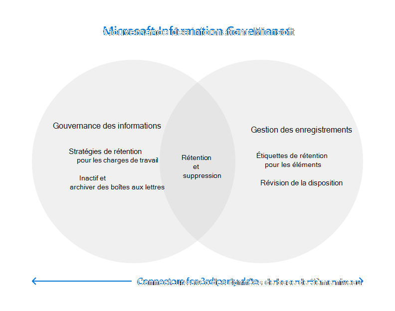

# Gouvernance des informations dans Microsoft 365

>*[Guide de sécurité et conformité pour les licences Microsoft 365](/office365/servicedescriptions/microsoft-365-service-descriptions/microsoft-365-tenantlevel-services-licensing-guidance/microsoft-365-security-compliance-licensing-guidance).*

Utilisez les fonctionnalités de gouvernance des informations de Microsoft (parfois abrégé en MIG) pour gérer vos données en matière de conformité ou d’obligations réglementaires.

Du [point de vue des licences](#licensing-requirements), il peut y avoir un chevauchement considérable entre la gouvernance des informations, la gestion des enregistrements et les connecteurs de données. Les trois domaines prennent en charge la rétention et la suppression des données dans Microsoft 365. Les connecteurs sont utilisés par des solutions de conformité autres que la gouvernance des informations et la gestion des enregistrements. 

Utilisez le graphique suivant pour vous aider à identifier les principaux composants configurables pour ces trois solutions différentes qui ont chacune leur propre nœud dans le centre de conformité :

Vous souhaitez protéger vos données ? Consultez l’article [Découvrir Microsoft Information Protection dans Microsoft 365](information-protection.md).

## Gouvernance des informations

Pour conserver ce dont vous avez besoin et supprimer ce dont vous n’avez pas besoin :
 
|Fonctionnalité|Utilité|Prise en main|
|:------|:------------|:--------------------|:-----------------------------|
|[Stratégies de rétention pour les charges de travail Microsoft 365, avec des étiquettes de rétention pour les exceptions](retention.md) | Conserver ou supprimer du contenu avec la gestion des stratégies pour les messages électroniques, les documents, Teams et Yammer | [Créer et configurer des stratégies de rétention](create-retention-policies.md)    [Créer des étiquettes de rétention pour les exceptions à vos stratégies de rétention](create-retention-labels-information-governance.md)|
|[Boîtes aux lettres d'archivage](archive-mailboxes.md)| Fournit aux utilisateurs un espace de stockage de boîte aux lettres supplémentaire | [Activer des boîtes aux lettres d’archivage](enable-archive-mailboxes.md) |
|[Boîtes aux lettres inactives](inactive-mailboxes-in-office-365.md)| Conserver le contenu des boîtes aux lettres après que le départ des employés de l’organisation afin que ce contenu reste accessible aux administrateurs, aux responsables de la mise en conformité et aux responsables des enregistrements | [Créer et gérer les boîtes aux lettres inactives](create-and-manage-inactive-mailboxes.md)|
|[Service d’importation pour les fichiers PST](importing-pst-files-to-office-365.md)| Importer en masse des fichiers PST dans des boîtes aux lettres Exchange Online pour conserver et rechercher des messages électroniques pour respecter la conformité ou les obligations réglementaires | [Utilisez le téléchargement réseau pour importer les fichiers PST de votre organisation dans Microsoft 365](use-network-upload-to-import-pst-files.md)|

## Gestion des enregistrements

Gestion du cycle de vie des éléments à valeur élevée pour les obligations légales, commerciales ou réglementaires :

|Fonctionnalité|Utilité|Prise en main|
|:------|:------------|---------------------|:----------------------------|
|[Gestion des enregistrements](records-management.md)| Solution unique pour les e-mails et les documents qui intègre des planifications de rétention et de suppression flexibles et des exigences pour prendre en charge le cycle de vie complet de votre contenu avec déclaration d’enregistrements et disposition pouvant être prise en charge en cas de besoin |[Prise en main de la gestion des enregistrements](get-started-with-records-management.md) |

## Connecteurs pour les données tierces

Étendez vos outils de conformité aux données tierces importées et archivées à partir de plateformes de réseaux sociaux, de plateformes de messagerie instantanée et de plateformes de collaboration de documents :

|Fonctionnalité|Utilité|Prise en main|
|:------|:------------|:--------------------|:-----------------------------|
|[Connecteurs de données](archiving-third-party-data.md)| Importer, archiver et appliquer des solutions de conformité aux données tierces des plateformes de réseaux sociaux, des plateformes de messagerie instantanée et des plateformes de collaboration sur les documents| [Connecteurs tiers](archiving-third-party-data.md#third-party-data-connectors)|

## Critères de licence

Les critères de licence pour la Gouvernance des informations Microsoft dépendent des scénarios et des fonctionnalités que vous utilisez, plutôt que de définir des critères de licence pour chaque fonctionnalité répertoriée sur cette page. Pour comprendre vos exigences et options de licence, consultez les sections suivantes de la [documentation sur les licences Microsoft 365](/office365/servicedescriptions/microsoft-365-service-descriptions/microsoft-365-tenantlevel-services-licensing-guidance/microsoft-365-security-compliance-licensing-guidance): 
- [Gouvernance des informations](/office365/servicedescriptions/microsoft-365-service-descriptions/microsoft-365-tenantlevel-services-licensing-guidance/microsoft-365-security-compliance-licensing-guidance#information-governance) 
- [Gestion des enregistrements](/office365/servicedescriptions/microsoft-365-service-descriptions/microsoft-365-tenantlevel-services-licensing-guidance/microsoft-365-security-compliance-licensing-guidance#records-management) 
- [Connecteurs de données](/office365/servicedescriptions/microsoft-365-service-descriptions/microsoft-365-tenantlevel-services-licensing-guidance/microsoft-365-security-compliance-licensing-guidance#data-connectors)

Toutes les exigences de licence supplémentaires seront incluses dans les instructions de documentation. Par exemple, les licences spécifiques à la gestion des boîtes aux lettres peuvent nécessiter des licences d’Exchange Online.

