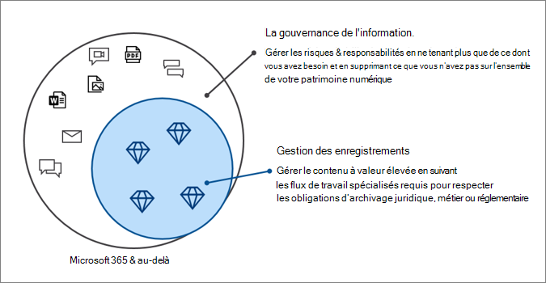

# Gouvernance des informations dans Microsoft 365

>*[Guide de sécurité et conformité pour les licences Microsoft 365](/office365/servicedescriptions/microsoft-365-service-descriptions/microsoft-365-tenantlevel-services-licensing-guidance/microsoft-365-security-compliance-licensing-guidance).*

Utilisez les fonctionnalités de gouvernance des informations de Microsoft (parfois abrégé en MIG) pour gérer vos données en matière de conformité ou d’obligations réglementaires.

Vous souhaitez protéger vos données ? Consultez l’article [Découvrir Microsoft Information Protection dans Microsoft 365](information-protection.md).

Pour vous aider à vous conformer aux réglementations relatives à la confidentialité des données, nous avons conçu un flux de travail pour vous guider tout au long d’un processus de bout en bout pour planifier et implémenter des fonctionnalités au sein de Microsoft 365, notamment l’accès sécurisé, la protection contre les menaces, la protection des informations et la gouvernance des données. Pour plus d’informations, consultez [Déployer la protection des informations pour les réglementations de la confidentialité des données avec Microsoft 365](../solutions/information-protection-deploy.md) (aka.ms/m365dataprivacy). 

## Gouvernance des informations

Pour conserver ce dont vous avez besoin et supprimer ce dont vous n’avez pas besoin :
 
|Fonctionnalité|Utilité|Prise en main|
|:------|:------------|:--------------------|:-----------------------------|
|[Stratégies de rétention et étiquettes de rétention.](retention.md)| Conserver ou supprimer du contenu avec la gestion des stratégies et un flux de travail de suppression pour les e-mails, les documents, les messages instantanés, etc.   Exemple de scénario : [appliquer automatiquement une étiquette de rétention au contenu](apply-retention-labels-automatically.md) | [Prise en main des stratégies et des étiquettes de rétention](get-started-with-retention.md)|
|[Service importation](importing-pst-files-to-office-365.md)| Importer en masse des fichiers PST dans des boîtes aux lettres Exchange Online pour conserver et rechercher des messages électroniques pour respecter la conformité ou les obligations réglementaires | [Utilisez le téléchargement réseau pour importer les fichiers PST de votre organisation dans Microsoft 365](use-network-upload-to-import-pst-files.md)|
|[Archiver des données tierces](archiving-third-party-data.md)| Importer, archiver et appliquer des solutions de conformité aux données tierces des plateformes de réseaux sociaux, des plateformes de messagerie instantanée et des plateformes de collaboration sur les documents| [Connecteurs tiers](archiving-third-party-data.md#third-party-data-connectors)|
|[Boîtes aux lettres inactives](inactive-mailboxes-in-office-365.md)| Conserver le contenu de la boîte aux lettres après le départ des employés de l’organisation | [Créer et gérer les boîtes aux lettres inactives](create-and-manage-inactive-mailboxes.md)|

## Gestion des enregistrements

Pour gérer un contenu à forte valeur ajoutée pour respecter les obligations légales, commerciales ou réglementaires :

|Fonctionnalité|Utilité|Prise en main|
|:------|:------------|---------------------|:----------------------------|
|[Gestion des enregistrements](records-management.md)| Une solution unique pour les e-mails et les documents qui intègre les calendriers et les obligation de rétention dans un plan de gestion de fichiers qui prend en charge le cycle de vie complet de votre contenu avec la déclaration, la rétention et la destruction des enregistrements   Exemple de scénario : [Destruction des enregistrements](disposition.md#disposition-of-records)|[Prise en main de la gestion des enregistrements](get-started-with-records-management.md) |

## Critères de licence

Les critères de licence pour la Gouvernance des informations Microsoft dépendent des scénarios et des fonctionnalités que vous utilisez, plutôt que de définir des critères de licence pour chaque fonctionnalité répertoriée sur cette page. Pour comprendre les options et les critères de votre licence, voir les sections [Gouvernance des informations](/office365/servicedescriptions/microsoft-365-service-descriptions/microsoft-365-tenantlevel-services-licensing-guidance/microsoft-365-security-compliance-licensing-guidance#information-governance) et [Gestion des enregistrements](/office365/servicedescriptions/microsoft-365-service-descriptions/microsoft-365-tenantlevel-services-licensing-guidance/microsoft-365-security-compliance-licensing-guidance#records-management) dans la documentation sur les licences Microsoft 365, puis télécharger le fichier PDF ou Excel associé.