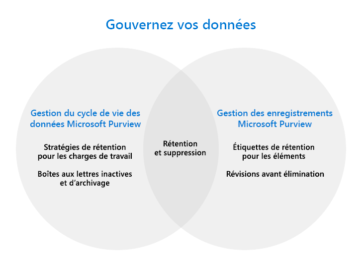

# Régir vos données avec Microsoft Purview

>*[Guide de sécurité et conformité pour les licences Microsoft 365](/office365/servicedescriptions/microsoft-365-service-descriptions/microsoft-365-tenantlevel-services-licensing-guidance/microsoft-365-security-compliance-licensing-guidance).*

[!include[Purview banner](../includes/purview-rebrand-banner.md)]

Utilisez les fonctionnalités de **Gestion du cycle de vie des données Microsoft Purview** (anciennement Microsoft Information Governance) et **de gestion des enregistrements Microsoft Purview** pour régir vos données à des fins de conformité ou de réglementation.

> [!TIP]
> Vous cherchez à mapper et à gérer vos données dans l’ensemble de votre patrimoine de données, y compris multicloud et saaS (software-as-a-service) ? Utilisez [Microsoft Purview Data Map, Catalogue de données Microsoft Purview et Microsoft Purview Data Estate Insights](/azure/purview/overview).

Du [point de vue des licences](#licensing-requirements), il peut y avoir un chevauchement considérable entre la gestion du cycle de vie des données et la gestion des enregistrements. Les deux solutions prennent en charge la conservation et la suppression des données pour les applications et services Microsoft 365.

Utilisez le graphique suivant pour vous aider à identifier les principaux composants configurables de ces solutions, qui disposent chacun de sa propre zone de configuration dans le portail de conformité Microsoft Purview :

Les sections suivantes détaillent les principales fonctionnalités de chaque solution, avec des liens pour en savoir plus. Toutefois, si vous recherchez un déploiement guidé, consultez [Déployer une solution de gouvernance des données avec Microsoft Purview](data-governance-solution.md).

Vous recherchez des fonctionnalités complémentaires pour protéger vos données ? Consultez [Protéger vos données avec Microsoft Purview](information-protection.md).

## Gestion du cycle de vie des données Microsoft Purview

Pour conserver ce dont vous avez besoin et supprimer ce dont vous n’avez pas besoin :
 
|Fonctionnalité|Utilité|
|:------|:------------|:----------------|
|[Stratégies de rétention pour les charges de travail Microsoft 365, avec des étiquettes de rétention pour les exceptions](retention.md) | Conserver ou supprimer du contenu avec la gestion des stratégies pour les courriels, les documents, les messages Teams et Yammer. |
|[Boîtes aux lettres inactives](inactive-mailboxes-in-office-365.md)| Conserver le contenu des boîtes aux lettres après que le départ des employés de l’organisation afin que ce contenu reste accessible aux administrateurs, aux responsables de la mise en conformité et aux responsables des enregistrements. |
|[Boîtes aux lettres d'archivage](archive-mailboxes.md)| Fournit aux utilisateurs un espace de stockage de boîte aux lettres supplémentaire.|
|[Service d’importation pour les fichiers PST](importing-pst-files-to-office-365.md)| Prend en charge l'importation en masse de fichiers PST vers les boîtes aux lettres Exchange Online afin de conserver et de rechercher des messages électroniques pour répondre aux exigences de conformité ou de réglementation. |

Vous voulez en savoir plus ? Consultez [En savoir plus sur la gestion du cycle de vie des données](data-lifecycle-management.md).

Êtes-vous à utiliser une partie ou l’ensemble de ces fonctionnalités ? Consultez [Démarrage avec la gestion du cycle de vie des données](get-started-with-data-lifecycle-management.md).

## Gestion des enregistrements Microsoft Purview

Gérez les éléments à valeur élevée pour les exigences de conservation des enregistrements professionnelles, légales ou réglementaires :

|Fonctionnalité|Utilité|
|:---------|:---------------------------|
|[Plan de gestion de fichiers](file-plan-manager.md)| Permet de créer des étiquettes de rétention de manière interactive ou de les importer en masse, et de les exporter pour analyse. Les étiquettes prennent en charge des informations administratives supplémentaires (facultatives) pour vous aider à identifier et à suivre les exigences commerciales ou réglementaires. |
|[Étiquettes de rétention pour des éléments individuels, stratégies de rétention si nécessaire pour la rétention de référence](retention.md)| Les étiquettes prennent en charge des planifications de rétention et de suppression flexibles qui peuvent être appliquées manuellement ou automatiquement, avec une déclaration d’enregistrements si nécessaire. |
|[Révision de disposition et preuve de destruction](disposition.md)| Révision manuelle du contenu avant sa suppression définitive, avec preuve de destruction des enregistrements.|

Vous voulez en savoir plus ? Consultez [En savoir plus sur la gestion des enregistrements](records-management.md).

Êtes-vous à utiliser une partie ou l’ensemble de ces fonctionnalités ? Veuillez consulter la page [Prise en main de la gestion des enregistrements](get-started-with-records-management.md).

## Conditions d'octroi de licence

Pour comprendre vos exigences et options de licence, consultez les sections suivantes de la [documentation sur les licences Microsoft 365](/office365/servicedescriptions/microsoft-365-service-descriptions/microsoft-365-tenantlevel-services-licensing-guidance/microsoft-365-security-compliance-licensing-guidance): 
- [Gestion du cycle de vie des données Microsoft Purview](/office365/servicedescriptions/microsoft-365-service-descriptions/microsoft-365-tenantlevel-services-licensing-guidance/microsoft-365-security-compliance-licensing-guidance#microsoft-purview-data-lifecycle-management)
- [Gestion des enregistrements Microsoft Purview](/office365/servicedescriptions/microsoft-365-service-descriptions/microsoft-365-tenantlevel-services-licensing-guidance/microsoft-365-security-compliance-licensing-guidance#microsoft-purview-records-management)

Toutes les exigences de licence supplémentaires seront incluses dans les instructions de documentation. Par exemple, les licences spécifiques à la gestion des boîtes aux lettres peuvent nécessiter des licences d’Exchange Online.