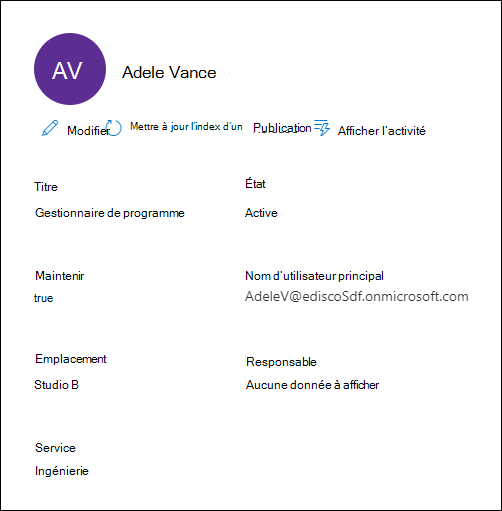

# Gérer les consignats dans un cas eDiscovery (Premium)

[!include[Purview banner](../includes/purview-rebrand-banner.md)]

La page **Consignations** de l’onglet **Sources de données** dans un cas de découverte électronique Microsoft Purview (Premium) contient une liste de tous les consignatateurs qui ont été ajoutés au cas. Une fois que vous avez ajouté des consignatateurs à un cas, les détails relatifs à chaque consignateur sont automatiquement collectés à partir de Azure Active Directory et sont visibles dans eDiscovery (Premium).

## Afficher les détails du consignatateur

Pour afficher les détails d’un consigna ateur, cliquez sur celui-ci dans la liste sous l’onglet **Consignats** . Une page de menu volant s’affiche et contient les informations suivantes sur le consignateur.

- Informations de contact

  - **Titre** Titre du travail du gardien.
  
  - **Nom d’utilisateur principal**. Nom d’utilisateur principal (UPN) pour le consignateur, par exemple, AdeleV@contoso.onmicrosoft.com.
  
  - **Emplacement :** Emplacement du bureau dans le lieu d’affaires du gardien.
  
  - **Gestionnaire**. Le responsable du consigna ateur. Le responsable désigné recevra toutes les communications d’escalade pour ce consignaculateur.
  
  - **Département**. Nom du service dans lequel le gardien travaille.

- Informations de cas

  - **État**. État du consigna ateur dans l’affaire. L’état **Actif** indique que le gardien fait partie du cas. Si un dépositaire est libéré d’un cas, l’état est remplacé par **Released**.
  
  - **Maintenez la touche enfoncée**. Indique si le consigna ateur a été mis en attente.

- Emplacements de données et informations de conservation

  

  - **Emplacements de garde**. Affiche le nombre et le type de sources de données (boîtes aux lettres, sites et Teams) associées au consignat et faisant partie du cas.

    - Chaque emplacement de données affiche son état de conservation. Valeurs possibles pour l’état de conservation : **En attente**, **Non en attente** et **En cours**.

    - Si vous ne voyez pas d’état de conservation pour une source de données, vérifiez l’état de la conservation du consignateur répertoriée sous l’onglet **Conservation** pour le cas. La conservation du consignateur identifie les sources de données spécifiques qui sont mises en attente.

## Modifier un consigna ateur

À mesure que votre cas progresse, vous pouvez découvrir qu’il peut y avoir d’autres sources de données pertinentes pour un responsable spécifique et le cas. Dans d’autres scénarios, vous souhaiterez peut-être supprimer certaines sources de données qui ont été examinées et considérées comme non pertinentes.

Pour mettre à jour les sources de données associées à un consignateur :

1. Accédez à **eDiscovery > eDiscovery (Premium)** et ouvrez le cas.
  
2. Cliquez sur l’onglet **Sources de données** .
  
3. Sélectionnez un consignateur dans la liste, puis cliquez sur **Modifier** dans la page de menu volant.

    
  
4. Pour ajouter ou supprimer la boîte aux lettres principale et OneDrive compte du consignateur :

    - Développez le consignateur pour afficher les emplacements de données principaux qui ont été précédemment associés au consignateur.

    - Cliquez sur **Modifier** en regard de boîte **aux lettres** ou **OneDrive** pour ajouter la boîte aux lettres ou l’emplacement OneDrive du consignateur.

    - Sélectionnez **Effacer** en regard de la **boîte aux lettres** ou **OneDrive** pour supprimer la boîte aux lettres ou le compte OneDrive du consignateur d’être associé en tant qu’emplacement de données pour ce consignateur.

5. Pour ajouter ou supprimer d’autres boîtes aux lettres, sites, Teams ou groupes Yammer à un consignateur spécifique, cliquez sur **Modifier** en regard du service pour ajouter un emplacement de données.

   - **Exchange** : permet d’associer d’autres boîtes aux lettres au consignateur. Tapez dans la zone de recherche le nom ou l’alias (au moins trois caractères) des boîtes aux lettres utilisateur ou des groupes de distribution. Sélectionnez les boîtes aux lettres à affecter au consignateur, puis cliquez sur **Ajouter**.

   - **SharePoint** : permet d’associer des sites SharePoint au consignateur. Sélectionnez un site dans la liste ou recherchez un site en tapant une URL dans la zone de recherche. Sélectionnez les sites à affecter au consignateur, puis cliquez sur **Ajouter**.

   - **Teams** : permet d’attribuer le Microsoft Teams dont le consignateur est actuellement membre. Sélectionnez les équipes à affecter au consignateur, puis cliquez sur **Ajouter**. Une fois que vous avez ajouté une équipe, le système identifie et localise automatiquement la boîte aux lettres de site et de groupe SharePoint associée à cette équipe et les affecte au consignateur.

   - **Yammer** : permet d’affecter les groupes Yammer dont le dépositaire est actuellement membre. Sélectionnez les groupes à affecter au consignateur, puis cliquez sur **Ajouter**. Une fois que vous avez ajouté une équipe, le système identifie et localise automatiquement la boîte aux lettres de site et de groupe SharePoint associée à ce groupe et les affecte au consignateur.

   > [!NOTE]
   > Vous pouvez utiliser les sélecteurs **d’emplacements Exchange** et **SharePoint** pour associer n’importe quelle boîte aux lettres ou site de votre organisation, y compris les équipes ou les groupes Yammer dont un gardien n’est pas membre, à un consignateur. Pour ce faire, vous devez ajouter la boîte aux lettres et le site associés à chaque équipe ou Yammer groupe.

6. Après avoir modifié les emplacements de données du consignateur, cliquez sur **Suivant** pour accéder à la page **Paramètres de** conservation.  

7. Dans la page **Paramètres de** conservation, mettez à jour les paramètres de conservation pour le consignateur.

## Réindexer les données des consignats

Dans la plupart des flux de travail eDiscovery pour les investigations juridiques, un sous-ensemble des données d’un consignateur est recherché après l’ajout du consigna ateur à une affaire juridique. En raison de tailles de fichiers très volumineuses ou d’une altération possible des données, certains éléments des sources de données associées à un consignateur peuvent être partiellement indexés. À l’aide de la fonctionnalité [d’indexation avancée](indexing-custodian-data.md) dans eDiscovery (Premium), la plupart des éléments partiellement indexés peuvent être corrigés automatiquement en réindexant ces éléments à la demande.

Lorsqu’un consignateur est ajouté à un cas, les données situées dans les sources de données associées au consignateur sont automatiquement réindexées (par le processus d’indexation avancé). Cela signifie que vous pouvez laisser les données sur place au lieu de devoir les télécharger et les corriger, puis les rechercher hors connexion). Toutefois, pendant le cycle de vie d’un cas juridique, de nouvelles sources de données peuvent être associées à un dépositaire. Dans ce cas, vous pouvez réindexer les données du consignatateur en réexécutant le processus d’indexation avancé pour corriger tous les éléments partiellement indexés et mettre à jour l’index des données du consignateur.

Pour déclencher le processus de réindexation pour traiter les éléments partiellement indexés :

1. Accédez à **eDiscovery > eDiscovery (Premium)** et ouvrez le cas.

2. Cliquez sur l’onglet **Sources** .

3. Dans la page **Consignations** , sélectionnez un consignateur dont les données doivent être réindexées.

4. Dans la page de menu volant, cliquez sur **Mettre à jour l’index**.

   Une boîte de dialogue s’affiche indiquant que le travail d’index a été créé.

La réindexation des données des consignats est un processus de longue durée ; le travail correspondant qui est créé est nommé **Réindexation des données de consignation**. Vous pouvez suivre la progression de l’onglet **Travaux** ou de l’onglet **Consignations** en surveillant l’état dans la colonne **d’état du travail d’indexation** .

Pour plus d’informations, voir :

- [Utiliser les erreurs de traitement](processing-data-for-case.md)

- [Gérer les tâches](managing-jobs-ediscovery20.md)

## Libérer un gardien d’un cas

Un gardien est libéré dans les cas où une affaire est classée, où le consignataires n’est plus tenu de conserver le contenu d’un cas, ou lorsque le consignaculateur est considéré comme n’étant plus pertinent pour l’affaire. 

Si vous libérez un consignaculateur après la publication d’un avis de mise en attente, un avis de mise en production est envoyé au consignatateur. En outre, toutes les conservations placées sur les sources de données associées au consignateur sont supprimées. Si le consigna ateur a été placé en *conservation silencieuse*, lorsqu’il n’a reçu aucune notification de mise en attente légale, un avis de mise en production ne sera pas envoyé, mais les conservations placées sur les sources de données associées à ce consignat sont supprimées.

Pour libérer un consigna ateur :

1. Accédez à **eDiscovery > eDiscovery (Premium)** et ouvrez le cas.

2. Cliquez sur l’onglet **Sources** .

3. Dans la page **Consignats** , puis sélectionnez le gardien qui est libéré de l’affaire.

4. Dans la page de menu volant, cliquez sur **Dépôt de mise en production**.

   Une page d’avertissement s’affiche pour expliquer que si une conservation est placée sur une source de données associée au consignateur, la conservation est supprimée et que toute autre conservation associée à un autre cas eDiscovery (Premium) s’applique toujours. Cela inclut d’autres types de fonctionnalités de conservation et de rétention (comme une stratégie de rétention Microsoft 365).

5. Cliquez sur **Oui** pour confirmer que vous souhaitez libérer le consignateur. 

    L’état de cet utilisateur sous l’onglet **Consignations** est défini sur **Released** et **l’état Hold** sur la page de menu volant est remplacé par **False**.

> [!NOTE]
> Un gardien peut être impliqué simultanément dans plusieurs affaires juridiques. Lorsqu’un dépositaire est libéré d’un cas spécifique, les conservations et notifications dans d’autres cas ne sont pas affectées.
