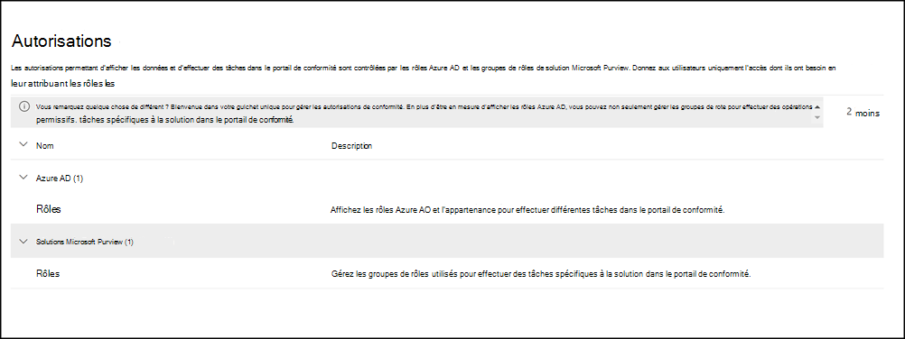

# Autorisations dans le portail de conformité Microsoft Purview

Le portail de conformité Microsoft Purview prend en charge la gestion directe des autorisations pour les utilisateurs qui effectuent des tâches de conformité dans Microsoft 365. Cette mise à jour signifie que vous n’aurez plus à utiliser le Centre de sécurité & conformité Office 365 pour gérer les autorisations pour les solutions de conformité. À l’aide de la nouvelle page **Autorisations** du portail de conformité, vous pouvez gérer les autorisations aux utilisateurs pour les tâches de conformité dans des fonctionnalités telles que la gestion des appareils, Protection contre la perte de données Microsoft Purview, eDiscovery, la gestion des risques internes, la rétention et bien d’autres. Les utilisateurs peuvent effectuer uniquement les tâches de conformité auxquelles vous leur accordez explicitement l’accès.

Pour afficher l’onglet **Autorisations** dans le portail de conformité, les utilisateurs doivent être administrateur général ou avoir le rôle *Gestion des* rôles (un rôle est attribué uniquement au groupe de rôles *Gestion de l’organisation* ). Le rôle *Gestion des* rôles permet aux utilisateurs d’afficher, de créer et de modifier des groupes de rôles.

Les autorisations dans le portail de conformité sont basées sur le modèle d’autorisations de contrôle d’accès en fonction du rôle (RBAC). RBAC est le même modèle d’autorisations que celui utilisé par la plupart des services Microsoft 365. Par conséquent, si vous êtes familiarisé avec la structure des autorisations dans ces services, l’octroi d’autorisations dans le portail de conformité vous sera familier. Il est important de se rappeler que les autorisations gérées dans le portail de conformité ne couvrent pas la gestion de toutes les autorisations nécessaires dans chaque service individuel. Vous devez toujours gérer certaines autorisations spécifiques au service dans le centre d’administration pour le service spécifique. Par exemple, si vous devez attribuer des autorisations pour les stratégies d’archivage, d’audit et de rétention MRM, vous devez gérer ces autorisations dans le <a href="https://go.microsoft.com/fwlink/p/?linkid=2059104" target="_blank">Centre d’administration Exchange</a>.

## Relation entre les membres, les rôles et les groupes de rôles

Un rôle accorde des autorisations pour effectuer un ensemble de tâches ; Par exemple, le rôle Gestion des cas permet aux utilisateurs de travailler avec des cas eDiscovery.

Un groupe de rôles est un ensemble de rôles qui permettent aux utilisateurs d’effectuer leurs tâches dans les solutions de conformité du portail de conformité. Par exemple, en ajoutant des utilisateurs au groupe de rôles *Gestion des risques internes* , les administrateurs désignés, les analystes, les enquêteurs et les auditeurs sont configurés pour les autorisations de gestion des risques internes nécessaires dans un seul groupe. Le portail de conformité inclut des groupes de rôles par défaut pour les tâches et les fonctions pour chaque solution de conformité à laquelle vous devez affecter des personnes. En règle générale, nous vous recommandons d’ajouter simplement des utilisateurs individuels en tant que membres aux groupes de rôles de conformité par défaut en fonction des besoins.

## Autorisations nécessaires pour utiliser des fonctionnalités dans le portail de conformité

Pour afficher tous les groupes de rôles par défaut disponibles dans le portail de conformité et les rôles affectés aux groupes de rôles par défaut, consultez les [autorisations dans le Centre de sécurité & conformité](/microsoft-365/security/office-365-security/permissions-in-the-security-and-compliance-center).

La gestion des autorisations dans le portail de conformité permet uniquement aux utilisateurs d’accéder aux fonctionnalités de conformité disponibles dans le portail de conformité. Si vous souhaitez accorder des autorisations à d’autres fonctionnalités qui ne figurent pas dans le portail de conformité, telles que les règles de flux de messagerie Exchange (également appelées règles de transport), vous devez utiliser le <a href="https://go.microsoft.com/fwlink/p/?linkid=2059104" target="_blank">Centre d’administration Exchange</a>.

## Rôles Azure dans le portail de conformité

Les rôles qui apparaissent dans la section **Rôles** **Azure AD** >  de la page Autorisations du portail de conformité sont **des rôles** Azure Active Directory. Ces rôles sont conçus pour s’aligner sur les fonctions du groupe informatique de votre organisation, ce qui permet de donner à vos utilisateurs les autorisations nécessaires pour accomplir leur travail. Vous pouvez afficher les utilisateurs actuellement affectés à chaque rôle en sélectionnant un rôle Administration et en consultant les détails du panneau de rôle. Pour gérer les membres d’un rôle Azure AD, sélectionnez Gérer les membres dans Azure AD. Ce choix vous redirige vers le portail de gestion Azure.

|Role|Description|
|:---|:----------|
|**Administrateur général**|Accède à toutes les fonctionnalités d’administration de tous les services Microsoft 365. Seuls les administrateurs généraux peuvent affecter d’autres rôles d’administrateur. Pour plus d’informations, consultez la section [Administrateur Général / Administrateur d’entreprise](/azure/active-directory/roles/permissions-reference#global-administrator--company-administrator).|
|**Administrateur de conformité des données**|Effectuez un suivi des données de votre organisation dans Microsoft 365, vérifiez qu’elles sont protégées et obtenez des informations sur des problèmes pour permettre d’atténuer les risques. Pour plus d’informations, voir [Administrateur de conformité des données](/azure/active-directory/roles/permissions-reference#compliance-data-administrator).|
|**Administrateur de conformité**|Aide votre organisation à respecter les exigences réglementaires, gérez les cas de découverte électronique et maintenez les stratégies de gouvernance des données sur les emplacements, les identités et les applications Microsoft 365. Pour plus d’informations, voir [Administrateur de conformité](/azure/active-directory/roles/permissions-reference#compliance-administrator).|
|**Opérateur de sécurité**|Consulter, examiner et répondre aux menaces actives envers vos utilisateurs, appareils et contenus Microsoft 365. Pour plus d’informations, voir la section [Opérateur de sécurité](/azure/active-directory/roles/permissions-reference#security-operator).|
|**Lecteur de sécurité**|Consultez et examinez les menaces actives envers vos utilisateurs, appareils et contenus Microsoft 365, mais, contrairement à l’opérateur de sécurité, il n’est pas autorisé à répondre par une action. Pour plus d’informations, voir [Lecteur de sécurité](/azure/active-directory/roles/permissions-reference#security-reader).|
|**Administrateur de sécurité**|Contrôlez la sécurité globale de votre organisation en gérant les stratégies de sécurité, en examinant les analyses de la sécurité et les rapports sur les produits Microsoft 365 et en se tenant à jour sur les menaces. Pour plus d’informations, voir [Administrateur de sécurité](/azure/active-directory/roles/permissions-reference#security-administrator).|
|**Lecteur général**|Version en lecture seule du rôle **Administrateur général**. Affiche tous les paramètres et informations administratives dans Microsoft 365. Pour plus d’informations, consultez [Lecteur général](/azure/active-directory/roles/permissions-reference#global-reader).|
|**Administrateur de simulation d’attaque**|Créez et gérez tous les aspects de la création d’une simulation d’attaque, le lancement/la planification d’une simulation et l’examen des résultats de la simulation. Pour plus d’informations, voir [Administrateur de simulation d’attaque](/azure/active-directory/roles/permissions-reference#attack-simulation-administrator).|
|**Auteur de la charge utile d’attaque**|Créez des charges utiles d’attaque, mais ne les lancez pas ou ne planifiez pas réellement. Pour plus d’informations, consultez [Auteur de charge utile d’attaque](/azure/active-directory/roles/permissions-reference#attack-payload-author).|
|

## Ajouter des utilisateurs à un groupe de rôles de conformité

Effectuez les étapes suivantes pour ajouter des utilisateurs à un groupe de rôles de conformité :

1. Connectez-vous à la zone d’autorisations du portail de conformité à l’aide des informations d’identification d’un compte d’administrateur dans votre organisation Microsoft 365, puis accédez à <a href="https://go.microsoft.com/fwlink/p/?linkid=2173597" target="_blank">**Autorisations**</a> pour sélectionner le lien permettant d’afficher et de gérer les rôles de conformité dans Microsoft 365.
1. Développez la section **Centre de conformité** et sélectionnez **Rôles**.
1. Dans la page **Rôles du Centre** de conformité, sélectionnez un groupe de rôles de conformité auquel vous souhaitez ajouter des utilisateurs, puis **sélectionnez Modifier le groupe de rôles** dans le volet d’informations.
1. **Sélectionnez Choisir des membres** dans le volet de navigation gauche, puis sélectionnez **Modifier**.
1. Sélectionnez **Ajouter** , puis cochez la case pour tous les utilisateurs que vous souhaitez ajouter au groupe de rôles.
1. Sélectionnez **Ajouter**, puis **Terminé**.
1. Sélectionnez **Enregistrer** pour ajouter les utilisateurs au groupe de rôles. Sélectionnez **Fermer** pour effectuer les étapes.

## Supprimer des utilisateurs d’un groupe de rôles de conformité

Effectuez les étapes suivantes pour supprimer des utilisateurs d’un groupe de rôles de conformité :

1. Connectez-vous à la zone d’autorisations du portail de conformité à l’aide des informations d’identification d’un compte d’administrateur dans votre organisation Microsoft 365, puis accédez à <a href="https://go.microsoft.com/fwlink/p/?linkid=2173597" target="_blank">**Autorisations**</a> pour sélectionner le lien permettant d’afficher et de gérer les rôles de conformité dans Microsoft 365.
1. Développez la section Centre de conformité et sélectionnez **Rôles**.
1. Dans la page **Rôles du Centre** de conformité, sélectionnez un groupe de rôles de conformité dont vous souhaitez supprimer des utilisateurs, puis **sélectionnez Modifier le groupe de rôles** dans le volet d’informations.
1. **Sélectionnez Choisir des membres** dans le volet de navigation gauche, puis sélectionnez **Modifier**.
1. Sélectionnez **Supprimer** , puis cochez la case pour tous les utilisateurs que vous souhaitez supprimer du groupe de rôles.
1. **Sélectionnez Supprimer**, puis **Terminé**.
1. Sélectionnez **Enregistrer** pour supprimer les utilisateurs du groupe de rôles. Sélectionnez **Fermer** pour effectuer les étapes.

## Créer un groupe de rôles personnalisé

Effectuez les étapes suivantes pour créer un groupe de rôles personnalisé :

1. Connectez-vous à la zone d’autorisations du portail de conformité à l’aide des informations d’identification d’un compte d’administrateur dans votre organisation Microsoft 365, puis accédez à <a href="https://go.microsoft.com/fwlink/p/?linkid=2173597" target="_blank">**Autorisations**</a>.
1. Dans la page **Autorisations & rôles** , sélectionnez **Centre de conformité > Rôles**.
1. Dans la page **Rôles du Centre de conformité** , sélectionnez **Créer**.
1. Dans la page **Nom de votre groupe de rôles** , entrez un nom pour le groupe de rôles personnalisé dans le champ **Nom** . Le nom du groupe de rôles ne peut pas être modifié après la création du groupe de rôles. Si nécessaire, entrez une description pour le groupe de rôles personnalisé dans le champ **Description** . Sélectionnez **Suivant** pour continuer.
1. Dans la page **Choisir des rôles** , **sélectionnez Choisir des rôles**.
1. Sélectionnez **Ajouter**, puis choisissez les rôles à ajouter au groupe de rôles personnalisé. Sélectionnez **Ajouter** pour ajouter le groupe de rôles, puis sélectionnez **Terminé**.
1. Sélectionnez **Suivant** pour continuer.
1. Dans la page **Choisir des membres** , **sélectionnez Choisir des membres**.
1. Sélectionnez **Ajouter**, puis choisissez les membres à ajouter au groupe de rôles personnalisé. Sélectionnez **Ajouter** pour ajouter les membres, puis **sélectionnez Terminé**.
1. Sélectionnez **Suivant** pour continuer.
1. Dans la page **Vérifier vos paramètres** , passez en revue les détails du groupe de rôles personnalisé. Si vous devez modifier les informations, sélectionnez **Modifier** dans la section appropriée. Lorsque tous les paramètres sont corrects, sélectionnez **Créer un groupe de rôles** pour créer le groupe de rôles personnalisé ou sélectionnez **Annuler** pour ignorer les modifications et non créer le groupe de rôles personnalisé.

## Mettre à jour un groupe de rôles personnalisé

Effectuez les étapes suivantes pour mettre à jour un groupe de rôles personnalisé :

1. Connectez-vous à la zone d’autorisations du portail de conformité à l’aide des informations d’identification d’un compte d’administrateur dans votre organisation Microsoft 365, puis accédez à <a href="https://go.microsoft.com/fwlink/p/?linkid=2173597" target="_blank">**Autorisations**</a>.
1. Dans la page **Autorisations & rôles** , sélectionnez **Centre de conformité > Rôles**.
1. Dans la page **Rôles du Centre de conformité** , sélectionnez le groupe de rôles à mettre à jour.
1. Dans le volet d’informations du groupe de rôles sélectionné, sélectionnez **Modifier le groupe de rôles**.
1. Dans la page **Modifier le nom du groupe de rôles** , mettez à jour la description du groupe de rôles personnalisé dans le champ **Description** . Impossible de modifier le nom du groupe de rôles personnalisé.
1. Dans la page **Choisir des rôles** , sélectionnez **Modifier** pour mettre à jour les rôles attribués aux groupes de rôles.
1. Sélectionnez **Ajouter**, puis choisissez les rôles à ajouter au groupe de rôles personnalisé. Sélectionnez **Ajouter** pour ajouter le groupe de rôles, puis sélectionnez **Terminé**.
1. Dans la page **Choisir les membres** , sélectionnez **Modifier**.
1. Sélectionnez **Ajouter**, puis choisissez les membres à ajouter au groupe de rôles personnalisé. Sélectionnez **Ajouter** pour ajouter les membres, puis **sélectionnez Terminé**.
1. Sélectionnez **Enregistrer** pour enregistrer les valeurs *de description*, *de groupes de rôles* et de *membres* mises à jour.
1. Dans le volet d’informations du groupe de rôles sélectionné, sélectionnez **Fermer**.

## Supprimer un groupe de rôles personnalisé

Effectuez les étapes suivantes pour mettre à jour un groupe de rôles personnalisé :

1. Connectez-vous à la zone d’autorisations du portail de conformité à l’aide des informations d’identification d’un compte d’administrateur dans votre organisation Microsoft 365, puis accédez à <a href="https://go.microsoft.com/fwlink/p/?linkid=2173597" target="_blank">**Autorisations**</a>.
1. Dans la page **Autorisations & rôles** , sélectionnez **Centre de conformité > Rôles**.
1. Dans la page **Rôles du Centre de conformité** , sélectionnez le groupe de rôles à mettre à jour.
1. Dans le volet d’informations du groupe de rôles sélectionné, sélectionnez **Supprimer le groupe de rôles**.
1. Dans la boîte de dialogue **Avertissement** , sélectionnez **Oui** pour supprimer le groupe de rôles ou sélectionnez **Non** pour annuler le processus de suppression.
