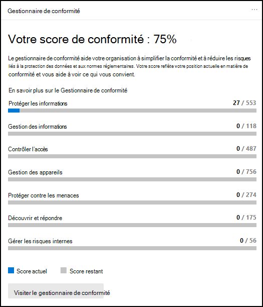
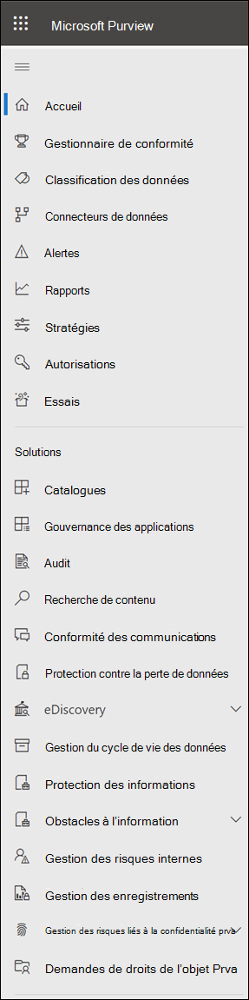

# Centre de conformité Microsoft 365

Si vous êtes intéressé par la position de la conformité de votre organisation, vous allez adorer le [Centre de conformité Microsoft 365](https://compliance.microsoft.com). Le centre de conformité Microsoft 365 offre un accès facile aux données et aux outils dont vous avez besoin pour gérer les besoins de conformité de votre organisation.

Lisez cet article pour découvrir le centre de conformité Microsoft 365, comment l' [obtenir](#how-do-i-get-the-compliance-center), les [questions fréquemment posées](#frequently-asked-questions)et les [étapes suivantes](#next-steps).

## Bienvenue dans la conformité Microsoft 365

Lorsque vous accédez à votre centre de conformité Microsoft 365 pour la première fois, vous êtes accueilli par le message d’accueil suivant :

La bannière de bienvenue vous donne des conseils pour commencer, avec les étapes suivantes, et vous inviter à nous faire part de vos commentaires.

## Section Carte

Lorsque vous visitez pour la première fois le centre de conformité Microsoft 365, la section de la page d’accueil vous indique le mode de fonctionnement de votre organisation avec la conformité des données, les solutions disponibles pour votre organisation, ainsi qu’un résumé des alertes actives.

À partir de là, vous pouvez :

- Consultez la carte du **Gestionnaire de conformité Microsoft** , qui vous dirige vers la solution du [Gestionnaire de conformité](compliance-manager.md) . Le gestionnaire de conformité simplifie la gestion de la conformité. Il calcule un score basé sur les risques mesurant votre progression vers l’exécution des actions recommandées qui contribuent à réduire les risques liés à la protection des données et aux normes réglementaires. Il fournit également des fonctionnalités de flux de travail et un mappage de contrôle intégré pour vous aider à effectuer efficacement les actions d’amélioration.

    

- Consultez la nouvelle carte de **catalogue de solutions** , qui contient des liens vers des collections de [solutions intégrées](microsoft-365-solution-catalog.md) que vous pouvez utiliser pour vous aider à gérer les scénarios de conformité de bout en bout. Les fonctionnalités et les outils d’une solution peuvent inclure une combinaison de stratégies, d’alertes, de rapports et bien plus encore.

    

- Examinez la carte des **alertes active** , qui inclut un résumé des [alertes](alert-policies.md) les plus actives et comprend un lien où vous pouvez afficher des informations plus détaillées, telles que la gravité, l’État, la catégorie, et bien plus encore.

    

Vous pouvez également utiliser la fonctionnalité **Ajouter des cartes** pour ajouter des cartes supplémentaires, telles que la conformité de l’application Cloud de votre organisation, ainsi que d’autres informations sur les utilisateurs avec des fichiers partagés, avec des liens vers la sécurité des [applications Cloud](https://docs.microsoft.com/cloud-app-security/) ou d’autres outils permettant d’explorer les données.

## Navigation facile vers des fonctionnalités et des fonctionnalités de conformité supplémentaires

Outre les liens des cartes sur la page d’accueil, vous verrez un volet de navigation sur le côté gauche de l’écran qui vous permet d’accéder facilement à vos [alertes](../security/office-365-security/alerts.md), [rapports](reports-in-security-and-compliance.md), [stratégies](alert-policies.md), solutions de conformité et bien plus encore. Pour ajouter ou supprimer des options pour un volet de navigation personnalisé, utilisez le contrôle **personnaliser la navigation** dans le volet de navigation. Cela permet d’ouvrir les paramètres **personnaliser le volet de navigation** afin que vous puissiez configurer les éléments qui apparaissent dans le volet de navigation.

|  |  |
|---------|---------|
|  | Sélectionnez **Accueil** pour revenir à la page principale du centre de conformité Microsoft 365.   Visitez le **Gestionnaire de conformité** pour vérifier votre score de conformité et commencer à [gérer la conformité](compliance-manager.md) de votre organisation.    Sélectionnez la **section classification des données** pour accéder aux [classifieurs de formation](classifier-learn-about.md), aux définitions d’entité des types d' [informations sensibles](sensitive-information-type-entity-definitions.md), aux explorateurs de contenu et d' [activité](data-classification-activity-explorer.md) .    Sélectionnez **connecteurs de données** pour [configurer les connecteurs](archiving-third-party-data.md) afin d’importer et d’archiver les données dans votre abonnement Microsoft 365.    Accéder aux **alertes** pour afficher et résoudre les [alertes](alert-policies.md)   Visitez **rapports** pour afficher les données sur [l’utilisation et la rétention des étiquettes](sensitivity-labels.md), les [correspondances et les remplacements de stratégies DLP](view-the-dlp-reports.md), les [fichiers partagés](https://docs.microsoft.com/cloud-app-security/file-filters), les [applications tierces en cours d’utilisation](https://docs.microsoft.com/cloud-app-security/discovered-apps)et bien plus encore.    Accédez à **stratégies** pour configurer les stratégies de gestion des données, gérer les appareils et recevoir des [alertes](../security/office-365-security/alerts.md). Vous pouvez également accéder à votre [DLP](data-loss-prevention-policies.md) et à vos stratégies de [rétention](retention.md) .   Sélectionnez les **autorisations** pour gérer les personnes de votre organisation qui ont accès au centre de conformité Microsoft 365 pour afficher le contenu et effectuer les tâches.    Utilisez les liens de la section **solutions** pour accéder aux solutions de conformité de votre organisation. Cela inclut ce qui suit :    [Catalog](microsoft-365-solution-catalog.md)   Découvrez, Découvrez et commencez à utiliser les solutions de gestion des risques et de conformité intelligentes disponibles pour votre organisation.    [Audit](search-the-audit-log-in-security-and-compliance.md)   Utilisez le journal d’audit pour examiner les problèmes courants de prise en charge et de conformité.    [Recherche de contenu](search-for-content.md)   Utilisez la recherche de contenu pour trouver rapidement des courriers électroniques dans des boîtes aux lettres Exchange, des documents dans des sites SharePoint et des emplacements OneDrive, et des conversations de messagerie instantanée dans Microsoft teams et Skype entreprise.    [Conformité des communications](communication-compliance.md)   Réduire les risques de communication en capturant automatiquement les messages inappropriés, en analysant les violations de stratégie possibles et en prenant les mesures correctives.    [Enquêtes sur les données](overview-data-investigations.md)   Effectuer des recherches dans les différents emplacements de contenu pour identifier les données sensibles, malveillantes ou égarées dans Microsoft 365 afin de pouvoir examiner et corriger les incidents, tels que le débordement des données.    [Protection contre la perte de données](data-loss-prevention-policies.md)   Détecter le contenu sensible tel qu’il est utilisé et partagé au sein de votre organisation, dans le Cloud et sur les appareils, et permet d’éviter toute perte accidentelle de données.    [Demandes des personnes concernées](manage-gdpr-data-subject-requests-with-the-dsr-case-tool.md)   Recherchez et exportez les données personnelles d’un utilisateur pour vous aider à répondre aux demandes des personnes concernées par le règlement général sur la protection des données (RGPD).    [eDiscovery](overview-ediscovery-20.md)   Développez cette section pour utiliser la découverte électronique principale et avancée pour la conservation, la collecte, la révision, l’analyse et l’exportation de contenu réactif aux investigations internes et externes de votre organisation.    [Gouvernance des informations](manage-information-governance.md)   Gérez votre cycle de vie de contenu à l’aide de fonctionnalités pour importer, stocker et classer les données critiques afin de conserver les informations dont vous avez besoin et de supprimer ce que vous n’avez pas.    [Protection des informations](information-protection.md)   Découvrez, classez et protégez les contenus sensibles et critiques tout au long de leur cycle de vie au sein de votre organisation.    [Gestion des risques internes](insider-risk-management.md)   Détectez les activités à risque au sein de votre organisation afin de vous aider à identifier rapidement, à examiner et à prendre des mesures sur les risques et les menaces pour les initiés.    [Gestion des enregistrements](records-management.md)   Automatisez et simplifiez le calendrier de rétention pour les enregistrements réglementaires, juridiques et d’entreprise de votre organisation.

## Comment puis-je obtenir le centre de conformité ?

- Si vous n’avez pas encore le nouveau centre de conformité Microsoft 365, vous en aurez bientôt. Le centre de conformité Microsoft 365 est généralement disponible pour les clients Microsoft 365 SKU.

- Pour visiter le centre de conformité Microsoft 365, en tant qu’administrateur général, administrateur de conformité ou administrateur de données de conformité, accédez à [https://compliance.microsoft.com](https://compliance.microsoft.com) et connectez-vous.

## Foire aux questions

**Pourquoi est-ce que j’ai adopté le centre de sécurité & conformité pour effectuer certaines tâches, telles que la définition de certaines stratégies ?**

Nous développons toujours le centre de conformité Microsoft 365 et nous ajoutons davantage de fonctionnalités et de solutions au cours des prochains mois. En attendant, il existe quelques tâches qui doivent être effectuées dans le centre de sécurité & conformité ( [https://protection.office.com](https://protection.office.com) ). Dans ce cas, vous serez dirigé automatiquement vers l’emplacement où vous pouvez effectuer la tâche, telle que la création ou la modification d’une stratégie de surveillance.

**Pourquoi ne puis-je pas encore voir le nouveau centre de conformité Microsoft 365 ?**

Tout d’abord, vérifiez que vous disposez des autorisations et des licences appropriées. Ensuite, connectez-vous à l’adresse [https://compliance.microsoft.com](https://compliance.microsoft.com) . Si vous ne voyez pas encore le nouveau centre de conformité, vous en aurez bientôt.

**Certaines de mes fonctionnalités de conformité ne sont pas disponibles dans le centre de conformité Microsoft 365. Que faire ?**

Nous ajoutons toujours des fonctionnalités au centre de conformité Microsoft 365. Si vous ne trouvez pas un objet, tel que la recherche de journal d’audit, utilisez le centre de sécurité & conformité ( [https://protection.office.com](https://protection.office.com) ). Vos configurations sont enregistrées dans le centre de conformité & de sécurité existant et dans le nouveau centre de conformité Microsoft 365 automatiquement.

Pour y accéder, dans le centre de conformité Microsoft 365, dans le volet de navigation sur le côté gauche de l’écran, choisissez **ressources supplémentaires** , puis sous **centre de sécurité & de la sécurité Office 365** , sélectionnez **ouvrir**.

## Prochaines étapes

- **Visitez le gestionnaire de conformité Microsoft** pour consulter votre score de conformité et commencer à gérer la conformité pour votre organisation. Pour en savoir plus, consultez [la rubrique Gestionnaire de conformité](compliance-manager.md).

- **Configurez des stratégies de gestion des risques initiés** pour minimiser les risques internes et vous permettre de détecter, d’examiner et de prendre des mesures pour les activités à risque dans votre organisation. Consultez la rubrique [gestion des risques internes](insider-risk-management.md).

- **Examinez les stratégies de protection contre la perte de données de votre organisation** et effectuez les modifications nécessaires. Pour en savoir plus sur, consultez la rubrique [vue d’ensemble des stratégies de protection contre la perte de données](data-loss-prevention-policies.md).

- **Familiarisez-vous avec la sécurité des applications Cloud de Microsoft et configurez** -la. Voir [démarrage rapide : prise en main de la sécurité des applications Cloud Microsoft](https://docs.microsoft.com/cloud-app-security/getting-started-with-cloud-app-security).

- **Découvrez et créez des stratégies de conformité des communications** pour identifier et corriger rapidement les violations de la stratégie de code de conduite d’entreprise. Consultez [la rubrique communication Compliance dans Microsoft 365](communication-compliance.md).

- **Consultez régulièrement votre centre de conformité Microsoft 365** et assurez-vous de consulter les alertes ou les risques potentiels qui se produisent. Accédez à [https://compliance.microsoft.com](https://compliance.microsoft.com) et connectez-vous.
