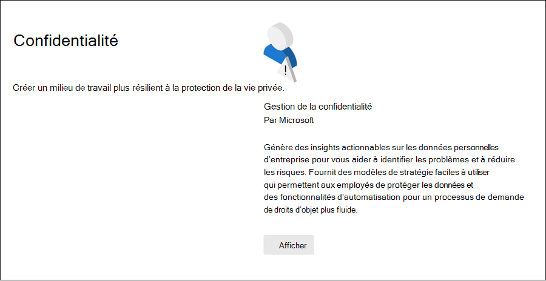

# Catalogue de solutions Microsoft Purview

Êtes-vous à la recherche d’un moyen de prendre rapidement en main les tâches de conformité dans Microsoft Purview ? Consultez le [catalogue de solutions Microsoft Purview](https://compliance.microsoft.com/solutioncatalog) pour découvrir, apprendre et prendre rapidement en main les solutions de risque et de conformité.

Les solutions de risque et de conformité dans Microsoft Purview sont des collections de fonctionnalités intégrées que vous pouvez utiliser pour vous aider à gérer des scénarios de conformité de bout en bout. Les fonctionnalités et outils d’une solution peuvent inclure une combinaison de stratégies, d’alertes, de rapports, et bien plus encore.

Lisez cet article pour vous familiariser avec le catalogue de solutions dans le portail de conformité Microsoft Purview, [comment y accéder](#how-do-i-access) et les [étapes suivantes](#next-steps).

## Organisation du catalogue

Le catalogue de solutions est organisé en sections qui contiennent des cartes d’informations pour chaque solution de risque et de conformité disponible dans votre abonnement Microsoft 365. Chaque section contient des cartes pour les solutions regroupées par zone de risque et de conformité.

Lorsque vous sélectionnez **Afficher** pour une carte de solution, vous verrez des informations détaillées sur la solution et la façon de commencer. Ces informations incluent une vue d’ensemble, des conditions préalables à la configuration, des ressources d’apprentissage, des contrôles qui vous permettent d’épingler la carte au volet de navigation et une option permettant de partager la solution sous la forme d’un lien, d’un e-mail ou d’un message Microsoft Teams.

## Section Sur la gouvernance & la protection des informations

La section **Relative à la protection des informations & gouvernance** vous montre en un clin d’œil comment utiliser les solutions Microsoft Purview pour protéger et régir les données de votre organisation.

À partir de là, vous verrez des cartes pour les solutions suivantes :

- [Gouvernance des](/defender-cloud-apps/app-governance-manage-app-governance) applications : vous aide à comprendre toutes les applications qui se connectent à votre organisation et régissent leur activité d’API.
- [Gestion du cycle de vie des données](/microsoft-365/compliance/manage-data-governance) : gère votre cycle de vie du contenu à l’aide de solutions pour importer, stocker et classifier des données critiques pour l’entreprise afin de conserver ce dont vous avez besoin et de supprimer ce que vous ne faites pas.
- [Protection contre la perte de](/microsoft-365/compliance/dlp-learn-about-dlp) données : détecte le contenu sensible tel qu’il est utilisé et partagé dans toute votre organisation, dans le cloud et sur les appareils, et permet d’éviter la perte accidentelle de données.
- [Protection des informations](/microsoft-365/compliance/information-protection) : découvre, classifie et protège le contenu sensible et critique pour l’entreprise tout au long de son cycle de vie au sein de votre organisation.
- [Gestion des enregistrements](/microsoft-365/compliance/records-management) : utilise une classification intelligente pour automatiser et simplifier la planification de rétention des enregistrements réglementaires, juridiques et critiques pour l’entreprise au sein de votre organisation.

## Section Confidentialité

La section **Confidentialité** vous montre en un clin d’œil comment votre organisation peut créer un espace de travail plus résilient à la confidentialité.

À partir de là, vous verrez des cartes pour les solutions suivantes :

- [Gestion de la confidentialité](/privacy/priva/priva-overview) : génère des insights exploitables sur les données personnelles d’entreprise pour vous aider à identifier les problèmes et à réduire les risques. Fournit des modèles de stratégie faciles à utiliser qui permettent aux employés de protéger les données et des fonctionnalités d’automatisation pour un processus de demande de droits d’objet plus fluide.

## Section Gestion des risques internes

La section **Gestion des risques internes** vous montre en un coup d’œil comment votre organisation peut identifier, analyser et prendre des mesures sur les risques internes avant qu’ils ne causent des dommages.

À partir de là, vous verrez des cartes pour les solutions suivantes :

- [Conformité des communications](/microsoft-365/compliance/communication-compliance) : réduit les risques de communication en vous aidant à capturer automatiquement les messages inappropriés, à examiner les violations de stratégie possibles et à prendre des mesures pour réduire les dommages.
- [Obstacles à l’information](/microsoft-365/compliance/information-barriers) : vous permet de restreindre la communication bidirectionnelle et la collaboration entre les groupes et les utilisateurs dans Microsoft Teams, SharePoint Online et OneDrive Entreprise.
- [Gestion des risques internes](/microsoft-365/compliance/insider-risk-management) : détectez les activités à risque au sein de votre organisation pour vous aider à identifier, examiner et prendre des mesures rapidement en cas de menaces et de risques internes.

## Section de réponse & de découverte

La section **De découverte & réponse** vous montre en un clin d’œil comment votre organisation peut rapidement rechercher, examiner et répondre aux problèmes de conformité avec les données pertinentes.

À partir de là, vous verrez des cartes pour les solutions suivantes :

- [Audit](/microsoft-365/compliance/search-the-audit-log-in-security-and-compliance) : enregistre l’activité des utilisateurs et des administrateurs de votre organisation afin que vous puissiez rechercher dans le journal d’audit et examiner une liste complète des activités dans tous les emplacements et services.
- [Demandes d’objet](/compliance/regulatory/gdpr-manage-gdpr-data-subject-requests-with-the-dsr-case-tool) de données : recherche et exporte les données personnelles d’un utilisateur pour vous aider à répondre aux demandes des personnes concernées pour le RGPD.
- [eDiscovery](/microsoft-365/compliance/manage-legal-investigations)
    - [eDiscovery (Standard)](/microsoft-365/compliance/get-started-core-ediscovery) : recherche dans différents emplacements de contenu pour identifier, conserver et exporter des données en réponse aux demandes de découverte légale et aux cas eDiscovery.
    - [eDiscovery (Premium)](/microsoft-365/compliance/overview-ediscovery-20) : s’appuie sur les fonctionnalités eDiscovery en fournissant une analytique intelligente et un machine learning pour vous aider à analyser plus en détail les données pertinentes pour les demandes de découverte.

## Comment faire accès ?

Pour visiter le catalogue de solutions Microsoft Purview, accédez au [portail de conformité](https://compliance.microsoft.com) et connectez-vous en tant qu’administrateur général, administrateur de conformité ou administrateur des données de conformité. Sélectionnez **Catalogue** dans le volet de navigation sur le côté gauche de l’écran pour ouvrir la page d’accueil du catalogue.

## Prochaines étapes

- **Visitez le Gestionnaire de conformité Microsoft Purview**, qui vous aide à comprendre l’état de conformité de votre organisation avec les normes et réglementations clés. Il fournit des actions recommandées que vous pouvez prendre pour renforcer votre posture de conformité globale et fournit des fonctionnalités de flux de travail pour vous aider à effectuer efficacement ces actions. Pour plus d’informations, consultez [le Gestionnaire de conformité](/microsoft-365/compliance/compliance-manager).

- **Configurez des stratégies de gestion des risques internes** pour réduire les risques internes et vous permettre de détecter, d’examiner et de prendre des mesures pour les activités à risque au sein de votre organisation. Consultez [En savoir plus sur la gestion des risques internes](/microsoft-365/compliance/insider-risk-management).
- **Découvrez et créez des stratégies de conformité des communications** pour identifier et corriger rapidement les violations de stratégie de code de conduite d’entreprise. Voir [Conformité des communications](/microsoft-365/compliance/communication-compliance).
- **Protection des données Microsoft Purview**, découvrez comment les solutions Microsoft Purview vous aident à découvrir, classer et protéger des informations sensibles où qu’elles résident ou voyagent.
    - **Familiariser et configurer Microsoft Defender for Cloud Apps**. Consultez [démarrage rapide : Bien démarrer avec Microsoft Defender for Cloud Apps](/cloud-app-security/getting-started-with-cloud-app-security).
    - **Bien démarrer avec les classifieurs**. Classifier le contenu, puis l’étiqueter afin qu’il puisse être protégé et géré correctement est le point de départ de la discipline de protection des informations. Consultez [En savoir plus sur les classifieurs pouvant être formés (préversion).](/microsoft-365/compliance/classifier-learn-about)
- **Visitez souvent votre catalogue de solutions Microsoft Purview** et veillez à passer en revue les nouvelles solutions pour vous aider à répondre à vos besoins en matière de conformité. Connectez-vous au [portail de conformité](https://compliance.microsoft.com) , puis sélectionnez **Catalogue** dans le volet de navigation gauche.
