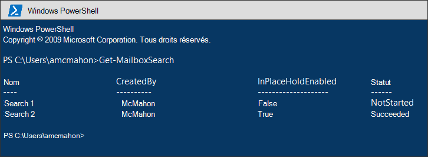
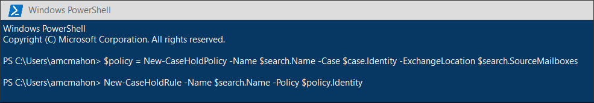
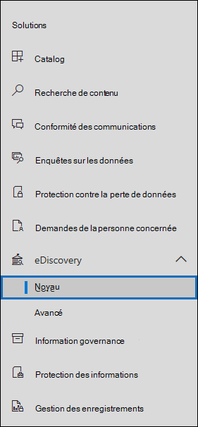

# <a name="migrate-legacy-ediscovery-searches-and-holds-to-the-microsoft-365-compliance-center"></a>Migrer les recherches et les données de découverte électronique héritées vers le Centre de conformité Microsoft 365

Le Centre de conformité Microsoft 365 offre une expérience améliorée pour l’utilisation d’eDiscovery, notamment : une fiabilité supérieure, de meilleures performances et de nombreuses fonctionnalités adaptées aux flux de travail eDiscovery, y compris les cas pour organiser votre contenu en fonction de la matière, les ensembles de révision pour examiner le contenu et l’analyse afin d’aider à annuler les données pour révision telles que le regroupement quasi-dupliqué, le thread de messagerie électronique, l’analyse des thèmes et le codage prédictif.

Pour aider les clients à tirer parti des fonctionnalités nouvelles et améliorées, cet article fournit des instructions de base sur la migration des recherches et des données de découverte électronique In-Place du Centre d’administration Exchange vers le Centre de conformité Microsoft 365.

> [!NOTE]
> Étant donné qu’il existe de nombreux scénarios différents, cet article fournit des instructions générales pour la transition des recherches et des recherches en cas de découverte électronique principale dans le Centre de conformité Microsoft 365. L’utilisation de cas eDiscovery n’est pas toujours requise, mais elles ajoutent une couche supplémentaire de sécurité en vous permettant d’attribuer des autorisations pour contrôler qui a accès aux cas eDiscovery dans votre organisation.

## <a name="before-you-begin"></a>Avant de commencer

- Vous devez être membre du groupe de rôles Gestionnaire eDiscovery dans le Centre de sécurité & conformité pour exécuter les commandes PowerShell décrites dans cet article. Vous devez également être membre du groupe de rôles Gestion de la découverte dans le Centre d’administration Exchange.

- Cet article fournit des instructions sur la création d’une attente eDiscovery. La stratégie de attente sera appliquée aux boîtes aux lettres par le biais d’un processus asynchrone. Lors de la création d’une mise en attente eDiscovery, vous devez créer une case CaseHoldPolicy et CaseHoldRule, sinon la mise en attente ne sera pas créée et les emplacements de contenu ne seront pas placés en attente.

## <a name="step-1-connect-to-exchange-online-powershell-and-security--compliance-center-powershell"></a>Étape 1 : Se connecter à Exchange Online PowerShell et au Centre de sécurité & conformité PowerShell

La première étape consiste à se connecter à Exchange Online PowerShell et au Centre de sécurité & conformité PowerShell. Vous pouvez copier le script suivant, le coller dans une fenêtre PowerShell, puis l’exécuter. Vous serez invité à entrer les informations d’identification de l’organisation à qui vous voulez vous connecter. 

```powershell
$UserCredential = Get-Credential
$sccSession = New-PSSession -ConfigurationName Microsoft.Exchange -ConnectionUri https://ps.compliance.protection.outlook.com/powershell-liveid -Credential $UserCredential -Authentication Basic -AllowRedirection
Import-PSSession $sccSession -DisableNameChecking
$exoSession = New-PSSession -ConfigurationName Microsoft.Exchange -ConnectionUri https://ps.outlook.com/powershell-liveid/ -Credential $UserCredential -Authentication Basic -AllowRedirection
Import-PSSession $exoSession -AllowClobber -DisableNameChecking
```

Vous devez exécuter les commandes dans les étapes suivantes de cette session PowerShell.

## <a name="step-2-get-a-list-of-in-place-ediscovery-searches-by-using-get-mailboxsearch"></a>Étape 2 : Obtenir la liste des recherches In-Place de découverte électronique à l’aide de Get-MailboxSearch

Une fois que vous vous êtes authentifié, vous pouvez obtenir la liste In-Place recherches de découverte électronique en exécutant la cmdlet **Get-MailboxSearch.** Copiez et collez la commande suivante dans PowerShell, puis exécutez-la. Une liste de recherches sera répertoriée avec leurs noms et l’état des In-Place de recherche.

```powershell
Get-MailboxSearch
```

La sortie de la cmdlet sera similaire à ce qui suit :



## <a name="step-3-get-information-about-the-in-place-ediscovery-searches-and-in-place-holds-you-want-to-migrate"></a>Étape 3 : Obtenir des informations sur les recherches In-Place eDiscovery et les In-Place que vous souhaitez migrer

Là encore, vous utiliserez la cmdlet **Get-MailboxSearch,** mais cette fois pour obtenir les propriétés de la recherche. Vous pouvez stocker ces propriétés dans une variable pour une utilisation ultérieure. L’exemple suivant stocke les résultats de la cmdlet **Get-MailboxSearch** dans une variable, puis affiche les propriétés de la recherche.

```powershell
$search = Get-MailboxSearch -Identity "Search 1"
```

```powershell
$search | FL
```

La sortie de ces deux commandes sera similaire à celle-ci :


> [!NOTE]
> La durée de la In-Place de suspension dans cet exemple est indéfinie (*ItemHoldPeriod : Unlimited*). Cela est courant dans les scénarios de découverte électronique et d’enquête juridique. Si la durée de la conservation est différente d’une valeur indéfinie, la raison est probablement que la conservation est utilisée pour conserver du contenu dans un scénario de rétention. Au lieu d’utiliser les cmdlets eDiscovery dans le Centre de sécurité & conformité PowerShell pour les scénarios de rétention, nous vous recommandons d’utiliser [New-RetentionCompliancePolicy](/powershell/module/exchange/new-retentioncompliancepolicy) et [New-RetentionComplianceRule](/powershell/module/exchange/new-retentioncompliancerule) pour conserver le contenu. Le résultat de l’utilisation de ces cmdlets sera similaire à l’utilisation de **New-CaseHoldPolicy** et **New-CaseHoldRule,** mais vous pourrez spécifier une période de rétention et une action de rétention, telle que la suppression de contenu après l’expiration de la période de rétention. En outre, l’utilisation des cmdlets de rétention ne vous oblige pas à associer les conservations de rétention à un cas eDiscovery.

## <a name="step-4-create-a-case-in-the-microsoft-365-compliance-center"></a>Étape 4 : Créer un cas dans le Centre de conformité Microsoft 365

Pour créer une attente eDiscovery, vous devez créer un cas eDiscovery à associer à la recherche. L’exemple suivant crée un cas eDiscovery à l’aide du nom de votre choix. Nous stockerons les propriétés du nouveau cas dans une variable pour une utilisation ultérieure. Vous pouvez afficher ces propriétés en exécutant la `$case | FL` commande après avoir créé le cas.

```powershell
$case = New-ComplianceCase -Name "[Case name of your choice]"
```


## <a name="step-5-create-the-ediscovery-hold"></a>Étape 5 : Créer le hold eDiscovery

Une fois le cas créé, vous pouvez créer la attente et l’associer au cas que vous avez créé à l’étape précédente. Il est important de ne pas oublier que vous devez créer une stratégie de cas de attente et une règle de cas de attente. Si la règle de mise en attente n’est pas créée après la création de la stratégie de mise en attente, la mise en attente eDiscovery n’est pas créée et tout contenu n’est pas mis en attente.

Exécutez les commandes suivantes pour re-créer le hold eDiscovery que vous souhaitez migrer. Ces exemples utilisent les propriétés de la In-Place de l’étape 3 que vous souhaitez migrer. La première commande crée une stratégie de cas de attente et enregistre les propriétés dans une variable. La deuxième commande crée la règle de cas de attente correspondante.

```powershell
$policy = New-CaseHoldPolicy -Name $search.Name -Case $case.Identity -ExchangeLocation $search.SourceMailboxes
```

```powershell
New-CaseHoldRule -Name $search.Name -Policy $policy.Identity
```



## <a name="step-6-verify-the-ediscovery-hold"></a>Étape 6 : Vérifier le hold eDiscovery

Pour vous assurer qu’il n’y a aucun problème lors de la création de la mise en attente, il est bon de vérifier que l’état de la distribution de la mise en attente a réussi. La distribution signifie que la attente a été appliquée à tous les emplacements de contenu spécifiés dans le *paramètre ExchangeLocation* à l’étape précédente. Pour ce faire, vous pouvez exécuter la cmdlet **Get-CaseHoldPolicy.** Étant donné que les propriétés enregistrées dans la variable $policy que vous avez créée à l’étape précédente ne sont pas automatiquement mises à jour dans la variable, vous devez réexécuter la cmdlet pour vérifier que la distribution *a* réussi. La distribution des stratégies de cas peut prendre entre 5 et 24 heures.

Exécutez la commande suivante pour vérifier que la découverte électronique a bien été distribuée.

```powershell
Get-CaseHoldPolicy -Identity $policy.Identity | Select name, DistributionStatus
```

La valeur Success de **la** *propriété DistributionStatus* indique que la mise en attente a été correctement placée sur les emplacements de contenu. Si la distribution n’est pas encore terminée, la valeur **En attente** s’affiche.


## <a name="step-7-create-the-search"></a>Étape 7 : Créer la recherche

La dernière étape consiste à re-créer la recherche que vous avez identifiée à l’étape 3 et à l’associer au cas. Après avoir créé la recherche, vous pouvez l’exécuter à l’aide de la cmdlet **Start-ComplianceSearch** ou l’exécuter ultérieurement.

```powershell
New-ComplianceSearch -Name $search.Name -ExchangeLocation $search.SourceMailboxes -ContentMatchQuery $search.SearchQuery -Case $case.name
```


## <a name="step-8-verify-the-case-hold-and-search-in-the-microsoft-365-compliance-center"></a>Étape 8 : Vérifier le cas, la mise en attente et la recherche dans le Centre de conformité Microsoft 365

Pour vous assurer que tout est correctement installé, rendez-vous dans le Centre de conformité Microsoft 365 à l’adresse , puis cliquez sur [https://compliance.microsoft.com](https://compliance.microsoft.com) **eDiscovery > Core**.



Le cas que vous avez créé à l’étape 3 est répertorié dans la page **Core eDiscovery.** Ouvrez le cas, puis notez la attente que vous avez créée à l’étape 4 de l’onglet **Attentes.** Vous pouvez cliquer sur la boîte aux lettres pour voir les détails, y compris le nombre de boîtes aux lettres à lesquelles la boîte aux lettres est appliquée et l’état de distribution.


La recherche que vous avez créée à l’étape  7 est répertoriée sous l’onglet Recherches du cas eDiscovery.


Si vous migrez une recherche eDiscovery In-Place mais que vous ne l’associez pas à un cas eDiscovery, elle sera répertoriée sur la page de recherche de contenu dans le Centre de conformité Microsoft 365.

## <a name="more-information"></a>Informations supplémentaires

- Pour plus d’informations In-Place la & eDiscovery dans le Centre d’administration Exchange, voir :
  
  - [Découverte électronique locale](/exchange/security-and-compliance/in-place-ediscovery/in-place-ediscovery)

  - [Conservation inaltérable et conservation pour litige](/exchange/security-and-compliance/in-place-and-litigation-holds)

- Pour plus d’informations sur les cmdlets PowerShell utilisées dans l’article, voir :

  - [Get-MailboxSearch](/powershell/module/exchange/get-mailboxsearch)
  
  - [New-ComplianceCase](/powershell/module/exchange/new-compliancecase)

  - [New-CaseHoldPolicy](/powershell/module/exchange/new-caseholdpolicy)
  
  - [New-CaseHoldRule](/powershell/module/exchange/new-caseholdrule)

  - [Get-CaseHoldPolicy](/powershell/module/exchange/get-caseholdpolicy)
  
  - [New-ComplianceSearch](/powershell/module/exchange/new-compliancesearch)

  - [Start-ComplianceSearch](/powershell/module/exchange/start-compliancesearch)

- Pour plus d’informations sur le Centre de conformité Microsoft 365, voir Vue d’ensemble du Centre de conformité [Microsoft 365.](microsoft-365-compliance-center.md)