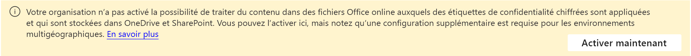

# Étiquettes et stratégies par défaut pour protéger vos données

>*[Guide de sécurité et conformité pour les licences Microsoft 365](/office365/servicedescriptions/microsoft-365-service-descriptions/microsoft-365-tenantlevel-services-licensing-guidance/microsoft-365-security-compliance-licensing-guidance).*

Les clients éligibles peuvent activer les étiquettes et politiques par défaut pour Protection des données Microsoft Purview : 

- Étiquettes de sensibilité et politique d'étiquette de sensibilité
- Étiquetage automatique côté client
- Étiquetage automatique côté service
- Stratégies de prévention des pertes de données (DLP) pour les équipes et les appareils

Ces configurations par défaut vous aident à être rapidement opérationnel avec Protection des données Microsoft Purview pour Microsoft 365. Vous pouvez les utiliser tels quels, apporter quelques modifications ou les personnaliser entièrement pour mieux répondre aux besoins de votre entreprise. 

L’éligibilité inclut les clients qui bénéficient d’un [essai gratuit de Microsoft Purview](compliance-easy-trials.md) et certains clients qui disposent déjà d’une offre Microsoft 365 E5:

- **Nouveaux clients** : si vous disposez de Microsoft Purview depuis moins de 30 jours, votre client peut activer toutes les configurations par défaut répertoriées. Vous pouvez toujours les désactiver, les supprimer ou les modifier.

- **Clients existants** : si vous ne disposez pas de Microsoft Purview depuis plus de 30 jours, vous pouvez activer les configurations par défaut si vous n’avez pas encore configuré d’équivalent :

    | Configuration par défaut| Équivalent |
    |:-----|:-----|
    |Étiquettes de sensibilité et politique d'étiquette de sensibilité | Étiquettes de sensibilité publiées |
    |Étiquetage automatique côté client | Une ou plusieurs étiquettes de sensibilité configurées pour s'appliquer automatiquement (ou recommander aux utilisateurs) dans les applications Office|
    |Étiquetage automatique côté service | Au moins une règle d'étiquetage automatique activée|
    |DLP pour les équipes | Au moins une stratégie DLP pour les équipes|
    |DLP pour les appareils | Au moins une stratégie DLP pour les appareils|

## Activer les étiquettes et les politiques par défaut

Pour obtenir ces étiquettes et règles préconfigurées : 

1. Dans le [Portail de conformité Microsoft Purview](https://compliance.microsoft.com/), sélectionnez **Solutions** > **Protection des données**
    
    Si vous ne voyez pas immédiatement cette option, sélectionnez d'abord **Afficher tout** dans le volet de navigation. 
    
2. Si vous êtes éligible pour les étiquettes et stratégies par défaut de Protection des données Microsoft Purview, vous verrez les informations suivantes, où vous pouvez activer les étiquettes et stratégies par défaut. Par exemple :
    
    :::image type="content" alt-text="Activation de Protection des données Microsoft Purview pour les étiquettes et stratégies préconfigurées." source="../media/mip-preconfigured.png" lightbox="../media/mip-preconfigured.png":::
    
    Si vous ne voyez pas ces informations affichées avec l’option d’activation, vous n’êtes pas éligible pour la création automatique d’étiquettes de confidentialité et de stratégies. Vous pouvez essayer de vérifier ultérieurement si cet état a changé ou vous pouvez utiliser les informations de paramètres suivants pour créer manuellement les mêmes étiquettes et stratégies.

3. Activez maintenant les étiquettes de confidentialité pour SharePoint et OneDrive. Cette étape est un prérequis pour utiliser des étiquettes de confidentialité dans Office pour le web et des stratégies d’étiquetage automatique pour SharePoint et OneDrive.
   
    Utilisez la bannière suivante en haut de l’onglet **Vue d’ensemble Information Protection**, puis sélectionnez **Activer maintenant**. Si vous ne voyez pas cette bannière, les étiquettes de confidentialité pour SharePoint et OneDrive ont déjà été activées pour votre locataire.
    
    
    
    Pour plus d’informations sur cette fonctionnalité, consultez [Activer les étiquettes de confidentialité pour les fichiers Office dans SharePoint et OneDrive](sensitivity-labels-sharepoint-onedrive-files.md).

## Étiquettes de sensibilité par défaut

Lorsque vous n'avez pas publié d'étiquettes de confidentialité, nous créons les étiquettes suivantes pour vous :

|Nom de l’étiquette|Description de l'étiquette pour les utilisateurs|Paramètres|
|-------------------------------|---------------------------|-----------------|
|Personnel|Données non métiers, pour une utilisation personnelle uniquement.|**Portée** : Fichier, Email   **Marquage de contenu** : Non  **Étiquetage automatique** : Non   **Paramètres de groupe** : Non  **Paramètres du site** : Non   **Étiquetage automatique des colonnes de la base de données** : Aucun|
|Public|Données métiers qui sont spécifiquement préparées et approuvées pour une utilisation publique.|**Portée** : Fichier, Email   **Marquage de contenu** : Non  **Étiquetage automatique** : Non   **Paramètres de groupe** : Non  **Paramètres du site** : Non   **Étiquetage automatique des colonnes de la base de données** : Aucun|
|Général|Données commerciales qui ne sont pas destinées à la consommation publique. Cependant, cela peut être partagé avec des partenaires externes, si nécessaire. Les exemples incluent un annuaire téléphonique interne d'entreprise, des organigrammes, des normes internes et la plupart des communications internes.|**Portée** : Fichier, Email   **Marquage de contenu** : Non  **Étiquetage automatique** : Non   **Paramètres de groupe** : Non  **Paramètres du site** : Non   **Étiquetage automatique des colonnes de la base de données** : Aucun|
|Général   \ N'importe qui (sans restriction)|Données de l'organisation qui ne sont pas destinées à la consommation publique mais peuvent être partagées avec des partenaires externes le cas échéant. Les exemples incluent les conversations avec les clients qui n'incluent pas d'informations sensibles ou de documents marketing publiés.|**Portée** : Fichier, Email   **Marquage de contenu** : Non  **Étiquetage automatique** : Non   **Paramètres de groupe** : Non  **Paramètres du site** : Non   **Étiquetage automatique des colonnes de la base de données** : Aucun|
|Général   \ Tous les employés (sans restriction)|Données de l'organisation qui ne sont pas destinées à la consommation publique. Si vous devez partager ce contenu avec des partenaires externes, confirmez auprès d'autres propriétaires de données que le partage est autorisé, puis remplacez le libellé par Général \ Tout le monde (sans restriction) . Les exemples incluent un annuaire téléphonique interne d'entreprise, des organigrammes, des normes internes et la plupart des communications internes.|**Portée** : Fichier, Email   **Marquage de contenu** : Non  **Étiquetage automatique** : Non   **Paramètres de groupe** : Non  **Paramètres du site** : Non   **Étiquetage automatique des colonnes de la base de données** : Aucun|
|Confidentiel|Données métiers sensibles qui peuvent porter atteinte à l’entreprise si elles sont partagées avec des personnes non autorisées. Les contrats, rapports de sécurité, résumés des prévisions et données des comptes commerciaux en sont des exemples.|**Portée** : Fichier, Email   **Marquage de contenu** : Non  **Étiquetage automatique** : Non   **Paramètres de groupe** : Non  **Paramètres du site** : Non   **Étiquetage automatique des colonnes de la base de données** : Aucun|
|Confidentiel   \ N'importe qui (sans restriction)|Des données confidentielles qui n'ont pas besoin d'être cryptées. Utilisez cette option avec précaution et avec une justification commerciale appropriée.|Cette étiquette est sélectionnée pour l'[étiquetage automatique côté client](#client-side-auto-labeling) et l'[étiquetage automatique côté service](#service-side-auto-labeling).   **Portée** : Fichier, Email   **Marquage du contenu** : Pied de page : classé comme confidentiel  **Étiquetage automatique** : Recommander aux utilisateurs d'appliquer l'étiquette   **Paramètres de groupe** : Non  **Paramètres du site** : Non   **Étiquetage automatique des colonnes de la base de données** : Aucun|
|Confidentiel   \ Tous les employés|Données confidentielles qui nécessitent une protection, ce qui permet à tous les employés des autorisations complètes. Les propriétaires de données peuvent suivre et révoquer le contenu.|Cette étiquette est sélectionnée pour l'[étiquetage automatique côté client](#client-side-auto-labeling) et l'[étiquetage automatique côté service](#service-side-auto-labeling).   **Portée** : Fichier, Email   **Cryptage** : Tous les utilisateurs et groupes de l'organisation : co-auteur  **Marquage du contenu** : Pied de page : classé comme confidentiel  **Étiquetage automatique** : Recommander aux utilisateurs d'appliquer l'étiquette   **Paramètres de groupe** : Non  **Paramètres du site** : Non   **Étiquetage automatique des colonnes de la base de données** : Aucun |
|Confidentiel   \ Personnes de confiance|Des données confidentielles qui peuvent être partagées avec des personnes de confiance à l'intérieur et à l'extérieur de votre organisation. Ces personnes peuvent également partager les données au besoin.|**Portée** : Fichier, Email   **Cryptage** : permet aux utilisateurs d'attribuer des autorisations :   - Chiffrer uniquement pour Outlook  - Inviter les utilisateurs dans Word, PowerPoint et Excel  **Marquage du contenu** : Pied de page : classé comme confidentiel  **Étiquetage automatique** : Non   **Paramètres de groupe** : Non  **Paramètres du site** : Non   **Étiquetage automatique des colonnes de la base de données** : Aucun|
|Hautement confidentiel|Données métiers très sensibles qui porteraient atteinte à l’entreprise si elles étaient partagées avec des personnes non autorisées. Les informations relatives aux employés et aux clients, mots de passe, code source et rapports financiers prédéfinis en sont des exemples.|**Portée** : Fichier, Email   **Marquage du contenu** : Filigrane : HAUTEMENT CONFIDENTIEL  **Étiquetage automatique** : Non   **Paramètres de groupe** : Non  **Paramètres du site** : Non   **Étiquetage automatique des colonnes de la base de données** : Aucun|
|Hautement confidentiel   \ Tous les employés|Données hautement confidentielles qui permettent à tous les employés d’afficher, de modifier et de répondre à ce contenu. Les propriétaires de données peuvent suivre et révoquer le contenu.|**Portée** : Fichier, Email   **Cryptage** : Tous les utilisateurs et groupes de l'organisation : co-auteur  **Marquage du contenu** : Pied de page : classé comme hautement confidentiel  **Étiquetage automatique** : Non   **Paramètres de groupe** : Non  **Paramètres du site** : Non   **Étiquetage automatique des colonnes de la base de données** : Aucun|
|Hautement confidentiel   \ Des personnes spécifiques |Données hautement confidentielles qui nécessitent une protection et ne peuvent être consultées que par les personnes que vous spécifiez et avec le niveau d'autorisation que vous choisissez.|**Portée** : Fichier, Email   **Cryptage** : permet aux utilisateurs d'attribuer des autorisations :  - Ne pas transférer pour Outlook  - Inviter les utilisateurs dans Word, PowerPoint et Excel  **Marquage du contenu** : Pied de page : classé comme hautement confidentiel  **Étiquetage automatique** : Non   **Paramètres de groupe** : Non  **Paramètres du site** : Non   **Étiquetage automatique des colonnes de la base de données** : Aucun|

> [!NOTE]
> Les noms et descriptions des étiquettes sont automatiquement disponibles pour les paramètres régionaux suivants : anglais américain, chinois simplifié et traditionnel, français, allemand, italien, japonais, coréen, portugais brésilien, russe et espagnol.
> 
> Si vous avez besoin de langues supplémentaires, vous pouvez spécifier vos traductions [à l'aide de PowerShell](create-sensitivity-labels.md#example-configuration-to-configure-a-sensitivity-label-for-different-languages).

Pour plus d'informations sur ces paramètres de configuration et sur ce que les étiquettes de sensibilité peuvent faire, consultez [Que peuvent faire les étiquettes de sensibilité](sensitivity-labels.md#what-sensitivity-labels-can-do).

Si vous devez modifier ces étiquettes de sensibilité par défaut, consultez [Créer et configurer des étiquettes de sensibilité](create-sensitivity-labels.md#create-and-configure-sensitivity-labels).

## Politique d'étiquette de sensibilité par défaut

La stratégie d’étiquette de confidentialité par défaut rend les étiquettes disponibles pour que les utilisateurs commencent à étiqueter leurs documents et e-mails avec des étiquettes de confidentialité. Elle présente la configuration suivante :

- Publier les étiquettes par défaut à tous les utilisateurs de votre locataire
- Étiquette par défaut de **Général** \ **Tous les employés (sans restriction)** pour les documents et les e-mails sans étiquette
- Les utilisateurs doivent fournir une justification pour supprimer une étiquette ou abaisser sa classification

Pour plus d'informations sur ces paramètres de stratégie et sur d'autres paramètres de stratégie disponibles, voir [Ce que les stratégies d'étiquette peuvent faire](sensitivity-labels.md#what-label-policies-can-do).

Si vous devez modifier ces paramètres de stratégie par défaut, consultez [Publier des étiquettes de confidentialité en créant une stratégie d'étiquette](create-sensitivity-labels.md#publish-sensitivity-labels-by-creating-a-label-policy).

Lorsque vous utilisez ces étiquettes dans les applications Office sur Windows, macOS, iOS et Android, les utilisateurs voient de nouvelles étiquettes dans un délai de quatre heures et dans un délai d’une heure pour Word, Excel et PowerPoint sur le web lorsque vous actualisez le navigateur. Cependant, vous devrez peut-être attendre jusqu’à 24 heures pour que les modifications soient répliquées sur toutes les applications et tous les services.

## Étiquetage automatique côté client

La configuration d'étiquetage automatique côté client par défaut recommande automatiquement aux utilisateurs d'appliquer une étiquette de sensibilité lorsque nous détectons des numéros de carte de crédit dans les documents ou les e-mails avec lesquels ils travaillent. En tant que recommandation plutôt qu'appliquée automatiquement, cette configuration constitue une bonne première étape pour mettre en évidence le contenu concernant et initie les utilisateurs à la pratique de l'étiquetage de leurs documents et e-mails.

L'étiquetage automatique côté client ne fonctionne que pour les documents et les e-mails utilisés par les applications Office Word, Excel, PowerPoint et Outlook. 

L'étiquetage automatique côté client par défaut a la configuration suivante : 

- S'il y a 1 à 9 cas de numéros de carte de crédit trouvés dans un document ou un e-mail, recommandez à l'utilisateur d'appliquer l'étiquette de sensibilité **Confidentiel à** \ **Tous (sans restriction)** 

- S'il y a 10 instances ou plus de numéros de carte de crédit trouvés dans un document ou un e-mail, recommandez à l'utilisateur d'appliquer l'étiquette de sensibilité **Confidentiel** \ **Tous les employés** 

> [!NOTE]
> Si nous avons détecté que vous avez publié vos propres étiquettes de sensibilité, nous vous demanderons de sélectionner l'une de vos propres étiquettes pour l'étiquetage automatique et de la configurer pour vous.

Si vous souhaitez modifier la configuration de l'étiquetage automatique côté client, consultez [Comment configurer l'étiquetage automatique pour les applications Office](apply-sensitivity-label-automatically.md#how-to-configure-auto-labeling-for-office-apps).

## Étiquetage automatique côté service 

L'étiquetage automatique côté service permet d'étiqueter les documents sensibles au repos et les e-mails en transit. La stratégie d’étiquetage automatique côté service par défaut crée des stratégies qui s’exécutent en mode simulation pour les documents stockés dans tous les sites SharePoint ou OneDrive, ainsi que tous les e-mails envoyés via Exchange Online. 

En mode simulation, les éléments ne sont pas étiquetés tant que la stratégie n’est pas activée. Vous pouvez activer manuellement la stratégie ou, à moins que vous ne modifiiez le paramètre par défaut, la stratégie est automatiquement activée si aucune modification n’est apportée à la stratégie dans un délai défini de jours à compter de la fin de la simulation.

> [!NOTE]
> L’activation automatique des stratégies d’étiquetage automatique est nouvelle et progressivement déployée pour les nouvelles stratégies d’étiquetage automatique. Vous risquez de ne pas voir cette configuration immédiatement ou pour toutes les stratégies.

Dans la plupart des cas, il faut compter 7 jours avant l’activation automatique d’une stratégie qui n’a pas été modifiée. Toutefois, l’activation prendra jusqu’à 25 jours pour les clients qui ont créé un compte après le 23 juin 2022 (inclus), puis ce délai passera à 7 jours après la modification de la stratégie.

Le mode simulation vous permet de prévisualiser les éléments qui seraient étiquetés lorsque la stratégie est activée, de sorte que vous ayez confiance dans la fonction d'étiquetage avant de déployer la stratégie sur votre locataire pour un étiquetage réel. 

Les stratégies d’étiquetage automatique côté service par défaut ont la configuration suivante : 

Pour tous les clients :

- S’il existe entre 1 et 9 instances de numéros de carte de crédit trouvés dans un document ou un e-mail, appliquez l’étiquette de confidentialité **Confidentiel** \ **Tout le monde (sans restriction)**
    
- S’il existe au moins 10 instances de numéros de carte de crédit dans un document ou un e-mail, appliquez l’étiquette de confidentialité **Confidentiel** \ **Tous les employés** 

> [!NOTE]
> Si nous avons détecté que vous avez publié vos propres étiquettes de sensibilité, nous vous inviterons à sélectionner l'une de vos propres étiquettes pour votre politique d'étiquetage automatique.

Concernant les clients qui ont créé un compte après le 23 juin 2022 (inclus), et ceux pour lesquels le client Microsoft 365 se trouve dans la région des États-Unis :

- S’il existe entre 1 et 9 instances de données personnelles aux États-Unis et que des document ou des e-mails comportent des noms complets, appliquez l’étiquette de confidentialité **Confidentiel** \ **Tout le monde (sans restriction)**

- S’il existe au moins 10 instances de données personnelles aux États-Unis et que des document ou des e-mails comportent des noms complets, appliquez l’étiquette de confidentialité **Confidentiel** \ **tous les employés** 

Les clients qui ont créé un compte après le 23 juin 2022 (inclus) ont deux stratégies d’étiquetage automatique pour chaque paramètre. Une stratégie concerne l’emplacement Exchange et l’autre les emplacements SharePoint et OneDrive. Bien que les stratégies soient créées en même temps, la simulation n’est pas immédiatement activée pour SharePoint et OneDrive :
- Emplacement Exchange : la stratégie d’étiquetage automatique est créée et démarre immédiatement la simulation.
- Emplacements SharePoint et OneDrive : la stratégie d’étiquetage automatique est créée, mais attend 25 jours avant de démarrer automatiquement la simulation. Ce délai vous donne le temps de créer et d’enregistrer des fichiers à ces emplacements. 

Une fois la simulation terminée, passez en revue les résultats et, si vous en êtes satisfait, activez les stratégies. Déploiement lent à partir du 23 juin 2022, par défaut, les stratégies sont automatiquement activées si elles ne sont pas modifiées dans le délai défini (25 jours initialement pour les nouveaux clients, sinon 7 jours).

Pour plus d'informations sur le mode simulation, voir [En savoir plus sur le mode simulation](apply-sensitivity-label-automatically.md#learn-about-simulation-mode).

Si vous souhaitez modifier la stratégie d'étiquetage automatique côté service, consultez [Comment configurer les stratégies d'étiquetage automatique pour Microsoft Office SharePoint Online, OneDrive et Exchange](apply-sensitivity-label-automatically.md#how-to-configure-auto-labeling-policies-for-sharepoint-onedrive-and-exchange).

## DLP pour les équipes

La stratégie DLP par défaut pour Teams détecte la présence de numéros de carte de crédit dans toutes les discussions et messages de canal Teams. Lorsque ces informations sensibles sont détectées, les administrateurs reçoivent une notification d'alerte de faible gravité.

Cette stratégie est discrète pour les utilisateurs sans conseil de stratégie visible et aucun message bloqué, mais les administrateurs auront des enregistrements des informations sensibles partagées dans ces messages. Si nécessaire, vous pouvez modifier les paramètres pour modifier cette configuration par défaut.

Pour voir les résultats de cette stratégie, utilisez [DLP Activity Explorer](dlp-learn-about-dlp.md#dlp-activity-explorer).

Si vous souhaitez modifier la stratégie DLP, consultez [Créer, tester et régler une stratégie DLP](create-test-tune-dlp-policy.md).

## DLP pour les appareils

La stratégie DLP par défaut pour les appareils détecte la présence de numéros de carte de crédit sur les appareils Windows 10 qui ont été intégrés à Microsoft Purview. Elle audite ensuite (ne bloque pas) les actions suivantes : 

- Téléchargement vers des domaines de service cloud ou accès par des navigateurs non autorisés

- Copier dans le presse-papiers, USB ou partage réseau 

- Accès par des applications non autorisées 

- Imprimer 

- Copier ou déplacer à l'aide d'une application Bluetooth non autorisée 

- Services de bureau à distance 

Si le contenu contient 10 instances ou plus de cartes de crédit et qu'une ou plusieurs des activités répertoriées sont détectées, une notification d'alerte de gravité moyenne est envoyée aux administrateurs.

Cette politique est discrète pour les utilisateurs sans conseil de politique visible et aucune action bloquée, mais les administrateurs auront des enregistrements de toutes les activités suspectes. Si nécessaire, vous pouvez modifier ces paramètres pour modifier cette configuration par défaut.

Pour voir les résultats de cette stratégie, utilisez [DLP Activity Explorer](dlp-learn-about-dlp.md#dlp-activity-explorer).

Si vous souhaitez modifier la stratégie DLP, consultez [Créer, tester et régler une stratégie DLP](create-test-tune-dlp-policy.md).

## Ressources supplémentaires

Pour en savoir plus sur les étiquettes de confidentialité, la protection contre la perte de données et toutes les fonctionnalités disponibles avec Protection des données Microsoft Purview, consultez les ressources suivantes :

- [En savoir plus sur les étiquettes de niveau de confidentialité](sensitivity-labels.md)
- [En savoir plus sur la prévention des pertes de données](dlp-learn-about-dlp.md)
- [Protéger vos données avec Microsoft Purview](information-protection.md)
