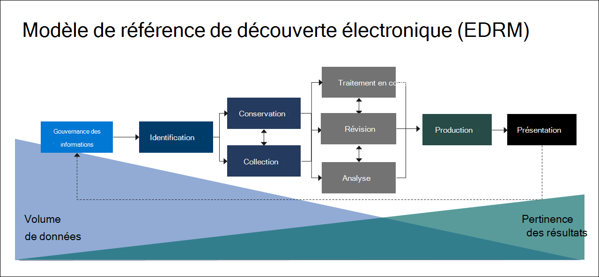

# Vue d’ensemble de Microsoft Purview eDiscovery (Premium)

La solution Microsoft Purview eDiscovery (Premium) s’appuie sur les fonctionnalités existantes de Microsoft eDiscovery et d’analytique. eDiscovery (Premium) fournit un flux de travail de bout en bout pour conserver, collecter, analyser, examiner et exporter du contenu qui répond aux investigations internes et externes de votre organisation. Il permet également aux équipes juridiques de gérer l’ensemble du flux de travail de notification de conservation légale pour communiquer avec les conservateurs impliqués dans un cas.

## Fonctionnalités eDiscovery (Premium)

eDiscovery (Premium) peut aider votre organisation à répondre aux questions juridiques ou aux enquêtes internes en découvrant les données où elle réside. Vous pouvez gérer en toute transparence les flux de travail eDiscovery en identifiant les personnes intéressantes et leurs sources de données, en appliquant en toute transparence des conservations pour conserver les données, puis en gérant le processus de communication de conservation légale. En collectant des données à partir de la source, vous pouvez effectuer une recherche sur la plateforme Microsoft 365 active pour trouver rapidement ce dont vous avez besoin. Les fonctionnalités d’apprentissage automatique intelligentes, telles que l’indexation approfondie, le thread de messagerie et la détection des doublons proches, vous aident également à réduire de grands volumes de données à un jeu de données approprié.

Les sections suivantes décrivent comment ces fonctionnalités eDiscovery (Premium) peuvent aider votre organisation.

### Découvrir et collecter des données sur place

Traditionnellement, les organisations qui s’appuient sur plusieurs solutions eDiscovery tierces nécessitent la copie de grands volumes de données à partir de Microsoft 365 pour traiter et avoir à héberger des données en double. Cette nécessité augmente le temps nécessaire pour trouver des données pertinentes, ainsi que le risque, le coût et la complexité de la gestion de plusieurs solutions.

eDiscovery (Premium) dans Microsoft 365 vous permet de découvrir les données à la source et de rester dans votre limite de sécurité et de conformité Microsoft 365.  En collectant des données sur place à partir du système actif, eDiscovery (Premium) réduit la friction de revenir à la source et réduit le travail inutile de recherche de contenu manquant, ce qui se produit souvent lors de la journalisation des retards dans les solutions eDiscovery traditionnelles.

Les fonctionnalités natives de recherche et de collecte des données dans Teams, Yammer, SharePoint Online, OneDrive Entreprise et Exchange Online améliorent davantage la découverte des données. Par exemple, eDiscovery (Premium) :

- Reconstruit les conversations Teams (au lieu de renvoyer des messages individuels à partir de conversations).

- Collecte le contenu cloud partagé avec les utilisateurs à l’aide de liens ou de pièces jointes modernes dans les e-mails et les conversations Teams.

- Prend en charge des centaines de types de fichiers non-Microsoft 365.

- Collecte des données provenant de sources tierces (telles que Bloomberg, Facebook, Slack et Zoom Meetings) importées et archivées dans Microsoft 365 par [des connecteurs de données](archiving-third-party-data.md).

### Gérer le flux de travail eDiscovery dans une seule plateforme

eDiscovery (Premium) peut vous aider à réduire le nombre de solutions eDiscovery sur lesquelles vous devez vous appuyer. Il fournit un flux de travail rationalisé de bout en bout, qui se produit dans Microsoft 365. eDiscovery (Premium) permet de réduire les frictions de l’identification et de la collecte des sources potentielles d’informations pertinentes en mappant automatiquement des sources de données uniques et partagées à la personne d’intérêt (connue sous le nom de *gardien*), et en fournissant des rapports et des analyses sur les données potentiellement pertinentes avant de les collecter pour analyse et révision.

En outre, les API Microsoft Graph peuvent vous aider à automatiser le flux de travail eDiscovery et à étendre eDiscovery (Premium) pour les solutions personnalisées.

### Éliminer les données intelligemment

Les fonctionnalités de Machine Learning intelligentes dans eDiscovery (Premium) vous aident à réduire la quantité de données à examiner. Ces fonctionnalités intelligentes vous aident à réduire et à éliminer de grands volumes de données dans un ensemble approprié. Par exemple, une requête d’ensemble de révision intégrée permet de filtrer uniquement le contenu unique en identifiant les doublons proches. Cette fonctionnalité peut réduire considérablement la quantité de données à examiner.

D’autres fonctionnalités de Machine Learning peuvent affiner et identifier des données pertinentes à l’aide de balises intelligentes et d’outils de révision assistés par la technologie, tels que les modules de pertinence.

## Alignement eDiscovery (Premium) avec le modèle de référence de découverte électronique

Le flux de travail intégré d’eDiscovery (Premium) dans Microsoft 365 s’aligne sur le processus eDiscovery décrit par le modèle de référence de découverte électronique (EDRM).

(Image basée sur le modèle EDRM sur edrm.net)

À un niveau élevé, voici comment eDiscovery (Premium) prend en charge le flux de travail EDRM :

- **Identification.** Après avoir identifié les personnes potentiellement intéressées par une enquête, vous pouvez les ajouter en tant que consignatateurs (également *appelés consignateurs de données*, car ils peuvent posséder des informations pertinentes pour l’enquête) à un cas eDiscovery (Premium). Une fois que les utilisateurs sont ajoutés en tant que consignataires, il est facile de conserver, de collecter et de consulter les documents des consignataires.

- **Préservation.** Pour préserver et protéger les données pertinentes pour une enquête, eDiscovery (Premium) vous permet de placer une conservation légale sur les sources de données associées aux consignataires dans un cas. Vous pouvez également placer les données non liées à la conservation en conservation. eDiscovery (Premium) dispose également d’un flux de travail de communication intégré qui vous permet d’envoyer des notifications de conservation légale aux consignatateurs et de suivre leurs accusés de réception.

- **Collection.** Une fois que vous avez identifié (et conservé) les sources de données pertinentes pour l’enquête, vous pouvez utiliser l’outil de recherche intégré dans eDiscovery (Premium) pour rechercher et collecter des données en direct à partir des sources de données de garde (et des sources de données non liées à la garde, le cas échéant) qui peuvent être pertinentes pour le cas.

- **Traitement.** Une fois que vous avez collecté toutes les données pertinentes pour le cas, l’étape suivante consiste à les traiter pour une révision et une analyse plus poussées. Dans eDiscovery (Premium), les données sur place que vous avez identifiées lors de la phase de collecte sont copiées vers un emplacement de stockage Azure (appelé *ensemble de révisions*), ce qui vous fournit une vue statique des données de cas.

- **Examen.** Une fois les données ajoutées à un jeu de révision, vous pouvez afficher des documents spécifiques et exécuter des requêtes supplémentaires pour réduire les données à ce qui est le plus pertinent pour le cas. Peut également annoter et baliser des documents spécifiques.

- **Analyse.** eDiscovery (Premium) fournit un outil d’analytique intégré qui vous permet d’éliminer davantage les données de l’ensemble de révisions que vous déterminez n’est pas pertinent pour l’investigation. En plus de réduire le volume de données pertinentes, Advance eDiscovery vous permet également de réduire les coûts de révision juridique en vous permettant d’organiser le contenu pour rendre le processus de révision plus facile et plus efficace.

- **Production** et **présentation.** Lorsque vous êtes prêt, vous pouvez exporter des documents à partir d’un jeu à réviser à des fins de révision juridique. Vous pouvez exporter des documents dans leur format natif ou dans un format EDRM afin qu’ils puissent être importés dans des applications de révision tierces.

## Abonnements et licences

Pour plus d’informations sur les licences qui permettent à un utilisateur de bénéficier d’eDiscovery (Premium), consultez les [conseils microsoft 365 sur la sécurité & conformité](/office365/servicedescriptions/microsoft-365-service-descriptions/microsoft-365-tenantlevel-services-licensing-guidance/microsoft-365-security-compliance-licensing-guidance#microsoft-purview-ediscovery) et consultez la section « eDiscovery and auditing » dans le [tableau de comparaison Microsoft 365](https://go.microsoft.com/fwlink/?linkid=2139145).

Pour plus d’informations sur l’attribution de licences, consultez [Affecter des licences aux utilisateurs](/microsoft-365/admin/manage/assign-licenses-to-users).

## Prise en main de la découverte électronique (Premium)

Il existe deux étapes rapides et faciles pour commencer à utiliser eDiscovery (Premium).

|Étapes  |Description  |
|:---------|:---------|
|[Configurer eDiscovery (Premium)](get-started-with-advanced-ediscovery.md)| Après avoir vérifié les exigences d’abonnement et de licence, vous pouvez attribuer des autorisations et configurer les paramètres à l’échelle de l’organisation pour commencer à utiliser eDiscovery (Premium).|
|[Créer et gérer des cas](create-and-manage-advanced-ediscoveryv2-case.md) | Créez des cas pour gérer le flux de travail eDiscovery (Premium) pour tous les types d’enquêtes juridiques et autres dans votre organisation.|
|||

## Architecture eDiscovery (Premium)

Voici un diagramme d’architecture eDiscovery (Premium) qui montre le flux de travail de bout en bout dans un environnement géo unique et dans un environnement multigéographique, ainsi que le flux de données de bout en bout aligné sur [EDRM](#ediscovery-premium-alignment-with-the-electronic-discovery-reference-model).

[Afficher en tant qu’image](../media/solutions-architecture-center/m365-advanced-ediscovery-architecture.png)

[Télécharger en tant que fichier PDF](https://download.microsoft.com/download/d/1/c/d1ce536d-9bcf-4d31-b75b-fcf0dc560665/m365-advanced-ediscovery-architecture.pdf)

[Télécharger en tant que fichier Visio](https://download.microsoft.com/download/d/1/c/d1ce536d-9bcf-4d31-b75b-fcf0dc560665/m365-advanced-ediscovery-architecture.vsdx)

## Formation

La formation de vos administrateurs informatiques, responsables eDiscovery et équipes d’investigation de conformité aux principes de base d’eDiscovery (Premium) peut aider votre organisation à démarrer plus rapidement à l’aide des outils eDiscovery de Microsoft 365. Microsoft 365 fournit la ressource suivante pour aider ces utilisateurs de votre organisation à bien démarrer avec eDiscovery : [Décrivez les fonctionnalités eDiscovery et d’audit de Microsoft 365](/training/modules/describe-ediscovery-capabilities-of-microsoft-365).
