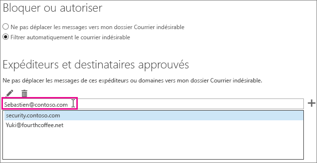

# <a name="how-to-prevent-real-email-from-being-marked-as-spam-in-office-365"></a>Empêcher le courrier d’être marqué comme courrier indésirable dans Office 365

 **Votre courrier est marqué comme courrier indésirable dans Office 365 ? Suivez ces conseils.**

Si vous obtenez un faux positif, merci de signaler le message à Microsoft à l’aide du [complément Utiliser la fonctionnalité de rapport d’un message](https://support.office.com/article/b5caa9f1-cdf3-4443-af8c-ff724ea719d2). En outre, vous pouvez envoyer le message avec [l’Explorateur des envois](/security/office-365-security/admin-submission.md).

## <a name="determine-the-reason-why-the-message-was-marked-as-spam"></a>Identifier pourquoi le message a été marqué comme courrier indésirable

De nombreux problèmes liés aux courriers indésirables dans Office 365 peuvent être résolus en [affichant les en-têtes de messages électroniques](https://support.office.com/article/cd039382-dc6e-4264-ac74-c048563d212c) et en déterminant la cause du problème. Vous devez rechercher un en-tête nommé X-Forefront-Antispam-Report. Vous pouvez consulter la rubrique sur les [en-têtes anti-courrier indésirable](https://technet.microsoft.com/library/dn205071%28v=exchg.150%29.aspx) pour en savoir plus.

Dans l’en-tête, repérez les titres et les valeurs suivantes.

### <a name="x-forefront-antispam-report"></a>X-Forefront-Antispam-Report

- **SFV:SPM** : indique que le message a été marqué comme courrier indésirable en raison des filtres de courrier indésirable EOP.

- **SFV:BLK** : indique que le message a été marqué comme courrier indésirable, car l’adresse d’envoi figure dans la liste des expéditeurs bloqués du destinataire.

- **SFV:SKS** : indique que le message a été marqué comme indésirable avant le filtrage du contenu. Cela peut inclure une règle de flux de courrier (également connue sous le nom de règle de transport) marquant le message comme courrier indésirable. Exécutez un suivi des messages pour voir si une règle de flux de courrier s’est déclenchée, laquelle aurait pu définir un seuil élevé de probabilité de courrier indésirable.

- **SFV:SKB** : indique que le message a été marqué comme courrier indésirable, car il correspond à une liste d’expéditeurs bloqués dans la stratégie de filtrage du courrier indésirable.

- **SFV:Bulk**: indique que la valeur du seuil de réclamation en bloc se trouvant dans l’en-tête x-microsoft-antispam dépasse le seuil en bloc défini pour le filtre de contenu. Le courrier électronique en bloc représente le courrier électronique auquel les utilisateurs se sont abonnés, mais qui demeure néanmoins du courrier indésirable. Dans l’en-tête de message, recherchez la propriété BCL (Bulk Confidence Level) dans l’en-tête X-Microsoft-Antispam. Si la valeur BCL est inférieure au seuil défini dans le filtre anti-courrier indésirable, vous pouvez éventuellement ajuster le seuil plutôt que de marquer ces types de messages en nombre comme courrier indésirable. Chaque utilisateur a une tolérance et des préférences différentes quant à la [gestion du courrier en bloc](https://docs.microsoft.com/microsoft-365/security/office-365-security/bulk-complaint-level-values). Vous pouvez créer des stratégies ou des règles différentes en fonction des préférences des différents utilisateurs.

- **CAT:SPOOF** ou **CAT:PHISH** : indique que le message apparaît comme falsifié. Cela signifie que la source du message ne peut pas être validée et pourrait être suspecte. Si le message est valide, l’expéditeur doit vérifier que sa configuration pour SPF et DKIM est correcte. Consultez l'en-tête Authentication-Results pour plus d'informations. Même s’il peut être difficile de faire en sorte que tous les expéditeurs utilisent les méthodes d’authentification du courrier correctes, il peut être extrêmement dangereux de contourner ces vérifications. Il s’agit en effet de la principale cause des compromissions.

### <a name="x-customspam"></a>x-customspam

- La présence de cet en-tête indique que le message a été marqué comme courrier indésirable, car l’une des [options avancées de filtrage anti-courrier indésirable est activée](https://technet.microsoft.com/library/jj200750%28v=exchg.150%29.aspx) dans votre filtre anti-courrier indésirable. Sauf si vous avez besoin de ces fonctionnalités, nous vous conseillons d’utiliser les paramètres par défaut.

## <a name="solutions-to-additional-causes-of-too-much-spam"></a>Solutions à appliquer en cas de courrier indésirable excessif

Pour travailler efficacement, Exchange Online Protection (EOP) exige que les administrateurs effectuent certaines tâches. Si vous n’êtes pas l’administrateur de votre client Office 365 et que vous recevez trop de courrier indésirable, nous vous recommandons de travailler avec votre administrateur sur ces tâches. Dans le cas contraire, vous pouvez passer directement à la section dédiée aux utilisateurs.

### <a name="for-admins"></a>Pour les administrateurs

- **Faites pointer vos enregistrements DNS vers Office 365** : pour qu’Exchange Online Protection assure la protection, le ou les enregistrements DNS de votre serveur de courrier (MX) pour tous les domaines doivent pointer vers Office 365, et uniquement vers Office 365. Si votre enregistrement MX ne pointe pas vers Office 365, Exchange Online Protection n’assurera pas le filtrage du courrier indésirable pour vos utilisateurs. Si vous souhaitez utiliser un autre service ou appareil pour assurer le filtrage du courrier indésirable de votre domaine, vous pouvez désactiver la protection contre le courrier indésirable dans EOP. Pour ce faire, vous pouvez créer une règle de flux de courrier qui définit la valeur SCL sur -1. Si vous décidez plus tard d’utiliser EOP, veillez à supprimer cette règle de flux de courrier.

- **Activer le complément Signaler le message pour les utilisateurs** : nous vous recommandons vivement d’[activer le complément Signaler le message pour vos utilisateurs](/security/office-365-security/enable-the-report-message-add-in.md).

- **Utiliser l’[Explorateur de soumissions](/security/office-365-security/admin-submission.md)**  : les administrateurs peuvent désormais envoyer des e-mails à l'aide de l'ID de fichier ou de message réseau, les URL et les fichiers à analyser par Microsoft dans Office 365. En tant qu’administrateur, vous pouvez normalement consulter les commentaires de vos utilisateurs et utiliser des modèles pour régler les paramètres pouvant poser problème.

- **Assurez-vous que vos utilisateurs respectent les limites autorisées** pour envoyer et recevoir des e-mails, comme indiqué [ici](https://docs.microsoft.com/fr-FR/office365/servicedescriptions/exchange-online-service-description/exchange-online-limits).

- **Vérifiez les seuils de courrier en bloc**, comme précisé [ici](/security/office-365-security/bulk-complaint-level-values.md).

### <a name="for-users"></a>Pour les utilisateurs

- **Créer une liste d’expéditeurs approuvés** : les utilisateurs peuvent ajouter les adresses des expéditeurs auxquels ils font confiance à leur liste d’expéditeurs approuvés dans [Outlook](https://go.microsoft.com/fwlink/p/?LinkId=270065) ou [Outlook sur le Web](https://go.microsoft.com/fwlink/p/?LinkId=294862) (anciennement connue sous le nom d'Outlook Web App). Pour commencer à utiliser la fonctionnalité dans Outlook sur le Web, sélectionnez **Paramètres** \> **Options** \> **Bloquer ou autoriser**. Le diagramme suivant illustre un exemple de l’ajout d’un élément à une liste d’expéditeurs approuvés.



EOP respecte la liste des expéditeurs et destinataires approuvés des utilisateurs, mais pas les domaines approuvés. Cette règle s'applique indépendamment du fait que le domaine soit ajouté via Outlook sur le web, ou ajouté dans Outlook et synchronisé à l'aide de l'outil Directory Sync (Synchronisation de répertoire).

- **Désactivez le filtrage SmartScreen dans Outlook** : si vous utilisez un ancien client de la version de bureau d’Outlook, vous devez désactiver la fonctionnalité de filtrage SmartScreen, qui n’est plus disponible. Si elle est activée, elle peut générer des faux positifs. Ignorez cette étape si vous exécutez un client de la version de bureau d’Outlook mis à jour.

## <a name="troubleshooting-a-message-ends-up-in-the-junk-folder-even-though-eop-marked-the-message-as-non-spam"></a>Résolution des problèmes : un message se retrouve dans le dossier courrier indésirable même si EOP marqué le message comme n’étant pas du courrier indésirable

Si vos utilisateurs ont l'option activée dans Outlook "Listes sécurisées uniquement : seul le courrier provenant de personnes ou de domaines figurant sur vos listes d'expéditeurs ou de destinataires approuvés sera envoyé dans votre boîte de réception", alors tous les e-mails seront envoyés dans le dossier des courriers indésirables de l'expéditeur, sauf si celui-ci est sur la liste des expéditeurs approuvés par le destinataire. Ceci se produira indépendamment du fait que EOP marque un message comme étant un message non indésirable, ou si vous avez configuré une règle dans EOP pour marquer un message comme non indésirable.

Vous pouvez désactiver l’option des listes sécurisées uniquement en suivant les instructions fournies dans [Outlook : Paramètre de stratégie pour désactiver l’interface utilisateur de courrier indésirable et le mécanisme de filtrage](https://support.microsoft.com/fr-FR/kb/2180568).

Si vous affichez le message dans Outlook sur le web, un conseil de sécurité de couleur jaune s’affiche, indiquant que le message se trouve dans le dossier Courrier indésirable, car l’expéditeur n’est pas dans la liste des expéditeurs approuvés du destinataire.

Si vous examinez l’en-tête d’un message, il peut également inclure le label SFV:SKN (adresses IP autorisées ou ETR autorisé) ou SFV:NSPM (non-courrier indésirable), mais le message est quand-même placé dans le dossier de courrier indésirable de l’utilisateur. Rien dans l’en-tête de message indique que l’utilisateur a activé « Listes approuvées uniquement ». Cela se produit car l’option « Listes approuvées uniquement » définie par les utilisateurs dans Outlook remplace le paramètre EOP.

### <a name="to-verify-why-a-message-from-a-safe-sender-is-marked-as-non-spam-in-the-message-header-but-still-ends-up-in-the-users-junk-folder"></a>Pour vérifier pourquoi un message provenant d’un expéditeur approuvé est marqué comme courrier non-indésirable dans l’en-tête du message, mais se retrouve quand-même dans le dossier courrier indésirable de l’utilisateur

1. Pour découvrir comment vous connecter à Exchange Online PowerShell, voir [Connexion à Exchange Online PowerShell](https://go.microsoft.com/fwlink/p/?LinkId=396554).

2. Exécutez la commande suivante pour afficher les paramètres de configuration concernant le courrier indésirable de l’utilisateur :

  ```Powershell
  Get-MailboxJunkEmailConfiguration example@contoso.com | Format-List TrustedListsOnly,ContactsTrusted,TrustedSendersAndDomains
  ```

- Si TrustedListsOnly est Vrai, cela signifie que ce paramètre est activé.

- Si ContactsTrusted est Vrai, cela signifie que l’utilisateur approuve les contacts et les expéditeurs approuvés.

- TrustedSendersAndDomains répertorie le contenu de la liste des expéditeurs approuvés de l’utilisateur.

## <a name="eop-only-customers-use-directory-synchronization"></a>Clients d’EOP : utilisez la synchronisation d’annuaires

Si vous êtes un client EOP uniquement, c'est-à-dire que vous êtes abonné au service EOP pour l'utiliser avec votre serveur de messagerie local (Exchange), vous devez synchroniser les paramètres utilisateur avec le service en utilisant la synchronisation des répertoires. De cette façon, vous assurez que vos listes d'expéditeurs approuvés sont respectées par EOP. Pour plus d'informations, consultez la rubrique « Utiliser la synchronisation des répertoires pour gérer les utilisateurs de messagerie » dans [Gérer les utilisateurs de messagerie dans EOP](https://go.microsoft.com/fwlink/?LinkId=534098).
